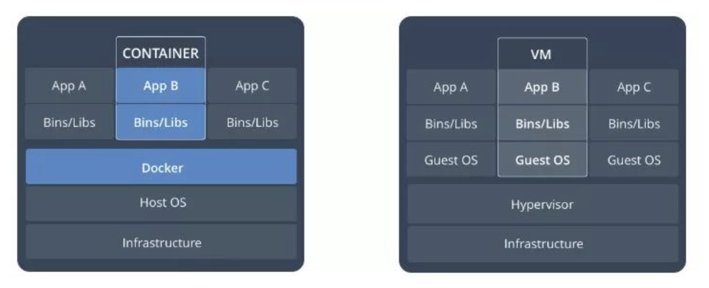
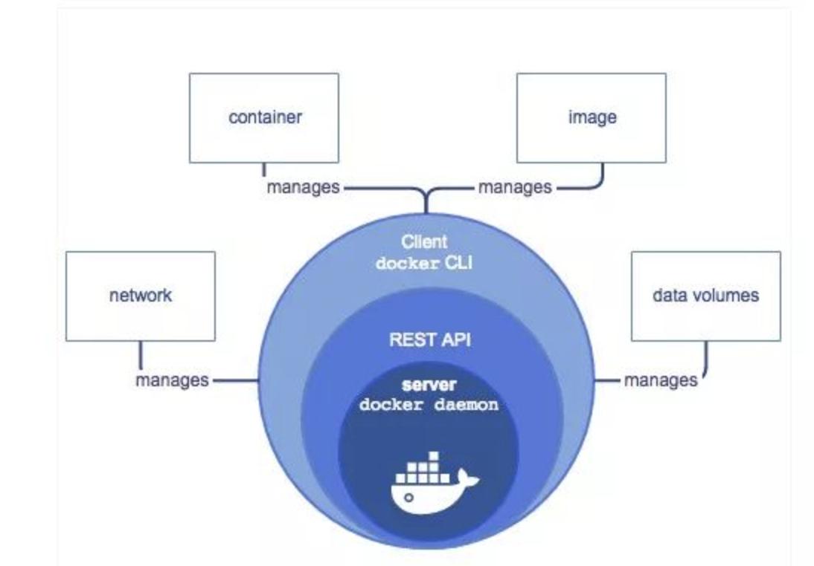
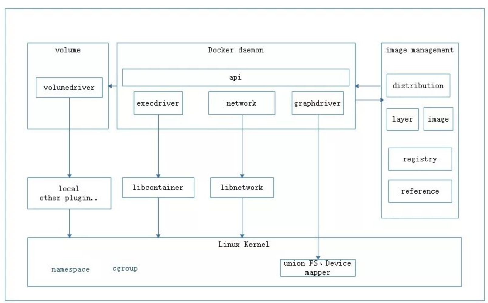
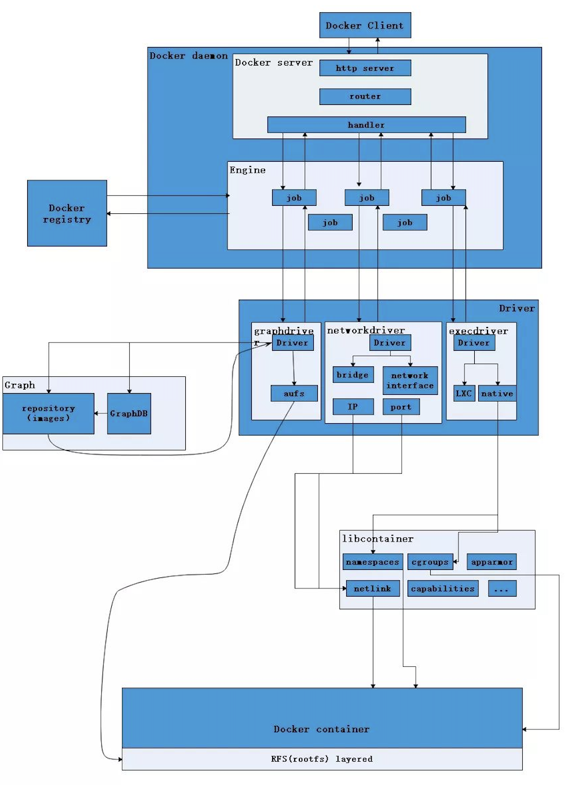
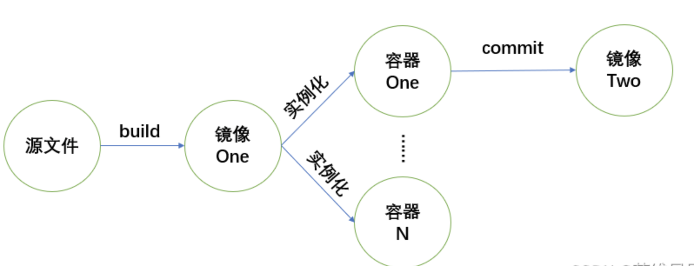

# 1.Docker 简介

## 1.1 Docker 概念

### 1.1.1 LXC

- LXC Linux containers

  - LXC代表Linux Containers（Linux容器），是一种操作系统级别的虚拟化方法，用于在单个主机系统上运行多个隔离的Linux系统（容器）。相当于C++中的NameSpace，LXC提供了一种轻量级和高效的方式来创建和管理这些容器，允许资源隔离和进程分离。
  - 使用LXC创建的容器与主机系统共享相同的内核，但具有自己的文件系统、进程和网络接口。这使得它们与传统的虚拟机（VM）相比更省资源，因为它们不需要运行单独的客户操作系统的开销。
  - LXC通常用于打包和分发带有所有依赖项的应用程序，从而更容易在不同环境中部署软件并保持一致的行为。它已经成为各种容器化平台的基础技术，其中Docker是最知名的实现之一，它在内部使用了LXC。

- 与传统虚拟化技术相比，它的优势在于：

  （1）与宿主机使用同一个内核，性能损耗小；

  （2）不需要指令级模拟；

  （3）不需要即时(Just-in-time)编译；

  （4）容器可以在CPU核心的本地运行指令，不需要任何专门的解释机制；

  （5）避免了准虚拟化和系统调用替换中的复杂性；

  （6）轻量级隔离，在隔离的同时还提供共享机制，以实现容器与宿主机的资源共享。

  ​       总结：Linux Container是一种轻量级的虚拟化的手段。

  ​       Linux Container提供了在单一可控主机节点上支持多个相互隔离的server container同时执行的机制。Linux Container有点像chroot，提供了一个拥有自己进程和网络空间的虚拟环境，但又有别于虚拟机，因为lxc是一种操作系统层次上的资源的虚拟化。

### 1.1.2 Docker


​		Docker 是一种开源的容器化平台，用于轻松地创建、部署和运行应用程序和服务。通过使用 Docker，开发人员可以将应用程序及其所有依赖项打包到一个称为 "容器" 的独立单元中。这使得应用程序可以在不同的环境中一致地运行，无论是开发、测试还是生产环境。

​		以下是 Docker 的一些关键概念：

- **容器（Container）：** 
  - 容器是一个轻量级的独立单元，包括应用程序、依赖项和运行时环境。容器利用操作系统级别虚拟化技术，如 Linux Containers（LXC），来隔离应用程序和其他容器。每个容器都可以运行在相互隔离的环境中，但共享主机操作系统的内核。

- **镜像（Image）：** 
  - 镜像是一个只读的模板，包含了构建容器所需的所有文件和设置。镜像可以看作是一个应用程序和其运行时环境的快照。容器是从镜像创建的，并且可以共享相同的镜像，这使得应用程序的部署变得非常高效。

- **Dockerfile：** 
  - Dockerfile 是一个文本文件，用于定义如何构建 Docker 镜像。通过在 Dockerfile 中指定基础镜像、添加文件、设置环境变量等，开发人员可以自动化地创建自定义的镜像。

- **仓库（Repository）：**
  -  Docker 仓库是用于存储和共享 Docker 镜像的地方。Docker Hub 是一个流行的公共仓库，其中包含了大量的官方和社区创建的镜像。开发人员也可以创建私有仓库来存储自己的镜像。

- **容器编排：**
  -  Docker 提供了一些工具和技术，如 Docker Compose、Docker Swarm 和 Kubernetes，用于管理和编排多个容器，以构建复杂的应用程序架构。

- **跨平台性：** 
  - Docker 提供了跨平台的能力，可以在不同操作系统上运行，包括 Linux、Windows 和 macOS。


​		Docker 的容器化技术使得开发、测试和部署应用程序变得更加高效和可靠，同时也促进了应用程序的可移植性和可伸缩性。

### 1.1.3 LXC和Docker的关系

- 性能对比

  | 方面     | Docker                       | LXC                                        |
  | -------- | ---------------------------- | ------------------------------------------ |
  | 启动速度 | 通常较快                     | 可能稍慢                                   |
  | 资源隔离 | 较高级的隔离，适合大多数应用 | 更接近硬件虚拟化，更严格的隔离             |
  | 存储模型 | 分层的镜像存储，节省磁盘空间 | 传统文件系统，较多磁盘占用                 |
  | 可移植性 | 高可移植性，更标准化         | 相对较低的可移植性                         |
  | 生态系统 | 丰富的工具和服务             | 工具和生态系统较有限                       |
  | 适用条件 | 开发和部署容器化应用程序     | 原始虚拟化，适用于那些需要更严格隔离和控制 |

  

- LXC（Linux Containers）和 Docker 都是容器化技术，但它们在实现和使用上有一些区别。以下是 LXC 和 Docker 之间的主要关系和区别：

  - **基础技术：**
     - LXC 是一种操作系统级别的虚拟化技术，允许在同一个主机操作系统上创建多个隔离的 Linux 容器。每个容器共享主机操作系统的内核，但有独立的文件系统和进程空间。
     - Docker 则是一个基于 LXC 技术的容器化平台，它在 LXC 的基础上构建了一套更高级的工具和流程，使容器的创建、部署和管理更加方便。

  - **抽象层次：**
     - LXC 提供了更接近原始 Linux 容器的抽象层次，需要用户手动管理容器的创建和配置。
     - Docker 提供了更高级的抽象，通过使用 Docker 镜像和容器来隐藏了大部分底层细节，使容器的创建和管理变得更加简单。

  - **镜像和容器：**
     - 在 LXC 中，用户需要手动配置容器的文件系统、进程和网络等。这需要一定的系统管理知识和操作。
     - Docker 引入了镜像的概念，允许用户创建、共享和重用预配置的容器模板。用户可以基于现有的镜像创建容器，这大大简化了容器的部署和管理。

  - **生态系统和工具：**
     - Docker 生态系统更丰富，提供了大量的工具和服务，如 Docker Compose、Docker Swarm 和 Kubernetes，用于容器编排、部署和管理。
     - LXC 虽然也有一些管理工具，但相对于 Docker 的生态系统来说较为有限。

  ​        总的来说，LXC 是底层的操作系统级别虚拟化技术，而 Docker 则在 LXC 的基础上构建了更高级、更易用的容器化平台，使容器的管理和部署变得更加方便和可靠。实际上，Docker 最初就是基于 LXC 技术开发的，但后来它采用了自己的容器运行时（containerd），并在此基础上建立了 Docker 生态系统。

- ​        Docker 和 LXC 都是容器化技术，但它们在性能方面可能会有一些差异，这取决于多个因素，包括应用程序的性质、宿主系统的配置、容器的设置等。以下是 Docker 和 LXC 在性能方面的一些比较考虑因素：

  - **启动速度：**
     - Docker 通常比原始的 LXC 容器启动更快。这是因为 Docker 使用了更高级的镜像层和容器模板，可以跳过某些启动过程，从而加速容器的启动。

  - **资源隔离：**
     - LXC 提供了更接近硬件虚拟化的隔离，每个容器拥有自己的进程空间、文件系统和网络栈。这可能在某些情况下提供更严格的隔离，但也可能导致一些性能开销。
     - Docker 使用容器运行时（containerd）来实现容器的隔离。虽然 Docker 容器的隔离通常足够对大多数应用程序进行分隔，但与 LXC 相比可能略有差异。

  - **存储模型：**
     - Docker 使用分层的镜像存储模型，使得容器可以共享相同的文件层，从而减少磁盘占用和镜像下载时间。这在多个容器使用相同基础镜像时会提供优势。
     - LXC 使用传统的文件系统来创建容器，不具备 Docker 镜像的分层优势。每个容器需要完整复制文件系统，可能导致更多的磁盘空间占用。

  - **可移植性：**
     - Docker 的镜像和容器格式在不同环境中具有更高的可移植性，因为它们更加标准化。这意味着你可以在不同的 Docker 主机上运行相同的容器，而不需要担心底层环境差异。
     - LXC 的可移植性相对较低，因为它更依赖于主机系统的配置和版本。

  ​        总体来说，Docker 通常在大多数应用场景下表现良好，特别是对于开发和部署容器化应用程序而言。它提供了更高级的工具和生态系统，使容器的管理和部署变得更加简单。LXC 则提供了更接近原始虚拟化的体验，适用于那些需要更严格隔离和控制的情况。在选择哪种技术时，你应该考虑你的应用程序需求、性能需求和方便性。

### 1.1.4 Docker 与 VM对比



- 容器时在linux上本机运行，并与其他容器共享主机的内核，它运行的一个独立的进程，不占用其他任何可执行文件的内存，非常轻量。
- 虚拟机运行的是一个完成的操作系统，通过虚拟机管理程序对主机资源进行虚拟访问，相比之下需要的资源更多。

## 1.2 Docker 作用

- ​	Docker 作用

  | 主要作用           | 描述                                                         |
  | ------------------ | ------------------------------------------------------------ |
  | 应用程序打包和分发 | 将应用程序及其依赖项打包到独立的容器中，实现在不同环境中一致运行。 |
  | 环境一致性         | 确保开发、测试和生产环境之间的一致性，减少环境差异导致的问题。 |
  | 快速部署和扩展     | 可快速部署应用程序到目标环境，并通过复制容器实例实现水平扩展。 |
  | 资源隔离和安全性   | 提供隔离的运行环境，增强应用程序的安全性，防止容器之间互相干扰。 |
  | 版本控制和回滚     | 容器可以版本化，支持切换和回滚到不同的应用程序版本。         |
  | 持续集成和持续部署 | 与 CI/CD 工具集成，实现自动化构建、测试和部署，加速开发流程。 |
  | 多租户环境         | 在单个主机上运行多个隔离的容器，适用于构建多租户环境。       |
  | 资源优化           | 容器相对于传统虚拟机更轻量，共享主机内核，减少资源消耗。     |
  | 生态系统           | Docker 生态系统丰富，提供容器编排、监控、日志等工具和服务。  |

  

- ​        Docker 是一种开源的容器化平台，具有许多重要的作用和优势，特别是在开发、部署和管理应用程序时。以下是 Docker 的主要作用：

  1. **应用程序打包和分发：** Docker 允许将应用程序及其所有依赖项打包到一个称为容器的独立单元中。这使得应用程序可以在不同的环境中一致地运行，避免了由于环境差异引起的问题。

  2. **环境一致性：** Docker 确保开发、测试和生产环境之间的一致性。开发人员可以使用相同的容器镜像来运行代码，从而减少由于不同环境而引起的错误。

  3. **快速部署和扩展：** 使用 Docker，应用程序可以更快速地部署到目标环境中，而不需要手动配置和安装依赖项。同时，通过复制容器实例，可以轻松地水平扩展应用程序。

  4. **资源隔离和安全性：** Docker 容器提供隔离的运行环境，防止容器之间相互干扰。这有助于提高应用程序的安全性，因为一个容器的问题不会影响其他容器。

  5. **版本控制和回滚：** Docker 镜像和容器可以版本化，使开发人员可以轻松切换到不同的应用程序版本或回滚到之前的版本。

  6. **持续集成和持续部署（CI/CD）：** Docker 可以与持续集成和持续部署工具集成，从而实现自动化的构建、测试和部署流程，加速开发周期。

  7. **多租户环境：** Docker 可以在单个主机上运行多个隔离的容器，这对于构建多租户环境（如云计算）非常有用。

  8. **资源优化：** Docker 容器相对于传统虚拟机更轻量，它们共享主机操作系统的内核，减少了资源占用。

  9. **生态系统：** Docker 生态系统丰富，提供了许多工具、服务和库，用于容器编排、监控、日志记录等。

  ​        综上所述，Docker 的主要作用在于提供一种标准化、可移植且高效的方式来打包、分发和管理应用程序，以及简化开发和部署流程，从而提高开发效率并降低运维成本。

# 2. Docker 架构

## 2.1 概念

- ​        Docker 的架构是一个客户端-服务器模型，由多个组件相互协作以实现容器化应用程序的创建、部署和管理。以下是 Docker 的基本架构组件：

  1. **Docker 客户端（Docker Client）：** Docker 客户端是用户与 Docker 的交互界面。通过命令行或 Docker API，用户可以与 Docker 服务器通信，执行各种操作，如创建、启动、停止和管理容器。

  2. **Docker 服务器（Docker Daemon）：** Docker 服务器是在宿主系统上运行的后台服务。它负责管理容器的创建、运行和停止，以及与 Docker 客户端进行通信。Docker 服务器还负责管理镜像、网络、数据卷等资源。

  3. **Docker 镜像（Docker Images）：** Docker 镜像是应用程序和其所有依赖项的静态模板。镜像包含了操作系统文件、库、应用程序代码和设置。它是容器的基础，并且可以被共享、版本化和存储在 Docker 仓库中。

  4. **Docker 容器（Docker Containers）：** Docker 容器是从 Docker 镜像创建的运行实例。每个容器都是一个隔离的环境，包含了独立的文件系统、进程和网络。容器可以在主机系统上独立运行，但共享主机操作系统的内核。

  5. **Docker 仓库（Docker Registry）：** Docker 仓库是用于存储和共享 Docker 镜像的地方。Docker Hub 是一个公共仓库，其中包含了大量的官方和社区创建的镜像。用户也可以搭建私有仓库来管理自己的镜像。

  6. **Docker Compose：** Docker Compose 是一个工具，用于定义和运行多个 Docker 容器的应用程序。通过一个单独的配置文件，用户可以定义应用程序的各个组件、依赖关系和设置，然后一键启动整个应用。

  7. **容器编排工具（Orchestration Tools）：** Docker 生态系统中还包括了各种容器编排工具，如 Docker Swarm 和 Kubernetes。这些工具用于管理和编排多个容器，构建复杂的应用程序架构，实现高可用性和扩展性。

  ​        Docker 的架构允许开发人员将应用程序及其依赖项打包成容器，并在不同环境中运行，从而提高了应用程序的可移植性、一致性和效率。


## 2.2 架构图

### 2.2.1 基础



- server端：
  - 架构docker daemon就是docker的守护进程，可以是远程的，也可以是本地的，
- client端：
  - docker cli 用来管理容器和镜像，客户端提供一个只读镜像，然后通过镜像可以创建多个容器，这些容器可以只是一个RFS（Root file system根文件系统），也可以ishi一个包含了用户应用的RFS，容器再docker client中只是要给进程，两个进程之间互不可见。用户不能与server直接交互，但可以通过与容器这个桥梁来交互，由于是操作系统级别的虚拟技术，中间的损耗几乎可以不计。
- C/S通信：
  - 客户端Docker client 是通过rest api进行通信。

### 2.2.2 运行




- image management

  - distribution 负责与docker registry交互，上传洗澡镜像以及v2 registry 有关的源数据

  - registry负责docker registry有关的身份认证、镜像查找、镜像验证以及管理registry mirror等交互操作
  - image 负责与镜像源数据有关的存储、查找，镜像层的索引、查找以及镜像tar包有关的导入、导出操作
  - reference负责存储本地所有镜像的repository和tag名，并维护与镜像id之间的映射关系
  - layer模块负责与镜像层和容器层源数据有关的增删改查，并负责将镜像层的增删改查映射到实际存储镜像层文件的graphdriver模块

- docker daemon

  - graghdriver是所有与容器镜像相关操作的执行者




1. 守护进程  Docker Daemon

   - 用户是使用Docker Client与Docker Daemon建立通信，并发送请求给后者。

   - Daemon中操作
     1. 首先提供Server的功能使其可以接受Docker Client的请求
     2. 而后Engine执行Docker内部的一系列工作
     3. 每一项工作都是以一个Job的形式的存在

2. 镜像 Docker registry

   - Docker registry 提供镜像下载

3. 驱动 Driver

   - graph driver
     - 将下载的镜像以 Gragh 形式存储
   - network driver
     - 创建并配置Docker容器网络环境
   - exec driver
     - 限制Docker容器运行资源或执行用户指令等操作

4. 容器管理包 libcontainer

   - networkdriver以及execdriver都是通过libcontainer来实现具体对容器进行的操作


# 3.Docker 核心

## 3.1 镜像

### 3.1.1 镜像概念和原理

- 概念

  - Docker 镜像是 Docker 容器的基础，它是一个只读的模板，包含了构建容器所需的所有文件、库、配置和设置。镜像可以用于创建多个相同的容器实例，使得应用程序的部署和分发更加便捷和可靠。以下是有关 Docker 镜像的一些重要信息：

    - **镜像层（Image Layers）：** Docker 镜像由一系列的分层组成，每一层包含了特定的文件和设置。这些层可以通过继承的方式构建，从一个基础镜像开始，逐步添加所需的文件和配置。这种分层的结构使镜像可以更有效地共享和存储，因为多个镜像可以共享相同的层。

    - **镜像标签（Image Tags）：** 镜像可以使用标签进行版本控制和命名。标签通常用于区分不同版本的镜像，例如 `latest`、`v1.0` 等。一个标签指向一个特定的镜像层，通过使用标签，可以轻松切换到不同的镜像版本。

      - ​        Docker 镜像标签是用于标识和区分不同版本的镜像的可选标识符。一个镜像可以有多个标签，每个标签可以代表不同的版本、配置或用途。镜像标签通常与镜像的名称组合在一起，形成 `repository:tag` 的格式。

        ​        以下是关于 Docker 镜像标签的一些重要信息：

        1. **格式：** 镜像标签以字符串形式表示，可以包括字母、数字、句点、短划线和下划线。通常使用小写字母。

        2. **默认标签：** 如果不明确指定标签，Docker 会默认使用 `latest` 标签。例如，`ubuntu` 等价于 `ubuntu:latest`。

        3. **版本控制：** 标签常用于指定镜像的不同版本。例如，`ubuntu:20.04` 表示 Ubuntu 20.04 版本的镜像。

        4. **用途区分：** 标签还可以用于区分不同用途的镜像。例如，`web-app:production` 和 `web-app:testing` 表示同一个应用程序的不同环境。

        5. **替代 `latest`：** 使用 `latest` 标签来获取最新版本的镜像可能会导致不稳定，因为它会随着每次构建而变化。因此，建议使用明确的版本标签来确保稳定性。

        6. **批量修改：** 镜像标签的修改只影响标签本身，不会影响镜像内容。可以使用 `docker tag` 命令来为已有的镜像添加新标签。

        示例用法：

        - 拉取特定版本的 Ubuntu 镜像：
          ```bash
          docker pull ubuntu:20.04
          ```

        - 为已有镜像添加新标签：
          ```bash
          docker tag ubuntu:20.04 my-ubuntu-image:latest
          ```

        通过使用标签，你可以更好地管理和识别不同版本、不同用途的镜像，确保容器和应用程序使用正确的镜像版本。

    - **Dockerfile：** Docker 镜像通常是通过 Dockerfile 创建的。Dockerfile 是一个文本文件，包含了一系列指令，用于定义如何构建镜像。它可以指定基础镜像、添加文件、运行命令、设置环境变量等。

    - **构建镜像：** 使用 Dockerfile 可以构建一个新的镜像。通过运行 `docker build` 命令，Docker 将按照 Dockerfile 中的指令逐步构建镜像。每一条指令都会在前一层的基础上添加新的层，最终形成完整的镜像。

    - **仓库和分发：** 构建完成的镜像可以被推送到 Docker 仓库中，这可以是公共的 Docker Hub，也可以是私有的仓库。其他用户可以从仓库中拉取镜像到他们的本地环境中。

    - **基础镜像（Base Images）：** 镜像可以基于一个基础镜像构建。基础镜像通常包含了操作系统、基本工具和一些常用的库。开发人员可以在基础镜像的基础上构建自己的镜像，添加所需的应用程序和设置。

    - **多阶段构建（Multi-Stage Builds）：** Docker 还支持多阶段构建，允许在单个 Dockerfile 中定义多个构建阶段，从而减少最终镜像的大小，只保留运行时所需的文件和库。

  - ​        总之，Docker 镜像是容器化技术的核心，它们为应用程序和服务提供了一个可移植、一致和可靠的分发方式。镜像可以通过层次结构、标签和版本控制来管理，从而方便地进行构建、部署和维护。

- 原理

  - Docker 镜像的工作原理涉及分层文件系统、镜像构建、镜像共享和容器启动等多个方面。以下是 Docker 镜像的工作原理的详细解释：

    1. **分层文件系统（Layered File System）：** Docker 镜像采用分层文件系统的设计。每个镜像由多个只读的文件系统层构成，每一层都是前一层的基础，包含了文件、目录和配置等信息。这种分层的结构使得镜像可以有效地共享和存储，同时在创建容器时，可以快速地在现有层上添加新的层。

    2. **镜像构建和 Dockerfile：** Docker 镜像可以通过 Dockerfile 进行构建。Dockerfile 是一个文本文件，其中包含了一系列指令，用于定义如何构建镜像。每个指令都会在镜像的基础层上创建一个新的层。构建过程可以包括从基础镜像开始、安装依赖、复制文件、运行命令等。

    3. **镜像标签和 ID：** 镜像可以通过标签来识别，标签通常用于区分不同版本的镜像。每个镜像还有一个唯一的 ID，它是一个哈希值，基于镜像的内容生成。标签和 ID 一起用于在 Docker 系统中唯一标识和引用镜像。

    4. **容器层和可写容器：** 当启动容器时，Docker 会在镜像的顶部添加一个可写的容器层。这个可写容器层允许容器运行时对文件系统进行读写操作。容器可以修改和添加文件，但不会影响到底层的只读镜像层。

    5. **镜像共享和分发：** 镜像可以通过 Docker 仓库进行共享和分发。Docker Hub 是一个公共的仓库，用户可以从中拉取官方和社区创建的镜像。用户也可以构建私有仓库来存储和共享自己的镜像。

    6. **多阶段构建：** Docker 支持多阶段构建，允许在一个 Dockerfile 中定义多个构建阶段。这样可以减小最终镜像的大小，只保留运行时所需的文件和库。

    7. **容器启动：** 当启动容器时，Docker 使用镜像层和容器层创建一个运行时实例。容器层允许容器在镜像的基础上进行读写操作，创建一个隔离的运行环境，运行应用程序和服务。

  - ​        综合起来，Docker 镜像的工作原理基于分层文件系统的设计，通过构建、共享和部署镜像，实现了容器化应用程序的高效管理和部署。容器在启动时使用镜像作为基础，运行时创建一个隔离的运行环境，使得应用程序可以在不同环境中一致地运行。

### 3.1.2 镜像操作


| 命令            | 说明                                                         |
| --------------- | ------------------------------------------------------------ |
| `docker pull`   | 从容器注册表下载Docker镜像到本地计算机。                     |
| `docker images` | 列出本地计算机上存在的Docker镜像。                           |
| `docker commit` | 基于对运行中容器所做的更改创建新的Docker镜像。               |
| `docker build`  | 根据Dockerfile创建新的Docker镜像。                           |
| `docker save`   | 将一个或多个Docker镜像保存为tarball归档文件，用于在系统间传输和共享。 |
| `docker load`   | 从tarball归档文件中加载Docker镜像到本地计算机。              |
| `docker rmi`    | 从本地计算机中删除一个或多个Docker镜像。                     |


#### 3.1.2.1 获取镜像 docker pull 

- `docker pull` 是 Docker 命令行工具中用于从 Docker 仓库中拉取（下载）镜像的命令。当你想要获取一个特定镜像并在本地使用它时，你可以使用这个命令。以下是 `docker pull` 命令的基本用法：

  ```bash
  docker pull [OPTIONS] NAME[:TAG|@DIGEST]
  ```

  - `OPTIONS`：可以包括一些选项，如 `--quiet`（只输出镜像 ID）等。
  - `NAME`：表示镜像的名称，可以是官方或个人创建的镜像。例如，`ubuntu` 表示拉取官方的 Ubuntu 镜像。
  - `TAG`：表示镜像的标签，通常用于指定不同版本的镜像。如果不指定标签，默认为 `latest`。
  - `DIGEST`：表示镜像的哈希值，也可以用于唯一标识镜像版本。

  示例用法：

  1. 拉取最新版本的 Ubuntu 镜像：
     ```bash
     docker pull ubuntu
     ```

  2. 拉取特定版本的 Ubuntu 镜像（通过标签）：
     ```bash
     docker pull ubuntu:20.04
     ```

  3. 拉取镜像并只输出镜像 ID（使用 `--quiet` 选项）：
     ```bash
     docker pull --quiet ubuntu
     ```

  4. 拉取具有特定哈希值的镜像版本：
     ```bash
     docker pull ubuntu@sha256:abcdef123456...
     ```

  通过使用 `docker pull` 命令，你可以获取所需的镜像，以便后续在容器中使用。这是 Docker 镜像管理的重要步骤之一。


#### 3.1.2.2 列出镜像 docker images


- `docker images` 是 Docker 命令行工具的一部分，用于列出本地计算机上存在的所有 Docker 镜像。这个命令可以帮助你查看本地系统中已经下载或构建的镜像，以及它们的标签、大小、创建时间等信息。

  以下是 `docker images` 命令的基本用法：

  ```bash
  docker images [OPTIONS] [REPOSITORY[:TAG]]
  ```

  - `OPTIONS`：可以包含一些选项，如 `--quiet`（只输出镜像 ID）等。
  - `REPOSITORY`：表示镜像的名称，用于筛选要显示的镜像。例如，`ubuntu` 表示只显示属于 `ubuntu` 仓库的镜像。
  - `TAG`：表示镜像的标签，通常用于指定不同版本的镜像。

  示例用法：

  1. 列出所有本地镜像：
     ```bash
     docker images
     ```

  2. 列出特定仓库的镜像：
     ```bash
     docker images ubuntu
     ```

  3. 列出特定版本的镜像：
     ```bash
     docker images ubuntu:20.04
     ```

  4. 只输出镜像 ID（使用 `--quiet` 选项）：
     ```bash
     docker images --quiet
     ```

- ​        通过使用 `docker images` 命令，你可以快速查看本地系统上已有的镜像，了解它们的相关信息，有助于管理和维护本地的镜像资源。

#### 3.1.2.3 创建镜像

##### 3.1.2.3.1 修改原有镜像  docker commit

​		先使用下载的镜像启动容器。

```bash
$ sudo docker run -t -i training/sinatra /bin/bash
root@0b2616b0e5a8:/#
```

​		注意：记住容器的 ID，稍后还会用到。

​		在容器中添加 json 和 gem 两个应用。

```bash
root@0b2616b0e5a8:/# gem install json
```

​		当结束后，我们使用 exit 来退出，现在我们的容器已经被我们改变了，使用 `docker commit` 命令来提交更新后的副本。

```bash
$ sudo docker commit -m "Added json gem" -a "Docker Newbee" 0b2616b0e5a8 ouruser/sinatra:v2
4f177bd27a9ff0f6dc2a830403925b5360bfe0b93d476f7fc3231110e7f71b1c
```

​		其中，`-m` 来指定提交的说明信息，跟我们使用的版本控制工具一样；`-a` 可以指定更新的用户信息；之后是用来创建镜像的容器的 ID；最后指定目标镜像的仓库名和 tag 信息。创建成功后会返回这个镜像的 ID 信息。

​		使用 `docker images` 来查看新创建的镜像。

```bash
$ sudo docker images
REPOSITORY          TAG     IMAGE ID       CREATED       VIRTUAL SIZE
training/sinatra    latest  5bc342fa0b91   10 hours ago  446.7 MB
ouruser/sinatra     v2      3c59e02ddd1a   10 hours ago  446.7 MB
ouruser/sinatra     latest  5db5f8471261   10 hours ago  446.7 MB
```

​		之后，可以使用新的镜像来启动容器

```bash
$ sudo docker run -t -i ouruser/sinatra:v2 /bin/bash
root@78e82f680994:/#
```


##### 3.1.2.3.2 创建新镜像 docker file docker build


​		在 Docker 中，镜像的分层结构和不可更改性使得直接修改现有的镜像变得不太直接。通常情况下，推荐的做法是通过 Dockerfile 来创建一个新的镜像，将修改应用于新的镜像。

​		以下是修改镜像的一般步骤：

1. **创建 Dockerfile：** 在你要修改的镜像的基础上，创建一个新的 Dockerfile。你可以使用基础镜像的名称作为 `FROM` 指令，然后根据需要在新的 Dockerfile 中添加其他指令。

2. **在 Dockerfile 中应用修改：** 编辑新的 Dockerfile，在其中应用你想要的修改，如添加文件、运行命令、设置环境变量等。

3. **构建新镜像：** 在 Dockerfile 所在目录中，运行以下命令构建新的镜像：
   ```bash
   docker build -t new-image:tag .
   ```
   这会在当前目录中的 Dockerfile 中构建一个名为 `new-image`、带有标签 `tag` 的新镜像。

4. **运行容器：** 使用新创建的镜像来运行容器，以测试修改是否成功：
   ```bash
   docker run -d new-image:tag
   ```

5. **验证修改：** 登录到运行的容器中，验证修改是否按预期生效。如果发现问题，可以返回到步骤 2，进行调整并重新构建新镜像。

​		总之，修改镜像的最佳做法是通过创建一个新的 Dockerfile，应用所需的修改，然后构建新的镜像。这样可以确保镜像的不可变性，并且可以更好地管理和维护镜像的变化。


- 举例

  - ​        当需要修改现有的镜像时，通常的做法是创建一个新的 Dockerfile，基于原始镜像进行修改，并构建一个新的镜像。下面以修改一个基础的 Nginx 镜像为例来说明：

    ​        假设你想要修改 Nginx 镜像，向其中添加一个自定义的 HTML 页面。

    1. **创建 Dockerfile：** 首先，在一个空文件夹中创建一个名为 `Dockerfile` 的文件。

    2. **编辑 Dockerfile：** 使用任何文本编辑器打开 `Dockerfile` 并添加以下内容：

       ```Dockerfile
       # 使用基础的 Nginx 镜像作为起点
       FROM nginx:latest

       # 将自定义的 HTML 页面复制到容器中
       COPY custom-index.html /usr/share/nginx/html/index.html
       ```

       在这个例子中，`custom-index.html` 是你自己创建的 HTML 文件。

    3. **创建 HTML 文件：** 在同一目录下创建一个名为 `custom-index.html` 的文件，内容可以是你自己编写的 HTML 代码。

    4. **构建新镜像：** 在 Dockerfile 所在目录中，运行以下命令构建新的镜像：

       ```bash
       docker build -t custom-nginx .
       ```

       这会基于你创建的 Dockerfile 构建一个名为 `custom-nginx` 的新镜像。

    5. **运行容器：** 使用新创建的镜像来运行一个容器，以验证修改是否成功：

       ```bash
       docker run -d -p 8080:80 custom-nginx
       ```

       这会在容器内部的 Nginx 服务器上启动一个 HTTP 服务。

    6. **访问验证：** 打开浏览器，访问 `http://localhost:8080`，你应该能够看到你添加的自定义 HTML 页面。

    ​        通过这个例子，你可以看到如何使用 Dockerfile 创建一个新的镜像，向其中添加了自定义的内容。这种做法保持了镜像的不可变性，同时也使得修改和定制变得清晰和可维护。


#### 3.1.2.4 保存镜像至本地 `docker save - o imageself`

​		将 Docker 镜像保存为本地文件可以通过 `docker save` 命令来实现。这将把一个或多个镜像打包成一个 tar 归档文件，以便你可以在其他地方加载这些镜像。以下是保存镜像至本地的步骤：

1. **确定要保存的镜像：** 首先，确定你想要保存的镜像名称和标签，以及可能的其他镜像。你可以使用 `docker images` 命令查看本地的镜像列表。

2. **使用 `docker save` 命令：** 在终端中运行以下命令来保存一个或多个镜像至本地文件：

   ```bash
   docker save -o image-archive.tar image-name[:tag] [image-name2[:tag]] ...
   ```

   - `-o`：表示输出文件的选项。
   - `image-name[:tag]`：要保存的镜像的名称和标签。

   例如，保存一个名为 `my-image`、标签为 `latest` 的镜像：

   ```bash
   docker save -o my-image.tar my-image:latest
   ```

3. **等待保存完成：** Docker 将会将指定的镜像及其依赖保存到 tar 文件中。这可能需要一些时间，具体时间取决于镜像的大小。

4. **确认保存结果：** 在保存完成后，你将在当前工作目录中看到一个名为 `image-archive.tar` 的文件。

​		现在你已经将镜像保存为本地文件，你可以将这个文件拷贝到其他地方或传输给其他机器，并使用 `docker load` 命令来加载这些镜像到其他 Docker 环境中。

#### 3.1.2.5 加载镜像  `docker load - i imageself`

​		加载保存在本地文件中的 Docker 镜像可以通过 `docker load` 命令来实现。这将会解压缩之前使用 `docker save` 命令保存的镜像 tar 归档文件，并将镜像加载到你的本地 Docker 环境中。以下是加载镜像的步骤：

1. **确定要加载的镜像文件：** 首先，确认你之前使用 `docker save` 命令保存的镜像 tar 归档文件的位置和名称。

2. **使用 `docker load` 命令：** 在终端中运行以下命令来加载之前保存的镜像至本地 Docker 环境：

   ```bash
   docker load -i image-archive.tar
   ```

   - `-i`：表示输入文件的选项。
   - `image-archive.tar`：之前保存的镜像 tar 归档文件的名称。

   例如，加载一个名为 `my-image.tar` 的镜像文件：

   ```bash
   docker load -i my-image.tar
   ```

3. **等待加载完成：** Docker 将会解压缩并加载镜像到你的本地 Docker 环境中。这可能需要一些时间，具体时间取决于镜像的大小。

4. **确认加载结果：** 使用 `docker images` 命令查看本地的镜像列表，确认之前加载的镜像是否成功加载。

现在，你已经成功将之前保存的镜像加载到了你的本地 Docker 环境中，你可以使用这些镜像来创建和运行容器。


#### 3.1.2.6 删除镜像 `docker rmi`

​		要删除本地计算机上的 Docker 镜像，你可以使用 `docker rmi` 命令。以下是删除镜像的一般步骤：

1. **确定要删除的镜像：** 首先，确定你想要删除的镜像名称和标签。你可以使用 `docker images` 命令查看本地的镜像列表。

2. **使用 `docker rmi` 命令：** 在终端中运行以下命令来删除一个或多个本地镜像：

   ```bash
   docker rmi image-name[:tag] [image-name2[:tag]] ...
   ```

   - `image-name[:tag]`：要删除的镜像的名称和标签。

   例如，删除一个名为 `my-image`、标签为 `latest` 的镜像：

   ```bash
   docker rmi my-image:latest
   ```

   或者，可以删除多个镜像：

   ```bash
   docker rmi my-image:latest other-image:tag
   ```

3. **等待删除完成：** Docker 将会删除指定的镜像及其依赖。这可能需要一些时间，具体时间取决于镜像的大小和依赖关系。

4. **确认删除结果：** 使用 `docker images` 命令查看本地的镜像列表，确认之前删除的镜像是否已经被成功删除。

​		需要注意的是，你不能删除正在运行的容器所使用的镜像。如果想要删除一个镜像，首先需要停止使用该镜像的所有容器。如果某个镜像是其他镜像的依赖，你也需要考虑它们之间的依赖关系。


## 3.2 容器

​		



​		下面是关于镜像和容器的关系的表格：

| 概念 | 描述                                                         |
| ---- | ------------------------------------------------------------ |
| 镜像 | - 镜像是只读模板，包含应用程序的一切内容。<br>- 镜像可以被分享和存储在 Docker 仓库中。<br>- 通常是不可更改的，要修改通常需要创建新镜像。<br>- 是应用程序的构建和分发单元。 |
| 容器 | - 容器是镜像的可运行实例，包含运行时状态。<br>- 可以启动、停止、删除，是镜像的运行时表现形式。<br>- 使用镜像提供的文件和设置，有自己的文件系统、进程、网络和资源。<br>- 是应用程序的运行时实体。 |
| 关系 | - 容器是镜像的实例化，基于同一个镜像创建多个独立的容器。<br>- 镜像提供应用程序的内容和构建，容器提供应用程序的运行时环境。<br>- 镜像可以被多个容器共享，每个容器都是独立的隔离实例。 |

​		这个表格总结了镜像和容器的关键概念以及它们之间的关系。


### 3.2.1 容器概念和原理


​		容器是一种轻量级的虚拟化技术，用于在操作系统层面隔离应用程序及其依赖，以实现应用程序的高度可移植性和可部署性。容器提供了一个隔离的运行环境，使得应用程序可以在不同的环境中一致地运行，而不受底层操作系统和硬件的影响。

​		以下是容器的基本概念和工作原理：

- **容器的概念：**

  - **隔离性：** 容器使用操作系统的内核级隔离机制，如命名空间（namespaces）和控制组（cgroups），将不同的应用程序及其资源隔离开，避免相互干扰。


  - **轻量级：** 与传统虚拟机相比，容器共享宿主操作系统的内核，因此容器更轻量级、启动更快、资源消耗更少。


  - **可移植性：** 容器封装了应用程序及其依赖，可以在不同的环境中运行，保持一致的行为，从开发到测试再到生产环境。


  - **可部署性：** 容器可以在短时间内快速部署、启动和停止，适合动态的扩展和缩减应用程序。


- **容器的工作原理：**

  - **镜像：** 容器是基于镜像创建的，镜像包含了应用程序的代码、库、依赖以及运行时所需的文件和设置。镜像是只读的，保证了应用程序在不同环境中的一致性。


  - **容器运行时：** 容器运行时负责在宿主操作系统上创建和管理容器实例。常见的容器运行时包括 Docker、containerd 和 rkt。


  - **容器引擎：** 容器引擎是管理容器生命周期的软件，负责创建、启动、停止和删除容器。Docker 是最常见的容器引擎之一。


  - **命名空间和控制组：** 容器使用命名空间隔离进程间的视图，包括进程 ID、网络、文件系统等。控制组用于限制资源的使用，如 CPU、内存、磁盘等。


  - **容器网络：** 容器可以具有自己的网络命名空间，通过网络桥接或其他方式与宿主操作系统和其他容器进行通信。


  - **存储：** 容器可以有自己的文件系统视图，可以使用宿主操作系统上的文件系统，也可以通过数据卷（volumes）与宿主共享数据。


​         综合起来，容器技术通过隔离、轻量级和可移植的特性，使得应用程序更易于开发、部署和管理，提高了应用程序的可靠性和可扩展性。

### 3.2.2 容器操作


| 命令            | 说明                                             |
| --------------- | ------------------------------------------------ |
| `docker run`    | 从一个Docker镜像创建并运行一个容器。             |
| `docker start`  | 启动一个已停止的容器。                           |
| `docker export` | 将容器的文件系统导出为一个压缩的归档文件。       |
| `docker import` | 从导出的归档文件导入一个新的Docker镜像。         |
| `docker rm`     | 删除一个已停止的容器。                           |
| `docker rm -f`  | 强制删除一个容器，即使它正在运行。               |
| `docker exec`   | 在正在运行的容器内部执行命令。                   |
| `docker run -d` | 以守护态（后台）模式从Docker镜像创建并运行容器。 |
| `docker stop`   | 优雅地停止一个正在运行的容器。                   |
| `docker kill`   | 强制终止一个容器，即使它正在正常运行。           |


#### 3.2.2.1 载入容器 docker run docker start

​		当你想要从一个Docker镜像创建一个容器并运行它时，你可以使用`docker run`命令。下面是`docker run`命令的基本格式和一些常用的选项：

```
docker run [OPTIONS] IMAGE [COMMAND] [ARG...]
```

​		其中，`IMAGE`是你想要使用的Docker镜像的名称或ID。`COMMAND`和`ARG`是可选的，它们表示在容器内部要执行的命令以及传递给该命令的参数。

​		以下是一些常用的`docker run`选项：

- `-d`：将容器在后台运行（以分离模式）。
- `--name`：为容器指定一个自定义名称。
- `-p`：将主机端口映射到容器内部的端口。
- `-v`：将主机目录挂载到容器内部，实现数据持久化。
- `--env`：设置环境变量。

​		以下是一个示例，展示如何使用`docker run`命令来从镜像创建并运行一个容器：

```sh
docker run -d --name my_container -p 8080:80 -v /host/data:/container/data --env MYSQL_PASSWORD=securepassword nginx:latest
```

​		这个示例中，我们从`nginx:latest`镜像创建一个名为`my_container`的容器，在后台运行，并将主机的8080端口映射到容器的80端口。同时，将主机的`/host/data`目录挂载到容器的`/container/data`目录，还设置了一个名为`MYSQL_PASSWORD`的环境变量。

​		请注意，一旦容器停止运行，你可以使用`docker start`命令来重新启动它，如果你要启动之前创建的已停止容器。

#### 3.2.2.2 导入和导出 容器 docker export docker import

- 导入容器 docker export 

- 导出容器 docker import

- 代码

  - 如果你想要将一个已经存在的容器导出为一个Docker镜像文件（tarball归档文件），以便在其他系统上导入使用，你可以使用`docker export`命令。然后，你可以使用`docker import`命令将这个导出的镜像文件导入为一个新的Docker镜像。

    下面是这两个命令的基本用法：

    1. 导出容器为镜像文件：
       
       使用`docker export`命令将容器的文件系统导出为一个tarball归档文件。以下是命令的基本格式：

       ```sh
       docker export CONTAINER_ID > container_export.tar
       ```

       替换`CONTAINER_ID`为你要导出的容器的ID。

    2. 导入镜像文件为新镜像：

       使用`docker import`命令将导出的镜像文件导入为一个新的Docker镜像。以下是命令的基本格式：

       ```sh
       cat container_export.tar | docker import - new_image_name:tag
       ```

       替换`container_export.tar`为你之前导出的文件的路径，`new_image_name:tag`为你想要为新镜像指定的名称和标签。

    请注意，通过这种方式导出和导入容器的文件系统，你将丢失容器的元数据和历史记录，只能获取到一个文件系统快照。如果你需要完整的镜像，建议使用Docker镜像的构建和保存（`docker build`和`docker save`）方式，这样可以保留完整的元数据和历史信息。

    以下是一个简化的示例，演示如何导出容器并将其导入为新镜像：

    ```sh
    # 导出容器为镜像文件
    docker export CONTAINER_ID > container_export.tar
    
    # 导入镜像文件为新镜像
    cat container_export.tar | docker import - new_image:latest
    ```

    这个示例将容器导出为`container_export.tar`文件，然后将其导入为一个名为`new_image`的新镜像。

#### 3.2.2.3 删除容器 docker rm docker rm -f

​		要删除一个已经停止的容器，你可以使用`docker rm`命令。以下是这个命令的基本格式：

```sh
docker rm [OPTIONS] CONTAINER [CONTAINER...]
```

​		其中，`CONTAINER`是要删除的一个或多个容器的名称或ID。

示例：

```sh
docker rm my_container
```

​		这将删除名为`my_container`的容器。

​		如果你想要删除正在运行的容器，可以使用`docker rm`命令的`-f`选项（或`--force`）：

```sh
docker rm -f my_running_container
```

​		这将强制删除名为`my_running_container`的正在运行的容器。

记住，在删除容器之前，请确保你不再需要它，因为一旦删除，相关的数据和设置也将丢失。如果你想保留数据和设置，你可以在删除之前将它们导出或备份。

#### 3.2.2.4 启动容器 docker start docker exec

​		要启动一个已经创建但处于停止状态的容器，你可以使用`docker start`命令。以下是这个命令的基本格式：

```sh
docker start [OPTIONS] CONTAINER [CONTAINER...]
```

​		其中，`CONTAINER`是你要启动的一个或多个容器的名称或ID。

示例：

```sh
docker start my_container
```

​		这将启动名为`my_container`的容器。

​		如果你想要在启动容器时进入其命令行终端，你可以使用`docker exec`命令。例如：

```sh
docker exec -it my_container bash
```

​		这将以交互式模式运行名为`my_container`的容器，并在其中启动一个Bash终端。你可以将`bash`替换为其他你想要执行的命令。

​		请注意，只有停止状态的容器可以被启动。如果容器已经在运行，你将无法使用`docker start`命令来启动它。

#### 3.2.2.5 守护态运行 docker run -d 

​		要在守护态（后台）运行一个容器，你可以使用`docker run`命令的`-d`选项，该选项会将容器在后台运行。以下是命令的基本格式：

```sh
docker run -d [OPTIONS] IMAGE [COMMAND] [ARG...]
```

​		其中，`-d`表示以守护态（后台）运行容器，`IMAGE`是要使用的Docker镜像的名称或ID，`COMMAND`和`ARG`是可选的，表示在容器内部要执行的命令及其参数。

示例：

```sh
docker run -d --name my_daemon_container nginx:latest
```

​		这将从`nginx:latest`镜像创建一个名为`my_daemon_container`的容器，并以守护态在后台运行。

一旦容器以守护态运行，你可以使用`docker ps`命令来查看正在运行的容器。如果你需要与容器交互，你可以使用`docker exec`命令来进入容器的命令行终端，就像之前我提到的一样。

​		记住，在守护态运行的容器不会显示标准输出和标准错误输出，除非你显式地将它们重定向到日志文件或使用Docker日志功能。	


#### 3.2.2.6 终止容器 docker stop docker kill


​		要终止正在运行的容器，你可以使用`docker stop`命令。这个命令会发送一个停止信号给容器，然后容器会优雅地停止运行。以下是命令的基本格式：

```sh
docker stop [OPTIONS] CONTAINER [CONTAINER...]
```

​		其中，`CONTAINER`是你要停止的一个或多个容器的名称或ID。

示例：

```sh
docker stop my_container
```

​		这将发送停止信号给名为`my_container`的容器，使其停止运行。

​		如果你需要立即终止容器而不等待它优雅地停止，你可以使用`docker kill`命令：

```sh
docker kill my_container
```

​		这将强制终止名为`my_container`的容器，不管它是否正在正常运行。

​		 请注意，在终止容器之前，你可以使用`docker ps`命令来查看所有正在运行的容器。终止容器时，建议首先尝试使用`docker stop`以获得更平滑的停止过程，只有在必要时才使用`docker kill`进行强制终止。

## 3.3 仓库


### 3.3.1 仓库概念和原理


​		Docker仓库是用于存储、共享和管理Docker镜像的中心化平台。它允许开发者将自己创建的Docker镜像上传到仓库，以便其他人可以轻松地获取和使用这些镜像。Docker仓库有两种类型：公共仓库和私有仓库。

1. **公共仓库**：最著名的公共Docker仓库是Docker Hub。它是一个官方维护的平台，允许开发者分享和获取Docker镜像。在Docker Hub上，你可以找到大量的官方和社区创建的镜像，用于构建各种应用和环境。

2. **私有仓库**：除了公共仓库外，你还可以设置自己的私有Docker仓库。这样，你可以在内部共享和管理镜像，适用于企业、团队或个人需要保护镜像安全性和私密性的情况。Docker官方提供了Docker Registry，你可以在自己的服务器上搭建私有仓库。

仓库的原理如下：

- **推送和拉取镜像**：开发者可以使用`docker push`命令将本地创建的镜像上传到仓库，然后其他人可以使用`docker pull`命令从仓库中获取这些镜像。

- **镜像标签**：每个镜像可以有一个或多个标签，用于标识不同版本或不同配置的镜像。例如，`ubuntu:20.04`表示了一个基于Ubuntu 20.04版本的镜像。

- **仓库名称**：镜像在仓库中的路径是由仓库名称和镜像名称（以及标签）组成的。例如，`docker.io/library/ubuntu:20.04`表示了Docker Hub上的`ubuntu`镜像的20.04版本。

- **缓存机制**：Docker仓库使用缓存机制来优化镜像的传输和存储。当镜像被推送到仓库时，仓库会尽量复用已存在的层，以减少数据传输。

- **认证和权限**：私有仓库通常需要认证机制，以确保只有授权用户可以访问和使用其中的镜像。这可以提高镜像的安全性和保密性。

​		总之，Docker仓库是一个关键的概念，它使得共享、管理和分发Docker镜像变得更加高效和便捷，无论是在开发、测试还是生产环境中。

### 3.3.2 仓库操作


| 命令            | 说明                                                 |
| --------------- | ---------------------------------------------------- |
| `docker pull`   | 从Docker仓库拉取镜像到本地计算机。                   |
| `docker push`   | 将本地创建的镜像推送到Docker仓库，使其他人可以访问。 |
| `docker search` | 在Docker Hub上搜索可用的镜像。                       |


#### 3.3.2.1 私有仓库搭建

​		当你想要搭建一个私有Docker仓库时，可以使用Docker官方的Registry镜像。下面是一个例子，演示如何在Linux系统上搭建一个简单的私有仓库并进行基本的推送和拉取操作。

1. **安装Docker**：

   如果你还没有安装Docker，请按照官方文档的说明在你的Linux系统上安装Docker。

2. **拉取并运行Docker Registry镜像**：

   打开终端，运行以下命令来拉取并运行Docker Registry容器：

   ```sh
   docker run -d -p 5000:5000 --restart=always --name registry registry:2
   ```

   这将在后台运行一个Registry容器，并将容器的5000端口映射到主机的5000端口。`--restart=always`选项表示在系统重启后自动启动容器。

3. **配置Docker Daemon**：

   编辑Docker Daemon的配置文件，以允许从私有仓库拉取镜像。在Linux系统中，配置文件通常位于`/etc/docker/daemon.json`。将以下内容添加到配置文件中：

   ```json
   {
       "insecure-registries": ["your-registry-domain:5000"]
   }
   ```

   替换`your-registry-domain`为你的服务器的域名或IP地址。

4. **构建并推送镜像**：

   假设你有一个简单的Python应用，你想要构建一个镜像并推送到私有仓库。以下是一个示例的Dockerfile：

   ```Dockerfile
   FROM python:3.9
   WORKDIR /app
   COPY requirements.txt /app/
   RUN pip install -r requirements.txt
   COPY . /app/
   CMD ["python", "app.py"]
   ```

   构建并推送镜像的步骤如下：

   ```sh
   # 构建镜像并为其打上标签
   docker build -t your-registry-domain:5000/my-python-app:1.0 .

   # 推送镜像到私有仓库
   docker push your-registry-domain:5000/my-python-app:1.0
   ```

5. **拉取镜像**：

   从私有仓库拉取镜像的步骤如下：

   ```sh
   # 从私有仓库拉取镜像
   docker pull your-registry-domain:5000/my-python-app:1.0
   ```

​		这是一个基本的示例，帮助你搭建一个简单的私有Docker仓库并进行推送和拉取操作。在实际的生产环境中，你可能需要配置TLS证书、认证等更高级的设置来保障仓库的安全性和稳定性。确保按照最佳实践进行配置和操作。

#### 3.3.2.2 仓库操作


​		当你有一个搭建好的私有Docker仓库后，你可以执行以下一些常见的仓库操作，例如推送（push）和拉取（pull）镜像。

1. **推送镜像到仓库**：

   假设你有一个构建好的镜像，并且想要将它推送到你的私有仓库。首先，你需要为该镜像打上合适的标签，以便将其关联到你的仓库地址。然后，使用`docker push`命令将镜像推送到仓库。

   ```sh
   # 为镜像打上标签
   docker tag my-image:tag your-registry-domain:5000/my-image:tag

   # 推送镜像到私有仓库
   docker push your-registry-domain:5000/my-image:tag
   ```

2. **从仓库拉取镜像**：

   拉取仓库中的镜像到你的本地环境，你可以使用`docker pull`命令。

   ```sh
   # 从私有仓库拉取镜像
   docker pull your-registry-domain:5000/my-image:tag
   ```

3. **查看仓库中的镜像**：

   如果你想要查看你的私有仓库中都有哪些镜像，你可以使用`docker search`命令。

   ```sh
   # 查看仓库中的镜像
   docker search your-registry-domain:5000
   ```

4. **删除仓库中的镜像**：

   如果需要删除仓库中的某个镜像，你可以使用`docker rmi`命令。

   ```sh
   # 删除仓库中的镜像
   docker rmi your-registry-domain:5000/my-image:tag
   ```

​		这些仅是私有仓库的基本操作。根据你的需求，你还可以设置访问控制、使用认证、配置安全性等等。确保你详细阅读Docker文档，了解更多关于私有仓库的高级操作和最佳实践。

#### 3.3.2.3 配置文件

- 模版

  - Docker 的 Registry 利用配置文件提供了一些仓库的模板（flavor），用户可以直接使用它们来进行开发或生产部署。

    在 `config_sample.yml` 文件中，可以看到一些现成的模板段：

    - `common`：基础配置
    - `local`：存储数据到本地文件系统
    - `s3`：存储数据到 AWS S3 中
    - `dev`：使用 `local` 模板的基本配置
    - `test`：单元测试使用
    - `prod`：生产环境配置（基本上跟s3配置类似）
    - `gcs`：存储数据到 Google 的云存储
    - `swift`：存储数据到 OpenStack Swift 服务
    - `glance`：存储数据到 OpenStack Glance 服务，本地文件系统为后备
    - `glance-swift`：存储数据到 OpenStack Glance 服务，Swift 为后备
    - `elliptics`：存储数据到 Elliptics key/value 存储

    用户也可以添加自定义的模版段。

    默认情况下使用的模板是 `dev`，要使用某个模板作为默认值，可以添加 `SETTINGS_FLAVOR` 到环境变量中，例如

    ```
    export SETTINGS_FLAVOR=dev
    ```

    另外，配置文件中支持从环境变量中加载值，语法格式为 `_env:VARIABLENAME[:DEFAULT]`。

    

    **示例配置**

    

    ```
    common:
        loglevel: info
        search_backend: "_env:SEARCH_BACKEND:"
        sqlalchemy_index_database:
            "_env:SQLALCHEMY_INDEX_DATABASE:sqlite:////tmp/docker-registry.db"
    
    prod:
        loglevel: warn
        storage: s3
        s3_access_key: _env:AWS_S3_ACCESS_KEY
        s3_secret_key: _env:AWS_S3_SECRET_KEY
        s3_bucket: _env:AWS_S3_BUCKET
        boto_bucket: _env:AWS_S3_BUCKET
        storage_path: /srv/docker
        smtp_host: localhost
        from_addr: docker@myself.com
        to_addr: my@myself.com
    
    dev:
        loglevel: debug
        storage: local
        storage_path: /home/myself/docker
    
    test:
        storage: local
        storage_path: /tmp/tmpdockertmp
    ```


- 高级配置

  - 原则

    - 配置私有Docker仓库的高级设置可以提高安全性、稳定性和性能。以下是一些私有仓库的高级配置选项：

      - **HTTPS和TLS证书**：

         使用HTTPS可以加密通信并增强安全性。为了启用HTTPS，你需要获得一个有效的TLS证书，并将它配置到仓库中。在配置文件中，你可以设置HTTP的`addr`为一个安全的端口（例如443），然后配置证书相关的选项。

      - **认证和授权**：

         保护你的私有仓库免受未经授权的访问，可以通过配置认证和授权机制。Docker Registry支持基本认证、令牌（token）认证等方式。你可以根据你的需求在配置文件中设置相关选项，或者考虑使用反向代理（如Nginx）来进行认证和授权。

      - **存储后端的选择**：

         默认情况下，Docker Registry使用文件系统来存储镜像。然而，你也可以选择其他存储后端，如云存储（Amazon S3、Google Cloud Storage等）或数据库存储。根据你的需求，配置适当的存储后端。

      - **缓存设置**：

         配置缓存可以提高镜像的访问速度。Docker Registry支持在缓存层中使用多种后端，如内存、文件系统或云存储。通过配置文件的`storage.cache`部分，你可以自定义缓存设置。

      - **跨域资源共享（CORS）**：

         如果你的仓库需要从不同域名的客户端进行访问，你可以配置CORS以允许跨域请求。在配置文件的`http.headers`中添加适当的CORS头。

      - **重写标签**：

         默认情况下，镜像的标签是只读的。但你可以配置仓库以支持标签的重写，使得可以覆盖已存在的标签。这在特定的版本控制和持续集成流程中可能会很有用。

      - **限速和流量控制**：

         通过配置限速和流量控制，你可以避免仓库被过多请求压垮。Docker Registry支持基于IP地址或用户的限速设置。

      - **监控和日志**：

         设置监控和日志可以帮助你追踪仓库的使用情况和性能。你可以将日志导出到适当的工具，或使用监控服务来收集性能数据。

      以上仅是一些私有仓库高级配置的示例，实际配置取决于你的需求和环境。在配置这些高级设置时，请务必仔细阅读Docker Registry的官方文档，以确保正确的配置和最佳实践。

  - 举例

    - 当涉及到私有Docker仓库的高级配置时，以下是一些具体的示例配置和操作：

      - **启用HTTPS和TLS证书**：

         在配置文件中，设置HTTP的`addr`为一个安全的端口，如443，并配置TLS证书的相关选项：

         ```yaml
         http:
           addr: :443
           tls:
             certificate: /path/to/cert.pem
             key: /path/to/key.pem
         ```

         这将启用HTTPS并使用指定的TLS证书。

      - **使用Nginx进行认证和授权**：

         使用Nginx作为反向代理，实现基本认证和授权：

         ```nginx
         server {
             listen 443 ssl;
             server_name your-registry-domain.com;
         
             ssl_certificate /etc/nginx/ssl/cert.pem;
             ssl_certificate_key /etc/nginx/ssl/key.pem;
         
             location / {
                 proxy_pass http://localhost:5000;
                 proxy_set_header Host $host;
                 proxy_set_header X-Real-IP $remote_addr;
                 auth_basic "Restricted";
                 auth_basic_user_file /etc/nginx/.htpasswd;
             }
         }
         ```

         在这个示例中，Nginx会进行基本认证并转发请求到私有仓库。

      - **使用云存储作为存储后端**：

         使用云存储（例如Amazon S3）作为Docker Registry的存储后端：

         ```yaml
         storage:
           s3:
             accesskey: your-access-key
             secretkey: your-secret-key
             region: us-east-1
             bucket: your-bucket-name
             encrypt: true
         ```

         这将配置Docker Registry使用Amazon S3作为存储后端。

      - **配置缓存设置**：

         配置Docker Registry使用文件系统缓存：

         ```yaml
         storage:
           cache:
             blobdescriptor: inmemory
           filesystem:
             rootdirectory: /var/lib/registry
         ```

         这将在内存中设置缓存并将文件保存到指定目录。

      - **配置跨域资源共享（CORS）**：

         允许跨域访问的CORS设置：

         ```yaml
         http:
           headers:
             Access-Control-Allow-Origin: "*"
             Access-Control-Allow-Methods: "GET, POST, PUT, DELETE, OPTIONS"
         ```

         这将允许从任何域名进行跨域访问。

      - **限速和流量控制**：

         限制同一个IP地址每分钟只能进行10次请求：

         ```yaml
         http:
           rate:
             limit:
               - name: ip
                 amount: 10
                 interval: 1m
         ```

         这将限制同一个IP每分钟只能进行10次请求。

      请注意，以上示例仅供参考。根据你的需求，你可能需要进一步调整配置和选项。确保在实际应用中仔细阅读Docker Registry的文档，以便正确配置和优化仓库的高级设置。


# 4. Docker 数据管理

## 4.1 数据卷

- 数据卷和UFS区别

  - ​        数据卷（Data Volumes）和UFS（Union File System）都是Docker中用于处理容器文件系统和数据持久化的重要机制，但它们有不同的用途和特点。

    1. **数据卷**：

       ​		数据卷是一种用于在容器之间共享持久性数据的机制，允许容器在不同的生命周期内保留数据。数据卷可以用于在容器之间共享数据、实现数据持久化、备份和恢复等。数据卷的特点包括：

       - 数据卷可以被多个容器挂载，实现数据的共享和持久性。
       - 数据卷可以连接到主机文件系统或其他容器中的数据卷。
       - 数据卷不会受到容器生命周期的影响，数据可以在容器销毁后保留。
       - 数据卷允许将数据从容器中解耦，便于容器的更新和替换。

    2. **UFS（Union File System）**：

       ​		UFS是Docker镜像分层和容器文件系统的组织方式。它采用分层存储的方式，每个镜像由一系列只读的文件层组成，容器则在这些只读层之上添加可写的容器层。UFS的特点包括：

       - UFS允许多个镜像共享相同的只读层，节省了磁盘空间。
       - 容器文件系统是在只读层和容器层之间创建的，只读层提供了基础文件系统，容器层允许文件的读写操作。
       - UFS使用写时复制技术，容器中的文件修改会在容器层中复制，不影响只读层。

    ​        综上所述，数据卷和UFS都是Docker中用于管理容器的文件系统和数据的重要机制，但它们的用途不同。

    ​		数据卷主要用于持久化数据的共享和管理，而UFS主要用于管理容器文件系统的组织和读写操作。

## 4.2 数据卷容器

​		数据卷容器（Data Volume Containers）是一种在Docker中用于管理数据持久性和共享的模式。它们是一种基于容器的方法，用于创建专门用于存储和共享数据的容器。数据卷容器本身不运行应用程序，而是专门用于存储和共享数据卷，这些数据卷可以被其他容器挂载和使用。

​		以下是数据卷容器的一些关键特点和用法：

- **创建数据卷容器**：

   ​		你可以通过运行一个普通容器，并在其上挂载数据卷，来创建一个数据卷容器。这个容器不需要运行实际应用，它仅用于管理和提供数据卷。

   ```sh
   docker run -d -v /data --name data-container busybox
   ```

   ​		在这个示例中，`data-container`是一个数据卷容器，它在容器内创建了一个数据卷。

- **挂载数据卷容器**：

   ​		其他容器可以挂载数据卷容器中的数据卷，从而实现数据的共享和持久性。

   ```sh
   docker run -d --volumes-from data-container my-app-image
   ```

   ​		在这个示例中，`my-app-image`容器会挂载`data-container`数据卷容器中的数据卷。

- **数据持久性和共享**：

   ​		通过使用数据卷容器，你可以实现数据的持久性和共享。即使原始应用容器被删除，数据卷容器中的数据仍然存在，并且可以被其他容器继续使用。

- **备份和迁移**：

   ​		数据卷容器可以作为数据的中心存储点，使得备份、恢复和迁移变得更加方便。你可以备份数据卷容器中的数据，然后在另一个环境中进行恢复。

- **独立于应用容器的生命周期**：

   ​		数据卷容器的生命周期是独立于应用容器的。当你需要更新或替换应用容器时，数据卷容器可以继续保留数据。

​		数据卷容器是一个强大的数据管理工具，特别适用于需要持久化、共享和管理数据的场景。它们允许你将数据从应用容器中解耦，提供了更好的数据管理和持久性的解决方案。

## 4.3 数据卷操作（备份 恢复 移除）

- docker cp

  - `docker cp`命令是用于在Docker容器与主机之间复制文件或文件夹的命令。它允许你从容器中复制文件到主机，或从主机复制文件到容器。

    基本的`docker cp`命令格式如下：

    ```sh
    docker cp <container_name>:<source_path> <host_path>
    docker cp <host_path> <container_name>:<destination_path>
    ```

    其中：
    - `<container_name>` 是容器的名称或ID。
    - `<source_path>` 是容器内的源路径。
    - `<host_path>` 是主机上的目标路径。
    - `<destination_path>` 是容器内的目标路径。

    以下是一些示例用法：

    1. **从容器复制文件到主机**：

       ```sh
       docker cp my-container:/app/file.txt /host/path/
       ```

       这会将`my-container`容器内的`/app/file.txt`文件复制到主机上的`/host/path/`目录。

    2. **从主机复制文件到容器**：

       ```sh
       docker cp /host/path/file.txt my-container:/app/
       ```

       这会将主机上的`/host/path/file.txt`文件复制到`my-container`容器内的`/app/`目录。

    `docker cp`命令在容器和主机之间复制文件很有用，可以在备份、恢复、调试等场景中派上用场。注意，你必须提供完整的容器名称或ID，并确保路径和文件名是正确的。

### 4.3.1 创建

​		要在Docker中创建容器数据卷，你可以使用`-v`或`--volume`选项在容器运行时挂载一个数据卷。这可以让你在容器之间共享和持久化数据。下面是一个示例，展示如何创建一个容器数据卷：

```sh
docker run -d -v /host/path:/container/path my-image
```

​		在这个命令中，你将`/host/path`目录（在主机上的目录）挂载到了`/container/path`目录（在容器内的目录）。这会在容器中创建一个数据卷，将主机上的数据映射到容器中。

​		如果要创建一个仅用于存储数据的数据卷容器，你可以运行一个普通容器，并为其指定数据卷：

```sh
docker run -d -v /data --name data-container busybox
```

​		这个命令会创建一个名为`data-container`的容器，其中会在容器内的`/data`目录创建一个数据卷。

然后，你可以在其他容器中挂载数据卷容器的数据卷：

```sh
docker run -d --volumes-from data-container my-app-image
```

​		在这个示例中，`my-app-image`容器会挂载`data-container`容器中的数据卷。

​		数据卷提供了持久性和共享数据的方法，使得多个容器之间可以访问相同的数据。要注意，当使用数据卷时，确保数据在容器之间的共享和持久性。

```sh
docker run -d -v /host/path:/container/path my-image
```

​		在这个命令中，你将`/host/path`目录（在主机上的目录）挂载到了`/container/path`目录（在容器内的目录）。这会在容器中创建一个数据卷，将主机上的数据映射到容器中。

​		如果要创建一个仅用于存储数据的数据卷容器，你可以运行一个普通容器，并为其指定数据卷：

```sh
docker run -d -v /data --name data-container busybox
```

​		这个命令会创建一个名为`data-container`的容器，其中会在容器内的`/data`目录创建一个数据卷。

然后，你可以在其他容器中挂载数据卷容器的数据卷：

```sh
docker run -d --volumes-from data-container my-app-image
```

​		在这个示例中，`my-app-image`容器会挂载`data-container`容器中的数据卷。

​		数据卷提供了持久性和共享数据的方法，使得多个容器之间可以访问相同的数据。要注意，当使用数据卷时，确保数据在容器之间的共享和持久性。

### 4.3.2 备份

​		备份Docker数据卷可以确保你的数据在发生意外情况时得到保护，同时也可以用于迁移数据到其他环境。以下是一些备份Docker数据卷的方法：

- **手动备份**：

   ​		最简单的方法是手动备份数据卷中的内容。你可以将数据从容器中复制到主机上，然后再将备份文件复制到另一个位置进行保存。

   ```sh
   docker cp container-name:/container/path backup-folder
   ```

   ​		在这个命令中，`container-name`是容器的名称，`/container/path`是数据卷中的路径，`backup-folder`是备份的目标文件夹。

- **使用数据卷容器**：

   ​		如果你的数据卷是通过数据卷容器创建的，你可以创建一个新的容器，挂载数据卷，并将备份文件复制到新容器中，然后再复制到主机上。

   ```sh
   docker run --rm -v data-container:/data -v $(pwd):/backup busybox cp /data /backup
   ```

   ​		这个命令会创建一个临时容器，将数据卷的内容复制到主机上。

- **使用第三方工具**：

   ​		有一些第三方工具专门用于备份和恢复Docker容器和数据卷，如`duplicity`、`Velero`等。这些工具可以提供更复杂的备份策略和自动化。

- **使用Docker Compose**：

   ​		如果你使用Docker Compose来管理应用，你可以在Compose文件中定义一个服务，专门用于备份数据卷，并将备份文件复制到主机或其他存储位置。

​		无论你选择哪种备份方法，都要确保你备份了所有需要的数据，包括容器的数据卷和相关配置。此外，定期测试备份的可用性，以确保在需要时可以成功恢复数据。

### 4.3.3 恢复

​		恢复Docker数据卷的过程与备份方法有关。以下是一些常见的恢复数据卷的方法：

- **手动恢复**：

   如果你手动备份了数据卷内容，你可以将备份文件复制回容器的数据卷路径。

   ```sh
   docker cp backup-folder container-name:/container/path
   ```

   在这个命令中，`backup-folder`是备份文件所在的目录，`container-name`是容器的名称，`/container/path`是数据卷中的路径。

- **使用数据卷容器进行恢复**：

   如果你使用了数据卷容器来创建和管理数据卷，你可以运行一个临时容器，将备份文件复制到数据卷中。

   ```sh
   docker run --rm -v data-container:/data -v /backup:/backup busybox cp /backup/* /data
   ```

   这个命令会将备份文件从`/backup`目录复制到数据卷容器中的`/data`路径。

- **使用第三方工具进行恢复**：

   ​		如果你使用了专门的备份工具，按照工具的文档进行恢复操作。通常情况下，这些工具提供了恢复命令或步骤，用于将备份的数据卷内容恢复到容器中。

- **使用Docker Compose进行恢复**：

   ​		如果你使用了Docker Compose来管理应用和数据卷，可以在Compose文件中定义一个服务，用于恢复数据卷。你可以运行这个服务，将备份文件复制回数据卷。

​		无论你选择哪种恢复方法，都要确保恢复的数据与备份的数据相匹配，并且数据能够正确地映射到容器中。在恢复数据时，最好测试一下确保应用能够正常运行。

### 4.3.4 迁移

​		容器迁移是指将运行中的Docker容器从一个主机迁移到另一个主机的过程。容器迁移可以用于负载均衡、容器调度、故障转移以及资源管理等场景。以下是一些常见的容器迁移方法和工具：

1. **Docker Swarm**：

   Docker Swarm是Docker官方提供的容器编排和调度工具，可以用于集群管理和容器迁移。通过在Swarm集群中创建服务，你可以实现容器的自动迁移和负载均衡。Swarm根据资源利用率和调度策略来决定在哪个节点上运行容器，从而实现容器的迁移。

2. **Kubernetes**：

   Kubernetes是另一个强大的容器编排和调度工具，支持容器迁移和故障转移。在Kubernetes集群中，Pod可以在不同的节点之间迁移，以实现负载均衡和高可用性。

3. **CRIU（Checkpoint/Restore In Userspace）**：

   CRIU是一个用户空间工具，可以用于在不中断进程的情况下对Linux进程进行快照和恢复。它可以用于将一个运行中的容器迁移到另一个主机。然而，使用CRIU需要一些系统级的配置和准备工作。

4. **第三方工具**：

   有一些第三方工具专门用于容器迁移，如`MigrateD`、`Flocker`等。这些工具提供了更高级的迁移功能，可以帮助你实现容器的跨主机迁移。

5. **手动迁移**：

   如果你的容器不在集群中运行，你可以手动将容器的镜像、数据卷和配置文件复制到另一个主机，然后重新创建和启动容器。这需要一些手动操作和配置，但在某些情况下可以是一个简单有效的方法。

​		容器迁移的方法取决于你使用的编排工具、集群环境以及需求。无论采用哪种方法，都要确保数据的完整性和一致性，以及迁移过程不会影响应用的可用性。


# 5.Docker 网络

## 5.1 Docker 访问网络

### 5.1.1 内访外

​		Docker容器默认情况下可以访问外部网络，这使得容器能够与互联网上的其他资源进行通信。容器共享宿主机的网络连接，因此它们可以通过宿主机进行网络访问。

​		当你在容器内执行网络请求（如访问网页、下载文件等）时，容器会使用宿主机的网络连接来进行通信。这意味着容器可以像宿主机一样使用网络服务，无需进行额外的配置。

​		以下是一些关于容器访问外部网络的重要注意事项和示例：

1. **访问外部网络资源**：

   在容器内部，你可以像在宿主机上一样访问外部网络资源。例如，你可以使用容器内的命令行工具（如`curl`或`wget`）来访问网站。

   ```sh
   docker run -it ubuntu bash
   apt-get update
   apt-get install curl
   curl https://www.example.com
   ```

2. **容器和主机共享网络**：

   容器与主机共享网络，因此容器可以通过宿主机的网络接口进行通信。这也意味着容器可以使用主机的网络配置，如DNS设置等。

3. **网络端口映射**：

   如果容器中运行的应用程序侦听特定端口，你可以通过端口映射将宿主机的端口映射到容器的端口，从而使外部网络能够访问容器中的服务。

   ```sh
   docker run -d -p 8080:80 my-web-app
   ```

   在这个示例中，容器的端口80会映射到宿主机的端口8080，外部网络可以通过宿主机的IP地址和端口8080访问容器中的Web应用。

​		总之，Docker容器默认能够访问外部网络，使得容器可以与互联网上的资源进行通信。在大多数情况下，你无需特别配置，容器会与宿主机共享网络连接。如果需要更高级的网络配置，你可以使用Docker网络功能来创建自定义网络，或者通过端口映射来公开容器中的服务。

### 5.1.2 外访内

​		要实现外部网络访问Docker容器中运行的应用程序，你可以使用端口映射和主机网络等方法。以下是几种常见的实现外部网络访问容器的方法：

1. **端口映射**：

   ​		使用端口映射可以将容器内的应用程序端口映射到宿主机上的端口，从而使外部网络能够通过宿主机的IP地址和端口访问容器中的应用程序。

   ```sh
   docker run -d -p host-port:container-port my-app-image
   ```

   在这个命令中，`host-port`是宿主机上的端口，`container-port`是容器内应用程序的端口。

2. **主机网络模式**：

   ​		使用主机网络模式可以使容器与宿主机共享网络命名空间，使容器内的应用程序直接使用宿主机的网络接口。这样，容器的应用程序将能够使用与宿主机相同的IP地址和端口。

   ```sh
   docker run -d --network host my-app-image
   ```

   请注意，主机网络模式可能会影响容器的隔离性。

3. **使用反向代理**：

   ​		你可以在宿主机上设置一个反向代理服务器（如Nginx），将外部网络请求转发到容器内的应用程序。这样，你可以通过自定义的域名或路径来访问容器。

   例如，通过配置Nginx将`http://example.com/app`映射到容器的端口。

   这种方法可以在一定程度上提供额外的安全性和灵活性。

​		无论你选择哪种方法，都要确保容器的应用程序正在运行，并且可以在宿主机上访问。在进行外部网络访问之前，你可能还需要检查防火墙规则、网络配置以及容器中应用程序的监听端口等。


### 5.1.3 容器之间互相访问

​		在Docker中，容器之间的互相访问是通过创建网络来实现的。Docker提供了不同类型的网络，可以让容器在同一个网络中进行通信。以下是几种实现容器之间互相访问的方法：

1. **桥接网络**：

   桥接网络是Docker默认创建的网络类型，它允许容器在同一个桥接网络中进行通信。当你启动容器时，Docker会自动为容器分配IP地址，并且容器可以使用其他容器的名称或IP地址进行访问。

   ```sh
   docker network create my-bridge-network

   docker run -d --network my-bridge-network --name container-1 my-app-image
   docker run -d --network my-bridge-network --name container-2 my-app-image
   ```

   在这个示例中，`container-1`和`container-2`可以通过它们的名称或IP地址进行互相访问。

2. **自定义用户定义桥接网络**：

   除了默认的桥接网络外，你还可以创建自定义的用户定义桥接网络，将多个容器连接到同一个网络中，从而使它们能够相互访问。

   ```sh
   docker network create --driver bridge my-custom-network

   docker run -d --network my-custom-network --name container-1 my-app-image
   docker run -d --network my-custom-network --name container-2 my-app-image
   ```

3. **Overlay网络**（用于Swarm集群）：

   如果你在Docker Swarm集群中运行容器，可以使用Overlay网络来实现跨主机容器之间的通信。Overlay网络可以在不同的主机上创建相同的网络，并将容器连接到这个网络中，实现容器之间的互相访问。

   ```sh
   docker network create --driver overlay my-overlay-network
   
   docker service create --network my-overlay-network --name service-1 my-app-image
   docker service create --network my-overlay-network --name service-2 my-app-image
   ```

- Swarm集群

  - Docker Swarm是Docker官方提供的容器编排和集群管理工具，它允许你在多个Docker主机上创建一个集群，以便更好地管理和部署容器化应用程序。Swarm集群可以实现高可用性、负载均衡、容器自动部署和扩缩容等功能。以下是关于Docker Swarm集群的一些重要概念和操作：

    - **节点（Nodes）**：

       Swarm集群由多个Docker主机组成，每个主机被称为一个节点。节点可以分为管理节点（Manager Node）和工作节点（Worker Node）。管理节点负责管理和控制集群状态，而工作节点负责运行容器。

    - **服务（Services）**：

       服务是Swarm中的一个抽象，代表一个容器化应用程序。你可以创建服务来定义如何运行一个应用程序，包括所需的镜像、环境变量、资源限制等。Swarm会自动在集群中的工作节点上调度并运行服务。

    - **任务（Tasks）**：

       任务是Swarm中的一个实例，表示一个运行的容器。每个服务可以由多个任务组成，每个任务代表一个容器的运行实例。Swarm会根据服务的副本数和容器运行状态来调度任务。

    - **副本数（Replicas）**：

       副本数是服务定义中的一个参数，指定一个服务应该运行多少个容器实例。Swarm会根据副本数来自动创建和管理相应数量的容器任务。

    - **堆栈（Stacks）**：

       堆栈是一组关联的服务定义，可以在一个单独的YAML文件中定义多个服务，从而实现复杂的多服务应用程序的部署。

    - **可视化工具**：

       Docker提供了一个可视化工具Docker Swarm Visualizer，可以帮助你可视化Swarm集群中的节点、服务、任务和副本等信息。

    ​		通过Docker Swarm，你可以轻松地构建和管理跨多个主机的容器化应用程序，实现高可用性和自动化部署。Swarm还支持滚动更新、服务发现、网络隔离等功能，使得管理容器化应用变得更加便捷。	

​		通过在容器中指定相同的网络，可以实现容器之间的互相访问。要注意的是，容器的名称和IP地址在不同网络类型中的可见性和访问性可能会有所不同。在设计应用程序时，要考虑容器之间的网络通信需求。


## 5.2 Docker 网络配置

### 5.2.1 基础配置


| 命令/概念                                                    | 描述与用法                                           |
| ------------------------------------------------------------ | ---------------------------------------------------- |
| `docker network ls`                                          | 查看当前Docker主机上存在的网络列表。                 |
| `docker network create <network>`                            | 创建一个自定义网络。                                 |
| `docker network inspect <network>`                           | 查看特定网络的详细信息。                             |
| `docker network connect <network> <container>`               | 将容器连接到网络。                                   |
| `docker network disconnect <network> <container>`            | 从网络中断开容器连接。                               |
| `docker run -d --network <network> <image>`                  | 在特定网络中运行容器。                               |
| `docker run -d --network <network> --network-alias <alias> <image>` | 为容器指定别名。                                     |
| `docker network create --driver bridge <network>`            | 创建自定义桥接网络。                                 |
| `docker inspect -f '{{.NetworkSettings.IPAddress}}' <container>` | 查看容器的IP地址。                                   |
| DNS设置                                                      | Docker容器默认连接到内置的DNS服务器，用于解析域名。  |
| 端口映射                                                     | 将主机的端口映射到容器的端口，实现外部访问容器服务。 |


1. **查看网络列表**：

   查看当前Docker主机上存在的网络列表。

   ```sh
   docker network ls
   ```

2. **创建网络**：

   创建一个自定义网络。

   ```sh
   docker network create my-network
   ```

3. **查看网络详情**：

   查看特定网络的详细信息。

   ```sh
   docker network inspect my-network
   ```

4. **连接容器到网络**：

   将一个容器连接到一个或多个网络。

   ```sh
   docker network connect my-network container-name
   ```

5. **断开容器与网络的连接**：

   从一个网络中断开容器的连接。

   ```sh
   docker network disconnect my-network container-name
   ```

6. **使用特定网络运行容器**：

   在特定网络中运行一个容器。

   ```sh
   docker run -d --network my-network nginx
   ```

7. **为容器指定别名**：

   在网络中为容器指定别名，使容器之间可以通过别名通信。

   ```sh
   docker run -d --network my-network --network-alias my-alias nginx
   ```

8. **创建自定义桥接网络**：

   创建一个自定义的桥接网络。

   ```sh
   docker network create --driver bridge my-bridge-network
   ```

9. **查看容器的IP地址**：

   查看容器的IP地址，用于通信。

   ```sh
   docker inspect -f '{{.NetworkSettings.IPAddress}}' container-name
   ```

10. **DNS设置**：

    Docker容器默认会连接到内置的DNS服务器，用于解析域名。你可以在容器中使用域名进行通信，而不仅仅是使用IP地址。

11. **端口映射**：

    将主机的端口映射到容器的端口，使外部可以通过主机的IP地址和端口访问容器内的服务。

    ```sh
    docker run -d -p host-port:container-port my-image
    ```

​		这些命令和概念涉及了Docker中的网络管理，包括自定义网络、连接容器、别名、IP地址、DNS解析、端口映射等。这些功能允许你在容器之间实现通信和连接，以及与外部世界进行交互。

### 5.2.2 DNS配置


​		Docker允许你通过在主机上创建自定义的配置文件，然后将这些文件挂载到容器中，从而自定义配置容器的主机名和DNS设置。这种方式在容器启动时可以提供灵活的自定义选项，而无需为每个容器创建定制的镜像。

​		以下是关于如何自定义配置容器的主机名和DNS配置的步骤：

1. **创建自定义配置文件**：

   ​		在主机上创建自定义的配置文件，用于设置主机名和DNS配置。例如，你可以创建一个`my-config.conf`文件，其中包含以下内容：

   ```
   hostname=my-custom-hostname
   nameserver=<custom-DNS-IP>
   ```

   ​		在这个文件中，`my-custom-hostname`是你想要设置的自定义主机名，`<custom-DNS-IP>`是你想要设置的自定义DNS服务器的IP地址。

2. **启动容器并挂载配置文件**：

   ​		使用`docker run`命令启动容器，并通过`-v`选项将主机上的配置文件挂载到容器内的特定路径。通常，你可以将配置文件挂载到`/etc`目录中，因为这是容器内部的配置文件存放位置。

   ```sh
   docker run -d -v /path/to/my-config.conf:/etc/my-config.conf my-image
   ```

3. **在容器内读取配置文件**：

   ​		在容器内，你可以在启动脚本或其他配置脚本中读取挂载的配置文件。例如，你可以在容器启动时执行以下操作：

   ```sh
   # 读取配置文件内容
   source /etc/my-config.conf
   
   # 设置主机名
   hostname "$hostname"
   
   # 设置自定义DNS服务器
   echo "nameserver $nameserver" > /etc/resolv.conf
   ```

​		通过这种方式，你可以在容器启动时将自定义的主机名和DNS配置应用到容器内部。

​		这种方法的优势在于，你可以使用相同的基础镜像，然后根据不同的需求，在不同的主机上启动容器，并通过挂载不同的配置文件来自定义容器的行为。

​		需要注意的是，这种方法依赖于容器中的启动脚本或配置脚本来读取和应用配置文件内容。确保在使用时正确地设置容器的主机名和DNS配置。


### 5.2.4 网桥配置

#### 5.2.4.1 docker0 网桥

​		Docker 0网桥（docker0）是Docker默认创建的虚拟网络接口，它用于连接容器的网络与宿主机的网络。通常情况下，你无需手动配置docker0网桥，因为Docker会自动创建和管理它。然而，如果你有特定的需求，例如自定义子网、修改IP地址范围等，你可以通过修改Docker的配置文件来配置docker0网桥。

​		下面是一个大致的步骤，说明如何通过编辑Docker配置文件来配置docker0网桥：

1. 打开Docker的配置文件，通常位于`/etc/docker/daemon.json`。如果文件不存在，你可以创建它。

2. 在配置文件中添加类似以下内容的自定义网络配置（示例中使用的是JSON格式）：

   ```json
   {
     "bip": "192.168.42.1/24",
     "fixed-cidr": "192.168.42.0/24"
   }
   ```

   - `"bip"`：这是你想要为docker0网桥分配的IP地址和子网掩码。在示例中，使用的是CIDR格式的IP地址。
   - `"fixed-cidr"`：这是docker0网桥的子网。容器的IP地址将从此子网中分配。

3. 保存并关闭配置文件。

4. 重新启动Docker服务以应用新的配置：

   ```sh
   sudo systemctl restart docker
   ```

​		请注意，修改docker0网桥的配置可能会影响容器与宿主机以及容器之间的网络通信。确保你了解自己的网络需求，并在修改配置文件之前备份原有的配置。

​		除了手动配置docker0网桥外，Docker还提供了其他网络功能，如创建自定义网络、使用Overlay网络（用于Swarm集群）、创建桥接网络等，以满足不同的网络配置需求。


#### 5.2.4.2 自定义网桥


​		自定义网桥是一种在Docker中创建自定义网络的方法，它允许你将容器连接到一个你自己定义的网络中，以便实现更灵活的容器通信和隔离。以下是如何在Docker中创建自定义网桥的步骤：

1. **创建自定义网桥**：

   使用`docker network create`命令创建一个自定义网桥。你可以指定网桥的名称、子网、网关等信息。

   ```sh
   docker network create --driver bridge my-custom-bridge
   ```

2. **运行容器并连接到自定义网桥**：

   使用`--network`选项将容器连接到你创建的自定义网桥。

   ```sh
   docker run -d --network my-custom-bridge --name container-1 my-app-image
   docker run -d --network my-custom-bridge --name container-2 my-app-image
   ```

   在这个示例中，`container-1`和`container-2`都连接到了`my-custom-bridge`网桥。

3. **容器间通信**：

   连接到同一个自定义网桥的容器可以通过容器的名称来相互通信。你可以使用容器的名称作为主机名进行通信。

   ```sh
   docker exec -it container-1 ping container-2
   ```

​		自定义网桥允许你创建具有独立网络隔离的容器组。这对于构建多个相关容器组成的应用程序非常有用，因为它可以提供更好的隔离性，而且容器可以通过名称轻松地找到彼此。

​		请注意，自定义网桥的配置也支持其他选项，例如指定子网、网关、IP分配等。你可以根据自己的需求来调整网络配置。使用`docker network create --help`命令可以查看更多的网络创建选项和参数。 	

### 5.2.5 网络工具

- pipework

​		Jérôme Petazzoni 编写了一个叫 [pipework](https://www.w3cschool.cn/targetlink?url=https://github.com/jpetazzo/pipework) 的 shell 脚本，可以帮助用户在比较复杂的场景中完成容器的连接。

- playground

​		Brandon Rhodes 创建了一个提供完整的 Docker 容器网络拓扑管理的 [Python库](https://www.w3cschool.cn/targetlink?url=https://github.com/brandon-rhodes/fopnp/tree/m/playground)，包括路由、NAT 防火墙；以及一些提供 HTTP, SMTP, POP, IMAP, Telnet, SSH, FTP 的服务器。


# 6.Docker file

## 6.1 Docker file 基本结构

​		Dockerfile 可以分为四个主要部分，分别用于定义构建 Docker 镜像的不同方面。以下是这四个部分的详细解释：

1. **基础镜像信息（FROM）**：

   这部分指定了用作基础的 Docker 镜像。所选的基础镜像成为新镜像的起点，构建过程将基于这个镜像进行。例如：

   ```Dockerfile
   FROM ubuntu:20.04
   ```

2. **维护者信息（MAINTAINER）**（已不推荐使用，建议使用 LABEL）：

   ​		这部分用于指定该镜像的维护者信息，即作者的姓名和联系方式。然而，Docker 社区建议使用 LABEL 指令添加元数据信息，以替代 MAINTAINER。例如：

   ```Dockerfile
   LABEL maintainer="Your Name <your.email@example.com>"
   ```

3. **镜像操作指令**：

   ​		在这部分，您可以使用一系列的指令来操作镜像，例如拷贝文件、安装软件包、设置环境变量等。这些操作将会修改基础镜像，生成一个新的镜像层。例如：

   ```Dockerfile
   COPY app.py /app/
   RUN pip install Flask
   ```

4. **容器启动时执行指令（CMD 或 ENTRYPOINT）**：

   ​		在 Docker 镜像中，定义容器启动时将要执行的命令。`CMD` 指令用于提供默认命令，而 `ENTRYPOINT` 指令用于指定容器运行时的执行命令。例如：

   ```Dockerfile
   CMD ["python", "app.py"]
   ```

​		将这四个部分组合在一起，您就可以创建一个有效的 Dockerfile，从而构建一个可以运行的 Docker 镜像。通过适当地配置这些部分，您可以定义镜像的构建过程和容器的启动行为。

## 6.2 Docker file 命令

- 命令总结

  - 

    | 命令        | 描述                                     | 示例                                              |
    | ----------- | ---------------------------------------- | ------------------------------------------------- |
    | FROM        | 指定基础镜像，作为构建的起点             | FROM ubuntu:20.04                                 |
    | LABEL       | 为镜像添加元数据信息                     | LABEL version="1.0" <br> LABEL author="Your Name" |
    | RUN         | 在镜像中运行命令，用于安装软件等         | RUN apt-get update && apt-get install -y python   |
    | COPY        | 复制本地文件或目录到镜像中               | COPY app.py /app/                                 |
    | ADD         | 复制文件、目录或URL到镜像中              | ADD http://example.com/file.tar.gz /tmp/          |
    | WORKDIR     | 设置容器内的工作目录                     | WORKDIR /app                                      |
    | EXPOSE      | 声明容器运行时监听的端口                 | EXPOSE 80                                         |
    | ENV         | 设置环境变量                             | ENV MY_ENV_VAR=value                              |
    | CMD         | 指定容器启动时执行的默认命令             | CMD ["python", "app.py"]                          |
    | ENTRYPOINT  | 指定容器启动时执行的命令，覆盖CMD        | ENTRYPOINT ["python", "app.py"]                   |
    | VOLUME      | 声明容器挂载的数据卷                     | VOLUME /data                                      |
    | USER        | 设置容器内部执行命令的用户               | USER appuser                                      |
    | HEALTHCHECK | 设置容器健康检查命令，用于监测容器状态   | HEALTHCHECK CMD curl -f http://localhost/         |
    | ARG         | 定义构建时的参数，可以在构建过程中传递值 | ARG my_arg=default_value                          |

    


- 详细命令

  - ​		Dockerfile 是用于构建 Docker 镜像的文本文件，其中包含了一系列的指令和配置。以下是一些常见的 Dockerfile 命令和其作用：

    - **FROM**：
       指定基础镜像，用于构建新镜像的起点。

       ```Dockerfile
       FROM ubuntu:20.04
       ```

    - **MAINTAINER**（不推荐，建议使用 LABEL）：
       指定镜像维护者的信息（作者姓名和联系方式）。

       ```Dockerfile
       MAINTAINER Your Name <your.email@example.com>
       ```

    - **LABEL**：
       为镜像添加元数据信息，如版本、作者、描述等。

       ```Dockerfile
       LABEL version="1.0"
       LABEL author="Your Name"
       ```

    - **RUN**：
       在镜像中运行命令，用于安装软件、更新系统等。

       ```Dockerfile
       RUN apt-get update && apt-get install -y python
       ```

    - **COPY** 和 **ADD**：
       将本地文件或目录复制到镜像中的指定位置。

       ```Dockerfile
       COPY app.py /app/
       ADD http://example.com/file.tar.gz /tmp/
       ```

    - **WORKDIR**：
       设置容器内的工作目录。

       ```Dockerfile
       WORKDIR /app
       ```

    - **EXPOSE**：
       声明容器运行时将监听的端口号。

       ```Dockerfile
       EXPOSE 80
       ```

    - **ENV**：
       设置环境变量。

       ```Dockerfile
       ENV MY_ENV_VAR=value
       ```

    - **CMD** 和 **ENTRYPOINT**：
       指定容器启动时要执行的命令。`CMD` 提供默认命令，`ENTRYPOINT` 指定容器运行时的执行命令。

       ```Dockerfile
       CMD ["python", "app.py"]
       ```

    - **VOLUME**：
      声明容器挂载的数据卷。

      ```Dockerfile
      VOLUME /data
      ```

    - **USER**：
      设置在容器内部执行命令的用户。

      ```Dockerfile
      USER appuser
      ```

    - **HEALTHCHECK**：
      设置容器健康检查命令，用于监测容器状态。

      ```Dockerfile
      HEALTHCHECK CMD curl -f http://localhost/ || exit 1
      ```

    - **ARG**：
      定义构建时的参数，可以在构建过程中传递值。

      ```Dockerfile
      ARG my_arg=default_value
      ```

      ​        以上是一些常用的 Dockerfile 命令，它们用于定义 Docker 镜像的构建过程和容器的行为。根据您的需求，您可以在 Dockerfile 中组合使用这些命令，创建适合您应用程序的镜像。


## 6.3 Docker file 创建镜像

​		创建Docker镜像的过程需要编写一个Dockerfile，并使用`docker build`命令来构建镜像。以下是创建Docker镜像的基本步骤：

1. **编写Dockerfile**：

   ​		首先，您需要在一个空白文件中编写Dockerfile，定义您的镜像构建过程。Dockerfile包含了一系列的指令，用于配置和设置镜像。

   示例Dockerfile：
   ```Dockerfile
   # 使用基础镜像
   FROM ubuntu:20.04

   # 维护者信息
   LABEL maintainer="Your Name <your.email@example.com>"

   # 安装所需软件包
   RUN apt-get update && apt-get install -y python

   # 复制应用程序文件
   COPY app.py /app/

   # 设置工作目录
   WORKDIR /app

   # 声明容器监听的端口
   EXPOSE 80

   # 默认启动命令
   CMD ["python", "app.py"]
   ```

2. **构建镜像**：

   ​		使用`docker build`命令来构建镜像。在终端中，导航到Dockerfile所在的目录，然后执行以下命令：

   ```sh
   docker build -t my-image-name /path/to/Dockerfile
   ```

   ​		请将`my-image-name`替换为您想要的镜像名称，`/path/to/Dockerfile`替换为Dockerfile所在的实际路径。

3. **等待构建完成**：

   ​		Docker将按照Dockerfile中的指令逐步构建镜像。这可能需要一些时间，具体取决于您的Dockerfile和基础镜像的复杂性。

4. **查看镜像**：

   ​		构建完成后，您可以使用`docker images`命令查看您创建的镜像：

   ```sh
   docker images
   ```

   您将看到刚刚构建的镜像在列表中。

​		现在，您已经成功地创建了一个Docker镜像。您可以使用`docker run`命令来运行此镜像并创建一个容器实例。请根据您的需要修改Dockerfile和镜像构建过程，以满足您的应用程序要求。

# 7. Docker 扩展

## 7.1 Docker etcd

### 7.1.1 etcd 简介

​		`etcd` 是一个高可用的键值存储系统，用于分布式系统的配置管理和服务发现。它由 CoreOS 开发并开源，是一个基于 Raft 算法的分布式键值存储仓库，适用于构建可靠的、高可用性的分布式应用程序。

​		在容器化环境中，特别是在微服务架构中，`etcd` 可以用于存储配置信息、共享状态和服务发现。以下是一些关键特性和用途：

1. **分布式键值存储**：`etcd` 允许将数据以键值对的形式存储在分布式集群中，这使得数据能够在不同的节点之间进行共享和同步。

2. **强一致性**：`etcd` 使用 Raft 算法实现分布式一致性，确保数据在集群中的各个节点之间保持一致。

3. **配置管理**：`etcd` 可用于存储应用程序的配置信息，使得应用程序可以动态地获取和更新配置。

4. **服务发现**：`etcd` 作为服务注册和发现的中心，可以帮助应用程序发现和连接到其他服务实例，从而支持微服务架构。

5. **监控和触发器**：`etcd` 具有监控功能，可以监听键值的变化，并在变化发生时触发通知和事件。

​		在 Docker 中使用 `etcd` 可以为容器化的应用程序提供配置管理、服务发现和状态共享的能力。通常，`etcd` 可以在容器内部运行，也可以在宿主机上作为外部服务运行，供多个容器共享使用。

​		要在 Docker 中运行 `etcd`，您可以使用 `etcd` 官方提供的 Docker 镜像，或者编写一个 Dockerfile 自定义构建镜像。然后，通过 `docker run` 命令来启动一个 `etcd` 容器实例。

​		例如，要启动一个 `etcd` 容器，可以运行以下命令：

```sh
docker run -d --name my-etcd -p 2379:2379 -p 2380:2380 quay.io/coreos/etcd:latest
```

​		这将在后台启动一个 `etcd` 容器，并映射宿主机的端口 2379 和 2380 到容器的对应端口。

​		请注意，上述示例中的命令仅为演示目的。在实际应用中，您需要根据您的需求和架构合理配置和管理 `etcd` 集群。

### 7.1.2 etcdctl 简介


​		`etcdctl` 是与 etcd 集群进行交互的命令行工具。它允许您在命令行界面中执行各种操作，如设置键值对、查询数据、监控更改等。`etcdctl` 提供了一个便捷的方式来管理 etcd 集群。

以下是一些常见的 `etcdctl` 命令示例：

1. **设置键值对**：

   ```sh
   etcdctl put key1 value1
   ```

2. **获取键值对**：

   ```sh
   etcdctl get key1
   ```

3. **获取某个目录下的所有键值对**：

   ```sh
   etcdctl get /path/to/directory --prefix
   ```

4. **删除键值对**：

   ```sh
   etcdctl del key1
   ```

5. **监控键值变化**：

   ```sh
   etcdctl watch key1
   ```

6. **列出所有键值对**：

   ```sh
   etcdctl ls --recursive
   ```

7. **连接到指定 etcd 集群**：

   ```sh
   etcdctl --endpoints=https://etcd-node1:2379,https://etcd-node2:2379,https://etcd-node3:2379 get key1
   ```

8. **其他命令和选项**：

   `etcdctl` 支持更多命令和选项，您可以通过运行 `etcdctl --help` 来查看完整的命令列表和帮助信息。

​		要使用 `etcdctl`，您需要在系统中安装它。通常情况下，`etcdctl` 与 `etcd` 一起分发，您可以从 etcd 的官方存储库或发布版本中获得它。一旦安装好，您可以在终端中直接使用 `etcdctl` 命令来与 etcd 集群进行交互。


## 7.2 Docker-compose 

### 7.2.1 简介

​		`docker-compose` 是一个用于管理多容器 Docker 应用程序的工具，它允许您通过一个配置文件来定义和运行多个 Docker 容器，从而简化了多容器应用程序的部署和管理。`docker-compose` 还支持更多的选项和配置，允许您定义网络、卷、环境变量等。使用 `docker-compose` 可以方便地管理多容器应用程序，加速开发、测试和部署流程。


### 7.2.2 命令

当将文本转换为表格格式时，需要以表头和对应的内容填充每一列。以下是您提供的 `docker-compose` 命令和用法的表格形式：

| 命令                                                | 描述                                                 |
| --------------------------------------------------- | ---------------------------------------------------- |
| `docker-compose up`                                 | 启动定义在 `docker-compose.yml` 中的所有服务。       |
| `docker-compose up -d`                              | 在后台启动定义在 `docker-compose.yml` 中的所有服务。 |
| `docker-compose down`                               | 停止并删除已经在后台运行的应用程序容器。             |
| `docker-compose stop <service-name>`                | 停止指定服务的容器。                                 |
| `docker-compose build`                              | 构建配置文件中指定的自定义镜像。                     |
| `docker-compose logs`                               | 查看正在运行的容器的日志输出。                       |
| `docker-compose exec <service-name> <command>`      | 在指定的服务容器中执行命令。                         |
| `docker-compose up --scale <service-name>=<count>`  | 扩展或缩小指定服务的容器数量。                       |
| `docker-compose ps`                                 | 列出在配置文件中定义的所有服务容器。                 |
| `docker-compose pause <service-name>`               | 暂停指定服务的正在运行容器。                         |
| `docker-compose unpause <service-name>`             | 恢复暂停的指定服务容器。                             |
| `docker-compose up --force-recreate`                | 重新创建容器，使用最新的镜像和配置。                 |
| `docker-compose -f <alternate-compose-file.yml> up` | 使用其他的 Compose 文件来启动应用程序。              |

| 命令                                                         | 描述                                                         |
| ------------------------------------------------------------ | ------------------------------------------------------------ |
| `docker-compose config`                                      | 查看配置文件的解析结果，包括服务、网络、卷等信息。           |
| `docker-compose up --build`                                  | 在更改配置文件后，重建并启动服务。                           |
| `docker-compose --env-file .env up`                          | 使用 `.env` 文件中定义的环境变量来替代配置文件中的值。       |
| `docker-compose version`                                     | 检查 `docker-compose` 的版本信息。                           |
| `docker-compose pause`                                       | 暂停所有正在运行的服务容器。                                 |
| `docker-compose unpause`                                     | 恢复所有暂停的服务容器。                                     |
| `docker-compose down --volumes`                              | 移除已经停止的容器以及相关的卷，释放资源。                   |
| `container_name: my-custom-container-name`                   | 使用 `container_name` 设置自定义的容器名（alias）。          |
| `docker-compose -f /path/to/docker-compose.yml -f /path/to/docker-compose.override.yml up` | 在运行 `docker-compose` 命令时，指定用作工作目录的路径。     |
| `docker-compose --project-name myapp up`                     | 使用 `--project-name` 指定一个自定义的项目名来隔离多个应用的命名空间。 |
| `docker-compose -f my-custom-file.yml up`                    | 使用不同的 Compose 文件名来定义配置。                        |

### 7.2.3 docker-compose 安装

​		安装 `docker-compose` 非常简单，通常只需要下载二进制文件并将其添加到可执行路径中。以下是在常见操作系统上安装 `docker-compose` 的步骤：

​	**在 Linux 上安装 `docker-compose`**：

1. 在终端中运行以下命令下载 `docker-compose` 的二进制文件：

   ```sh
   sudo curl -L "https://github.com/docker/compose/releases/latest/download/docker-compose-$(uname -s)-$(uname -m)" -o /usr/local/bin/docker-compose
   ```

   如果您遇到权限问题，可以使用 `sudo` 运行上述命令。

2. 赋予 `docker-compose` 可执行权限：

   ```sh
   sudo chmod +x /usr/local/bin/docker-compose
   ```

3. 验证安装是否成功：

   ```sh
   docker-compose --version
   ```

​	**在 macOS 上安装 `docker-compose`**：

1. 如果您已经安装了 `brew`，可以使用以下命令安装 `docker-compose`：

   ```sh
   brew install docker-compose
   ```

   如果没有安装 `brew`，可以在终端中运行以下命令下载 `docker-compose` 的二进制文件：

   ```sh
   sudo curl -L "https://github.com/docker/compose/releases/latest/download/docker-compose-$(uname -s)-$(uname -m)" -o /usr/local/bin/docker-compose
   ```

2. 赋予 `docker-compose` 可执行权限：

   ```sh
   sudo chmod +x /usr/local/bin/docker-compose
   ```

3. 验证安装是否成功：

   ```sh
   docker-compose --version
   ```

​	**在 Windows 上安装 `docker-compose`**：

1. 下载 [docker-compose-Windows-x86_64.exe](https://github.com/docker/compose/releases/latest/download/docker-compose-Windows-x86_64.exe) 文件。

2. 将下载的文件重命名为 `docker-compose.exe`。

3. 将 `docker-compose.exe` 放置在您的系统的某个目录，例如 `C:\Program Files\Docker\`。

4. 将该目录添加到系统的环境变量 `PATH` 中。

5. 打开命令提示符或 PowerShell，运行以下命令验证安装：

   ```sh
   docker-compose --version
   ```

​		通过以上步骤，您应该能够成功安装 `docker-compose` 并开始使用它来管理多容器 Docker 应用程序。如果您在安装过程中遇到问题，请随时向我提问。


## 7.3 Docker Kubernetes

​		`Kubernetes`，通常简称为 `K8s`，是一个开源的容器编排和管理平台，用于自动化容器化应用程序的部署、扩展和管理。它是由 Google 发起并开源，目前由云原生计算基金会（CNCF）维护。Kubernetes 可以帮助您有效地管理多个容器化应用程序，以及它们的部署、伸缩、故障恢复等各个方面。

​		以下是 Kubernetes 的一些关键特性和概念：

1. **容器编排**：Kubernetes 可以管理大量容器，并自动将它们部署在集群中的多个节点上。

2. **自动伸缩**：Kubernetes 可以根据应用程序的负载自动扩展或缩减副本数，以满足性能需求。

3. **自我修复**：Kubernetes 可以监测容器运行状态，并在容器失败时自动重启或替换容器。

4. **服务发现和负载均衡**：Kubernetes 提供了内置的服务发现机制和负载均衡功能，使您可以轻松地暴露应用程序并实现网络通信。

5. **配置和存储管理**：Kubernetes 允许您通过配置文件来定义应用程序的资源需求、环境变量等，并提供了持久化存储选项。

6. **密钥管理和配置管理**：Kubernetes 提供了一种将敏感数据（如密码、API 密钥等）与应用程序分离的方式。

7. **多环境支持**：Kubernetes 支持多个环境（如开发、测试、生产）的部署，使得您可以在不同环境中保持一致的部署和管理方式。

8. **扩展性和可插拔性**：Kubernetes 的架构设计允许您通过添加自定义插件来扩展其功能。

9. **多云支持**：Kubernetes 可以在不同的云提供商（如AWS、Azure、GCP）以及私有数据中心中运行。

​		总之，Kubernetes 是一个强大的工具，可以帮助您更有效地管理容器化应用程序，提供了自动化、弹性、可靠性等特性，适用于各种规模的应用程序。然而，要使用 Kubernetes，您需要学习其核心概念和配置，以及如何使用 `kubectl` 这个命令行工具来管理集群。

# 8. Docker 库

## 8.1 库

​		以下是常见的 Docker 镜像库及其用途，已转换为表格形式：

| 镜像库                      | 用途                                                         |
| --------------------------- | ------------------------------------------------------------ |
| 官方镜像（Official Images） | Docker 官方维护的镜像，包括多种操作系统、编程语言、工具和服务。 |
| NGINX                       | 高性能 HTTP 服务器和反向代理。                               |
| Apache HTTP Server          | Web 服务器和托管静态内容的 Apache 服务器。                   |
| MySQL                       | 关系型数据库服务器。                                         |
| PostgreSQL                  | 关系型数据库服务器。                                         |
| MongoDB                     | NoSQL 数据库服务器。                                         |
| Redis                       | 内存缓存和数据存储。                                         |
| Node.js                     | 构建和运行 Node.js 应用程序。                                |
| Python                      | 构建和运行 Python 应用程序。                                 |
| Alpine                      | 轻量级的 Linux 发行版，适用于构建小型容器镜像。              |
| OpenJDK                     | Java 开发工具包的镜像，用于构建和运行 Java 应用程序。        |
| Elasticsearch               | 搜索和分析引擎。                                             |
| Kibana                      | 分析和可视化工具。                                           |
| Docker-in-Docker（dind）    | 在容器内部运行 Docker，用于开发和测试。                      |
| GitLab                      | 持续集成和持续交付平台。                                     |
| Jenkins                     | 持续集成和持续交付工具。                                     |
| Prometheus                  | 监控和报警系统。                                             |
| Grafana                     | 可视化监控工具。                                             |
| WordPress                   | 搭建网站的平台。                                             |
| Drupal                      | 搭建网站的平台。                                             |
| RabbitMQ                    | 消息传递和队列系统。                                         |
| Apache Kafka                | 高吞吐量的分布式消息系统。                                   |

## 8.2 使用

- 例子

  - 

    1. **官方镜像（Official Images）**:
       使用最新版本的 Ubuntu 镜像启动一个交互式终端容器。
       
    2. **NGINX**:
       使用最新版本的 NGINX 镜像在后台运行一个 NGINX 服务器容器，并将主机的端口 80 映射到容器的端口 80。

    3. **Apache HTTP Server**:
       使用最新版本的 Apache HTTP Server 镜像在后台运行一个 Apache 服务器容器，并将主机的端口 8080 映射到容器的端口 80。

    4. **MySQL**:
       使用最新版本的 MySQL 镜像在后台运行一个 MySQL 数据库容器，并设置 MySQL 的 root 用户密码为 "my-secret-pw"。

    5. **PostgreSQL**:
       使用最新版本的 PostgreSQL 镜像在后台运行一个 PostgreSQL 数据库容器，并设置 PostgreSQL 的密码为 "mysecretpassword"。

    6. **MongoDB**:
       使用最新版本的 MongoDB 镜像在后台运行一个 MongoDB 数据库容器，并将主机的端口 27017 映射到容器的端口 27017。

    7. **Redis**:
       使用最新版本的 Redis 镜像在后台运行一个 Redis 缓存容器，并将主机的端口 6379 映射到容器的端口 6379。

    8. **Node.js**:
       使用最新版本的 Node.js 镜像在后台运行一个 Node.js 应用程序容器，并将主机的端口 3000 映射到容器的端口 3000。

    9. **Python**:
       使用最新版本的 Python 镜像在后台运行一个 Python 解释器容器，进入交互模式。

    10. **Alpine**:
        使用最新版本的 Alpine Linux 镜像在后台运行一个交互式 Shell 容器。

    11. **OpenJDK**:
        使用最新版本的 OpenJDK 镜像在后台运行一个 Java 容器，执行 Java 版本命令。

    12. **Elasticsearch**:
        使用 Elasticsearch 镜像在后台运行一个单节点的 Elasticsearch 容器，将主机的端口 9200 映射到容器的端口 9200，端口 9300 映射到容器的端口 9300。

    13. **Kibana**:
        使用 Kibana 镜像在后台运行一个 Kibana 容器，将主机的端口 5601 映射到容器的端口 5601，并设置 Elasticsearch 的 URL。

    14. **Docker-in-Docker（dind）**:
        使用 Docker 镜像在后台运行一个 Docker 容器，该容器内部运行另一个 Docker 实例，用于测试和开发目的。

    15. **GitLab**:
        使用 GitLab CE 镜像在后台运行一个 GitLab 容器，将主机的端口 80 和 443 映射到容器的相应端口。

    16. **Jenkins**:
        使用 Jenkins 镜像在后台运行一个 Jenkins 容器，将主机的端口 8080 和 50000 映射到容器的相应端口。

    17. **Prometheus**:
        使用 Prometheus 镜像在后台运行一个 Prometheus 监控容器，将主机的端口 9090 映射到容器的端口 9090。

    18. **Grafana**:
        使用 Grafana 镜像在后台运行一个 Grafana 可视化工具容器，将主机的端口 3000 映射到容器的端口 3000。

    19. **WordPress**:
        使用 WordPress 镜像在后台运行一个 WordPress 容器，将主机的端口 8080 映射到容器的端口 80。

    20. **Drupal**:
        使用 Drupal 镜像在后台运行一个 Drupal 容器，将主机的端口 8080 映射到容器的端口 80。

    21. **RabbitMQ**:
        使用 RabbitMQ 镜像在后台运行一个 RabbitMQ 容器，将主机的端口 5672 和 15672 映射到容器的相应端口。

    22. **Apache Kafka**:
        使用 Apache Kafka 镜像在后台运行一个 Kafka 容器，将主机的端口 9092 映射到容器的端口 9092。

- 代码

  - 

    1. **官方镜像（Official Images）**:
       ```
       docker run -it ubuntu:latest
       ```

    2. **NGINX**:
       ```
       docker run -d -p 80:80 nginx:latest
       ```

    3. **Apache HTTP Server**:
       ```
       docker run -d -p 8080:80 httpd:latest
       ```

    4. **MySQL**:
       ```
       docker run -d -e MYSQL_ROOT_PASSWORD=my-secret-pw mysql:latest
       ```

    5. **PostgreSQL**:
       ```
       docker run -d -e POSTGRES_PASSWORD=mysecretpassword postgres:latest
       ```

    6. **MongoDB**:
       ```
       docker run -d -p 27017:27017 mongo:latest
       ```

    7. **Redis**:
       ```
       docker run -d -p 6379:6379 redis:latest
       ```

    8. **Node.js**:
       ```
       docker run -d -p 3000:3000 node:latest
       ```

    9. **Python**:
       ```
       docker run -it python:latest python
       ```

    10. **Alpine**:
        ```
        docker run -it alpine:latest sh
        ```

    11. **OpenJDK**:
        ```
        docker run -it openjdk:latest java -version
        ```

    12. **Elasticsearch**:
        ```
        docker run -d -p 9200:9200 -p 9300:9300 -e "discovery.type=single-node" docker.elastic.co/elasticsearch/elasticsearch:latest
        ```

    13. **Kibana**:
        ```
        docker run -d -p 5601:5601 -e ELASTICSEARCH_URL=http://elasticsearch:9200 docker.elastic.co/kibana/kibana:latest
        ```

    14. **Docker-in-Docker（dind）**:
        ```
        docker run --privileged -d docker:dind
        ```

    15. **GitLab**:
        ```
        docker run -d -p 80:80 -p 443:443 gitlab/gitlab-ce:latest
        ```

    16. **Jenkins**:
        ```
        docker run -d -p 8080:8080 -p 50000:50000 jenkins/jenkins:latest
        ```

    17. **Prometheus**:
        ```
        docker run -d -p 9090:9090 prom/prometheus:latest
        ```

    18. **Grafana**:
        ```
        docker run -d -p 3000:3000 grafana/grafana:latest
        ```

    19. **WordPress**:
        ```
        docker run -d -p 8080:80 wordpress:latest
        ```

    20. **Drupal**:
        ```
        docker run -d -p 8080:80 drupal:latest
        ```

    21. **RabbitMQ**:
        ```
        docker run -d -p 5672:5672 -p 15672:15672 rabbitmq:latest
        ```

    22. **Apache Kafka**:
        ```
        docker run -d -p 9092:9092 confluentinc/cp-kafka:latest
        ```


# 9. Docker 实践操作

## 9.1 Docker 链接

- Docker 主站点: [https://www.docker.io](https://www.docker.io/)
- Docker 注册中心API: http://docs.docker.com/reference/api/registry_api/
- Docker Hub API: http://docs.docker.com/reference/api/docker-io_api/
- Docker 远端应用API: http://docs.docker.com/reference/api/docker_remote_api/
- Dockerfile 参考：https://docs.docker.com/reference/builder/
- Dockerfile 最佳实践：https://docs.docker.com/articles/dockerfile_best-practices/


