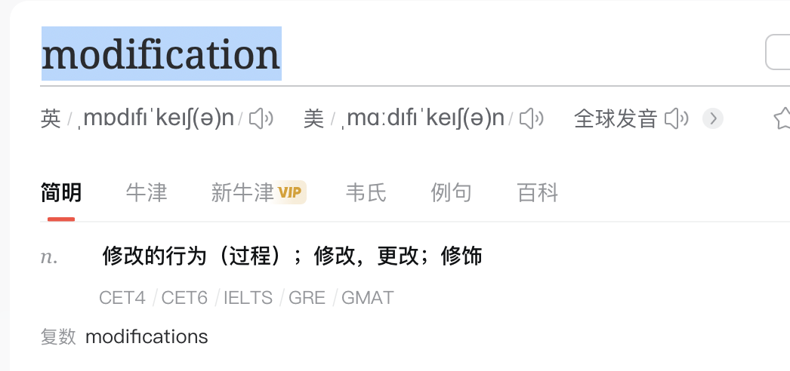
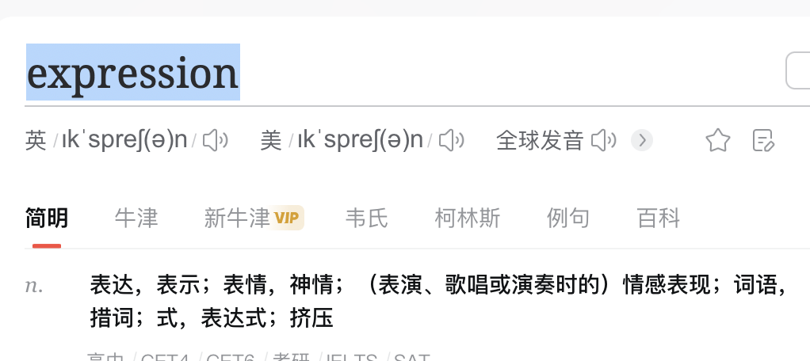

# 1. Linux

## 1.1 Linux 简介

### 1.1.1 Linux的特点

| 特点和概念     | 描述                                                         |
| -------------- | ------------------------------------------------------------ |
| 开源性         | Linux操作系统的源代码对任何人都是可访问和可修改的，鼓励用户和开发者合作和共享。 |
| 多用户和多任务 | Linux支持多用户环境和同时运行多个任务，适合用作服务器操作系统。 |
| 分层结构       | Linux遵循分层结构，核心负责管理硬件资源，其他组件提供各种功能。 |
| 文件系统       | 类Unix的文件系统以层次结构组织文件和目录，提供高效的数据管理和存储。 |
| 命令行界面     | Linux提供强大的命令行界面（终端），用于控制系统、管理文件和执行任务。 |
| 包管理系统     | Linux发行版使用包管理系统管理软件包的安装、更新和卸载，简化软件管理和维护。 |
| Linux发行版    | Linux内核与其他软件形成不同的发行版，如Ubuntu、Debian、Fedora等，各具特点。 |
| 内核和用户空间 | 内核空间管理硬件和提供系统服务，用户空间是应用程序运行的地方。 |
| 驱动程序支持   | Linux社区开发各种硬件设备的驱动程序，以确保硬件与Linux兼容。 |


### 1.1.2 Linux、mac、unix、windows的区别

​		下面是Linux、macOS、Unix和Windows之间的一些主要区别：

| 特点             | Linux                          | macOS                  | Unix                 | Windows                    |
| ---------------- | ------------------------------ | ---------------------- | -------------------- | -------------------------- |
| 操作系统类型     | 开源的Unix-like操作系统        | 基于Unix的操作系统     | 原始的Unix操作系统   | 封闭源的操作系统           |
| 内核             | Linux内核                      | Darwin内核             | 多个不同版本         | Windows内核                |
| 发行版           | 有多个不同的Linux发行版        | 仅macOS                | 用于多种商业操作系统 | 不同版本（例如Windows 10） |
| 用户界面         | 多种可选的桌面环境和窗口管理器 | Aqua窗口系统           | 文本界面             | 图形用户界面和Shell        |
| 软件生态系统     | 使用包管理系统安装软件         | 使用App Store安装软件  | 有限的软件选择       | 使用Windows Store安装软件  |
| 命令行界面       | 强大的命令行界面               | 有终端，但较少使用     | 原始的Unix命令行     | 命令提示符和PowerShell     |
| 文件系统         | 使用类Unix的文件系统           | 使用HFS+或APFS文件系统 | Unix文件系统         | 使用NTFS文件系统           |
| 安全性和稳定性   | 通常较高                       | 通常较高               | 高                   | 可变，但有安全性措施       |
| 用户定制和控制   | 高度定制和可配置               | 有一定程度的可配置性   | 通常限制于管理员     | 有一定程度的可定制性       |
| 使用领域         | 服务器、嵌入式系统、个人计算机 | 个人计算机和开发者环境 | 商业和大学机构       | 个人计算机和企业环境       |
| 开发者和支持社区 | 全球的开源社区                 | 苹果公司               | 商业公司和学术机构   | 微软及其开发者社区         |

​		需要注意的是，macOS实质上是基于Unix的操作系统，因为它的内核（Darwin）源自Unix，但是由于Apple对其进行了许多定制和开发，因此在用户体验和功能上有许多区别。Unix是操作系统的一种类别，而Linux是在这种类别下的一个开源的实现。Windows则是由Microsoft开发的另一种操作系统，它在桌面计算机领域占据着重要地位。


## 1.2 Linux 启动过程

### 1.2.1 整体流程


​		下面是Linux启动过程的步骤，以表格形式呈现：

| 阶段                             | 描述                                                         |
| -------------------------------- | ------------------------------------------------------------ |
| BIOS/UEFI阶段                    | - 执行BIOS/UEFI代码，初始化硬件。<br>- 寻找引导设备，并加载引导加载程序。 |
| 引导加载程序阶段                 | - 引导加载程序（如GRUB）加载到内存。<br>- 提供操作系统选择菜单，加载内核镜像。 |
| Linux内核加载和初始化阶段        | - 内核加载到内存并开始初始化。<br>- 设置硬件参数、初始化内存管理等。 |
| init进程阶段                     | - init进程（或替代者如systemd）作为第一个用户空间进程启动。<br>- 启动其他系统服务。 |
| 用户空间初始化和系统服务启动阶段 | - 启动系统服务如网络、文件系统、登录管理器等。<br>- 创建可用的操作环境。 |
| 用户登录和图形界面阶段           | - 用户通过终端登录或图形界面登录。<br>- 提供文本界面或图形桌面环境。 |

​		这个表格展示了Linux启动过程的主要步骤，每个阶段都有特定的任务和功能。

​		值得注意的是，具体步骤可能因Linux发行版和系统配置而有所不同。

###  1.2.2 细致划分

#### 1.2.2.1 内核引导

- 操作

  - 操作系统

    - 当计算机打开电源后，首先是BIOS/UEFI开机自检，执行BIOS/UEFI代码，初始化硬件、进行自检、检测外部设备，然后寻找启动设备。

    - 在BIOS/UEFI确定了启动设备后，引导加载程序（如GRUB）被加载到内存中。

    - 引导加载程序提供一个菜单，让用户选择要加载的操作系统或内核。


  - 内核
    - 操作系统接管硬件以后，首先读入 /boot 目录下的内核文件。
    - 一旦用户选择了操作系统或内核，引导加载程序将加载内核镜像到内存中。
    - 内核初始化的过程包括设置基本硬件参数、建立内存管理、初始化进程和启动系统服务。


- 作用
  - 内核引导的作用是在计算机启动时**初始化硬件**、**加载内核**并**启动系统**，为用户**提供可用的操作环境**。

#### 1.2.2.2 运行 init进程

- 操作

  - init 进程

    - init 是系统所有进程的起点，你可以把它比拟成系统所有进程的老祖宗，没有这个进程，系统中任何进程都不会启动。
    - init 程序首先是需要读取配置文件 /etc/inittab。
    - init进程（或init系统）负责启动其他系统服务，如网络、文件系统、登录管理器等。

    

- 作用
  - `init`进程的作用是在操作系统启动时**初始化用户空间环境**并**管理系统服务**，确保系统可以正常运行。


#### 1.2.2.3 运行级别

- 运行级别

​		许多程序需要开机启动。它们在Windows叫做"服务"（service），在Linux就叫做"守护进程"（daemon）。

​		init进程的一大任务，就是去运行这些开机启动的程序。

​		但是，不同的场合需要启动不同的程序，比如用作服务器时，需要启动Apache，用作桌面就不需要。

​		Linux允许为不同的场合，分配不同的开机启动程序，这就叫做"运行级别"（runlevel）。也就是说，启动时根据"运行级别"，确定要运行哪些程序。


- 级别划分

  - inux系统有7个运行级别(runlevel)：

    | 运行级别 | 含义                                               |
    | -------- | -------------------------------------------------- |
    | 0        | 关机状态，系统停止运行。                           |
    | 1        | 单用户模式，只启动最基本的系统服务，用于系统维护。 |
    | 2        | 多用户模式，不包括NFS服务。                        |
    | 3        | 多用户模式，包括网络支持。                         |
    | 4        | 未使用，通常保留为用户自定义。                     |
    | 5        | 多用户模式，包括图形界面。                         |
    | 6        | 系统重启，用于重新启动系统。                       |

  - 解释

    - 运行级别0：**系统关机** 系统停机状态，系统默认运行级别不能设为0，否则不能正常启动

    - 运行级别1：**单用户模式，只启动最基本的系统服务，用于系统维护**          																	                  					 单用户工作状态，root权限，用于系统维护，禁止远程登陆

    - 运行级别2：**多用户状态(没有NFS) ** 

      ​                     NFS（Network File System）是一种用于在网络上共享文件和目录的协议。

    - 运行级别3：**完全的多用户状态(有NFS)，登陆后进入控制台命令行模式**

    - 运行级别4：**系统未使用，保留用户自定义**

    - 运行级别5：**多用户模式，包括图形界面**

      ​					  X11控制台，登陆后进入图形GUI模式

    - 运行级别6：**系统重启**

      ​                     系统正常关闭并重启，默认运行级别不能设为6，否则不能正常启动

- 作用

  - 运行级别决定了计算机系统在启动时所需运行的服务和进程，以及系统的工作模式，

  - 从而为不同的使用场景提供定制化的操作环境。


#### 1.2.2.4 系统初始化

- 操作

​		在init的配置文件中有这么一行： si::sysinit:/etc/rc.d/rc.sysinit　它调用执行了/etc/rc.d/rc.sysinit，而rc.sysinit是一个bash shell的脚本，它主要是完成一些系统初始化的工作，rc.sysinit是每一个运行级别都要首先运行的重要脚本。

​		它主要完成的工作有：激活交换分区，检查磁盘，加载硬件模块以及其它一些需要优先执行任务。

```
l5:5:wait:/etc/rc.d/rc 5
```

​		这一行表示以5为参数运行/etc/rc.d/rc，/etc/rc.d/rc是一个Shell脚本，它接受5作为参数，去执行/etc/rc.d/rc5.d/目录下的所有的rc启动脚本，/etc/rc.d/rc5.d/目录中的这些启动脚本实际上都是一些连接文件，而不是真正的rc启动脚本，真正的rc启动脚本实际上都是放在/etc/rc.d/init.d/目录下。

​		而这些rc启动脚本有着类似的用法，它们一般能接受start、stop、restart、status等参数。

/etc/rc.d/rc5.d/中的rc启动脚本通常是K或S开头的连接文件，对于以以S开头的启动脚本，将以start参数来运行。

​		而如果发现存在相应的脚本也存在K打头的连接，而且已经处于运行态了(以/var/lock/subsys/下的文件作为标志)，则将首先以stop为参数停止这些已经启动了的守护进程，然后再重新运行。

​		这样做是为了保证是当init改变运行级别时，所有相关的守护进程都将重启。

​		至于在每个运行级中将运行哪些守护进程，用户可以通过chkconfig或setup中的"System Services"来自行设定。


- 作用

  - 系统初始化确保计算机在启动时经过一系列步骤初始化硬件、加载内核、启动服务，

  - 为用户提供可用的操作环境和资源。


#### 1.2.2.5 建立终端

- 操作

​		rc执行完毕后，返回init。这时基本系统环境已经设置好了，各种守护进程也已经启动了。

​		init接下来会打开6个终端，以便用户登录系统。在inittab中的以下6行就是定义了6个终端：

​		在传统的Unix和Linux系统中，`inittab`文件是用于定义系统初始化和运行级别配置的重要文件。它包含了一系列配置项，其中包括定义终端的行为。以下是一些示例配置，它们定义了6个终端以供用户登录系统：

```
# Example lines from inittab:
c1:12345:respawn:/sbin/agetty -8 -s 38400 tty1 linux
c2:2345:respawn:/sbin/agetty -8 -s 38400 tty2 linux
c3:2345:respawn:/sbin/agetty -8 -s 38400 tty3 linux
c4:2345:respawn:/sbin/agetty -8 -s 38400 tty4 linux
c5:2345:respawn:/sbin/agetty -8 -s 38400 tty5 linux
c6:2345:respawn:/sbin/agetty -8 -s 38400 tty6 linux
```

这些行的含义解释如下：

- `c1`, `c2`, ... `c6` 是终端的标识符。
- `12345` 和 `2345` 是对应运行级别的定义。在传统的运行级别系统中，这表示在运行级别1和2、3、4和5时都会启动这些终端。
- `respawn` 表示如果终端关闭，它将被重新启动。
- `/sbin/agetty` 是一个程序，用于管理终端。后面的参数指定了终端的配置，如 `-8 -s 38400` 表示8位字符和波特率为38400。
- `tty1`, `tty2`, ... `tty6` 是终端的设备文件名。
- `linux` 是指定终端类型。

​		这些配置项确保了在特定运行级别下，一旦终端被关闭，系统会重新启动对应的终端，以便用户可以登录系统。这样，一旦基本系统环境设置完成并且守护进程启动后，用户可以通过这些终端登录系统并与之交互。这在早期的Unix和类Unix系统中是一种常见的配置方式。

​		请注意，现代Linux系统可能已经采用了更先进的初始化和终端管理方法，例如使用`systemd`作为init系统。

- 作用

  - 建立终端提供了用户与计算机系统进行交互的途径，

  - 允许用户输入命令并接收系统的响应，

  - 用于操作和控制系统。

- 注意

  - rc

    - ​        在传统的Unix和类Unix操作系统中，"rc"通常是指"runcom"，它是"run commands"的缩写，用于指代一些运行时启动脚本和配置文件。这些脚本和配置文件定义了在不同情况下系统如何运行和初始化。

      ​        在这些系统中，"rc"可以涵盖多个方面，例如：

      1. **启动脚本**：
         - 系统启动时会运行一系列的"rc"脚本，用于初始化各种系统服务、设置环境变量等。这些脚本通常根据运行级别来确定启动哪些服务。

      2. **用户配置**：
         - 用户登录时，也可以运行一些用户级别的"rc"脚本，如`.bashrc`或`.zshrc`。这些脚本用于自定义用户的shell环境。

      3. **系统配置**：
         - 一些系统级别的配置文件，如`/etc/rc.conf`，用于定义系统范围的设置，例如默认语言、时区等。

      4. **资源控制**：
         - 在一些系统中，"rc"还可以用于定义资源控制策略，如`/etc/security/limits.conf`文件，用于控制用户或进程的资源使用。

      ​        需要注意的是，"rc"在不同的操作系统中可能具有不同的含义和用法。例如，在类Unix系统中，`/etc/rc.d`目录通常包含了系统启动和运行时的脚本。在早期的Unix系统中，"rc"通常是一个约定俗成的命名，指代各种运行时的脚本和配置。在现代Linux系统中，由于使用了更先进的init系统，如`systemd`，一些传统的"rc"概念可能已经不再直接适用。


  - systemd 作为 init系统

    - `systemd`是一种现代的init系统和系统管理套件，用于替代传统的init进程，用于初始化和管理Linux系统的各个方面。与传统的init系统相比，`systemd`引入了一系列创新的概念和功能，旨在提高系统启动速度、管理效率和可维护性。

      以下是`systemd`作为init系统的一些特点和功能：

      1. **并行启动**：
         - 传统的init系统顺序启动系统服务，而`systemd`引入了并行启动的概念，可以同时启动多个服务，提高系统启动速度。
         - **依赖性解决**：
         - `systemd`可以根据服务之间的依赖关系智能地确定启动顺序，避免了手动配置运行级别的繁琐过程。
         - **单元文件**：
         - `systemd`使用单元文件（unit files）来定义和配置系统服务、套接字、设备等。这些配置文件更灵活，易于管理和维护。
         - **控制组（cgroup）管理**：
         - `systemd`利用Linux控制组技术进行更精细的资源管理，允许对进程的资源使用进行更细致的控制。
         - **日志记录和管理**：
         - `systemd`引入了`journal`，一个可靠的、结构化的日志记录系统，可以帮助管理员更轻松地跟踪和分析系统事件。
         - **用户会话管理**：
         - `systemd`可以跟踪用户会话，确保用户的进程在注销时正确终止，从而提高系统安全性和稳定性。
         - **系统状态管理**：
           - `systemd`允许在运行时动态修改系统的某些配置，从而提供了更大的灵活性。
         
      
      ​        总之，`systemd`作为init系统在现代Linux系统中发挥着重要作用。它引入了一些新的概念和机制，以提高系统启动速度、管理效率和可维护性。由于其创新性的特点，`systemd`已经成为许多主流Linux发行版的标配。

      

#### 1.2.2.6 用户登录系统


- 登录方式

  - 通常情况下，用户登录计算机系统有三种主要方式，它们分别是：

    - **文本终端登录**：
       - ​        用户在启动后通过文本终端界面（命令行界面）进行登录。这种方式是最早的登录方式，用户需要在终端中输入用户名和密码进行身份验证。一旦验证通过，用户可以在终端中使用命令行来操作系统。

    - **图形界面登录**：
       - ​        图形界面登录是通过图形用户界面（GUI）进行登录的方式。在启动后，用户会看到一个登录界面，需要输入用户名和密码。一旦登录成功，用户可以使用鼠标和图形界面来操作系统。

    - **远程登录**：
       - ​        远程登录允许用户从另一台计算机或设备通过网络连接到目标计算机，并在远程终端上执行操作。这种方式允许用户在不同位置的计算机上访问和控制目标计算机，常用于远程维护、远程办公等。

    ​        这三种登录方式各有优劣和适用场景。文本终端登录适用于需要快速访问和操作的情况，不依赖于图形界面。图形界面登录提供了更直观和可视化的用户体验，适合普通用户。远程登录允许用户在不同地点通过网络连接到计算机，提供了便捷的远程访问方式。

    ​        在不同的操作系统和环境中，这些登录方式可能会有一些变化和扩展，但基本的登录原理通常是类似的。用户可以根据自己的需求和偏好选择适合的登录方式。

    

- 登录方式的对比

  - 

    | 方法         | 描述                                                         | 优点                                         | 缺点                                       | 适用场景                               |
    | ------------ | ------------------------------------------------------------ | -------------------------------------------- | ------------------------------------------ | -------------------------------------- |
    | 文本终端登录 | 通过命令行界面进行登录。用户需要在终端输入用户名和密码。     | 快速、轻量级、适用于远程连接和服务器管理。   | 不够直观、需要记忆命令，不适用于图形操作。 | 服务器管理、系统维护、高级用户操作。   |
    | 图形界面登录 | 通过图形用户界面进行登录。用户在图形界面中输入用户名和密码。 | 直观、友好、支持图形操作，适合一般用户。     | 消耗资源较多，可能不适用于低性能设备。     | 普通用户、桌面计算机环境。             |
    | 远程登录     | 从另一台计算机通过网络连接到目标计算机，执行远程操作。       | 可以远程访问、维护、管理计算机，提高灵活性。 | 取决于网络质量，可能存在安全风险。         | 远程办公、远程服务器管理、跨地域操作。 |

    ​		这些登录方法各自有其适用的场景和优劣势。选择合适的方法取决于用户的需求和使用情境。文本终端登录适合需要快速操作和服务器管理的情况，图形界面登录适合普通用户和桌面环境，远程登录适用于跨地域操作和远程维护。在实际使用中，用户可以根据情况灵活选择不同的登录方式。

- 作用

  - ​		用户登录方式提供了多样化的途径，让用户能够通过不同的方式（文本、图形、远程）安全地访问和操作计算机系统，以满足不同用户需求。

  

#### 1.2.2.7 图形模式与文字模式的切换方式


​		下面是图形模式与文字模式切换方式的表格表示：

| 切换方式                 | 描述                                                         |
| ------------------------ | ------------------------------------------------------------ |
| Ctrl + Alt + F1 到 F6    | 使用键盘快捷键 `Ctrl + Alt + F1` 到 `Ctrl + Alt + F6` 切换虚拟终端，`F1` 通常是文字模式，`F7` 是图形模式。 |
| 命令行切换               | 如果已登录系统，使用 `chvt` 命令切换虚拟终端。例如，使用 `sudo chvt 1` 切换到第一个虚拟终端（文字模式）。 |
| 系统启动时的运行级别切换 | 在系统启动时选择不同的运行级别，通过更改 `/etc/inittab` 或使用 `systemctl` 命令来实现切换。 |
| 使用命令行工具           | 在图形模式下，使用命令行工具（如 `init` 或 `systemctl`）切换到其他运行级别以进入文字模式，反之亦然。 |

- 作用
  - ​        这些切换方式使您能够在图形模式和文字模式之间进行灵活切换，以满足不同的使用需求。具体实施可能因Linux发行版和系统配置而略有不同。


#### 1.2.2.8 Linux 关机


​	正确的关机流程为：sync > shutdown > reboot > halt

​	在Linux系统中，您可以使用以下命令来关机：


```bash
sync 将数据由内存同步到硬盘中。

shutdown 关机指令，你可以man shutdown 来看一下帮助文档。例如你可以运行如下命令关机：

shutdown –h 10 ‘This server will shutdown after 10 mins’ 这个命令告诉大家，计算机将在10分钟后关机，并且会显示在登陆用户的当前屏幕中。

Shutdown –h now 立马关机

Shutdown –h 20:25 系统会在今天20:25关机

Shutdown –h +10 十分钟后关机

Shutdown –r now 系统立马重启

Shutdown –r +10 系统十分钟后重启

reboot 就是重启，等同于 shutdown –r now

halt 关闭系统，等同于shutdown –h now 和 poweroff
```


- **使用shutdown命令**：

   - 执行以下命令将系统关机，并在一定时间后进行：
     ```
     sudo shutdown -h now
     ```
   - 使用`-h`参数表示关机，`now`表示立即执行。您也可以使用`+分钟`来设置延迟时间，例如`sudo shutdown -h +10`表示10分钟后关机。

- **使用halt或poweroff命令**：
   - 执行以下命令将系统立即关机：
     ```
     sudo halt
     ```
     或
     ```
     sudo poweroff
     ```

- **使用init命令**：
   - 使用以下命令将系统关机：
     ```
     sudo init 0
     ```

- **使用systemctl命令**：
   - 使用以下命令将系统关机：
     ```
     sudo systemctl poweroff
     ```

​		无论哪种方法，关机前请确保已保存所有未保存的工作，并确保您有合适的权限执行关机操作。使用这些命令中的任何一个都会在关闭前向所有用户显示一条通知消息。


## 1.3 Linux 目录结构

### 1.3.1 目录结构

- 结构图

  - 

- 结构表

  - Linux系统的目录结构是一种层次化的组织方式，用于存储文件、配置和系统资源。以下是常见的Linux目录结构及其主要用途：

    | 目录   | 描述                                                         |
    | ------ | ------------------------------------------------------------ |
    | /      | 根目录，整个文件系统的起始点。                               |
    | /bin   | 二进制可执行文件，包含系统启动和维护所需的基本命令。         |
    | /boot  | 启动相关的文件，如内核和引导加载程序。                       |
    | /dev   | 设备文件目录，包含与硬件设备交互的特殊文件。                 |
    | /etc   | 配置文件目录，包含系统和应用程序的配置文件。                 |
    | /home  | 用户主目录的基础目录，用户的个人文件和设置通常在此处。       |
    | /lib   | 共享库文件，为系统和应用程序提供函数库。                     |
    | /media | 可移动媒体设备挂载点，如USB驱动器、光盘等。                  |
    | /mnt   | 临时挂载目录，用于手动挂载临时设备。                         |
    | /opt   | 可选软件目录，用于安装第三方可选软件。                       |
    | /proc  | 虚拟文件系统，提供有关内核和进程的信息。                     |
    | /root  | 超级用户（root）的主目录。                                   |
    | /run   | 运行时数据目录，存储运行中的系统信息。                       |
    | /sbin  | 系统管理员二进制文件，包含系统维护和修复的命令。             |
    | /srv   | 服务数据目录，用于存储本地服务的数据。                       |
    | /sys   | 虚拟文件系统，提供与内核和设备交互的信息。                   |
    | /tmp   | 临时文件目录，用于存储临时文件和目录。                       |
    | /usr   | 用户相关目录，包含用户程序、库、文档等。                     |
    | /var   | 可变数据目录，存储在运行过程中变化的数据，如日志、数据库等。 |

    ​		这些目录组成了Linux系统的层次化结构，每个目录都有其特定的用途和功能，有助于组织文件和系统资源，使系统更易于管理和维护。

### 1.3.2 目录功能分类

​		以下是根据功能将Linux系统的目录结构分类的表格表示：

| 目录分类         | 目录名称    | 描述                                           |
| ---------------- | ----------- | ---------------------------------------------- |
| 系统目录         | /bin        | 二进制可执行文件，包含基本系统命令。           |
|                  | /boot       | 启动相关文件，如内核和引导加载程序。           |
|                  | /lib        | 共享库文件，提供系统所需的函数库。             |
|                  | /sbin       | 系统管理员命令，用于系统维护和修复。           |
| 用户目录         | /home       | 用户主目录的基础目录，存储用户个人文件和设置。 |
| 配置目录         | /etc        | 配置文件，包含系统和应用程序的配置信息。       |
| 设备目录         | /dev        | 设备文件，与硬件设备交互的特殊文件。           |
| 挂载点目录       | /media      | 可移动媒体设备挂载点，如USB驱动器、光盘等。    |
|                  | /mnt        | 临时挂载目录，用于手动挂载设备。               |
| 运行时目录       | /run        | 运行时数据目录，存储运行中的系统信息。         |
| 超级用户目录     | /root       | 超级用户（root）的主目录。                     |
| 虚拟文件系统目录 | /proc       | 虚拟文件系统，提供有关内核和进程的信息。       |
|                  | /sys        | 虚拟文件系统，提供与内核和设备交互的信息。     |
| 临时目录         | /tmp        | 临时文件目录，用于存储临时文件和目录。         |
| 可选软件目录     | /opt        | 可选软件目录，用于安装第三方可选软件。         |
| 服务数据目录     | /srv        | 服务数据目录，存储本地服务的数据。             |
| 用户和组信息目录 | /etc/passwd | 存储用户信息的文件。                           |
|                  | /etc/group  | 存储组信息的文件。                             |

​		这个表格按照功能将Linux系统的目录结构进行了分类，每个目录都有其特定的用途和功能。

## 1.4 Linux 更改root密码


​		如果在Linux系统中忘记了root密码，您可以通过进入单用户模式来重置root密码，而不必重新安装整个系统。

​		单用户模式是一个最小化的系统运行模式，只启动少量的基本服务，允许您以管理员权限修改密码。

​		以下是重置root密码的步骤（在大多数Linux发行版中通用）：

1. **重启计算机**：
   - 重新启动计算机。在启动过程中，您可能需要按下特定的键（通常是`Shift`、`Esc`或`F2`等）来进入引导菜单或启动选项。

2. **选择单用户模式**：
   - 进入引导菜单或启动选项后，选择进入单用户模式或恢复模式。这可能在启动菜单中显示为“Recovery Mode”或“Single User Mode”。

3. **进入root权限**：
   - 系统将启动进入单用户模式，并提示您输入命令。您将以root权限进入系统，无需密码。

4. **修改密码**：
   - 输入以下命令来更改root密码：
     ```
     passwd root
     ```
     然后按照提示输入新密码和确认密码。

5. **重新启动**：
   - 修改密码后，您可以输入以下命令来重新启动系统：
     ```
     reboot
     ```

6. **使用新密码登录**：
   - 系统重启后，您可以使用刚刚设置的新密码登录root用户。

​		请注意，这个过程可能因不同的Linux发行版和版本而有所不同。在执行此操作之前，请确保您了解自己所使用的Linux系统的具体步骤。此外，重置密码时，请确保遵循安全实践，并确保您保管好新密码。


## 1.5 Linux 远程操作 SSH

- windows

  - Linux 一般作为服务器使用，而服务器一般放在机房，你不可能在机房操作你的 Linux 服务器。

    这时我们就需要远程登录到 Linux 服务器来管理维护系统。

    [CentOS](https://www.w3cschool.cn/minicourse/play/sf_centoslinux) 系统默认安装了 openssh

    如果没有安装可以使用命令进行安装：

    ```
    yum install openssh-server -y 
    ```

    Linux 系统中是通过 [ssh](https://www.w3cschool.cn/sshnooblearning/) 服务实现的远程登录功能，默认 ssh 服务端口号为 22。

    Windows 系统上 Linux 远程登录客户端有 SecureCRT, Putty, SSH Secure Shell，Xshell 等，本文以 PuTTY 为例来登录远程服务器。

    PuTTY 下载地址：http://www.putty.org/

    如果你下载了 PuTTY，请双击 `PuTTY.exe` 然后弹出如下的窗口。

    

    在 Host Name( or IP address) 下面的框中输入你要登录的远程服务器 IP（可以通过 `ifconfig` 命令查看服务器 IP），然后回车。

    

    此时，提示我们输入要登录的用户名。

    

    输入 `root` 然后回车，再输入密码，就能登录到远程的 Linux 系统了。

    

    

    使用密钥认证机制远程登录linux

    SSH 为 Secure Shell 的缩写，由 IETF 的网络工作小组（Network Working Group）所制定。

    SSH 为建立在应用层和传输层基础上的安全协议。

    首先使用工具 PUTTYGEN.EXE 生成密钥对。打开工具 PUTTYGEN.EXE 后如下图所示：

    

    该工具可以生成三种格式的 key ：`SSH-1(RSA) SSH-2(RSA) SSH-2(DSA) `，我们采用默认的格式即 SSH-2(RSA)。`Number of bits in a generated key` 这个是指生成的key 的大小，这个数值越大，生成的 key 就越复杂，安全性就越高。这里我们写 2048.

    

    然后单击 Generate 开始生成密钥对：

    

    注意的是，在这个过程中鼠标要来回的动，否则这个进度条是不会动的。

    

    到这里，密钥对已经生成了。你可以给你的密钥输入一个密码，（在 `Key Passphrase` 那里）也可以留空。然后点 `Save public key` 保存公钥，点 `Save private Key` 保存私钥。笔者建议你放到一个比较安全的地方，一来防止别人偷窥，二来防止误删除。接下来就该到远程 Linux 主机上设置了。

    1）创建目录` /root/.ssh` 并设置权限

    ```
    [root@localhost ~]# mkdir /root/.ssh mkdir 命令用来创建目录，以后会详细介绍，暂时只了解即可。
    [root@localhost ~]# chmod 700 /root/.ssh chmod 命令是用来修改文件属性权限的，以后会详细介绍。
    ```

    2）创建文件 `/ root/.ssh/authorized_keys`

    ```
    [root@localhost ~]# vim /root/.ssh/authorized_keys vim 命令是编辑一个文本文件的命令，同样在后续章节详细介绍。
    ```

    3）打开刚才生成的 public key 文件，建议使用写字板打开，这样看着舒服一些，复制从 AAAA 开头至 "---- END SSH2 PUBLIC KEY ----" 该行上的所有内容，粘贴到 `/root/.ssh/authorized_keys` 文件中，要保证所有字符在一行。（可以先把复制的内容拷贝至记事本，然后编辑成一行载粘贴到该文件中）。

    在这里要简单介绍一下，如何粘贴，用vim打开那个文件后，该文件不存在，所以 vim 会自动创建。按一下字母 "`i`" 然后同时按 `shift + Insert` 进行粘贴（或者单击鼠标右键即可），前提是已经复制到剪切板中了。粘贴好后，然后把光标移动到该行最前面输入 ssh-rsa ，然后按空格。再按 ESC，然后输入冒号 wq 即 `:wq` 就保存了。格式如下图：

    

    4）再设置 PuTTY 选项，点窗口左侧的 SSh –> Auth ，单击窗口右侧的 Browse… 选择刚刚生成的私钥， 再点Open ，此时输入 root，就不用输入密码就能登录了。

    

    如果在前面你设置了 Key Passphrase ，那么此时就会提示你输入密码的。为了更加安全建议大家要设置一个 Key Passphrase。

- mac

  - 在 macOS 系统上远程登录 Linux，您可以使用终端应用来执行 SSH 连接，实现安全的远程访问。以下是使用终端进行 SSH 远程登录 Linux 的步骤：

    1. **打开终端**：
       - 在 macOS 上，您可以通过“应用程序”文件夹中的“实用工具”文件夹中找到终端应用。

    2. **执行 SSH 连接**：
       - 在终端中，输入以下命令格式来执行 SSH 连接，将 `username` 替换为您的用户名，`hostname` 替换为目标 Linux 系统的 IP 地址或主机名：
       
         ```
         ssh username@hostname
         ```
         
         例如，如果您的用户名是 `user1`，目标主机名是 `192.168.1.100`，则命令为：
         
         ```
         ssh user1@192.168.1.100
         ```

    3. **输入密码**：
       - 提示您输入密码时，请输入目标 Linux 系统用户的密码，并按下 Enter 键。

    4. **远程登录成功**：
       - 如果密码正确，您将成功远程登录到目标 Linux 系统，可以在终端中执行命令和操作系统。

    请注意，SSH 协议是一种安全的远程登录方式，能够保护通信过程中的数据安全性。在使用远程登录时，请确保您输入正确的用户名和密码，以确保安全性。如果需要更高级的远程操作，您还可以使用 SSH 密钥对进行认证，这提供了更高的安全性和便利性。

## 1.6 Linux 进程

下面是一个将不同类型的类Unix操作系统中常见的后台进程整理成表格的示例：

| 类型                         | 描述和用途                                                   |
| ---------------------------- | ------------------------------------------------------------ |
| 守护进程（Daemons）          | 在系统引导过程中启动并在后台持续运行，管理系统服务。         |
| 定时任务（Cron Jobs）        | 由cron守护进程管理的定时任务，按照预定时间表运行。           |
| 系统进程（System Processes） | 操作系统核心组件，管理系统资源、任务调度和硬件请求。         |
| 后台作业（Background Jobs）  | 将命令放入后台运行，用户可以继续操作终端。                   |
| 会话和终端管理               | 管理会话和终端的进程，如SSH会话管理、控制台终端会话等。      |
| 用户级守护进程               | 由用户启动的后台进程，与用户会话关联，执行特定任务。         |
| 进程间通信（IPC）            | 使用不同的IPC机制实现进程之间的通信，如管道、消息队列。      |
| 网络服务进程                 | 提供网络功能的后台进程，如Web服务器、FTP服务器、邮件服务器。 |
| 系统监控和日志               | 监控系统状态、记录事件和生成日志的后台进程。                 |

- 类Unix操作系统（也称为Unix-like操作系统）包括许多不同的后台进程类型，用于执行各种任务和管理系统服务。以下是一些在类Unix操作系统中常见的后台进程类型：

  - **守护进程（Daemons）：** 类Unix系统中最常见的后台进程类型之一。守护进程是在系统引导过程中启动并在后台持续运行的进程。它们负责管理系统服务，如网络服务（如sshd、httpd）、打印服务（如cupsd）、数据库服务等。

  - **定时任务（Cron Jobs）：** 类Unix系统通过cron守护进程支持定时任务。用户可以使用crontab配置文件来安排在特定时间和日期运行的任务。

  - **系统进程（System Processes）：** 这些进程是操作系统的核心组成部分，用于管理系统资源、调度任务、处理硬件请求等。操作系统内核本身就是一个特殊的系统级进程。

  - **后台作业（Background Jobs）：** 类Unix操作系统允许用户将命令放入后台运行，而不是在前台等待其完成。通过在命令末尾添加`&`符号，可以将命令放到后台运行。

  - **会话和终端管理：** 后台进程还包括管理会话和终端的进程。例如，`sshd`（Secure Shell Daemon）负责管理SSH会话，`getty`负责管理控制台终端会话等。

  - **用户级守护进程：** 用户可以启动自己的后台进程，这些进程与用户会话关联，并负责执行特定任务，如文件同步、备份、通知等。

  - **进程间通信（IPC）：** 后台进程可以使用不同的进程间通信机制进行交互，如管道、消息队列、共享内存等。

  - **网络服务进程：** 类Unix操作系统通过网络服务进程提供各种网络功能，如Web服务器、FTP服务器、邮件服务器等。

  - **系统监控和日志：** 后台进程还可能用于监控系统状态、记录事件和生成日志。例如，`syslogd`是一个常见的后台进程，负责管理系统日志。


​		总之，类Unix操作系统支持多种类型的后台进程，每种进程类型都有其特定的用途和功能，用于维护系统、提供服务以及执行用户和系统任务。


# 2. vi/vim

## 2.1 vim 简介

### 2.1.1 描述		

​		Vim（Visual iterface IMproved）是一款高度可配置且功能强大的文本编辑器，广受开发人员、系统管理员以及经常处理基于文本的文件的用户欢迎。它被设计成完全通过键盘快捷键和命令进行操作，从而在编辑和处理文本方面非常高效。


### 2.1.2 指令图


## 2.2 vim模式

​		当前 VIM 模式的信息可以整理成如下的表格：

| 模式                            | 描述                                                         |
| ------------------------------- | ------------------------------------------------------------ |
| 普通模式（Normal Mode）         | 默认模式，用于导航、编辑和执行命令。在此模式下，按键执行各种命令，如移动光标、复制、删除、跳转等。 |
| 插入模式（Insert Mode）         | 允许您像普通文本编辑器一样输入和编辑文本。通过按下`i`等键进入，可以在光标位置插入文本。 |
| 可视模式（Visual Mode）         | 用于选择文本区域以进行操作，如复制、删除、替换等。按下`v`进入，还有行选择和块选择的变种模式。 |
| 命令行模式（Command-Line Mode） | 通过在普通模式下按下冒号`:`进入，用于执行更高级操作，如保存文件、搜索、替换、执行外部命令等。例如，`:w`保存文件。 |
| 替换模式（Replace Mode）        | 按下大写的`R`在普通模式下进入，用于替换字符。在此模式下，键入的字符会替换光标所在位置的字符，直到按下`Esc`返回普通模式。 |


### 2.2.1 普通模式


​		下面是有关Vim普通模式常用操作和命令的表格：

| 操作             | 命令                               | 描述                                                         |
| ---------------- | ---------------------------------- | ------------------------------------------------------------ |
| 光标移动         | `h`、`j`、`k`、`l`                 | 向左、向下、向上、向右移动光标。                             |
| 删除文本         | `x`、`dd`、`dw`、`d$`              | 删除字符、删除当前行、删除一个词、删除到行尾。               |
| 复制和粘贴       | `yy`、`yw`、`p`                    | 复制当前行、复制一个词、粘贴已复制的内容。                   |
| 撤销和重做       | `u`、`Ctrl+r`                      | 撤销上一步操作、重做。                                       |
| 查找和替换       | `/`、`:%s/old/new/g`               | 进入搜索模式，全局替换。                                     |
| 跳转和定位       | `gg`、`G`、`Ctrl+o`、`Ctrl+i`      | 跳转到文件开头、跳转到文件末尾、返回上一个位置、前进到下一个位置。 |
| 打开和保存文件   | `:e filename`、`:w`、`:q`、`:wq`   | 打开另一个文件、保存当前文件、退出Vim、保存并退出。          |
| 分割窗口和标签页 | `:sp`、`:vsp`、`Ctrl+w`、`:tabnew` | 水平分割窗口、垂直分割窗口、切换窗口、打开新标签页。         |

​			这个表格提供了Vim普通模式下一些常见操作和命令的概览。通过熟悉这些操作和命令，您可以更有效地在普通模式下编辑和操作文本。注意，某些命令可能还有更多选项和变体，这里只列出了一些常用的示例。


### 2.2.2 插入模式


​		下面是关于Vim插入模式的一些信息，以及常见的操作和命令，整理成表格：

| 操作         | 命令                         | 描述                                                         |
| ------------ | ---------------------------- | ------------------------------------------------------------ |
| 进入插入模式 | `i`、`I`、`a`、`A`、`o`、`O` | 在光标前插入文本、在行首插入文本、在光标后插入文本、在行末插入文本、在光标下方插入新行、在光标上方插入新行。 |
| 退出插入模式 | `Esc`                        | 返回到普通模式。                                             |
| 中英文切换   | shift                        | 切换中英文，vim编辑操作 只能在 英文状态下 执行，<br>                                              输入文本时可以使用 中文 |

​		在插入模式下，您可以像在普通文本编辑器中一样自由地输入和编辑文本。插入模式允许您直接输入字符，而不是执行命令。要从插入模式返回到普通模式，请按下`Esc`键。插入模式有多种进入方式，如在光标前插入、在行首插入、在光标后插入等，取决于您希望在文本中插入的位置。

​		通过切换普通模式和插入模式，您可以在Vim中灵活地进行导航、编辑和操作文本。


### 2.2.3 可视模式

​		以下是关于Vim可视模式的信息，以及常见的操作和命令，整理成表格：

| 操作         | 命令                        | 描述                                       |
| ------------ | --------------------------- | ------------------------------------------ |
| 进入可视模式 | `v`、`V`、`Ctrl+v`          | 进入字符选择模式、行选择模式、块选择模式。 |
| 选择文本     | 移动光标后，按下`d`、`y` 等 | 选择文本以进行复制、删除等操作。           |
| 退出可视模式 | `Esc`                       | 返回到普通模式。                           |

​	   可视模式允许您选择文本区域以进行操作，如复制、删除、替换等。

- 在可视模式中，您可以通过移动光标来选择要操作的文本。
  - 字符选择模式（`v`键）允许您按字符选择，
  - 行选择模式（大写`V`键）允许您按行选择，
  - 而块选择模式（`Ctrl+v`键）允许您按矩形块选择。

- 在可视模式下选择文本后，您可以使用类似于普通模式的命令

  - `d`来删除所选文本，

  - `y`来复制所选文本。

    这使得可视模式成为一种便捷的文本编辑工具，可以高效地进行多种操作。

​		      通过在可视模式下选择文本，然后在普通模式下使用相应的命令，您可以在Vim中灵活地编辑和操作文本。

### 2.2.4 命令行模式

​		命令行模式（Command-Line Mode）是Vim编辑器中的一种模式，用于执行高级操作和命令，如保存文件、搜索、替换、执行外部命令等。在命令行模式中，您可以输入不同的命令以控制Vim的行为。以下是有关Vim命令行模式的一些信息，以及常见的操作和命令，整理成表格：

| 操作             | 命令                | 描述                                       |
| ---------------- | ------------------- | ------------------------------------------ |
| 进入命令行模式   | 按下冒号`:`         | 进入命令行模式。                           |
| 保存文件         | `:w`                | 将当前文件保存到磁盘。                     |
| 退出Vim          | `:q`                | 退出Vim。                                  |
| 保存并退出Vim    | `:wq` 或 `:x`       | 保存当前文件并退出Vim。                    |
| 不保存退出Vim    | `:q!`               | 强制退出Vim，不保存更改。                  |
| 打开文件         | `:e filename`       | 打开另一个文件。                           |
| 搜索文本         | `:/pattern`         | 在当前文件中搜索指定模式的文本。           |
| 全局替换         | `:%s/old/new/g`     | 在整个文件中全局替换指定的旧文本为新文本。 |
| 运行外部命令     | `:!command`         | 在命令行下运行外部命令。                   |
| 向上搜索命令历史 | 按下`Ctrl+p` 或 `↑` | 浏览之前输入的命令历史。                   |
| 向下搜索命令历史 | 按下`Ctrl+n` 或 `↓` | 浏览较新的命令历史。                       |
| 返回普通模式     | 按下`Esc`           | 返回到普通模式。                           |

​		在命令行模式下，您可以执行各种高级操作，包括保存文件、退出Vim、搜索文本、替换文本、运行外部命令等。您可以通过输入不同的命令来控制Vim的行为。要从命令行模式返回到普通模式，请按下`Esc`键。命令行模式为您提供了执行更复杂操作的功能，以便更好地管理和编辑文本文件。


### 2.2.5 替换模式


​		替换模式（Replace Mode）是Vim编辑器的一种模式，它允许您直接替换光标所在位置的字符，而不是插入新的字符。在替换模式中，您键入的字符会取代光标下的字符，直到您退出替换模式。以下是有关Vim替换模式的一些信息，以及常见的操作和命令，整理成表格：

| 操作         | 命令             | 描述                                                       |
| ------------ | ---------------- | ---------------------------------------------------------- |
| 进入替换模式 | 按下大写的`R`键  | 进入替换模式，可以直接替换光标下的字符。                   |
| 替换字符     | 键入要替换的字符 | 在替换模式中，键入要替换的字符，将取代光标所在位置的字符。 |
| 退出替换模式 | 按下`Esc`键      | 返回到普通模式。                                           |

​		在替换模式中，您可以在光标下直接替换字符，而不需要先删除它们然后再插入新字符。这对于在编辑文本时需要进行小范围更改的情况非常有用。要进入替换模式，请在普通模式下按下大写的`R`键。然后，您可以键入要替换的字符，这将取代光标所在位置的字符。完成替换后，按下`Esc`键返回到普通模式。

​		替换模式与插入模式不同，因为插入模式用于输入新的字符，而替换模式直接用新字符替换光标下的字符。

### 2.2.6 插入、可视、命令行、替换之间的区别

​		以下是关于Vim中插入模式、可视模式、命令行模式和替换模式之间的主要区别的总结：

| 模式       | 进入方式           | 功能描述                                                     | 退出方式 |
| ---------- | ------------------ | ------------------------------------------------------------ | -------- |
| 插入模式   | `i`、`I`、`a` 等   | 用于实际输入和编辑文本。                                     | `Esc`键  |
| 可视模式   | `v`、`V`、`Ctrl+v` | 选择文本区域以进行操作，如复制、删除、替换等。               | `Esc`键  |
| 命令行模式 | 按下冒号`:`        | 执行高级操作和命令，如保存文件、搜索、替换、运行外部命令等。 | `Esc`键  |
| 替换模式   | 按下大写的`R`键    | 用于直接替换光标所在位置的字符，键入的字符会取代原字符。     | `Esc`键  |


**插入模式：**

- 用于实际输入和编辑文本内容。
- 按下插入模式进入键，例如`i`、`I`、`a`、`A`。
- 在插入模式中，您可以直接键入字符来编辑文本。
- 通过按下`Esc`键退出插入模式，返回到普通模式。

**可视模式：**
- 用于选择文本区域以进行操作，如复制、删除、替换等。
- 按下可视模式进入键，例如`v`（字符选择）、`V`（行选择）、`Ctrl+v`（块选择）。
- 在可视模式中，您可以移动光标来扩展选择区域。
- 通过按下`Esc`键退出可视模式，返回到普通模式。

**命令行模式：**
- 用于执行高级操作和命令，如保存文件、搜索、替换、运行外部命令等。
- 按下冒号`:`进入命令行模式。
- 在命令行模式中，您可以输入各种命令来控制Vim的行为。
- 通过按下`Esc`键退出命令行模式，返回到普通模式。

**替换模式：**
- 用于直接替换光标所在位置的字符，键入的字符会取代原字符。
- 按下大写的`R`键进入替换模式。
- 在替换模式中，您键入的字符会取代光标下的字符，直到您退出模式。
- 通过按下`Esc`键退出替换模式，返回到普通模式。

这些不同的模式允许您在Vim中以不同的方式操作和编辑文本，提供了灵活的文本处理工具。


# 3. Shell

## 3.1 Shell 环境

### 3.1.1 Shell 类型

​		以下是Bourne shell、C shell、Bash和Zsh之间的主要区别，总结成表格形式：

| 特性/特点              | Bourne Shell | C Shell (csh) | Bash   | Zsh           |
| ---------------------- | ------------ | ------------- | ------ | ------------- |
| 创建时间               | 1977年       | 1978年        | 1989年 | 1990年        |
| 脚本编写功能           | 基本         | 有限          | 强大   | 强大          |
| 命令行交互             | 基本         | 有限          | 强大   | 强大          |
| 别名支持               | 否           | 是            | 是     | 是            |
| 自动补全功能           | 否           | 有限          | 是     | 是            |
| 命令历史管理           | 有限         | 是            | 强大   | 强大          |
| 控制结构（循环、条件） | 有限         | 有限          | 强大   | 强大          |
| 函数支持               | 否           | 否            | 是     | 是            |
| 模块化配置             | 否           | 否            | 有限   | 是            |
| 插件支持               | 否           | 否            | 有限   | 是            |
| 文件名扩展             | 通配符       | 通配符        | 通配符 | 通配符 + 高级 |
| 路径扩展               | 有限         | 有限          | 有限   | 高级          |
| 目录导航功能           | 否           | 否            | 有限   | 强大          |

​		请注意，表格中的特点和特性仅供参考，实际上每个Shell的具体功能会因版本和配置而略有不同。如果你需要详细了解某个Shell的功能和特性，请查阅该Shell的官方文档或相关资源。

### 3.1.2 Shell 插件

- ohmyzsh
  - https://github.com/ohmyzsh/ohmyzsh

## 3.2 Shell 简介

​		下面是关于Shell的简介，总结成表格形式：

| 特点           | 描述                                                         |
| -------------- | ------------------------------------------------------------ |
| 类型           | 命令行解释器和脚本语言，用于与操作系统交互、执行命令、自动化任务。 |
| 交互式界面     | 提供交互式命令行界面，用户在命令提示符下输入命令。           |
| 命令执行       | 用户输入的命令被翻译成计算机指令，由操作系统执行。           |
| 脚本编写       | 可用于编写脚本，包含一系列命令，用于自动化任务、批处理作业等。 |
| 变量和参数     | 支持定义、使用变量和通过参数传递值给命令和脚本。             |
| 控制结构       | 提供条件语句、循环结构、分支语句等，实现逻辑控制。           |
| 输入输出重定向 | 可将命令的输入或输出重定向到文件，使用管道连接多个命令。     |
| 自动补全       | 一些Shell提供自动补全功能，根据已有命令、文件名、参数等自动补全用户输入。 |
| 历史管理       | 记录用户输入的历史命令，可轻松查阅以前执行过的命令。         |
| 常见Shell      | Bourne Shell (sh)、C Shell (csh)、Korn Shell (ksh)、Bash、Z Shell (Zsh)等。 |

​		每种Shell在功能和特性上有所不同，适用于不同的场景和需求。

​		用户可以根据工作要求和偏好选择合适的Shell来提高效率和便利性。

## 3.3 Shell 变量

### 3.3.1 Shell 变量规范

​		以下是关于Shell变量命名规范的总结，以表格形式呈现：

| 规范            | 描述                                                         |
| --------------- | ------------------------------------------------------------ |
| 变量命名规则    | - 由字母（大写或小写）、数字和下划线组成。<br>- 不能以数字开头。<br>- 区分大小写。 |
| 变量命名风格    | - 使用小写字母，提高可读性。<br>- 多个单词使用下划线 `_` 分隔。 |
| 避免特殊字符    | - 避免使用特殊字符，避免与Shell语法冲突。<br>- 使用字母、数字和下划线确保合法性。 |
| 有意义的名称    | - 使用描述性的变量名。<br>- 例：使用 `user_name` 而不是 `x`。 |
| 避免Shell关键字 | - 避免使用Shell的保留关键字作为变量名。                      |
| 约定俗成的命名  | - 根据惯例，常量可能使用大写字母的命名方式。                 |
| 环境变量        | - 环境变量通常使用大写字母。<br>- 例：`PATH`, `HOME`。       |
| 局部变量        | - 在函数内部定义的变量使用小写字母。<br>- 可包含下划线，局部范围。 |
| 命名一致性      | - 保持变量命名的一致性，便于理解和维护。                     |

​		请注意，这些规范有助于编写更清晰、易读且易于维护的Shell脚本。

​		在实际编码中，遵循这些规范可以提高代码的质量和可维护性。


#### 3.3.1.1 注意

- 变量命名是 “ = ”之间不能有空格

  - 错误

    - ```bash
      xieshan at localhost in ~ 
      $ name = "asd"
      zsh: command not found: name
      (base) 
      xieshan at localhost in ~ 
      $ NAME = "23"
      zsh: command not found: NAME
      (base) 
      ```

      

  - 正确

    - ```bash
      xieshan at localhost in ~ 
      $ name="Alice"
      age=30
      (base) 
      xieshan at localhost in ~ 
      $ name="1"    
      age=30
      (base) 
      xieshan at localhost in ~ 
      $ echo "name是$name,age是$age"
      name是1,age是30
      (base) 
      ```

      

### 3.3.2 Shell 变量类型

#### 3.3.2.1 字符类型

​		下面是关于Shell变量类型的总结，以表格形式呈现：

| 变量类型                         | 描述                                                 | 例子                               |
| -------------------------------- | ---------------------------------------------------- | ---------------------------------- |
| 字符串（String）                 | 用于存储文本数据，可以用单引号或双引号括起来。       | name="John"                        |
| 整数（Integer）                  | 一些Shell支持，用于存储整数值。                      | count=5                            |
| 浮点数（Float）                  | 一些Shell支持，用于存储带小数的数值。                | price=3.99                         |
| 数组（Array）                    | 一些Shell支持，用于存储多个值的集合。                | fruits=("apple" "banana" "orange") |
| 关联数组（Associative Array）    | 一些Shell支持，索引可以是字符串，用于存储键值对。    | ages=([Alice]=25 [Bob]=30)         |
| 布尔值（Boolean）                | 一些Shell支持，用于表示真值（true）或假值（false）。 | is_active=true                     |
| 空（Null）                       | 用于表示变量没有值的特殊类型。                       | empty_var=                         |
| 环境变量（Environment Variable） | 用于存储系统级别的配置信息，通常由操作系统设置。     | PATH="/usr/bin:/usr/local/bin"     |

​		请注意，变量类型的支持因不同的Shell而异，因此在编写脚本时，最好根据所使用的Shell的文档来了解其支持的变量类型和特性。

#### 3.3.2.2 范围类型

##### （1）局部变量

- 解释

  - ​		下面是关于Shell中局部变量的特点，总结成表格形式：

    | 特点           | 描述                                                         |
    | -------------- | ------------------------------------------------------------ |
    | 作用范围       | 只在定义它的代码块、函数内部或某些命令的作用域内有效。       |
    | 生命周期       | 从变量定义所在作用域开始，到作用域结束时结束。               |
    | 变量的作用域   | 可以在函数内部、代码块内部或某些命令中定义局部变量。         |
    | 避免命名冲突   | 使用局部变量可以防止不同作用域中同名变量之间的命名冲突。     |
    | 函数参数       | 函数参数也是局部变量，且在函数内部具有高于同名全局变量的优先级。 |
    | 无法在外部访问 | 局部变量无法在其定义作用域之外被访问，包括函数外部或其他代码块外部。 |

    ​		这些特点有助于理解和合理使用局部变量，确保代码的可读性和可维护性。请注意，不同的Shell可能在局部变量的使用和特性上有所不同，因此在使用特定Shell时，最好查阅相关文档以了解详细信息。

- 例子

  - ```bash
    xieshan at localhost in ~ 
    $ my_function() {
        local local_var="I am a local variable"
        echo "Inside function: $local_var"
    }
    (base) 
    xieshan at localhost in ~ 
    $ my_function                 
    Inside function: I am a local variable
    (base) 
    xieshan at localhost in ~ 
    $ echo "Outside function: $local_var"
    Outside function: 
    (base) 
    
    ### bash 定义函数 格式
    
    # function_name() {
    # function> 函数内容
    # function> 函数内容
    #	function> 函数内容
    # function> } #   “}”结束
    xieshan at localhost in ~ 
    $ my_fun() { 
    function> local local_v="局部变量"
    function> echo "$local_v"                    
    function> }
    (base) 
    xieshan at localhost in ~ 
    $ my_fun    
    局部变量
    (base) 
    ```

    

##### （2）环境变量

- 环境变量定义

  - 下面是关于Shell环境变量的信息，总结成表格形式：

    | 特点           | 描述                                                         |
    | -------------- | ------------------------------------------------------------ |
    | 环境变量定义   | 由操作系统或用户在操作系统中定义的全局变量。                 |
    | 访问环境变量   | 使用 `$` 后跟环境变量的名称，在Shell中访问环境变量的值。     |
    | 内置环境变量   | 操作系统和Shell提供的预定义环境变量，如 `PATH`、`HOME`、`USER` 等。 |
    | 自定义环境变量 | 用户可以自行定义环境变量，用于存储个人配置和数据。           |
    | 设置环境变量   | 使用 `export` 命令将变量设置为环境变量，使其在整个Shell会话中可用。 |
    | 永久性环境变量 | 可以通过配置文件设置环境变量，使其在每次启动Shell时都可用。  |
    | 传递环境变量   | 环境变量可以在Shell脚本中传递给子进程，子进程可以使用父进程传递的环境变量。 |

    ​		这些特点有助于理解和合理使用环境变量，用于存储配置信息和数据，以及在不同进程和程序之间共享数据。请注意，不同的Shell可能在环境变量的使用和特性上有所不同，因此在使用特定Shell时，最好查阅相关文档以了解详细信息。

- 自定义环境变量

  - ​		在Shell中，你可以自定义环境变量以存储自己的配置信息、数据或临时值。自定义环境变量对于在不同Shell会话、脚本和程序之间共享数据非常有用。下面是如何在Shell中自定义环境变量的步骤：

    1. **定义环境变量：** 使用赋值语句将一个值分配给一个变量名。变量名通常使用大写字母命名，约定俗成的做法是使用下划线 `_` 分隔单词。

       ```bash
       MY_VARIABLE="Hello, World!"
       ```

    2. **访问环境变量：** 使用美元符号 `$` 后跟变量名来访问环境变量的值。

       ```bash
       echo $MY_VARIABLE
       ```

    3. **设置为环境变量：** 使用 `export` 命令将一个变量设置为环境变量，使其在整个Shell会话中可见。

       ```bash
       export MY_VARIABLE
       ```

    4. **永久性环境变量：** 如果你希望环境变量在每次启动Shell时都可用，可以将设置环境变量的命令添加到Shell的配置文件中，如 `.bashrc` 或 `.zshrc`。

       ```bash
       echo 'export MY_VARIABLE="Hello, World!"' >> ~/.bashrc
       source ~/.bashrc
       ```

       使用 `source` 命令可以立即使更改生效，而无需重新启动Shell。

    ​        请注意，环境变量的作用范围是当前Shell会话及其子进程。如果你需要在不同的Shell会话或终端窗口之间共享环境变量，需要将环境变量设置为永久性变量，或者在每个新会话中重新定义环境变量。

    ​        使用自定义环境变量可以轻松地存储和共享配置信息，从而提高脚本和程序的可定制性和可维护性。


##### （3）shell 全局变量

- 解释

  - 全局变量是在整个Shell会话中都可见和有效的变量。这意味着它们可以在Shell脚本中定义，并在整个脚本中使用，也可以在交互式Shell中定义，以便在会话期间使用。

    以下是关于全局变量的一些重要信息：

    1. **定义全局变量：** 全局变量可以通过直接赋值来定义。通常，全局变量的命名约定是使用大写字母，并可以包含下划线 `_`。

       ```bash
       MY_GLOBAL_VAR="Hello, Global!"
       ```

    2. **访问全局变量：** 使用美元符号 `$` 后跟变量名，可以在脚本中访问全局变量的值。

       ```bash
       echo $MY_GLOBAL_VAR
       ```

    3. **作用范围：** 全局变量在整个Shell会话中都可见，包括脚本和命令。

    4. **生命周期：** 全局变量的生命周期从定义它的时候开始，一直持续到Shell会话结束。

    5. **避免命名冲突：** 由于全局变量在整个会话中都可见，为了避免与其他脚本或程序中的全局变量冲突，最好使用有意义的命名并遵循命名约定。

- 例子

  - ​		以下是一个简单的Shell脚本示例，演示了如何定义和使用全局变量：

    ```bash
    #!/bin/bash
    
    # 定义全局变量
    MY_GLOBAL_VAR="Hello, Global!"
    
    # 在脚本中访问全局变量
    echo "Inside script: $MY_GLOBAL_VAR"
    
    # 在函数内部访问全局变量
    my_function() {
        echo "Inside function: $MY_GLOBAL_VAR"
    }
    
    my_function
    
    # 在交互式Shell中访问全局变量
    echo "Outside script: $MY_GLOBAL_VAR"
    ```

    ​		在上述示例中，`MY_GLOBAL_VAR` 是一个全局变量，在整个Shell会话中都可见。无论是在脚本、函数还是交互式Shell中，都可以访问这个变量的值。

##### （4）变量对比

​		下面是关于全局变量、局部变量、环境变量和自定义环境变量的区别的详细说明：

| 特点           | 描述                                                         |
| -------------- | ------------------------------------------------------------ |
| 全局变量       | 定义在脚本中，整个Shell会话中可见和有效。它们可以在脚本和命令中使用。 |
| 局部变量       | 定义在函数内部或代码块内部，仅在其作用域内部可见。它们不会影响到函数外部的代码。 |
| 环境变量       | 在操作系统或Shell中定义的全局变量，可由不同进程和程序访问。在整个Shell会话中都可用。 |
| 自定义环境变量 | 用户自行定义的环境变量，用于存储个人配置、数据或共享信息。需要使用 `export` 命令设置为环境变量。 |

​		这些类型的变量在作用范围、生命周期和可见性等方面存在差异，以下是更详细的解释：

- **全局变量：** 
  - ​        全局变量是在脚本中定义的变量，在整个Shell会话中可见。它们可以在脚本的任何地方使用，包括函数内部和外部。全局变量的作用范围覆盖整个Shell会话，从定义开始到Shell会话结束。它们可以存储各种类型的数据，并且在Shell会话中的各个部分都可见。

- **局部变量：**
  - ​        局部变量是在函数内部或代码块内部定义的变量，仅在其作用范围内可见。它们通常用于存储函数内部的临时数据，不会影响到函数外部的代码。局部变量的生命周期从定义开始，到作用范围结束时结束。函数的参数也是一种特殊类型的局部变量。

- **环境变量：** 
  - ​        环境变量是在操作系统或Shell中定义的全局变量，可以被不同的进程和程序访问。它们在整个Shell会话中都可用。一些环境变量是内置的，由操作系统或Shell提供，如 `PATH`、`HOME` 等。环境变量通常用于存储系统级别的配置信息、路径、用户名等。

- **自定义环境变量：** 
  - ​        自定义环境变量是用户自己定义的环境变量，用于存储个人配置信息、数据或共享信息。通过使用 `export` 命令，可以将普通变量设置为环境变量，使其在整个Shell会话中可见。自定义环境变量可以在不同的脚本和程序中共享数据。


​		              总之，了解这些不同类型的变量有助于在Shell编程中合理使用和管理数据，以满足不同的需求。

#### 3.3.2.3 权限类型

##### （1）只读变量

- 解释

  - ​        在Shell中，可以将变量设置为只读，这意味着一旦变量被设置为只读，就不能再对其进行修改或重新赋值。只读变量在Shell脚本中用于确保某些配置或数据不会被意外地修改，从而提高脚本的安全性和可维护性。

- 例子

  - ​		以下是如何创建只读变量的方法：

    - **使用 `readonly` 命令：** 可以使用 `readonly` 命令将一个变量设置为只读。一旦变量被设置为只读，就不能再对其进行修改。

      ```bash
      readonly MY_READONLY_VAR="This is a read-only variable"
      ```

    - **使用 `declare` 命令：** 在某些Shell中，也可以使用 `declare` 命令来定义只读变量。

      ```bash
      declare -r MY_READONLY_VAR="This is a read-only variable"
      ```

      只读变量一旦被设置，就不能再修改它们的值。如果试图修改只读变量的值，Shell会显示错误消息并拒绝修改。

      以下是一个示例，展示了如何定义和使用只读变量：


    ```bash
    #!/bin/bash
    
    readonly READONLY_VAR="This variable is read-only"
    
    echo "Value of READONLY_VAR: $READONLY_VAR"
    
    # 尝试修改只读变量（会报错）
    READONLY_VAR="New value"
    ```
    
    ​		在上述示例中，`READONLY_VAR` 被设置为只读变量，因此在尝试修改它的值时会产生错误。
    
    ​		请注意，虽然只读变量可以提高脚本的安全性和可维护性，但它们并不是绝对安全的措施。有些Shell可能允许通过不同的方法绕过只读变量的限制，因此在处理敏感数据时，还应采取其他安全措施。

##### （2）取消变量

​		在Shell中，你可以通过不同的方法取消（解除）变量的设置。取消变量的设置意味着将变量从内存中删除，使其不再可用。以下是两种取消变量设置的方法：

- **使用 `unset` 命令：** 可以使用 `unset` 命令来取消变量的设置。一旦变量被取消设置，就不能再使用它。

   ```bash
   my_variable="Hello, World!"
   echo $my_variable   # 输出: Hello, World!
   
   unset my_variable
   echo $my_variable   # 输出: 空（变量已被取消设置）
   ```

   ​		可以一次取消多个变量的设置：

   ```bash
   unset var1 var2 var3
   ```

- **使用 `readonly` 命令设置：** 如果变量被设置为只读。

   - ​		在大多数常见的Shell中，你不能直接取消只读变量的设置。只读变量的设置是为了防止意外修改而设计的，因此取消只读变量的设置通常不是一个常见的需求。如果你尝试取消只读变量的设置，通常会得到一个错误消息。

      ​		在这种情况下，如果你确实需要删除只读变量的设置，可能需要通过重新定义一个新的变量，或者关闭当前的Shell会话然后重新启动来实现。

   ```bash
   xieshan at localhost in ~ 
   $ readonly read_only_var="This is a read-only variable"
   (base) 
   xieshan at localhost in ~ 
   $ echo $read_only_var
   This is a read-only variable
   (base) 
   xieshan at localhost in ~  # 删除不了
   $ unset read_only variable
   (base) 
   xieshan at localhost in ~ 
   $ echo $read_only_var
   This is a read-only variable
   (base) 
   xieshan at localhost in ~ 
   $ read_only_var="This is not a read-only "     # 修改不了
   zsh: read-only variable: read_only_var
   (base) 
   ```


​		

### 3.3.3 Shell 特殊变量


​		在Shell编程中，存在一些特殊的预定义变量，它们具有特殊的含义和功能，用于提供关于Shell环境、脚本执行和其他信息的信息。这些特殊变量通常以美元符号 `$` 开头，并由特定的关键字或符号命名。以下是一些常见的Shell特殊变量：

| 特殊变量            | 描述                                                         |
| ------------------- | ------------------------------------------------------------ |
| `$0`                | 当前脚本的文件名。                                           |
| `$1`, `$2`, ...     | 脚本或函数的参数，其中 `$1` 表示第一个参数，`$2` 表示第二个参数，依此类推。 |
| `$#`                | 传递给脚本或函数的参数数量。                                 |
| `$@`                | 传递给脚本或函数的所有参数列表，作为一个单词列表。           |
| `$*`                | 传递给脚本或函数的所有参数列表，作为一个字符串。             |
| `$?`                | 上一个命令的退出状态码。                                     |
| `$$`                | 当前Shell进程的进程ID（PID）。                               |
| `$!`                | 后台运行的最后一个进程的进程ID（PID）。                      |
| `$USER`, `$LOGNAME` | 当前用户的用户名。                                           |
| `$HOME`             | 当前用户的主目录。                                           |
| `$PWD`              | 当前工作目录的绝对路径。                                     |
| `$SHELL`            | 当前Shell的路径。                                            |
| `$HOSTNAME`         | 当前主机的主机名。                                           |
| `$RANDOM`           | 返回一个随机整数。                                           |
| `$LINENO`           | 当前脚本中正在执行的行号。                                   |

​		这些特殊变量在Shell脚本编程中非常有用，可以用于获取脚本执行的上下文信息、处理参数、控制流程等。根据不同的Shell，这些特殊变量可能会有些许的差异。在编写Shell脚本时，你可以根据需要使用这些特殊变量来执行不同的任务。


## 3.4 Shell 数组

### 3.4.1 数组定义

​		Shell中的数组是一种用于存储多个值的数据结构。数组允许你按照索引访问和操作一系列的值。在大多数常见的Shell中，数组的索引是从0开始的整数。

### 3.4.2 数组操作

##### （1）创建

- 语法

  - 可以通过在变量名后使用括号来创建数组，并在括号中使用空格分隔各个值。

    - “ = ” 两边无空格
    - （ ）
    - 变量之间用 空格 分离，不使用 逗号

  - ```bash
    arrayname=("var1" "var2" "var3")
    ```

    

- 例子

  - ```bash
    my_array=("apple" "banana" "cherry")
    ```

    

##### （2）查看

- 语法

  - 使用美元符号 `$` 后跟花括号 `{}` 来访问数组元素。数组的索引从0开始。
    - echo 输出函数
    - ${arrayname} " $ ” 和 "{ }" 标记 数组名字
    - " [] '' 标记 数组索引

- 例子

  - ```bash
    xieshan at localhost in ~ 
    $ my_array=("apple" "banana" "cherry")
    (base) 
    xieshan at localhost in ~ 
    $ echo ${my_array[1]}
    apple
    (base) 
    ```

##### （3）添加

- 语法

  - Shell中的数组是动态的，但是在普通的Bourne-like Shell中（如Bash、Zsh等），不支持直接添加元素到现有的数组中。
  - 如果你想要在数组中添加元素，通常需要创建一个新的数组，并将旧数组的元素以及要添加的元素一起复制到新数组中。

- 例子

  - ```bash
    xieshan at localhost in ~ 
    $ my_array=("apple" "banana" "cherry")
    (base) 
    xieshan at localhost in ~ 
    $ echo ${my_array[1]}
    apple
    (base) 
    xieshan at localhost in ~ 
    $ new_element="orange"
    (base) 
    xieshan at localhost in ~ 
    $ new_array=("${my_array[@]}" "$new_element")
    (base) 
    xieshan at localhost in ~ 
    $ echo ${new_array}  
    apple banana cherry orange
    (base) 
    
    ```

##### （4）修改

- 语法

  - 可以通过赋值来修改数组中的元素。
  - arrayname[索引]=“new_var”

- 例子

  - ```bash
    xieshan at localhost in ~ 
    $ echo ${new_array}  
    apple banana cherry orange
    (base) 
    xieshan at localhost in ~ 
    $ echo ${new_array[2]} 
    banana
    (base) 
    xieshan at localhost in ~  # 重新赋值 实现修改
    $ new_array[2]='2'                           
    (base) 
    xieshan at localhost in ~ 
    $ echo ${new_array[2]}
    2
    (base) 
    xieshan at localhost in ~ 
    $ echo ${new_array}                          
    apple 2 cherry orange
    (base) 
    
    ```

    

##### （5）删除

- 语法

  - 在大多数Shell中，不支持直接删除数组中的元素。可以将需要删除的元素设置为空字符串或使用其他方法来处理。

- 例子

  - ```bash
    xieshan at localhost in ~ 
    $ echo ${new_array}  
    apple banana cherry orange
    (base) 
    xieshan at localhost in ~ 
    $ echo ${new_array[2]}
    2
    (base) 
    xieshan at localhost in ~  # 修改成空值 实现删除 但是数组长度不变
    $ new_array[2]=    
    (base) 
    xieshan at localhost in ~ 
    $ echo ${new_array[2]}
    
    (base) 
    xieshan at localhost in ~ 
    $ echo ${new_array}   
    apple cherry orange
    (base) 
    ```

##### （6）数组长度

- 语法

  - 使用 `${#array[@]}` 或 `${#array[*]}` 可以获取数组的长度（元素个数）。
    - ${}  选定数组
    - “ # ” 长度
    - [@]  [*] 全部数组

- 例子

  - ```bash
    xieshan at localhost in ~ 
    $ echo ${#new_array[@]}
    4
    (base) 
    xieshan at localhost in ~ 
    $ echo ${new_array[*]} 
    apple cherry orange
    (base) 
    ```

    

##### （7）数组迭代

- 语法

  - 使用循环结构（如 `for` 循环）可以遍历数组的所有元素
    - for .. in .. ;
    - do 
    - "${arrayname[*]}"
    - "item: $item"
    - done

- 例子

  - ```bash
    xieshan at localhost in ~ 
    $ for item in "${new_array[*]}";do
    for> echo "elm:$item"                   
    for> done
    elm:apple  cherry orange
    (base) 
    ```

    

## 3.5 Shell 运算符

### 3.5.1 Shell 基本运算符

- 算术运算符。
- 关系运算符。
- 布尔运算符。
- 字符串运算符。
- 文件测试操作。

### 3.5.2 Shell 算术运算符 (不支持浮点)

- 语法

  - 在Shell脚本中，可以使用算术运算符进行数学计算。以下是常见的Shell算术运算符及其使用方法：

    - `+`：加法
    - `-`：减法
    - `*`：乘法
    - `/`：除法
    - `%`：取模（取余数）
    - `**`：幂运算（需要一些Shell的支持，如Bash）

- 例子

  - 

    ​	示例：

    ```bash
    a=10
    b=3
    
    sum=$((a + b))         # 加法
    difference=$((a - b))  # 减法
    product=$((a * b))     # 乘法
    quotient=$((a / b))    # 除法
    remainder=$((a % b))   # 取模
    power=$((a ** b))      # 幂运算（如果Shell支持）
    ```

    ​		这些算术运算符可以用于整数和浮点数运算（如果Shell支持）。需要注意的是，默认情况下，Shell只支持整数运算。如果要进行浮点数运算，你可能需要使用其他工具或语言（如awk、bc等）。

    ​		以下是一个示例，展示了如何在Shell脚本中使用算术运算符：

    ```bash
    #!/bin/bash
    
    a=10
    b=3
    
    sum=$((a + b))
    difference=$((a - b))
    product=$((a * b))
    quotient=$((a / b))
    remainder=$((a % b))
    
    echo "Sum: $sum"
    echo "Difference: $difference"
    echo "Product: $product"
    echo "Quotient: $quotient"
    echo "Remainder: $remainder"
    ```

    ​		在上述示例中，`$((expression))` 语法用于执行算术运算，并将结果赋值给变量。通过这些运算符，你可以在Shell脚本中执行各种数学计算。

### 3.5.3 Shell 关系运算符

- 语法

  - 在Shell脚本中，关系运算符用于比较值之间的关系，例如相等、不等、大于、小于等。以下是常见的Shell关系运算符及其使用方法：

    - `-eq`：等于（equal to）
    - `-ne`：不等于（not equal to）
    - `-gt`：大于（greater than）
    - `-lt`：小于（less than）
    - `-ge`：大于等于（greater than or equal to）
    - `-le`：小于等于（less than or equal to）

- 例子

  - 这些运算符通常在条件语句中使用，用于确定条件是否为真或假。条件表达式的结果为0表示条件为真，非零表示条件为假。

    示例：

    ```bash
    a=10
    b=5
    
    if [ $a -eq $b ]; then
        echo "a is equal to b"
    fi
    
    if [ $a -gt $b ]; then
        echo "a is greater than b"
    fi
    ```

    ​		这个示例中，我们比较了变量 `a` 和 `b` 的值，使用 `-eq` 和 `-gt` 运算符分别检查两个条件。如果条件为真，则相应的语句将被执行。

    ​		关系运算符在Shell脚本中非常有用，可以用于构建逻辑判断、控制流程和决策。根据条件的真假，你可以编写不同的代码路径。

### 3.5.4 Shell 布尔运算符

- 语法

  - 在Shell脚本中，可以使用逻辑运算符来执行布尔运算，用于组合和操作条件表达式的真假值。以下是常见的Shell布尔运算符及其使用方法：

    - `!`：逻辑非（取反）  
    - `-a`：逻辑与（AND） 全真为真， 有假为假
    - `-o`：逻辑或（OR） 有真为真， 全假为假

    这些运算符通常用于条件语句中，用于对条件表达式进行逻辑操作。条件表达式的结果为0表示条件为真，非零表示条件为假。

    - [$var_1 -a $var_2 ]

- 例子

  - 示例：

    ```bash
    x=true
    y=false
    
    if [ ! $x ]; then
        echo "x is false"
    fi
    
    if [ $x -a $y ]; then
        echo "Both x and y are true"
    fi
    
    if [ $x -o $y ]; then
        echo "Either x or y is true"
    fi
    ```

    ​		在上述示例中，我们使用了逻辑非、逻辑与和逻辑或运算符来执行布尔运算。这些运算符允许你构建复杂的逻辑判断，根据条件的真假执行不同的代码分支。

    ​		需要注意的是，逻辑运算符在Shell脚本中的语法和使用方法可能会因Shell版本而有所不同。在编写代码时，建议参考所使用Shell的文档和手册以获得准确的信息。


### 3.5.5 Shell 字符串运算符

- 语法
  - ​		在Shell脚本中，有一些用于处理字符串的运算符，可以用于比较、连接和操作字符串。以下是一些常见的Shell字符串运算符及其使用方法：
    - `=`：判断两个字符串是否相等。
    - `!=`：判断两个字符串是否不相等。
    - `-z`：判断字符串是否为空（长度为零）。
    - `-n`：判断字符串是否非空（长度不为零）。
    - `str`：判断字符串是否非空（与 `-n` 一样，不推荐使用，可能与其他Shell语法冲突）。
    - `str1 < str2`：判断字符串 `str1` 是否按字典顺序小于字符串 `str2`。
    - `str1 > str2`：判断字符串 `str1` 是否按字典顺序大于字符串 `str2`。
  - 比较原则
    - 字典顺序
      - 基于字符的Unicode值
      - 虽然ASCII码中的一些字符可能与字典顺序的顺序一致，但这两者不是完全相同的。字典顺序可以涵盖更广泛的字符集，包括Unicode中的各种字符。在计算机科学和编程中，字典顺序通常用于比较和排序字符串，而ASCII码通常用于字符编码和字符表示。

- 例子

  - 

    示例：

    ```bash
    str1="Hello"
    str2="World"
    
    if [ $str1 = $str2 ]; then
        echo "Strings are equal"
    fi
    
    if [ $str1 != $str2 ]; then
        echo "Strings are not equal"
    fi
    
    if [ -z $str1 ]; then
        echo "String is empty"
    fi
    
    if [ -n $str2 ]; then
        echo "String is not empty"
    fi
    
    if [ $str1 \< $str2 ]; then
        echo "$str1 is less than $str2"
    fi
    ```

    ​		在这个示例中，我们使用了不同的字符串运算符来比较、判断字符串是否为空，以及比较字符串的大小。根据条件的真假，相应的语句将被执行。

    ​		字符串运算符允许你处理和比较字符串，用于构建条件语句和字符串操作。需要注意的是，字符串运算符在不同的Shell版本中可能有所不同，所以在编写代码时，建议参考所使用Shell的文档和手册以获得准确的信息。

### 3.5.6 Shell 文件测试符

- 语法

  - 在Shell脚本中，可以使用文件测试运算符来检查文件的不同属性，例如文件是否存在、是否是目录、是否可读等等。这些测试运算符可以帮助你在脚本中进行条件判断和文件操作。以下是常见的Shell文件测试运算符及其使用方法：

    - `-e file`：检查文件是否存在。
    - `-f file`：检查文件是否存在且是一个普通文件。
    - `-d file`：检查文件是否存在且是一个目录。
    - `-r file`：检查文件是否存在且可读。
    - `-w file`：检查文件是否存在且可写。
    - `-x file`：检查文件是否存在且可执行。
    - `-s file`：检查文件是否存在且大小不为零。
    - `-z file`：检查文件是否存在且大小为零。
    - `file1 -nt file2`：检查 `file1` 是否比 `file2` 新（修改时间更新）。
    - `file1 -ot file2`：检查 `file1` 是否比 `file2` 旧（修改时间更早）。

- 例子

  - 

    示例：

    ```bash
    filename="example.txt"
    
    if [ -e $filename ]; then
        echo "$filename exists"
    fi
    
    if [ -f $filename ]; then
        echo "$filename is a regular file"
    fi
    
    if [ -d $filename ]; then
        echo "$filename is a directory"
    fi
    
    if [ -r $filename ]; then
        echo "$filename is readable"
    fi
    
    if [ -w $filename ]; then
        echo "$filename is writable"
    fi
    
    if [ -x $filename ]; then
        echo "$filename is executable"
    fi
    
    if [ -s $filename ]; then
        echo "$filename is not empty"
    fi
    
    if [ -z $filename ]; then
        echo "$filename is empty"
    fi
    ```

    ​		在这个示例中，我们使用了不同的文件测试运算符来检查文件的存在、类型和属性。根据条件的真假，相应的语句将被执行。

    文件测试运算符可以用于在脚本中对文件进行条件判断，从而根据文件的属性执行不同的操作。

### 3.5.7 Shell C Shell运算符

- 算术和逻辑运算符

  - 请注意，不同的编程语言和环境中运算符的行为可能会有所不同，所以具体情况可能需要参考相关的文档和手册。

    | 运算符 | 描述                             |
    | ------ | -------------------------------- |
    | ( )    | 改变优先级                       |
    | ~      | 1's 补码（取反）                 |
    | !      | 逻辑非（取反）                   |
    | *      | 乘法                             |
    | /      | 除法                             |
    | %      | 模运算（取余数）                 |
    | +      | 加法                             |
    | -      | 减法                             |
    | <<     | 左移位                           |
    | >>     | 右移位                           |
    | ==     | 字符串相等比较                   |
    | !=     | 字符串不相等比较                 |
    | =~     | 模式匹配                         |
    | &      | 位与（Bitwise "and"）            |
    | ^      | 位异或（Bitwise "exclusive or"） |
    | \|     | 位或（Bitwise "inclusive or"）   |
    | &&     | 逻辑与（Logical "and"）          |
    | \|\|   | 逻辑或（Logical "or"）           |
    | ++     | 递增                             |
    | --     | 递减                             |
    | =      | 赋值                             |
    | *=     | 左乘等于右，然后更新左侧         |
    | /=     | 左除以右，然后更新左侧           |
    | +=     | 左加等于右，然后更新左侧         |
    | -=     | 左减去右，然后更新左侧           |
    | ^=     | 左异或等于右，然后更新左侧       |
    | %=     | 左除以右取余，然后更新左侧       |

- 文件测试操作

  - 有以下操作测试与Unix文件相关联的各种属性。

    - 这些文件测试运算符可以在条件语句中使用，用于检查文件的不同属性以及执行相应的代码分支。它们对于编写脚本以处理文件和目录非常有用。

    | 操作符  | 描述                                                         |
    | ------- | ------------------------------------------------------------ |
    | -r file | 检查文件是否可读，如果可读则条件成立。                       |
    | -w file | 检查文件是否可写，如果可写则条件成立。                       |
    | -x file | 检查文件是否可执行，如果可执行则条件成立。                   |
    | -f file | 检查文件是否为普通文件（不是目录或特殊文件），如果是则条件成立。 |
    | -z file | 检查文件大小是否大于0，如果是则条件成立。                    |
    | -d file | 检查文件是否为目录，如果是则条件成立。                       |
    | -e file | 检查文件是否存在，如果存在则条件成立。即使文件是目录也成立。 |
    | -o file | 检查用户是否是文件的所有者，如果是则条件成立。               |

    

### 3.5.8 Shell Korn Shell 运算符

- 算术和逻辑运算符

  - 

    | 运算符 | 描述                                   |
    | ------ | -------------------------------------- |
    | +      | 一元正号（正数标识，一般用于表示正数） |
    | -      | 一元负号（负数标识，一般用于表示负数） |
    | !~     | 逻辑非（非操作，与二进制位取反）       |
    | *      | 乘法                                   |
    | /      | 除法                                   |
    | %      | 模运算（取余数）                       |
    | +      | 加法                                   |
    | -      | 减法                                   |
    | <<     | 左移位                                 |
    | >>     | 右移位                                 |
    | ==     | 字符串相等比较                         |
    | !=     | 字符串不相等比较                       |
    | =~     | 模式匹配                               |
    | &      | 位与（按位“与”操作）                   |
    | ^      | 位异或（按位“异或”操作）               |
    | \|     | 位或（按位“或”操作）                   |
    | &&     | 逻辑与（逻辑“与”操作）                 |
    | \|\|   | 逻辑或（逻辑“或”操作）                 |
    | ++     | 递增                                   |
    | --     | 递减                                   |
    | =      | 赋值                                   |

- 文件测试操作

  - 有以下运算符测试可用在Unix文件中的相关联各种属性。

    - 这些文件测试运算符通常在条件语句中使用，用于检查文件的不同属性以及执行相应的代码分支。它们用于在编写脚本时判断文件的状态和属性。

  - 

    | 运算符  | 描述                                                         |
    | ------- | ------------------------------------------------------------ |
    | -r file | 检查文件是否可读，是则条件成立。                             |
    | -w file | 检查文件是否可写，是则条件成立。                             |
    | -x file | 检查文件是否可执行，是则条件成立。                           |
    | -f file | 检查文件是否是普通文件（不是目录或特殊文件），是则条件成立。 |
    | -s file | 检查文件大小是否大于0，是则条件成立。                        |
    | -d file | 检查文件是否是目录，是则条件成立。                           |
    | -e file | 检查文件是否存在，即使文件是目录，也成立。                   |

    

## 3.6 Shell 条件语句

- 注意

  - 缺少一个双引号
  - 

  - 解决办法
    - control + c

### 3.6.1 Shell if...fi 语句

- 语法

  - `if`、`then` 和 `fi` 是 Shell 脚本中用于创建条件语句块的关键字。它们一起用于控制流程，让你根据条件来执行不同的代码块。以下是在 Shell 脚本中使用 `if`、`then` 和 `fi` 的一般形式：

    ```bash
    if [ condition ]; then
        # Code to be executed if condition is true
    fi
    ```

    - `if` 表示开始一个条件语句块。
    - `[ condition ]` 是一个条件，可以是任何返回状态码的命令或比较。如果条件为真（状态码为0），则执行 `then` 后的代码块。
    - `then` 表示条件成立时要执行的代码块的开始。
    - `fi` 表示结束一个条件语句块。

- 例子

  - 以下是一个示例，展示了如何在 Shell 脚本中使用 `if`、`then` 和 `fi`：

    ```bash
    #!/bin/bash
    
    x=10
    
    if [ $x -eq 10 ]; then
        echo "x is equal to 10"
    fi
    
    echo "End of the script"
    ```

    在这个示例中，我们首先检查变量 `x` 是否等于 10，如果是，则执行 `then` 块中的代码。最后使用 `fi` 结束 `if` 语句块。

    `if`、`then` 和 `fi` 用于创建条件语句，根据条件的真假来执行不同的代码分支。

### 3.6.2 Shell if...elif...fi 语句

- 语法

  - ​      `elif` 是在 Shell 脚本中用于添加额外条件分支的关键字。它用于在之前的条件不满足时检查另一个条件，并在多个条件中选择一个分支执行。以下是在 Shell 脚本中使用 `if`、`then`、`elif` 和 `fi` 的一般形式：

    ```bash
    if [ condition1 ]; then
        # Code to be executed if condition1 is true
    elif [ condition2 ]; then
        # Code to be executed if condition2 is true
    else
        # Code to be executed if none of the conditions are true
    fi
    ```

    - `if` 表示开始一个条件语句块。
    - `[ condition1 ]` 是第一个条件，如果条件1为真（状态码为0），则执行 `then` 后的代码块。
    - `then` 表示条件1成立时要执行的代码块的开始。
    - `elif` 表示如果条件1不成立，检查第二个条件。
    - `[ condition2 ]` 是第二个条件，如果条件2为真（状态码为0），则执行 `elif` 后的代码块。
    - `else` 表示如果前面的条件都不成立，执行的默认分支。
    - `fi` 表示结束整个条件语句块。

- 例子

  - ​	以下是一个示例，展示了如何在 Shell 脚本中使用 `if`、`then`、`elif` 和 `fi`：

    ```bash
    #!/bin/bash
    
    x=5
    
    if [ $x -eq 10 ]; then
        echo "x is equal to 10"
    elif [ $x -gt 5 ]; then
        echo "x is greater than 5"
    else
        echo "x is not equal to 10 and not greater than 5"
    fi
    
    echo "End of the script"
    
    
    xieshan at localhost in ~ 
    $ a=11
    (base) 
    xieshan at localhost in ~ 
    $ b=2           
    (base) 
    xieshan at localhost in ~ 
    $ if [ $a -gt $b ]; then                          
    then> echo "对对对"                      
    then> elif [ $a -lt $b ]; then 
    elif-then> echo "错错错"                      
    elif-then> fi
    对对对
    (base) 
    
    
    
    ```

    ​		在这个示例中，我们首先检查变量 `x` 是否等于 10，如果不是，则检查它是否大于 5。如果条件1和条件2都不成立，则执行 		`else` 块中的代码。最后使用 `fi` 结束整个条件语句块。

    ​		`elif` 允许你在 `if` 语句中添加多个条件分支，根据不同的条件选择不同的代码分支执行。

### 3.6.3 Shell case...esac 语句

- 语法

  - ​		`case...esac` 是在Shell脚本中用于进行多分支选择的结构。它类似于其他编程语言中的 `switch` 语句，用于根据不同的条件值执行不同的代码块。以下是在Shell脚本中使用 `case...esac` 的一般形式：

    ```bash
    case expression in
        pattern1)
            # Code to be executed if expression matches pattern1
            ;;
        pattern2)
            # Code to be executed if expression matches pattern2
            ;;
        pattern3)
            # Code to be executed if expression matches pattern3
            ;;
        *)
            # Code to be executed if none of the patterns match
            ;;
    esac
    ```

    - `case` 表示开始一个 `case` 语句块。
    - `expression` 是要匹配的表达式或值。
    - `pattern1`, `pattern2`, `pattern3` 等是要与 `expression` 进行匹配的模式。
    - 每个 `pattern` 后面都有一对圆括号 `)` 和双分号 `;;`，分隔代码块。
    - `*)` 表示默认的匹配情况，即如果没有匹配到任何模式，执行 `*)` 后的代码块。
    - `esac` 表示结束整个 `case` 语句块。

- 例子

  - ```bash
    xieshan at localhost in ~  # 定义水果 
    $ fruit="apple"
    (base) 
    xieshan at localhost in ~  # 写case 
    $ case $fruit in  
    case> "apple")    
    case> echo "水果是苹果"                  
    case> ;;           
    case> esac         
    水果是苹果
    (base) 
    
    xieshan at localhost in ~  #继续写case
    $ case $fruit in 
    case> "apple")  
    case> echo "水果是苹果"
    case> ;;
    case> "banana")
    case> echo "水果是香蕉"                  
    case> ;;      
    case> "orange")
    case> echo "水果是橘子"                  
    case> esac         
    水果是苹果
    (base) 
    xieshan at localhost in ~  # 修改变量值
    $ fruit="banana" 
    (base) 
    xieshan at localhost in ~ 
    $ case $fruit in   # 写case
    "apple")
    echo "水果是苹果"
    ;;
    "banana")
    echo "水果是香蕉"
    ;;
    "orange")
    echo "水果是橘子"
    esac
    水果是香蕉
    (base) 
    
    ```

## 3.7 Shell 循环语句

### 3.7.1 Shell while 循环

- 语法

  - `while` 是在Shell脚本中用于创建循环结构的关键字。它允许你重复执行一段代码块，直到某个条件不再满足为止。以下是在Shell脚本中使用 `while` 的一般形式：

    ```bash
    while [ condition ]; do
        # Code to be executed repeatedly while condition is true
    done
    ```

    - `while` 表示开始一个循环结构。
    - `[ condition ]` 是一个条件，通常是一个表达式，如果条件为真（状态码为0），则执行循环内的代码块。
    - `do` 表示循环体的开始。
    - 循环体内是需要重复执行的代码。
    - `done` 表示结束循环。

- 例子

  - `while` 是在Shell脚本中用于创建循环结构的关键字。它允许你重复执行一段代码块，直到某个条件不再满足为止。以下是在Shell脚本中使用 `while` 的一般形式：

    ```bash
    while [ condition ]; do
        # Code to be executed repeatedly while condition is true
    done
    ```

    - `while` 表示开始一个循环结构。
    - `[ condition ]` 是一个条件，通常是一个表达式，如果条件为真（状态码为0），则执行循环内的代码块。
    - `do` 表示循环体的开始。
    - 循环体内是需要重复执行的代码。
    - `done` 表示结束循环。

    以下是一个示例，展示了如何在Shell脚本中使用 `while`：

    ```bash
    #!/bin/bash
    
    count=1
    
    while [ $count -le 5 ]; do
        echo "Count: $count"
        count=$((count + 1))
    done
    
    echo "End of the script"
    ```

    ​		在这个示例中，我们使用 `while` 循环从1计数到5，每次循环都打印当前计数值。当 `count` 的值大于5时，条件不再满足，循环结束。

    `while` 循环是用于在Shell脚本中实现重复执行的结构，当条件满足时会重复执行循环体中的代码块，直到条件不再满足为止。

### 3.7.2 Shell for循环

- 语法

  - `for` 是在Shell脚本中用于创建循环结构的关键字。它允许你遍历列表、数组或者指定范围内的值，并对每个值执行一段代码块。以下是在Shell脚本中使用 `for` 的一般形式：

    ```bash
    for var in list; do
        # Code to be executed for each value in the list
    done
    ```

    - `for` 表示开始一个循环结构。
    - `var` 是一个变量，用于迭代每个值。在每次循环迭代中，`var` 的值会更新为列表中的下一个值。
    - `list` 是要遍历的列表，可以是数组、文件列表、范围等。
    - `do` 表示循环体的开始。
    - 循环体内是需要重复执行的代码。
    - `done` 表示结束循环。

- 例子

  - ​	以下是一个示例，展示了如何在Shell脚本中使用 `for`：

    ```bash
    #!/bin/bash
    
    fruits=("apple" "banana" "orange" "grape")
    
    for fruit in "${fruits[@]}"; do
        echo "Fruit: $fruit"
    done
    
    echo "End of the script"
    ```

    ​		在这个示例中，我们使用 `for` 循环遍历数组 `fruits` 中的每个水果，并打印每个水果的名称。

    ​		除了遍历数组，你还可以遍历文件列表、数字范围等。`for` 循环是用于在Shell脚本中实现遍历迭代的结构，让你可以对列表中的每个值执行一段代码块。

### 3.7.3 Shell until 循环

- 语法

  - `until` 是在 Shell 脚本中用于创建反向循环结构的关键字。与 `while` 循环不同，`until` 循环会在条件不满足的情况下继续执行循环体，直到条件满足为止。以下是在 Shell 脚本中使用 `until` 的一般形式：

    ```bash
    until [ condition ]; do
        # Code to be executed repeatedly until condition is true
    done
    ```

    - `until` 表示开始一个循环结构。
    - `[ condition ]` 是一个条件，通常是一个表达式，如果条件为假（状态码不为0），则执行循环内的代码块。
    - `do` 表示循环体的开始。
    - 循环体内是需要重复执行的代码。
    - `done` 表示结束循环。

- 例子

  - ​		以下是一个示例，展示了如何在 Shell 脚本中使用 `until`：

    ```bash
    #!/bin/bash
    
    count=1
    
    until [ $count -gt 5 ]; do
        echo "Count: $count"
        count=$((count + 1))
    done
    
    echo "End of the script"
    ```

    ​		在这个示例中，我们使用 `until` 循环从1计数到5，每次循环都打印当前计数值。当 `count` 的值大于5时，条件满足，循环结束。

    ​		`until` 循环是用于在 Shell 脚本中实现反向循环，它会在条件不满足的情况下继续执行循环体，直到条件满足为止。

### 3.7.4 Shell select 循环

- 语法

  - `select` 是在Shell脚本中用于创建菜单式交互的关键字。它允许用户从一组选项中进行选择，类似于命令行菜单。以下是在Shell脚本中使用 `select` 的一般形式：

    ```bash
    select var in option1 option2 option3 ...; do
        case $var in
            option1)
                # Code to be executed for option1
                ;;
            option2)
                # Code to be executed for option2
                ;;
            option3)
                # Code to be executed for option3
                ;;
            *)
                # Code to be executed for other options or invalid input
                ;;
        esac
    done
    ```

    - `select` 表示开始一个菜单式交互。
    - `var` 是一个变量，用于存储用户选择的选项。
    - `option1`, `option2`, `option3` 等是供用户选择的选项。
    - `do` 表示交互体的开始。
    - 使用 `case` 语句对用户选择的选项进行匹配，并执行相应的代码块。
    - 每个选项的 `case` 块后都有一对圆括号 `)` 和双分号 `;;`，分隔代码块。
    - `*)` 表示默认的匹配情况，即如果用户选择了其他无效选项，执行 `*)` 块中的代码。
    - `esac` 表示结束 `case` 结构。
    - `done` 表示结束菜单式交互。

- 例子

  - 

    以下是一个示例，展示了如何在Shell脚本中使用 `select`：

    ```bash
    #!/bin/bash
    
    select fruit in "apple" "banana" "orange" "exit"; do
        case $fruit in
            "apple")
                echo "You selected an apple"
                ;;
            "banana")
                echo "You selected a banana"
                ;;
            "orange")
                echo "You selected an orange"
                ;;
            "exit")
                echo "Exiting..."
                break
                ;;
            *)
                echo "Invalid option"
                ;;
        esac
    done
    
    echo "End of the script"
    ```

    ​		在这个示例中，我们使用 `select` 创建了一个交互式菜单，用户可以选择水果或退出。根据用户选择的不同，执行相应的代码块。

    `select` 是一个非常有用的功能，可用于创建简单的交互式菜单和选择操作。

### 3.7.5 Shell 循环控制break/continue

- 语法

  - 在Shell脚本中，`break` 和 `continue` 是用于控制循环的关键字。

    - `break`：当在循环内使用 `break` 关键字时，循环会立即终止，不再执行循环体内剩余的代码，然后程序会跳出循环体继续执行后续的代码。

    - `continue`：当在循环内使用 `continue` 关键字时，循环会中断当前迭代，直接进入下一次迭代。循环体内剩余的代码不会执行，而是继续下一次循环迭代。

- 例子

  - 

    以下是一个使用 `break` 和 `continue` 的示例：

    ```bash
    #!/bin/bash
    
    echo "Using break:"
    for i in 1 2 3 4 5; do
        if [ $i -eq 3 ]; then
            break
        fi
        echo "Iteration $i"
    done
    
    echo "Using continue:"
    for i in 1 2 3 4 5; do
        if [ $i -eq 3 ]; then
            continue
        fi
        echo "Iteration $i"
    done
    ```

    ​        在这个示例中，使用 `break` 关键字，在循环中遇到 `i` 等于 3 时，循环会被立即终止。而使用 `continue` 关键字，在循环中遇到 `i` 等于 3 时，循环会跳过当前迭代，直接进入下一次迭代。

    ​        这些关键字允许你根据需要在循环内进行条件控制，以实现更复杂的循环逻辑。

## 3.8 Shell 替代 

### 3.8.1 变量替代

​		**变量替代**：使用变量的值替换字符串中的变量名。变量名用 `$` 符号表示。

```bash
bashCopy code
variable="Hello"
echo "The value of variable is $variable"
```

### 3.8.2 命令替代

​		**命令替代**：将命令的输出作为字符串插入到另一个字符串中。命令替代可以使用反引号 ```` 或 `$()` 来实现。

```bash
bashCopy code
current_date=$(date +%Y-%m-%d)
echo "Today's date is $current_date"
```

​		在使用 `$()` 进行命令替代时，这种写法更推荐，因为它更清晰易读，而且不会出现嵌套反引号的困扰。

你还可以将替代嵌套使用，例如将命令替代嵌套在变量替代中：

```bash
bashCopy code
filename="myfile_$(date +%Y%m%d).txt"
echo "Filename: $filename"
```

​		总之，替代是在Shell脚本中常用的技术，允许你在字符串中引用变量值和命令输出，以动态地构建和修改字符串。

## 3.9 Shell 引用机制 

​		在Shell脚本中，引用（quoting）是一种用于控制特殊字符解释和处理的机制。它允许你明确指示哪些字符应该被视为字面量，而不进行变量替代、命令替代或者其他解释。Shell提供了不同类型的引用，包括单引号、双引号和反斜杠（反斜线）引号。

​		以下是Shell中常见的引用机制：

- **单引号（' '）**：在单引号内部的所有字符都被视为字面量，不进行任何解释。变量和命令替代在单引号中不会被执行。

```bash
echo 'Hello $USER'   # 输出: Hello $USER
```

- **双引号（" "）**：在双引号内部，变量和命令替代会被执行，但可以使用反斜杠进行转义。

```bash
greeting="Hello"
echo "The greeting is $greeting"   # 输出: The greeting is Hello
```

- **反斜杠引号（\）**：反斜杠用于转义字符，使其成为字面量。例如，`\$` 表示将 `$` 视为字面量而不是变量替代。

```bash
echo "This is a dollar sign: \$"   # 输出: This is a dollar sign: $
```

​		在一些情况下，你可能还需要对特殊字符进行引用，以确保它们不会被Shell解释成特定的操作符或语法。例如：

```bash
echo "This is a \"quoted\" string."   # 输出: This is a "quoted" string.
```

​		引用机制在Shell脚本中非常重要，可以帮助你控制字符串的解释和处理，避免不必要的错误和混淆。根据需要，选择适当的引用方式来确保脚本行为符合预期。

## 3.10 Shell 输入/输出重定向 

​		下面是输入/输出重定向的内容转换成表格的形式：

| 类型                            | 语法                  | 描述                                     |
| ------------------------------- | --------------------- | ---------------------------------------- |
| 标准输出重定向 (`>`)            | `command > file`      | 将命令的标准输出重定向到文件。           |
| 标准错误输出重定向 (`2>`)       | `command 2> file`     | 将命令的标准错误输出重定向到文件。       |
| 合并标准错误到标准输出 (`2>&1`) | `command 2>&1`        | 将命令的标准错误输出合并到标准输出中。   |
| 追加重定向 (`>>`)               | `command >> file`     | 将命令的输出追加到文件而不覆盖文件内容。 |
| 标准输入重定向 (`<`)            | `command < file`      | 将文件内容作为命令的标准输入。           |
| Here文档 (`<<`)                 | `command << EOF`      | 将多行文本作为命令的输入。               |
| /dev/null                       | `command > /dev/null` | 将命令的输出丢弃。                       |

​		这个表格提供了输入/输出重定向的不同方法以及每种方法的描述。通过使用这些技术，你可以更好地控制命令的输入和输出，以满足不同的需求。


## 3.11 Shell 函数

### 3.11.1 函数

​		在Shell脚本中，函数是一组被封装的命令序列，可以被重复调用和执行。函数允许你将一段代码块组织成一个独立的单元，以便在脚本中多次使用。以下是在Shell脚本中定义和使用函数的一般形式：

```bash
function_name() {
    # Function code
}

# 调用函数
function_name
```

​		或者使用紧凑的语法：

```bash
function_name() { code; }

# 调用函数
function_name
```

​		以下是一个示例，展示了如何在Shell脚本中定义和调用函数：

```bash
#!/bin/bash

# 定义函数
greet() {
    echo "Hello, $1!"
}

# 调用函数
greet "Alice"
greet "Bob"

echo "End of the script"
```

​		在这个示例中，我们定义了一个名为 `greet` 的函数，它接受一个参数并打印问候语。然后，我们在脚本中两次调用了这个函数，分别传递了 "Alice" 和 "Bob" 作为参数。

函数可以接受参数并在函数内部使用这些参数。参数通过 `$1`, `$2`, `$3`, ... `$n` 表示，其中 `$1` 表示第一个参数，`$2` 表示第二个参数，依此类推。`$0` 表示脚本或函数的名称，`$#` 表示参数个数，`$@` 表示所有参数的列表。

在Shell脚本中，函数是模块化编程的重要工具，它可以帮助你将代码分解为更小的、可重用的部分，提高代码的可读性和维护性。

### 3.11.2 参数

​		下面是特殊变量 `$0`, `$1` 到 `$9`, `$#`, `$@` 在Shell脚本中的含义和用途，以表格形式呈现：

| 变量         | 含义和用途                                       |
| ------------ | ------------------------------------------------ |
| `$0`         | 当前脚本的名称。                                 |
| `$1` 到 `$9` | 脚本或函数的第一个到第九个参数。                 |
| `$#`         | 命令行参数的个数。                               |
| `$@`         | 所有命令行参数的列表，每个参数被视为独立的引用。 |

​		使用这些特殊变量，你可以访问命令行参数和脚本自身的信息，从而实现更灵活和有用的Shell脚本功能。

### 3.11.3 参数的传递

​		在Shell脚本中，参数传递是指在调用脚本或函数时向其传递参数，以便在脚本内部使用这些参数。Shell脚本可以通过特殊变量 `$1` 到 `$9` 来访问传递的参数。以下是关于Shell脚本中的参数传递的一些要点：

- **命令行参数**：

   - 当在命令行上调用脚本时，可以传递参数作为脚本的输入。参数通过空格分隔。


   ```bash
   ./myscript.sh arg1 arg2 arg3
   ```

- **特殊变量**：

   - 在脚本内部，可以使用 `$1` 表示第一个参数，`$2` 表示第二个参数，以此类推，最多到 `$9`。特殊变量 `$0` 表示脚本本身的名称。


   ```bash
   # myscript.sh
   echo "First argument: $1"
   echo "Second argument: $2"
   echo "Script name: $0"
   ```

- **`$#` 和 `$@`**：

   - 特殊变量 `$#` 表示命令行参数的个数，而 `$@` 表示所有命令行参数的列表。


   ```bash
   # myscript.sh
   echo "Number of arguments: $#"
   echo "All arguments: $@"
   ```

- **传递带有空格的参数**：

   - 如果参数本身包含空格，可以使用双引号或单引号将参数括起来。


   ```bash
   ./myscript.sh "argument with spaces" 'another argument'
   ```

- **`$*` 和 `$IFS`**：

   - 特殊变量 `$*` 表示所有命令行参数作为单个字符串，参数之间由特殊变量 `$IFS`（内部字段分隔符）定义的分隔符分隔。

   ```bash
   # myscript.sh
   echo "All arguments as a single string: $*"
   ```


​		参数传递在Shell脚本中非常常见，允许你从外部向脚本传递数据和配置，从而使脚本变得更加灵活和通用。

- ​		`$IFS`（Internal Field Separator，内部字段分隔符）是一个特殊的环境变量，在Shell脚本中用于控制字段（例如命令行参数、变量值等）的分隔方式。默认情况下，`$IFS` 包含以下字符：空格、制表符和换行符。

  ​		当你在Shell脚本中使用命令行参数、变量展开、命令替代等操作时，Shell会使用 `$IFS` 来划分字段，并将字段视为独立的部分。

  ​		例如，如果你传递带有空格的参数并想将其作为一个整体处理，你可以修改 `$IFS` 来阻止Shell将空格作为分隔符：

  ```bash
  #!/bin/bash
  
  # 保存旧的IFS值
  oldIFS=$IFS
  # 设置IFS为换行符，防止空格作为分隔符
  IFS=$'\n'
  
  for arg in "$@"; do
      echo "Argument: $arg"
  done
  
  # 恢复旧的IFS值
  IFS=$oldIFS
  ```

  ​		在这个示例中，我们修改了 `$IFS` 的值，将其设置为换行符，以便正确处理带有空格的参数。

  ​	 `$IFS` 的默认值在大多数情况下是适用的，但在处理特定情况时，你可能需要调整它以确保正确的字段分隔。记得在修改 `$IFS` 后，最好将其恢复为原来的值，以免影响其他部分的代码。

## 3.12 Shell 联机帮助

- man

  - ​		`man` 是一个用于查看命令、函数和文件的手册页面的命令，通常在Unix-like操作系统中使用。它提供了关于系统中各种事物的详细文档。通过 `man` 命令，你可以获取关于命令的使用方法、选项、参数以及示例等信息。

    ​		`man` 命令的一般格式是：

    ```bash
    man [section] command_name
    ```

    - `section`：手册页面的章节。手册页面分为不同的章节，用于区分不同类型的信息。常见的章节包括：
      - 1：用户命令（普通命令）
      - 2：系统调用（系统函数）
      - 3：库函数
      - 4：特殊文件（通常在 `/dev` 中）
      - 5：文件格式和约定
      - 6：游戏和演示
      - 7：杂项（例如标准）
      - 8：系统管理命令
      - 9：内核例程（仅在Linux中）
      
      如果省略了 `section`，`man` 将默认搜索第一章节（用户命令）。

    - `command_name`：要查找帮助文档的命令、函数或文件名。

      ​	例如，要查看关于 `ls` 命令的手册页面，你可以使用：


    ```bash
    man ls
    ```
    
    ​		这将显示关于 `ls` 命令的详细文档，包括用法、选项、参数等。你可以使用箭头键来浏览文档内容，按 `q` 键退出。
    
    `man` 命令是Unix-like系统中获取详细命令和功能信息的标准途径之一，非常有用，尤其是当你想深入了解命令的工作原理时。

## 3.12 Shell echo、print、test对比

​		在 Shell 编程中，`echo`、`print`、`test` 都是常见的命令或函数，用于不同的目的。以下是它们的对比：

- **echo**:
   		`echo` 是一个用于在终端中显示文本的命令。它通常用于在 Shell 脚本中输出消息、变量的值或其他文本。`echo` 命令的语法通常是：`echo [选项] [文本]`。例如：

   ```bash
   echo "Hello, world!"
   ```

   ​		这会在终端中输出："Hello, world!"

- **print**:
          在大多数 Shell 脚本中，没有名为 `print` 的内置命令。然而，某些编程语言中的 Shell 封装，比如 Python，具有 `print` 函数。在 Python 中，`print` 函数用于将文本、变量的值或其他数据输出到标准输出。

   ```python
   print("Hello, world!")
   ```

   ​		这会在 Python 解释器中输出："Hello, world!"

- **test**:
         `test` 是一个用于测试条件的命令。它通常用于 Shell 脚本中的条件判断。条件可以是文件存在与否、字符串比较、数值比较等。在大多数 Shell 中，`test` 命令的功能也可以使用方括号 `[ ]` 来实现，因为 `[ ]` 实际上就是 `test` 的一个别名。

   ```bash
   if [ -f "file.txt" ]; then
       echo "file.txt exists."
   fi
   ```

   上面的代码片段会检查文件 "file.txt" 是否存在，如果存在则输出一条消息。

- 总结：
  - `echo` 用于在终端中输出文本。

  - `print` 通常在编程语言的 Shell 封装中使用，用于输出文本和数据。

  - `test` 或 `[ ]` 用于在 Shell 脚本中测试条件，进行条件判断。


请注意，不同的操作系统可能会有稍微不同的语法和行为，因此您应该查阅特定操作系统的文档以获取更准确的信息。


# 4. Linux命令

## 4.1 Linux yum

​		"yum" 和 "Homebrew" 是两种不同操作系统环境下的软件包管理工具，用于在不同的操作系统中安装、更新和管理软件包。它们的主要区别在于它们所支持的操作系统和用途。

1. **yum**:
   - **操作系统**: yum 是一种用于 RPM（Red Hat Package Manager）包管理的工具，主要用于类似于 Red Hat Enterprise Linux (RHEL)、CentOS 和 Fedora 等基于 RPM 的 Linux 发行版。这些发行版使用 RPM 格式的软件包来进行软件管理。
   - **用途**: yum 用于从配置好的软件源中下载、安装、更新和卸载软件包。它能够自动处理依赖关系，确保安装的软件包及其所需的其他软件包都正确地安装和配置。

2. **Homebrew**:
   - **操作系统**: Homebrew 是一种用于 macOS 操作系统的包管理工具。它使用户能够轻松安装、更新和卸载各种软件包和工具。除了 macOS，也有一个叫做 Linuxbrew 的项目，可以在某些 Linux 发行版上使用。
   - **用途**: Homebrew 旨在简化 macOS 系统中的软件安装和管理过程。它使用命令行界面，允许用户从 Homebrew 的软件仓库中安装和管理各种软件包，从开发工具到实用程序和应用程序等。

​		在总体上，yum 和 Homebrew 都是软件包管理工具，但它们针对不同的操作系统和使用场景。如果你使用的是基于 RPM 的 Linux 发行版，如 CentOS 或 Fedora，那么你会更多地使用 yum。而如果你是 macOS 用户，Homebrew 则是一个方便的选择来管理你的软件安装。

## 4.2 文件管理

### 4.2.1 基本属性

- 以下是 Linux 文件的基本属性的表格表示：这个表格总结了文件的基本属性，这些属性可以通过 `ls -l` 命令来查看。

  | 属性     | 描述                                                         |
  | -------- | ------------------------------------------------------------ |
  | 文件类型 | 指示文件类型，如普通文件、目录、链接文件等。                 |
  | 文件权限 | 指定访问权限，包括读取、写入和执行权限，分别对应所有者、所属组和其他用户。 |
  | 所有者   | 文件的所有者，即创建文件的用户。                             |
  | 所属组   | 文件所属的用户组，决定了一组用户对文件的访问权限。           |
  | 文件大小 | 文件的大小，以字节为单位。                                   |
  | 修改时间 | 文件内容最后一次被修改的时间。                               |
  | 访问时间 | 文件最后一次被访问的时间。                                   |
  | 更改时间 | 文件的元数据最后一次更改的时间。                             |
  | 链接数   | 文件的硬链接数量。                                           |
  | 文件名   | 文件的名称。                                                 |

  

- 要查看文件的基本属性，您可以使用 `ls -l` 命令。

  在Linux系统中，每个文件都有一组基本属性，用于描述文件的类型、权限和其他元数据信息。这些基本属性包括以下几个方面：

  - **文件类型**：指示文件是普通文件、目录、链接文件等。

    - 当为[ *d* ]则是目录

    - 当为[ *-* ]则是文件；
    - 若是[ *l* ]则表示为链接文档(link file)；
    - 若是[ *b* ]则表示为装置文件里面的可供储存的接口设备(可随机存取装置)；
    - 若是[ *c* ]则表示为装置文件里面的串行端口设备，例如键盘、鼠标(一次性读取装置)。

  - **文件权限**：指定了文件的访问权限，包括读取、写入和执行权限，分别对应所有者、所属组和其他用户。

    - 

    - 从左至右用0-9这些数字来表示。

      第0位确定文件类型，

      第1-3位确定属主（该文件的所有者）拥有该文件的权限。

      第4-6位确定属组（所有者的同组用户）拥有该文件的权限，

      第7-9位确定其他用户拥有该文件的权限。

      其中，第1、4、7位表示读权限，如果用"r"字符表示，则有读权限，如果用"-"字符表示，则没有读权限；

      ​			第2、5、8位表示写权限，如果用"w"字符表示，则有写权限，如果用"-"字符表示没有写权限；

      ​			第3、6、9位表示可执行权限，如果用"x"字符表示，则有执行权限，如果用"-"字符表示，则没有执行权限。

  - **所有者**：文件的所有者，即创建文件的用户。

  - **所属组**：文件所属的用户组，决定了一组用户对文件的访问权限。

  - **文件大小**：以字节为单位表示的文件的大小。

  - **时间戳**：分为三种时间戳：

    - 修改时间（mtime）：文件内容最后一次被修改的时间。
    - 访问时间（atime）：文件最后一次被访问的时间。
    - 更改时间（ctime）：文件的元数据最后一次更改的时间。

  - **链接数**：硬链接的数量。

    以下是一个示例文件的基本属性输出：

  ```
  -rw-r--r--  1 user1  users    1024 Aug 10 14:30 myfile.txt
  ```

  ​	在这个示例中：

  - `-rw-r--r--`：表示文件权限。

  - `1`：链接数。

  - `user1`：所有者。

  - `users`：所属组。

  - `1024`：文件大小（以字节为单位）。

  - `Aug 10 14:30`：修改时间。

  - `myfile.txt`：文件名。

    

### 4.2.2 文件属性更改

#### 4.2.2.1 更改组 chown newgroup

- 在Linux系统中，您可以使用 `chown` 命令来更改文件的所属组。以下是更改文件所属组的基本步骤：

  - **打开终端**：

    - 打开终端或命令行界面。

  - **使用chown命令**：

    - 使用以下命令格式来更改文件的所属组，将 `newgroup` 替换为新的用户组名称，`filename` 替换为要更改的文件名：

      ```
      sudo chown :newgroup filename
      ```

      例如，如果要将文件 `myfile.txt` 的所属组更改为 `users` 组，命令将类似于：

      ```
      sudo chown :users myfile.txt
      ```

    - 如果您也想同时更改文件的所有者，可以使用以下格式，将 `newuser` 替换为新的所有者用户名：

      ```
      sudo chown newuser:newgroup filename
      ```

  - **输入密码**：

    - 提示您输入管理员密码，以获得足够的权限进行更改。

  - **文件所属组更改完成**：

    - 如果命令执行成功，文件的所属组将被更改为指定的用户组。

  ​        请注意，更改文件的所属组可能需要管理员权限，因此您可能需要使用 `sudo` 命令来进行操作。在进行文件操作时，请确保您了解操作的影响，并谨慎操作。

  

#### 4.2.2.2 更改主 chown newowner

- 在Linux系统中，您可以使用 `chown` 命令来更改文件的所有者（主）。以下是更改文件所有者的基本步骤：

  - **打开终端**：

    - 打开终端或命令行界面。

  - **使用chown命令**：

    - 使用以下命令格式来更改文件的所有者，将 `newowner` 替换为新的所有者用户名，`filename` 替换为要更改的文件名：

      ```
      sudo chown newowner filename
      ```

      例如，如果要将文件 `myfile.txt` 的所有者更改为用户 `user1`，命令将类似于：

      ```
      sudo chown user1 myfile.txt
      ```

  - **输入密码**：

    - 提示您输入管理员密码，以获得足够的权限进行更改。

  - **文件所有者更改完成**：

    - 如果命令执行成功，文件的所有者将被更改为指定的用户。

  ​        请注意，更改文件的所有者可能需要管理员权限，因此您可能需要使用 `sudo` 命令来进行操作。在进行文件操作时，请确保您了解操作的影响，并谨慎操作。


#### 4.2.2.3 更改所有属性 chmod （change mode）

- chomd

  - `chmod` 是一个在Linux和Unix系统上使用的命令，用于修改文件或目录的权限。它允许您更改文件的读取、写入和执行权限，以及所属用户和用户组的权限。

    以下是 `chmod` 命令的基本用法和一些示例：

    1. **基本用法**：

       ```
       chmod [选项] 模式 文件或目录
       ```

    2. **模式（权限表示法）**：
       `chmod` 使用不同的符号来表示权限，例如：

       - 数字模式：使用数字（0-7）来表示权限。例如，`chmod 755 file.txt` 将文件 `file.txt` 设置为所有者具有读写执行权限，而其他用户具有读执行权限。

         - 在 `chmod` 命令中，数字模式是一种用数字表示文件或目录权限的方式。每个数字代表一组权限，分别是所有者、所属组和其他用户的权限。以下是数字模式的详细解释：

           - `4`：读权限（r）
           - `2`：写权限（w）
           - `1`：执行权限（x）

           通过将这些数字相加，您可以创建不同的权限组合。例如：

           - `7`：读、写和执行权限（4 + 2 + 1）
           - `6`：读和写权限（4 + 2）
           - `5`：读和执行权限（4 + 1）
           - `4`：只读权限
           - `3`：写和执行权限（2 + 1）
           - `2`：只写权限
           - `1`：只执行权限

           ​        使用数字模式，您可以通过指定一个三位数字来同时设置所有者、所属组和其他用户的权限。例如，如果要将文件 `file.txt` 设置为所有者具有读写执行权限，所属组和其他用户只有读权限，您可以执行以下命令：

           ```bash
           chmod 755 file.txt # 主 7 组  7 其他人 5 
           ```

           ​         在这个命令中，`7` 表示所有者的读、写和执行权限，`5` 表示所属组和其他用户的只读权限。

           ​         请注意，数字模式的值是基于八进制（octal）表示法，因此权限值的有效范围是 0 到 7。在使用数字模式时，确保您正确理解每个数字所代表的权限，以避免意外的权限设置。

       - 符号模式：使用 `+`、`-` 和 `=` 来添加、删除和设置权限。例如，`chmod u+x file.txt` 将给文件的所有者添加执行权限。

    3. **示例**：

       - 给文件所有者添加写权限，其他用户不变：

         ```
         chmod u+w file.txt
         ```

       - 设置文件为所有者可读写执行，所属组和其他用户只读：

         ```
         chmod 755 file.txt
         ```

       - 同时设置所有者和所属组为可读写，其他用户只读：

         ```
         chmod ug+rw, o+r file.txt
         ```

    ​        请注意，对于目录和文件，权限的含义可能会有所不同。为了确保安全性，应仔细考虑修改权限。在执行 `chmod` 命令时，请确保您了解其影响，以及您是否具有足够的权限进行修改。

  

## 4.3 文件与目录管理

### 4.3.1 路径

- 绝对路径

  - ​        绝对路径是指从文件系统的根目录开始一直到目标文件或目录的完整路径。在Linux系统中，绝对路径是唯一的，并且不受当前工作目录的影响。绝对路径提供了一种明确且可靠的方式来定位文件或目录。

    ​        绝对路径通常以斜杠 `/` 开头，并按照目录的层次结构一级一级地指定路径。以下是一些绝对路径的示例：

    - `/home/user1/file.txt`：文件 `file.txt` 在 `user1` 用户的主目录中。
    - `/etc/hosts`：`hosts` 文件位于系统的配置目录中。
    - `/usr/bin/gcc`：`gcc` 编译器的绝对路径。

    ​        使用绝对路径时，无论您当前所在的工作目录是什么，都可以准确地访问文件或目录。这对于执行脚本、编写命令和引用文件时都非常有用，因为它确保了正确的路径定位。

- 相对路径

  - ​        相对路径是指从当前工作目录开始到目标文件或目录的路径。与绝对路径不同，相对路径不从根目录开始，而是从当前位置开始，因此可以相对灵活地引用文件或目录。

    ​        在Linux系统中，相对路径可以使用以下几种符号来表示：

    - `.`：表示当前目录。
    - `..`：表示上级目录。

    ​        以下是一些相对路径的示例： 

    - `./file.txt`：文件 `file.txt` 在当前目录中。
    - `../folder/file.txt`：文件 `file.txt` 在上级目录的 `folder` 目录中。

    ​        使用相对路径时，您需要考虑您当前所在的工作目录，并根据需要使用 `.` 和 `..` 来指定相对于当前目录的路径。相对路径对于在特定上下文中引用文件或目录非常有用，但可能不如绝对路径稳定。

### 4.3.2 目录命令

- 命令

  - ​		以下是处理目录的常用命令及其功能的表格表示：

    | 命令                                | 功能                   | 示例                                              |
    | ----------------------------------- | ---------------------- | ------------------------------------------------- |
    | ls            (list)                | 列出目录内容           | `ls -l` 显示详细信息                              |
    | cd          (change directory)      | 切换当前工作目录       | `cd /home/user1` 进入 `user1` 用户主目录          |
    | pwd       (print working directory) | 显示当前工作目录的路径 | `pwd`                                             |
    | mkdir  （make directory）           | 创建目录               | `mkdir new_folder` 创建 `new_folder` 目录         |
    | rmdir     (remove dierectory)       | 删除空目录             | `rmdir empty_folder` 删除空目录                   |
    | cp           (copy)                 | 复制文件或目录         | `cp file.txt /tmp` 复制文件到 `/tmp` 目录         |
    | mv       （move）                   | 移动文件或目录，重命名 | `mv old_folder new_folder` 重命名目录             |
    | rm          (remove)                | 删除文件或目录         | `rm file.txt` 删除文件                            |
    | find                                | 查找文件或目录         | `find /home/user1 -name "*.txt"` 查找 `.txt` 文件 |

- 详解

  - ## ls (list)

    - 以下是 `ls` 命令的用法和一些常用选项：

      ```
      ls [选项] [文件/目录]
      ```

      常用选项：

      - `-l`：以长格式显示文件和目录的详细信息，包括权限、所有者、大小、修改时间等。
      - `-a`：显示所有文件，包括隐藏文件（以`.`开头的文件）。
      - `-h`：与 `-l` 一同使用，以人类可读的格式显示文件大小（如KB、MB）。
      - `-t`：按修改时间排序，最近修改的文件先显示。
      - `-r`：反向排序，用于与 `-t` 结合以逆序显示。
      - `-R`：递归地显示目录内容，包括子目录。
      - `-S`：按文件大小排序，最大的文件先显示。

      示例：

      - `ls`：列出当前目录内容。
      - `ls -l`：以长格式显示当前目录内容的详细信息。
      - `ls -a`：显示所有文件，包括隐藏文件。
      - `ls -lh`：以长格式显示文件大小以人类可读的格式。
      - `ls -lt`：按修改时间排序显示当前目录内容。
      - `ls -lR`：递归显示当前目录及其子目录内容。

      ​        `ls` 命令是一个用于查看目录内容的常用工具，它可以帮助您查看文件和目录的基本信息。在实际使用中，您可以根据需要使用不同的选项来获得更详细或更特定的信息。

  - ## cd （change directory）

    

    - 以下是 `cd` 命令的用法和一些示例：

      ```
      cd [目录路径]
      ```

      `cd` 命令用于更改当前工作目录，将您导航到指定的目录路径。您可以使用绝对路径或相对路径来指定目录。

      示例：

      - `cd /home/user1`：将当前工作目录切换到 `user1` 用户的主目录。
      - `cd Documents`：将当前工作目录切换到当前目录下的 `Documents` 子目录。
      - `cd ..`：将当前工作目录切换到上级目录。
      - `cd` 或 `cd ~`：将当前工作目录切换到当前用户的主目录。

      通过使用 `cd` 命令，您可以在终端中快速切换工作目录，以便进行文件和目录操作。记住，`.` 表示当前目录，`..` 表示上级目录，`~` 表示用户的主目录。

  - ## pwd （print working directory）

    - 以下是关于 `pwd` 命令的一些示例：

      1. **基本使用**：
         ```
         pwd
         ```
         运行这个命令会显示当前工作目录的完整路径，例如 `/home/user1`。

      2. **在不同目录下运行**：
         假设您当前的工作目录是 `/home/user1`，您可以通过切换到其他目录，然后再运行 `pwd` 命令来查看当前目录的路径。

         ```
         cd /tmp
         pwd
         ```
         这将显示 `/tmp` 目录的路径。

      3. **使用绝对路径**：
         在某些情况下，您可能需要将 `pwd` 结果与其他命令一起使用，如创建文件或指定路径。

         ```
         touch $(pwd)/new_file.txt
         ```
         这将在当前工作目录中创建一个名为 `new_file.txt` 的文件。
         
         通过使用 `pwd` 命令，您可以在终端中获取当前工作目录的路径，并在操作中更加方便地确定文件和目录的位置。

  - ## mkdir （make directory）

    - 语法：

      ```
      mkdir [-mp] 目录名称
      ```

      选项与参数：

      - -m ：配置文件的权限喔！直接配置，不需要看默认权限 (umask) 的脸色～
      - -p ：帮助你直接将所需要的目录(包含上一级目录)递回创建起来！

    - 例子

      - 以下是关于 `mkdir` 命令的一些示例：

        1. **基本使用**：
           ```
           mkdir new_folder
           ```
           这将在当前工作目录下创建一个名为 `new_folder` 的新目录。

        2. **创建多级目录**：
           ```
           mkdir -p parent_folder/child_folder/grandchild_folder
           ```
           这将创建一个多级目录结构，包括 `parent_folder`、`child_folder` 和 `grandchild_folder`。

        3. **指定目录路径**：
           ```
           mkdir /home/user1/documents
           ```
           这将在 `/home/user1` 目录下创建一个名为 `documents` 的目录。

        4. **同时创建多个目录**：
           ```
           mkdir dir1 dir2 dir3
           ```
           这将同时创建名为 `dir1`、`dir2` 和 `dir3` 的三个目录。

        5. **设置权限**：
           ```
           mkdir -m 755 new_folder
           ```
           这将创建一个名为 `new_folder` 的目录，并将其权限设置为 `755`。

        6. **创建隐藏目录**：
           ```
           mkdir .hidden_folder
           ```
           这将创建一个以 `.` 开头的隐藏目录，文件名前面的 `.` 表示隐藏。

        通过使用 `mkdir` 命令，您可以在Linux系统中创建新的目录，用于组织和管理文件和子目录。

  - ## rmdir (remove directory)

    - 语法：

      ```
       rmdir [-p] 目录名称
      ```

      选项与参数：

      - **-p ：**连同上一级『空的』目录也一起删除

    - 例子

      - 以下是关于 `rmdir` 命令的一些示例：

        1. **基本使用**：
           ```
           rmdir empty_folder
           ```
           这将删除当前工作目录下名为 `empty_folder` 的空目录。请注意，只有空目录才能被 `rmdir` 删除。

        2. **删除多级空目录**：
           ```
           rmdir -p parent_folder/child_folder/grandchild_folder
           ```
           这将删除一个多级目录结构，包括 `parent_folder`、`child_folder` 和 `grandchild_folder`。

        3. **删除多个空目录**：
           ```
           rmdir dir1 dir2 dir3
           ```
           这将同时删除名为 `dir1`、`dir2` 和 `dir3` 的三个空目录。

        ​        请注意，`rmdir` 命令仅能删除空目录，如果目录中包含文件或其他子目录，将无法使用 `rmdir` 命令删除。如果您要删除非空目录，您可以使用 `rm -r` 命令，但在使用时要非常小心，以免误删重要数据。

  - ## cp (copy)

    - `cp` 命令的基本语法如下：

    ```
    cp [选项] 源文件 目标文件或目录
    ```

    ​	其中，`源文件` 是要复制的文件或目录的路径，`目标文件或目录` 是复制后的文件或目录的路径。

    - 常用选项包括：

      - `-r` 或 `--recursive`：递归复制目录及其内容。

      - `-i` 或 `--interactive`：交互式复制，在复制前询问是否覆盖目标文件。

      - `-u` 或 `--update`：仅在源文件更新时才进行复制。

      - `-p` 或 `--preserve`：保留源文件的权限、时间戳等属性。

      - `-v` 或 `--verbose`：显示详细的复制过程。


    - 示例：
    
      - 复制文件到目录：
         ```
         cp file.txt /tmp
         ```


      - 复制目录及其内容到目标目录：
         ```
         cp -r source_folder /destination
         ```


      - 复制文件并重命名副本：
         ```
         cp old_file.txt new_file.txt
         ```


      - 递归复制目录，并保留权限和时间戳：
         ```
         cp -rp source_folder /destination
         ```


            请注意，在使用 `cp` 命令时要小心，以免意外覆盖或删除重要数据。在进行复制操作前，请确保您理解各个选项的含义，并进行适当的备份。

  - ## mv (move)

    - 在Linux中，移动文件和目录的命令是 `mv`，以下是其基本语法：

      ```
      mv [选项] 源文件或目录 目标文件或目录
      ```

      其中，`源文件或目录` 是要移动的文件或目录的路径，`目标文件或目录` 是文件或目录的目标位置。

      - 常用选项包括：

        - `-i` 或 `--interactive`：交互式移动，在移动前询问是否覆盖目标文件。

        - `-u` 或 `--update`：仅在源文件更新时才进行移动。

        - `-v` 或 `--verbose`：显示详细的移动过程。


      - 示例：
    
        - 移动文件到目录：
           ```
           mv file.txt /tmp
           ```


        - 移动文件并重命名：
           ```
           mv old_file.txt new_file.txt
           ```


        - 移动目录及其内容到目标目录：
           ```
           mv source_folder /destination
           ```


        - 交互式移动文件：
           ```
           mv -i file.txt /tmp
           ```


      请注意，在使用 `mv` 命令时要谨慎，确保您理解各个选项的含义，以及移动文件和目录可能带来的影响。

  - ## rm (remove)

    - 以下是 `rm` 命令的基本语法：

      ```
      rm [选项] 文件或目录
      ```

      其中，`文件或目录` 是要删除的文件或目录的路径。

      - 常用选项包括：

        - `-f` 或 `--force`：强制删除，不提示确认。

        - `-i` 或 `--interactive`：交互式删除，在删除前询问确认。

        - `-r` 或 `--recursive`：递归删除目录及其内容。

        - `-v` 或 `--verbose`：显示详细的删除过程。


      - 示例：
    
        - 删除文件：
           ```
           rm file.txt
           ```


        - 强制删除文件：
           ```
           rm -f file.txt
           ```


        - 递归删除目录及其内容：
           ```
           rm -r my_folder
           ```


        - 交互式删除文件：
           ```
           rm -i file.txt
           ```


      ​         请注意，使用 `rm` 命令时要小心，因为删除操作是不可逆的。在删除文件和目录之前，请确保您理解各个选项的含义，并谨慎操作，以避免意外删除重要数据。如果需要删除非空目录，请谨慎使用 `-r` 选项，以免误删。

  - ## find

    - `find` 命令的基本语法如下：

      ```
      find [路径] [表达式]
      ```

      其中，`路径` 是要查找的起始目录，默认为当前工作目录；`表达式` 是用于匹配文件和目录的条件。

      - `find` 命令还可以与一系列选项和测试一起使用，以便更精确地查找和过滤文件。以下是一些常用的选项和测试：

        - `-name`：按名称匹配文件。
          
           ```
           find /path -name "*.txt"
           ```
           
        - `-type`：按类型匹配，如 `f` 表示文件，`d` 表示目录。
          
           ```
           find /path -type f
           ```
           
        - `-mtime`：按修改时间匹配，以天为单位。
          
           ```
           find /path -mtime -7
           ```
           
        - `-size`：按文件大小匹配，以字节为单位。
          
           ```
           find /path -size +1M
           ```
           
        - `-exec`：对匹配的文件执行命令。
          
           ```
           find /path -name "*.txt" -exec cp {} /destination \;
           ```


      ​        这些选项和测试可以与 `find` 命令一起使用，以便根据不同的需求查找文件和目录。在使用时，请确保理解各个选项和测试的含义，并根据需要进行适当的组合。要获取更详细的信息，可以查阅 `man find` 或在终端中运行 `find --help`。

### 4.3.3 查看文件

- 命令

  - 以下是关于 `cat`、`tac`、`nl`、`more`、`less`、`head`、`tail`、`nano`、`vim` 和 `gedit` 命令的简要描述：

    | 命令    | 描述                                                         |
    | ------- | ------------------------------------------------------------ |
    | `cat`   | 以原始形式显示整个文件的内容。                               |
    | `tac`   | 以倒序显示文件的内容（从最后一行开始）。                     |
    | `nl`    | 显示文件的内容，并为每一行加上行号。                         |
    | `more`  | 逐页显示文件内容，可以通过按键来浏览。                       |
    | `less`  | 逐页显示文件内容，提供更多的交互功能，如搜索和前后翻页。     |
    | `head`  | 显示文件的前几行，默认是前 10 行。                           |
    | `tail`  | 显示文件的后几行，默认是后 10 行。                           |
    | `nano`  | 以文本编辑器的形式打开文件，用于查看和编辑文件。             |
    | `vim`   | 强大的文本编辑器，用于查看和编辑文件，提供多种功能和模式。   |
    | `gedit` | 图形界面下的文本编辑器，可以查看和编辑文件，适用于桌面环境。 |

- ## cat （concatenate）

  - `cat` 命令的基本语法如下：

    ```
    cat [选项] 文件...
    ```

    ​		其中，`选项` 是用于指定不同功能的可选参数，`文件...` 是一个或多个要显示内容的文件路径。

    - ​	常见选项：

      - `-n`：显示每一行的行号。

      - `-b`：显示非空行的行号。

      - `-s`：将多个空行合并成一个空行。


    - 示例：
    
      - 显示单个文件的内容：
         ```
         cat file.txt
         ```


      - 显示多个文件的内容：
         ```
         cat file1.txt file2.txt
         ```


      - 显示文件内容并显示行号：
         ```
         cat -n file.txt
         ```


      - 合并多个文件的内容并输出：
         ```
         cat file1.txt file2.txt > merged.txt
         ```


    请注意，`cat` 命令适用于查看文件的内容，但不适用于大型文件，因为它将整个文件加载到内存中。对于大型文件或需要进行更多操作的情况，其他命令如 `more`、`less`、`head`、`tail` 或文本编辑器可能更合适。

- ## tac （reverse cat）

  - ​         `tac` 命令用于以倒序显示文件的内容，从文件的最后一行开始逐行向文件的开头移动。以下是 `tac` 命令的基本语法：

    ```
    tac [选项] 文件...
    ```

    其中，`选项` 是用于指定不同功能的可选参数，`文件...` 是一个或多个要显示内容的文件路径。

    - 示例：

      - 显示单个文件的内容（倒序）：
         ```
         tac file.txt
         ```


      - 显示多个文件的内容（倒序）：
         ```
         tac file1.txt file2.txt
         ```


             `tac` 命令在查看以时间顺序排列的日志文件等情况下特别有用，因为它可以让您从最新的条目开始查看，逐渐向旧的条目移动。请注意，`tac` 命令在某些系统上可能不可用，但在许多Linux系统上都可以使用。

- ## nl （number lines）

  - 语法

    - `nl` 命令用于为文本文件的每一行添加行号。以下是 `nl` 命令的基本语法：

      ```
      nl [选项] 文件...
      ```

      其中，`选项` 是用于指定不同功能的可选参数，`文件...` 是一个或多个要添加行号的文件路径。

      - 常见选项：

        - `-b`：指定行号的方式。
          - `-b a`：为所有行添加行号（默认）。
          - `-b t`：为非空行添加行号。
          - `-b n`：不为任何行添加行号。

        - `-n`：指定行号的开始值。

        - `-w`：指定行号字段的宽度。

  - 例子

    - 示例：

      1. 添加行号到文件，并为所有行添加行号：

         ```
         nl file.txt
         ```

      2. 添加行号到文件，但只为非空行添加行号：

         ```
         nl -b t file.txt
         ```

      3. 添加行号到文件，从指定行号开始，指定宽度为 5：

         ```
         nl -n 100 -w 5 file.txt
         ```

      `nl` 命令可以让您在文本文件中添加行号，以便更好地跟踪文件中的不同行。请注意，实际命令的选项可能会因不同的系统和环境而有所不同。您可以通过运行 `man nl` 或 `nl --help` 来获取更详细的信息。

- more 

  - 语法

    - `more` 命令用于以逐页的方式显示文本文件的内容，使您可以按键逐行或逐页浏览文件。以下是 `more` 命令的基本语法：

      ```
      more [选项] 文件...
      ```

      其中，`选项` 是用于指定不同功能的可选参数，`文件...` 是一个或多个要显示内容的文件路径。

      常见选项：

      - 空格键：显示下一页内容。
      - Enter 键：显示下一行内容。
      - `q` 键：退出 `more`。

  - 例子

    - 示例：

      1. 以逐页方式显示文件内容：

         ```
         more file.txt
         ```

      2. 显示多个文件的内容，按空格键翻页：

         ```
         more file1.txt file2.txt
         ```

      3. 使用 `more` 浏览长文本文件：

         ```
         more long_file.txt
         ```

      `more` 命令适用于查看文件内容，但不支持搜索和编辑。如果您需要更多的交互和搜索功能，可以考虑使用 `less` 命令或文本编辑器。

- less

  - 语法

    - `less` 命令用于以逐页的方式显示文本文件的内容，与 `more` 命令类似，但提供了更多的交互功能，如搜索和前后翻页。以下是 `less` 命令的基本语法：

      ```
      less [选项] 文件...
      ```

      其中，`选项` 是用于指定不同功能的可选参数，`文件...` 是一个或多个要显示内容的文件路径。

      常见选项：

      - 空格键：显示下一页内容。
      - `b` 键：显示上一页内容。
      - `Enter` 键：显示下一行内容。
      - `/搜索词`：在文件中搜索指定的字符串（按 `n` 键定位下一个匹配项）。
      - `q` 键：退出 `less`。

  - 例子

    - 示例：

      1. 以逐页方式显示文件内容，可以使用空格键翻页或 `/` 进行搜索：

         ```
         less file.txt
         ```

      2. 使用 `less` 浏览长文本文件，按 `b` 键返回上一页：

         ```
         less long_file.txt
         ```

      3. 在 `less` 中搜索特定字符串并定位匹配项：

         ```
         less large_log_file.txt
         /error
         ```

      `less` 命令提供了更多的交互功能，特别适用于查看大型文件，同时还可以进行搜索和定位。

- head

  - 语法

    - `head` 命令用于显示文件的前几行，默认情况下是显示文件的前 10 行。以下是 `head` 命令的基本语法：

      ```
      head [选项] 文件...
      ```

      其中，`选项` 是用于指定不同功能的可选参数，`文件...` 是一个或多个要显示内容的文件路径。

      常见选项：

      - `-n`：指定要显示的行数。
      - `-c`：指定要显示的字节数。
      - `-q`：不显示文件名标题。
      - `-v`：显示文件名标题。

  - 例子

    - 示例：

      1. 显示文件的前 10 行：

         ```
         head file.txt
         ```

      2. 显示文件的前 20 行：

         ```
         head -n 20 file.txt
         ```

      3. 显示文件的前 5 个字节：

         ```
         head -c 5 file.txt
         ```

      4. 显示多个文件的前 15 行，并显示文件名标题：

         ```
         head -n 15 -v file1.txt file2.txt
         ```

      `head` 命令对于查看文件的开头部分非常有用，特别是在浏览大型文件时。如果您想查看文件的后几行，可以使用类似的命令 `tail`。

- tail

  - 语法

    - `tail` 命令用于显示文件的后几行，默认情况下是显示文件的后 10 行。以下是 `tail` 命令的基本语法：

      ```
      tail [选项] 文件...
      ```

      其中，`选项` 是用于指定不同功能的可选参数，`文件...` 是一个或多个要显示内容的文件路径。

      常见选项：

      - `-n`：指定要显示的行数。
      - `-c`：指定要显示的字节数。
      - `-f`：实时监视文件的新增内容。
      - `-q`：不显示文件名标题。
      - `-v`：显示文件名标题。

  - 例子

    - 示例：

      1. 显示文件的后 10 行：

         ```
         tail file.txt
         ```

      2. 显示文件的后 20 行：

         ```
         tail -n 20 file.txt
         ```

      3. 显示文件的后 5 个字节：

         ```
         tail -c 5 file.txt
         ```

      4. 实时监视文件的新增内容：

         ```
         tail -f logfile.log
         ```

      5. 显示多个文件的后 15 行，并显示文件名标题：

         ```
         tail -n 15 -v file1.txt file2.txt
         ```

      `tail` 命令通常用于查看文件的结尾部分，特别是在查看日志文件或监视正在进行的日志写入时非常有用。如果您想查看文件的前几行，可以使用类似的命令 `head`。

    

- nano

  - 语法

    - `nano` 是一个文本编辑器，用于在终端中编辑文本文件。它是一个用户友好、轻量级的文本编辑器，适用于初学者和简单的编辑任务。以下是 `nano` 命令的基本语法：

      ```
      nano [选项] 文件路径
      ```

      其中，`选项` 是用于指定不同功能的可选参数，`文件路径` 是要打开或创建的文件的路径。

      常见操作：

      - 使用箭头键移动光标。
      - 使用快捷键进行编辑、保存、退出等操作。
      - 使用 `Ctrl` 键加其他键来执行不同的命令。

  - 例子

    - 示例：

      1. 打开已存在的文件以进行编辑：

         ```
         nano existing_file.txt
         ```

      2. 创建一个新文件并开始编辑：

         ```
         nano new_file.txt
         ```

      3. 使用 `Ctrl` + `O` 来保存文件，然后使用 `Ctrl` + `X` 退出 `nano`。

      `nano` 命令提供了一种简单的方式来编辑文本文件，适用于轻量级的编辑任务。如果您需要更复杂的编辑功能，您可能需要考虑使用更高级的文本编辑器，如 `vim` 或 `emacs`。

- vim   Visual IMproved

  - 语法

    - `Vim` 是一种高度可定制的文本编辑器，它具有多种模式，每种模式下都有不同的操作和命令。以下是一些基本的 `Vim` 操作和常用命令：

      - 进入插入模式：
        - 按下 `i` 进入插入模式，在光标前插入文本。
        - 按下 `a` 进入插入模式，在光标后插入文本。
        - 按下 `I` 进入插入模式，在行首插入文本。
        - 按下 `A` 进入插入模式，在行尾插入文本。

      - 退出插入模式：
        - 按下 `Esc` 键退出插入模式，返回正常模式。

      - 在正常模式下的常用命令：
        - `dd`：删除当前行。
        - `yy`：复制当前行。
        - `p`：粘贴复制的文本。
        - `u`：撤销上一个操作。
        - `Ctrl` + `r`：重做撤销的操作。
        - `:q`：退出 `Vim`。
        - `:w`：保存文件。
        - `:wq`：保存文件并退出。

      - 在命令模式下的搜索和替换：
        - `:/搜索词`：在文件中搜索指定的字符串。
        - `:%s/旧词/新词/g`：全局替换。

      这些只是 `Vim` 中的一些基本操作和命令。`Vim` 的功能非常丰富，您可以根据需要查阅更详细的文档或教程来了解更多操作和命令。要记住，学习和熟练使用 `Vim` 需要一些时间，但一旦掌握，它可以成为您高效编辑文本文件的强大工具。

  - 例子

    - 当使用 `Vim` 编辑文本文件时，您将经历不同的模式，包括正常模式、插入模式和命令模式。以下是一些基本的使用示例：

      1. **进入 Vim**：
         打开终端，输入以下命令来编辑一个名为 `example.txt` 的文件：
         ```
         vim example.txt
         ```

      2. **正常模式**：
         默认情况下，`Vim` 进入正常模式。在这里，您可以执行命令来移动光标、复制、粘贴等。

         - 使用方向键或 `h`、`j`、`k`、`l` 来移动光标。
         - 按下 `dd` 删除当前行。
         - 按下 `yy` 复制当前行。
         - 按下 `p` 粘贴复制的文本。

      3. **插入模式**：
         在正常模式下按下 `i` 进入插入模式。在插入模式中，您可以输入文本。

      4. **退出插入模式**：
         按下 `Esc` 键退出插入模式，返回到正常模式。

      5. **保存文件**：
         在正常模式下按下 `:` 进入命令模式，然后输入 `w` 保存文件。
         ```
         :w
         ```

      6. **保存文件并退出**：
         在命令模式下输入 `wq` 来保存文件并退出 `Vim`。
         ```
         :wq
         ```

      7. **退出 Vim**：
         在正常模式下按下 `:` 进入命令模式，然后输入 `q` 退出 `Vim`。
         ```
         :q
         ```

      8. **全局替换**：
         在命令模式下输入 `:%s/旧词/新词/g` 进行全局替换。
         ```
         :%s/old_word/new_word/g
         ```

      这些示例涵盖了 `Vim` 的基本操作，但 `Vim` 有很多其他功能和命令，可以根据需要进行更多学习和探索。要深入了解 `Vim` 的功能，请查阅相关的文档或教程。

- gedit GNOME Text Editor

  - `gedit` 是一个简单的文本编辑器，通常在图形界面中使用，它没有像命令行编辑器（如 Vim 或 Emacs）那样的不同模式。您可以直接在 `gedit` 的界面中进行文本编辑。以下是一些基本的 `gedit` 操作：

    1. **打开文件**：
       在 `gedit` 的界面中，点击 "文件" 菜单，然后选择 "打开"，然后浏览并选择要编辑的文件。

    2. **编辑文本**：
       在编辑器中，您可以直接输入和编辑文本内容。

    3. **保存文件**：
       在 `gedit` 的界面中，点击 "文件" 菜单，然后选择 "保存" 或 "另存为"，以保存当前编辑的文件。

    4. **复制、剪切和粘贴**：
       使用标准的复制（Ctrl+C）、剪切（Ctrl+X）和粘贴（Ctrl+V）操作来处理文本。

    5. **撤销和重做**：
       在编辑器中，点击 "编辑" 菜单，然后选择 "撤销" 或 "重做" 来撤销或重做操作。

    6. **查找和替换**：
       在编辑器中，点击 "编辑" 菜单，然后选择 "查找" 或 "替换"，进行查找和替换操作。

    7. **退出 gedit**：
       在 `gedit` 的界面中，点击 "文件" 菜单，然后选择 "退出"，或者直接点击关闭按钮来退出编辑器。

    请注意，`gedit` 是一个图形界面的文本编辑器，所以大部分操作都是基于菜单和工具栏进行的，而不需要像命令行编辑器一样键入命令。这使得它成为简单和直观的编辑器，适用于不需要复杂功能的基本文本编辑任务。

- emacs

  - "Emacs" 是一个功能丰富且高度可定制的文本编辑器，它具有自己的一套命令和快捷键，用于执行各种编辑、导航和操作任务。以下是一些基本的 Emacs 操作和常用命令：

    - **启动 Emacs**：
      在终端中输入 `emacs` 命令来启动 Emacs 编辑器。

    - **进入插入模式**：
      在正常模式下按下 `i` 进入插入模式，您可以在此模式下编辑文本。

    - **退出插入模式**：
      按下 `Esc` 键退出插入模式，返回到正常模式。

    - **保存文件**：
      在正常模式下按下 `Ctrl` + `x`，然后按下 `Ctrl` + `s` 来保存文件。

    - **退出 Emacs**：
      在正常模式下按下 `Ctrl` + `x`，然后按下 `Ctrl` + `c` 来退出 Emacs。

    - **撤销和重做**：
      在正常模式下按下 `Ctrl` + `/` 来撤销操作，按下 `Ctrl` + `x`，然后按下 `Ctrl` + `u` 来重做操作。

    - **查找和替换**：
      在正常模式下按下 `Ctrl` + `s` 进入搜索模式，输入要搜索的内容，然后按下 `Enter` 来查找。按下 `Alt` + `Shift` + `5` 进入替换模式。

    - **移动光标**：
      在正常模式下，可以使用箭头键或以下快捷键来移动光标：
      - 向上：`Ctrl` + `p`
      - 向下：`Ctrl` + `n`
      - 向左：`Ctrl` + `b`
      - 向右：`Ctrl` + `f`

    - **删除操作**：
      在正常模式下，可以使用以下快捷键进行删除操作：
      - 删除光标前一个字符：`Ctrl` + `h` 或 `Backspace`
      - 删除光标后一个字符：`Ctrl` + `d`
      - 删除整行：`Ctrl` + `k`

    ​       这些只是 Emacs 的一些基本操作和命令，Emacs 具有丰富的功能和快捷键，您可以根据需要查阅其详细文档或教程以深入了解。
    
    

## 4.4 用户和用户组管理

### 4.4.1 概念

​		Linux系统是一个多用户多任务的分时操作系统，任何一个要使用系统资源的用户，都必须首先向系统管理员申请一个账号，然后以这个账号的身份进入系统。

​		用户的账号一方面可以帮助系统管理员对使用系统的用户进行跟踪，并控制他们对系统资源的访问；另一方面也可以帮助用户组织文件，并为用户提供安全性保护。

​		每个用户账号都拥有一个惟一的用户名和各自的口令。

​		用户在登录时键入正确的用户名和口令后，就能够进入系统和自己的主目录。

- 实现用户账号的管理，要完成的工作主要有如下几个方面：

  - 用户账号的添加、删除与修改。

  - 用户口令的管理。

  - 用户组的管理。

​		**用户（User）**： 用户是指操作系统中的个体，可以是实际的人或者系统进程。每个用户都有一个唯一的用户名，用于识别和区分不同的用户。每个用户都有自己的用户文件夹（也称为主目录），其中包含了他们的个人文件和设置。

用户可以拥有访问权限、密码、身份验证和其他与安全性相关的信息。当一个用户登录到系统时，他们拥有一组特定的权限，用于访问文件、运行程序等。

​		**用户组（Group）**： 用户组是一种将多个用户组织在一起的方式，共享相似权限和资源。一个用户组可以包含多个用户，从而简化权限管理和资源分配。用户组有一个唯一的组名。

每个文件和目录都有所有者（owner）、所属组（group）和其他人（others）之分。通过设置文件的所属组和权限，你可以控制谁可以访问和修改文件。

### 4.4.2 用户管理

#### 4.4.2.1 创建用户 useadd

- 语法

  - 

    ```bash
    sudo useradd newuser
    ```

    ​		默认情况下，`useradd` 命令只会创建用户，但不会设置密码、主目录等信息。要完全创建用户并设置相关信息，你可以使用其他选项。以下是一些常用的选项：

    - `-m`：创建用户主目录。
    - `-s shell`：指定用户的默认 shell，通常是 `/bin/bash`。
    - `-c comment`：为用户添加注释，可以是用户的全名或其他说明。
    - `-G group1,group2`：将用户添加到指定的用户组。
    - `-p password`：设置用户的密码（使用加密过的密码，可以通过 `openssl passwd -1 yourpassword` 生成）。

      

- 例子

  - 综合使用上述选项，以下是一个创建新用户的完整命令示例：

    ```bash
    bashCopy code
    sudo useradd -m -s /bin/bash -c "John Doe" -G sudo newuser
    ```

    ​		这将创建一个名为 "newuser" 的用户，分配 `/bin/bash` 作为默认 shell，添加到 `sudo` 用户组，设置主目录，并且将注释设置为 "John Doe"。

    ​		创建用户后，你可以使用 `passwd` 命令为新用户设置密码：

    ```bash
    bashCopy code
    sudo passwd newuser
    ```

    ​		输入该命令后，系统会要求你输入两次密码以确认。

    ​		请注意，不同的 Linux 发行版可能会略有不同的命令和选项。上述示例基于常见的 Debian/Ubuntu 发行版，如果你使用其他发行版，请查阅对应的文档以获取更详细的信息。

#### 4.4.2.2 修改用户 usemod

- 语法

  - 下面是对不同的 `usermod` 命令选项的解释和示例，以及它们在修改用户时的作用：

    | 选项 | 命令示例                                        | 说明                                                         |
    | ---- | ----------------------------------------------- | ------------------------------------------------------------ |
    | -c   | `sudo usermod -c "John Doe" username`           | 修改用户的注释字段，通常是用户的全名或其他说明。             |
    | -d   | `sudo usermod -d /new/home/directory username`  | 修改用户的主目录路径。                                       |
    | -m   | `sudo usermod -md /new/home/directory username` | 与 -d 选项一起使用，移动用户的主目录并创建新主目录（如果目录不存在）。 |
    | -g   | `sudo usermod -g newprimarygroup username`      | 修改用户的主组（默认组）。                                   |
    | -G   | `sudo usermod -G group1,group2 username`        | 修改用户的附加组（逗号分隔的组名列表）。                     |
    | -s   | `sudo usermod -s /bin/shell username`           | 修改用户的默认 shell。                                       |
    | -u   | `sudo usermod -u 1001 username`                 | 修改用户的用户ID（UID）。                                    |
    | -o   | `sudo usermod -o -u 1001 username`              | 允许分配重复的UID，需要与 -u 选项一起使用。                  |

    ​		请注意，在修改用户时，特别是涉及到用户ID（UID）、用户组等重要信息时，务必小心谨慎操作。不当的修改可能会导致系统不稳定或数据丢失。建议在执行这些操作前备份重要数据，以防意外发生。

- 例子

  - 下面是一些使用不同选项的 `usermod` 命令示例，以及它们在修改用户时的具体效果：

    -  modification
    
       - 
    
    -  **修改用户注释**:
       ```bash
       sudo usermod -c "John Doe" username
       ```
       这将修改用户 "username" 的注释字段为 "John Doe"，通常用于指定用户的全名或其他说明。
    
    -  **修改主目录**:
       ```bash
       sudo usermod -d /new/home/directory username
       ```
       这将修改用户 "username" 的主目录路径为 "/new/home/directory"。
    
    -  **移动主目录并创建新目录**:
       ```bash
       sudo usermod -md /new/home/directory username
       ```
       这将同时移动用户 "username" 的主目录到 "/new/home/directory" 并创建新的主目录。
    
    -  **修改主组**:
       ```bash
       sudo usermod -g newprimarygroup username
       ```
       这将修改用户 "username" 的主组为 "newprimarygroup"，也就是用户的默认组。
    
    -  **修改附加组**:
       ```bash
       sudo usermod -G group1,group2 username
       ```
       这将修改用户 "username" 的附加组，将其添加到 "group1" 和 "group2" 用户组。
    
    -  **修改默认 shell**:
       ```bash
       sudo usermod -s /bin/shell username
       ```
       这将修改用户 "username" 的默认 shell 为 "/bin/shell"。
    
    -  **修改用户ID（UID）**:
       ```bash
       sudo usermod -u 1001 username
       ```
       这将修改用户 "username" 的用户ID（UID）为 1001。
    
    -  **允许重复UID**:
       ```bash
       sudo usermod -o -u 1001 username
       ```
       这将允许将用户 "username" 的UID设置为 1001，即使这个UID已经被其他用户使用。
    
    请根据需要和实际情况，在修改用户时谨慎选择合适的选项和命令。

#### 4.4.2.3 删除用户 userdel

- 语法

  - 在 Linux 系统中，你可以使用不同的命令来删除用户。以下是使用 `userdel` 命令删除用户的基本步骤：

    1. 打开终端或命令行窗口。

    2. 以 root 用户身份登录，或者使用 `sudo` 命令以管理员权限执行下面的步骤。

    3. 使用以下命令删除用户，将 "username" 替换为要删除的用户名：

    ```bash
    sudo userdel username
    ```

    ​		默认情况下，`userdel` 命令只会删除用户，但不会删除用户的主目录和邮件箱。要同时删除用户的主目录和邮件箱，你可以使用 `-r` 选项：

    ```bash
    sudo userdel -r username
    ```

    ​		如果用户是其它用户组的成员，系统会提示是否删除用户的主目录。你可以根据需要选择。

    

- 例子

  - 注意事项：

    - 删除用户是一个敏感操作，务必确保你知道删除的用户是哪个，以及这样做不会对系统和数据造成不可逆的影响。
    - 删除用户会删除与该用户相关的文件和资源，请谨慎操作。
    - 在删除用户之前，最好备份用户的重要数据。

    如果你希望仅删除用户的访问权限而不删除用户本身，可以使用以下命令：

    ```bash
    sudo passwd -l username
    ```

    这会锁定用户的密码，从而阻止用户登录系统，但保留用户的账户信息和文件。

    请注意，不同的 Linux 发行版可能会略有不同的命令和选项。上述示例基于常见的 Debian/Ubuntu 发行版，如果你使用其他发行版，请查阅对应的文档以获取更详细的信息。

#### 4.4.2.4 用户口令（密码）更改 passwd

​		在 Linux 系统中，用户口令（密码）的管理是确保系统安全性的重要一环。以下是一些与用户口令管理相关的主要方面：

1. **创建用户口令**:
   - 使用 `passwd` 命令可以为用户设置口令。以管理员权限运行以下命令，将 "username" 替换为要设置口令的用户名：
     ```bash
     sudo passwd username
     ```
   - 系统会提示你输入新的口令两次以确认。

2. **修改用户口令**:
   - 使用 `passwd` 命令同样可以修改用户口令，只需要以用户自己的身份运行该命令，不需要管理员权限。
     ```bash
     passwd
     ```
   - 系统会提示你输入当前口令，然后输入新的口令两次。

3. **强密码策略**:
   - Linux 系统通常允许你设置强密码策略，这可以包括密码长度、包含字符类型（大写、小写、数字、特殊字符）等。你可以编辑 `/etc/security/pwquality.conf` 文件来定义这些策略。
   - 可以使用 `pam_pwquality` 模块来强制使用强密码策略，它在 `/etc/security/pwquality.conf` 中定义的规则。

4. **锁定和解锁用户口令**:
   - 使用 `passwd -l` 命令可以锁定用户口令，防止用户登录系统。这对于暂时禁用用户账户很有用。
     ```bash
     sudo passwd -l username
     ```
   - 使用 `passwd -u` 命令可以解锁已锁定的用户口令。
     ```bash
     sudo passwd -u username
     ```

5. **口令过期策略**:
   - 你可以设置用户口令的过期时间，要求用户定期更改口令。这可以增加系统安全性。
   - 这通常是通过修改 `/etc/login.defs` 文件中的相关设置来实现的。

6. **PAM (Pluggable Authentication Modules)**:
   - PAM 是一个用于管理用户身份验证的框架，可以通过配置文件 `/etc/pam.d/` 中的模块来控制用户口令的管理、验证和安全策略。

​		在管理用户口令时，务必采取安全措施，如使用强密码、定期更改密码、锁定不再需要的用户账户等，以确保系统的安全性和数据的保密性。

### 4.4.3 用户组管理

#### 4.4.3.1 创建用户组 groupadd 

- 语法

  - `groupadd` 是一个用于在 Linux 系统中创建新用户组的命令。下面是关于 `groupadd` 命令的更详细信息：

    **命令格式**：
    ```bash
    groupadd [options] groupname
    ```

    **常用选项**：
    - `-g GID`：指定用户组的初始组ID（Group ID）。
    - `-r`：创建一个系统用户组（系统用户组的GID通常在较低的范围内，例如0-999）。
    - `-f`：强制创建用户组，即使用户组名已存在。
    - `-o`：允许创建具有重复GID的用户组。
    - `-p password`：设置用户组的密码。


- 例子

  - **示例**：

    1. 创建一个名为 "mygroup" 的用户组：

       ```bash
       sudo groupadd mygroup
       ```

    2. 创建一个名为 "developers" 的用户组，指定组ID为 1001：

       ```bash
       sudo groupadd -g 1001 developers
       ```

    3. 创建一个名为 "sysadmins" 的系统用户组（通常GID较低）：

       ```bash
       sudo groupadd -r sysadmins
       ```

    4. 创建一个名为 "testgroup" 的用户组，即使同名用户组已存在也强制创建：

       ```bash
       sudo groupadd -f testgroup
       ```

    5. 创建一个名为 "restricted" 的用户组，并设置用户组密码（不常用）：

       ```bash
       sudo groupadd -p password restricted
       ```

    ​        请根据实际需要使用适当的选项和参数来执行 `groupadd` 命令。创建用户组后，你可以使用其他命令（如 `usermod`）来将用户添加到用户组中，从而管理权限和资源分配。

#### 4.4.3.2 修改用户组groupmod

- 语法

  - `groupmod` 是一个用于修改已存在用户组属性的命令。使用 `groupmod` 命令，你可以更改用户组的名称、GID（组ID）以及其他相关属性。以下是关于 `groupmod` 命令的更详细信息：

    **命令格式**：
    ```bash
    groupmod [options] groupname
    ```

    **常用选项**：
    - `-g GID`：修改用户组的GID。
    - `-n newgroupname`：修改用户组的名称。
    - `-o`：允许修改具有重复GID的用户组。
    - `-p password`：修改用户组的密码。

- 例子

  - `groupmod` 是一个用于修改已存在用户组属性的命令。使用 `groupmod` 命令，你可以更改用户组的名称、GID（组ID）以及其他相关属性。以下是关于 `groupmod` 命令的更详细信息：

    **命令格式**：
    ```bash
    groupmod [options] groupname
    ```

    **常用选项**：
    - `-g GID`：修改用户组的GID。
    - `-n newgroupname`：修改用户组的名称。
    - `-o`：允许修改具有重复GID的用户组。
    - `-p password`：修改用户组的密码。

    **示例**：
    1. 修改用户组 "mygroup" 的名称为 "newgroup"：
       ```bash
       sudo groupmod -n newgroup mygroup
       ```

    2. 将用户组 "developers" 的GID修改为 1002：
       ```bash
       sudo groupmod -g 1002 developers
       ```

    3. 允许修改具有重复GID的用户组 "duplicategroup"（不常用）：
       ```bash
       sudo groupmod -o duplicategroup
       ```

    4. 修改用户组 "sysadmins" 的密码（不常用）：
       ```bash
       sudo groupmod -p password sysadmins
       ```

    ​        请根据需要使用适当的选项和参数来执行 `groupmod` 命令。需要注意的是，修改用户组的GID或名称可能会影响到与该用户组相关的文件和访问权限，所以在执行修改操作之前要谨慎考虑。

#### 4.4.3.3 删除用户组

- 语法

  - ​		`groupdel` 是一个用于在 Linux 系统中删除用户组的命令。删除用户组会将用户组的所有权和权限从系统中移除。以下是关于 `groupdel` 命令的更详细信息：

    **命令格式**：
    ```bash
    groupdel groupname
    ```

- 例子

  - **示例**：

    1. 删除名为 "mygroup" 的用户组：

       ```bash
       sudo groupdel mygroup
       ```

    2. 删除名为 "developers" 的用户组：

       ```bash
       sudo groupdel developers
       ```

    ​         需要注意的是，删除用户组会移除与该用户组相关的文件和权限，因此在执行删除操作之前要谨慎考虑。在删除用户组之前，你可能需要确保用户已从用户组中移除，以免出现问题。

#### 4.4.3.4 用户切换用户组

- 语法

  - `newgrp` 命令的基本语法如下：

    ```bash
    newgrp [选项] [组名]
    ```

    其中，选项可以是以下之一：

    - `-l` 或 `--login`: 使用指定组的登录shell进行切换，这将模拟重新登录并执行登录shell的初始化文件，类似于注销并再次登录。这对于确保新组的环境设置正确非常有用。
    - `--help`: 显示帮助信息，描述了命令的使用方法和选项。

    请注意，`newgrp` 命令需要用户具有切换到指定组的权限，并且用户需要知道该组的密码（如果有的话）。

- 例子

  - 以下是一些使用示例：

    - 切换到另一个组：

    ```bash
    newgrp group_name
    ```

    - 使用登录shell切换到另一个组：

    ```bash
    newgrp -l group_name
    ```

    - 使用默认组进行切换：

    ```bash
    newgrp -
    ```

    ​        请根据您的需要选择适当的选项和参数。要了解特定操作系统上的详细信息，请查阅相应的文档或运行 `newgrp --help` 以获取命令的帮助信息。


## 4.5 文档编辑

当将这些命令分类并转换为表格时，您可以根据它们的功能和用途将其分为几个类别。以下是一个可能的分类和相应的表格：

### 4.5.1 文本编辑器

| 命令 | 描述                                       |
| ---- | ------------------------------------------ |
| ed   | 命令行文本编辑器                           |
| ex   | 类似于 ed 的文本编辑器                     |
| jed  | 文本编辑器，类似于 Emacs                   |
| joe  | 另一个文本编辑器，提供简单的用户界面和功能 |
| pico | 另一个文本编辑器，通常用于 Pine 邮件客户端 |

- 解释

  - ​        当涉及到文本编辑器时，`ed`、`ex`、`jed`、`joe` 和 `pico` 都是在 Unix-like 操作系统中常见的命令行文本编辑器。它们各自有不同的特点和功能，下面我将为您解释每个编辑器的主要特点和用途：

    - **ed**:
       `ed` 是最早出现的 Unix 文本编辑器之一，它是一个行编辑器。它在命令行界面中使用基本的命令来编辑文件。`ed` 面向的是熟悉其命令结构的用户，因此它的学习曲线可能较陡峭。用户可以使用命令来插入、删除、查找和替换文本。尽管 `ed` 功能强大，但由于它的用户界面相对较复杂，不太适合新手使用。

    - **ex**:
       `ex` 实际上是 `vi` 编辑器的前身，是一个命令行文本编辑器。它在 `ed` 的基础上扩展了更多的功能，例如命令历史、文本缓冲区等。尽管 `ex` 的功能更丰富，但对于新手用户来说，学习起来可能仍然有一定的难度。

    - **jed**:
       `jed` 是一个更友好的命令行文本编辑器，类似于 Emacs。它提供了更多的用户界面特性，例如键绑定、自动缩进等。`jed` 具有易于使用的菜单和快捷键，适合那些需要在命令行环境下编辑文本，同时又想要一些编辑器特性的用户。

    - **joe**:
       `joe` 是另一个命令行文本编辑器，它的目标是提供一种简单、易于使用的编辑器。它的用户界面相对友好，提供了常见的编辑功能，如剪切、复制、粘贴等。`joe` 的设计使得即使对编辑器不熟悉的用户也能够轻松地进行文本编辑。

    - **pico**:
       `pico` 是一个基于文本界面的编辑器，通常用于 Pine 邮件客户端。它的用户界面非常简单，类似于常见的文本编辑器，如记事本。`pico` 提供了基本的编辑功能，适合不需要复杂功能的用户。

    ​        总结，这些命令行文本编辑器在不同程度上提供了文本编辑功能。`ed` 和 `ex` 偏向于技术用户，而 `jed`、`joe` 和 `pico` 则更注重用户友好性。选择哪个编辑器取决于您的需求和您对编辑器的熟悉程度。

- 例子

  - 当涉及到文本编辑器时，下面是一些简单的代码描述，展示了如何使用 `ed`、`ex`、`jed`、`joe` 和 `pico` 这些编辑器进行基本的操作：

    - **ed**:

       ```bash
       # 使用 ed 打开文件并进行编辑
       ed filename.txt
       a          # 进入插入模式
       Hello, world!  # 输入文本
       .          # 结束插入模式
       w          # 保存文件
       q          # 退出编辑器
       ```

    - **ex**:
       ```bash
       # 使用 ex 打开文件并进行编辑
       ex filename.txt
       i          # 进入插入模式
       This is a sample text.  # 输入文本
       .          # 结束插入模式
       :w         # 保存文件
       :q         # 退出编辑器
       ```

    - **jed**:
       ```bash
       # 使用 jed 打开文件并进行编辑
       jed filename.txt
       # 在界面中使用菜单或快捷键进行编辑，如 Ctrl+K 插入文本，Ctrl+X 保存退出等
       ```

    - **joe**:
       ```bash
       # 使用 joe 打开文件并进行编辑
       joe filename.txt
       # 在界面中使用快捷键进行编辑，如 Ctrl+K 插入文本，Ctrl+K S 保存退出等
       ```

    - **pico**:
       ```bash
       # 使用 pico 打开文件并进行编辑
       pico filename.txt
       # 在界面中编辑文本，使用 Ctrl+O 保存，Ctrl+X 退出
       ```


### 4.5.2 搜索和匹配   

| 命令  | 描述                                                        |
| ----- | ----------------------------------------------------------- |
| egrep | 使用扩展正则表达式进行匹配搜索                              |
| fgrep | 使用固定字符串进行匹配搜索                                  |
| grep  | 使用正则表达式进行匹配搜索  Global Regular Expression Print |
| rgrep | 递归地在目录中搜索匹配的文本                                |
| look  | 在已排序的文本文件中查找前缀匹配的行                        |

- 

  - 

  

  - 

​		这里涉及到的是在 Unix-like 操作系统中用于文本搜索的一些命令，即 `egrep`、`fgrep`、`grep`、`rgrep` 和 `look`。下面是每个命令的简要描述和用法示例：

- **egrep**:
   `egrep` 是 `grep` 命令的扩展，用于在文本中使用扩展的正则表达式进行匹配搜索。

   ```bash
   egrep "pattern" filename.txt
   ```

   例如，`egrep "apple|orange" fruits.txt` 将搜索 "fruits.txt" 文件中包含 "apple" 或 "orange" 的行。

- **fgrep**:
   `fgrep`（或 `grep -F`）是 `grep` 命令的变种，用于在文本中进行固定字符串的匹配搜索，不使用正则表达式。

   ```bash
   fgrep "pattern" filename.txt
   ```

   例如，`fgrep "hello" greetings.txt` 将搜索 "greetings.txt" 文件中包含 "hello" 的行。

- **grep**:
   `grep` 是一个用于在文本中使用正则表达式进行匹配搜索的命令。

   ```bash
   grep "pattern" filename.txt
   ```

   例如，`grep "error" log.txt` 将搜索 "log.txt" 文件中包含 "error" 的行。

- **rgrep**:
   `rgrep` 是 `grep` 的递归版本，用于递归地在目录及其子目录中搜索匹配的文本。

   ```bash
   rgrep "pattern" directory/
   ```

   例如，`rgrep "function" src/` 将在 "src/" 目录及其子目录中搜索包含 "function" 的行。

- **look**:
   `look` 命令用于在已排序的文本文件中查找以指定前缀开头的行。

   ```bash
   look "prefix" filename.txt
   ```

   例如，`look "apple" fruits.txt` 将在已排序的 "fruits.txt" 文件中查找以 "apple" 开头的行。

这些命令都是用于在文本文件中进行搜索和匹配的工具，具体的使用方法可以根据您的需求和正则表达式的熟悉程度进行调整。

### 4.5.3  文件处理和分割  

| 命令   | 描述                                               |
| ------ | -------------------------------------------------- |
| csplit | 将文件拆分为多个文件，根据条件进行分割             |
| join   | 将两个文件的内容按字段连接起来                     |
| sort   | 对文本文件的行进行排序                             |
| uniq   | 从排序的文本文件中删除重复的行                     |
| fold   | 将文本文件中的每行限制为指定宽度，适用于打印等场景 |

​		下面是关于 `csplit`、`join`、`sort`、`uniq` 和 `fold` 这些命令的简要描述和用法示例：

- **csplit**:
   `csplit` 命令用于将一个文件拆分为多个文件，根据指定的条件（通常是正则表达式）进行分割。

   ```bash
   csplit filename.txt /pattern/
   ```

   例如，`csplit textfile.txt /Chapter/` 将根据 "Chapter" 关键字将 "textfile.txt" 拆分成多个文件。

- **join**:
   `join` 命令用于将两个文件的内容按照指定的字段进行连接。

   ```bash
   join file1.txt file2.txt
   ```

   例如，`join students.txt scores.txt` 将根据共享的字段将 "students.txt" 和 "scores.txt" 进行连接。

- **sort**:
   `sort` 命令用于对文本文件的行进行排序。

   ```bash
   sort filename.txt
   ```

   例如，`sort names.txt` 将对 "names.txt" 文件中的行进行字母顺序排序。

- **uniq**:
   `uniq` 命令用于从排序后的文本文件中删除重复的行。

   ```bash
   uniq filename.txt
   ```

   例如，`sort data.txt | uniq` 将对 "data.txt" 文件进行排序，并删除重复的行。

- **fold**:
   `fold` 命令用于将文本文件中的每行限制为指定的宽度，适用于打印等场景。

   ```bash
   fold -w 80 filename.txt
   ```

   例如，`fold -w 80 long_text.txt` 将 "long_text.txt" 文件中的每行限制在 80 个字符以内。

这些命令提供了在文本处理方面的不同功能。`csplit` 用于拆分文件，`join` 用于连接文件，`sort` 和 `uniq` 用于排序和去重，而 `fold` 则用于文本格式化。每个命令都可以根据您的需求进行调整和使用。

### 4.5.4 文本处理和格式化

| 命令  | 描述                                     |
| ----- | ---------------------------------------- |
| fmt   | 对文本进行格式化，使其适合指定宽度的输出 |
| spell | 用于拼写检查的命令                       |
| tr    | 替换、删除或转换文本中的字符             |
| col   | 从文本中删除反斜杠转义                   |
| colrm | 从文本中移除指定列范围的字符             |

​		下面是关于 `fmt`、`spell`、`tr`、`col` 和 `colrm` 这些命令的简要描述和用法示例：

- **fmt**:
   `fmt` 命令用于对文本进行格式化，使其适合指定宽度的输出。

   ```bash
   fmt -w 80 filename.txt
   ```

   例如，`fmt -w 80 long_text.txt` 将 "long_text.txt" 文件中的文本格式化为每行限制在 80 个字符以内。

- **spell**:
   `spell` 命令用于拼写检查，用于检查和修正文本中的拼写错误。

   ```bash
   spell filename.txt
   ```

   例如，`spell document.txt` 将检查 "document.txt" 文件中的拼写错误。

- **tr**:
   `tr` 命令用于在文本中替换、删除或转换字符。

   ```bash
   echo "Hello World" | tr 'o' 'a'
   ```

   例如，上述命令将将字符串 "Hello World" 中的 'o' 替换为 'a'，输出为 "Hellx Warld"。

- **col**:
   `col` 命令用于从文本中删除反斜杠转义。

   ```bash
   col filename.txt
   ```

   例如，`col escaped_text.txt` 将从 "escaped_text.txt" 文件中删除反斜杠转义。

- **colrm**:
   `colrm` 命令用于从文本中移除指定列范围的字符。

   ```bash
   colrm start_column end_column filename.txt
   ```

   例如，`colrm 5 10 data.txt` 将从 "data.txt" 文件中的每行移除第 5 到第 10 列的字符。

​		这些命令提供了在文本处理方面的不同功能。`fmt` 用于格式化文本，`spell` 用于拼写检查，`tr` 用于字符替换，而 `col` 和 `colrm` 则用于文本的处理和格式化。根据您的需要，您可以使用这些命令来执行各种文本操作。

### 4.5.5 **其他实用工具**

| 命令   | 描述                                          |
| ------ | --------------------------------------------- |
| comm   | 比较两个已排序的文件行，并显示共同行和不同行  |
| ispell | 拼写检查工具，用于检查和修正拼写错误          |
| mtype  | 在 DOS 系统中用于显示文件内容                 |
| wc     | 统计文本文件中的行数、单词数和字节数          |
| expr   | 用于在 Shell 脚本中进行数学和字符串操作的工具 |
| let    | 在 Shell 脚本中进行算术运算的命令             |

     下面是关于 `comm`、`ispell`、`mtype`、`wc`、`expr` 和 `let` 这些命令的简要描述和用法示例：

- **comm**:
   `comm` 命令用于比较两个已排序的文件，并显示两个文件之间的共同行和不同行。

   ```bash
   comm file1.txt file2.txt
   ```

   例如，`comm dictionary1.txt dictionary2.txt` 将比较这两个文件并显示它们之间的共同单词和不同单词。

- **ispell**:
   `ispell` 是一个拼写检查工具，用于检查和修正文本中的拼写错误。

   ```bash
   ispell filename.txt
   ```

   例如，`ispell report.txt` 将对 "report.txt" 文件进行拼写检查并提示可能的修正。

- **mtype**:
   `mtype` 命令通常在 DOS 系统中使用，用于显示文件的内容。

   ```bash
   mtype filename.txt
   ```

   例如，`mtype readme.txt` 将在 DOS 系统中显示 "readme.txt" 文件的内容。

- **wc**:
   `wc` 命令用于统计文本文件中的行数、单词数和字节数。

   ```bash
   wc filename.txt
   ```

   例如，`wc document.txt` 将统计 "document.txt" 文件的行数、单词数和字节数。

- **expr**:
   `expr` 命令用于在 Shell 脚本中进行数学和字符串操作。

   ```bash
   expr 10 + 5
   ```

   例如，上述命令将计算 10 加上 5 的结果，输出为 15。

- **let**:
   `let` 命令也用于在 Shell 脚本中进行算术运算。

   ```bash
   let result=20*3
   echo $result
   ```

   例如，上述代码将计算 20 乘以 3 的结果，并将结果存储在变量 `result` 中，然后输出该结果。

    		这些命令在不同的情境下有各种用途。`comm` 用于比较文件，`ispell` 用于拼写检查，`mtype` 用于显示文件内容，`wc` 用于统计文件信息，而 `expr` 和 `let` 则用于在 Shell 脚本中进行数学和字符串操作。根据您的需求，您可以选择适当的命令来执行不同的任务。

## 4.6 文件传输

### 4.6.1 **打印**

| 命令 | 描述                                                         |
| ---- | ------------------------------------------------------------ |
| lprm | 从打印队列中移除打印作业  remove jobs from the line printer spooling queue" |
| lpr  | 将文件发送到打印机队列以进行打印  line printer               |
| lpq  | 查看打印队列中的打印作业列表 line printer queue              |
| lpd  | 打印守护进程，处理打印作业并发送到打印机 line printer daemon |

​		以下是关于 `lprm`、`lpr`、`lpq` 和 `lpd` 这些打印相关命令的简要描述：

- **lprm**:
   `lprm` 命令用于从打印队列中移除打印作业（打印任务）。

   ```bash
   lprm [选项] [作业号]
   ```

   例如，`lprm -Pprintername 123` 将从名为 "printername" 的打印队列中移除作业号为 123 的打印任务。

- **lpr**:
   `lpr` 命令用于将文件发送到打印机队列以进行打印。

   ```bash
   lpr [选项] 文件
   ```

   例如，`lpr -Pprintername document.txt` 将 "document.txt" 文件发送到名为 "printername" 的打印机队列。

- **lpq**:
   `lpq` 命令用于查看打印队列中的打印作业列表。

   ```bash
   lpq [选项] [队列名]
   ```

   例如，`lpq -Pprintername` 将显示名为 "printername" 的打印队列中的作业列表。

- **lpd**:
   `lpd` 是打印守护进程，负责处理打印作业并将它们发送到打印机。它通常在后台运行并监听打印请求。

​		这些命令用于打印机和打印作业管理。`lprm` 用于从打印队列中移除作业，`lpr` 用于将文件发送到打印机队列，`lpq` 用于查看队列中的打印作业列表，而 `lpd` 则是打印守护进程，处理打印作业并发送到打印机。这些命令对于管理打印作业和打印机非常有用。

### 4.6.2 **文件传输**

| 命令   | 描述                                       |
| ------ | ------------------------------------------ |
| ftp    | 在客户端和服务器之间进行文件传输           |
| uuto   | 在 Unix 系统之间发送文件                   |
| uupick | 从远程系统中接收文件                       |
| uucp   | 在 Unix 系统之间进行文件传输               |
| uucico | 通过 UUCP 协议进行系统之间的文件传输和通信 |

以下是关于 `ftp`、`uuto`、`uupick`、`uucp` 和 `uucico` 这些文件传输和通信命令的简要描述：

- **ftp**:
   `ftp` 命令用于在客户端和服务器之间进行文件传输。它允许用户连接到远程服务器并上传或下载文件。

   ```bash
   ftp [选项] 主机名
   ```

   例如，`ftp example.com` 将连接到名为 "example.com" 的远程服务器，然后可以使用命令如 `get` 和 `put` 进行文件传输。

- **uuto**:
   `uuto` 命令用于在 Unix 系统之间发送文件。它通过 UUCP（Unix-to-Unix Copy）协议来进行文件传输。

   ```bash
   uuto 文件 目标
   ```

   例如，`uuto data.txt user@remotehost` 将发送 "data.txt" 文件到名为 "remotehost" 的远程主机的用户目录。

- **uupick**:
   `uupick` 命令用于从远程系统中接收文件。它是 UUCP 协议的一部分，用于从 UUCP 邻居主机接收文件。

   ```bash
   uupick [选项] 源文件 目标目录
   ```

   例如，`uupick remotehost!data.txt /localdir` 将从名为 "remotehost" 的远程主机接收 "data.txt" 文件到本地目录。

- **uucp**:
   `uucp` 命令用于在 Unix 系统之间进行文件传输。它允许将文件从一个系统复制到另一个系统。

   ```bash
   uucp 源文件 目标
   ```

   例如，`uucp file.txt user@remotehost:/path` 将 "file.txt" 文件复制到名为 "remotehost" 的远程主机的指定路径。

- **uucico**:
   `uucico` 命令用于通过 UUCP 协议进行系统之间的文件传输和通信。它负责处理 UUCP 的呼叫请求和文件传输。

​		这些命令用于在 Unix 系统之间进行文件传输和通信。`ftp` 用于连接远程服务器进行文件传输，`uuto` 和 `uupick` 用于 UUCP 协议的文件传输，而 `uucp` 和 `uucico` 则用于在 Unix 系统之间进行文件传输和通信。这些命令在 Unix 系统中具有不同的用途，以满足文件传输和通信需求。

### 4.6.3 **网络**

| 命令     | 描述                                     |
| -------- | ---------------------------------------- |
| bye      | 在网络会话中使用，表示结束会话并断开连接 |
| tftp     | 通过 TFTP 协议进行文件传输               |
| ncftp    | 带有用户界面的命令行 FTP 客户端          |
| ftpshut  | 关闭 FTP 服务器                          |
| ftpwho   | 显示当前连接到 FTP 服务器的用户信息      |
| ftpcount | 计算当前连接到 FTP 服务器的用户数量      |

   以下是关于 `bye`、`tftp`、`ncftp`、`ftpshut`、`ftpwho` 和 `ftpcount` 这些与文件传输和网络通信相关的命令的简要描述：

- **bye**:
   `bye` 命令通常在网络会话中使用，表示结束会话并断开连接。它在交互式命令行环境中用于退出当前连接，例如在 FTP 或 Telnet 会话中。

- **tftp**:
   `tftp` 命令用于通过 TFTP（Trivial File Transfer Protocol）协议进行简单的文件传输。TFTP 是一种轻量级的文件传输协议，常用于网络引导和固件升级。

- **ncftp**:
   `ncftp` 是一个带有用户界面的命令行 FTP 客户端，用于方便地进行文件传输。它提供了更多的功能和交互性，相对于传统的命令行 FTP 客户端。

- **ftpshut**:
   `ftpshut` 命令用于关闭 FTP 服务器。它可以用于临时停止 FTP 服务器的运行，以进行维护或其他目的。

- **ftpwho**:
   `ftpwho` 命令用于显示当前连接到 FTP 服务器的用户信息。它提供了关于连接用户的信息，如用户名、连接时间等。

- **ftpcount**:
   `ftpcount` 命令用于计算当前连接到 FTP 服务器的用户数量。它可以用于查看活动连接的总数。

​		这些命令在文件传输和网络通信方面具有不同的作用。`bye` 用于结束网络会话，`tftp` 用于简单的文件传输，`ncftp` 是一个功能更强大的 FTP 客户端，而 `ftpshut`、`ftpwho` 和 `ftpcount` 用于管理 FTP 服务器和连接。根据您的需求，您可以使用这些命令来进行文件传输和网络通信的相关操作。

## 4.7 磁盘

### 4.7.1 磁盘管理

当涉及到Linux和UNIX系统中的命令时，按照功能进行划分可以帮助更好地理解它们的用途。以下是按照功能划分的命令列表：

#### （1）文件和目录操作

| 命令  | 功能                         |
| ----- | ---------------------------- |
| cd    | 切换当前工作目录             |
| df    | 显示文件系统磁盘空间使用情况 |
| dirs  | 显示目录堆栈中的内容         |
| du    | 显示目录或文件的磁盘使用情况 |
| mkdir | 创建目录                     |
| rmdir | 删除空目录                   |
| ls    | 列出目录内容                 |
| tree  | 以树状结构显示目录和文件     |
| lndir | 创建目录的硬链接             |

以下是对你提供的这些Linux命令的简要解释和示例代码：

1. `cd`：切换当前工作目录。

```bash
# 切换到 /home/user 目录
cd /home/user
```

2. `df`：显示文件系统磁盘空间使用情况。

```bash
# 显示所有文件系统的磁盘空间使用情况
df -h

# 显示指定文件系统的磁盘空间使用情况
df -h /dev/sda1
```

3. `dirs`：显示目录堆栈中的内容。

```bash
# 列出目录堆栈中的内容
dirs

# 进入堆栈中的下一个目录
pushd /path/to/directory

# 返回到上一个目录
popd
```

4. `du`：显示目录或文件的磁盘使用情况。

```bash
# 显示当前目录的磁盘使用情况
du -sh

# 显示指定目录的磁盘使用情况
du -sh /path/to/directory
```

5. `mkdir`：创建目录。

```bash
# 创建名为 "new_folder" 的目录
mkdir new_folder
```

6. `rmdir`：删除空目录。

```bash
# 删除名为 "empty_folder" 的空目录
rmdir empty_folder
```

7. `ls`：列出目录内容。

```bash
# 列出当前目录的内容
ls

# 列出指定目录的内容
ls /path/to/directory
```

8. `tree`：以树状结构显示目录和文件。

```bash
# 以树状结构显示当前目录及其子目录的内容
tree

# 以树状结构显示指定目录及其子目录的内容
tree /path/to/directory
```

9. `lndir`：创建目录的硬链接。

```bash
# 在当前目录创建名为 "hardlink_dir" 的目录的硬链接
lndir /path/to/source_dir hardlink_dir
```

这些示例代码应该能够帮助你理解这些命令的基本用法和功能。请根据需要进行适当的修改和调整。

#### （2）**磁带操作**

| 命令     | 功能                              |
| -------- | --------------------------------- |
| mcd      | 在磁带设备上更改目录              |
| mdeltree | 递归地删除目录树                  |
| mdu      | 显示磁带上的目录及其大小          |
| mmd      | 在磁带上创建目录                  |
| mrd      | 在磁带上删除目录                  |
| mzip     | 在磁带上创建压缩文件              |
| eject    | 弹出可移动介质，如光盘或USB驱动器 |
| rmt      | 控制远程磁带设备                  |

​		以下是对你提供的这些Linux命令的简要解释和示例代码：

1. `mcd`：在磁带设备上更改目录。

```bash
# 在磁带设备 /dev/tape 上切换到目录 "data_folder"
mcd /dev/tape data_folder
```

2. `mdeltree`：递归地删除目录树。

```bash
# 递归删除名为 "my_folder" 目录及其所有子目录和文件
mdeltree my_folder
```

3. `mdu`：显示磁带上的目录及其大小。

```bash
# 显示磁带设备 /dev/tape 上目录 "backup" 的大小
mdu /dev/tape backup
```

4. `mmd`：在磁带上创建目录。

```bash
# 在磁带设备 /dev/tape 上创建名为 "new_dir" 的目录
mmd /dev/tape new_dir
```

5. `mrd`：在磁带上删除目录。

```bash
# 在磁带设备 /dev/tape 上删除名为 "old_dir" 的目录
mrd /dev/tape old_dir
```

6. `mzip`：在磁带上创建压缩文件。

```bash
# 在磁带设备 /dev/tape 上创建名为 "backup.zip" 的压缩文件，并将文件夹 "backup_data" 中的内容添加到其中
mzip /dev/tape backup.zip backup_data
```

7. `eject`：弹出可移动介质，如光盘或USB驱动器。

```bash
# 弹出光盘驱动器的光盘
eject /dev/cdrom
```

8. `rmt`：控制远程磁带设备。

```bash
# 使用 rmt 命令控制远程磁带设备 /dev/tape
rmt -f /dev/tape status
```

这些示例代码展示了这些命令的用法和功能。请注意，在使用这些命令时，要小心谨慎，以防止误操作。某些命令可能已经过时或在现代系统中不再常用。如果不确定如何使用这些命令，请查阅命令的手册页或官方文档。

####    （3）**磁盘配额管理：**


| 命令       | 功能                     |
| ---------- | ------------------------ |
| edquota    | 编辑用户或组的磁盘配额   |
| quota      | 显示磁盘配额信息         |
| quotacheck | 检查并修复磁盘配额数据库 |
| quotaoff   | 关闭磁盘配额功能         |
| repquota   | 生成磁盘配额报告         |
| quotaon    | 启用磁盘配额功能         |

​		以下是对你提供的这些Linux命令的简要解释和示例代码：

1. `edquota`：编辑用户或组的磁盘配额。

```bash
# 编辑用户 alice 的磁盘配额
edquota -u alice

# 编辑组 developers 的磁盘配额
edquota -g developers
```

2. `quota`：显示磁盘配额信息。

```bash
# 显示用户 alice 的磁盘配额信息
quota -u alice

# 显示所有用户的磁盘配额信息
quota -u -v

# 显示组 developers 的磁盘配额信息
quota -g developers
```

3. `quotacheck`：检查并修复磁盘配额数据库。

```bash
# 检查磁盘配额数据库，并修复不一致的情况
quotacheck -c /path/to/filesystem
```

4. `quotaoff`：关闭磁盘配额功能。

```bash
# 关闭文件系统上的磁盘配额功能
quotaoff /path/to/filesystem
```

5. `repquota`：生成磁盘配额报告。

```bash
# 生成文件系统 /home 的磁盘配额报告
repquota /home
```

6. `quotaon`：启用磁盘配额功能。

```bash
# 启用文件系统上的磁盘配额功能
quotaon /path/to/filesystem
```

​		这些示例代码展示了这些命令的用法和功能。请注意，磁盘配额相关命令主要用于限制用户或组在文件系统上可以使用的磁盘空间。在使用这些命令时，务必小心谨慎，以防止误操作，特别是在更改配额设置时。如果需要更多详细信息，请查阅命令的手册页或官方文档。

#### （4）**文件系统挂载和卸载：**

| 命令   | 功能                       |
| ------ | -------------------------- |
| mount  | 挂载文件系统到指定的挂载点 |
| umount | 卸载已挂载的文件系统       |
| mmount | 在磁带上挂载文件系统       |
| mlabel | 设置磁盘或磁带的卷标       |

1. `mount`：挂载文件系统到指定的挂载点。

```bash
# 挂载设备 /dev/sdb1 到挂载点 /mnt/mydisk
mount /dev/sdb1 /mnt/mydisk

# 挂载光盘设备 /dev/cdrom 到挂载点 /media/cdrom
mount /dev/cdrom /media/cdrom
```

2. `umount`：卸载已挂载的文件系统。

```bash
# 卸载挂载点 /mnt/mydisk 上的文件系统
umount /mnt/mydisk

# 卸载光盘设备 /dev/cdrom
umount /dev/cdrom
```

3. `mmount`：在磁带上挂载文件系统。

```bash
# 在磁带设备 /dev/tape 上挂载文件系统到挂载点 /mnt/tapedisk
mmount /dev/tape /mnt/tapedisk
```

4. `mlabel`：设置磁盘或磁带的卷标。

```bash
# 设置设备 /dev/sdb1 的卷标为 "MyDisk"
mlabel -i /dev/sdb1 ::MyDisk

# 设置磁带设备 /dev/tape 的卷标为 "BackupTape"
mlabel -s /dev/tape BackupTape
```

​		这些示例代码展示了这些命令的用法和功能。`mount` 和 `umount` 用于挂载和卸载文件系统，而 `mmount` 用于在磁带上挂载文件系统，`mlabel` 用于设置设备的卷标。在使用这些命令时，请小心谨慎，以免误操作导致数据丢失或系统不稳定。如有需要，可以查阅命令的手册页或官方文档以获取更多详细信息。

- 挂载

  - 挂载（Mounting）是指将一个文件系统附加到计算机的目录树中，以便操作系统和用户可以访问该文件系统中的内容。在Linux和UNIX系统中，挂载是一项重要的任务，它允许你访问磁盘分区、USB设备、光盘、网络共享等。

    ​		在挂载过程中，你需要指定一个目标目录（挂载点），文件系统将会在这个目录下展示其内容。当挂载后，文件系统中的文件和目录就会变得可访问，就像它们是计算机本地的一部分。

    ​		以下是一些挂载的常见用法和示例：

    1. 挂载磁盘分区：

    ```bash
    # 挂载设备 /dev/sdb1 到挂载点 /mnt/mydisk
    mount /dev/sdb1 /mnt/mydisk
    ```

    2. 挂载光盘设备：

    ```bash
    # 挂载光盘设备 /dev/cdrom 到挂载点 /media/cdrom
    mount /dev/cdrom /media/cdrom
    ```

    3. 挂载网络共享：

    ```bash
    # 挂载远程网络共享到挂载点 /mnt/network
    mount -t cifs //server/share /mnt/network -o username=user,password=pass
    ```

    4. 挂载临时文件系统：

    ```bash
    # 挂载临时内存文件系统到挂载点 /tmpfs
    mount -t tmpfs tmpfs /tmpfs
    ```

    5. 卸载已挂载的文件系统：

    ```bash
    # 卸载挂载点 /mnt/mydisk 上的文件系统
    umount /mnt/mydisk
    ```

    请注意，使用 `mount` 和 `umount` 命令时，需要以管理员权限运行（使用 `sudo` 前缀）。挂载和卸载文件系统是高级操作，务必小心操作，以防止数据损坏或系统问题。在挂载文件系统之前，最好了解文件系统的类型和相关参数。

- 卷标

  - ​		在计算机领域中，卷标（Volume Label）是一个用于标识存储设备或文件系统的人类可读的名称。它通常用来更容易地识别和区分不同的设备或文件系统，而不仅仅依赖于设备的物理地址或文件系统的UUID。

    ​		卷标通常是一种简短的描述性名称，可以包含字母、数字和一些特定的字符。它们在各种存储介质上都有应用，包括硬盘分区、磁盘卷、USB设备、光盘等。

    ​		在Linux和UNIX系统中，使用 `mlabel` 命令可以设置卷标。以下是设置卷标的示例：

    ```bash
    # 设置设备 /dev/sdb1 的卷标为 "MyDisk"
    mlabel -i /dev/sdb1 ::MyDisk
    
    # 设置磁带设备 /dev/tape 的卷标为 "BackupTape"
    mlabel -s /dev/tape BackupTape
    ```

    ​		在上述示例中，`-i` 和 `-s` 分别用于指定设备类型（IDE硬盘或磁带）和磁带设备，`::` 表示默认的设备类型。`MyDisk` 和 `BackupTape` 是示例卷标名称。

    ​		使用卷标可以使文件系统、设备和介质更容易识别和管理，尤其是在有多个存储设备或文件系统的情况下。然而，请注意，不同的操作系统和文件系统可能对卷标的支持有所不同。当然，在使用卷标时，要遵循操作系统和文件系统的相关要求和规定。

### 4.7.2 磁盘维护


#### （1）**磁盘分区**

| 命令       | 描述                                   |
| ---------- | -------------------------------------- |
| cfdisk     | 交互式磁盘分区工具                     |
| fdisk      | 创建和管理磁盘分区表                   |
| mpartition | 创建 MS-DOS 分区表                     |
| sfdisk     | 创建和管理磁盘分区表，适用于批处理操作 |

​		这些都是在Linux操作系统中用于磁盘分区管理的命令行工具。让我为您解释一下每个命令：

- `fdisk`（分区编辑器）：这是一个用于创建、编辑和删除磁盘分区的命令行工具。您可以使用它来对磁盘进行基本的分区操作，如创建主分区、扩展分区和逻辑分区，以及查看磁盘分区的信息。下面是一个使用`fdisk`的示例代码：

```bash
# 打开磁盘分区编辑器
fdisk /dev/sda

# 在编辑器中进行分区操作，如创建新分区、删除分区等
```

- `cfdisk`（分区编辑器）：这是一个与`fdisk`类似的分区管理工具，但它提供了一个以图形界面显示的交互式界面，使用户更容易理解和操作分区。以下是一个使用`cfdisk`的示例代码：

```bash
# 打开交互式图形界面的磁盘分区编辑器
cfdisk /dev/sda

# 在图形界面中进行分区操作，如创建新分区、删除分区等
```

- `mpartition`（分区管理器）：这是一个用于管理磁盘分区的命令行工具，但它可能不是所有Linux系统上都可用。它的功能类似于其他分区工具，但可能具有不同的选项和界面。以下是一个概括性的示例代码：

```bash
# 使用mpartition对磁盘分区进行管理
mpartition /dev/sda

# 根据工具的界面和选项，执行适当的分区操作
```

- `sfdisk`（分区表编辑器）：这是一个用于备份、恢复和编辑磁盘分区表的命令行工具。它允许您在不进行实际分区更改的情况下对分区表进行编辑。以下是一个示例代码：

```bash
# 备份磁盘分区表到文件
sfdisk -d /dev/sda > partition_table_backup.txt

# 恢复分区表备份到磁盘
sfdisk /dev/sda < partition_table_backup.txt

# 编辑分区表（谨慎使用）
sfdisk /dev/sda
```

​		请注意，使用这些命令时需要小心，因为对磁盘分区的更改可能会导致数据丢失。在进行任何分区操作之前，务必备份重要数据。此外，对于具体命令的更多选项和详细用法，请查阅相应命令的手册页（使用`man`命令）。

#### （2）**文件系统操作**

| 命令       | 描述                                     |
| ---------- | ---------------------------------------- |
| dd         | 数据转换和复制                           |
| e2fsck     | 检查和修复 ext2、ext3 和 ext4 文件系统   |
| ext2ed     | 编辑 ext2 文件系统                       |
| fsck       | 检查和修复文件系统错误，支持多种文件系统 |
| fsck.ext2  | 检查和修复 ext2 文件系统错误             |
| fsconf     | 配置 fsck 工具的行为                     |
| mkinitrd   | 创建引导的初始化 RAM 磁盘                |
| mkisofs    | 创建 ISO 9660 光盘映像文件               |
| mkfs       | 创建不同类型的文件系统                   |
| mkfs.ext2  | 创建 ext2 文件系统                       |
| mkfs.msdos | 创建 MS-DOS 文件系统                     |
| mkfs.minix | 创建 Minix 文件系统                      |
| mkswap     | 创建交换分区                             |
| mkdosfs    | 创建 MS-DOS 文件系统                     |
| mkfs.minix | 创建 Minix 文件系统                      |
| mkfs.msdos | 创建 MS-DOS 文件系统                     |
| mkfs.ext2  | 创建 ext2 文件系统                       |
| mke2fs     | 创建 ext2、ext3 和 ext4 文件系统         |

1. 使用 `dd` 复制文件：

```bash
# 从源文件复制数据到目标文件
dd if=sourcefile of=targetfile bs=4M
```

2. 使用 `e2fsck` 检查和修复 ext4 文件系统：

```bash
# 检查并修复 ext4 文件系统
e2fsck -p /dev/sda1
```

3. 使用 `mkfs.ext2` 创建 ext2 文件系统：

```bash
# 创建 ext2 文件系统
mkfs.ext2 /dev/sdb1
```

4. 使用 `mkfs.msdos` 创建 MS-DOS 文件系统：

```bash
# 创建 MS-DOS 文件系统
mkfs.msdos /dev/sdc1
```

5. 使用 `mkswap` 创建交换分区：

```bash
# 创建交换分区
mkswap /dev/sdd1
```

6. 使用 `mkisofs` 创建 ISO 9660 光盘映像文件：

```bash
# 创建 ISO 9660 光盘映像文件
mkisofs -o mycd.iso /path/to/content
```

7. 使用 `fsck` 检查和修复文件系统错误：

```bash
# 检查并修复文件系统错误（具体命令根据文件系统类型可能会有所不同）
fsck -t ext4 /dev/sda1
```

8. 使用 `mkisofs` 创建 ISO 9660 光盘映像文件：

```bash
# 创建 ISO 9660 光盘映像文件
mkisofs -o mycd.iso /path/to/content
```

9. 使用 `mkfs` 创建文件系统（通用命令，取决于文件系统类型）：

```bash
# 创建 ext4 文件系统
mkfs -t ext4 /dev/sdb1
```

10. 使用 `mkfs.ext2` 创建 ext2 文件系统：

```bash
# 创建 ext2 文件系统
mkfs.ext2 /dev/sdc1
```

11. 使用 `mkfs.msdos` 创建 MS-DOS 文件系统：

```bash
# 创建 MS-DOS 文件系统
mkfs.msdos /dev/sdd1
```

12. 使用 `mkfs.minix` 创建 Minix 文件系统：

```bash
# 创建 Minix 文件系统
mkfs.minix /dev/sde1
```

13. 使用 `mkswap` 创建交换分区：

```bash
# 创建交换分区
mkswap /dev/sdf1
```

14. 使用 `mkdosfs` 创建 MS-DOS 文件系统：

```bash
# 创建 MS-DOS 文件系统
mkdosfs /dev/sdg1
```

15. 使用 `mke2fs` 创建 ext2、ext3 和 ext4 文件系统：

```bash
# 创建 ext4 文件系统
mke2fs -t ext4 /dev/sdh1
```


#### （3）**数据传输**

| 命令  | 描述                            |
| ----- | ------------------------------- |
| tftp  | 使用 TFTP 进行文件传输          |
| ncftp | 带有用户界面的命令行 FTP 客户端 |

​		以下是关于`tftp`和`ncftp`命令的简要说明：

- `tftp`（Trivial File Transfer Protocol）：这是一个用于在计算机之间进行简单文件传输的协议。`tftp`命令是在命令行中使用TFTP协议的客户端工具，用于从TFTP服务器下载文件或将文件上传到TFTP服务器。下面是一个简单的示例代码：

   ```bash
   # 从TFTP服务器下载文件到本地
   tftp -g -r filename.txt -l local_filename.txt tftp_server_ip
   
   # 将本地文件上传到TFTP服务器
   tftp -p -r local_filename.txt -l filename.txt tftp_server_ip
   ```

- `ncftp`：这是一个支持FTP、SFTP和其他文件传输协议的命令行FTP客户端工具。它提供了更丰富的功能，包括递归下载、上传、远程目录导航等。下面是一个简单的示例代码：

   ```bash
   # 使用 ncftp 连接到远程 FTP 服务器
   ncftp -u username -p password ftp.example.com
   
   # 列出远程服务器上的文件和目录
   ls
   
   # 下载文件到本地
   get remote_file local_file
   
   # 上传文件到远程服务器
   put local_file remote_file
   
   # 退出 ncftp
   quit
   ```

​		d请注意，这些代码示例是基本的用法，实际情况中可能还需要提供其他选项和参数。在使用这些命令时，确保您了解命令的选项和参数，以便正确地进行文件传输操作。

#### （4）**磁盘健康检查**

| 命令       | 描述               |
| ---------- | ------------------ |
| badblocks  | 检测磁盘上的坏扇区 |
| mbadblocks | 检测磁盘上的坏扇区 |

​	以下是关于 `badblocks` 和 `mbadblocks` 命令的简要说明：

1. `badblocks`：这是一个用于检测硬盘上坏扇区的命令。坏扇区可能会导致数据损坏或丢失，因此 `badblocks` 可以用来定位这些坏扇区，以便在需要时采取适当的措施。下面是一个简单的示例代码：

    ```bash
    # 检测坏扇区（读写测试），并将结果输出到文件
    badblocks -o badblocks_report.txt /dev/sda
    ```

2. `mbadblocks`：这是 `badblocks` 命令的一个变种，它是 Mtools 软件包中的一部分，用于在 MS-DOS 文件系统中检测坏扇区。它适用于 MS-DOS 文件系统上的磁盘检测，类似于 `badblocks` 在其他文件系统上的功能。下面是一个简单的示例代码：

    ```bash
    # 在 MS-DOS 文件系统上检测坏扇区，将结果输出到文件
    mbadblocks -o badblocks_report.txt /dev/sdb1
    ```

​		 f这些命令可以帮助您检测硬盘上的坏扇区，并在必要时采取适当的措施来保护数据的完整性。请注意，运行这些命令可能会涉及磁盘读写操作，因此请小心使用，并确保您了解命令的选项和影响。

#### （5）**其他功能**

| 命令     | 描述                                 |
| -------- | ------------------------------------ |
| hdparm   | 配置和控制硬盘驱动器参数             |
| symlinks | 查找和管理文件的符号链接             |
| sync     | 将内存中的文件系统数据同步到磁盘     |
| swapoff  | 禁用交换分区                         |
| swapon   | 启用交换分区                         |
| mformat  | 格式化 MS-DOS 格式的磁盘             |
| fdformat | 格式化软盘（磁盘）                   |
| losetup  | 设置和管理回环设备，挂载文件为块设备 |
| uucp     | 在 Unix 系统之间进行文件传输         |
| uucico   | 通过 UUCP 协议进行文件传输和通信     |
| uuto     | 在 Unix 系统之间发送文件             |
| uupick   | 从远程系统中接收文件                 |

​		当涉及到命令解释时，我理解你想了解这些命令的作用和如何使用。下面是对这些命令的简要解释和示例：

1. `hdparm`：用于配置和管理硬盘驱动器的参数。

```bash
# 显示硬盘信息
hdparm -i /dev/sda

# 启用硬盘的写缓存
hdparm -W1 /dev/sda

# 禁用硬盘的写缓存
hdparm -W0 /dev/sda
```

2. `symlinks`：用于查找并处理文件系统中的符号链接。

```bash
# 查找并显示符号链接
symlinks -r /path/to/directory

# 删除所有死链符号链接
symlinks -rd /path/to/directory
```

3. `sync`：将文件系统的挂载点缓存中的数据同步到磁盘，以确保数据持久化。

```bash
# 同步所有挂载点的数据到磁盘
sync

# 同步特定文件系统的数据到磁盘
sync /path/to/mount/point
```

4. `swapoff`：用于停用交换分区。

```bash
# 停用所有交换分区
swapoff -a

# 停用特定的交换分区
swapoff /dev/sda2
```

5. `swapon`：用于启用交换分区。

```bash
# 启用所有交换分区
swapon -a

# 启用特定的交换分区
swapon /dev/sda2
```

6. `mformat`：用于格式化MS-DOS文件系统的存储介质（如磁盘）。

```bash
# 格式化软盘为MS-DOS文件系统
mformat -f 1440 -v VOLUME_LABEL /dev/fd0

# 格式化SD卡的第一个分区为MS-DOS文件系统
mformat -v VOLUME_LABEL /dev/sdb1
```

7. `fdformat`：用于格式化磁盘（软盘）。

```bash
# 格式化软盘
fdformat /dev/fd0
```

8. `losetup`：用于设置和控制循环设备（loop devices），允许将文件或块设备映射为块设备，从而允许在文件上执行块设备操作。

```bash
# 将一个文件映射为循环设备
losetup /dev/loop0 /path/to/file

# 解除循环设备的映射
losetup -d /dev/loop0
```

- 

  - `uucp`：UNIX-to-UNIX Copy，用于在UNIX系统之间复制文件。它已经不太常用，因为更现代的方法和工具（如`scp`、`rsync`）提供更方便和安全的文件复制。
  - `uucico`：UNIX-to-UNIX Communication，是UNIX系统之间的通信程序，用于通过串行线路进行通信。

  - `uuto`：UNIX-to-UNIX Transfer Overhead，用于在UNIX系统之间传输文件、命令和数据。类似于`uucp`，已经被更现代的方法替代。

  - `uupick`：用于从远程系统中选择文件，然后通过`uucp`将其传输到本地系统。


## 4.8 网络通讯

### 4.8.1 总结


| 功能分类           | 相关命令                                                     |
| ------------------ | ------------------------------------------------------------ |
| 网络服务和通信     | apachectl, httpd, telnet, nc, smbclient, testparm, shapecfg  |
| 网络监控和管理     | arpwatch, netstat, pppstats, dnsconf, traceroute, tcpdump    |
| 网络连接和传输     | dip, uux, uulog, uustat, netconfig, ppp-off, netconf, pppsetup, cu |
| 终端管理和登录     | getty, mingetty, tty                                         |
| 系统日志和通信     | mesg, wall, write, uuname, newaliases                        |
| 网络配置和设置     | ifconfig, minicom, setserial, netconf, statserial, efax      |
| 远程协作和控制     | telnet, uux, uulog, uustat, talk, ytalk, cu                  |
| 终端通信和网络管理 | mesg, netstat, ping, httpd                                   |
| Samba相关          | samba, smbclient, testparm, smbd                             |

### 4.8.2 网络服务和通信


| 命令        | 说明                                                  |
| ----------- | ----------------------------------------------------- |
| `apachectl` | 控制 Apache HTTP 服务器的命令                         |
| `httpd`     | Apache HTTP 服务器的守护进程，提供 Web 服务           |
| `telnet`    | 远程登录到其他计算机的命令，不太安全，通常被 SSH 替代 |
| `nc`        | 网络连接、端口扫描和数据传输工具                      |
| `smbclient` | 与 SMB/CIFS 文件共享进行交互的命令行工具              |
| `testparm`  | 验证 Samba 配置文件的语法和设置                       |
| `shapecfg`  | 配置 Linux 下的网络流量控制和带宽限制                 |


1. `apachectl`：用于控制 Apache HTTP 服务器的命令。

   ```
   apachectl start   # 启动 Apache 服务器
   apachectl stop    # 停止 Apache 服务器
   apachectl restart # 重启 Apache 服务器
   ```

2. `httpd`：Apache HTTP 服务器的守护进程，用于提供 Web 服务。

   ```
   sudo systemctl start httpd   # 启动 Apache 服务器
   sudo systemctl stop httpd    # 停止 Apache 服务器
   sudo systemctl restart httpd # 重启 Apache 服务器
   ```

3. `telnet`：用于远程登录到其他计算机的命令，但不太安全，现在通常被更安全的替代方法（如 SSH）所取代。

   ```
   telnet example.com   # 连接到 example.com 的 Telnet 服务
   ```

4. `nc`（netcat）：用于网络连接、端口扫描等的工具，也可以用于在网络中传输数据。

   ```
   nc -l 8080           # 在本地监听 8080 端口，用于接收传入的连接
   nc example.com 80    # 连接到 example.com 的 80 端口
   ```

5. `smbclient`：用于与 SMB/CIFS 文件共享进行交互的命令行工具。

   ```
   smbclient //server/share -U username   # 连接到 SMB 服务器的共享
   ```

6. `testparm`：用于验证 Samba 配置文件的语法和设置。

   ```
   testparm /etc/samba/smb.conf   # 验证 Samba 配置文件的语法和设置
   ```

7. `shapecfg`：用于配置 Linux 下的网络流量控制和带宽限制。

   ```
   shapecfg --add-to=eth0 --rate=100Kbps   # 将 eth0 接口的带宽限制设置为 100 Kbps
   ```

### 4.8.3 网络监控和管理


| 命令         | 说明                                         |
| ------------ | -------------------------------------------- |
| `arpwatch`   | 监控和报告网络上 ARP 地址的变化              |
| `netstat`    | 显示网络连接、路由表、接口统计等信息         |
| `pppstats`   | 显示 PPP（点对点协议）连接的统计信息         |
| `dnsconf`    | 配置 DNS（域名系统）客户端的设置             |
| `traceroute` | 显示数据包在网络中的路径                     |
| `tcpdump`    | 捕获和分析网络数据包，用于网络分析和故障排除 |


1. `arpwatch` 示例：
   - 监测局域网上的 ARP 活动，发现潜在的网络问题：
     ```
     sudo arpwatch -i eth0
     ```

2. `netstat` 示例：
   - 显示当前系统的网络连接信息：
     ```
     netstat -tuln
     ```

3. `pppstats` 示例：
   - 监视 Point-to-Point Protocol (PPP) 连接的性能统计：
     ```
     sudo pppstats
     ```

4. `dnsconf` 示例：
   - 可能是特定发行版的命令，用于配置 DNS 设置，例如：
     ```
     dnsconf set-nameserver 8.8.8.8
     ```

5. `traceroute` 示例：
   - 显示数据包在网络中的路径，以及每个节点的延迟：
     ```
     traceroute www.example.com
     ```

6. `tcpdump` 示例：
   - 抓取并显示从网络接口传入/传出的数据包：
     ```
     sudo tcpdump -i eth0
     ```


### 4.8.4 网络连接和传输


| 命令        | 说明                                                  |
| ----------- | ----------------------------------------------------- |
| `dip`       | Dialup IP（拨号IP）客户端，用于建立拨号连接           |
| `uux`       | UNIX-to-UNIX Copy（UNIX到UNIX拷贝）命令，用于复制文件 |
| `uulog`     | UUCP（UNIX到UNIX复制）日志工具，记录文件传输活动      |
| `uustat`    | 显示 UUCP 队列和作业状态                              |
| `netconfig` | 配置网络设置，可能是特定发行版的命令                  |
| `ppp-off`   | 停止 PPP（点对点协议）连接                            |
| `netconf`   | 配置网络接口，可能是特定发行版的命令                  |
| `pppsetup`  | 配置 PPP（点对点协议）连接                            |
| `cu`        | 建立终端连接，用于串行通信和远程控制                  |


1. `dip`：Dial-Up IP (DIP) 工具，用于建立拨号网络连接。
   - 示例：建立名为 "my_connection" 的连接。
     ```
     dip -s my_connection
     ```

2. `uux`：用于在远程系统上执行命令或复制文件。
   - 示例：将本地文件 "file.txt" 复制到远程系统的 "/home/user/" 目录下。
     ```
     uux -C /home/user/ cp file.txt
     ```

3. `uulog`：显示 UUCP（Unix to Unix Copy）传输的日志和状态信息。
   - 示例：显示 UUCP 的日志和状态信息。
     ```
     uulog -f /var/spool/uucp/.Status
     ```

4. `uustat`：显示 UUCP 作业的状态信息。
   - 示例：显示所有 UUCP 作业的状态。
     ```
     uustat -a
     ```

5. `netconfig`：可能是特定发行版的命令，用于配置网络设置。
   - 示例：将 "eth0" 网络接口设置为使用 DHCP。
     ```
     netconfig set eth0 dhcp
     ```

6. `ppp-off`：停止 Point-to-Point Protocol (PPP) 连接。
   - 示例：停止当前的 PPP 连接。
     ```
     sudo ppp-off
     ```

7. `netconf`：可能是特定发行版的命令，用于配置网络设置。
   - 示例：为 "eth0" 接口设置 IP 地址为 "192.168.1.10"。
     ```
     netconf set-ip eth0 192.168.1.10
     ```

8. `pppsetup`：使用图形界面配置 Point-to-Point Protocol (PPP) 连接。
   - 示例：运行 PPP 配置工具。
     ```
     sudo pppsetup
     ```

9. `cu`：建立串行通信连接到另一台计算机。
   - 示例：使用串口 "/dev/ttyS0" 连接到远程计算机。
     ```
     cu -l /dev/ttyS0
     ```


### 4.8.5 终端管理和登录


| 命令       | 说明                                       |
| ---------- | ------------------------------------------ |
| `getty`    | 用于终端登录的守护进程，等待用户登录       |
| `mingetty` | `getty` 的一个变体，更快速地启动和登录终端 |
| `tty`      | 显示当前终端的名称（设备文件）             |


1. `getty` 示例：
   - `getty` 在实际中通常是由系统自动启动并管理的，不需要手动运行。当用户在终端控制台（如物理终端或虚拟终端）上进行登录时，`getty` 会自动处理登录过程并启动用户会话。

2. `mingetty` 示例：
   - 启动虚拟终端会话，例如在 Linux 的多用户模式下，通过终端启动一个轻量级会话。
     ```
     mingetty /dev/tty2
     ```
   - 这将在第二个虚拟终端（tty2）上启动一个 `mingetty` 会话。

3. `tty` 示例：
   - 显示当前正在使用的终端设备的名称。
     ```
     tty
     ```
   - 返回类似于 `/dev/tty1` 的终端设备路径，表示你当前所在的终端。


### 4.8.6 系统日志和通信


| 命令         | 说明                                   |
| ------------ | -------------------------------------- |
| `mesg`       | 控制是否允许其他用户向你的终端发送消息 |
| `wall`       | 向所有登录用户发送广播消息             |
| `write`      | 向指定的用户发送消息                   |
| `uuname`     | 显示本地或远程系统的名称               |
| `newaliases` | 重建邮件别名数据库                     |


1. `mesg`：`mesg` 命令用于控制终端的写权限，允许或禁止其他用户向你的终端发送消息。
   - 示例：允许其他用户向你的终端发送消息。
     ```
     mesg y
     ```

2. `wall`：`wall` 命令用于向所有登录用户发送消息，将消息显示在每个终端上。
   - 示例：向所有登录用户发送一条紧急通知。
     ```
     wall "系统将在10分钟后重启，请保存工作！"
     ```

3. `write`：`write` 命令用于与其他登录用户进行交互式通信，将消息发送给指定用户的终端。
   - 示例：向用户 "alice" 发送一条消息。
     ```
     write alice
     ```

4. `uuname`：`uuname` 命令用于显示与当前主机相关的 UUCP（Unix to Unix Copy）信息。
   - 示例：显示当前主机的 UUCP 名称。
     ```
     uuname -l
     ```

5. `newaliases`：`newaliases` 命令用于更新邮件别名数据库，当你修改了邮件别名文件（如 `/etc/aliases`）时，需要运行该命令以使更改生效。
   - 示例：更新邮件别名数据库。
     ```
     newaliases
     ```


### 4.8.7 网络配置和设置


| 命令         | 说明                                       |
| ------------ | ------------------------------------------ |
| `ifconfig`   | 配置和显示网络接口信息                     |
| `minicom`    | 文本模式下的串行通信程序，用于连接终端设备 |
| `setserial`  | 配置串行端口的设置                         |
| `netconf`    | 配置网络接口，可能是特定发行版的命令       |
| `statserial` | 显示串行端口的状态信息                     |
| `efax`       | 用于发送和接收传真的程序                   |


### 4.8.8 远程协作和控制


| 命令     | 说明                                                  |
| -------- | ----------------------------------------------------- |
| `telnet` | 用于远程登录到其他计算机的命令，通常被 SSH 替代       |
| `uux`    | UNIX-to-UNIX Copy（UNIX到UNIX拷贝）命令，用于复制文件 |
| `uulog`  | UUCP（UNIX到UNIX复制）日志工具，记录文件传输活动      |
| `uustat` | 显示 UUCP 队列和作业状态                              |
| `talk`   | 在终端之间进行实时文本聊天                            |
| `ytalk`  | 与 `talk` 类似的终端之间实时文本聊天，支持多用户      |
| `cu`     | 建立终端连接，用于串行通信和远程控制                  |


1. `telnet`：`telnet` 命令用于通过网络连接到远程主机，建立一个基于文本的终端会话。
   - 示例：连接到远程主机 "example.com" 的 telnet 服务。
     ```
     telnet example.com
     ```

2. `uux`：`uux` 命令用于在远程系统上执行命令或复制文件，实现系统间的批量命令传递。
   - 示例：将本地文件 "file.txt" 复制到远程主机 "remotehost"。
     ```
     uux -C /home/user/ cp file.txt remotehost!destination_folder
     ```

3. `uulog`：`uulog` 命令用于显示 UUCP（Unix to Unix Copy）传输的日志和状态信息。
   - 示例：显示 UUCP 的传输日志和状态。
     ```
     uulog -f /var/spool/uucp/.Status
     ```

4. `uustat`：`uustat` 命令用于显示 UUCP 作业的状态信息。
   - 示例：显示所有 UUCP 作业的状态。
     ```
     uustat -a
     ```

5. `talk`：`talk` 命令用于在两台计算机之间建立一个实时文本通信会话。
   - 示例：与用户 "alice" 建立一个 talk 会话。
     ```
     talk alice
     ```

6. `ytalk`：`ytalk` 也是用于实时文本通信的命令，但具有更丰富的功能。
   - 示例：与用户 "bob" 建立一个 ytalk 会话。
     ```
     ytalk bob
     ```

7. `cu`：`cu` 命令用于建立串行通信连接到另一台计算机，可以实现串行终端连接。
   - 示例：通过串口 "/dev/ttyS0" 连接到远程计算机。
     ```
     cu -l /dev/ttyS0
     ```

这些命令可以帮助你在不同的情境下与远程系统进行通信和交互。请注意，某些命令可能需要在目标系统上启用相关服务或设置。根据你的需求和环境，选择合适的命令。

### 4.8.9 终端通信和网络管理


| 命令      | 说明                                        |
| --------- | ------------------------------------------- |
| `mesg`    | 控制是否允许其他用户向你的终端发送消息      |
| `netstat` | 显示网络连接、路由表、接口统计等信息        |
| `ping`    | 测试主机间的网络连通性                      |
| `httpd`   | Apache HTTP 服务器的守护进程，提供 Web 服务 |

**：**

1. `mesg`：`mesg` 命令用于控制终端的写权限，允许或禁止其他用户向你的终端发送消息。
   - 示例：允许其他用户向你的终端发送消息。
     ```
     mesg y
     ```

2. `netstat`：`netstat` 命令用于显示网络连接、路由表等信息，帮助你监控网络活动。
   - 示例：显示所有网络连接状态。
     ```
     netstat -a
     ```

3. `ping`：`ping` 命令用于测试主机之间的网络连通性，发送 ICMP 回应请求并测量响应时间。
   - 示例：测试与主机 "example.com" 的网络连通性。
     ```
     ping example.com
     ```

4. `httpd`：`httpd` 是 Apache HTTP 服务器的守护进程名，用于提供 Web 服务，处理和响应 HTTP 请求。
   - 示例：启动 Apache HTTP 服务器。
     ```
     sudo service httpd start
     ```

这些命令涉及终端通信和网络管理领域，允许你控制终端的通信权限，监控网络连接和路由信息，并测试网络连通性。`httpd` 用于启动和管理 Web 服务器，提供 Web 服务。请根据你的需要和情境选择适当的命令。

### 4.8.10 Samba相关


| 命令        | 说明                                       |
| ----------- | ------------------------------------------ |
| `samba`     | 一个实现 SMB/CIFS 文件和打印共享的开源软件 |
| `smbclient` | 与 SMB/CIFS 文件共享进行交互的命令行工具   |
| `testparm`  | 验证 Samba 配置文件的语法和设置            |
| `smbd`      | Samba 守护进程，实现共享文件和打印服务     |


**Samba 文件共享和网络服务：**

1. `samba`：`samba` 是一个开源的实现了 SMB/CIFS 协议的软件套件，允许 Linux 系统与 Windows 系统进行文件和打印机共享。
   - 示例：启动 Samba 服务。
     ```
     sudo service samba start
     ```

2. `smbclient`：`smbclient` 是一个用于访问 SMB/CIFS 共享的命令行工具，允许在 Linux 主机上与 Windows 共享进行交互。
   - 示例：连接到远程 Windows 共享并列出文件。
     ```
     smbclient //server/share -U username
     ```

3. `testparm`：`testparm` 命令用于检查 Samba 配置文件的语法错误，并显示配置文件的解析结果。
   - 示例：检查 Samba 配置文件是否有语法错误。
     ```
     testparm /etc/samba/smb.conf
     ```

4. `smbd`：`smbd` 是 Samba 守护进程，负责处理和响应 SMB/CIFS 请求，提供文件和打印机共享服务。
   - 示例：启动 Samba 守护进程。
     ```
     sudo smbd -D
     ```


## 4.9 系统管理

### 4.9.1 **用户管理**

| 命令       | 功能                                       |
| ---------- | ------------------------------------------ |
| adduser    | 添加新用户账户                             |
| chfn       | 更改用户信息                               |
| useradd    | 添加新用户账户                             |
| groupdel   | 删除用户组                                 |
| groupmod   | 修改用户组的属性                           |
| `groupadd` | 添加用户组                                 |
| userdel    | 删除用户账户                               |
| usermod    | 修改用户账户的属性                         |
| chsh       | 更改用户登录Shell                          |
| newgrp     | 切换到新的用户组                           |
| vlock      | 锁定终端，防止其他用户访问                 |
| who        | 显示当前登录系统的用户                     |
| whoami     | 显示当前用户的用户名                       |
| `whois`    | 查询域名的 WHOIS 信息                      |
| `rwho`     | 显示局域网中所有系统的当前登录用户         |
| id         | 显示当前用户的标识信息                     |
| `userconf` | 配置用户特定的设置，可能是特定发行版的命令 |

**用户和组管理示例：**

1. `adduser` 示例：
   - 添加名为 "john" 的新用户。
     ```
     sudo adduser john
     ```
   - 根据提示设置用户密码和其他信息。

2. `chfn` 示例：
   - 修改用户 "john" 的 GECOS 字段，添加用户的全名和联系信息。
     ```
     sudo chfn john
     ```
   - 根据提示输入用户的全名、办公电话等信息。

3. `useradd` 示例：
   - 添加名为 "mary" 的新用户，并指定家目录。
     ```
     sudo useradd -m -d /home/mary mary
     ```

4. `groupdel` 示例：
   - 删除名为 "sales" 的用户组。
     ```
     sudo groupdel sales
     ```

5. `groupmod` 示例：
   - 修改用户组 "developers" 的 GID（组标识符）。
     ```
     sudo groupmod -g 1001 developers
     ```

6. `groupadd` 示例：
   - 添加名为 "staff" 的新用户组。
     ```
     sudo groupadd staff
     ```

7. `userdel` 示例：
   - 删除名为 "mary" 的用户，同时删除其家目录。
     ```
     sudo userdel -r mary
     ```

**用户和组管理示例：**

1. `usermod` 示例：
   - 修改用户 "john" 的家目录和登录 shell。
     ```
     sudo usermod -d /home/john-new -s /bin/bash john
     ```

2. `chsh` 示例：
   - 将用户 "alice" 的默认登录 shell 修改为 `/bin/zsh`。
     ```
     chsh -s /bin/zsh alice
     ```

3. `newgrp` 示例：
   - 切换到用户组 "developers"。
     ```
     newgrp developers
     ```

4. `vlock` 示例：
   - 锁定当前终端，需要输入用户密码解锁。
     ```
     vlock
     ```

5. `who` 示例：
   - 显示当前登录的用户信息。
     ```
     who
     ```

6. `whoami` 示例：
   - 显示当前用户名。
     ```
     whoami
     ```

**用户和系统信息查询：**

1. `whois` 示例：
   - 查询域名 "example.com" 的 WHOIS 信息。
     ```
     whois example.com
     ```

2. `rwho` 示例：
   - 显示当前网络上的其他计算机的用户和活动信息。
     ```
     rwho
     ```

3. `id` 示例：
   - 显示当前用户的 UID（用户标识符）、GID（组标识符）以及所属的其他组。
     ```
     id
     ```

4. `userconf` 示例：
   - 打开用户配置文件进行编辑。
     ```
     userconf
     ```
   - 根据提示选择要编辑的用户配置文件。


### 4.9.2**系统操作和控制**

| 命令      | 功能                                   |
| --------- | -------------------------------------- |
| `sudo`    | 以超级用户权限执行命令                 |
| date      | 显示或设置系统的日期和时间             |
| exit      | 退出当前的Shell会话或终端窗口          |
| sleep     | 暂停Shell执行一段时间                  |
| halt      | 安全地关闭系统                         |
| reboot    | 重启系统                               |
| shutdown  | 安全地关闭系统                         |
| logout    | 注销当前用户                           |
| kill      | 终止正在运行的进程                     |
| su        | 切换到另一个用户或超级用户身份         |
| skill     | 终止进程                               |
| `renice`  | 修改运行中进程的优先级                 |
| `suspend` | 暂停系统运行，通常用于挂起到内存或磁盘 |
| `nice`    | 启动命令并指定其优先级                 |


1. `sudo` 示例：
   - 使用超级用户权限执行命令。例如，以超级用户权限打开文本编辑器。
     ```
     sudo nano /etc/configfile.conf
     ```

2. `date` 示例：
   - 显示当前系统日期和时间。
     ```
     date
     ```

3. `exit` 示例：
   - 退出当前终端会话。
     ```
     exit
     ```

4. `sleep` 示例：
   - 暂停当前进程指定的时间（以秒为单位）。
     ```
     sleep 5
     ```

5. `halt` 示例：
   - 关闭系统并停止所有进程，适用于关机。
     ```
     sudo halt
     ```

6. `reboot` 示例：
   - 重启系统。
     ```
     sudo reboot
     ```

7. `shutdown` 示例：
   - 安排系统在一定时间后关机。
     ```
     sudo shutdown -h +10 "系统将在10分钟后关闭。"
     ```

8. `logout` 示例：
   - 退出当前用户会话。
     ```
     logout
     ```

9. `kill` 示例：
   - 终止进程，其中 123 是进程的 PID。
     ```
     kill 123
     ```

10. `su` 示例：
    - 切换到超级用户（root）会话。
      ```
      su
      ```

11. `skill` 示例：
    - 发送信号以终止指定进程。
      ```
      skill -KILL firefox
      ```


1. `renice` 示例：
   - 改变进程的优先级（调度值），其中 123 是进程的 PID，而 10 是新的调度值。
     ```
     renice -n 10 -p 123
     ```

2. `suspend` 示例：
   - 暂停当前终端会话中的所有进程，以便稍后恢复。
     ```
     suspend
     ```

3. `nice` 示例：
   - 启动新进程并设置它的优先级，-10 表示最高优先级，而 10 表示较低优先级。
     ```
     nice -n -10 command
     ```


### 4.9.3 **系统信息和状态**

| 命令        | 功能                             |
| ----------- | -------------------------------- |
| fwhios      | 显示当前系统的硬件和操作系统信息 |
| uname       | 显示系统信息                     |
| ps          | 显示当前运行的进程               |
| top         | 显示实时的进程和系统性能信息     |
| pstree      | 以树状结构显示进程               |
| procinfo    | 显示有关系统的详细信息           |
| free        | 显示系统内存使用情况             |
| `gitps`     | 显示 git 仓库的状态和进程信息    |
| `swatch`    | 监控系统日志并采取指定的动作     |
| `tload`     | 显示系统负载情况                 |
| `logrotate` | 轮转和压缩日志文件               |

**系统信息和进程监控示例：**

1. `fwhois` 示例：
   - 使用 `fwhois` 命令查询域名的 WHOIS 信息。
     ```
     fwhois example.com
     ```

2. `uname` 示例：
   - 显示系统信息，如内核版本、主机名等。
     ```
     uname -a
     ```

3. `ps` 示例：
   - 显示当前运行的进程。
     ```
     ps aux
     ```

4. `top` 示例：
   - 显示实时的系统进程和性能信息。
     ```
     top
     ```

5. `pstree` 示例：
   - 显示进程树，呈现进程之间的关系。
     ```
     pstree
     ```

6. `procinfo` 示例：
   - 显示有关系统硬件和内核信息。
     ```
     procinfo
     ```

7. `free` 示例：
   - 显示内存使用情况。
     ```
     free -h
     ```

8. `gitps` 示例：
   - 显示 Git 仓库中的提交历史。
     ```
     gitps
     ```

9. `swatch` 示例：
   - 监视日志文件并执行指定的操作。
     ```
     swatch -c /etc/swatchrc -t /var/log/syslog
     ```

10. `tload` 示例：
    - 显示系统的平均负载。
      ```
      tload
      ```

11. `logrotate` 示例：
    - 手动运行日志文件轮转操作。
      ```
      logrotate -f /etc/logrotate.conf
      ```


### 4.9.4 **用户登录和会话**

| 命令        | 功能                                      |
| ----------- | ----------------------------------------- |
| last        | 显示用户的登录历史                        |
| lastb       | 显示不成功登录的历史记录                  |
| login       | 登录到系统                                |
| rlogin      | 远程登录到其他系统                        |
| rsh         | 在远程系统上执行命令                      |
| logout      | 注销当前用户                              |
| screen      | 多路复用终端会话工具                      |
| `finger`    | 显示用户信息，如登录时间、位置等          |
| `logname`   | 显示当前用户的登录名                      |
| `sliplogin` | 提供 SLIP（串行线路IP）登录服务的守护进程 |
| `w`         | 显示当前登录用户和他们的活动              |

**系统信息和进程监控示例：**

1. `fwhois` 示例：
   - 使用 `fwhois` 命令查询域名的 WHOIS 信息。
     ```
     fwhois example.com
     ```

2. `uname` 示例：
   - 显示系统信息，如内核版本、主机名等。
     ```
     uname -a
     ```

3. `ps` 示例：
   - 显示当前运行的进程。
     ```
     ps aux
     ```

4. `top` 示例：
   - 显示实时的系统进程和性能信息。
     ```
     top
     ```

5. `pstree` 示例：
   - 显示进程树，呈现进程之间的关系。
     ```
     pstree
     ```

6. `procinfo` 示例：
   - 显示有关系统硬件和内核信息。
     ```
     procinfo
     ```

7. `free` 示例：
   - 显示内存使用情况。
     ```
     free -h
     ```

8. `gitps` 示例：
   - 显示 Git 仓库中的提交历史。
     ```
     gitps
     ```

9. `swatch` 示例：
   - 监视日志文件并执行指定的操作。
     ```
     swatch -c /etc/swatchrc -t /var/log/syslog
     ```

10. `tload` 示例：
    - 显示系统的平均负载。
      ```
      tload
      ```

11. `logrotate` 示例：
    - 手动运行日志文件轮转操作。
      ```
      logrotate -f /etc/logrotate.conf
      ```


## 4.10 系统设置

### 4.10.1 总结

| 功能分类           | 命令                                                       |
| ------------------ | ---------------------------------------------------------- |
| 终端和屏幕操作     | reset, clear,resize                                        |
| 命令别名和环境变量 | alias, export, set, setenv, unset,declare                  |
| 文件系统和目录管理 | chroot, dircolors,blind                                    |
| 音频和声音         | aumix,sndconfig                                            |
| 键盘和鼠标配置     | kbdconfig, mouseconfig                                     |
| 定时任务和时间配置 | crontab, rdate, timeconfig,clock,time                      |
| 用户和密码管理     | grpunconv, passwd, pwunconv, pwconv,gpasswd,grpconv        |
| 模块和内核管理     | depmod, insmod, lsmod, modinfo, modprobe, rmmod,setconsole |
| 引导和启动配置     | lilo, liloconfig                                           |
| 系统服务和配置     | chkconfig, ntsysv, setup,enable,apmd                       |
| 系统信息和日志     | dmesg, journalctl, minfo                                   |
| 包管理和软件安装   | rpm                                                        |
| 硬件信息和设置     | fbset, hwclock, SVGATextMode                               |
| 其他               | eval, mkkickstart, unalias                                 |

### 4.10.2 终端和屏幕操作

**终端操作和调整示例：**

1. `reset` 示例：
   - 清除终端的屏幕，并重新初始化终端。
     ```
     reset
     ```

2. `clear` 示例：
   - 清除当前终端的屏幕内容。
     ```
     clear
     ```

3. `resize` 示例：
   - 重新调整终端窗口的大小，以适应终端显示。
     ```
     resize
     ```


### 4.10.3 命令别名和环境变量

**环境变量和别名管理示例：**

1. `alias` 示例：
   - 创建一个别名以缩短命令的输入。例如，创建名为 "ll" 的别名来代替 "ls -l"。
     ```
     alias ll='ls -l'
     ```

2. `export` 示例：
   - 导出变量，使其在当前终端会话以及其子进程中可用。
     ```
     export MY_VARIABLE=value
     ```

3. `set` 示例：
   - 显示当前 shell 的所有变量和函数。
     ```
     set
     ```

4. `setenv` 示例：
   - 在 C shell 中设置环境变量，例如设置 PATH。
     ```
     setenv PATH /usr/local/bin:$PATH
     ```

5. `unset` 示例：
   - 取消设置一个已经存在的环境变量。
     ```
     unset MY_VARIABLE
     ```

6. `declare` 示例：
   - 声明变量的属性，如类型和特性。
     ```
     declare -i myvar=10  # 声明一个整数类型的变量
     ```


### 4.10.4 文件系统和目录管理

****

1. `chroot` 示例：
   - 在指定的目录中创建一个新的根文件系统，并在其中运行命令。用于创建隔离的运行环境。
     ```
     chroot /newroot /bin/bash
     ```

2. `dircolors` 示例：
   - 设置或显示目录列表的颜色配置。
     ```
     dircolors --print-database
     ```

3. `blind` 示例：
   - 以盲文格式打印文件。
     ```
     blind file.txt
     ```


### 4.10.5 音频和声音

1. `aumix` 示例：
   - 使用命令行界面来配置音频设备的音量和音频设置。
     ```
     aumix
     ```

2. `sndconfig` 示例：
   - 使用命令行工具来配置声卡硬件和驱动程序。
     ```
     sndconfig
     ```


### 4.10.6 键盘和鼠标配置


1. `kbdconfig` 示例：
   - 以文本界面方式启动键盘配置工具，用于配置键盘布局和按键映射。
     ```
     kbdconfig
     ```

2. `mouseconfig` 示例：
   - 以文本界面方式启动鼠标配置工具，用于配置鼠标设备和设置。
     ```
     mouseconfig
     ```


### 4.10.7 定时任务和时间配置


1. `crontab` 示例：
   - 编辑用户的定时任务计划表。
     ```
     crontab -e
     ```

2. `rdate` 示例：
   - 使用远程服务器的时间更新本地时间。
     ```
     rdate -s time.example.com
     ```

3. `timeconfig` 示例：
   - 以文本界面方式启动时间配置工具，用于设置系统时区和时间同步。
     ```
     timeconfig
     ```

4. `clock` 示例：
   - 显示或设置硬件时钟的时间。
     ```
     clock -w
     ```

5. `time` 示例：
   - 显示指定命令的执行时间和资源使用情况。
     ```
     time command
     ```


### 4.10.8 用户和密码管理


1. `grpunconv` 示例：
   - 撤销使用 `grpconv` 命令后的组文件备份。
     ```
     grpunconv
     ```

2. `passwd` 示例：
   - 更改用户密码。
     ```
     passwd username
     ```

3. `pwunconv` 示例：
   - 撤销使用 `pwconv` 命令后的密码文件备份。
     ```
     pwunconv
     ```

4. `pwconv` 示例：
   - 创建 `/etc/shadow` 文件，用于存储加密密码。
     ```
     pwconv
     ```

5. `gpasswd` 示例：
   - 修改组密码或管理组成员。
     ```
     gpasswd -a username groupname
     ```

6. `grpconv` 示例：
   - 创建 `/etc/gshadow` 文件，用于存储组密码。
     ```
     grpconv
     ```


### 4.10.9 模块和内核管理

**内核模块管理示例：**

1. `depmod` 示例：
   - 根据模块依赖性更新模块的索引。
     ```
     depmod -a
     ```

2. `insmod` 示例：
   - 插入一个内核模块。
     ```
     insmod module_name
     ```

3. `lsmod` 示例：
   - 列出加载的内核模块。
     ```
     lsmod
     ```

4. `modinfo` 示例：
   - 显示内核模块的信息。
     ```
     modinfo module_name
     ```

5. `modprobe` 示例：
   - 加载或卸载内核模块，并处理其依赖关系。
     ```
     modprobe module_name
     ```

6. `rmmod` 示例：
   - 卸载一个内核模块。
     ```
     rmmod module_name
     ```

7. `setconsole` 示例：
   - 设置系统的控制台终端。
     ```
     setconsole /dev/tty1
     ```


### 4.10.10 引导和启动配置

**引导加载器配置示例：**

1. `lilo` 示例：
   - 更新 LILO（Linux Loader）引导加载器配置并安装引导程序。
     ```
     lilo
     ```

2. `liloconfig` 示例：
   - 启动文本界面的 LILO 配置工具，用于创建或修改引导加载器配置文件。
     ```
     liloconfig
     ```


### 4.10.11 系统服务和配置

**系统服务和设置示例：**

1. `chkconfig` 示例：
   - 显示或修改系统服务的运行级别配置。
     ```
     chkconfig --list
     chkconfig httpd on
     ```

2. `ntsysv` 示例：
   - 启动文本界面的服务配置工具，用于管理系统服务的启动和停止。
     ```
     ntsysv
     ```

3. `setup` 示例：
   - 启动文本界面的系统配置工具，用于设置系统硬件、网络等参数。
     ```
     setup
     ```

4. `enable` 示例：
   - 启用或禁用系统服务。
     ```
     systemctl enable service_name
     ```

5. `apmd` 示例：
   - 控制高级电源管理（APM）守护进程，用于管理电源和系统睡眠。
     ```
     apmd
     ```

### 4.10.12 系统信息和日志 


1. `dmesg` 示例：
   - 显示内核环缓冲区中的系统启动信息和内核消息。
     ```
     dmesg
     ```

2. `journalctl` 示例：
   - 查看系统的日志信息，包括 systemd 日志。
     ```
     journalctl
     ```

3. `minfo` 示例：
   - 显示系统硬件信息，类似于 `lshw` 命令。
     ```
     minfo
     ```


### 4.10.13 包管理和软件安装

**软件包管理（RPM）示例：**

1. 安装软件包：
   - 使用 RPM 命令安装一个软件包。
     ```
     rpm -i package.rpm
     ```

2. 升级软件包：
   - 使用 RPM 命令升级一个已安装的软件包。
     ```
     rpm -U package.rpm
     ```

3. 查看已安装的软件包列表：
   - 显示系统中已安装的软件包列表。
     ```
     rpm -qa
     ```

4. 查询软件包信息：
   - 查询软件包的详细信息，如版本、依赖关系等。
     ```
     rpm -qi package_name
     ```

5. 删除软件包：
   - 使用 RPM 命令从系统中删除一个已安装的软件包。
     ```
     rpm -e package_name
     ```


### 4.10.14 硬件信息和设置

**图形模式和硬件时钟管理示例：**

1. `fbset` 示例：
   - 显示或配置 Linux 内核的帧缓冲设备参数。
     ```
     fbset -i
     fbset -g 1024 768 1024 768 32
     ```

2. `hwclock` 示例：
   - 查看或设置硬件时钟，与系统时间同步。
     ```
     hwclock
     hwclock --set --date="2023-08-16 12:00:00"
     ```

3. `SVGATextMode` 示例：
   - 设置或查看 VGA 文本模式的分辨率和显示参数。
     ```
     SVGATextMode 80x25
     SVGATextMode -1
     ```


### 4.10.15 其他

**命令执行和别名管理示例：**

1. `eval` 示例：
   - 执行传递给它的参数作为命令，可用于执行动态生成的命令。
     ```
     eval "echo Hello, \$USER!"
     ```

2. `mkkickstart` 示例：
   - 创建用于自动化安装的 Kickstart 文件。
     ```
     mkkickstart --fslabel=MyLabel --partition=sda2
     ```

3. `unalias` 示例：
   - 取消已定义的命令别名。
     ```
     unalias myalias
     ```


## 4.11 备份压缩

### 4.11.1 **压缩和解压缩**

| 命令         | 功能                    |
| ------------ | ----------------------- |
| bunzip2      | 解压缩bzip2压缩过的文件 |
| bzip2        | 压缩文件为.bz2格式      |
| bzip2recover | 恢复损坏的bzip2压缩文件 |
| gunzip       | 解压缩gzip压缩过的文件  |
| unarj        | 解压缩ARJ格式的文件     |
| uncompress   | 解压缩.Z格式的文件      |
| gunzip       | 解压缩gzip压缩过的文件  |
| gzexe        | 压缩可执行文件          |
| gzip         | 压缩文件为.gz格式       |
| lha          | 创建和提取LHA格式的文件 |
| unarj        | 解压缩ARJ格式的文件     |
| unzip        | 解压缩ZIP格式的文件     |
| zip          | 创建和提取ZIP格式的文件 |
| zipinfo      | 显示ZIP格式文件的信息   |

**压缩和解压示例：**

1. `bunzip2` 示例：
   - 解压以 `.bz2` 扩展名的文件。
     ```
     bunzip2 file.bz2
     ```

2. `bzip2` 示例：
   - 压缩文件为 `.bz2` 格式。
     ```
     bzip2 file
     ```

3. `bzip2recover` 示例：
   - 从损坏的 `.bz2` 文件中恢复数据。
     ```
     bzip2recover file.bz2
     ```

4. `gunzip` 示例：
   - 解压以 `.gz` 扩展名的文件。
     ```
     gunzip file.gz
     ```

5. `unarj` 示例：
   - 解压 `.arj` 格式的文件。
     ```
     unarj file.arj
     ```

6. `uncompress` 示例：
   - 解压使用 `compress` 命令压缩的文件。
     ```
     uncompress file.Z
     ```

7. `gzexe` 示例：
   - 压缩可执行文件并生成 `.gz` 文件。
     ```
     gzexe executable
     ```

8. `gzip` 示例：
   - 压缩文件为 `.gz` 格式。
     ```
     gzip file
     ```

9. `lha` 示例：
   - 压缩和解压 `.lzh` 格式的文件。
     ```
     lha a archive.lzh files
     lha x archive.lzh
     ```

10. `unzip` 示例：
    - 解压 `.zip` 格式的文件。
      ```
      unzip file.zip
      ```

11. `zip` 示例：
    - 压缩文件为 `.zip` 格式。
      ```
      zip archive.zip files
      ```

12. `zipinfo` 示例：
    - 显示 `.zip` 文件的详细信息。
      ```
      zipinfo archive.zip
      ```


### 4.11.2 **文件归档和备份**

| 命令    | 功能                                        |
| ------- | ------------------------------------------- |
| ar      | 创建、修改和提取存档文件，通常用于静态库    |
| cpio    | 创建和提取cpio归档文件                      |
| dump    | 用于备份文件系统                            |
| restore | 从备份存档中还原文件                        |
| tar     | 创建和提取tar存档文件，常用于打包文件和目录 |

当创建、备份和恢复文件以及进行归档操作时，您可以使用以下命令：

1. `ar` 示例：
   - 使用 `ar` 命令创建或操作归档文件。在这个示例中，我们创建一个静态库的归档文件 `archive.a`，并将 `file1.o` 和 `file2.o` 添加到其中。
     ```
     ar -cvq archive.a file1.o file2.o
     ```

2. `cpio` 示例：
   - 使用 `cpio` 命令将文件归档为备份文件或从备份文件中恢复文件。在这个示例中，我们使用 `find` 命令列出当前目录的所有文件，然后将它们归档到名为 `backup.cpio` 的备份文件中。
     ```
     find . -depth | cpio -ov > backup.cpio
     ```

3. `dump` 示例：
   - 使用 `dump` 命令备份文件系统，创建可恢复的备份文件。在这个示例中，我们将根文件系统备份到磁带设备 `/dev/tape`。
     ```
     dump -0uf /dev/tape /
     ```

4. `restore` 示例：
   - 使用 `restore` 命令从备份文件中恢复文件或目录。在这个示例中，我们从磁带设备 `/dev/tape` 中恢复备份。
     ```
     restore -rf /dev/tape
     ```

5. `tar` 示例：
   - 使用 `tar` 命令打包文件和目录，并可选地压缩成归档文件。在这个示例中，我们创建一个名为 `archive.tar` 的归档文件，将 `files` 目录中的内容添加到其中，并使用 `tar` 命令解压归档文件。
     ```
     tar -cvf archive.tar files
     tar -xvf archive.tar
     ```


### 4.11.3 **编码和解码**

| 命令     | 功能                                          |
| -------- | --------------------------------------------- |
| uuencode | 将二进制文件编码为ASCII文本，用于电子邮件传输 |
| uudecode | 解码由uuencode编码的文件                      |


1. `uuencode` 示例：
   - 使用 `uuencode` 命令将一个二进制文件编码为文本格式，以便在文本通道中传输，如电子邮件或其他文本文件。在这个示例中，我们将名为 `binary_file` 的二进制文件编码为 `encoded_file` 并输出到名为 `output.txt` 的文本文件中。
     ```
     uuencode binary_file encoded_file > output.txt
     ```

2. `uudecode` 示例：
   - 使用 `uudecode` 命令解码经过编码的文本文件，将其还原为原始的二进制文件。在这个示例中，我们将名为 `input.txt` 的经过编码的文本文件解码，以还原为原始的二进制文件。
     ```
     uudecode input.txt
     ```


## 4.12 设备管理

根据不同的功能，将这些命令划分为不同的表格如下：

### 4.12.1 **键盘控制和设置**

| 命令     | 功能                                             |
| -------- | ------------------------------------------------ |
| setleds  | 控制键盘的LED指示灯状态，如Num Lock、Caps Lock等 |
| loadkeys | 加载键盘布局和键盘映射                           |
| dumpkeys | 显示键盘映射和键盘布局                           |

在配置和管理键盘设置时，可以使用以下命令：

1. `setleds` 示例：
   - 使用 `setleds` 命令可以控制键盘上的 LED 状态，如大写锁定、滚动锁定等。在这个示例中，我们使用命令来关闭数字锁定和大写锁定的 LED 灯。
     ```
     setleds -num -caps
     ```

2. `loadkeys` 示例：
   - 使用 `loadkeys` 命令可以加载键盘映射表，设置键盘布局。在这个示例中，我们加载了美国键盘布局。
     ```
     loadkeys us
     ```

3. `dumpkeys` 示例：
   - 使用 `dumpkeys` 命令可以显示当前的键盘映射表内容。在这个示例中，我们将当前的键盘映射表内容保存到名为 `keymap.txt` 的文件中。
     ```
     dumpkeys > keymap.txt
     ```


### 4.12.2 **设备和内核配置**

| 命令    | 功能                                    |
| ------- | --------------------------------------- |
| rdev    | 设置Linux内核和initrd中的根文件系统设备 |
| MAKEDEV | 创建设备文件，以支持硬件设备和设备节点  |

在管理设备节点和进行设备设置时，可以使用以下命令：

1. `rdev` 示例：
   - 使用 `rdev` 命令可以设置内核映像文件的根文件系统设备。在嵌入式系统中，可以使用此命令将根文件系统设备设置为指定的设备节点。在这个示例中，我们将根文件系统设备设置为 `/dev/sda1`，并指定根文件系统挂载点为 `/mnt/root`。
     ```
     rdev -R /dev/sda1 /mnt/root
     ```

2. `MAKEDEV` 示例：
   - 使用 `MAKEDEV` 命令可以创建设备节点文件，以便与设备进行交互。这在创建设备节点的过程中非常有用，以便应用程序能够与硬件设备进行通信。在这个示例中，我们创建了一个名为 `tty1` 的设备节点文件，以便与终端设备进行交互。
     ```
     MAKEDEV tty1
     ```


# 5. 常用命令集合

下面是一些常用的Linux命令，根据功能进行分类：

**文件和目录操作：**

| 命令  | 功能                   |
| ----- | ---------------------- |
| ls    | 列出目录内容           |
| cd    | 切换目录               |
| pwd   | 显示当前工作目录       |
| mkdir | 创建新目录             |
| rmdir | 删除空目录             |
| cp    | 复制文件或目录         |
| mv    | 移动或重命名文件或目录 |
| rm    | 删除文件或目录         |
| find  | 在文件系统中查找文件   |

**文件查看和编辑：**

| 命令 | 功能             |
| ---- | ---------------- |
| cat  | 显示文件内容     |
| less | 分页显示文件内容 |
| more | 逐屏显示文件内容 |
| head | 显示文件开头部分 |
| tail | 显示文件末尾部分 |
| nano | 简单文本编辑器   |
| vim  | 强大文本编辑器   |

**系统信息和状态：**

| 命令   | 功能                         |
| ------ | ---------------------------- |
| top    | 显示实时的系统进程和性能信息 |
| ps     | 显示运行中的进程             |
| df     | 显示磁盘空间使用情况         |
| du     | 显示文件和目录的磁盘使用情况 |
| free   | 显示内存使用情况             |
| uname  | 显示系统信息                 |
| uptime | 显示系统运行时间和负载       |

**系统操作和控制：**

| 命令     | 功能               |
| -------- | ------------------ |
| shutdown | 关闭系统           |
| reboot   | 重启系统           |
| halt     | 停止系统           |
| poweroff | 断电关闭系统       |
| date     | 显示或设置系统时间 |
| ps       | 显示当前进程       |
| kill     | 终止进程           |
| ping     | 测试网络连通性     |
| ifconfig | 查看和配置网络接口 |


**文件权限和属性：**

| 命令   | 功能               |
| ------ | ------------------ |
| chmod  | 修改文件权限       |
| chown  | 修改文件所有者     |
| chgrp  | 修改文件所属组     |
| lsattr | 显示文件的扩展属性 |

**用户和权限管理：**

| 命令     | 功能                   |
| -------- | ---------------------- |
| useradd  | 添加用户               |
| userdel  | 删除用户               |
| passwd   | 修改用户密码           |
| su       | 切换用户               |
| sudo     | 以超级用户权限执行命令 |
| chpasswd | 批量修改用户密码       |

**软件包管理：**

| 命令 | 功能                         |
| ---- | ---------------------------- |
| apt  | Debian/Ubuntu软件包管理工具  |
| yum  | Red Hat/CentOS软件包管理工具 |
| dnf  | Fedora软件包管理工具         |

**进程和任务管理：**

| 命令 | 功能                         |
| ---- | ---------------------------- |
| ps   | 显示当前运行的进程           |
| top  | 显示实时的系统进程和性能信息 |
| kill | 终止进程                     |
| bg   | 将进程放到后台运行           |
| fg   | 将进程调回前台运行           |

**网络管理和通信：**

| 命令       | 功能                                |
| ---------- | ----------------------------------- |
| ifconfig   | 配置和显示网络接口信息              |
| netstat    | 显示网络连接、路由表等信息          |
| ss         | 类似于`netstat`，用于查看套接字信息 |
| ping       | 测试主机间的网络连通性              |
| traceroute | 显示数据包在网络中的路径            |
| wget       | 下载文件和资源                      |
| curl       | 发送HTTP请求并显示响应              |

**压缩和归档：**

| 命令  | 功能              |
| ----- | ----------------- |
| tar   | 打包和解包文件    |
| gzip  | 压缩和解压文件    |
| bzip2 | 压缩和解压文件    |
| zip   | 创建和解压ZIP文件 |

**系统监控和日志：**

| 命令       | 功能                   |
| ---------- | ---------------------- |
| dmesg      | 显示内核日志           |
| journalctl | 查看系统日志           |
| sar        | 系统性能监控工具       |
| iostat     | 显示磁盘和输入输出性能 |
| vmstat     | 显示虚拟内存和系统信息 |

**硬件和设备信息：**

| 命令  | 功能             |
| ----- | ---------------- |
| lshw  | 显示系统硬件信息 |
| lscpu | 显示CPU信息      |
| lsblk | 显示块设备信息   |
| lspci | 显示PCI设备信息  |

**文件搜索和文本处理：**

| 命令 | 功能                             |
| ---- | -------------------------------- |
| grep | 在文件中搜索指定的字符串         |
| sed  | 流编辑器，用于处理文本数据       |
| awk  | 文本处理工具，用于数据提取和转换 |

**远程连接和协作：**

| 命令  | 功能               |
| ----- | ------------------ |
| ssh   | 安全远程登录       |
| scp   | 通过SSH复制文件    |
| rsync | 远程文件同步工具   |
| ftp   | 文件传输协议客户端 |

**计时和性能测试：**

| 命令   | 功能                   |
| ------ | ---------------------- |
| time   | 记录命令的执行时间     |
| dd     | 数据拷贝和转换工具     |
| stress | 测试系统的稳定性和性能 |


**其他实用工具：**

| 命令    | 功能                   |
| ------- | ---------------------- |
| watch   | 定期运行命令并显示结果 |
| echo    | 显示文本内容           |
| history | 显示命令历史记录       |
| alias   | 创建命令别名           |
| man     | 查看命令的手册页       |
| info    | 查看命令的Info页       |

