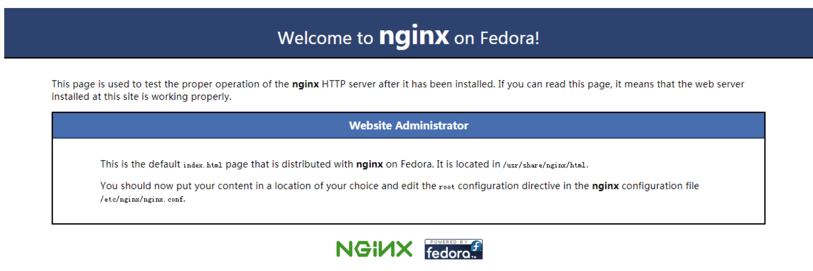
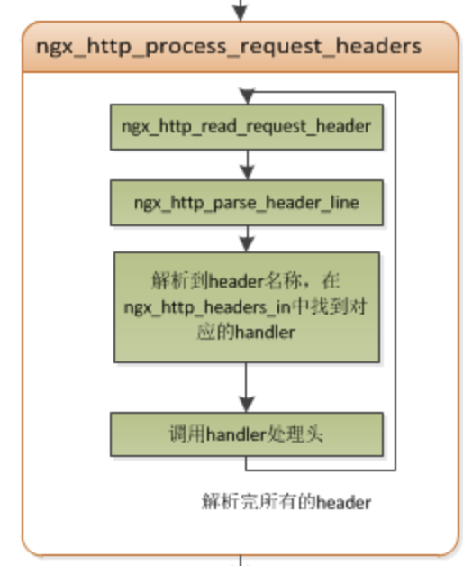
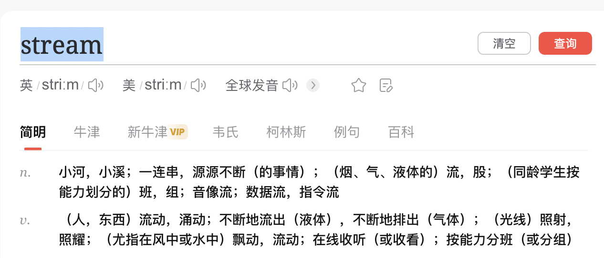

[TOC]


# 1. 基础概念

## 1.1 Nginx 简介

- 特性

  - 反向代理，负载均衡器
  - 高可靠性、单master多worker模式
  - 高可扩展性、高度模块化
  - 非阻塞
  - 事件驱动
  - 低内存消耗
  - 热部署

- Nginx（发音为"engine X"）是一个高性能的开源Web服务器和反向代理服务器，以其卓越的性能、高并发能力和低资源消耗而闻名。它最初由Igor Sysoev开发，于2004年首次发布。Nginx旨在解决C10k问题，即如何在面对数万个并发连接时保持高性能和稳定性。

  以下是Nginx的主要特点和用途：

  - **Web服务器**: Nginx可以用作静态内容的Web服务器，例如HTML、CSS、JavaScript和图像文件。它可以通过配置文件设置虚拟主机，允许您在单个服务器上托管多个域名或网站。

  - **反向代理**: Nginx常用作反向代理服务器，将客户端的请求转发到后端服务器，如应用服务器、数据库服务器等。这可以提供负载均衡、缓存、SSL终端和更高的安全性。

  - **负载均衡**: Nginx可以将来自客户端的请求分发到多个后端服务器，以平衡负载并提高系统的可靠性和性能。

  - **反向代理缓存**: Nginx可以缓存动态内容的静态副本，以减轻后端服务器的负载，加快页面加载速度，提高用户体验。

  - **SSL终端**: Nginx可以作为SSL终端，用于处理加密流量，将加密的HTTPS请求解密并将非加密的流量转发给后端服务器。

  - **安全性**: Nginx有强大的安全性特性，可以用于防止DDoS攻击、防止恶意请求、限制IP访问等。

  - **可扩展性**: Nginx具有模块化结构，允许开发人员根据需要添加自定义功能和扩展。

  - **高性能**: Nginx的事件驱动架构和异步处理方式使其能够处理大量并发连接，具有出色的性能表现。

  - **开源**: Nginx是开源软件，可以免费使用，并且拥有一个活跃的社区，不断为其添加新功能和修复bug。

  ​        总之，Nginx是一个功能强大、高性能且灵活的服务器软件，适用于多种用途，从简单的静态文件托管到复杂的负载均衡和反向代理设置。它在现代Web应用架构中扮演着重要角色，并且在许多大型网站和应用中得到广泛应用。

## 1.2 Nginx与Apache对比

​		下面是将Nginx和Apache进行对比的表格：

|   特点/方面    |                     Nginx                      |                    Apache                     |
| :------------: | :--------------------------------------------: | :-------------------------------------------: |
|   架构和性能   | 事件驱动的异步架构，处理高并发连接，低内存消耗 | 多进程/多线程模型，较高内存消耗，适合动态内容 |
|    适用场景    |          静态资源、反向代理、负载均衡          |          动态内容、扩展性、模块丰富           |
| 配置和学习曲线 |        相对简单的配置文件语法，块式逻辑        |      相对复杂的配置文件，较陡的学习曲线       |
|  模块和扩展性  |       较少的模块，聚焦核心功能，较高性能       |    大量模块，支持多种需求，但可能影响性能     |
|   配置热重载   |            支持热重载，无需中断服务            |   通常需要重启来加载新配置，可能有短暂中断    |

## 1.2 代理信息

​		代理（Proxy）是一种网络通信模式，它充当客户端和目标服务器之间的中间人，将客户端的请求转发给目标服务器，并将目标服务器的响应返回给客户端。代理在网络通信中具有多种用途和功能，包括安全性、性能优化、内容过滤和访问控制等。


### 1.2.1 正向代理

​		正向代理位于客户端和目标服务器之间，代表客户端发出请求。它主要用于隐藏客户端的真实IP地址，增加隐私和安全性，访问受限资源，以及在一些国家或组织中绕过网络封锁。例如，公司内部可能使用正向代理来限制员工对特定网站的访问。


### 1.2.2 反向代理

​		反向代理位于目标服务器和客户端之间，代表目标服务器响应客户端的请求。它可以用于负载均衡，将请求分发到多个后端服务器，从而提高性能和可用性。反向代理还可以提供SSL终端，缓存静态内容，保护后端服务器免受直接暴露于互联网的风险。大型网站通常会使用反向代理来处理流量和请求。


### 1.2.3 缓存代理

​		缓存代理会在客户端请求某个资源时，首先检查代理服务器上是否已经缓存了该资源的副本。如果有，代理服务器会直接返回缓存的副本，从而减少对目标服务器的请求。这可以提高性能并减轻目标服务器的负载。


### 1.2.4 内容过滤代理

​		内容过滤代理用于过滤和修改传输的内容。这可以用于广告拦截、恶意软件检测、安全性增强和内容审查等。一些组织可能使用内容过滤代理来监控员工的网络活动，确保遵守规定和政策。


### 1.2.5 负载均衡

​		当反向代理服务器存在多个，从而部署为集群，当多个客户端访问原始服务器（原始服务器也可以是集群）的时候，不同的代理服务器应答不同的客户端，然后发送不同的客户端所需的资源，从而实现负载均衡效果。


### 1.2.6 正反混合

​		实际项目操作时，正向代理和反向代理很有可能会存在在一个应用场景中，正向代理代理客户端的请求去访问目标服务器，目标服务器是一个反向代理服务器，反向代理了多台真实的业务处理服务器。


### 1.2.5 透明代理

​		透明代理是一种不需要客户端进行特殊配置的代理。它通过网络设置或路由来拦截流量，对用户来说是透明的，客户端不需要知道代理的存在。


## 1.3 代理方式对比

​		下面是正向代理、反向代理和透明代理之间的对比，以帮助您更清楚地了解它们的区别和用途：

| 特点/方面 |             正向代理             |               反向代理               |                透明代理                |
| :-------: | :------------------------------: | :----------------------------------: | :------------------------------------: |
|   位置    |    位于客户端和目标服务器之间    |      位于目标服务器和客户端之间      |    位于网络设备(交换机)，用户无感知    |
| 用户感知  |     用户知道并配置代理服务器     |   用户无感知，请求发送到代理服务器   | 用户无感知，代理在网络中进行拦截和处理 |
|   用途    | 绕过访问限制、提高隐私、绕过封锁 |  负载均衡、SSL终端、缓存、安全性等   |       访问控制、内容过滤、监控等       |
| 流量转发  |    转发客户端请求到目标服务器    |    转发客户端请求到多个后端服务器    |        拦截、修改、转发网络流量        |
| 主要功能  | 为客户端提供代理服务，代表客户端 |   为服务器提供代理服务，代表服务器   |        拦截、监控、过滤通信流量        |
|  安全性   |      用于增加用户隐私和安全      | 用于保护服务器免受直接互联网暴露风险 |          用于访问控制和安全性          |
| 负载均衡  |        通常不用于负载均衡        |    用于将请求分发到多个后端服务器    |           通常不涉及负载均衡           |
|  SSL终端  |        通常不涉及SSL终端         |   可以提供SSL终端，解密并加密流量    |           通常不涉及SSL终端            |
|   缓存    |          通常不涉及缓存          | 可以缓存静态内容以减轻后端服务器负载 |             通常不涉及缓存             |


# 2. Nginx 安装

## 2.1 Linux 安装

### 2.1.1 rpm 包方式（推荐）

- 进入[下载页面](http://nginx.org/packages/)，选择合适版本下载。


```bash
$ wget http://nginx.org/packages/centos/7/noarch/RPMS/nginx-release-centos-7-0.el7.ngx.noarch.rpm
```

- 安装 nginx rpm 包


nginx rpm 包实际上安装的是 nginx 的 yum 源。

```bash
$ rpm -ivh nginx-*.rpm
```

- 正式安装 rpm 包


```bash
$ yum install nginx
```

- 关闭防火墙


```bash
$ firewall-cmd --zone=public --add-port=80/tcp --permanent
$ firewall-cmd --reload
```

### 2.1.2 源码编译方式

- 安装编译工具及库

​		Nginx 源码的编译依赖于 gcc 以及一些库文件，所以必须提前安装。

```bash
$ yum -y install make zlib zlib-devel gcc-c++ libtool  openssl openssl-devel
```

​		Nginx 依赖 pcre 库，安装步骤如下：

- 
  - 下载解压到本地

​			进入[pcre 官网下载页面](https://sourceforge.net/projects/pcre/files/pcre/)，选择合适的版本(例子8.35)下载。

```bash
wget -O /opt/pcre/pcre-8.35.tar.gz http://downloads.sourceforge.net/project/pcre/pcre/8.35/pcre-8.35.tar.gz
cd /opt/pcre
tar zxvf pcre-8.35.tar.gz
```

- 编译安装


​		执行以下命令：

```bash
cd /opt/pcre/pcre-8.35
./configure
make && make install
```

- 检验是否安装成功


​		执行 `pcre-config --version` 命令。

### 2.1.3 编译安装 Nginx

- 下载解压到本地


​		进入官网下载地址：http://nginx.org/en/download.html ，选择合适的版本下载。

​		我选择的是 1.12.2 版本：http://downloads.sourceforge.net/project/pcre/pcre/8.35/pcre-8.35.tar.gz

```bash
wget -O /opt/nginx/nginx-1.12.2.tar.gz http://nginx.org/download/nginx-1.12.2.tar.gz
cd /opt/nginx
tar zxvf nginx-1.12.2.tar.gz
```

- 编译安装


​		执行以下命令：

```bash
cd /opt/nginx/nginx-1.12.2
./configure --with-http_stub_status_module --with-http_ssl_module --with-pcre=/opt/pcre/pcre-8.35
make && make install
```

- 关闭防火墙


```bash
$ firewall-cmd --zone=public --add-port=80/tcp --permanent
$ firewall-cmd --reload
```

- 启动 Nginx


​		安装成功后，直接执行 `nginx` 命令即可启动 nginx。

​		启动后，访问站点：



### 2.1.4 Linux 开机自启动

​		Centos7 以上是用 Systemd 进行系统初始化的，Systemd 是 Linux 系统中最新的初始化系统（init），它主要的设计目标是克服 sysvinit 固有的缺点，提高系统的启动速度。Systemd 服务文件以 .service 结尾。

- ##### rpm 包方式


​		如果是通过 rpm 包安装的，会自动创建 nginx.service 文件。

​		直接用命令：

```bash
$ systemctl enable nginx.service
```

​		设置开机启动即可。

- ##### 源码编译方式


​		如果采用源码编译方式，需要手动创建 nginx.service 文件。

## 2.2 Docker

- 官网镜像：https://hub.docker.com/_/nginx/
- 下载镜像：`docker pull nginx`
- 启动容器：`docker run --name my-nginx -p 80:80 -v /data/docker/nginx/logs:/var/log/nginx -v /data/docker/nginx/conf/nginx.conf:/etc/nginx/nginx.conf:ro -d nginx`
- 重新加载配置（目前测试无效，只能重启服务）：`docker exec -it my-nginx nginx -s reload`
- 停止服务：`docker exec -it my-nginx nginx -s stop` 或者：`docker stop my-nginx`
- 重新启动服务：`docker restart my-nginx`

## 2.3 脚本

**安装说明**

- 采用编译方式安装 Nginx, 并将其注册为 systemd 服务
- 安装路径为：`/usr/local/nginx`
- 默认下载安装 `1.16.0` 版本

**使用方法**

- 默认安装 - 执行以下任意命令即可：

```shell
curl -o- https://gitee.com/turnon/linux-tutorial/raw/master/codes/linux/soft/nginx-install.sh | bash
wget -qO- https://gitee.com/turnon/linux-tutorial/raw/master/codes/linux/soft/nginx-install.sh | bash
```

- 自定义安装 - 下载脚本到本地，并按照以下格式执行：

```bash
sh nginx-install.sh [version]
```


# 3. Nginx 架构

## 3.1 Nginx 基础框架

### 3.1.1 启动流程

- 总结

  - 

    |        流程         | 描述                                                         |
    | :-----------------: | :----------------------------------------------------------- |
    |    加载配置文件     | 主进程读取主配置文件和其他可能被引用的配置文件。配置文件包含服务器块、虚拟主机设置、反向代理规则、日志配置等信息。 |
    |  创建 Master 进程   | 主进程（Master 进程）解析配置文件并初始化必要的数据结构，负责管理其他子进程。 |
    |  创建 Worker 进程   | 主进程根据配置文件中的设定创建一定数量的 Worker 进程。每个 Worker 进程是独立的，在自己的进程空间中运行，用于处理实际的客户端请求。 |
    |    网络事件循环     | 主进程进入网络事件循环，使用事件驱动模型监听客户端连接、读取数据、写入数据等网络事件，如 select、poll、epoll 等。 |
    |      接受连接       | 主进程在客户端发起连接请求时接受连接并将其分配给空闲的 Worker 进程，以便后续处理。 |
    | Worker 进程处理请求 | Worker 进程负责处理客户端请求，包括读取请求数据、执行配置规则、处理请求内容、生成响应等。 |
    |      返回响应       | 在处理完客户端请求后，Worker 进程生成响应数据，并将其返回给客户端。 |
    |      日志记录       | Nginx 适时地记录访问日志、错误日志等，以供管理员和开发者监控和分析。 |


- Nginx 的启动流程可以简单概括为以下步骤：

  - **加载配置文件：** 
    - 当启动 Nginx 时，主进程会读取主配置文件（通常是 `/etc/nginx/nginx.conf`）以及其他可能被引用的配置文件。配置文件包含了服务器块、虚拟主机设置、反向代理规则、日志配置等信息。

  - **创建 Master 进程：** 
    - 主进程（也称为 Master 进程）是 Nginx 的控制中心，负责管理其他子进程。主进程会解析配置文件并初始化必要的数据结构。

  - **创建 Worker 进程：** 
    - 主进程会根据配置文件中的设定创建一定数量的 Worker 进程。这些 Worker 进程将会处理实际的客户端请求。每个 Worker 进程是独立的，并在一个独立的进程空间中运行。

  - **网络事件循环：** 
    - 主进程会进入网络事件循环，根据事件驱动模型（如 select、poll、epoll 等）监听客户端连接、读取数据、写入数据等网络事件。

  - **接受连接：** 
    - 当客户端发起连接请求时，主进程会接受连接并将其分配给一个空闲的 Worker 进程，以便后续处理。

  - **Worker 进程处理请求：** 
    - Worker 进程负责处理客户端请求，包括读取请求数据、执行配置规则、处理请求内容、生成响应等。

  - **返回响应：** 
    - 在处理完客户端请求后，Worker 进程会生成响应数据，并将其返回给客户端。

  - **日志记录：**
    -  Nginx 会在适当的时候记录访问日志、错误日志等，以便管理员和开发者进行监控和分析。


- 实际操作

  - 配置初始化
    - 在Nginx启动时，首先解析命令处理各种中参数。此时会创建一个ngx_cycle_t类型变量，保存启动时的各种参数，后续初始化会围绕这个变量展开。
  - 模块初始化。
    - Nginx框架启动只对核心模块（NGX_CORE_MODULE）感兴趣。而非核心模块由核心模块来初始化，比如ngx_http_core_module（NGX_HTTP_MODULE）由ngx_http_module调用。
  - 通过配置项解析工作模式
    - Nginx的工作模式分为单例模式和master模式。单例模式只有一个master进程。master模式下由一个master进程和若干worker进程和cache进程组成。
  - master模式
    - 先启动master进程，然后再启动若个worker进程和cache进程。
  - worker进程调用所有模块的init_process方法，cache manager进程关闭父进程启动时的监听端口。
  - 所有的进程启动完成后，Nginx进入待工作模式。

  - 

### 3.1.2 整体架构


#### 3.1.2.1 进程 master 

##### （1）操作流程

- 总结

  - 

    | 小标题               | 描述                                                         |
    | -------------------- | ------------------------------------------------------------ |
    | 加载配置文件         | 主进程启动时加载配置文件，其中包含服务器的设置、虚拟主机配置、反向代理规则等信息。 |
    | 初始化               | 主进程初始化全局数据结构和资源，为后续的进程创建和操作做准备。 |
    | 启动 Worker 进程     | 根据配置文件中指定的 Worker 进程数量，在操作系统中创建一组 Worker 进程，负责实际的客户端请求处理。 |
    | 信号处理             | 主进程监听操作系统发送的信号，响应信号来控制服务器，如重新加载配置、优雅地关闭服务器等。 |
    | 事件循环             | 主进程进入事件循环，通过事件驱动模型监听信号、读写事件等，以响应来自操作系统和其他进程的事件。 |
    | 监听 Worker 进程状态 | 持续监控 Worker 进程状态，异常退出时重新创建新的 Worker 进程，保持服务器可用性。 |
    | 接受信号             | 接受其他进程发送的信号，进行协调和控制。                     |
    | 关闭服务器           | 收到关闭信号时，发送信号给所有 Worker 进程，停止新连接接受并处理未完成请求。等待所有 Worker 进程停止后，主进程退出，实现服务器关闭。主进程负责加载配置、启动和管理 Worker 进程、处理信号、监听事件等。主进程的存在使得 Nginx 能够灵活地控制整个服务器的运行，并在需要时进行配置重载、关闭等操作。 |


- ​        Nginx 的主进程（Master Process）是整个 Nginx 服务器的控制中心，负责管理和协调所有的 Worker 进程。以下是主进程的基本流程：

  - **加载配置文件：** 主进程启动时会加载配置文件（通常是 `nginx.conf`），其中包含了服务器的设置、虚拟主机配置、反向代理规则等信息。

  - **初始化：** 主进程会初始化一些全局数据结构和资源，为后续的进程创建和操作做准备。

  - **启动 Worker 进程：** 主进程会根据配置文件中指定的 Worker 进程数量，在操作系统中创建一组 Worker 进程。这些 Worker 进程将负责实际的客户端请求处理。

  - **信号处理：** 主进程会监听操作系统发送的信号，以便在需要时对整个服务器进行控制。例如，主进程可以响应 `HUP` 信号来重新加载配置，响应 `QUIT` 信号来优雅地关闭服务器等。

  - **事件循环：** 主进程进入一个事件循环，通过事件驱动模型监听信号、读写事件等。这使得主进程能够在不同状态下响应来自操作系统和其他进程的事件。

  - **监听 Worker 进程状态：** 主进程会持续监控 Worker 进程的状态，以便在某个 Worker 进程异常退出时能够重新创建新的 Worker 进程，保持服务器的可用性。

  - **接受信号：** 主进程会接受来自其他进程（如 Worker 进程）发送的信号，以便进行协调和控制。

  - **关闭服务器：** 如果主进程接收到关闭信号（如 `QUIT`），它会开始关闭服务器。主进程会发送信号给所有的 Worker 进程，让它们停止接受新连接，并开始处理未完成的请求。然后主进程会等待所有 Worker 进程都停止，最后自行退出。

  ​        总之，主进程是 Nginx 服务器的控制中心，负责加载配置、启动和管理 Worker 进程、处理信号、监听事件等。主进程的存在使得 Nginx 能够灵活地控制整个服务器的运行，并在需要时进行配置重载、关闭等操作。

##### （2）进程 master操作命令

- `kill -HUP pid ` 

  - 关闭指定进程，用于重启Nginx

- `./nginx -s reload`

  - ​        在Nginx中，使用`./nginx -s reload`命令来重新加载（reload）Nginx服务器的配置，使新的配置生效，而无需完全重启服务器。这是一种优雅的方式，可以在不中断现有连接的情况下更新配置。

    ​		具体来说，`./nginx -s reload`命令会执行以下操作：

    - `./nginx`是启动Nginx服务器的命令。当加上参数`-s reload`时，它告诉Nginx执行重新加载操作。

    - Nginx主进程会根据参数`-s reload`的指示，重新加载配置文件，检查新的配置项和规则。

    - 主进程会派生新的工作进程（Worker Processes），并将新的配置应用于这些新的工作进程。已有的工作进程会继续处理现有连接，而新的工作进程会处理新的连接。

    - 一旦新的工作进程启动并准备好处理请求，Nginx会逐渐切换到新的配置和工作进程，然后停止旧的工作进程。这样可以确保不中断现有连接，同时应用新的配置。

  - ​        需要注意的是，重新加载配置并不总是安全的，取决于配置文件的更改内容。如果配置文件存在语法错误或不一致，重新加载可能会导致服务器不稳定。因此，在执行`./nginx -s reload`之前，通常建议使用`nginx -t`命令来测试配置文件的语法是否正确。

    ​		总之，`./nginx -s reload`命令使Nginx服务器能够在不中断服务的情况下重新加载配置，以便应用新的设置。

- ./nginx -s stop

  - ​		在Nginx中，使用`./nginx -s stop`命令来停止Nginx服务器的运行。这会发送一个停止信号给Nginx主进程，然后主进程会关闭所有工作进程，终止服务器的运行。

    ​		具体来说，`./nginx -s stop`命令会执行以下操作：

    - `./nginx`是启动Nginx服务器的命令。当加上参数`-s stop`时，它告诉Nginx执行停止操作。

    - Nginx主进程会接收到停止信号，然后开始关闭所有工作进程。

    - 主进程会等待当前处理的请求完成，然后逐步终止工作进程。这确保在关闭服务器时不会丢失客户端请求的处理。

    - 一旦所有工作进程都终止，Nginx主进程会自行退出，从而完全停止Nginx服务器的运行。

  - ​        需要注意的是，使用`./nginx -s stop`命令会正常关闭Nginx服务器，但如果存在未处理的连接或请求，它们可能会在服务器关闭之前完成处理。这是一种优雅的方式来停止服务器，以确保不丢失数据或中断正在进行的操作。

    ​		如果需要立即停止Nginx服务器，而不等待未完成的连接或请求处理完毕，可以使用`./nginx -s quit`命令。

    ​		总之，`./nginx -s stop`命令用于优雅地停止Nginx服务器的运行，确保现有的连接和请求得到适当处理。

#### 3.1.2.2 进程 worker 

##### （1）fork 保持独立性

- 每个 worker 进程都是从 master 进程 fork 过来

  - 在 master 进程里面，先建立好需要 listen 的 socket（listenfd）之后，然后再 fork 出多个 worker 进程。

  - 注：

    - ​		`fork`是一个在类Unix操作系统中的系统调用，用于创建一个新的进程（子进程）作为调用进程（父进程）的副本。新的子进程会从`fork`调用的地方开始执行，继承了父进程的内存空间、文件描述符和其他资源。

      ​		具体来说，`fork`系统调用会复制父进程的状态和数据，创建一个几乎完全相同的子进程。子进程独立于父进程运行，它们共享相同的程序代码，但各自拥有独立的堆栈和数据段。

      - 以下是`fork`的基本工作流程：

        - 调用进程调用`fork`系统调用。


        - 操作系统在内核中为子进程分配新的进程ID，并复制父进程的内存映像、寄存器状态和其他进程控制信息。


        - 子进程被创建，它从`fork`调用的位置开始执行。


        - 子进程和父进程独立运行，但它们可以共享文件描述符和打开的文件。这意味着父子进程可以在父进程创建的文件上执行读写操作。


        - 子进程通常会返回0作为返回值，而父进程会返回子进程的进程ID。这样，通过检查返回值，可以在父进程和子进程中执行不同的代码路径。


                `fork`通常用于创建子进程以执行并行任务。在很多情况下，子进程可以通过调用`exec`系列函数来加载一个新的程序，从而在子进程中执行不同的代码。此外，`fork`还是创建多进程程序的基础，例如在Web服务器、数据库管理系统等应用中。
    
    ​		需要注意的是，`fork`的操作会涉及资源的复制和分配，因此可能会消耗一定的系统资源。在多线程环境中，使用`fork`时需要特别注意，因为复制线程的资源会导致不稳定的行为。


​    

##### （2）accept_mutex锁        

- ​        由于 `accept_mutex` 机制，只有一个 Worker 进程能够接受连接，而其他 Worker 进程在此期间会被阻塞。这种方式确保了每个连接只会在一个 Worker 进程中进行处理，从而避免了多个进程同时处理同一个连接的情况。

  - ​		在 Nginx 多进程模型中，为了保证只有一个 Worker 进程处理新连接，以及为了防止多个进程同时进行 accept 连接，使用了一种叫做 `accept_mutex`（接受互斥）的机制。这个机制确保在同一时刻只有一个 Worker 进程在执行 accept 操作，从而避免了竞态条件。

    ​		下面是具体流程：	

    - **抢占 accept_mutex：** 
      - 当新连接到达时，所有的 Worker 进程会竞争抢占 `accept_mutex`。只有一个 Worker 进程能够成功获得这个锁，而其他进程则会被阻塞。

    - **获得锁的进程注册读事件：** 
      - 获得锁的 Worker 进程会注册监听 listenfd（监听套接字）的读事件。这意味着只有这个进程能够在监听套接字上监听新连接的到来。

    - **接受连接：** 
      - 获得锁的 Worker 进程开始监听监听套接字，等待新连接。一旦新连接到来，它会调用 `accept` 函数来接受连接，并创建对应的连接套接字。

    - **处理请求：** 
      - 接受连接后，该 Worker 进程会读取客户端的请求数据，解析请求头部和内容。然后根据配置规则，它会处理请求，生成响应数据，并将响应写回连接套接字，最终发送给客户端。

    - **断开连接：** 
      - 处理完成后，该 Worker 进程会断开与客户端的连接，释放连接套接字和其他相关资源。

    ​        由于 `accept_mutex` 机制，只有一个 Worker 进程能够接受连接，而其他 Worker 进程在此期间会被阻塞。这种方式确保了每个连接只会在一个 Worker 进程中进行处理，从而避免了多个进程同时处理同一个连接的情况。

#### 3.1.2.3 事件类型


​	**网络事件、定时器事件、信号事件**


- 网络事件

  - 以下是一些常见的网络事件类型：

    - **连接事件（Connection Events）：**
       - **连接建立：** 当客户端与服务器建立新的网络连接时，会触发连接建立事件。
       - **连接关闭：** 当连接被客户端或服务器关闭时，会触发连接关闭事件。

    - **数据传输事件（Data Transfer Events）：**
       - **数据接收：** 当服务器接收到来自客户端的数据时，会触发数据接收事件。
       - **数据发送：** 当服务器向客户端发送数据时，会触发数据发送事件。

    - **超时事件（Timeout Events）：**
       - **连接超时：** 当连接建立的过程中超过一定时间限制而未完成时，会触发连接超时事件。
       - **数据传输超时：** 当在数据传输过程中，一方在一段时间内未接收到数据时，会触发数据传输超时事件。

    - **错误事件（Error Events）：**
       - **连接错误：** 当连接建立或传输过程中出现错误时，会触发连接错误事件。
       - **数据传输错误：** 当数据在传输过程中发生错误，如数据包丢失或损坏，会触发数据传输错误事件。

    - **可读/可写事件（Read/Write Events）：**
       - **可读事件：** 当连接上有数据可供读取时，会触发可读事件，通常用于非阻塞 I/O 操作。
       - **可写事件：** 当连接上可以进行写入操作时，会触发可写事件，通常用于非阻塞写入数据。

    - **监听事件（Listen Events）：**
       - **监听开始：** 当服务器开始监听指定端口时，会触发监听开始事件。
       - **监听停止：** 当服务器停止监听指定端口时，会触发监听停止事件。

    这些事件类型用于表示不同情况下的网络操作和状态变化。在异步非阻塞的网络编程中，程序可以通过监听这些事件，根据事件的发生来执行相应的操作，从而实现高效的网络通信和事件处理。

- **监听套接字上的可读事件（Accept）：**
  当有一个新的客户端连接请求到达服务器的监听套接字时，会触发可读事件。Nginx 工作进程会执行以下操作：
  - 接受新连接：工作进程会调用 `accept` 函数来接受这个新连接。
  - 分配资源：分配一个新的连接对象和相关资源，将新连接与特定的处理逻辑关联。
  - 注册可读事件：工作进程会将已连接套接字上的可读事件注册到事件模型中，以监听客户端发送的数据。

- **已连接套接字上的可读事件（Read）：**
  当已连接套接字上有数据到达等待读取时，会触发可读事件。Nginx 工作进程会执行以下操作：
  - 读取数据：工作进程会调用 `read` 函数从连接套接字读取客户端发送的数据。
  - 处理请求：根据收到的请求数据，工作进程会进行请求解析，执行相应的反向代理、静态文件处理或其他逻辑。
  - 注册可写事件：如果需要向客户端发送响应数据，工作进程会将已连接套接字上的可写事件注册到事件模型中。

- **已连接套接字上的可写事件（Write）：**
  当可以向已连接套接字写入数据时，会触发可写事件。Nginx 工作进程会执行以下操作：
  - 写入数据：工作进程会调用 `write` 函数将响应数据写入连接套接字，准备发送给客户端。
  - 发送响应：工作进程将响应数据发送给客户端，可能涉及分块发送、压缩等操作。
  - 注销可写事件：在数据发送完毕后，工作进程会将已连接套接字上的可写事件从事件模型中注销。

- **定时器事件（Timer）：**
  定时器事件用于处理超时情况，例如连接超时或请求处理超时。Nginx 工作进程会执行以下操作：
  - 设置定时器：工作进程会在合适的时机设置定时器，比如在接受新连接时设置连接超时定时器。
  - 定时器触发：如果超过设定的时间，定时器会触发，工作进程会执行相应的超时处理，如关闭连接或返回错误响应。

- **信号事件（Signal）：**
  信号事件用于主进程和工作进程之间的通信，例如重新加载配置或优雅关闭。当主进程收到信号时，会触发信号事件，执行相应的操作。

​		这些示例说明了不同事件类型在 Nginx 中的具体应用。事件驱动模型使得 Nginx 能够在不同情况下高效地监听和处理事件，实现高性能的网络通信和连接管理。

#### 3.1.2.4 网络事件处理

​		Nginx 通过异步非阻塞的事件处理方式，使得单个工作进程能够高效地管理和处理大量并发连接，而不需要为每个连接创建一个独立的线程。这使得 Nginx 能够在资源有限的情况下，实现高性能和高并发的处理能力。与传统的多线程模型相比，Nginx 的事件处理方式在资源利用和性能方面有着明显的优势。

##### （1）异步非阻塞

- Nginx 采用的异步非阻塞事件处理方式：

  - **事件驱动模型：** 

    - Nginx 使用事件驱动模型来监听网络事件，如连接的到来、读写数据等。它不会为每个连接创建一个独立的线程，而是通过事件机制来管理和处理大量的并发连接。

  - **非阻塞 I/O：**

    - Nginx 使用非阻塞 I/O 操作。在传统的同步阻塞模型中，一个线程在等待 I/O 操作完成时会被阻塞，而 Nginx 的工作进程不会等待 I/O 完成，而是继续处理其他事件。

    - 注

      - 同步非阻塞和异步非阻塞的区别

        - 在同步非阻塞模型中，服务器需要主动地轮询套接字以检查数据是否准备好，这可能会浪费一些 CPU 资源。
        - 在异步非阻塞模型中，服务器注册了一个回调函数来处理数据读取，然后继续执行其他任务，不需要轮询。当数据准备好时，操作系统会通知服务器调用回调函数，避免了轮询的资源浪费。

      - 实例

        - **场景：** 假设有一个简单的网络服务器，它需要处理客户端发送的请求并返回响应。

          - **同步非阻塞模型：**

            - 客户端发送请求到服务器。

            - 服务器收到请求，发现有数据需要读取，但不会等待数据准备好，而是继续执行其他任务。

            - 服务器使用非阻塞方式轮询套接字，等待数据准备好。

            - 当数据准备好时，服务器读取数据并处理请求。

            - 服务器返回响应给客户端。

          - **异步非阻塞模型：**

            - 客户端发送请求到服务器。

            - 服务器收到请求，发现有数据需要读取，但不会等待数据准备好，而是继续执行其他任务。

            - 服务器注册一个回调函数来处理数据读取操作，然后继续执行其他任务。

            - 当数据准备好时，操作系统通知服务器，服务器调用预先注册的回调函数来读取并处理数据。

            - 服务器返回响应给客户端。

  - **事件循环：** 

    - 每个工作进程通过事件循环来监听多个连接上的事件。它会不断地轮询事件，一旦事件发生（如有新连接、有数据可读等），就会触发相应的回调函数。

  - **异步处理：** 

    - Nginx 使用异步处理方式，即当有事件发生时，不会立即处理事件，而是将事件放入事件队列中，然后继续监听其他事件。这样可以最大限度地减少线程切换和等待时间。

  - **单线程多连接：** 

    - 每个 Nginx 工作进程都是单线程的，但它能够同时管理和处理多个连接。通过异步事件处理，一个工作进程可以同时处理成千上万个连接。

  - **减少资源开销：** 

    - 由于 Nginx 使用单线程和异步处理，它能够显著减少线程创建和上下文切换的开销，从而提高了服务器的性能和响应能力。

  ​        总之，Nginx 通过异步非阻塞的事件处理方式，使得单个工作进程能够高效地管理和处理大量并发连接，而不需要为每个连接创建一个独立的线程。这使得 Nginx 能够在资源有限的情况下，实现高性能和高并发的处理能力。与传统的多线程模型相比，Nginx 的事件处理方式在资源利用和性能方面有着明显的优势

##### （2）事件处理流程

​		Nginx 的事件处理是其高性能和高并发能力的关键所在。它通过事件驱动模型来监听和处理各种网络事件，以实现高效的连接管理和数据处理。以下是 Nginx 的事件处理的详细过程：

- **事件模块初始化：** Nginx 在启动时会根据操作系统和平台的不同，选择合适的事件驱动模型，如 select、poll、epoll 等。事件模块负责处理底层的网络事件和操作。
- **监听套接字创建：** 主进程会创建一个监听套接字，用于等待新的连接。这个套接字会被设置为非阻塞模式，以便能够通过事件模型进行异步监听。
- **事件循环开始：** 工作进程进入事件循环，开始监听事件。它使用事件模块提供的 API 来注册监听的事件，包括监听套接字上的可读事件（新连接的到来）和已连接套接字上的可读、可写事件（数据读写）等。
- **事件发生时的处理：** 当事件发生时，事件模块会触发相应的回调函数。例如，当新连接到来时，会触发可读事件，工作进程会执行与新连接接受相关的代码。对于已连接套接字的可读事件，工作进程会读取数据；对于可写事件，工作进程会写入数据。
- **异步事件处理：** Nginx 使用异步事件处理方式，即当有事件发生时，不会立即处理事件，而是将事件放入事件队列中，然后继续监听其他事件。这样可以最大限度地减少线程切换和等待时间。
- **定时器处理：** Nginx 使用定时器来处理超时事件。例如，如果连接超时或请求处理超时，定时器会触发，工作进程可以采取相应的措施，如关闭连接或中止请求。
- **信号驱动事件：** 主进程和工作进程之间通过信号进行通信，主进程可以向工作进程发送信号，通知它们执行特定的操作，如重新加载配置、优雅关闭等。
- **连接池管理：** Nginx 使用连接池来管理连接对象，以减少频繁的内存分配和释放。连接池中的连接对象会在需要时被重复使用，从而提高效率。
- **处理完事件：** 当事件处理完成后，工作进程会继续监听其他事件，或者根据需要等待新事件的发生。

##### （3）事件判定机制

​		Nginx 的事件判定是指如何确定何时有事件发生以及如何触发相应的事件处理。Nginx 使用事件驱动模型，通过监听不同类型的事件来实现对连接和数据的处理。以下是 Nginx 事件判定的基本过程：

- **事件循环启动：** 工作进程在事件循环开始时，会通过事件模块的 API 初始化，设置要监听的事件类型和相关的回调函数。

- **注册事件：** 在事件循环中，工作进程会注册要监听的事件，通常是监听套接字上的可读事件和已连接套接字上的可读、可写事件。这些事件表示可能需要处理的情况，如新连接的到来、数据的读取和写入。

- **事件等待：** 一旦注册了要监听的事件，工作进程会进入一个等待状态，等待事件的发生。这通常是通过事件模块提供的函数（如 select、poll、epoll）来实现的。

- **事件触发：** 当监听的事件发生时，事件模块会触发相应的回调函数，通知工作进程有事件需要处理。例如，当有新连接到来时，会触发监听套接字的可读事件。

- **回调函数执行：** 一旦事件触发，工作进程会执行相应的回调函数。这些函数会包含实际的事件处理逻辑，如接受新连接、读取数据、写入数据等。

  - 注：

    - 回调函数和主动监听是两种不同的编程模式，用于处理事件和通知机制。它们有不同的工作方式和应用场景。下面是回调函数和主动监听的区别：

      **回调函数：**
      - 回调函数是一种异步编程模式，常用于处理异步操作和事件驱动的情况。
      - 在使用回调函数时，你会将一个函数（回调函数）作为参数传递给另一个函数或者系统组件。当某个事件完成时，调用回调函数来处理结果。
      - 回调函数允许你将控制权交给其他代码，而不必等待事件完成。
      - 回调函数适用于需要在某个事件完成时执行特定操作的情况，例如异步 I/O 操作、事件处理等。

      **主动监听：**
      - 主动监听是一种同步或半同步编程模式，常用于需要主动轮询或检查事件状态的情况。
      - 在主动监听中，你的代码会主动查看或轮询某个状态或事件是否发生，然后根据情况执行相应的操作。
      - 主动监听可能会造成 CPU 资源的浪费，因为你需要频繁地检查事件状态。
      - 主动监听适用于需要在事件发生之前采取某些预防措施或需要定期监测事件状态的情况。

      **区别：**
      - 回调函数是异步的，允许你在事件完成时执行操作，不会阻塞程序的执行。
      - 主动监听是同步或半同步的，需要程序主动检查或轮询事件状态，可能会导致资源浪费。

- **事件处理完成：** 一旦回调函数执行完成，工作进程会继续等待下一个事件的发生。如果有多个事件同时发生，事件模块会根据其发生的顺序触发相应的回调函数。

- **定时器处理：** Nginx 通常也会设置定时器来处理超时事件，例如连接超时或请求处理超时。定时器会在指定的时间间隔内触发，工作进程可以根据定时器的触发来处理超时情况。

​		总之，Nginx 的事件判定是通过事件驱动模型和事件模块提供的函数来实现的。工作进程会在事件循环中等待事件的发生，一旦事件发生，事件模块会触发相应的回调函数，执行实际的事件处理逻辑。这种机制使得 Nginx 能够高效地监听和处理大量并发连接和请求。

##### （6）事件驱动

​		系统调用如 `select`、`poll`、`epoll`、`kqueue` 等提供了一种机制，允许服务器可以同时监控多个事件，并且可以在一定时间内等待事件就绪，从而实现异步非阻塞的事件处理。以下是对每个系统调用的简要说明：

- **select：**
   - `select` 是一种较早的事件驱动模型，它可以同时监控多个文件描述符（套接字、文件等）是否有事件就绪。
   - 调用 `select` 时，会阻塞等待，直到指定的文件描述符中有事件就绪或达到超时时间。
   - 由于 `select` 的效率问题，它在处理大量连接时可能会有性能瓶颈。

- **poll：**
   - `poll` 也是一种用于事件驱动的系统调用，类似于 `select`，但在某些方面更优化。
   - 与 `select` 不同，`poll` 使用一个文件描述符数组来传递事件，避免了文件描述符数量限制。
   - 类似于 `select`，`poll` 也会阻塞等待，直到有事件就绪或达到超时时间。

- **epoll：**
   - `epoll` 是在 Linux 系统上提供的高效事件驱动机制，用于处理大规模并发连接。
   - `epoll` 使用三个函数：`epoll_create` 创建一个 epoll 实例，`epoll_ctl` 添加或删除事件，`epoll_wait` 等待就绪事件。
   - `epoll` 使用了基于事件的方式而不是轮询，避免了轮询的性能损耗，因此在高并发场景下更加高效。

- **kqueue：**
   - `kqueue` 是类似于 `epoll` 的事件驱动机制，在类 Unix 系统中如 FreeBSD 和 macOS 上提供。
   - `kqueue` 通过注册事件过滤器来监控文件描述符的状态变化，并在事件就绪时通知应用程序。

##### （7）事件驱动的阻塞问题

​		这个问题需要区分两个方面：系统调用本身是否阻塞，以及它们是如何在异步非阻塞事件处理中使用的。

- **系统调用本身是否阻塞：**
   - `select` 和 `poll` 是阻塞的系统调用，意味着在调用它们时，如果没有事件就绪，程序会一直阻塞，直到有事件就绪或达到设置的超时时间。
   - `epoll` 和 `kqueue` 在设计上是非阻塞的系统调用，意味着调用它们时，如果没有事件就绪，不会阻塞，而是立即返回。这就是为什么它们通常与异步非阻塞事件处理一起使用，以避免无谓的阻塞。
- **如何在异步非阻塞事件处理中使用：**
   - 尽管 `select` 和 `poll` 本身是阻塞的，但在异步非阻塞事件处理中，它们通常被设置为非阻塞模式。程序会不断轮询这些调用，以检查是否有事件就绪。这样，即使它们本身是阻塞的，但由于程序不会一直等待，所以不会对整个应用的并发性能造成影响。
   - `epoll` 和 `kqueue` 通常以非阻塞的方式使用，因此更适合于高性能的异步非阻塞事件处理。
   - 需要注意的是，
     - ​        即使 `select` 和 `poll` 是阻塞的系统调用，它们在异步非阻塞事件处理中的使用方式可以避免主线程的长时间阻塞，从而实现高并发性能。
     - `epoll` 和 `kqueue` 在设计上更加适合于高性能的事件驱动模型。

##### （8）事件的监听/回调机制

​		Nginx 的网络事件处理是通过主动监听和回调函数两种机制相结合来实现的。

- **主动监听：** Nginx 主进程使用事件驱动的机制（例如 `epoll`、`kqueue` 等）来主动监听网络事件的发生，例如连接的到来、数据的接收等。主进程会持续地等待就绪事件，并在事件就绪时采取相应的操作。这种主动监听机制允许 Nginx 在异步非阻塞的环境中高效地处理大量的网络连接和数据传输。

- **回调函数：** 在处理网络事件时，Nginx 使用了回调函数的机制。当某个网络事件就绪时，Nginx 会调用事先注册好的回调函数来处理该事件。回调函数负责执行实际的操作，例如读取数据、处理请求、发送响应等。这使得 Nginx 能够根据事件的发生异步地执行相应的操作，而不会阻塞整个进程。

​		综合来说，Nginx 的网络事件处理既包括主动监听网络事件的就绪，也包括通过回调函数来处理就绪的事件。这种机制使得 Nginx 能够在高并发、异步非阻塞的情况下高效地处理网络请求和数据传输，从而实现了高性能的网络通信。

#### 3.1.2.5 信号事件

##### （1）信号事件处理

- **信号处理：** 信号是一种在操作系统中用于通知进程某个事件发生的机制。不同的信号代表着不同的事件，如终止进程、停止进程、重新加载配置等。程序可以通过注册信号处理函数来捕获并响应特定信号。
- **特定的信号：** Nginx 使用一些特定的信号来进行管理和控制。例如，`SIGTERM` 信号用于优雅地终止 Nginx 进程，`SIGHUP` 信号用于重新加载配置。
- **中断和系统调用：** 当程序正在等待事件（如 `epoll_wait`）时，如果收到信号，信号处理函数会被调用，程序会中断当前的操作。这可能会导致正在执行的系统调用失败，需要重入。一旦信号处理函数完成，程序可以继续执行，重新进入事件等待状态。
- **epoll_wait 的影响：** 当程序正在等待事件（如 `epoll_wait`）时，如果收到信号，`epoll_wait` 会返回错误（通常是 `-1`），并将错误码设置为 `EINTR`。此时，程序可以重新进入 `epoll_wait` 调用，以等待下一个事件。

##### （2）信号事件类型

​		Nginx 使用一些常见的信号事件来控制其运行和管理。这些信号可以用于启动、停止、重新加载配置以及与 Nginx 进程进行交互。以下是一些常见的 Nginx 信号事件：

- **SIGTERM（15）：**
   - 这是默认的优雅终止信号。
   - 当收到该信号时，Nginx 将会优雅地关闭所有工作进程并终止。

- **SIGHUP（1）：**
   - 这是重新加载配置的信号。
   - 当收到该信号时，Nginx 将重新读取配置文件，重新加载配置，无需停止服务。

- **SIGUSR1（10）：**
   - 这是重新打开日志文件的信号。
   - 当收到该信号时，Nginx 将关闭当前的日志文件，然后重新打开一个新的日志文件。

- **SIGUSR2（12）：**
   - 这是平滑升级二进制文件的信号。
   - 当收到该信号时，Nginx 将会启动新的二进制文件，并在平滑过渡的过程中逐步替换老的工作进程，实现不中断服务的升级。

- **SIGQUIT（3）：**
   - 这是优雅退出信号。
   - 当收到该信号时，Nginx 将会关闭所有工作进程并终止，但在终止前会先将已经接受的请求处理完毕。

- **SIGWINCH：**
   - 这是重新打开日志文件并释放已经删除的日志文件的信号。
   - 与 SIGUSR1 类似，但它会释放被删除的日志文件占用的磁盘空间。

​		这些信号事件允许管理员和运维人员通过发送特定的信号来控制 Nginx 的行为。通过合理使用这些信号，可以实现服务的启动、停止、重新加载配置、平滑升级等操作，从而提高服务器的可维护性和可靠性。

##### （3）信号事件流程

​		Nginx 信号事件的处理流程涉及到服务器的状态变化和响应动作。下面是 Nginx 信号事件的处理流程的一般步骤：

- **Nginx 启动：** 当你启动 Nginx 时，通常会执行启动命令，例如 `nginx`。此时 Nginx 主进程开始运行。

- **信号事件处理初始化：** Nginx 主进程在启动时会初始化信号事件的处理，为每个信号注册相应的信号处理函数。

- **信号事件监听：** Nginx 主进程会进入一个事件循环，等待各种信号事件的发生。这是通过调用类似于 `sigwait` 或 `sigsuspend` 的系统调用来实现的。

- **接收信号：** 当操作系统检测到有信号事件发生（例如收到 `SIGTERM` 或 `SIGHUP` 信号），会将信号发送给 Nginx 主进程。

- **信号处理函数执行：** 一旦信号被接收，与信号关联的信号处理函数会被执行。这些处理函数根据信号的类型和含义执行相应的操作。

- **信号处理动作：** 信号处理函数的执行通常涉及到某种动作，例如：
   - **SIGTERM：** 执行优雅终止操作，关闭工作进程并终止主进程。
   - **SIGHUP：** 重新加载配置，通知工作进程重新读取配置文件。
   - **SIGUSR1：** 关闭当前日志文件并打开新的日志文件。
   - **SIGUSR2：** 启动平滑升级，逐步替换工作进程，实现升级过程。
   - **SIGQUIT：** 执行优雅退出操作，关闭工作进程前处理已接受的请求。

- **操作执行和响应：** 信号处理函数的执行会引起相应的操作和状态变化，例如重启、平滑升级、关闭工作进程等。Nginx 主进程会根据信号处理函数的动作来执行相应的操作。

- **工作进程管理：** 根据信号处理的不同，Nginx 主进程可能会管理工作进程的启动、关闭、重启等操作，以实现配置的更改、平滑升级或服务的停止。

- **信号事件循环继续：** 一旦信号处理函数执行完毕，Nginx 主进程会继续进入信号事件监听的循环，等待下一个信号的发生。

​		总之，Nginx 信号事件的处理流程涉及到信号的接收、处理函数的执行以及相应的操作和状态变化。通过合理地注册和处理信号，管理员可以在不中断服务的情况下控制 Nginx 的行为，实现配置的更改、平滑升级、终止服务等操作。

##### （4）信号事件监听/回调机制

​		Nginx 的信号事件是通过主动监听和回调函数两种机制结合来实现的。

- **主动监听：** Nginx 主进程会主动监听操作系统发来的信号。它通过调用系统提供的信号处理函数来响应信号的发生。这个监听和处理的过程是由 Nginx 主进程控制的，它会在一个事件循环中等待信号的到来，然后执行相应的信号处理函数。这种主动监听机制确保了 Nginx 在信号发生时能够及时做出响应。

- **回调函数：** 在 Nginx 中，信号处理函数本质上是回调函数。一旦信号发生，Nginx 主进程会调用事先注册好的信号处理函数，来执行与该信号相关的操作。这些操作可能涉及到重启工作进程、重新加载配置、执行平滑升级等。因此，信号处理函数实际上是一种回调函数，当信号发生时，会被主动调用。

​		综合来说，Nginx 的信号事件处理是通过主动监听信号的到来，并调用相应的回调函数来实现的。这种机制使得管理员可以通过发送特定的信号来触发 Nginx 执行特定的操作，从而实现服务器的控制和管理。

#### 3.1.2.6 定时器事件

##### （1）定时器的处理流程

​		Nginx 的定时器事件处理涉及到定时器的注册、事件循环以及回调函数的执行。以下是定时器事件处理的一般流程：

- **定时器注册：** 在需要设置定时器的地方，通常会调用特定的函数来注册一个定时器事件。这个函数会指定一个时间间隔或者超时时间，以及与之关联的回调函数。

- **事件循环开始：** Nginx 主进程会进入一个事件循环，等待各种事件的发生，包括定时器事件。这个事件循环是一个持续的过程，会在整个 Nginx 生命周期中不断进行。

- **定时器触发判断：** 在每次事件循环的迭代中，Nginx 会检查已注册的定时器，判断是否有定时器已经超过了设置的时间间隔或超时时间。

- **定时器触发：** 如果某个定时器已经超时，Nginx 会触发该定时器，即调用与之关联的回调函数。这个回调函数会执行相应的操作，用于响应定时器的触发。

- **回调函数执行：** 在定时器的回调函数中，可以执行一些预定的操作，例如执行定时任务、清理资源、执行超时处理等。回调函数的执行会在定时器超时后异步进行。

- **继续事件循环：** 定时器触发的回调函数执行完毕后，Nginx 主进程会继续进行事件循环，等待下一个事件的发生，可能是定时器、网络事件或其他类型的事件。

​		总之，定时器事件处理流程涉及到定时器的注册、事件循环、定时器触发判断和回调函数的执行。这种机制使得 Nginx 能够在异步非阻塞的环境中，高效地执行延迟操作和定时任务，以及处理超时情况。

##### （2）定时器事件的类别

​		在 Nginx 中，定时器事件可以分为以下几个类别，用于实现不同类型的延迟操作、定时任务以及超时处理：

- **超时定时器（Timeout Timers）：** 这类定时器用于设置连接、数据传输等操作的超时时间。当超过指定的时间间隔后，会触发定时器事件，执行相应的超时处理，例如关闭连接、中断传输等。

- **周期性定时器（Periodic Timers）：** 这类定时器会周期性地触发事件。它们会在指定的时间间隔内重复触发，用于执行需要定期执行的任务，如定时统计、定时清理等。

- **延迟定时器（Delay Timers）：** 这类定时器用于在一定时间间隔后触发事件。它们用于实现延迟执行某些操作，例如在请求处理中加入延迟，模拟真实场景中的网络延迟等。

- **定时任务定时器（Scheduled Task Timers）：** 这类定时器用于执行预定的定时任务，例如定时备份、定时报告生成等。它们会在指定的时间点触发，执行特定的任务。

​		这些定时器事件的类别使得 Nginx 可以在异步非阻塞的环境中高效地进行延迟操作、定时任务以及超时处理。通过合理地使用这些定时器，Nginx 能够灵活地处理各种场景下的时间相关操作，从而提高服务器的性能和可维护性。

##### （3）定时器事件的监听/回调机制

​		Nginx 的定时器是通过回调函数来实现的，而不是主动监听。

​		在 Nginx 中，定时器用于实现一些延迟操作、定时任务以及超时处理。这些定时器事件会在一段时间后触发，而不需要主动监听事件的到来。Nginx 的事件驱动机制会检测定时器是否已经超时，然后调用相应的回调函数来处理定时器事件。

​		具体的流程如下：

- **定时器注册：** 在需要设置定时器的地方，Nginx 可以通过调用相应的函数来注册一个定时器事件。这个事件包含了定时的时间间隔或超时时间，以及与之关联的回调函数。

- **事件循环：** 在 Nginx 的主进程中，会存在一个事件循环。在每次循环中，Nginx 会检查已注册的定时器，判断是否有定时器已经超时。

- **超时处理：** 一旦定时器超时，Nginx 会调用与之关联的回调函数。这个回调函数实际上就是定时器的触发操作，用于执行需要在定时器超时时执行的任务。

- **任务执行：** 在定时器的回调函数中，可以执行一些任务，例如清理资源、触发定时任务、执行超时处理等。这些任务会在定时器触发时异步执行。

​		总结起来，Nginx 的定时器是通过回调函数来实现的，而不需要主动监听。这使得 Nginx 能够在事件驱动的环境下，高效地执行延迟操作和定时任务，以及处理超时情况。

#### 3.1.2.7 worker 数量的设定

​		Nginx 在进程数以及多核利用方面的优化，以及其他一些细节上的优化，都体现了其高性能和高效率的设计思想。以下是你提到的一些关键点的详细解释：

- **设置 Worker 数量：** 推荐将 Worker 进程的数量设置为 CPU 的核数，这样每个 CPU 核心都可以专注地处理一个 Worker 进程，避免了不必要的上下文切换。过多的 Worker 进程可能会导致 CPU 竞争和上下文切换，从而降低性能。

- **CPU 亲缘性绑定：** Nginx 提供了 CPU 亲缘性的绑定选项，可以将某个 Worker 进程绑定到特定的 CPU 核心上。这样可以避免进程切换带来的 CPU 缓存失效，提高了数据的访问效率，进而提高性能。

- **优化细节：** Nginx 在设计上注重细节优化，例如将字符串比较优化成整数比较，减少 CPU 的指令数。这些小的优化可以在大量请求和数据处理时累积起来，进而显著提升整体性能。

- **极致性能追求：** Nginx 的设计者对性能和资源利用的追求可见一斑。通过减少不必要的资源消耗，避免上下文切换，以及在关键路径上的优化，Nginx 成功地实现了高并发、低延迟的网络通信。

​		这些优化措施使得 Nginx 在高负载和高并发的情况下表现优异，成为众多高性能网络应用的首选。通过合理的配置和优化，可以最大程度地发挥 Nginx 的潜力，提供卓越的性能和稳定性。


#### 3.1.2.8 事件代码描述

​		以下是一个简化的 Python 代码片段，用于总结 Nginx 的事件处理模型。请注意，这只是一个示例，实际的 Nginx 事件处理模型要更加复杂和高度优化。

```python
import select

class NginxWorker:
    def __init__(self):
        self.event_loop = select.epoll()  # 使用 epoll 实现事件循环
        self.connections = {}  # 连接管理字典，保存文件描述符和连接状态的映射

    def add_connection(self, conn):
        fd = conn.fileno()
        self.connections[fd] = conn
        self.event_loop.register(fd, select.EPOLLIN)

    def remove_connection(self, conn):
        fd = conn.fileno()
        self.event_loop.unregister(fd)
        conn.close()
        del self.connections[fd]

    def start(self):
        while True:
            events = self.event_loop.poll()  # 等待事件就绪
            for fd, event in events:
                conn = self.connections[fd]
                if event & select.EPOLLIN:  # 可读事件就绪
                    conn.handle_read()
                if event & select.EPOLLOUT:  # 可写事件就绪
                    conn.handle_write()

class Connection:
    def __init__(self, sock):
        self.sock = sock

    def fileno(self):
        return self.sock.fileno()

    def handle_read(self):
        data = self.sock.recv(1024)
        # 处理接收到的数据

    def handle_write(self):
        # 发送数据到客户端
        pass

# 创建 Nginx Worker 实例
worker = NginxWorker()

# 建立连接并添加到事件循环
sock1 = socket.socket(socket.AF_INET, socket.SOCK_STREAM)
sock1.bind(('0.0.0.0', 8080))
sock1.listen(5)
conn1 = Connection(sock1)
worker.add_connection(conn1)

# 启动事件循环
worker.start()
```

​		这个示例展示了一个简化的 Nginx 事件处理模型，

​		其中使用了 epoll 来实现事件循环，通过添加连接对象并注册文件描述符来监听事件。

​		实际的 Nginx 代码会更为复杂，还涉及到更多的优化和特性，但这个示例可以帮助你更好地理解 Nginx 的事件驱动模型。


## 3.2 Nginx 基础概念

### 3.2.1 connection

#### （1）概念

|       概念       | 描述                                                         |
| :--------------: | ------------------------------------------------------------ |
|     TCP 连接     | 通信设备之间的通信路径。在 Nginx 中，通常指客户端与服务器之间的连接。 |
|      连接池      | 一组预分配的连接资源，Nginx 在接收到连接请求时从连接池获取连接，减少连接创建和销毁的开销，提高性能。 |
|     连接状态     | 连接可以处于建立中、已建立、关闭等状态，Nginx 通过状态管理来确保连接的正确性和稳定性。 |
|     连接超时     | Nginx 可以设置连接的超时时间，在一段时间内如果连接未成功建立或没有数据传输，Nginx 可以主动关闭连接以释放资源。 |
| Keep-Alive 连接  | 允许客户端和服务器之间的连接在多个请求之间保持活跃状态，减少连接的建立和关闭开销，提高性能。 |
|     连接限制     | Nginx 可以设置最大连接数和连接速率限制，防止过多的连接导致服务器资源耗尽。 |
| 事件驱动连接管理 | Nginx 使用事件驱动的方式来管理连接，通过事件模块（如 epoll、kqueue、select）监听连接状态变化，及时处理读写事件和其他操作。 |


#### （2）Nginx处理连接的流程

​		TCP 连接在 Nginx 中的完整生命周期，从连接的建立、封装、事件处理到连接的关闭。Nginx 通过多进程模型、事件驱动机制以及连接池等技术，能够高效地处理大量并发连接，从而实现高性能的网络服务。

-  Nginx 处理一个 TCP 连接的过程与生命周期整理成几个关键步骤，以更清晰地理解：

  - **Nginx 启动：**
    -  在启动时，Nginx 解析配置文件，获取需要监听的端口和 IP 地址。Master 进程初始化监听 socket，设置选项并绑定到指定的 IP 地址和端口。

  - **子进程创建：**
    -  Nginx 的 Master 进程 fork 出多个 Worker 子进程，每个子进程都具有独立的事件处理能力。

  - **竞争 Accept：** 
    - 子进程通过 epoll 或其他事件模型竞争 accept 新的连接，当客户端发起连接请求时，一个子进程会成功地 accept 连接，获得一个连接的 socket。

  - **连接封装：** 
    - 子进程创建 ngx_connection_t 结构体，将连接的 socket 进行封装。这个结构体包含了连接的 socket、状态信息、读写事件等。

  - **设置事件处理函数：** 
    - 子进程为连接设置读写事件处理函数，指定当有数据到达时应该进行的处理。例如，读事件的处理函数可以是将数据从连接读取并交给后续处理模块。

  - **添加事件监听：** 
    - 子进程将连接的读写事件添加到事件模型中，通过事件模型监听连接的状态变化。当有数据可读或可写时，会触发相应的事件处理函数。

  - **数据交换：** 
    - 当连接的读写事件被触发，Nginx 子进程会执行相应的事件处理函数，从连接中读取或写入数据，与客户端进行数据的交换。

  - **连接关闭：** 
    - 客户端或 Nginx 可以主动关闭连接。当连接关闭时，Nginx 子进程会执行清理操作，移除事件监听，并释放连接资源。

  - **子进程重用：** 
    - 连接关闭后，子进程可以继续监听新的连接。由于 Nginx 的进程模型，每个子进程是相互独立的，关闭一个连接不会影响其他连接的处理。


#### （3）Nginx作为客户端时向其他服务器请求流程

​		Nginx 在作为客户端时可以使用其内置的 upstream 模块来请求其他服务器的数据。Nginx 作为客户端通过 ngx_connection_t 结构体、事件模块和非阻塞套接字来管理与其他服务器的连接。这种设计使得 Nginx 能够高效地处理多个并发连接，从而在代理、负载均衡等场景下表现出色。

- 以下是一个简要的步骤概述，说明 Nginx 如何作为客户端请求其他服务器的数据：

  - **获取 ngx_connection_t 结构体：**
    -  当需要与其他服务器建立连接时，Nginx 会从连接池中获取一个 ngx_connection_t 结构体。这个结构体用于管理与其他服务器之间的连接。

  - **创建 socket：** 
    - Nginx 在获得 ngx_connection_t 结构体后，会使用标准的 socket 创建函数来创建一个用于与目标服务器通信的套接字（socket）。此时可以设置一些套接字属性，如将套接字设置为非阻塞模式。

  - **添加事件处理：** 
    - 一旦套接字创建成功，Nginx 会使用事件模块（如 epoll 或 kqueue）来监视套接字上的事件，包括连接建立、读取和写入等事件。这允许 Nginx 在事件发生时做出适当的响应。

  - **连接建立：** 
    - 通过调用 connect 函数，Nginx 尝试与目标服务器建立连接。由于套接字被设置为非阻塞模式，Nginx 可以在连接建立过程中继续处理其他任务，而不会被阻塞。

  - **读写数据：** 
    - 一旦连接建立，Nginx 可以使用 read 和 write 函数来在套接字上进行数据的读取和写入。这使得 Nginx 可以从其他服务器读取响应数据，并将客户端的请求数据发送到其他服务器。

  - **关闭连接：** 
    - 在完成数据传输后，或者在需要终止连接时，Nginx 可以通过关闭套接字来断开与目标服务器的连接。

  - **释放 ngx_connection_t：** 
    - 当连接不再需要时，ngx_connection_t 结构体可以被返回给连接池，以便它可以被重用。同时，与之关联的资源也会被释放，以避免资源泄漏。


#### （3）ngx_cycle_t 

- ​		`ngx_connection_t` 是 Nginx 中用来表示连接的结构体类型。在 Nginx 的源代码中，这个结构体被广泛使用来管理与客户端和其他服务器之间的连接信息。它包含了许多与连接相关的属性和数据，以及处理连接事件的函数指针。

  ​		以下是一个简要的 `ngx_connection_t` 结构体的示意：

  ```c
  typedef struct ngx_connection_s ngx_connection_t;
  
  struct ngx_connection_s {
      // 与具体套接字相关的数据和状态信息
      int                 fd;             // 套接字文件描述符
      void               *data;           // 与连接关联的数据
      // ...
  
      // 连接的读写事件处理函数
      ngx_event_handler_pt  read;          // 读事件处理函数
      ngx_event_handler_pt  write;         // 写事件处理函数
  
      // ...
  };
  ```

  - 在上述示意中，`ngx_connection_t` 结构体包含了以下关键属性：

    - `fd`：套接字文件描述符，用于标识连接的唯一标识符。

    - `data`：一个指针，可以用来关联用户自定义的数据结构，使用户能够将自己的数据与连接关联起来。

    - `read` 和 `write`：这些是函数指针，指向处理读取和写入事件的函数。当连接上有数据可读或可写时，对应的函数会被调用。


  ​        `ngx_connection_t` 结构体在 Nginx 中的用途非常广泛，它不仅用于管理与客户端和其他服务器的连接，还涉及到连接的事件处理、连接池管理等。这个结构体的设计使得 Nginx 能够高效地管理大量的并发连接，从而在代理、负载均衡、反向代理等场景下表现出色。

- 连接池

  - ​		在 Nginx 中，`ngx_cycle_t` 结构体是全局的核心结构体之一，用于表示 Nginx 的运行时环境和配置。在 `ngx_cycle_t` 结构体中确实包含了与连接池相关的三个成员，它们分别是：`connections`、`free_connections` 和 `free_connection_n`。

    ​		下面是这些成员的简要说明：

    - `connections`：这是一个指向 `ngx_connection_t` 结构体数组的指针，它表示该 Nginx 实例的连接池。每个元素存储一个客户端或服务器连接的相关信息，例如套接字描述符、连接状态、数据缓冲等。连接池的大小通常由配置项 `worker_connections` 决定，即每个 worker 进程所能够支持的最大连接数。

    - `free_connections`：这是一个链表，用于存储空闲的 `ngx_connection_t` 结构体，即当前未被使用的连接。当连接不再需要时，会将它放回这个链表中，以便下次可以重新使用。通过使用这个链表，Nginx 可以高效地重用连接，避免频繁创建和销毁连接带来的性能开销。

    - `free_connection_n`：这是一个表示空闲连接数量的整数。它是一个快速的计数器，用于迅速获取当前空闲连接的数量，避免每次都需要遍历整个 `free_connections` 链表。


​    

  - 例子

    - `connections`、`read_events` 和 `write_events` 是 Nginx 中用于连接池和事件管理的关键成员，它们共同构成了 Nginx 的事件驱动体系的基础
      - 在 Nginx 的 `ngx_cycle_t` 结构体中，的确有三个成员分别是 `connections`、`read_events` 和 `write_events`。这些成员在事件处理和连接管理方面扮演着重要的角色：
        - **`connections`：** 
          - 指针数组，每个元素是指向 `ngx_connection_t` 结构体的指针。
          - 这个数组用于存储当前 worker 进程的连接池。每个 worker 进程都会拥有一个独立的连接池，连接池的大小由 `worker_connections` 参数决定。`connections` 数组的索引对应于文件描述符（fd），通过该索引可以找到对应的连接信息。这个数组在初始化时会被填充，用于保存所有可能的连接。
        - **`read_events`：**
          -  指针数组，每个元素是指向 `ngx_event_t` 结构体的指针。
          - 这个数组用于管理读事件，它会与 `connections` 数组中的连接一一对应。当连接上有数据可读时，对应的 `read_events` 数组中的元素会被设置，从而在事件循环中触发相应的读事件处理。
        - **`write_events`：** 
          - 指针数组，每个元素是指向 `ngx_event_t` 结构体的指针。
          - 这个数组用于管理写事件，同样与 `connections` 数组中的连接一一对应。当连接可以写入数据时，对应的 `write_events` 数组中的元素会被设置，从而在事件循环中触发相应的写事件处理。
    - 

#### （4）worker_connections

​		`worker_connections` 是 Nginx 配置项中的一个参数，用于设置每个 Nginx worker 进程支持的最大并发连接数。这个参数决定了每个 worker 进程能够同时处理的客户端连接数量。每个连接都会占用一定的资源，包括内存和文件描述符等。

​		在 Nginx 配置文件中，您可以通过设置 `worker_connections` 参数来指定每个 worker 进程可以处理的最大连接数。例如：

```nginx
worker_processes 4;
worker_connections 1024;
```

​		在上述示例中，Nginx 将使用 4 个 worker 进程，并且每个 worker 进程能够同时处理最多 1024 个连接。请注意，总的并发连接数等于 `worker_processes` 乘以 `worker_connections`，这将影响到 Nginx 服务器的整体并发性能。

​		需要注意以下几点：

- **系统资源限制：** 

  - 除了 `worker_connections` 参数，还需要考虑操作系统的资源限制，如每个进程可打开的文件描述符数（`ulimit -n`）。如果 `worker_connections` 设置得太大，可能会导致操作系统的文件描述符不足。

- **内存消耗：**

  -  每个连接都会占用一定的内存，包括连接数据结构、缓冲区等。因此，如果设置过大的 `worker_connections`，会增加服务器的内存消耗。

  - 每一个 网络连接需要分配 一个 ngx_connection_t 结构体 和 两个 ngx_event_t 结构体（分表表示连接和读、写事件），则消耗的内存是：

    ```nginx
    1 * sizeof(struct ngx_connection_s) + 2 * sizeof(struct ngx_event_s) = 1 * 232 + 2 * 96;
    //ngx_connection_s 与 ngx_event_s 结构体的大小 具体的Nginx的版本不同，可能会有微小的差异
    ```

    

- **连接池：** 

  - 每个 worker 进程会有一个连接池，其大小由 `worker_connections` 决定。连接池用于管理连接的复用，以避免频繁地创建和销毁连接。

- **考虑实际需求：** 

  - 在设置 `worker_connections` 时，需要根据服务器的实际硬件资源、网络状况以及所需的性能来进行调整。不同的应用场景和负载可能需要不同的设置。

- **连接多样化**：

  - 这个连接不仅是对于浏览器客户端的连接，而且也是面向上游服务器的，所以如果是做的反向代理业务，那么一个客户端连接就要消耗两个conneciton。


​		总之，`worker_connections` 是一个重要的配置参数，它对 Nginx 服务器的性能和资源消耗有着直接影响。在调整这个参数时，需要综合考虑系统资源、内存消耗和实际需求。

#### （5）Nginx的最大连接数

​		Nginx 在处理连接时会涉及到 `worker_connections` `worker_processes` 这两个参数，反向代理场景下还需要考虑连接的双向。

- **本地资源请求：** 
  - 如果 Nginx 仅提供本地资源的 HTTP 请求，那么能够支持的最大并发连接数就是
    -  `worker_connections * worker_processes`

  - 因为每个连接都只涉及与客户端的通信。

- **反向代理：**
  -  如果 Nginx 用作反向代理服务器，每个并发连接会建立与客户端的连接以及与后端服务的连接。因此，在这种情况下，能够支持的最大并发连接数应该是
    -  `worker_connections * worker_processes / 2`。

  - 这是因为每个并发需要维护两个连接，一个用于与客户端通信，另一个用于与后端服务通信。


​		需要注意的是，这些计算只是理论上的最大值。实际情况会受到硬件资源、操作系统的限制以及 Nginx 自身的性能影响。此外，您还需要根据具体的负载情况和应用需求来调整参数，以保证系统的稳定性和性能。	

#### （5）Nginx多进程处理连接

- accept_mutex
  - `accept_mutex`是一个配置项，用于控制是否开启进程间竞争 `accept` 锁。
    - 当 `accept_mutex` 开启时，只有获得了 `accept` 锁的进程才会去添加 `accept` 事件，也就是允许该进程接受新连接。其他进程会等待获取这个锁。
- ngx_accept_disabled
  - `ngx_accept_disabled`值，用于控制是否去竞争 `accept_mutex` 锁。
    - 其计算方式是：`ngx_accept_disabled = connections / 8 - free_connections`，
      -  `connections` 是当前所有连接的总数，
      - `free_connections` 是空闲连接的数量。
      - 这个值反映了当前空闲连接相对于总连接数的比例。

- 连接规则

  - 当 `ngx_accept_disabled` 大于 0 时，
    - 意味着剩余连接数相对较少，当前 worker 进程会主动不去尝试获取 `accept_mutex` 锁，从而让出获取连接的机会。
    - 这是通过将 `ngx_accept_disabled` 减 1 来实现的，每次进入这段代码都会减 1，直到小于 0。
  - 不去获取 `accept_mutex` 锁相当于让出了获取连接的机会，其他进程有更大的机会去获得锁并处理连接。这样，Nginx 就在多进程间实现了连接的平衡，避免了某个进程占用过多的连接资源，从而保证了系统的高效性能。

- 代码

  - 这段代码计算 `ngx_accept_disabled` 的值，该值用于控制是否去竞争 `accept_mutex` 锁。

    ```c
    ngx_accept_disabled = ngx_cycle->connection_n / 8
        - ngx_cycle->free_connection_n;
    ```

    - `ngx_cycle->connection_n` 表示当前 Nginx 进程的所有连接总数，

    - `ngx_cycle->free_connection_n` 表示空闲连接的数量。

    - 通过计算，得出 `ngx_accept_disabled`，该值在剩余连接相对较少时会大于 0，反之小于等于 0。

    ```c
    if (ngx_accept_disabled > 0) {
        ngx_accept_disabled--;
    } else {
        if (ngx_trylock_accept_mutex(cycle) == NGX_ERROR) {
            return;
        }
    
        if (ngx_accept_mutex_held) {
            flags |= NGX_POST_EVENTS;
        } else {
            if (timer == NGX_TIMER_INFINITE
                    || timer > ngx_accept_mutex_delay)
            {
                timer = ngx_accept_mutex_delay;
            }
        }
    }
    ```

    这段代码根据 `ngx_accept_disabled` 的值来决定是否去获取 `accept_mutex` 锁，以及是否让出获取连接的机会。

    - 如果 `ngx_accept_disabled` 大于 0，即剩余连接较少，当前进程会减少 `ngx_accept_disabled` 的值。
      - 这意味着当前进程不会去竞争 `accept_mutex` 锁，从而让出获取连接的机会。

    - 如果 `ngx_accept_disabled` 小于等于 0，当前进程会尝试获取 `accept_mutex` 锁，即竞争锁。
      - 如果获取失败，会直接返回。

    - 如果成功获取了 `accept_mutex` 锁，会根据是否已经持有锁（`ngx_accept_mutex_held`）和定时器的状态来设置 `flags` 和 `timer`。
      - 如果已经持有锁，表示之前已经处理过连接事件，需要标记后续需要进行事件的处理；
      - 否则，会根据定时器的状态来决定是否设置等待时间。


### 3.2.2 request

#### （1）HTTP请求结构

​		当客户端发送一个 HTTP 请求到服务器，并且服务器接收并处理该请求后，服务器会返回一个 HTTP 响应。一个完整的 HTTP 请求和响应包括请求行、请求头、请求体、响应行、响应头和响应体，如下所示：

- **HTTP 请求：**

  ```bash
  
  请求行
  GET /path/to/resource HTTP/1.1
  
  请求头
  Host: example.com
  User-Agent: Mozilla/5.0 (Windows NT 10.0; Win64; x64; rv:91.0) Gecko/20100101 Firefox/91.0
  Accept: text/html,application/xhtml+xml,application/xml;q=0.9,image/webp,*/*;q=0.8
  
  请求体
  (key1=value1&key2=value2)
  ```

  - 请求行包含了请求方法（例如 GET、POST）、请求的目标 URL 和使用的 HTTP 版本。
  - 请求头包含了各种信息，如 Host、User-Agent、Accept 等，用于传递请求的上下文和附加信息。
  - 请求体（在 POST 或 PUT 请求中）包含了请求的数据，例如表单数据或 JSON 数据。

- **HTTP 响应：**

  ```php
  
  响应行
  HTTP/1.1 200 OK
  
  响应头
  Server: nginx/1.19.10
  Content-Type: text/html; charset=utf-8
  Content-Length: 1234
  
  响应体
  <!DOCTYPE html>
  <html>
  <head>
      <title>Example Page</title>
  </head>
  <body>
      <h1>Hello, world!</h1>
  </body>
  </html>
  ```

  - 响应行包含了响应的状态码和描述，如 HTTP/1.1 200 OK 表示请求成功。
  - 响应头包含了服务器返回的信息，如 Server、Content-Type、Content-Length 等。
  - 响应体包含了服务器返回的实际数据，如 HTML 内容、JSON 数据等。


#### （2）基础HTTP请求流程

​		基本的 HTTP 服务器处理流程：

| 步骤 | 描述                                                         |
| :--: | ------------------------------------------------------------ |
|  1.  | 连接建立：客户端连接到服务器，创建套接字用于通信。           |
|  2.  | 接收请求行：服务器从套接字中读取请求行，获取请求的方法、URI、HTTP 版本。 |
|  3.  | 处理请求头：服务器从套接字中读取请求头，获取附加信息如 User-Agent、Host 等。 |
|  4.  | 确定请求体：根据请求方法和请求头，判断是否存在请求体及其长度。 |
|  5.  | 读取请求体：如果存在请求体，从套接字中读取指定长度的请求体数据。 |
|  6.  | 处理请求：根据收到的请求信息，执行相应的处理逻辑，如查询数据库。 |
|  7.  | 生成响应：生成响应行，包括 HTTP 版本和响应状态码。           |
|  8.  | 生成响应头：生成响应头，包括 Content-Type、Content-Length 等。 |
|  9.  | 生成响应体：根据请求处理结果，生成实际的响应体数据。         |
| 10.  | 发送响应：通过套接字将响应数据发送给客户端。                 |
| 11.  | 关闭连接：在完成响应后，关闭与客户端的连接，释放资源。       |


#### （3）Nginx处理请求流程


##### （a）ngx_http_init_request

​		`ngx_http_init_request` 函数是 Nginx 中负责初始化一个 HTTP 请求的函数，它在收到客户端的连接并开始处理请求时被调用。

```c
ngx_int_t
ngx_http_init_request(ngx_event_t *rev)
{
    ngx_connection_t  *c;
    ngx_http_request_t *r;

    c = rev->data;
    r = ngx_pcalloc(c->pool, sizeof(ngx_http_request_t));
    if (r == NULL) {
        return NGX_ERROR;
    }

    r->pool = c->pool;
    r->connection = c;

    // 其他初始化工作，如分配资源、设置回调函数等

    ngx_http_handler(r);

    return NGX_OK;
}
```

- 在这个函数中，主要的操作包括：

  - 获取连接结构体 `ngx_connection_t` 以及初始化 HTTP 请求结构体 `ngx_http_request_t`。

  - 分配内存池，将连接结构体和请求结构体关联起来。

  - 调用 `ngx_http_handler` 函数，开始处理请求。


- 这里有一些关键的要点：

  - `ngx_event_t *rev` 是表示读事件的结构体，它包含了有关事件的信息，如套接字、连接等。

  - `ngx_http_request_t` 是 Nginx 用于表示一个 HTTP 请求的结构体，它包含了与请求相关的所有信息，如请求头、请求体、响应等。

  - `ngx_pcalloc` 函数用于分配内存池，并将请求结构体关联到连接的内存池上，以确保请求的内存管理与连接的生命周期一致。

  - `ngx_http_handler` 函数是 Nginx 内部的调度函数，它根据请求的状态和处理阶段，将请求分发到不同的处理函数，如请求行解析、请求头解析、处理请求体等。


##### （b）ngx_http_process_request_line

|      功能      | ngx_http_read_request_header                                 | ngx_http_parse_request_line                                  |
| :------------: | :----------------------------------------------------------- | ------------------------------------------------------------ |
| 负责读取的数据 | 从连接中读取请求行、请求头以及可能的请求体                   | 从内部缓冲区中解析请求行                                     |
|    数据来源    | 客户端连接                                                   | 请求的内部缓冲区                                             |
|  数据读取方式  | 逐行读取数据                                                 | 解析数据状态机                                               |
|  判断继续读取  | 根据读取的数据来决定是否需要继续读取请求体                   | 根据状态机的解析结果决定是否需要继续解析                     |
|    主要操作    | 使用套接字操作从连接中逐行读取数据，存储在请求的内部缓冲区   | 使用状态机逐步解析请求行的各个部分                           |
|    数据存储    | 将读取的数据存储在请求的内部缓冲区中                         | 提取请求方法、URI、HTTP 版本等信息存储在请求结构体中         |
|    方法比较    | -                                                            | 将请求方法的字符串转换为整数，提高解析效率                   |
|    处理流程    | 读取请求行、请求头以及可能的请求体                           | 逐步解析请求行的不同部分                                     |
|     返回值     | 根据读取的状态返回相应的值（`NGX_OK`, `NGX_AGAIN`, `NGX_ERROR`） | 返回解析的状态，`NGX_OK` 表示解析成功，`NGX_AGAIN` 表示需要继续解析，`NGX_ERROR` 表示解析错误 |
|      作用      | 准备数据以供后续处理                                         | 解析请求行，提取请求信息，为后续处理阶段做准备               |

这个表格呈现了 `ngx_http_read_request_header` 和 `ngx_http_parse_request_line` 函数的主要功能和特点，帮助更好地理解这两个函数在 Nginx 请求处理中的作用。

- ngx_http_read_request_header （**客户端 -> 内部缓冲区**）

  - `ngx_http_read_request_header` 函数是 Nginx 中用于读取请求头的函数。

    - 它负责从客户端连接中逐行读取请求数据，包括请求行和请求头，然后将这些数据存储在请求的内部缓冲区中。

    ```c
    ngx_int_t
    ngx_http_read_request_header(ngx_http_request_t *r)
    {
        ngx_int_t         rc;
        ngx_connection_t *c;
    
        c = r->connection;
    
        while (1) {
            rc = ngx_http_parse_request_line(r, c->buffer);
            
            if (rc == NGX_AGAIN) {
                // 请求行未完整读取，继续读取数据
                if (ngx_http_read_request_header_block(r, c) != NGX_OK) {
                    return NGX_ERROR;
                }
                continue;
            }
    
            if (rc == NGX_ERROR) {
                return NGX_ERROR;
            }
    
            if (rc == NGX_OK) {
                // 请求行解析完毕，读取请求头
                if (ngx_http_read_request_header_block(r, c) != NGX_OK) {
                    return NGX_ERROR;
                }
                
                // 请求头已完整读取
                return NGX_OK;
            }
        }
    }
    ```

    - 在这个函数中，主要的操作包括：

      - 从请求的连接结构体 `ngx_http_request_t` 中获取连接信息。

      - 使用 `ngx_http_parse_request_line` 函数来解析请求行。如果请求行未完整读取，函数会返回 `NGX_AGAIN`，需要继续读取数据。

      - 如果请求行解析完成（`NGX_OK`），则调用 `ngx_http_read_request_header_block` 函数继续读取请求头数据。

      - 循环进行解析，直到请求头完整读取。


            需要注意，`ngx_http_read_request_header_block` 函数会根据请求头的具体大小和是否有请求体来决定如何读取数据块。整个过程会逐步构建请求的内部缓冲区，使得请求行和请求头都被存储在请求的数据结构中，为后续的处理阶段提供数据。
    
    ​        总之，`ngx_http_read_request_header` 函数是 Nginx 请求处理流程中的关键一步，负责逐行读取请求数据，解析请求行和请求头，并将这些信息存储在请求的内部缓冲区中，为后续的请求处理做好准备。


- ngx_http_parse_request_line （**分析缓冲区中的请求信息，不处理请求头部**）

  - `ngx_http_parse_request_line` 函数是 Nginx 中用于解析 HTTP 请求行的函数。

    - 它从请求的内部缓冲区中提取请求方法、URI、HTTP 版本等信息。

    ```c
    ngx_int_t
    ngx_http_parse_request_line(ngx_http_request_t *r, ngx_buf_t *b)
    {
        u_char     ch, *p, *m;
        enum {
            sw_start = 0,
            sw_method,
            sw_spaces_before_uri,
            sw_after_slash_in_uri,
            sw_http,
            sw_http_H,
            sw_http_HT,
            sw_http_HTT,
            sw_http_HTTP,
            sw_first_major_digit,
            sw_major_digit,
            sw_first_minor_digit,
            sw_minor_digit,
            sw_spaces_after_digit,
            sw_almost_done
        } state;
    
        state = r->state;
        p = r->request_start;
    
        for (/* omitted: loop through buffer */) {
    
            ch = *p++;
    
            switch (state) {
                // ... （根据状态机解析请求行的不同部分）...
            }
    
            if (state == sw_almost_done) {
                // 解析完请求行
                r->request_end = p - 1;
                return NGX_OK;
            }
        }
    
        r->state = state;
        r->request_start = p;
    
        return NGX_AGAIN;
    }
    ```

    - 在这个函数中，主要的操作包括：

      - 使用状态机进行请求行解析：
        - `ngx_http_parse_request_line` 使用一个状态机来逐个字符地解析请求行，从而确定请求方法、URI 和 HTTP 版本等信息。


      - 根据状态逐步解析请求行：
        - 状态机根据不同的字符输入逐步转换状态，以确定请求行的各个部分。例如，它从 `sw_start` 开始，逐步转换到 `sw_method`、`sw_spaces_before_uri`、`sw_after_slash_in_uri` 等状态，最终解析完整个请求行。


      - 返回值：
        - 根据解析的状态，函数返回不同的值。如果解析成功，返回 `NGX_OK`，如果需要继续解析，返回 `NGX_AGAIN`，如果解析错误，返回 `NGX_ERROR`。


      - 设置请求结束位置：
        - 在解析完整个请求行后，会设置请求的结束位置，即 `r->request_end` 指向请求行的最后一个字符。


             需要注意的是，`ngx_http_parse_request_line` 函数仅负责解析请求行，提取请求方法、URI、HTTP 版本等信息，并不会处理请求头部。请求头部的解析是在后续的阶段进行的。


​    

##### （c）ngx_http_process_request_headers


- `ngx_http_process_request_line` 和 `ngx_http_process_request_headers` 区别：

| 功能       | ngx_http_process_request_line                                | ngx_http_process_request_headers                     |
| ---------- | ------------------------------------------------------------ | ---------------------------------------------------- |
| 负责处理   | 请求行                                                       | 请求头部字段                                         |
| 解析内容   | 解析请求方法、URI 和 HTTP 版本等                             | 解析请求头部字段的名称和值                           |
| 解析时间点 | 请求行解析阶段的第一步                                       | 请求头部解析阶段的后续步骤                           |
| 主要操作   | 使用状态机解析请求行                                         | 逐行解析请求头部字段，支持多行字段（如 `Cookie`）    |
| 调用时机   | 在建立连接后，请求处理开始时被调用                           | 在解析完请求行后，请求处理继续时被调用               |
| 数据存储   | 将解析得到的请求方法、URI 等存储在请求结构体中               | 将解析得到的请求头部字段的名称和值存储在请求结构体中 |
| 返回值     | 根据解析状态返回相应的值（`NGX_OK`, `NGX_AGAIN`, `NGX_ERROR`） | 根据处理状态返回相应的值（`NGX_OK`, `NGX_ERROR`）    |
| 作用       | 解析请求的起始部分，提取基本信息                             | 解析和处理请求头部字段，为后续处理做准备             |


| 功能           | ngx_http_read_request_header                                 | ngx_http_parse_header_line                       |
| -------------- | ------------------------------------------------------------ | ------------------------------------------------ |
| 负责读取的数据 | 从客户端连接中逐行读取请求头数据，包括请求行和请求头字段     | 从内部缓冲区中解析一行请求头                     |
| 数据来源       | 客户端连接                                                   | 请求的内部缓冲区                                 |
| 数据读取方式   | 逐行读取数据                                                 | 使用状态机逐字符解析                             |
| 解析多行头部   | 不涉及，只处理一行一行的请求头字段                           | 能够处理多行请求头字段的情况                     |
| 判断解析结束   | 根据读取到空行来判断请求头结束                               | 根据解析状态和字符逐步判断请求头解析状态         |
| 主要操作       | 使用套接字操作从连接中读取数据，存储在请求的内部缓冲区中     | 逐字符解析请求头字段的名称和值                   |
| 数据存储       | 将读取的数据存储在请求的内部缓冲区中                         | 将解析得到的请求头字段存储在请求结构体中         |
| 返回值         | 根据读取和解析状态返回相应的值（`NGX_OK`, `NGX_AGAIN`, `NGX_ERROR`） | 根据解析的状态和字符逐步返回解析结果             |
| 作用           | 准备请求头数据以供后续处理                                   | 解析请求头字段，提取名称和值，存储在请求结构体中 |

- 处理流程

  - 相关的流程：

    - `ngx_http_process_request_line`：解析完请求行后，

      - 会将读事件的 handler 设置为 `ngx_http_process_request_headers`，从而进入到请求头部处理阶段。

    - `ngx_http_process_request_headers`：

      - 在这个阶段，Nginx 会继续从客户端连接中读取数据，并调用 `ngx_http_parse_header_line` 来逐行解析请求头字段。

      - 解析得到的字段会被存储在 `ngx_http_request_t` 结构体的 `headers_in` 字段中。

    - 特殊请求头处理：在 `ngx_http_process_request_headers` 函数中，Nginx 会检查解析到的请求头字段，

      - 如果某个字段需要特殊处理，就会在 `ngx_http_headers_in` 映射表中查找对应的处理函数并执行。

        这使得您可以根据不同的请求头字段执行定制化的处理逻辑。

    - 请求头处理完成：一旦所有的请求头字段都解析完毕，Nginx 就会开始处理请求体部分，或者根据请求的特性（如 GET 请求）直接进入下一阶段。

      


- ngx_http_read_request_header

  - `ngx_http_read_request_header` 函数是 Nginx 中用于读取 HTTP 请求头部的函数。

    - 它负责从客户端连接中逐行读取请求头部数据，包括请求行和各个请求头字段。
    - 这个函数在处理一个新的 HTTP 请求时被调用，用于解析请求头部的内容。

    ```c
    ngx_int_t
    ngx_http_read_request_header(ngx_http_request_t *r)
    {
        // 从客户端连接中读取数据到请求的缓冲区
        while (客户端连接中有数据可读) {
            // 读取数据到请求的内部缓冲区
            ...
            
            // 尝试解析请求头部字段行
            ngx_int_t rc = ngx_http_parse_header_line(r, r->header_in, 1);
            
            if (rc == NGX_OK) {
                // 请求头部字段行解析成功
                return NGX_OK;
            } else if (rc == NGX_AGAIN) {
                // 请求头部字段行未完整解析，继续读取数据
                continue;
            } else {
                // 解析出错
                return NGX_ERROR;
            }
        }
        
        // 等待下一次可读事件
        return NGX_AGAIN;
    }
    ```

    `ngx_http_read_request_header` 函数在 Nginx 请求处理流程中负责从客户端连接中逐步读取请求头部数据，

    使用 `ngx_http_parse_header_line` 函数进行解析。

    解析完成后，请求头部字段的名称和值会被存储在请求结构体中，为后续的请求处理做好准备。

- ngx_http_parse_header_line

  - `ngx_http_parse_header_line` 函数是 Nginx 中用于解析 HTTP 请求头部字段的函数。它会从请求的内部缓冲区中逐字符解析，提取请求头部字段的名称和值。以下是关于 `ngx_http_parse_header_line` 函数的详细解释：

    ```c
    ngx_int_t
    ngx_http_parse_header_line(ngx_http_request_t *r, ngx_buf_t *b, ngx_int_t allow_underscores)
    {
        u_char     c, ch, *p;
        size_t     len;
        ngx_uint_t h;
        enum {
            sw_start = 0,
            sw_name,
            sw_space_before_value,
            sw_value,
            sw_space_after_value,
            sw_ignore_line,
            sw_almost_done
        } state;
    
        state = r->state;
        p = r->header_name_start;
    
        for (/* omitted: loop through buffer */) {
    
            ch = *p++;
    
            switch (state) {
                // ... （根据状态机解析请求头部字段的不同部分）...
            }
    
            if (state == sw_almost_done) {
                // 请求头部字段解析完毕
                r->header_name_end = p - 1;
                return NGX_OK;
            }
        }
    
        r->state = state;
        r->header_name_start = p;
    
        // 解析未完成，等待下一次读取事件
        return NGX_AGAIN;
    }
    ```

    - 在这个函数中，主要的操作包括：


    - 使用状态机进行请求头部字段解析：
      - `ngx_http_parse_header_line` 使用一个状态机来逐字符地解析请求头部字段，从而确定字段的名称和值。
    
    - 根据状态逐步解析请求头部字段：
      - 状态机根据不同的字符输入逐步转换状态，以确定请求头部字段的各个部分。
        - 例如，它从 `sw_start` 开始，逐步转换到 `sw_name`、`sw_space_before_value`、`sw_value`、`sw_space_after_value` 等状态，最终解析完整个请求头部字段。
    
    - 返回值：
      - 根据解析的状态，函数返回不同的值。如果解析成功，返回 `NGX_OK`。
        - 如果需要继续解析，返回 `NGX_AGAIN`。
    
        - 如果解析错误，返回 `NGX_ERROR`。
    
    - 设置字段名称结束位置：
      - 在解析完请求头部字段后，会设置字段的名称结束位置，即 `r->header_name_end` 指向字段名称的最后一个字符。


            需要注意的是，`ngx_http_parse_header_line` 函数仅负责解析请求头部字段，提取字段的名称和值，并不会处理字段的具体内容。实际的字段处理逻辑在后续的阶段进行。

- ngx_http_headers_in

  ​        `ngx_http_headers_in` 结构体用于存储从 HTTP 请求头部解析出来的字段信息，这些信息在 Nginx 请求处理过程中会被使用，例如用于特殊请求头的处理逻辑。

  - `ngx_http_headers_in` 是一个结构体，它是 Nginx 中用于存储 HTTP 请求头部信息的数据结构。具体而言，`ngx_http_headers_in` 结构体存储了从请求头部解析出来的各个请求头字段的信息，以及一些额外的请求信息。这些信息将在 Nginx 的请求处理过程中被使用。

    以下是 `ngx_http_headers_in` 结构体的一些常见字段：

    ```c
    typedef struct {
        ngx_list_t                headers;           // 请求头部字段链表
        ...
        
        ngx_table_elt_t          *host;              // 请求头部中的 "Host" 字段
        ngx_table_elt_t          *connection;        // 请求头部中的 "Connection" 字段
        ngx_table_elt_t          *user_agent;        // 请求头部中的 "User-Agent" 字段
        ngx_table_elt_t          *referer;           // 请求头部中的 "Referer" 字段
        ngx_table_elt_t          *content_length;    // 请求头部中的 "Content-Length" 字段
        ...
        
        ngx_table_elt_t          *content_type;      // 请求头部中的 "Content-Type" 字段
        ngx_table_elt_t          *range;             // 请求头部中的 "Range" 字段
        ngx_table_elt_t          *if_modified_since; // 请求头部中的 "If-Modified-Since" 字段
        ngx_table_elt_t          *if_unmodified_since; // 请求头部中的 "If-Unmodified-Since" 字段
        ...
    } ngx_http_headers_in_t;
    ```

    - 在 `ngx_http_request_t` 结构体中，有一个 `headers_in` 字段，它就是一个 `ngx_http_headers_in_t` 结构体，用于存储从请求头部解析出来的各个请求头字段的信息。


    - `ngx_http_headers_in` 结构体中的字段分别代表了一些常见的请求头字段，
      - 如 "Host"、"Connection"、"User-Agent"、"Referer"、"Content-Length" 等。
      - 每个字段都是 `ngx_table_elt_t` 类型的指针，它是一个散列表元素，用于存储请求头部字段的名称和值。


- headers 解析 初始化为hash表
  - 在初始化时，会生成一个 hash 表，当每解析到一个请求头后，就会先在这个 hash 表中查找，如果有找到，则调用相应的处理函数来处理这个请求头。
    - 比如:Host 头的处理函数是 ngx_http_process_host。




##### （d）ngx_http_request_handler


- ngx_http_process_request：设置read和write的回调函数ngx_http_request_handler，

- ngx_http_request_handler通过状态机来判断是读事件还是写事件。


- 调用HTTP模块的filter链，filter链分为header和body链两部分

  - ```nginx
    /**
     * 
     */
    void
    ngx_http_process_request(ngx_http_request_t *r)
    {
        ngx_connection_t  *c;
     
        c = r->connection;
     
    #if (NGX_HTTP_SSL)
     
        if (r->http_connection->ssl) {
            long                      rc;
            X509                     *cert;
            ngx_http_ssl_srv_conf_t  *sscf;
     
            if (c->ssl == NULL) {
                ngx_log_error(NGX_LOG_INFO, c->log, 0,
                              "client sent plain HTTP request to HTTPS port");
                ngx_http_finalize_request(r, NGX_HTTP_TO_HTTPS);
                return;
            }
     
            sscf = ngx_http_get_module_srv_conf(r, ngx_http_ssl_module);
     
            if (sscf->verify) {
                rc = SSL_get_verify_result(c->ssl->connection);
     
                if (rc != X509_V_OK
                    && (sscf->verify != 3 || !ngx_ssl_verify_error_optional(rc)))
                {
                    ngx_log_error(NGX_LOG_INFO, c->log, 0,
                                  "client SSL certificate verify error: (%l:%s)",
                                  rc, X509_verify_cert_error_string(rc));
     
                    ngx_ssl_remove_cached_session(sscf->ssl.ctx,
                                           (SSL_get0_session(c->ssl->connection)));
     
                    ngx_http_finalize_request(r, NGX_HTTPS_CERT_ERROR);
                    return;
                }
     
                if (sscf->verify == 1) {
                    cert = SSL_get_peer_certificate(c->ssl->connection);
     
                    if (cert == NULL) {
                        ngx_log_error(NGX_LOG_INFO, c->log, 0,
                                      "client sent no required SSL certificate");
     
                        ngx_ssl_remove_cached_session(sscf->ssl.ctx,
                                           (SSL_get0_session(c->ssl->connection)));
     
                        ngx_http_finalize_request(r, NGX_HTTPS_NO_CERT);
                        return;
                    }
     
                    X509_free(cert);
                }
            }
        }
     
    #endif
     
        if (c->read->timer_set) {
            ngx_del_timer(c->read);
        }
     
    #if (NGX_STAT_STUB)
        (void) ngx_atomic_fetch_add(ngx_stat_reading, -1);
        r->stat_reading = 0;
        (void) ngx_atomic_fetch_add(ngx_stat_writing, 1);
        r->stat_writing = 1;
    #endif
     
        /* read和write事件都设置为：ngx_http_request_handler，通过事件状态来判断*/
        c->read->handler = ngx_http_request_handler;
        c->write->handler = ngx_http_request_handler;
        r->read_event_handler = ngx_http_block_reading;
     
        /* http处理分发核心函数 */
        ngx_http_handler(r);
     
        ngx_http_run_posted_requests(c);
    }
    ```


- ngx_http_request_handler：通过事件状态来判断读或者写事件，然后调用回调函数

  - ```nginx
    /**
     * read和write事件都设置为：ngx_http_request_handler，通过事件状态来判断
     */
    static void
    ngx_http_request_handler(ngx_event_t *ev)
    {
        ngx_connection_t    *c;
        ngx_http_request_t  *r;
     
        c = ev->data;
        r = c->data;
     
        ngx_http_set_log_request(c->log, r);
     
        ngx_log_debug2(NGX_LOG_DEBUG_HTTP, c->log, 0,
                       "http run request: \"%V?%V\"", &r->uri, &r->args);
     
        if (ev->write) {
            r->write_event_handler(r);
     
        } else {
            r->read_event_handler(r);
        }
     
        /* 主要用于处理subrequest 子请求 */
        ngx_http_run_posted_requests(c);
    }
    ```

    

- **ngx_http_run_posted_requests：**

  - **主要用于子请求，子请求会将请求链内容合并到主请求上。会损耗一些性能，因为会重新走一遍write的回调函数ngx_http_core_run_phases解析过程。**

  - 例子

    - 例如location配置：

    - ```nginx
      location /main.htm {
          # content of main.htm: main
          add_before_body /hello.htm;
          add_after_body /world.htm;
      }
      location /hello.htm {
          #content of hello.htm: hello
      }
      location /world.htm {
          #content of world.htm: world
      }
      
      
      
      
      
      
      /**
       * 主要用于处理subrequest 子请求
       *
       * location /main.htm {
       *   # content of main.htm: main
       *   add_before_body /hello.htm;
       *   add_after_body /world.htm;
       *	}
       *	location /hello.htm {
       *   	#content of hello.htm: hello
       *	}
       *	location /world.htm {
       *   	#content of world.htm: world
       *	}
       *
       */
      void
      ngx_http_run_posted_requests(ngx_connection_t *c)
      {
          ngx_http_request_t         *r;
          ngx_http_posted_request_t  *pr;
       
          /* 遍历 */
          for ( ;; ) {
       
          	/* 如果连接已经销毁，则退出 */
              if (c->destroyed) {
                  return;
              }
       
              r = c->data;
              pr = r->main->posted_requests;
       
              if (pr == NULL) {
                  return;
              }
       
              r->main->posted_requests = pr->next;
       
              r = pr->request;
       
              ngx_http_set_log_request(c->log, r);
       
              ngx_log_debug2(NGX_LOG_DEBUG_HTTP, c->log, 0,
                             "http posted request: \"%V?%V\"", &r->uri, &r->args);
       
              /* 调用write handler.   */
              r->write_event_handler(r);
          }
      }
      ```

      

##### （e）ngx_http_handler

- ngx_http_handler函数主要用于设置write事件回调函数。

  - `r->write_event_handler = ngx_http_core_run_phases`

  - ```nginx
    /**
     * 核心分发函数，主要用于设置write写事件回调函数ngx_http_core_run_phases
     */
    void
    ngx_http_handler(ngx_http_request_t *r)
    {
        ngx_http_core_main_conf_t  *cmcf;
     
        r->connection->log->action = NULL;
     
        if (!r->internal) {
            switch (r->headers_in.connection_type) {
            case 0:
                r->keepalive = (r->http_version > NGX_HTTP_VERSION_10);
                break;
     
            case NGX_HTTP_CONNECTION_CLOSE:
                r->keepalive = 0;
                break;
     
            case NGX_HTTP_CONNECTION_KEEP_ALIVE:
                r->keepalive = 1;
                break;
            }
     
            r->lingering_close = (r->headers_in.content_length_n > 0
                                  || r->headers_in.chunked);
            r->phase_handler = 0;
     
        } else {
            cmcf = ngx_http_get_module_main_conf(r, ngx_http_core_module);
            r->phase_handler = cmcf->phase_engine.server_rewrite_index;
        }
     
        r->valid_location = 1;
    #if (NGX_HTTP_GZIP)
        r->gzip_tested = 0;
        r->gzip_ok = 0;
        r->gzip_vary = 0;
    #endif
     
        /* 设置write事件回调函数，并且执行ngx_http_core_run_phases回调函数 */
        r->write_event_handler = ngx_http_core_run_phases;
        ngx_http_core_run_phases(r);
    }
    ```

##### （I）响应阶段—过滤

- 

  | 阶段          | 描述                                                         |
  | ------------- | ------------------------------------------------------------ |
  | 处理阶段      | Nginx 将 HTTP 请求分为多个处理阶段，涵盖请求解析、请求处理、响应生成等。 |
  | 过滤器作用    | 使用过滤器来加工和处理响应数据，包括响应头和响应体。         |
  | Header Filter | 处理响应头数据的过滤器，可以添加、修改和定制响应头字段。     |
  | Body Filter   | 处理响应体数据的过滤器，可以进行数据加工、压缩、转换等操作。 |
  | 过滤器链表    | 每个处理阶段都有自己的过滤器链表，过滤器按顺序依次执行。     |
  | 执行顺序      | 先执行 Header Filter 中的过滤器，然后执行 Body Filter 中的过滤器，确保数据处理顺序。 |

  ​	

##### （II）发送前body时执行一次

###### 		（a）header filter

- 

  | 名称            | Header Filter                                                |
  | --------------- | ------------------------------------------------------------ |
  | 类型            | 过滤器模块                                                   |
  | 作用            | 处理响应头数据，包括添加、修改、定制响应头字段等。           |
  | 所属模块        | ngx_http_core_module                                         |
  | 执行时机        | 在响应头生成后、响应体生成前执行。                           |
  | 配置示例        | `add_header` 指令、其他模块的配置项。                        |
  | 示例功能        | - 添加额外的响应头字段。<br>- 修改响应头字段的值。<br>- 根据请求处理状态定制响应头信息。 |
  | Header Filter链 | Header Filter 之间按照配置文件中的顺序执行。                 |

  

###### 		（b）ngx_http_header_filter

​		`ngx_http_header_filter` 模块在 Nginx 的请求处理过程中的最后一个阶段起作用，它允许在生成响应头后对响应头数据进行操作。您可以通过配置指令，例如 `add_header`，来添加额外的响应头字段，或者修改响应头中的字段值。此外，一些模块也会在生成响应头之前向 `ngx_http_request_t` 结构的 `headers_out` 成员中添加一些数据，这些数据也会在 `ngx_http_header_filter` 中进行处理。

| 模块名称        | ngx_http_header_filter                       |
| --------------- | -------------------------------------------- |
| 类型            | Header Filter 模块                           |
| 所属模块        | ngx_http_core_module                         |
| 功能            | 处理响应头数据，添加、修改、定制响应头字段等 |
| 执行时机        | 在响应头生成后、响应体生成前执行             |
| 配置示例        | `add_header` 指令、其他模块的配置项          |
| Header Filter链 | 按照配置文件中的顺序执行                     |


##### （III）多次调用body

###### 		（a）ngx_http_copy_ filter


​		`ngx_http_copy_filter` 是 Nginx 中的一个 Body Filter 模块，用于将响应体数据从一个输入缓冲区复制到输出缓冲区，实现数据的传输和输出。以下是关于 `ngx_http_copy_filter` 的更详细解释：

| 模块名称      | ngx_http_copy_filter       |
| ------------- | -------------------------- |
| 类型          | Body Filter 模块           |
| 所属模块      | ngx_http_core_module       |
| 功能          | 复制响应体数据到输出缓冲区 |
| 执行时机      | 在响应体生成后、发送前执行 |
| Body Filter链 | 按照配置文件中的顺序执行   |

​		`ngx_http_copy_filter` 模块负责处理响应体数据，将数据从输入缓冲区（通常是后端服务器返回的数据）复制到输出缓冲区，以便最终发送给客户端。这个过程实现了数据的传输和输出。

​		在 Nginx 的请求处理过程中，经过多个阶段和多个 Body Filter 的处理，数据会经过一系列的加工、压缩、转换等操作。而 `ngx_http_copy_filter` 则在这一过程中负责将经过处理的数据从输入缓冲区复制到输出缓冲区。这种机制确保数据的高效传输和最终的输出。


###### 		（b）body filter

​		Body Filter 在 Nginx 中是用于处理响应体数据的模块，它在响应体生成后，对数据进行加工、处理、转换等操作，最终将经过处理的数据发送给客户端。以下是关于 Body Filter 的详细信息：

| 类型          | Body Filter 模块                       |
| ------------- | -------------------------------------- |
| 所属模块      | ngx_http_core_module                   |
| 功能          | 处理响应体数据，加工、处理、转换等操作 |
| 执行时机      | 在响应体生成后、发送前执行             |
| 示例功能      | 数据压缩、分块传输、添加自定义内容等   |
| Body Filter链 | 按照配置文件中的顺序执行               |

​		Body Filter 可以根据需求实现多种功能，

​		例如对响应体数据进行压缩、分块传输、添加自定义内容等。

​		在请求处理的过程中，Nginx 会根据配置中的顺序，依次执行不同的 Body Filter，以对数据进行加工和处理。

​		不同的 Body Filter 可以实现不同的功能，而且它们可以按照配置文件中的顺序被组织成一个链。在处理响应体数据时，数据会依次经过这个链中的每个 Body Filter，以完成一系列的加工和处理操作。


###### 		（c）ngx_http_write_filter

​		`ngx_http_write_filter` 是 Nginx 中的一个 Body Filter 模块，它负责将经过处理的响应体数据写入到客户端的连接中，实现数据的输出。以下是关于 `ngx_http_write_filter` 的更详细解释：

| 模块名称      | ngx_http_write_filter                   |
| ------------- | --------------------------------------- |
| 类型          | Body Filter 模块                        |
| 所属模块      | ngx_http_core_module                    |
| 功能          | 将经过处理的响应体数据写入客户端连接    |
| 执行时机      | 在响应体处理完成后执行                  |
| Body Filter链 | 该模块通常作为 Body Filter 链的最后一个 |

​		`ngx_http_write_filter` 在 Nginx 的请求处理过程中起到关键作用，它负责将经过处理的响应体数据从输出缓冲区写入到客户端的连接中，实现响应的实际输出。这个过程是 Nginx 将数据发送给客户端的关键步骤。

​		在请求处理的过程中，经过多个阶段和多个 Body Filter 的处理，数据会经过一系列的加工、压缩、转换等操作。而 `ngx_http_write_filter` 则在这一过程的最后，将经过处理的数据写入到客户端连接中，完成响应的最终输出。


### 3.2.3 keepalive

#### 3.2.3.1 长连接

​		Keep-Alive 是一种在 HTTP 协议中的机制，它允许在单个 TCP 连接上进行多个请求和响应交互，而不需要在每个请求之后都关闭连接。这种机制有助于降低连接的建立和关闭开销，从而提高性能和效率。

​		在 HTTP/1.0 版本中，每次客户端发送请求后，服务器会立即关闭连接，需要下一个请求时，会重新建立连接，这就导致了连接的频繁建立和关闭，增加了网络延迟和资源消耗。为了解决这个问题，HTTP/1.1 引入了 Keep-Alive 机制。

​		通过 Keep-Alive，客户端和服务器可以在同一个 TCP 连接上交换多个请求和响应，而不必重复建立和关闭连接。这有助于减少网络延迟，提高性能，以及更有效地利用网络资源。在 Keep-Alive 连接中，服务器会设置一个超时时间，如果一段时间内没有新的请求，连接会被服务器关闭，以释放资源。

​		在 Nginx 中，Keep-Alive 默认是开启的，而且您可以通过配置指令来调整其参数，例如：

```
http {
    keepalive_timeout 65s;
    keepalive_requests 100;
}
```

- `keepalive_timeout` 定义了一个 Keep-Alive 连接的超时时间，超过这个时间没有新的请求，连接会被关闭。
- `keepalive_requests` 定义了在一个 Keep-Alive 连接上可以处理的最大请求数量，超过这个数量后，连接会被关闭。

​		总之，Keep-Alive 是一种通过在同一个 TCP 连接上进行多次请求和响应交互来降低连接开销的机制，它在 HTTP/1.1 协议中得到支持，提高了性能和效率。在 Nginx 中，默认启用了 Keep-Alive，您可以通过配置指令来调整其参数以满足特定的需求。


#### 3.2.3.2 HTTP 协议


##### （a）HTTP 1.0

- **Content-Length 头：** 
  - 如果响应头中包含 Content-Length 头，它表示响应体的长度。客户端可以根据这个长度来准确地读取响应体的内容。一旦客户端接收的数据长度达到 Content-Length 指定的长度，客户端可以确认请求的完成。

- **无 Content-Length 头：** 
  - 如果响应头中没有 Content-Length 头，那么客户端无法准确知道响应体的长度。在这种情况下，客户端会一直接收数据，直到连接被服务器关闭（Connection: close）才会知道请求已经完成。


##### （b）HTTP 1.1


- **Chunked 传输：**

  -  如果响应头中的 Transfer-Encoding 被设置为 "chunked"，则表示响应体是以分块的方式传输。每个块都以块的长度为前缀，然后是块的数据内容，以 CRLF（回车换行）作为分隔。最后的块长度为 0，表示传输结束。这种方式使得服务器可以以流式输出的方式传输数据，而无需提前知道整个响应体的长度。

- **Content-Length：** 

  - 如果响应头中包含 Content-Length 头，那么客户端可以根据 Content-Length 指定的长度来准确地读取响应体的内容。

- **非 Chunked 传输，无 Content-Length：** 

  - 如果响应头中未使用 Chunked 传输，并且没有 Content-Length 头，客户端无法准确知道响应体的长度。在这种情况下，客户端会一直接收数据，直到连接被服务器关闭（Connection: close）才会知道请求已经完成。

    


#### 3.2.3.3 是否启动长连接


- 在 HTTP 协议中，是否使用长连接（Keep-Alive）
  - 是受到客户端请求头中的 Connection 头的影响
  - 同时也受到协议版本的默认设置影响。

- **Connection 头：**

  -  如果客户端请求头中包含 Connection 头，它会指示服务器客户端的连接偏好。
    - 如果 Connection 头为 "close"，则客户端要求服务器在响应后关闭连接，即不使用长连接。

    - 如果 Connection 头为 "keep-alive"，则客户端要求保持连接打开，即使用长连接。

- **无 Connection 头：** 

   - 如果客户端的请求中没有 Connection 头，则默认行为会根据协议版本而不同。

     - 在 HTTP/1.0 中，默认是关闭连接（Connection: close）

       - 除非明确使用 Connection: keep-alive 来请求长连接

     - 在 HTTP/1.1 中，默认是保持连接打开（Connection: keep-alive）

       - 除非明确使用 Connection: close 来请求关闭连接。

       


#### 3.2.3.4 长连接时间限制

​        为了防止持续占用连接，Nginx会设置一个最大等待时间，这个时间是由 `keepalive_timeout` 配置项指定的。如果在这个时间内客户端没有发起新的请求，Nginx会关闭当前连接，以释放资源。

- keepalive_timeout
  - Nginx会设置一个最大等待时间，这个时间是由 `keepalive_timeout` 配置项指定的。
  - `keepalive_timeout` 配置项的值为 0，
    - 这表示关闭长连接（Keep-Alive），不论是 HTTP/1.1 还是 HTTP/1.0 协议，无论客户端请求的 Connection 头是 close 还是 keep-alive，Nginx都会强制将连接关闭。


#### 3.2.3.5 服务器响应


- 响应HTTP头判定 服务器 连接状态
  - 在响应的 HTTP 头中，Connection 头域确实会反映服务器的决定。
    - Connection 头的值是 "Keep-Alive"，
      - 表示服务器愿意在未来的请求中保持连接。
    - Connection 头的值是 "Close"，
      - 表示服务器会在响应后关闭连接。
- 长连接
  - 优点
    - 开启长连接（Keep-Alive）的确可以有效减少连接的建立和关闭开销，尤其在客户端需要多次请求同一个服务器资源时，它可以显著提高性能。
      - 例如，像您提到的图片服务器，如果网页包含多个图片资源，开启长连接可以减少每次请求的网络延迟和连接建立开销，从而提升用户体验。	
  - 缺点
    - 在高并发的情况下，长时间开启 keepalive 会导致服务器上积累大量的持久连接，这可能会占用服务器资源。
    - 关掉 keepalive 可能会导致服务器在短时间内产生许多 TIME-WAIT 状态的连接，这也会占用一些资源。


### 3.2.4 pipe

​		HTTP/1.1 提供了一种称为 "HTTP Pipeline" 的机制，它允许客户端在一个连接上发送多个请求，而不需要等待每个请求的响应。这种机制可以提高多个请求的并发性能，减少网络延迟，并降低连接的建立和关闭开销。


- **pipeline 解决keep-alive的并发问题**

​		在 HTTP/1.0 中，每个请求都需要在接收到前一个请求的响应后才能发送下一个请求。这种串行请求的方式可能导致性能瓶颈，因为等待响应的时间会增加整体请求的延迟。

​		HTTP/1.1 引入了 HTTP Pipeline 机制，允许客户端在一个连接上按顺序发送多个请求，而不需要等待前一个请求的响应。


- **pipeline 原理**

  - Nginx 在处理 HTTP Pipeline 时的逻辑大致如下：

    - 当客户端发送一个带有多个请求的 Pipeline 请求时，Nginx 会一次性将请求数据读取到缓冲区中。

    - Nginx 会按顺序处理请求，即逐个解析并处理每个请求。

    - 处理完一个请求后，如果缓冲区中还有剩余数据，Nginx 会认为这是下一个请求的开始，然后继续处理下一个请求。

    - 如果缓冲区中没有剩余数据，Nginx 可以设置长连接等待下一个请求，或根据情况决定是否关闭连接。


- pipeline 和 keepalive 对比

  - 下面是HTTP Pipeline和Keep-Alive的对比表格：

    | 特性           | HTTP Pipeline                        | Keep-Alive                       |
    | :------------- | :----------------------------------- | :------------------------------- |
    | 工作原理       | 连续发送多个请求，顺序返回响应       | 多次请求和响应交换，保持连接打开 |
    | 并行性         | 允许并行发送请求，但响应可能顺序返回 | 不提供真正的并行请求             |
    | 处理方式       | 按顺序处理请求和响应                 | 在同一连接上多次请求和响应交换   |
    | 优势           | 减少连接建立和关闭开销，降低延迟     | 减少连接开销，提高性能           |
    | 适用场景       | 多个请求需要向同一服务器发送         | 多次请求同一服务器资源           |
    | 依赖性         | 需要服务器和代理的支持               | 需要服务器支持                   |
    | 请求头顺序     | 请求可以连续发送，响应按顺序返回     | 请求和响应的交换不影响顺序       |
    | 长时间保持连接 | 不适用                               | 适用，但需要适当的连接超时配置   |
    | 网络延迟       | 有助于减少网络延迟                   | 有助于减少网络延迟               |


### 3.2.5 lingering_close

#### 3.2.5.1 关闭服务

- 关闭服务原因
  - Nginx 在接收客户端的请求时，可能由于客户端或服务端出错了，要立即响应错误信息给客户端，而 Nginx 在响应错误信息后，大分部情况下是需要关闭当前连接。


#### 3.2.5.2 为什么延迟关闭

- 流程

  - 具体来说，当服务器要关闭连接时，它会经历以下过程：

    - 关闭写通道：服务器会先关闭连接的写通道，这意味着服务器将不再发送任何数据到客户端。服务器已经发送的数据可能仍然在 TCP 发送缓冲区中等待发送，但是服务器不再发送新的数据。

    - 延迟关闭：服务器会等待一个特定的时间，让 TCP 发送缓冲区中的数据完全发送给客户端。这个时间通常是通过配置项 `lingering_time` 来指定的。这个等待时间允许服务器将缓冲区中的数据发送到客户端，特别是对于错误响应或处理数据的情况。

    - 关闭连接的读：在等待时间结束后，服务器会关闭连接的读通道，表示服务器不会再接收客户端发送的数据。此时，连接变为半关闭状态，客户端仍然可以继续发送数据，但服务器不会再读取。

    - 完全关闭连接：当连接的读通道也被关闭后，连接就完全关闭了，TCP 连接会经过正常的四次握手过程来关闭连接。

- 原因
  - 通过这种延迟关闭的机制，服务器可以确保发送给客户端的数据能够在连接关闭之前被完全传输，从而避免数据丢失问题。这在处理错误信息、发送数据等情况下非常有用，尤其是在需要确保客户端能够正确接收完整数据的情况下。


#### 3.2.5.3 关闭时服务器执行的操作

- `lingering_close` 是 Nginx 中用于处理连接关闭的延迟操作。其执行流程可以描述如下：

  - 当一个客户端连接需要被关闭时，如果开启了 `lingering_close` 选项（默认是开启的），Nginx 会先关闭写通道，即将 TCP 连接的写端关闭，同时记录下当前的时间。


  - 服务器进入等待状态，等待客户端可能发送的剩余数据。

  - lingering_time

    - 如果在 `lingering_time` 时间内，
      - 服务器收到了客户端发送的剩余数据，则服务器会继续处理这些数据。

      - 服务器没有收到任何数据，或者所有剩余数据已经被处理完毕，服务器会关闭连接。


    - 时间超过了 `lingering_time`，
      - 那么服务器仍然会在规定时间内关闭连接。这可以防止服务器的资源被一个占用时间过长的连接持续占用。


#### 3.2.5.4 lingering_close 配置

​		在 Nginx 中，`lingering_close` 是一个配置项，它决定了在关闭连接时服务器执行的操作。具体来说，`lingering_close` 的取值可以是以下几种：

- **off：** 关闭延迟关闭机制。在关闭连接时，服务器会立即关闭连接，不会等待数据从发送缓冲区传递到客户端。

- **on：** 打开延迟关闭机制。在关闭连接时，服务器会先关闭写通道，然后等待一段时间（由 `lingering_time` 配置项决定），以确保数据从发送缓冲区发送到客户端。

- **always：** 与 `on` 类似，但不会受到 `lingering_time` 配置项的限制。即使客户端在指定的时间内没有读取完数据，服务器仍然会等待数据传递到客户端。

​		延迟关闭机制的作用是确保数据不会因为连接的突然关闭而丢失。在关闭连接时，如果存在数据尚未从发送缓冲区传递到客户端，延迟关闭机制会保证这些数据被发送出去。这对于保证客户端正确接收响应数据、错误信息等非常重要。

​		要使用 `lingering_close` 配置项，您可以在 Nginx 的配置文件中设置，例如：

```nginx
http {
    server {
        listen 80;
        server_name example.com;

        # 使用延迟关闭机制
        lingering_close on;
        # 设置延迟关闭等待时间
        lingering_time 30s;

        location / {
            # 配置请求处理逻辑
        }
    }
}
```

​		在上面的示例中，

​		`lingering_close` 被设置为 `on`，

​		`lingering_time` 被设置为 `30s`，表示在关闭连接时会等待 30 秒以确保数据被传递给客户端。


## 3.3 Nginx 数据结构

### 3.3.1 ngx_str_t （解析）

#### 3.3.1.1 结构

​		位置在 Nginx 源码目录的 src/core 下面的 `ngx_string.h|c` 里面

​		`ngx_str_t` 是 Nginx 中用来表示字符串的结构体。它在 Nginx 的源代码中被广泛使用，用于表示各种字符串，包括请求头、URI、文件路径等。

​		这个结构体的定义如下：

```c
typedef struct {
    size_t      len;    // 字符串的长度
    u_char     *data;   // 指向字符串数据的指针
} ngx_str_t;
```

- `len`：表示字符串的长度，即字符的数量，不包括字符串末尾的 null 终止符。
- `data`：一个指向字符串数据的指针，通常指向一个内存区域，可以是在堆上分配的，也可以是在栈上或其他地方分配的。

​		在使用 `ngx_str_t` 时，可以通过 `len` 来获取字符串的长度，通过 `data` 来获取字符串的数据。这种结构的设计使得 Nginx 在处理字符串时更加高效，因为它不需要复制字符串，而只需要维护字符串的长度和指针。

#### 3.3.1.2 目的

​		使用 `ngx_str_t` 的主要目的是为了在 Nginx 的代码中进行字符串操作，

​		如解析请求头、响应头、URI 等。通过使用这个结构，

​		Nginx 可以更好地管理和操作字符串，减少内存分配和复制的开销，提高性能。


#### 3.3.1.3 例子

​		当使用 `ngx_str_t` 结构来表示字符串时，通常会先创建一个 `ngx_str_t` 变量，并为其成员赋值。以下是一个简单的示例，演示如何使用 `ngx_str_t` 来表示一个字符串：

```c
#include <ngx_config.h>
#include <ngx_core.h>

int main() {
    ngx_str_t my_string;  // 声明一个 ngx_str_t 变量
    u_char data[] = "Hello, World!";  // 字符串数据
    size_t len = sizeof(data) - 1;  // 字符串长度，减去末尾的 null 终止符

    my_string.len = len;
    my_string.data = data;

    // 打印字符串的长度和内容
    printf("String Length: %z\n", my_string.len);
    printf("String Content: %.*s\n", (int)my_string.len, my_string.data);

    return 0;
}
```

​		在这个示例中，我们创建了一个名为 `my_string` 的 `ngx_str_t` 变量，然后通过指定长度和数据指针来初始化它。最后，我们使用 `printf` 打印了字符串的长度和内容。

#### 3.3.1.4 操作

1. **初始化**：
```c
ngx_str_t str;
ngx_str_set(&str, "Hello, Nginx!");  // 初始化为静态字符串
```

2. **比较**：
```c
if (ngx_strncmp(str1.data, str2.data, str1.len) == 0) {
    // 字符串相等
}
```

3. **复制**：
```c
ngx_str_t new_str;
new_str.len = str.len;
new_str.data = ngx_pnalloc(pool, str.len);
if (new_str.data == NULL) {
    // 处理内存分配失败
}
ngx_memcpy(new_str.data, str.data, str.len);  // 复制字符串数据
```

4. **拼接**：
```c
u_char *combined_data = ngx_pnalloc(pool, str1.len + str2.len);
if (combined_data == NULL) {
    // 处理内存分配失败
}
ngx_memcpy(combined_data, str1.data, str1.len);
ngx_memcpy(combined_data + str1.len, str2.data, str2.len);
```

5. **查找**：
```c
u_char *found = ngx_strnstr(str.data, "Nginx", str.len);
if (found != NULL) {
    // 找到了目标子字符串
}
```

6. **格式化**：
```c
u_char buffer[128];
ngx_snprintf(buffer, sizeof(buffer), "The length is %z", str.len);
```

7. **转换为数字**：
```c
ngx_int_t num = ngx_atoi(str.data, str.len);
if (num != NGX_ERROR) {
    // 成功将字符串转换为数字
}
```


### 3.3.2 ngx_pool_t


#### 3.3.2.1 结构 （避免碎片内存分配）

ngx_pool_t 相关结构及操作被定义在文件`src/core/ngx_palloc.h|c`中

​		`ngx_pool_t` 是 Nginx 中的内存池管理结构，用于高效地分配和管理内存。它的设计目的是为了减少频繁的内存分配和释放操作，从而提高性能。

```c
typedef struct ngx_pool_s  ngx_pool_t;

struct ngx_pool_s {
    ngx_chain_t       *chain;
    ngx_pool_large_t  *large;
    ngx_pool_cleanup_t *cleanup;
    ngx_log_t         *log;

    ngx_uint_t         drenched;

    ngx_pool_t        *current;
    size_t             size;

    ngx_pool_t        *d;
    ngx_pool_data_t    data;
};
```


#### 3.3.2.2 目的

- **减少内存碎片**: `ngx_pool_t` 以内存池的形式分配内存，避免了频繁的小块内存分配和释放，从而减少了内存碎片的产生。
- **提高性能**: 内存池可以一次性分配一块连续的内存，并通过链表的方式管理已经分配的内存块，使得内存分配操作效率更高。
- **简化内存管理**: `ngx_pool_t` 会自动管理内存的释放，通过链表记录需要释放的内存块，用户无需手动释放内存，降低了内存管理的复杂度。

#### 3.3.2.3 例子

```c
ngx_pool_t *pool = ngx_create_pool(4096, ngx_cycle->log);
if (pool == NULL) {
    // 处理内存池创建失败的情况
}

// 在内存池中分配内存
void *mem = ngx_palloc(pool, sizeof(int));
if (mem == NULL) {
    // 处理内存分配失败的情况
}

// 在内存池中分配内存并复制数据
ngx_str_t *str = ngx_palloc(pool, sizeof(ngx_str_t));
str->data = ngx_pstrdup(pool, "Hello, Nginx!");
str->len = ngx_strlen(str->data);

// 当不再需要内存池时，可以通过 ngx_destroy_pool 函数销毁内存池
ngx_destroy_pool(pool);
```

​		在上述例子中，

​		`ngx_create_pool` 用于创建一个内存池，

​		`ngx_palloc` 用于在内存池中分配内存，

​		`ngx_pstrdup` 用于复制字符串到内存池中，并且不需要手动释放内存

​		`ngx_destroy_pool` 销毁整个内存池


#### 3.3.2.4 操作

​		当在 Nginx 中使用内存池（`ngx_pool_t`）时，可以通过一系列操作来创建、分配、释放内存以及进行其他操作，以便更有效地管理内存。

- **创建内存池 (`ngx_create_pool`)**: 通过这个函数可以创建一个内存池，用于后续的内存分配和管理。

   ```c
   ngx_pool_t *pool = ngx_create_pool(4096, ngx_cycle->log);
   if (pool == NULL) {
       // 处理内存池创建失败
   }
   ```

- **分配内存 (`ngx_palloc`)**: 使用这个函数从内存池中分配指定大小的内存块。

   ```c
   void *ptr = ngx_palloc(pool, size);
   if (ptr == NULL) {
       // 处理内存分配失败
   }
   ```

- **分配对齐内存 (`ngx_align_ptr`)**: 可以将分配的内存块按照指定的对齐方式进行对齐。

   ```c
   void *aligned_ptr = ngx_palloc(pool, size);
   aligned_ptr = ngx_align_ptr(aligned_ptr, alignment);
   ```

- **释放内存池 (`ngx_destroy_pool`)**: 使用这个函数释放整个内存池，同时释放池中所有分配的内存。

   ```c
   ngx_destroy_pool(pool);
   ```

- **清空内存池 (`ngx_reset_pool`)**: 使用这个函数可以将内存池的内容清空，但是保留内存池本身以供后续使用。

   ```c
   ngx_reset_pool(pool);
   ```

- **创建临时内存池 (`ngx_create_temp_pool`)**: 临时内存池与常规内存池类似，但它在使用完后会自动销毁，适用于临时性的内存分配。

   ```c
   ngx_pool_t *temp_pool = ngx_create_temp_pool(4096, ngx_cycle->log);
   if (temp_pool == NULL) {
       // 处理内存池创建失败
   }
   ```

- **内存池的操作示例**:

   ```c
   ngx_pool_t *pool = ngx_create_pool(1024, ngx_cycle->log);
   if (pool == NULL) {
       // 处理内存池创建失败
   }
   
   // 分配内存并使用 ngx_memcpy 复制数据到分配的内存块中
   char *str = ngx_palloc(pool, 10);
   ngx_memcpy(str, "Hello", 5);
   
   // 分配内存并存储整数数据
   int *num = ngx_palloc(pool, sizeof(int));
   *num = 42;
   
   // 销毁内存池，同时释放所有分配的内存
   ngx_destroy_pool(pool);
   ```

### 3.3.3 ngx_array_t （降低内存分配频率）

#### 3.3.3.1 结构

```c
typedef struct {
    void        *elts;      // 指向数组的起始地址
    ngx_uint_t   nelts;     // 当前数组中已使用的元素个数
    size_t       size;      // 每个元素的大小
    ngx_uint_t   nalloc;    // 数组分配的内存块个数
  													// 当 nelts 增长到达 nalloc 时，如果再往此数组中存储元素，则会引发数组的扩容。
  													// 数组的容量将会扩展到原有容量的 2 倍大小。
  													// 实际上是分配新的一块内存，新的一块内存的大小是原有内存大小的 2 倍。
  													// 原有的数据会被拷贝到新的一块内存中。
    ngx_pool_t  *pool;      // 内存池，用于分配内存
} ngx_array_t;
```


#### 3.3.3.2 目的

​		它的目的是在需要动态大小的数组时，提供一种高效的内存管理方式，避免频繁的内存分配和释放。

#### 3.3.3.3 例子

```c
// 创建一个 ngx_array_t 数组
ngx_array_t *array = ngx_array_create(10, sizeof(int), ngx_cycle->log);
if (array == NULL) {
    // 处理数组创建失败
}

// 向数组中添加元素
int num = 42;
int *el = ngx_array_push(array);
if (el == NULL) {
    // 处理元素添加失败
} else {
    *el = num;
}

// 释放数组
ngx_array_destroy(array);
```

​		在这个例子中，我们创建了一个 `ngx_array_t` 数组，每个元素的大小是 `sizeof(int)`，然后使用 `ngx_array_push` 添加了一个整数元素。最后，通过 `ngx_array_destroy` 来释放整个数组的内存。

#### 3.3.3.4 操作

​		`ngx_array_t` 提供了一些操作函数来管理动态数组，这些操作函数包括：

- **ngx_array_create**: 创建一个新的 `ngx_array_t` 数组。

   ```c
   ngx_array_t *ngx_array_create(ngx_pool_t *p, ngx_uint_t n, size_t size);
   ```

- **ngx_array_push**: 向数组中添加一个元素，并返回指向这个新元素的指针。
   ```c
   void *ngx_array_push(ngx_array_t *a);
   ```

- **ngx_array_push_n**: 向数组中添加多个元素。
   ```c
   void *ngx_array_push_n(ngx_array_t *a, ngx_uint_t n);
   ```

- **ngx_array_init**: 初始化一个已分配内存的 `ngx_array_t` 结构。
   ```c
   ngx_int_t ngx_array_init(ngx_array_t *array, ngx_pool_t *pool,
                            ngx_uint_t n, size_t size);
   ```

- **ngx_array_destroy**: 释放一个 `ngx_array_t` 数组所占用的内存。
   ```c
   void ngx_array_destroy(ngx_array_t *a);
   ```

- **ngx_array_clear**: 清除数组中已使用的元素，但不释放内存。
   ```c
   void ngx_array_clear(ngx_array_t *a);
   ```

- **ngx_array_reset**: 重置数组，相当于清除数组并释放内存，然后重新初始化。
   ```c
   void ngx_array_reset(ngx_array_t *a);
   ```

​		这些操作函数使得在需要动态扩展或管理数组大小的场景中，可以更加方便地操作 `ngx_array_t` 数组。通过这些函数，可以有效地添加、访问和管理数组元素，而不必手动进行内存分配和释放，从而提高了代码的可读性和维护性。

### 3.3.4 ngx_hash_t（数据检索：配置项解析、变量查找等）

**哈希表操作涉及内存的分配和释放，所以通常需要在一个内存池中进行操作，以确保内存的管理正确**

#### 3.3.4.1 结构

`ngx_hash_t` 是 Nginx 中用于快速查找的哈希表数据结构

`ngx_hash_t` 的结构如下：

```c
typedef struct {
    ngx_uint_t        hash;
    ngx_str_t         key;
    ngx_str_t         value;
} ngx_hash_elt_t;

typedef struct {
    ngx_hash_elt_t  **buckets;
    ngx_uint_t        size;
} ngx_hash_t;
```

- `ngx_hash_elt_t`：哈希表的元素结构，包含了键 `key` 和对应的值 `value`。

- `ngx_hash_t`：哈希表结构，包含了指向桶数组的指针 `buckets`，以及桶数组的大小 `size`。


#### 3.3.4.2 目的

​		目的是提供高效的键值对查找功能。在 Nginx 内部，它被广泛用于配置项解析、变量查找等场景，以实现高效的数据检索。


#### 3.3.4.3 例子

​		在 Nginx 内部，`ngx_hash_t` 通常通过一些初始化函数来创建，例如 `ngx_hash_keys_array_init`、`ngx_hash_init` 等。下面是一个简单的例子，演示如何使用 `ngx_hash_t`：

```c
#include <nginx.h>
#include <ngx_core.h>

int main() {
    ngx_pool_t *pool = ngx_create_pool(1024, NULL);
    if (pool == NULL) {
        return 1;
    }

    ngx_hash_t hash;
    ngx_hash_init(&hash, NULL, 8); // 初始化哈希表

    ngx_str_t key = ngx_string("key");
    ngx_str_t value = ngx_string("value");

    // 将键值对添加到哈希表中
    ngx_hash_add_key(&hash, &key, &value, NGX_HASH_READONLY_KEY);

    ngx_str_t lookup_key = ngx_string("key");

    // 查找哈希表中的值
    ngx_hash_elt_t *elt = ngx_hash_find(&hash, ngx_hash_key_lc(lookup_key.data, lookup_key.len));
    if (elt) {
        ngx_printf("Value found: %V\n", &elt->value);
    } else {
        ngx_printf("Value not found.\n");
    }

    ngx_destroy_pool(pool);
    return 0;
}
```

​		在这个例子中，我们使用了 `ngx_hash_t` 来创建一个简单的哈希表，并向其中添加了一个键值对。然后，我们使用 `ngx_hash_find` 函数来查找哈希表中的值。请注意，Nginx 提供了更多的哈希表操作函数，允许更灵活的配置和操作哈希表。

#### 3.3.4.4 操作

​		`ngx_hash_t` 是 Nginx 中的哈希表数据结构，用于快速查找键值对。以下是一些常见的 `ngx_hash_t` 操作：

- **创建和初始化哈希表**：

   使用 `ngx_hash_init()` 函数来初始化一个 `ngx_hash_t` 哈希表。此函数需要提供一个预分配的内存池以及哈希表的初始大小。

   ```c
   ngx_hash_t hash;
   ngx_hash_init(&hash, NULL, ngx_hash_key_lc);
   ```

- **添加键值对到哈希表**：

   使用 `ngx_hash_add_key()` 函数将键值对添加到哈希表中。这个函数需要提供要添加的键、值以及键的哈希值。

   ```c
   ngx_str_t key = ngx_string("key");
   ngx_str_t value = ngx_string("value");
   ngx_hash_add_key(&hash, &key, &value, NGX_HASH_READONLY_KEY);
   ```

- **从哈希表中查找值**：

   使用 `ngx_hash_find()` 函数来查找哈希表中的值。这个函数需要提供要查找的键的哈希值。

   ```c
   ngx_str_t lookup_key = ngx_string("key");
   ngx_hash_elt_t *elt = ngx_hash_find(&hash, ngx_hash_key_lc(lookup_key.data, lookup_key.len));
   if (elt) {
       ngx_printf("Value found: %V\n", &elt->value);
   } else {
       ngx_printf("Value not found.\n");
   }
   ```

- **更高级的操作**：

   Nginx 还提供了其他更高级的哈希表操作函数，例如 `ngx_hash_add_combined()`、`ngx_hash_wildcard_init()` 等，可以用于更复杂的情况下。

​		注意，哈希表操作涉及内存的分配和释放，所以通常需要在一个内存池中进行操作，以确保内存的管理正确。此外，Nginx 提供了不同的哈希函数，例如 `ngx_hash_key()`、`ngx_hash_key_lc()` 等，用于根据键生成哈希值。选择适合场景的哈希函数很重要，可以影响哈希表的性能和键的分布。

### 3.3.5 ngx_hash_wildcard_t （通配符匹配：正则匹配URL路径）

#### 3.3.5.1 结构

`ngx_hash_wildcard_t` 是 Nginx 中用于处理通配符的哈希表结构。它在正则匹配 URL 路径时非常有用。以下是关于 `ngx_hash_wildcard_t` 的一些信息：

**结构定义**：
```c
typedef struct {
    ngx_hash_t                    hash;
    void                         *value;
} ngx_hash_wildcard_t;
```


#### 3.3.5.2 目的


​		`ngx_hash_wildcard_t` 用于在哈希表中存储带有通配符的键和相应的值。它允许将通配符路径映射到对应的值，以便在路由匹配等场景中快速查找和匹配。


#### 3.3.5.3 例子

```c
// 创建一个内存池
ngx_pool_t *pool = ngx_create_pool(4096, NULL);

// 初始化 ngx_hash_wildcard_t
ngx_hash_wildcard_t hash_wildcard;
ngx_hash_init(&hash_wildcard.hash, NULL, ngx_hash_key);

// 添加通配符键值对到哈希表中
ngx_str_t key = ngx_string("/images/*.jpg");
ngx_str_t value = ngx_string("image_handler");
ngx_hash_add_wildcard(&hash_wildcard, &key, &value);

// 在路由匹配时使用通配符哈希表进行查找
ngx_str_t lookup_key = ngx_string("/images/photo.jpg");
ngx_hash_wildcard_t *wc = ngx_hash_find_wc_head(&hash_wildcard, lookup_key.data, lookup_key.len);
if (wc) {
    ngx_printf("Wildcard value found: %V\n", &wc->value);
} else {
    ngx_printf("No wildcard match found.\n");
}

// 销毁内存池
ngx_destroy_pool(pool);
```

​		在上面的示例中，`ngx_hash_add_wildcard()` 函数用于将带有通配符的键值对添加到哈希表中。然后，使用 `ngx_hash_find_wc_head()` 函数在路由匹配时查找通配符键的值。

这种通配符哈希表在处理具有通配符 URL 路径的路由匹配时非常有用，例如在 Web 服务器中对不同类型的资源进行路由和处理。

#### 3.3.2.4 操作

​		`ngx_hash_wildcard_t` 结构主要用于在哈希表中处理通配符的键值对。下面是一些与 `ngx_hash_wildcard_t` 相关的操作：

- **初始化 `ngx_hash_wildcard_t` 结构**：

   ```c
   ngx_hash_wildcard_t hash_wildcard;
   ngx_hash_init(&hash_wildcard.hash, NULL, ngx_hash_key);
   ```

   在初始化 `ngx_hash_wildcard_t` 结构时，首先需要使用 `ngx_hash_init()` 函数初始化哈希表部分。

- **添加通配符键值对**：

   ```c
   ngx_str_t key = ngx_string("/images/*.jpg");
   ngx_str_t value = ngx_string("image_handler");
   ngx_hash_add_wildcard(&hash_wildcard, &key, &value);
   ```

   使用 `ngx_hash_add_wildcard()` 函数将带有通配符的键值对添加到哈希表中。这会创建一个特殊的通配符键，使得可以在路由匹配时查找具有通配符的键。

- **查找通配符键的值**：
   ```c
   ngx_str_t lookup_key = ngx_string("/images/photo.jpg");
   ngx_hash_wildcard_t *wc = ngx_hash_find_wc_head(&hash_wildcard, lookup_key.data, lookup_key.len);
   if (wc) {
       ngx_printf("Wildcard value found: %V\n", &wc->value);
   } else {
       ngx_printf("No wildcard match found.\n");
   }
   ```

   使用 `ngx_hash_find_wc_head()` 函数查找具有通配符的键的值。如果找到匹配的通配符键，可以通过 `wc->value` 获取相应的值。

​		`ngx_hash_wildcard_t` 结构和相关操作主要用于路由匹配等场景，可以快速地根据通配符键查找对应的值。它在 Nginx 中用于处理具有通配符路径的路由规则。

### 3.3.6 ngx_hash_combined_t（精确匹配+通配符匹配，高效存、查）

#### 3.3.6.1 结构

​		`ngx_hash_combined_t` 结构用于在 Nginx 中实现高效的哈希表。它是一种组合哈希表，同时包含了一个精确匹配的哈希表和一个通配符匹配的哈希表。


```c
typedef struct {
    ngx_hash_t           hash;
    ngx_hash_wildcard_t  wc_head;
    ngx_hash_wildcard_t  wc_tail;
} ngx_hash_combined_t;
```


#### 3.3.6.2 目的

- 目的是在 Nginx 中高效地存储和查找数据，如变量值、URL、头部信息等。`ngx_hash_combined_t` 结构在高速的 Nginx 请求处理中发挥着关键作用，用于加速对数据的查找和匹配，从而提高性能。

#### 3.3.6.3 例子


以下是一个简单的示例，演示了如何使用 `ngx_hash_combined_t` 结构来存储和查找数据：

```c
ngx_pool_t *pool;  // 使用的内存池
ngx_hash_combined_t hash_combined;

// 初始化哈希表结构
ngx_hash_init_combined(&hash_combined, NULL, 8);

// 添加精确匹配的键值对
ngx_str_t key1 = ngx_string("key1");
ngx_str_t value1 = ngx_string("value1");
ngx_hash_add_key(&hash_combined.hash, &key1, &value1, NGX_HASH_READONLY_KEY);

// 添加通配符匹配的键值对
ngx_str_t key2 = ngx_string("/images/*.jpg");
ngx_str_t value2 = ngx_string("image_handler");
ngx_hash_add_wildcard(&hash_combined.wc_head, &key2, &value2);

// 查找精确匹配的键的值
ngx_str_t lookup_key1 = ngx_string("key1");
ngx_hash_elt_t *he1 = ngx_hash_find(&hash_combined.hash, ngx_hash_key(lookup_key1.data, lookup_key1.len), lookup_key1.data, lookup_key1.len);
if (he1) {
    ngx_printf("Exact match value: %V\n", (ngx_str_t *) he1->value);
} else {
    ngx_printf("No exact match found.\n");
}

// 查找通配符匹配的键的值
ngx_str_t lookup_key2 = ngx_string("/images/photo.jpg");
ngx_hash_wildcard_t *wc = ngx_hash_find_wc_head(&hash_combined.wc_head, lookup_key2.data, lookup_key2.len);
if (wc) {
    ngx_printf("Wildcard value found: %V\n", &wc->value);
} else {
    ngx_printf("No wildcard match found.\n");
}
```

​		在上述示例中，`ngx_hash_combined_t` 结构被初始化，并且精确匹配的键值对和通配符匹配的键值对被添加到哈希表中。然后，通过 `ngx_hash_find()` 和 `ngx_hash_find_wc_head()` 函数可以分别查找精确匹配和通配符匹配的键的值

#### 3.3.6.4 操作

​		`ngx_hash_combined_t` 是 Nginx 中用于高效查找和匹配数据的组合哈希表结构。它包含了一个精确匹配的哈希表和一个通配符匹配的哈希表。下面是一些关于 `ngx_hash_combined_t` 结构的操作和使用方法：

- **初始化 `ngx_hash_combined_t` 结构**：

```c
ngx_hash_combined_t hash_combined;
ngx_hash_init_combined(&hash_combined, hash_keys, 1024);  // 初始化并设置哈希表大小
```

- **添加精确匹配的键值对**：

```c
ngx_str_t key = ngx_string("key");
ngx_str_t value = ngx_string("value");
ngx_hash_add_key(&hash_combined.hash, &key, &value, NGX_HASH_READONLY_KEY);
```

- **添加通配符匹配的键值对**：

```c
ngx_str_t key_wildcard = ngx_string("/*.jpg");
ngx_str_t value_wildcard = ngx_string("image_handler");
ngx_hash_add_wildcard(&hash_combined.wc_head, &key_wildcard, &value_wildcard);
```

- **查找精确匹配的键的值**：

```c
ngx_str_t lookup_key = ngx_string("key");
ngx_hash_elt_t *he = ngx_hash_find(&hash_combined.hash, ngx_hash_key(lookup_key.data, lookup_key.len), lookup_key.data, lookup_key.len);
if (he) {
    ngx_str_t *matched_value = (ngx_str_t *) he->value;
    // 处理匹配到的值
} else {
    // 没有匹配到
}
```

- **查找通配符匹配的键的值**：

```c
ngx_str_t lookup_wildcard = ngx_string("/image.jpg");
ngx_hash_wildcard_t *wc = ngx_hash_find_wc_head(&hash_combined.wc_head, lookup_wildcard.data, lookup_wildcard.len);
if (wc) {
    ngx_str_t *matched_value = &wc->value;
    // 处理匹配到的值
} else {
    // 没有匹配到
}
```

​		**注意**：在使用 `ngx_hash_combined_t` 结构时，需要确保正确的初始化和添加键值对，以及在查找时处理匹配和未匹配的情况。

通过使用 `ngx_hash_combined_t`，Nginx 能够高效地在请求处理中进行数据查找和匹配，从而提升性能。

### 3.3.7 ngx_hash_keys_arrays_t （自定义构建哈希表）

#### 3.3.7.1 结构

​		`ngx_hash_keys_arrays_t` 是 Nginx 中用于存储键的数组结构，通常在构建哈希表时使用。它主要用于分配和管理存储键的内存空间。

```c
typedef struct {
    ngx_uint_t                 hash;
    ngx_uint_t                 max_size;
    ngx_uint_t                 size;
    ngx_uint_t                 bucket_size;
    char                      *name;
    ngx_pool_t                *pool;
    ngx_pool_t                *temp_pool;
    ngx_array_t                keys;
    ngx_array_t                dns_wc_head;
    ngx_array_t                dns_wc_tail;
} ngx_hash_keys_arrays_t;
```


#### 3.3.7.2 目的

​         `ngx_hash_keys_arrays_t` 结构的目的是为了提供一个可以动态存储键的数组，用于构建哈希表。它可以分配一块连续的内存，将键存储在其中，然后在构建哈希表时，可以直接使用这些连续内存块。


#### 3.3.7.3 例子

```c
ngx_hash_keys_arrays_t keys_arrays;
ngx_str_t key1 = ngx_string("key1");
ngx_str_t key2 = ngx_string("key2");

ngx_uint_t max_size = 1024; // 最大存储键的数量
ngx_pool_t *pool = ngx_create_pool(1024); // 创建内存池

ngx_hash_keys_arrays_init(&keys_arrays, NGX_HASH_SMALL, max_size); // 初始化 keys_arrays
keys_arrays.pool = pool; // 设置内存池
keys_arrays.temp_pool = pool;

ngx_hash_add_key(&keys_arrays.keys, &key1, NULL, NGX_HASH_READONLY_KEY); // 添加键 key1
ngx_hash_add_key(&keys_arrays.keys, &key2, NULL, NGX_HASH_READONLY_KEY); // 添加键 key2

// 构建哈希表时，可以直接使用 keys_arrays 中的内存
```

​		**注意**：`ngx_hash_keys_arrays_t` 结构主要用于构建哈希表时存储键的数组，需要在使用前进行适当的初始化，并将内存池和临时内存池分配给它。使用该结构可以避免频繁的内存分配和释放，从而提高性能。

#### 3.3.7.4 操作

​		`ngx_hash_keys_arrays_t` 结构主要用于构建哈希表时存储键的数组，其中包含一些操作函数用于初始化、添加键等操作。以下是一些常见的 `ngx_hash_keys_arrays_t` 操作函数的说明：

- **ngx_hash_keys_arrays_init**:
   该函数用于初始化 `ngx_hash_keys_arrays_t` 结构。它会设置结构中的各个字段，并为存储键的数组分配内存。

   ```c
   void ngx_hash_keys_arrays_init(ngx_hash_keys_arrays_t *ha, ngx_uint_t type, ngx_uint_t max_size);
   ```

   - `ha`: 要初始化的 `ngx_hash_keys_arrays_t` 结构。
   - `type`: 哈希表类型，可选值为 `NGX_HASH_SMALL`、`NGX_HASH_LARGE` 和 `NGX_HASH_LARGE_A`。
   - `max_size`: 最大存储键的数量。

- **ngx_hash_add_key**:
   该函数用于向 `ngx_hash_keys_arrays_t` 结构中添加键。在构建哈希表时，需要先将键添加到数组中，然后再通过数组构建哈希表。

   ```c
   ngx_int_t ngx_hash_add_key(ngx_array_t *keys, ngx_str_t *name, void *value, ngx_uint_t flags);
   ```

   - `keys`: 存储键的数组。
   - `name`: 要添加的键。
   - `value`: 与键关联的值，可以是任意指针。
   - `flags`: 键的标志，如 `NGX_HASH_READONLY_KEY` 等。

- **ngx_hash_keys_array_init**:
   该函数用于初始化存储键的数组。

   ```c
   ngx_array_t *ngx_hash_keys_array_init(ngx_pool_t *pool, ngx_uint_t n, size_t size);
   ```

   - `pool`: 内存池，用于分配内存。
   - `n`: 数组初始容量。
   - `size`: 单个元素的大小。

- **ngx_hash_wildcard_add_key**:
   该函数用于向 `ngx_hash_keys_arrays_t` 结构中添加通配符键。

   ```c
   ngx_int_t ngx_hash_wildcard_add_key(ngx_array_t *keys, ngx_str_t *name, void *value);
   ```

   - `keys`: 存储键的数组。
   - `name`: 要添加的通配符键。
   - `value`: 与通配符键关联的值。

- **ngx_hash_keys_hash**:
   该函数用于构建哈希表。将存储在 `ngx_hash_keys_arrays_t` 结构中的键数组转换为哈希表。

   ```c
   ngx_int_t ngx_hash_keys_hash(ngx_hash_keys_arrays_t *ha, ngx_uint_t flags);
   ```

   - `ha`: `ngx_hash_keys_arrays_t` 结构。
   - `flags`: 哈希表标志，如 `NGX_HASH_SMALL`、`NGX_HASH_LARGE` 等。

​	这些操作函数使得在构建哈希表时能够更有效地管理键的存储，并能够在哈希表中高效地查找和匹配键。

### ************

### hash对比

### ************

************

| 数据结构               | 描述                                            | 用途                           |
| ---------------------- | ----------------------------------------------- | ------------------------------ |
| ngx_hash_t             | 用于常规哈希查找，使用开放寻址法解决冲突        | 普通键值对的快速查找           |
| ngx_hash_wildcard_t    | 支持带有通配符的哈希查找，用于灵活的配置项匹配  | 带有通配符的键值对查找         |
| ngx_hash_combined_t    | 结合了 ngx_hash_t 和 ngx_hash_wildcard_t 的功能 | 同时支持普通查找和带通配符查找 |
| ngx_hash_keys_arrays_t | 方便的构造复杂多功能hash 表，提供辅助功能       | 构建哈希表时高效的查找匹配     |


### 3.3.8 ngx_chain_t （缓冲区连成链表）

#### 3.3.8.1 结构

```c
typedef struct ngx_chain_s  ngx_chain_t;

struct ngx_chain_s {
    ngx_buf_t    *buf;
    ngx_chain_t  *next;
};
```

- `ngx_buf_t *buf`：指向一个 `ngx_buf_t` 结构，表示当前节点的数据块。
- `ngx_chain_t *next`：指向下一个节点，形成链表结构。

#### 3.3.8.2 目的

`ngx_chain_t` 的主要目的

​		优化数据传递和处理过程中的内存管理和性能。通过将多个数据块（buffers）链接成链表，可以有效减少内存拷贝操作，提高数据传输的效率。这在高性能的网络服务器中尤为重要，可以减少数据复制所带来的性能损失，同时在数据链路层上实现数据的高效传递。

#### 3.3.8.3 例子

```c
ngx_chain_t *chain1, *chain2, *chain3;
// 创建数据块
ngx_buf_t *buf1 = ngx_create_temp_buf(pool, 1024);
ngx_buf_t *buf2 = ngx_create_temp_buf(pool, 512);
ngx_buf_t *buf3 = ngx_create_temp_buf(pool, 256);

// 初始化链表节点
chain1 = ngx_alloc_chain_link(pool);
chain2 = ngx_alloc_chain_link(pool);
chain3 = ngx_alloc_chain_link(pool);

chain1->buf = buf1;
chain1->next = chain2;

chain2->buf = buf2;
chain2->next = chain3;

chain3->buf = buf3;
chain3->next = NULL;

// 使用链表传递数据
ngx_output_chain(ctx, chain1);
```

​		在上面的例子中，`ngx_chain_t` 被用来链接三个不同大小的数据块，形成了一个链表。然后，链表被传递给 `ngx_output_chain` 函数来进行数据的输出。

​		总之，`ngx_chain_t` 结构的目的是优化数据传递和处理，减少内存拷贝，提高性能，并在 Nginx 中的多个场景中被广泛使用

#### 3.3.2.4 操作

​		当处理一个HTTP请求时，Nginx使用`ngx_chain_t`结构来有效地处理和传递数据。以下是一些具体示例，说明了如何使用`ngx_chain_t`进行操作：

- **创建数据块链表：**

   ```c
   ngx_chain_t *chain = ngx_create_chain_of_bufs(pool, buf1, buf2, buf3, NULL);
   ```
   这将创建一个`ngx_chain_t`链表，包含了`buf1`、`buf2`和`buf3`等数据块。

- **添加数据块到链表：**
   ```c
   ngx_chain_add_copy(pool, &chain, buf4);
   ```
   这将在已有的`chain`链表末尾添加一个新的数据块`buf4`。

- **链接两个链表：**
   ```c
   ngx_chain_update_chains(pool, &chain1, &chain2, (ngx_buf_tag_t) &tag);
   ```
   这将把`chain2`链表链接到`chain1`链表的末尾，共享同一个内存池`pool`。

- **发送数据链表：**
   ```c
   ngx_int_t rc = ngx_output_chain(output_ctx, chain, limit);
   ```
   这将通过`ngx_output_chain`函数发送`chain`链表中的数据到客户端，限制发送的字节数不超过`limit`。

- **释放链表：**
   ```c
   ngx_free_chain(pool, chain);
   ```
   这将释放整个`chain`链表以及其中的数据块，将内存返还给内存池`pool`。

### 3.3.9 ngx_buf_t （内存缓冲区）

#### 3.3.9.1 结构

​       `ngx_buf_t`结构包含了指向数据起始地址的指针、数据的大小、可用空间、标志位等信息，以及一个指向内存池的引用。

```c

typedef struct {
    u_char           *pos;        // 指向数据起始地址
    u_char           *last;       // 指向数据结束地址的下一字节
    off_t             file_pos;   // 文件偏移量
    off_t             file_last;  // 文件结束偏移量的下一字节
    u_char           *start;      // 缓冲区的起始地址
    u_char           *end;        // 缓冲区的结束地址
    ngx_buf_tag_t     tag;        // 用于标记该缓冲区
    ngx_file_t       *file;       // 关联的文件信息
    ngx_buf_t        *shadow;     // 指向与之关联的原始缓冲区
    unsigned          temporary:1; // 临时缓冲区标志位
    unsigned          memory:1;    // 内存缓冲区标志位
    unsigned          mmap:1;      // mmap缓冲区标志位
    unsigned          recycled:1;  // 可回收的缓冲区标志位
    unsigned          in_file:1;   // 缓冲区数据是否在文件中的标志位
    unsigned          flush:1;     // 刷新缓冲区的标志位
    unsigned          sync:1;      // 同步标志位
    unsigned          last_buf:1;  // 是否是最后一个缓冲区的标志位
    unsigned          last_in_chain:1; // 是否是链表中的最后一个缓冲区的标志位
    unsigned          last_shadow:1;   // 是否是影子缓冲区链表中的最后一个缓冲区的标志位
    unsigned          temp_file:1; // 临时文件标志位
    unsigned          num_in_chain; // 当前缓冲区在整个缓冲区链表中的位置
} ngx_buf_t;
```

#### 3.3.9.2 目的

​		`ngx_buf_t`结构体用于表示内存缓冲区，它在Nginx中被广泛用于处理数据的读写、传递以及管理。它的设计旨在提高性能，减少内存分配和数据拷贝，从而优化数据处理。

​		以下是缓冲区的目的以及相关说明：

| 目的               | 说明                                                         |
| ------------------ | ------------------------------------------------------------ |
| 平衡数据流速率     | 在数据产生速率和处理速率不匹配时，通过提供中间存储区域来避免数据丢失或处理阻塞。 |
| 提高性能           | 使用缓冲区进行数据传输和处理，减少频繁的读取操作，从而提高效率。 |
| 适应不同速度的组件 | 不同组件可能具有不同的处理速度，通过缓冲区，可以平衡组件之间的速度差异。 |
| 减少通信开销       | 缓冲区可以合并多个小数据块成大数据块，减少通信开销，如网络通信或进程间通信。 |
| 处理突发数据量     | 缓冲区能够存储突发到达的数据，避免数据丢失，并在后续逐个处理，防止系统过载。 |
| 异步操作           | 通过缓冲区，一个组件可以将数据存储在其中，然后继续执行其他任务，实现异步操作。 |


#### 3.3.9.3 例子

```c

// 创建一个临时内存缓冲区
ngx_buf_t *buf = ngx_create_temp_buf(pool, size);

// 将数据拷贝到缓冲区
ngx_memcpy(buf->pos, data, size);

// 设置缓冲区的数据大小
buf->last = buf->pos + size;

// 将缓冲区添加到输出链表中
ngx_chain_t *out = ngx_alloc_chain_link(pool);
out->buf = buf;
out->next = NULL;

// 发送数据链表
ngx_int_t rc = ngx_output_chain(output_ctx, out, limit);
```

​		`ngx_buf_t`结构用于管理数据缓冲区，可以是内存中的数据、文件中的数据、还可以通过mmap映射的数据，提供了灵活的方式来处理数据读写和传递。

#### 3.3.9.4 操作

​		`ngx_buf_t`结构在Nginx中被广泛用于处理数据的读写、传递以及管理。以下是一些常见的`ngx_buf_t`操作示例：

- **创建内存缓冲区：**

   ```c
   ngx_buf_t *buf = ngx_create_temp_buf(pool, size);
   ```

- **设置数据：**

   ```c
   ngx_memcpy(buf->pos, data, size);  // 将数据拷贝到缓冲区
   buf->last = buf->pos + size;       // 设置数据大小
   ```

- **添加到输出链表：**

   ```c
   ngx_chain_t *out = ngx_alloc_chain_link(pool);
   out->buf = buf;
   out->next = NULL;
   ```

- **发送数据链表：**

   ```c
   ngx_int_t rc = ngx_output_chain(output_ctx, out, limit);
   ```

- **内存缓冲区的释放：**

   ```c
   ngx_pfree(pool, buf->start); // 释放缓冲区所在内存
   ngx_destroy_pool(pool);      // 释放内存池，缓冲区会一并释放
   ```

- **文件缓冲区的设置：**

   ```c
   buf->file = &file;        // 关联文件信息
   buf->file_pos = offset;   // 设置文件偏移量
   buf->file_last = offset + size; // 设置文件结束偏移量
   ```

- **在链表中查找最后一个缓冲区：**

   ```c
   ngx_buf_t *last_buf = ngx_chain_get_last_buf(chain);
   ```

- **判断是否为最后一个缓冲区：**

   ```c
   if (buf->last_buf) {
       // 最后一个缓冲区
   }
   ```

- **判断是否为链表中的最后一个缓冲区：**

   ```c
   if (buf->last_in_chain) {
       // 链表中的最后一个缓冲区
   }
   ```

- **刷新缓冲区：**

  ```c
  if (buf->flush) {
      // 刷新缓冲区
  }
  ```

- **设置缓冲区标志位：**

  ```c
  buf->temporary = 1; // 临时缓冲区
  buf->memory = 1;    // 内存缓冲区
  ```

- **处理数据链表的读写：**

  ```c
  ngx_chain_t *chain = ngx_alloc_chain_link(pool);
  chain->buf = buf;
  chain->next = NULL;
  ```

`ngx_buf_t`结构在Nginx中的灵活使用，可以有效地处理数据的传递、读写和管理，提高系统性能和效率。

### 3.3.10 ngx_list_t （存储不同类型或大小变化较大元素）

#### 3.3.10.1 结构

​		`ngx_list_t`是Nginx中用于管理动态数组的数据结构。它可以快速地存储和管理变长的数据，特别适用于需要频繁插入、删除或查询数据的场景。以下是`ngx_list_t`结构的定义：

```c
typedef struct {
    void        *elts;      // 指向数组的指针
    ngx_uint_t   nelts;     // 当前数组中元素的个数
    size_t       size;      // 每个元素的大小
    ngx_uint_t   nalloc;    // 当前分配的元素数量
    ngx_pool_t  *pool;      // 关联的内存池
    } ngx_list_t;
```

- `elts`: 指向数组的指针，即实际存储数据的内存区域。
- `nelts`: 当前数组中元素的个数。
- `size`: 每个元素的大小。
- `nalloc`: 当前分配的元素数量，通常是`nelts`的两倍或更大，用于扩展数组的容量。
- `pool`: 关联的内存池，用于分配和管理内存。

​		通过这些字段，`ngx_list_t`可以高效地管理动态数组，实现了自动的内存扩展和释放，避免了手动内存管理的复杂性。

#### 3.3.10.2 目的

​       `ngx_list_t`的目的是为了在动态增长的数据集合中高效地存储、查找和操作数据，

​										特别适用于需要频繁插入、删除或查询数据的场景。

#### 3.3.10.3 例子

​		 下面是一个简化的使用`ngx_list_t`的示例，假设我们需要存储一组整数。

```c
#include <ngx_core.h>

int main() {
    ngx_pool_t *pool;
    ngx_list_t list;

    pool = ngx_create_pool(4096, NULL);
    if (pool == NULL) {
        return 1;
    }

    ngx_list_init(&list, pool, 10, sizeof(int));

    int value = 42;
    ngx_list_push(&list, &value); // 添加元素到列表

    // ...

    ngx_destroy_pool(pool); // 释放内存池，同时也会释放list中的数据

    return 0;
}
```

​		在这个示例中，我们通过`ngx_create_pool`创建了一个内存池，然后通过`ngx_list_init`初始化了一个`ngx_list_t`类型的数据结构。之后，我们使用`ngx_list_push`将一个整数值添加到列表中。最后，通过`ngx_destroy_pool`来释放内存池，同时也会释放列表中的数据。

​		通过`ngx_list_t`，我们可以更高效地管理动态数组，动态地添加、删除和查询数据，避免了手动内存管理的复杂性。

#### 3.3.10.4 操作

​		`ngx_list_t`提供了一些操作函数用于管理动态数组，下面是一些常见的操作：

- **初始化**: 初始化一个`ngx_list_t`结构，设置数组元素大小和关联的内存池。

   ```c
   ngx_list_t *ngx_list_create(ngx_pool_t *pool, ngx_uint_t n, size_t size);
   ```

- **添加元素**: 向动态数组中添加一个新元素。

   ```c
   void *ngx_list_push(ngx_list_t *list);
   ```

- **清空数组**: 清空动态数组中的所有元素，但不释放内存。

   ```c
   void ngx_list_reset(ngx_list_t *list);
   ```

- **销毁数组**: 销毁动态数组，释放与之关联的内存。

   ```c
   void ngx_list_destroy(ngx_list_t *list);
   ```

- **扩容数组**: 如果数组中的元素个数已经达到了数组的容量，可以通过以下函数扩容。

   ```c
   ngx_int_t ngx_list_init(ngx_list_t *list, ngx_pool_t *pool, ngx_uint_t n, size_t size);
   ```

- **获取数组元素**: 获取数组中指定索引的元素。

   ```c
   void *ngx_list_push_n(ngx_list_t *list, ngx_uint_t n);
   ```

​		这些操作使得`ngx_list_t`能够方便地处理动态数组的内存管理，插入和删除操作，适用于需要频繁变更数组大小的情况。


### ********

### list  array 区别

### ********


| 特点     | ngx_array_t                  | ngx_list_t                     |
| -------- | ---------------------------- | ------------------------------ |
| 内部实现 | 连续内存块                   | 双向链表+不同大小数据块        |
| 动态性质 | 适用于元素类型固定           | 适用于大小不同的元素           |
| 元素操作 | 直接的数组操作               | 需要链表操作                   |
| 性能     | 访问元素性能较高             | 访问元素性能较低               |
| 适用场景 | 需要频繁添加和访问同类型元素 | 存储不同类型或大小变化较大元素 |


### 


### 3.3.11 ngx_queue_t （双向链表 ）

#### 3.3.11.1 结构

​		`ngx_queue_t`结构包含两个指针，一个指向链表的下一个节点，一个指向链表的上一个节点。这两个指针的结构使得节点能够以O(1)的时间复杂度进行插入、删除和遍历操作。

```c
typedef struct ngx_queue_s  ngx_queue_t;

struct ngx_queue_s {
    ngx_queue_t  *prev;
    ngx_queue_t  *next;
};
```


#### 3.3.11.2 目的

​		`ngx_queue_t`的目的是提供一种高效的双向链表数据结构，

​								以便在Nginx的代码中能够方便地实现队列、任务队列等需要快速插入、删除和遍历的场景。

#### 3.3.11.3 例子

​        以下是一个简单的示例，展示了如何使用`ngx_queue_t`来实现一个任务队列。在这个例子中，我们可以往队列中添加任务，然后从队列中取出并执行任务。

```c
#include <nginx.h>
#include <ngx_queue.h>

typedef struct {
    ngx_queue_t   queue;
    int           task_id;
} my_task_t;

int main() {
    ngx_queue_t task_queue;
    ngx_queue_init(&task_queue);

    // 添加任务到队列
    for (int i = 0; i < 5; i++) {
        my_task_t *task = ngx_alloc(sizeof(my_task_t));
        task->task_id = i;
        ngx_queue_insert_tail(&task_queue, &task->queue);
    }

    // 遍历并执行任务
    ngx_queue_t *q;
    ngx_queue_foreach(q, &task_queue) {
        my_task_t *task = ngx_queue_data(q, my_task_t, queue);
        printf("Executing task %d\n", task->task_id);
        // 执行任务的逻辑...
    }

    // 释放内存
    ngx_queue_t *head = ngx_queue_head(&task_queue);
    while (head != ngx_queue_sentinel(&task_queue)) {
        my_task_t *task = ngx_queue_data(head, my_task_t, queue);
        head = ngx_queue_next(head);
        ngx_queue_remove(&task->queue);
        ngx_free(task);
    }

    return 0;
}
```

​        在此示例中，`ngx_queue_t`被用来构建一个任务队列，任务节点（`my_task_t`结构）被添加到队列中，然后遍历并执行每个任务，最后清理内存以释放任务节点。

#### 3.3.11.4 操作

​		`ngx_queue_t`是Nginx中用于实现双向链表的数据结构，提供了一系列操作函数用于插入、删除和遍历链表节点。以下是一些常用的`ngx_queue_t`操作函数：

- **初始化链表节点**：通过`ngx_queue_init`函数来初始化一个链表节点，将节点的`prev`和`next`指针都指向自身，表示一个空的链表节点。

   ```c
   ngx_queue_t queue;
   ngx_queue_init(&queue);
   ```

- **插入节点**：使用`ngx_queue_insert_head`和`ngx_queue_insert_tail`函数可以将一个节点插入到链表的头部或尾部。

   ```c
   ngx_queue_insert_head(&list, &new_node->queue);
   ngx_queue_insert_tail(&list, &new_node->queue);
   ```

- **删除节点**：使用`ngx_queue_remove`函数可以从链表中移除一个节点。

   ```c
   ngx_queue_remove(&node_to_remove->queue);
   ```

- **获取链表首尾节点**：通过`ngx_queue_head`和`ngx_queue_last`函数可以获取链表的首节点和尾节点。

   ```c
   ngx_queue_t *head = ngx_queue_head(&list);
   ngx_queue_t *tail = ngx_queue_last(&list);
   ```

- **获取下一个和上一个节点**：通过`ngx_queue_next`和`ngx_queue_prev`函数可以分别获取一个节点的下一个节点和上一个节点。

   ```c
   ngx_queue_t *next_node = ngx_queue_next(&current_node->queue);
   ngx_queue_t *prev_node = ngx_queue_prev(&current_node->queue);
   ```

- **遍历链表**：使用`ngx_queue_foreach`宏可以遍历链表中的所有节点。

   ```c
   ngx_queue_t *q;
   ngx_queue_foreach(q, &list) {
       // 对每个节点进行操作
   }
   ```

- **获取节点所属结构**：使用`ngx_queue_data`宏可以根据节点的指针地址反推出它所属的结构。

   ```c
   my_struct_t *struct_ptr = ngx_queue_data(q, my_struct_t, queue);
   ```

​		以上是一些常用的`ngx_queue_t`操作函数示例，它们能够方便地在Nginx中管理双向链表结构。


## 3.4 Nginx 配置信息

### 3.4.1 配置文件位置

​				Nginx 安装目录下的 conf 目录

### 3.4.2 指令概述

​		是的，您说得对。在 Nginx 的配置文件中，配置指令通常是按照特定的格式书写的。以下是一些关于配置指令书写的要点：

- **引号括起来：** 配置指令可以使用单引号 `' '` 或双引号 `" "` 括起来，也可以不使用引号。引号的作用是将指令内容作为一个整体，即使其中包含空格。

- **包含空格：** 如果配置指令的内容包含了空格或特殊字符，最好使用引号将其括起来，以确保配置解析的准确性。

- **空格分隔：** 多个配置指令通常使用空格进行分隔，例如：

   ```
   worker_processes 4;
   listen 80;
   root /var/www/html;
   ```

- **分号结尾：** 每个配置指令应该以分号 `;` 结尾，表示指令的结束。

​		示例：

```nginx
worker_processes 4;                      # 指定 worker 进程数
server {                                 # 定义一个服务器块
    listen 80;                            # 监听端口 80
    server_name example.com;              # 服务器名
    root /var/www/html;                   # 根目录
    location / {                          # 定义处理根路径的 location 块
        try_files $uri $uri/ =404;         # 文件查找规则
    }
    location /images/ {                   # 定义处理 /images/ 路径的 location 块
        alias /var/www/images/;           # 设置别名
    }
}
```

​		正确的配置指令书写方式有助于避免解析错误，并确保 Nginx 正常工作。

### 3.4.3 指令参数

- **参数分隔：** 指令和其参数之间使用一个或多个空格或 TAB 字符进行分隔。例如：

   ```
   worker_processes 4;
   ```

- **TOKEN 串：** 参数由一个或多个 TOKEN 串组成。TOKEN 串可以是简单字符串，也可以是复合配置块。

- **复合配置块：** 复合配置块由大括号 `{}` 括起来的一组指令和参数，形成一个逻辑单元。复合配置块可以包含其他配置指令，形成嵌套的配置结构。

示例：

```nginx
location / {
    root /var/www/html;
    index index.html;
    try_files $uri $uri/ =404;
}

server {
    listen 80;
    server_name example.com;

    location /images/ {
        alias /var/www/images/;
    }
}
```

​		在上面的示例中，`location` 和 `server` 是指令，`/` 和 `80` 是它们的参数。`{}` 内的内容是复合配置块，其中包含了嵌套的配置指令和参数。


### 3.4.4 指令上下文

​		指令上下文（Directive Context）用于将配置文件中的不同配置项按照其逻辑意义进行分类和分组，从而提供清晰的配置结构。Nginx 的配置文件（通常是 nginx.conf）可以包含多个指令上下文，每个上下文中包含一组相关的配置项。

​		下表列出了 Nginx 支持的一些常见指令上下文及其描述：

| 指令上下文 | 描述                                                         |
| ---------- | ------------------------------------------------------------ |
| `main`     | Nginx 运行时的全局配置相关，如身份、工作进程数等             |
| `events`   | 配置 Nginx 与网络事件相关的参数，如事件驱动模型、连接数限制等 |
| `http`     | 提供 HTTP 服务相关的配置项，如 keepalive、gzip 压缩等        |
| `server`   | 配置 HTTP 服务中的虚拟主机，对应一个虚拟主机的设置           |
| `location` | 配置特定 URL 路径的配置项，允许不同路径设置不同的配置        |
| `upstream` | 配置上游服务器池，用于反向代理、负载均衡等场景               |
| `mail`     | 与实现邮件代理相关的配置，如 SMTP/IMAP/POP3 代理等           |

​		每个指令上下文中可以包含多个配置项，以控制 Nginx 的行为和特性，使配置文件更有组织性、易于管理，同时满足不同场景的需求。


##### （a）main

​		在 Nginx 的 `main` 指令上下文中，可以配置一些与全局运行环境和基本设置相关的指令。以下是一些常见的在 `main` 上下文中配置的指令示例：

| 配置指令             | 描述                                                   | 示例                                  |
| -------------------- | ------------------------------------------------------ | ------------------------------------- |
| user                 | 指定 Nginx 运行的用户和用户组                          | `user nginx;`                         |
| worker_processes     | 设置 Nginx 启动的 worker 进程数量                      | `worker_processes auto;`              |
| worker_cpu_affinity  | 设置 worker 进程的 CPU 亲和性                          | `worker_cpu_affinity auto;`           |
| worker_rlimit_nofile | 设置 worker 进程的文件描述符限制                       | `worker_rlimit_nofile 65535;`         |
| pid                  | 指定 Nginx 进程的 PID 文件路径                         | `pid /var/run/nginx.pid;`             |
| error_log            | 配置错误日志的文件路径和级别                           | `error_log /var/log/nginx/error.log;` |
| events               | 定义与网络事件相关的参数，如事件驱动模型、连接数限制等 | `events { ... }`                      |

​		注意：`events` 块中包含了关于事件模型、连接数等设置，不同的操作系统平台可能会有不同的设置。

​		以下是一个完整的 `main` 指令上下文的示例：

```nginx
user nginx;
worker_processes auto;
worker_cpu_affinity auto;
worker_rlimit_nofile 65535;

pid /var/run/nginx.pid;

error_log /var/log/nginx/error.log error;

events {
    worker_connections 1024;
    use epoll;
}
```

​		在这个示例中，我们配置了 Nginx 运行的用户为 `nginx`，使用自动调整的 worker 进程数量，设置了 worker 进程的 CPU 亲和性，文件描述符限制，指定了 PID 文件路径，配置了错误日志路径和级别，并且定义了事件驱动参数和使用的事件模型。

##### （b）events 

​		在 Nginx 的 `events` 指令上下文中，可以配置与网络事件相关的参数，包括事件驱动模型、连接数限制等。以下是一些常见的在 `events` 上下文中配置的指令示例：

| 配置指令           | 描述                                              | 示例                        |
| ------------------ | ------------------------------------------------- | --------------------------- |
| worker_connections | 设置每个 worker 进程能够处理的最大连接数          | `worker_connections 1024;`  |
| use                | 指定使用的事件驱动模型，如 select、poll、epoll 等 | `use epoll;`                |
| multi_accept       | 是否允许一个 worker 进程同时接受多个新连接        | `multi_accept on;`          |
| accept_mutex       | 是否开启 accept 互斥锁                            | `accept_mutex on;`          |
| accept_mutex_delay | 设置 accept 互斥锁的延迟时间                      | `accept_mutex_delay 500ms;` |
| worker_processes   | 设置 worker 进程数量                              | `worker_processes auto;`    |
| worker_priority    | 设置 worker 进程的优先级                          | `worker_priority -10;`      |

​		以下是一个完整的 `events` 指令上下文的示例：

```nginx
events {
    worker_connections 1024;
    use epoll;
    multi_accept on;
    accept_mutex on;
    accept_mutex_delay 500ms;
    worker_processes auto;
    worker_priority -10;
}
```

​		在这个示例中，我们配置了每个 worker 进程能够处理的最大连接数为 1024，指定使用 epoll 事件驱动模型，允许一个 worker 进程同时接受多个新连接，开启了 accept 互斥锁，并设置了互斥锁的延迟时间为 500 毫秒，设置 worker 进程数量为自动调整，以及设置 worker 进程的优先级为 -10。

##### （c）http

​		在 Nginx 的 `http` 指令上下文中，可以配置与 HTTP 服务相关的参数，包括请求、响应处理、缓存、反向代理等。以下是一些常见的在 `http` 上下文中配置的指令示例：

| 配置指令                      | 描述                                            | 示例                                    |
| ----------------------------- | ----------------------------------------------- | --------------------------------------- |
| server_names_hash_bucket_size | 设置服务器名哈希表的桶数大小                    | `server_names_hash_bucket_size 64;`     |
| client_max_body_size          | 设置请求主体的最大尺寸                          | `client_max_body_size 10m;`             |
| keepalive_timeout             | 设置客户端与服务端之间 keepalive 连接的超时时间 | `keepalive_timeout 30s;`                |
| access_log                    | 配置访问日志的存储位置和格式                    | `access_log /var/log/nginx/access.log;` |
| error_log                     | 配置错误日志的存储位置和级别                    | `error_log /var/log/nginx/error.log;`   |
| proxy_pass                    | 配置反向代理的目标地址                          | `proxy_pass http://backend;`            |
| gzip                          | 配置开启响应内容的 Gzip 压缩                    | `gzip on;`                              |
| proxy_cache                   | 配置启用反向代理的缓存                          | `proxy_cache my_cache;`                 |

​		以下是一个完整的 `http` 指令上下文的示例：

```nginx
http {
    server_names_hash_bucket_size 64;
    client_max_body_size 10m;
    keepalive_timeout 30s;
    
    access_log /var/log/nginx/access.log;
    error_log /var/log/nginx/error.log;
    
    server {
        listen 80;
        server_name example.com;
        
        location / {
            proxy_pass http://backend;
            proxy_cache my_cache;
        }
    }
    
    gzip on;
}
```

​		在这个示例中，我们配置了服务器名哈希表的桶数大小为 64，设置了请求主体的最大尺寸为 10MB，定义了客户端与服务端之间 keepalive 连接的超时时间为 30秒。同时，配置了访问日志和错误日志的存储位置，创建了一个监听端口为 80 的服务器块，使用反向代理将请求转发到名为 `backend` 的后端服务器，并启用了名为 `my_cache` 的代理缓存。最后，开启了响应内容的 Gzip 压缩。

##### （d）server

​		在 Nginx 的 `server` 指令上下文中，可以配置与单个虚拟主机（服务器块）相关的参数，包括监听端口、域名、SSL、请求处理等。以下是一些常见的在 `server` 上下文中配置的指令示例：

| 配置指令            | 描述                              | 示例                                      |
| ------------------- | --------------------------------- | ----------------------------------------- |
| listen              | 配置监听的地址和端口              | `listen 80;`                              |
| server_name         | 配置虚拟主机的域名                | `server_name example.com;`                |
| root                | 配置虚拟主机的根目录              | `root /var/www/example;`                  |
| index               | 配置默认首页文件                  | `index index.html;`                       |
| location            | 配置请求 URI 的匹配规则和处理逻辑 | `location / { ... }`                      |
| error_page          | 配置错误页面的处理方式            | `error_page 404 /404.html;`               |
| ssl_certificate     | 配置 SSL 证书文件路径             | `ssl_certificate /etc/nginx/ssl.crt;`     |
| ssl_certificate_key | 配置 SSL 证书私钥文件路径         | `ssl_certificate_key /etc/nginx/ssl.key;` |

​		以下是一个完整的 `server` 指令上下文的示例：

```nginx
server {
    listen 80;
    server_name example.com;
    root /var/www/example;
    index index.html;
    
    location / {
        try_files $uri $uri/ =404;
    }
    
    error_page 404 /404.html;
    
    ssl_certificate /etc/nginx/ssl.crt;
    ssl_certificate_key /etc/nginx/ssl.key;
}
```

​		在这个示例中，我们配置了监听端口为 80，使用 `example.com` 作为虚拟主机的域名，指定了根目录为 `/var/www/example`，默认首页文件为 `index.html`。使用 `location` 指令定义了请求 URI 匹配规则和处理逻辑，将请求交给 `try_files` 处理。同时，配置了 404 错误页面的处理方式，使用 SSL 证书和私钥来启用 HTTPS 支持。


##### （e）location

​		在 Nginx 的 `location` 指令上下文中，可以配置特定请求 URI 的匹配规则和请求处理逻辑。以下是一些常见的在 `location` 上下文中配置的指令示例：

| 配置指令         | 描述                       | 示例                                       |
| ---------------- | -------------------------- | ------------------------------------------ |
| alias            | 配置别名，用于指定文件路径 | `alias /var/www/example;`                  |
| try_files        | 配置文件查找规则           | `try_files $uri $uri/ /index.php?$args;`   |
| rewrite          | 配置重写规则               | `rewrite ^/old-uri /new-uri permanent;`    |
| fastcgi_pass     | 配置 FastCGI 后端地址      | `fastcgi_pass unix:/var/run/php-fpm.sock;` |
| proxy_pass       | 配置反向代理后端地址       | `proxy_pass http://backend_server;`        |
| auth_basic       | 配置基本认证               | `auth_basic "Restricted Area";`            |
| proxy_set_header | 配置代理请求头信息         | `proxy_set_header X-Real-IP $remote_addr;` |
| expires          | 配置缓存过期时间           | `expires 1h;`                              |

​		以下是一个完整的 `location` 指令上下文的示例：

```nginx
location /static {
    alias /var/www/example/static;
    expires 7d;
}

location / {
    try_files $uri $uri/ /index.php?$args;
    fastcgi_pass unix:/var/run/php-fpm.sock;
    proxy_set_header X-Real-IP $remote_addr;
}
```

​		在这个示例中，我们使用 `alias` 配置了一个静态资源路径，设置了资源的缓存过期时间为 7 天。另外，通过 `try_files` 配置了文件查找规则，并使用 `fastcgi_pass` 将请求交给 FastCGI 后端处理，同时通过 `proxy_set_header` 配置了代理请求头信息。

##### （f）upstream



​		在 Nginx 的配置文件中，`upstream` 指令上下文用于配置上游服务器（也称为后端服务器）的集群。在这个上下文中，你可以定义一组后端服务器，Nginx 会根据负载均衡算法将客户端请求分发到这些服务器上。以下是一些在 `upstream` 上下文中配置的指令示例：

| 配置指令     | 描述                                           | 示例                                    |
| ------------ | ---------------------------------------------- | --------------------------------------- |
| server       | 配置上游服务器地址和可选参数                   | `server backend1.example.com weight=5;` |
| backup       | 配置备份服务器，仅在所有主服务器都不可用时使用 | `server backup.example.com;`            |
| max_fails    | 配置最大失败次数，用于健康检查                 | `max_fails 3;`                          |
| fail_timeout | 配置失败超时时间，用于健康检查                 | `fail_timeout 10s;`                     |
| keepalive    | 配置与后端服务器的连接保持时间                 | `keepalive 32;`                         |

​		以下是一个完整的 `upstream` 指令上下文的示例：

```nginx
upstream backend_servers {
    server backend1.example.com weight=5;
    server backend2.example.com;
    server backup.example.com backup;
    max_fails 3;
    fail_timeout 10s;
    keepalive 32;
}
```

​		在这个示例中，我们定义了一个名为 `backend_servers` 的上游服务器集群，包含了三个服务器：`backend1.example.com` 和 `backend2.example.com`，其中 `backend1.example.com` 的权重为 5，`backend2.example.com` 没有设置权重。我们还设置了一个备份服务器 `backup.example.com`，并配置了最大失败次数和失败超时时间用于健康检查。此外，我们还配置了连接的保持时间为 32。

##### （g）mail

​		在 Nginx 的配置文件中，`mail` 指令上下文用于配置邮件代理服务器。在这个上下文中，你可以定义用于 SMTP、IMAP 和 POP3 协议的邮件代理服务器，以便处理与电子邮件相关的请求。以下是一些在 `mail` 上下文中配置的指令示例：

| 配置指令  | 描述                                     | 示例                                      |
| --------- | ---------------------------------------- | ----------------------------------------- |
| server    | 配置邮件代理服务器地址和可选参数         | `server 192.168.1.1:25;`                  |
| auth_http | 配置用于进行用户身份验证的 HTTP 服务地址 | `auth_http http://auth.example.com/auth;` |
| starttls  | 配置是否开启 STARTTLS 协议               | `starttls on;`                            |

​		以下是一个完整的 `mail` 指令上下文的示例：

```nginx
mail {
    auth_http http://auth.example.com/auth;
    server {
        listen     25;
        protocol   smtp;
        proxy      on;
    }

    server {
        listen     143;
        protocol   imap;
        proxy      on;
    }

    server {
        listen     110;
        protocol   pop3;
        proxy      on;
    }
}
```

​		在这个示例中，我们配置了一个 `mail` 指令上下文，包含了三个邮件代理服务器，分别用于 SMTP、IMAP 和 POP3 协议。每个 `server` 块中都配置了相应的监听端口和协议类型，以及启用了代理功能。我们还配置了一个 `auth_http` 地址，用于进行用户身份验证。

## 3.5 Nginx 模块化体系

### 3.5.1 模块简介

​		Nginx 模块是扩展 Nginx 功能的一种方式，它允许开发者通过自定义指令和处理程序来添加新的功能或修改现有功能。Nginx 模块可以分为两种主要类型：核心模块和第三方模块。

- 核心模块：这些模块是 Nginx 自身的一部分，它们提供了基本的服务器功能，例如处理请求、配置解析、日志记录等。核心模块是无法卸载或动态加载的，它们被编译进 Nginx 二进制文件中，无法在运行时进行添加或移除。

- 第三方模块：这些模块是由开发者编写的，用于扩展 Nginx 的功能。第三方模块可以被编译为共享对象并动态加载到运行中的 Nginx 实例中。这使得开发者可以根据需求添加特定功能，而无需修改或重新编译 Nginx 的核心代码。


### 3.5.2 处理链

​		Nginx将各个功能模块组织成处理链（Handler Chain），当请求到达时，它会依次经过这个处理链上的模块，每个模块实现特定的功能。这种模块化架构使得Nginx能够动态地添加、删除和定制功能。

​		处理链中有两个特殊的模块，即http模块和mail模块。它们位于Nginx核心和其他功能模块之间，用于处理HTTP协议和邮件相关协议（如SMTP/POP3/IMAP）的事件。这两个模块确保协议相关的事件以正确的顺序调用其他功能模块。

​		http模块负责处理HTTP事件，包括请求解析、处理和响应生成。

​		mail模块则处理邮件协议相关事件，如邮件服务器代理。

​		尽管HTTP协议目前在http模块中实现，但未来可能将其剥离成一个单独的模块，以支持其他协议如SPDY。

这种模块化架构使得Nginx更加灵活和可扩展，能够根据不同需求定制服务器功能，满足多样的应用场景。

### 3.5.3 模块分类

|   模块类型    | 描述                                                 | 示例模块                            |
| :-----------: | :--------------------------------------------------- | ----------------------------------- |
| Event Module  | 建立独立于操作系统的事件处理框架，提供事件的处理。   | ngx_events_module, ngx_epoll_module |
| Phase Handler | 处理客户端请求并生成响应内容。                       | ngx_http_static_module              |
| Output Filter | 对输出内容进行处理，可以修改输出。                   | ngx_http_gzip_filter_module         |
|   Upstream    | 实现反向代理，转发请求到后端服务器并读取响应。       | ngx_http_upstream_module            |
| Load-Balancer | 实现负载均衡算法，在多个后端服务器中选择转发服务器。 | ngx_http_upstream_least_conn_module |

- Event Module

  - `event module` 是 Nginx 中的一类模块，它搭建了独立于操作系统的事件处理机制的框架，并提供了具体事件的处理。这些模块负责处理网络事件，如连接的建立、数据的读写等。Nginx的事件处理机制是其高性能的关键之一，它使用非阻塞的事件驱动方式，能够高效地处理大量的并发连接。

    以下是一些与 `event module` 相关的核心模块：

    - `ngx_events_module`：定义了事件模型的接口，包括事件驱动模块的名称和方法。
    - `ngx_event_core_module`：实现了事件处理的核心逻辑，包括事件循环、定时器等。
    - `ngx_epoll_module`：在支持 epoll 的 Linux 系统上使用 epoll 作为事件驱动机制。

    这些模块使得Nginx能够在不同操作系统上使用不同的事件驱动机制，并在处理网络事件时保持高效的性能。

- Phase Handler

  - `Phase Handler` 模块也被称为处理器模块，是 Nginx 中的一类模块，主要负责处理客户端的请求并生成待响应的内容。这些模块根据请求的不同阶段，执行特定的任务，如请求解析、访问控制、内容生成等。每个阶段的处理器模块都会依次处理请求，根据配置和条件对请求进行处理，最终生成响应。

    ​		以下是一些示例性质的 `Phase Handler` 模块：

    - `ngx_http_static_module`：处理静态资源的模块，根据请求的 URL 映射到对应的文件路径，并将文件内容作为响应返回给客户端。
    - `ngx_http_rewrite_module`：实现 URL 重写和重定向功能，可以根据特定规则修改请求的 URL，或者将请求定向到其他地址。
    - `ngx_http_access_module`：用于访问控制，根据客户端的 IP 或其他条件，决定是否允许请求访问某个资源。

    这些模块通过在不同的处理阶段执行不同的任务，实现了 Nginx 对请求的细粒度控制和内容生成，从而满足了不同的业务需求。

- Output Filter

  - `Output Filter` 模块是 Nginx 中的一类模块，也被称为过滤器模块，主要用于对输出内容进行处理和修改。这些模块允许在响应生成后、发送给客户端之前，对响应内容进行额外的处理，如添加标记、压缩数据、修改内容等。

    ​		以下是一些示例性质的 `Output Filter` 模块：

    - `ngx_http_gzip_module`：用于对响应内容进行 Gzip 压缩，减少传输数据量，提升性能。
    - `ngx_http_addition_module`：用于在响应内容中添加指定的前缀、后缀或自定义字符串，用于广告、水印等用途。
    - `ngx_http_sub_module`：实现文本替换功能，可以将响应内容中的指定字符串替换为其他内容，如URL、HTML标签等。

    这些模块的操作发生在响应生成后，但在数据发送给客户端之前，它们通过修改响应内容来满足各种定制化的需求，从而提供更丰富的功能和更好的用户体验。

- Upstream

  - `Upstream` 模块是 Nginx 中的一类模块，用于实现反向代理和负载均衡的功能。它允许 Nginx 将请求转发给后端的多个服务器，然后将从后端服务器获取的响应发送给客户端。这种方式使得 Nginx 可以处理大量的并发请求，并将流量分发到不同的后端服务器上，从而提高了系统的性能和可扩展性。

    以下是一些示例性质的 `Upstream` 模块：

    - `ngx_http_proxy_module`：用于实现反向代理功能，将客户端的请求转发给后端的一个或多个服务器，并将从后端服务器获得的响应返回给客户端。
    - `ngx_http_upstream_ip_hash_module`：根据客户端的 IP 地址进行哈希计算，将请求固定分发到后端的某一台服务器上，实现基于 IP 地址的负载均衡。
    - `ngx_http_upstream_least_conn_module`：实现最小连接数负载均衡算法，将请求发送到当前连接数最少的后端服务器。

    这些模块允许 Nginx 在处理请求时，根据一定的规则和算法，将请求分发到不同的后端服务器上，从而实现负载均衡和高可用性。

- Load-Balancer

  - `Load-Balancer`（负载均衡器）模块是 Nginx 中一类用于分发请求到多个服务器以实现负载均衡的模块。负载均衡的目的是将流量平均分布到多台服务器上，以提高系统的性能、可用性和可扩展性。

    以下是一些示例性质的 `Load-Balancer` 模块：

    - `ngx_http_upstream_least_conn_module`：使用最少连接数算法将请求分发到当前连接数最少的后端服务器，从而平衡各服务器的负载。
    - `ngx_http_upstream_ip_hash_module`：基于客户端 IP 地址的哈希算法，将同一客户端的请求发送到同一台后端服务器，保持会话的一致性。
    - `ngx_http_upstream_zone_module`：使用分布式共享内存，实现基于权重和负载情况的动态负载均衡。

    这些模块允许 Nginx 根据不同的负载均衡策略，将请求有效地分发到多台后端服务器上，从而提高系统的性能和可靠性。

  - 与upstream 的区别

  - | 类型               | 功能和作用                                                   |
    | ------------------ | ------------------------------------------------------------ |
    | Upstream 模块      | 负责与后端服务器建立连接，从后端服务器读取响应，并将响应返回给客户端。它可以将多台后端服务器组织成一个集群，实现反向代理和负载均衡。 |
    | Load-Balancer 模块 | 是一种 Upstream 模块的特殊类型，主要用于在多个后端服务器之间分发请求，以实现负载均衡。Load-Balancer 模块属于 Upstream 模块的一种实现方式。 |

    ​      	

    ​		在 Nginx 中，Upstream 模块用于管理与后端服务器的连接、响应读取等基本操作，并提供了负载均衡的基础功能。

    ​								Load-Balancer 模块则是 Upstream 模块的一种特殊实现，专门用于实现请求的负载均衡策略，

    ​								以确保请求被均匀地分发到多个后端服务器上。

    ​								因此，Load-Balancer 模块可以看作是 Upstream 模块在负载均衡方面的具体应用。

## 3.6 Nginx 请求处理操作

### 3.6.1 进行服务模式

​		Nginx采用**多进程模型来提供服务**，其中包括一个主进程和多个工作进程。

​		主进程负责管理Nginx本身以及其他工作进程。业务逻辑主要在工作进程中执行。每个工作进程都包含一个执行无限循环的函数，不断地处理来自客户端的请求，直到Nginx服务被停止。

​		工作进程中的核心函数是

​														**`ngx_worker_process_cycle()`**

​		该函数实现了无限循环的请求处理。

- 在这个函数中，一个请求的简化处理流程如下：

  - 操作系统提供的机制（例如 epoll、kqueue等）产生相关的事件。

  - 处理这些事件，例如接收数据，生成更高层次的`request`对象。

  - 处理请求的头部和主体。

  - 生成响应并发送回客户端。

  - 完成请求的处理。

  - 重新初始化定时器和其他事件。


​		这种设计允许Nginx在每个工作进程中同时处理多个请求，提高了并发性能和响应能力。每个工作进程都是相互独立的，可以并行处理请求，从而实现了高效的请求处理。


### 3.6.2 请求的处理流程

​	在Nginx内部，对HTTP请求的处理涉及以下几个阶段，以HTTP Request为例进行详细说明：

- 初始化HTTP Request：
   - 从客户端读取数据，生成HTTP Request对象，包含请求的所有信息。

- 处理请求头：
   - 解析请求头，获取请求的方法（GET、POST等）、URL、HTTP版本、请求头部信息等。

- 处理请求体：
   - 如果请求是POST或有请求体，处理请求体的数据。

- 调用与请求关联的Handler：
   - 根据请求的URL或Location信息，调用相应的Handler处理请求。这可以是一个静态文件请求、动态内容生成、代理转发等。

- 执行Phase Handlers：
   - 每个处理阶段（Phase）中包含多个Handler，用于处理请求的不同方面。
   - 在每个阶段，依次调用阶段内的Handlers处理请求。这些阶段按照处理的顺序逐步进行。

   - 一个Phase Handler通常会执行以下任务：
     - 获取与Location相关的配置。
     - 生成适当的响应，根据请求的处理结果生成相应的内容。
     - 发送响应头部，将生成的响应头发送给客户端。
     - 发送响应主体，将生成的响应内容发送给客户端。

- 执行Phase Handlers 时需进行的操作

   - 需要对请求内容进行处理
   - 生成相应的响应内容
   - 对产生的内容进行过滤处理


### 3.6.3 响应内容处理流程

- Request Handle 处理阶段

| 阶段                          | 描述                                                    |
| ----------------------------- | ------------------------------------------------------- |
| NGX_HTTP_POST_READ_PHASE      | 读取请求内容阶段，处理POST请求等。                      |
| NGX_HTTP_SERVER_REWRITE_PHASE | 对Server请求地址进行重写，例如通过Host头部重写。        |
| NGX_HTTP_FIND_CONFIG_PHASE    | 配置查找阶段，查找与请求URL匹配的Location块的配置信息。 |
| NGX_HTTP_REWRITE_PHASE        | 对Location请求地址进行重写。                            |
| NGX_HTTP_POST_REWRITE_PHASE   | 提交请求地址重写操作。                                  |
| NGX_HTTP_PREACCESS_PHASE      | 准备访问权限检查。                                      |
| NGX_HTTP_ACCESS_PHASE         | 进行访问权限检查，如IP过滤等。                          |
| NGX_HTTP_POST_ACCESS_PHASE    | 提交访问权限检查结果。                                  |
| NGX_HTTP_TRY_FILES_PHASE      | 处理配置项try_files，尝试查找请求的静态文件。           |
| NGX_HTTP_CONTENT_PHASE        | 生成实际的响应内容，根据请求的URL或Location等。         |
| NGX_HTTP_LOG_PHASE            | 记录请求和响应的日志信息。                              |

- 内容响应阶段

  - 在内容产生阶段，为了正确生成请求的响应，Nginx 需要将请求交给适当的内容处理器（content handler）来处理。具体处理过程如下：

    - 如果请求的 location 在配置文件中明确指定了一个 content handler（如 perl、flv、proxy_pass、mp4 等），Nginx 可以直接通过匹配 location 找到对应的处理器，并将请求交给它来处理。

    - 如果请求的 location 没有直接配置 content handler，Nginx 将按以下方式尝试处理：

       - 如果该 location 配置了 random_index on，Nginx 随机选择一个文件发送给客户端。
       - 如果该 location 配置了 index 指令，Nginx 将发送指定的文件给客户端。
       - 如果该 location 配置了 autoindex on，Nginx 将发送请求地址对应服务器路径下的文件列表给客户端。
       - 如果请求对应的 location 设置了 gzip_static on，Nginx 将查找是否有对应的 .gz 文件存在，如果有，则发送给客户端（前提是客户端支持 gzip）。
       - 如果请求的 URI 对应一个静态文件，静态模块将发送静态文件内容给客户端。

    通过这样的方式，Nginx 能够根据配置和请求的特点，选择合适的处理方式，生成正确的响应并发送给客户端。

    

- 内容过滤阶段

  - 在内容产生阶段完成后，生成的输出会被传递给 filter 模块进行进一步处理。
    - 模块链：
      - filter 模块也与请求的 location 相关联。所有的 filter 模块被组织成一条链。输出会依次通过每个 filter 模块，直到有一个 filter 返回值表明处理完成。
    - 目的：
      - 这个 filter 链的主要目的是对输出内容进行处理，可以在输出内容上执行一系列的修改或操作，比如进行内容压缩、添加响应头、修改响应体等。
    - 执行顺序：
      - 每个 filter 模块负责特定的处理任务，通过顺序依次执行，可以实现一系列的操作，最终得到最终的响应内容。

- 常见过滤模块

  - 这里列举几个常见的 filter 模块，例如：

    - Server-Side Includes (SSI) Filter：
      - 用于在响应内容中解析服务器端的包含指令，可以将其他文件的内容嵌入到响应中。

    - XSLT Filtering：
      - 用于对 XML 格式的响应内容进行 XSLT 转换，可以将 XML 数据转换成不同的格式，如 HTML。

    - Image Filter：
      - 用于对图像文件进行处理，比如图像缩放、裁剪等操作，使得服务器可以动态地处理图像并返回给客户端。

    - Gzip Compression Filter：
      - 用于对响应内容进行 Gzip 压缩，减小传输数据量，提高响应速度，前提是客户端支持解压缩。


    

    

- 特殊模块

  - 在 Nginx 的 filter 模块中，有几个需要关注的模块，按照调用顺序依次说明如下：

    - write Filter：这个 filter 负责将处理后的响应内容写入连接对应的 socket 中，将响应发送给客户端。

    - postpone Filter：postpone filter 主要负责处理子请求（subrequest）。子请求是在处理一个主请求过程中，可能需要向后端服务器请求额外的资源。postpone filter 负责将子请求推迟到主请求处理完毕后再处理。

    - copy Filter：copy filter 用于复制一些 buf（文件或者内存）的内容，然后将复制的内容交给剩余的 body filter 进行处理。这样可以确保在处理过程中原始数据不会被改变，同时允许多个 filter 对相同的数据进行独立处理。

    这些 filter 模块协同工作，确保响应内容正确地传递和处理，同时保持了 Nginx 的高性能和可扩展性。


# 4. Nginx 模块

## 4.1 模块信息

### 4.1.1 可编写模块

- Handler 模块
  - 这种模块负责接受来自客户端的请求并生成相应的输出。

- filter 模块
  - filter 模块负责对输出内容进行处理，例如压缩、转换、加工等。

- load-balancer 模块
  - 如果你希望实现负载均衡的功能，可以开发 load-balancer 模块。

### 4.1.2 模块的命名规范

​		在 Nginx 模块开发中，通常会定义不同类型的配置信息结构体

​		这些结构体用于存储不同作用域（main、server、location）的配置信息。

​		在命名上，通常会采用一种约定俗成的命名习惯，以便开发者能够清晰地区分不同模块的配置信息。

- 具体命名习惯如下：

  - `ngx_http_<module name>_main_conf_t`
    - 用于存储 HTTP 主配置信息，即在 `http` 块中配置的参数。


  - `ngx_http_<module name>_srv_conf_t`
    - 用于存储针对 `server` 块的配置信息，即在 `server` 块中配置的参数。


  - `ngx_http_<module name>_loc_conf_t`

    - 用于存储针对 `location` 块的配置信息，即在 `location` 块中配置的参数。

      


​       这样有助于代码的可读性和维护性。同样的命名约定也适用于其他类型的模块（如事件模块、邮件模块等），以保持代码的一致性和可理解性。

- 例子

  - ```c
    typedef struct
        {
            ngx_str_t hello_string;
            ngx_int_t hello_counter;
        }ngx_http_hello_loc_conf_t;
    ```

### 4.1.3 配置命令

#### （a）例子


- ```c
  typedef struct
      {
          ngx_str_t hello_string;
          ngx_int_t hello_counter;
      }ngx_http_hello_loc_conf_t;
  ```

  ```c
  static ngx_command_t ngx_http_hello_commands[] = {
         { 
              ngx_string("hello_string"),
              NGX_HTTP_LOC_CONF|NGX_CONF_NOARGS|NGX_CONF_TAKE1,
              ngx_http_hello_string,
              NGX_HTTP_LOC_CONF_OFFSET,
              offsetof(ngx_http_hello_loc_conf_t, hello_string),
              NULL },
  
          { 
              ngx_string("hello_counter"),
              NGX_HTTP_LOC_CONF|NGX_CONF_FLAG,
              ngx_http_hello_counter,
              NGX_HTTP_LOC_CONF_OFFSET,
              offsetof(ngx_http_hello_loc_conf_t, hello_counter),
              NULL },               
  
          ngx_null_command
      };
  ```

- 每个字段的含义：

  - `ngx_string("hello_string")`：配置指令的名称，这里是 "hello_string"。

  - `NGX_HTTP_LOC_CONF|NGX_CONF_NOARGS|NGX_CONF_TAKE1`：指令的类型和属性。`NGX_HTTP_LOC_CONF` 表示该指令在 location 块中生效，`NGX_CONF_NOARGS` 表示不允许使用参数，`NGX_CONF_TAKE1` 表示该指令需要一个参数。

  - `ngx_http_hello_string`：配置指令的回调函数，在解析配置项时会调用这个函数。

  - `NGX_HTTP_LOC_CONF_OFFSET`：配置项的偏移量，通常设置为 `offsetof(ngx_http_hello_loc_conf_t, hello_string)`，它表示在 `ngx_http_hello_loc_conf_t` 结构体中保存这个配置项的值的偏移量。

  - `offsetof(ngx_http_hello_loc_conf_t, hello_string)`：这是配置项值在结构体中的偏移量，用于获取配置项的实际值。

  - `NULL`：最后一个字段需要是 `NULL`，表示配置项数组的结束。

    这段代码定义了两个配置项：`hello_string` 和 `hello_counter`，分别对应了两个不同的配置处理函数 `ngx_http_hello_string` 和 `ngx_http_hello_counter`。这些配置项可以在 Nginx 的配置文件中使用。


#### （b）命令结构

​		ngx_command_t 的定义，位于`src/core/ngx_conf_file.h`中。

```nginx
    struct ngx_command_t {
        ngx_str_t             name;
        ngx_uint_t            type;
        char               *(*set)(ngx_conf_t *cf, ngx_command_t *cmd, void *conf);
        ngx_uint_t            conf;
        ngx_uint_t            offset;
        void                 *post;
    };
```


- 参数解释

  - 下面是将提供的结构体字段转换为表格形式的示例：

    | 字段   | 类型           | 含义                               |
    | ------ | -------------- | ---------------------------------- |
    | name   | ngx_str_t      | 配置指令的名称                     |
    | type   | ngx_uint_t     | 配置指令的类型和属性，按位标志组合 |
    | set    | char *(*set)() | 配置指令的处理函数                 |
    | conf   | ngx_uint_t     | 配置项在哪个配置块中生效           |
    | offset | ngx_uint_t     | 配置项在模块的配置结构体中的偏移量 |
    | post   | void *         | 预留字段                           |

    请注意，这个表格只是一个将结构体字段以更可读的形式呈现的示例。每个字段的含义已在之前的解释中提供。

  - name

    - 配置指令的名称

  - type

    - 配置类型

      - 下面是预定义属性值及其说明的表格形式表示：

        | 预定义属性值    | 说明                   |
        | --------------- | ---------------------- |
        | NGX_CONF_NOARGS | 配置指令不接受任何参数 |
        | NGX_CONF_TAKE1  | 配置指令接受 1 个参数  |
        | NGX_CONF_TAKE2  | 配置指令接受 2 个参数  |
        | NGX_CONF_TAKE3  | 配置指令接受 3 个参数  |
        | NGX_CONF_TAKE4  | 配置指令接受 4 个参数  |
        | NGX_CONF_TAKE5  | 配置指令接受 5 个参数  |
        | NGX_CONF_TAKE6  | 配置指令接受 6 个参数  |
        | NGX_CONF_TAKE7  | 配置指令接受 7 个参数  |

        这些预定义属性值用于描述配置指令的参数数量，以帮助解析配置文件中的指令。

    - 配置类型 混合

      - 下面是预定义属性值的说明以及使用更简洁定义的表格形式：

        | 预定义属性值      | 说明                                                         |
        | ----------------- | ------------------------------------------------------------ |
        | NGX_CONF_TAKE12   | 配置指令接受 1 个或者 2 个参数                               |
        | NGX_CONF_TAKE13   | 配置指令接受 1 个或者 3 个参数                               |
        | NGX_CONF_TAKE23   | 配置指令接受 2 个或者 3 个参数                               |
        | NGX_CONF_TAKE123  | 配置指令接受 1 个或者 2 个或者 3 个参数                      |
        | NGX_CONF_TAKE1234 | 配置指令接受 1 个或者 2 个或者 3 个或者 4 个参数             |
        | NGX_CONF_1MORE    | 配置指令接受至少一个参数                                     |
        | NGX_CONF_2MORE    | 配置指令接受至少两个参数                                     |
        | NGX_CONF_MULTI    | 配置指令可以接受多个参数，即个数不定                         |
        | NGX_CONF_BLOCK    | 配置指令可以接受的值是一个配置信息块。里面可以包含多个配置指令。 |
        | NGX_CONF_FLAG     | 配置指令可以接受的值是"on"或者"off"，会被转成 bool 值。      |
        | NGX_CONF_ANY      | 配置指令可以接受的任意参数值，一个或多个，或者"on"或者"off"，或者配置块。 |
        | NGX_CONF_MAX_ARGS | 配置指令所能接受的最大参数个数，目前这个值被定义为 8         |

    - 位置配置

      - | 属性            | 描述                                                         |
        | --------------- | ------------------------------------------------------------ |
        | NGX_DIRECT_CONF | 配置指令可以出现在配置文件的最外层，用于设置全局选项。例如：`daemon`、`user`。 |
        | NGX_MAIN_CONF   | 配置指令可以出现在主配置块内，定义模块的全局配置选项。例如：`http`、`mail`、`events`。 |
        | NGX_ANY_CONF    | 配置指令可以出现在任意配置级别上，不限制位置。常用于特定功能的配置，如`location`、`server`。 |

    - HTTP配置

      - 下面是一组说明配置指令可以出现的位置的属性，特别是在 HTTP 模块中的不同配置级别：

        | 属性               | 描述                                                         |
        | ------------------ | ------------------------------------------------------------ |
        | NGX_HTTP_MAIN_CONF | 可以出现在 `http` 配置指令中，用于设置全局的 HTTP 配置选项。例如：`http`、`server`。 |
        | NGX_HTTP_SRV_CONF  | 可以出现在 `http` 里面的 `server` 配置指令中，定义特定虚拟主机的配置选项。例如：`server_name`。 |
        | NGX_HTTP_LOC_CONF  | 可以出现在 `http` 的 `server` 块内的 `location` 配置指令中，用于配置特定 URL 路径的选项。例如：`location /`。 |
        | NGX_HTTP_UPS_CONF  | 可以出现在 `http` 里面的 `upstream` 配置指令中，用于配置上游服务器的选项。例如：`upstream backend`。 |
        | NGX_HTTP_SIF_CONF  | 可以出现在 `http` 里面的 `server` 配置指令中的 `if` 语句所在的块中，用于条件语句的配置选项。例如：`if ($host)`。 |
        | NGX_HTTP_LMT_CONF  | 可以出现在 `http` 里面的 `limit_except` 指令所在的块中，用于定义请求方法限制的选项。例如：`limit_except GET POST`。 |
        | NGX_HTTP_LIF_CONF  | 可以出现在 `http` 的 `server` 块内的 `location` 配置指令中的 `if` 语句所在的块中，用于条件语句的配置选项。例如：`location / { if ($arg_param)`。 |

  - set

    - ​        函数指针用于处理在解析 Nginx 配置文件时遇到的特定配置指令。每个配置指令可能有不同的参数和处理逻辑，因此这个函数指针允许开发者自定义如何解析和处理配置指令的值。下面是该函数指针的函数原型及其要求的参数：

      ```c
      char *(*set)(ngx_conf_t *cf, ngx_command_t *cmd, void *conf);
      ```

      - 参数 `cf`：
        - 这个参数包含从配置文件中读取的原始字符串及相关信息。需要特别注意的是，`args` 字段是一个 `ngx_str_t` 类型的数组，数组的第一个元素是配置指令本身，第二个元素是指令的第一个参数，第三个元素是第二个参数，以此类推。

      - 参数 `cmd`：
        - 这是当前配置指令对应的 `ngx_command_t` 结构。

      - 参数 `conf`：
        - 这是存储配置值的结构体，例如在之前的示例中是 `ngx_http_hello_loc_conf_t`。在处理时，你可以进行类型转换，将其转换为你需要的类型，并进行字段赋值。

    - **返回值**：

      - 在处理成功时，函数应该返回 `NGX_OK`，
      - 在处理失败时，返回 `NGX_CONF_ERROR`，或者自定义的错误信息字符串。

    

    - **读取函数**

      

      - | 函数                          | 描述                                                      |
        | ----------------------------- | --------------------------------------------------------- |
        | `ngx_conf_set_flag_slot`      | 读取 `NGX_CONF_FLAG` 类型的参数，接受 "on" 或 "off"。     |
        | `ngx_conf_set_str_slot`       | 读取字符串类型的参数。                                    |
        | `ngx_conf_set_str_array_slot` | 读取字符串数组类型的参数。                                |
        | `ngx_conf_set_keyval_slot`    | 读取键值对类型的参数。                                    |
        | `ngx_conf_set_num_slot`       | 读取整数类型（有符号整数 `ngx_int_t`）的参数。            |
        | `ngx_conf_set_size_slot`      | 读取 `size_t` 类型的参数，即无符号数。                    |
        | `ngx_conf_set_off_slot`       | 读取 `off_t` 类型的参数。                                 |
        | `ngx_conf_set_msec_slot`      | 读取毫秒值类型的参数。                                    |
        | `ngx_conf_set_sec_slot`       | 读取秒值类型的参数。                                      |
        | `ngx_conf_set_bufs_slot`      | 读取参数值是 2 个，一个是 buf 的个数，一个是 buf 的大小。 |
        | `ngx_conf_set_enum_slot`      | 读取枚举类型的参数，转换成整数 `ngx_uint_t` 类型。        |
        | `ngx_conf_set_bitmask_slot`   | 读取参数的值，以 bit 位形式存储。                         |

      

  - conf

    - ​		在 ngx_command_t 结构体中，`conf` 字段是一个整数，指定了当前配置项存储的内存位置，即使用哪个内存池来分配存储这些配置信息的内存。该字段主要在 NGX_HTTP_MODULE 类型的模块中使用，通常用于分配 http 模块的配置信息。在 http 模块中，配置信息可以根据作用域存储在不同的内存池中，例如在 `main`、`server` 和 `location` 作用域中。

      以下是 `conf` 字段可能的取值：

      - `NGX_HTTP_MAIN_CONF_OFFSET`：表示将配置信息存储在 `main` 配置块的内存池中。
        - 如果一个配置项的 `conf` 字段设置为 0，那么默认会使用 `NGX_HTTP_MAIN_CONF_OFFSET`，将配置信息存储在 `main` 配置块的内存池中。

      - `NGX_HTTP_SRV_CONF_OFFSET`：表示将配置信息存储在 `server` 配置块的内存池中。
      - `NGX_HTTP_LOC_CONF_OFFSET`：表示将配置信息存储在 `location` 配置块的内存池中。

      

  - offset

    - `offset` 字段**指定了该配置项值的精确存放位置，通常被设置为某个结构体变量的字段偏移**。
      - 由于配置信息一般会被存储在预定义的结构体中，通过 `offset` 字段的设置，可以确定将该配置项的值存储在结构体的哪个字段位置。
    - 例如，假设我们有一个结构体 `A`，并且我们希望将某个配置项的值存储在该结构体的字段 `b` 中，
      - 那么可以设置 `offset` 为 `offsetof(A, b)`。
    - 对于一些不需要保存值或者需要保存到更为复杂的结构中的配置项，`offset` 可以设置为 0。

    

  - post	

    - `post` 字段是一个指针，用于存储在读取配置过程中可能需要的额外数据，以便于进行配置读取的处理。
      - 通常情况下，这个字段并不经常使用，所以它可以简单地设置为 0，即不需要任何额外的数据。
    - 对于某些特殊的配置指令，可能需要额外的上下文或数据来处理配置读取过程中的特定情况。
      - 在这种情况下，可以将 `post` 字段设置为指向相应数据的指针，以便在配置读取函数中使用。


#### （c）回调函数指针

- ​	`ngx_http_module_t` 是一个结构体类型，用于定义 HTTP 模块的回调函数指针集合，这些回调函数在模块的不同生命周期阶段会被 Nginx 调用。通过实现这些回调函数，HTTP 模块可以在不同的配置阶段执行自定义的逻辑。

  ```nginx
      typedef struct {
          ngx_int_t   (*preconfiguration)(ngx_conf_t *cf);
          ngx_int_t   (*postconfiguration)(ngx_conf_t *cf);
  
          void       *(*create_main_conf)(ngx_conf_t *cf);
          char       *(*init_main_conf)(ngx_conf_t *cf, void *conf);
  
          void       *(*create_srv_conf)(ngx_conf_t *cf);
          char       *(*merge_srv_conf)(ngx_conf_t *cf, void *prev, void *conf);
  
          void       *(*create_loc_conf)(ngx_conf_t *cf);
          char       *(*merge_loc_conf)(ngx_conf_t *cf, void *prev, void *conf);
      } ngx_http_module_t;
  ```

  - | 成员名称          | 描述                                                         |
    | ----------------- | ------------------------------------------------------------ |
    | preconfiguration  | 在开始解析配置文件之前调用的函数。返回 NGX_OK 表示成功，否则表示出错。 |
    | postconfiguration | 在完成配置文件的解析后调用的函数。返回 NGX_OK 表示成功，否则表示出错。 |
    | create_main_conf  | 创建 main 配置级别的存储配置信息的结构体对象，并返回其指针。 |
    | init_main_conf    | 初始化 main 配置级别的存储配置信息的结构体对象。             |
    | create_srv_conf   | 创建 server 配置级别的存储配置信息的结构体对象，并返回其指针。 |
    | merge_srv_conf    | 将 server 配置级别的存储配置信息进行合并。                   |
    | create_loc_conf   | 创建 location 配置级别的存储配置信息的结构体对象，并返回其指针。 |
    | merge_loc_conf    | 将 location 配置级别的存储配置信息进行合并。                 |


- **配置嵌套化**

  

  - ​		在 Nginx 的配置中，存在一种层层嵌套的结构，对于特定的配置项，如果在当前层级没有定义，就会使用上一层级的配置。为了处理这种情况，Nginx 定义了一系列的宏来表示各种配置项所对应数据类型的未初始化值，以及一些宏操作来进行配置项值的合并。

  

- **宏定义和合并**

  - 

    - 宏定义：

    ```c
    #define NGX_CONF_UNSET       -1
    #define NGX_CONF_UNSET_UINT  (ngx_uint_t) -1
    #define NGX_CONF_UNSET_PTR   (void *) -1
    #define NGX_CONF_UNSET_SIZE  (size_t) -1
    #define NGX_CONF_UNSET_MSEC  (ngx_msec_t) -1
    ```

    ​		这些宏定义用于表示各种数据类型的未初始化值。例如，`NGX_CONF_UNSET` 表示未初始化的通用值，`NGX_CONF_UNSET_UINT` 表示未初始化的无符号整数值，以此类推。

    - 合并操作：

      Nginx 为了处理配置项的合并，定义了一些宏操作来处理合并逻辑。以下是一个例子：


    ```c
    #define ngx_conf_merge_value(conf, prev, default)                        \
        if (conf == NGX_CONF_UNSET) {                                        \
            conf = (prev == NGX_CONF_UNSET) ? default : prev;                \
        }
    ```

    ​		在这个例子中，`ngx_conf_merge_value` 宏用于合并配置项的值。如果当前层级的配置项值为 `NGX_CONF_UNSET`，就使用上一层级的配置值（`prev`）作为结果，如果上一层级的值也是 `NGX_CONF_UNSET`，则使用默认值（`default`）作为结果。

    

#### （d）模块的定义


- 在开发一个 Nginx 模块时，我们需要定义一个 `ngx_module_t` 类型的变量来描述模块的信息。这个变量包含了模块的各种属性和回调函数，从而告诉 Nginx 系统关于这个模块的信息。下面是 `ngx_module_t` 结构体的定义：

  ```c
  typedef struct ngx_module_s  ngx_module_t;
  struct ngx_module_s {
      ngx_uint_t            ctx_index;            // 模块上下文索引
      ngx_uint_t            index;                // 模块索引
      ngx_uint_t            spare0;               // 保留字段
      ngx_uint_t            spare1;               // 保留字段
      ngx_uint_t            abi_compatibility;    // ABI 兼容性版本
      ngx_uint_t            major_version;        // 主版本号
      ngx_uint_t            minor_version;        // 次版本号
      void                 *ctx;                  // 模块上下文结构
      ngx_command_t        *commands;             // 模块的配置指令
      ngx_uint_t            type;                 // 模块类型
      ngx_int_t           (*init_master)(ngx_log_t *log);     // 主进程初始化回调
      ngx_int_t           (*init_module)(ngx_cycle_t *cycle); // 模块初始化回调
      ngx_int_t           (*init_process)(ngx_cycle_t *cycle);// 子进程初始化回调
      ngx_int_t           (*init_thread)(ngx_cycle_t *cycle); // 线程初始化回调
      void                (*exit_thread)(ngx_cycle_t *cycle); // 线程退出回调
      void                (*exit_process)(ngx_cycle_t *cycle);// 子进程退出回调
      void                (*exit_master)(ngx_cycle_t *cycle); // 主进程退出回调
      uintptr_t             spare_hook0;           // 保留字段
      uintptr_t             spare_hook1;           // 保留字段
      // ...
  };
  ```

  - 在上面的结构体中，各个字段的含义如下：

    - `ctx_index`：模块上下文索引。

    - `index`：模块索引。

    - `abi_compatibility`：模块的 ABI 兼容性版本。

    - `major_version` 和 `minor_version`：模块的主版本号和次版本号。

    - `ctx`：指向模块上下文结构的指针。

    - `commands`：模块的配置指令。

    - `type`：模块的类型。

    - 回调函数：用于在不同的时机执行模块的初始化和退出操作。

    - `spare_hook0` 和其他 `spare_hook` 字段：保留字段。


  ​        在模块的定义中，通常会使用预定义的一些宏来填充 `ngx_module_t` 变量，以提供模块的信息。这些宏中包括版本号、模块类型等。

  ​		需要注意的是，回调函数在大多数情况下可以设置为 NULL，因为很多模块并不需要在初始化和退出阶段进行特定的操作。

  


## 4.2 Nginx handler 模块

### 4.2.1 模块结构

- ```c
  typedef ngx_int_t (*ngx_http_handler_pt)(ngx_http_request_t *r);
  ```

  - 函数的作用：处理接收到的 HTTP 请求，生成响应内容。
  - 参数 `r`：代表一个 HTTP 请求的数据结构，其中包含了请求的所有信息，例如请求头、请求体、URI 等。
  - 返回值 `NGX_OK`：表示处理成功，响应已经生成。
  - 返回值 `NGX_ERROR`：表示处理发生错误。
  - 返回值 `NGX_DECLINE`：表示拒绝处理，将留给后续的 handler 进行处理。这通常用于模块之间的处理链。

### 4.2.2 模块的挂载

#### （a）挂载 

​		**"挂载"意味着将你的自定义代码与 Nginx 的执行流程或功能集成在一起，以实现定制化的行为。**

​		在 Nginx 模块开发中，"挂载"（Mount）通常指的是将一个自定义的处理逻辑或功能添加到 Nginx 的处理流程中。这可以是通过编写模块来实现的，将你的代码与 Nginx 核心代码结合起来，以便在特定的阶段或情境中执行你的逻辑。

- 具体来说，在 Nginx 中挂载可以有以下含义：

  - **挂载阶段处理函数**：在 Nginx 处理请求的不同阶段，可以挂载自定义的处理函数（也称为 handler、callback），使其在特定的处理阶段执行。例如，你可以在请求的头部阶段或内容产生阶段挂载你的处理逻辑。


  - **挂载配置指令**：在模块中可以定义自己的配置指令，然后通过在配置文件中配置这些指令来挂载特定的功能。配置指令允许你控制模块的行为，从而实现定制化的功能。


  - **挂载模块**：在 Nginx 启动时，通过加载不同的模块，可以挂载额外的功能。模块可以是第三方开发的，也可以是 Nginx 核心提供的。每个模块可以定义自己的处理逻辑、配置指令等。


#### （b）按处理阶段挂载 **content phase handlers**

- 处理流程

  - 当然，我可以为您将这些信息转换成表格形式：

    请注意，每个阶段都在请求的处理过程中执行，并且每个阶段的顺序都是按照从前到后的顺序依次执行。

    | 阶段                          | 描述                                                    |
    | ----------------------------- | ------------------------------------------------------- |
    | NGX_HTTP_POST_READ_PHASE      | 读取请求内容阶段，处理请求头部。                        |
    | NGX_HTTP_SERVER_REWRITE_PHASE | Server 请求地址重写阶段，修改服务器级别请求地址。       |
    | NGX_HTTP_FIND_CONFIG_PHASE    | 配置查找阶段，查找匹配的 location 配置块。              |
    | NGX_HTTP_REWRITE_PHASE        | Location 请求地址重写阶段，修改 location 级别请求地址。 |
    | NGX_HTTP_POST_REWRITE_PHASE   | 请求地址重写提交阶段。                                  |
    | NGX_HTTP_PREACCESS_PHASE      | 访问权限检查准备阶段，为访问权限检查做准备。            |
    | NGX_HTTP_ACCESS_PHASE         | 访问权限检查阶段，进行实际的访问权限检查。              |
    | NGX_HTTP_POST_ACCESS_PHASE    | 访问权限检查提交阶段，提交访问权限检查结果。            |
    | NGX_HTTP_TRY_FILES_PHASE      | 配置项 try_files 处理阶段，尝试查找静态文件。           |
    | NGX_HTTP_CONTENT_PHASE        | 内容产生阶段，生成实际的响应内容。                      |
    | NGX_HTTP_LOG_PHASE            | 日志模块处理阶段，记录请求和响应的日志。                |


- 挂载操作

  - 挂载位置

    - 我们自定义的模块，大多数是挂载在 NGX_HTTP_CONTENT_PHASE 阶段的。

  - 挂载操作

    - 在模块上下文调用的 postconfiguration 函数

  - 特殊阶段无法挂载

    - 这些阶段不会调用挂载的 handler，因此在这些阶段中挂载处理函数是没有意义的。

      | 阶段                        | 描述                                             |
      | --------------------------- | ------------------------------------------------ |
      | NGX_HTTP_FIND_CONFIG_PHASE  | 配置查找阶段，查找匹配的 location 配置块。       |
      | NGX_HTTP_POST_ACCESS_PHASE  | 访问权限检查提交阶段，提交访问权限检查结果。     |
      | NGX_HTTP_POST_REWRITE_PHASE | 请求地址重写提交阶段，处理请求地址重写后的请求。 |
      | NGX_HTTP_TRY_FILES_PHASE    | 配置项 try_files 处理阶段，尝试查找静态文件。    |

      

- 例子

  - 当开发自定义的 Nginx 模块时，通常会涉及到挂载操作，即将自定义的处理逻辑与 Nginx 的处理阶段关联起来。以下是一个简单的示例，演示如何在 Nginx 模块中进行挂载操作：

    假设我们要开发一个自定义的 Nginx 模块，用于在收到客户端请求时向响应中添加一个自定义的头部。

    1. 首先，在你的模块的配置信息中，定义一个函数指针，用于处理添加头部的逻辑。假设你的模块叫做 ngx_http_custom_headers_module：

    ```c
    typedef struct {
        ngx_str_t custom_header_value;
    } ngx_http_custom_headers_loc_conf_t;
    ```

    2. 在模块的配置指令数组中，定义一个配置指令，用于设置自定义的头部值。假设配置指令为 `custom_header`：

    ```c
    static ngx_command_t ngx_http_custom_headers_commands[] = {
        {
            ngx_string("custom_header"),
            NGX_HTTP_LOC_CONF|NGX_CONF_TAKE1,
            ngx_conf_set_str_slot,
            NGX_HTTP_LOC_CONF_OFFSET,
            offsetof(ngx_http_custom_headers_loc_conf_t, custom_header_value),
            NULL
        },
        ngx_null_command
    };
    ```

    3. 在模块的上下文结构中，指定要挂载的阶段和处理函数。在这个例子中，我们将挂载到 `NGX_HTTP_CONTENT_PHASE` 阶段，并将处理函数命名为 `ngx_http_custom_headers_handler`：

    ```c
    static ngx_http_module_t ngx_http_custom_headers_module_ctx = {
        NULL,                                  /* preconfiguration */
        NULL,                                  /* postconfiguration */
        NULL,                                  /* create main configuration */
        NULL,                                  /* init main configuration */
        NULL,                                  /* create server configuration */
        NULL,                                  /* merge server configuration */
        ngx_http_custom_headers_create_loc_conf, /* create location configuration */
        ngx_http_custom_headers_merge_loc_conf   /* merge location configuration */
    };
    
    ngx_module_t ngx_http_custom_headers_module = {
        NGX_MODULE_V1,
        &ngx_http_custom_headers_module_ctx, /* module context */
        ngx_http_custom_headers_commands,    /* module directives */
        NGX_HTTP_MODULE,                    /* module type */
        NULL,                               /* init master */
        NULL,                               /* init module */
        NULL,                               /* init process */
        NULL,                               /* init thread */
        NULL,                               /* exit thread */
        NULL,                               /* exit process */
        NULL,                               /* exit master */
        NGX_MODULE_V1_PADDING
    };
    ```

    4. 实现 `ngx_http_custom_headers_handler` 函数，用于添加自定义的头部到响应中：

    ```c
    static ngx_int_t ngx_http_custom_headers_handler(ngx_http_request_t *r) {
        ngx_http_custom_headers_loc_conf_t *clcf;
        clcf = ngx_http_get_module_loc_conf(r, ngx_http_custom_headers_module);
    
        ngx_table_elt_t *h = ngx_list_push(&r->headers_out.headers);
        if (h == NULL) {
            return NGX_HTTP_INTERNAL_SERVER_ERROR;
        }
    
        h->hash = 1;
        ngx_str_set(&h->key, "X-Custom-Header");
        h->value = clcf->custom_header_value;
    
        return NGX_OK;
    }
    ```

    5. 在 `ngx_http_custom_headers_handler` 函数中，首先从请求的上下文中获取模块的配置信息。然后创建一个头部结构体，并将自定义的头部值设置到头部中，最后将头部添加到响应的头部列表中。

    6. 在模块的 postconfiguration 函数中，进行挂载操作，将 `ngx_http_custom_headers_handler` 添加到 content phase 的 handlers 数组中：

    ```c
    static ngx_int_t ngx_http_custom_headers_postconfig(ngx_conf_t *cf) {
        ngx_http_handler_pt *h;
        ngx_http_core_main_conf_t *cmcf;
        cmcf = ngx_http_conf_get_module_main_conf(cf, ngx_http_core_module);
    
        h = ngx_array_push(&cmcf->phases[NGX_HTTP_CONTENT_PHASE].handlers);
        if (h == NULL) {
            return NGX_ERROR;
        }
    
        *h = ngx_http_custom_headers_handler;
    
        return NGX_OK;
    }
    ```

    7. 在模块的初始化函数中，将 postconfiguration 函数设置为模块的 postconfiguration 回调函数：

    ```c
    static ngx_int_t ngx_http_custom_headers_init(ngx_conf_t *cf) {
        ngx_http_core_main_conf_t *cmcf;
        cmcf = ngx_http_conf_get_module_main_conf(cf, ngx_http_core_module);
        cmcf->postconfiguration = ngx_http_custom_headers_postconfig;
    
        return NGX_OK;
    }
    ```

    ​      这样，当 Nginx 启动时，你的模块的 postconfiguration 函数会被调用，从而将自定义的处理逻辑添加到 content phase 阶段。当客户端请求到达 content phase 阶段时，Nginx 会调用你的处理函数 `ngx_http_custom_headers_handler`，实现向响应添加自定义头部的功能。

#### （c）按需挂载 **content handler**

- 挂载位置

  - 执行到 NGX_HTTP_CONTENT_PHASE 阶段的时候，
    - 如果这个 location 有一个对应的 content handler 模块，那么就去执行这个 content handler 模块真正的处理函数。
    - 否则继续依次执行 NGX_HTTP_CONTENT_PHASE 阶段中所有 content phase handlers，

- 挂载操作

  - ​		按需挂载的实现需要在模块的 postconfiguration 函数中根据特定条件判断是否需要挂载处理函数，并将处理函数挂载到相应的处理阶段中。

- 例子

  - ​		按需挂载是指根据特定条件或配置，动态地决定是否挂载某个处理函数到特定的处理阶段。这可以让开发者更加灵活地控制模块的处理逻辑。下面是一个简单的示例，演示如何在 Nginx 模块中实现按需挂载的操作：

    假设我们要开发一个按需输出 "Hello, Nginx!" 到客户端响应体的 Nginx 模块。

    1. 首先，在模块的配置信息中，定义一个开关变量，用于控制是否输出 "Hello, Nginx!"：

    ```c
    typedef struct {
        ngx_flag_t hello_enabled;
    } ngx_http_hello_loc_conf_t;
    ```

    2. 在模块的配置指令数组中，定义一个配置指令，用于开启或关闭输出功能。假设配置指令为 `hello`：

    ```c
    static ngx_command_t ngx_http_hello_commands[] = {
        {
            ngx_string("hello"),
            NGX_HTTP_LOC_CONF|NGX_CONF_FLAG,
            ngx_conf_set_flag_slot,
            NGX_HTTP_LOC_CONF_OFFSET,
            offsetof(ngx_http_hello_loc_conf_t, hello_enabled),
            NULL
        },
        ngx_null_command
    };
    ```

    3. 在模块的上下文结构中，定义一个处理函数指针，用于输出 "Hello, Nginx!" 到响应体：

    ```c
    static ngx_http_module_t ngx_http_hello_module_ctx = {
        NULL,                          /* preconfiguration */
        NULL,                          /* postconfiguration */
        NULL,                          /* create main configuration */
        NULL,                          /* init main configuration */
        NULL,                          /* create server configuration */
        NULL,                          /* merge server configuration */
        ngx_http_hello_create_loc_conf, /* create location configuration */
        ngx_http_hello_merge_loc_conf   /* merge location configuration */
    };
    
    ngx_module_t ngx_http_hello_module = {
        NGX_MODULE_V1,
        &ngx_http_hello_module_ctx, /* module context */
        ngx_http_hello_commands,    /* module directives */
        NGX_HTTP_MODULE,            /* module type */
        NULL,                       /* init master */
        NULL,                       /* init module */
        NULL,                       /* init process */
        NULL,                       /* init thread */
        NULL,                       /* exit thread */
        NULL,                       /* exit process */
        NULL,                       /* exit master */
        NGX_MODULE_V1_PADDING
    };
    ```

    4. 实现处理函数 `ngx_http_hello_handler`，用于根据配置决定是否输出 "Hello, Nginx!" 到响应体：

    ```c
    static ngx_int_t ngx_http_hello_handler(ngx_http_request_t *r) {
        ngx_http_hello_loc_conf_t *hlcf;
        hlcf = ngx_http_get_module_loc_conf(r, ngx_http_hello_module);
    
        if (hlcf->hello_enabled) {
            ngx_str_t response = ngx_string("Hello, Nginx!\n");
            r->headers_out.content_length_n = response.len;
            r->headers_out.status = NGX_HTTP_OK;
    
            ngx_buf_t *b = ngx_create_temp_buf(r->pool, response.len);
            if (b == NULL) {
                return NGX_HTTP_INTERNAL_SERVER_ERROR;
            }
    
            ngx_memcpy(b->pos, response.data, response.len);
            b->last = b->pos + response.len;
            b->last_buf = 1;
    
            ngx_chain_t out;
            out.buf = b;
            out.next = NULL;
    
            r->headers_out.content_type_len = sizeof("text/plain") - 1;
            r->headers_out.content_type.data = (u_char *)"text/plain";
            ngx_http_send_header(r);
    
            return ngx_http_output_filter(r, &out);
        }
    
        return NGX_DECLINE;
    }
    ```

    5. 在模块的 postconfiguration 函数中，根据配置决定是否挂载处理函数 `ngx_http_hello_handler` 到 content phase 的 handlers 数组中：

    ```c
    static ngx_int_t ngx_http_hello_postconfig(ngx_conf_t *cf) {
        ngx_http_handler_pt *h;
        ngx_http_core_main_conf_t *cmcf;
        cmcf = ngx_http_conf_get_module_main_conf(cf, ngx_http_core_module);
    
        if (some_condition) {  // 根据特定条件决定是否挂载
            h = ngx_array_push(&cmcf->phases[NGX_HTTP_CONTENT_PHASE].handlers);
            if (h == NULL) {
                return NGX_ERROR;
            }
    
            *h = ngx_http_hello_handler;
        }
    
        return NGX_OK;
    }
    ```

    6. 在模块的初始化函数中，将 postconfiguration 函数设置为模块的 postconfiguration 回调函数：

    ```c
    static ngx_int_t ngx_http_hello_init(ngx_conf_t *cf) {
        ngx_http_core_main_conf_t *cmcf;
        cmcf = ngx_http_conf_get_module_main_conf(cf, ngx_http_core_module);
        cmcf->postconfiguration = ngx_http_hello_postconfig;
    
        return NGX_OK;
    }
    ```

    ​		在这个示例中，我们在模块的 postconfiguration 函数中根据特定条件决定是否挂载处理函数到 content phase 的 handlers 数组中。这样，处理函数 `ngx_http_hello_handler` 就能够按需挂载到 content phase 阶段，实现了动态控制处理逻辑的功能。


### 4.2.3 handler 编写

- 编写一个 handler 的步骤:

  - 编写模块基本结构
    - 包括模块的定义，模块上下文结构，模块的配置结构等。

  - 实现 handler 的挂载函数
    - 根据模块的需求选择正确的挂载方式。

  - 编写 handler 处理函数
    - 模块的功能主要通过这个函数来完成。

### 4.2.4 handler的编译和使用

​		编写 Nginx 模块后，你需要将其编译到 Nginx 可执行文件中，然后在配置文件中配置该模块。以下是编译和使用 Nginx 模块的一般步骤：

- **编译模块**：

   在编译 Nginx 时，你需要将你的模块源代码添加到 Nginx 源代码目录中的 `src/http/modules` 目录下。然后，在 Nginx 的配置脚本中添加你的模块，例如：

   ```sh
   ./configure --add-module=src/http/modules/your_module_directory
   ```

   最后，使用 `make` 命令进行编译，然后使用 `make install` 进行安装。

- **配置模块**：

   在 Nginx 的配置文件中（通常是 `nginx.conf`），需要添加配置来启用你的模块。在 `http` 块中，使用 `load_module` 指令加载模块：

   ```nginx
   load_module modules/ngx_http_your_module.so;
   ```

- **配置模块的处理**：

   在配置文件中的 `server` 或 `location` 块中，根据模块配置指令进行配置。例如：

   ```nginx
   server {
       location /hello {
           hello_string "Hello, Nginx!";
           hello_counter on;
       }
   }
   ```

   在这个示例中，使用了 `hello_string` 和 `hello_counter` 配置指令。

- **重启 Nginx**：

   完成配置后，使用命令重启 Nginx 以使配置生效：

   ```sh
   sudo service nginx restart
   ```

- **访问你的模块**：

   通过浏览器或者命令行工具来访问你的模块。例如，使用 curl 命令：

   ```sh
   curl http://localhost/hello
   ```


### 4.2.5 模块例子

- 访问控制

  - 该模块的代码位于`src/http/modules/ngx_http_access_module.c`中。该模块的作用是提供对于特定 host 的客户端的访问控制。可以限定特定 host 的客户端对于服务端全部，或者某个 server，或者是某个 location 的访问。

  - ```c
    static ngx_int_t ngx_http_access_handler(ngx_http_request_t *r);
        static ngx_int_t ngx_http_access_inet(ngx_http_request_t *r,
            ngx_http_access_loc_conf_t *alcf, in_addr_t addr);
        #if (NGX_HAVE_INET6)
        static ngx_int_t ngx_http_access_inet6(ngx_http_request_t *r,
            ngx_http_access_loc_conf_t *alcf, u_char *p);
        #endif
        static ngx_int_t ngx_http_access_found(ngx_http_request_t *r, ngx_uint_t deny);
        static char *ngx_http_access_rule(ngx_conf_t *cf, ngx_command_t *cmd,
            void *conf);
        static void *ngx_http_access_create_loc_conf(ngx_conf_t *cf);
        static char *ngx_http_access_merge_loc_conf(ngx_conf_t *cf,
            void *parent, void *child);
        static ngx_int_t ngx_http_access_init(ngx_conf_t *cf);
    ```

    这段代码是一个示例，它展示了如何定义和实现一个 Nginx 模块的访问控制功能。让我为你解释一下每个函数的作用：

    - **`ngx_http_access_handler`**：
       这是访问控制处理函数的入口点。它将在 Nginx 服务器接收到客户端请求时被调用，用于执行访问控制规则。

    - **`ngx_http_access_inet`**：
       这个函数用于检查 IPv4 地址是否匹配访问控制规则。它接收一个请求对象 `r`、访问控制模块配置结构 `alcf` 和 IPv4 地址 `addr`。

    - **`ngx_http_access_inet6`**（可选，仅在支持 IPv6 时存在）：
       类似于 `ngx_http_access_inet`，但用于检查 IPv6 地址是否匹配访问控制规则。

    - **`ngx_http_access_found`**：
       当检查出某个请求匹配了访问控制规则时，这个函数将被调用。它负责处理匹配后的行为，例如拒绝访问或允许访问。

    - **`ngx_http_access_rule`**：
       这是访问控制模块的配置指令，用于定义访问控制规则。它会在 Nginx 配置文件中的 `server` 或 `location` 块中使用。

    - **`ngx_http_access_create_loc_conf`**：
       这个函数用于创建存储访问控制模块的本地配置结构。在这个结构中，你可以存储与访问控制相关的配置信息。

    - **`ngx_http_access_merge_loc_conf`**：
       当配置信息需要合并时，这个函数用于将父配置和子配置进行合并。例如，当一个模块的配置块被继承时，可能需要合并配置信息。

    - **`ngx_http_access_init`**：
       这是访问控制模块的初始化函数。它会在 Nginx 配置文件加载时调用，用于设置模块的处理逻辑。

    ​        这个示例代码展示了一个访问控制模块的基本结构和实现。它定义了如何在 Nginx 中创建一个访问控制模块，并提供了处理请求的方法，以便根据规则允许或拒绝访问。实际使用中，你可以根据自己的需求进行修改和扩展。

- 这个示例模仿了 Nginx 的 `ngx_http_static_module`，它用于提供静态文件的访问。

  ```c
  #include <ngx_config.h>
  #include <ngx_core.h>
  #include <ngx_http.h>
  
  typedef struct {
      ngx_str_t root;  // 静态文件根目录
  } ngx_http_custom_static_loc_conf_t;
  
  static ngx_int_t ngx_http_custom_static_handler(ngx_http_request_t *r);
  static ngx_int_t ngx_http_custom_static_init(ngx_conf_t *cf);
  static void *ngx_http_custom_static_create_loc_conf(ngx_conf_t *cf);
  static char *ngx_http_custom_static_merge_loc_conf(ngx_conf_t *cf, void *parent, void *child);
  
  static ngx_command_t ngx_http_custom_static_commands[] = {
      {
          ngx_string("custom_static_root"),
          NGX_HTTP_LOC_CONF|NGX_CONF_TAKE1,
          ngx_conf_set_str_slot,
          NGX_HTTP_LOC_CONF_OFFSET,
          offsetof(ngx_http_custom_static_loc_conf_t, root),
          NULL
      },
      ngx_null_command
  };
  
  static ngx_http_module_t ngx_http_custom_static_module_ctx = {
      NULL,                            // preconfiguration
      ngx_http_custom_static_init,     // postconfiguration
  
      NULL,                            // create main configuration
      NULL,                            // init main configuration
  
      NULL,                            // create server configuration
      NULL,                            // merge server configuration
  
      ngx_http_custom_static_create_loc_conf, // create location configuration
      ngx_http_custom_static_merge_loc_conf   // merge location configuration
  };
  
  ngx_module_t ngx_http_custom_static_module = {
      NGX_MODULE_V1,
      &ngx_http_custom_static_module_ctx,  // module context
      ngx_http_custom_static_commands,     // module directives
      NGX_HTTP_MODULE,                    // module type
      NULL,                               // init master
      NULL,                               // init module
      NULL,                               // init process
      NULL,                               // init thread
      NULL,                               // exit thread
      NULL,                               // exit process
      NULL,                               // exit master
      NGX_MODULE_V1_PADDING
  };
  
  static ngx_int_t ngx_http_custom_static_handler(ngx_http_request_t *r) {
      ngx_int_t rc;
      ngx_buf_t *b;
      ngx_chain_t out;
  
      // 获取 location 配置
      ngx_http_custom_static_loc_conf_t *slcf;
      slcf = ngx_http_get_module_loc_conf(r, ngx_http_custom_static_module);
  
      // 构造文件路径
      ngx_str_t path = ngx_string("");
      path.len = slcf->root.len + r->uri.len;
      path.data = ngx_palloc(r->pool, path.len);
      ngx_memcpy(path.data, slcf->root.data, slcf->root.len);
      ngx_memcpy(path.data + slcf->root.len, r->uri.data, r->uri.len);
  
      // 打开文件
      ngx_fd_t fd = ngx_open_file(path.data, NGX_FILE_RDONLY, NGX_FILE_OPEN, 0);
      if (fd == NGX_INVALID_FILE) {
          return NGX_HTTP_NOT_FOUND;
      }
  
      // 分配缓冲区
      b = ngx_pcalloc(r->pool, sizeof(ngx_buf_t));
      if (b == NULL) {
          ngx_close_file(fd);
          return NGX_HTTP_INTERNAL_SERVER_ERROR;
      }
  
      // 设置缓冲区指针和文件信息
      b->file = ngx_pcalloc(r->pool, sizeof(ngx_file_t));
      b->file_pos = 0;
      b->file_last = b->file_pos;
      b->in_file = b->file_last - b->file_pos;
      b->file->fd = fd;
      b->file->name = path;
      b->file->log = r->connection->log;
  
      // 设置缓冲区属性
      b->start = b->file->name.data;
      b->pos = b->start;
      b->last = b->file->name.data + b->file->name.len;
      b->end = b->last;
      b->memory = 1;
      b->last_buf = 1;
  
      // 设置响应头
      r->headers_out.status = NGX_HTTP_OK;
      r->headers_out.content_length_n = b->file->info.st_size;
  
      // 发送响应头
      rc = ngx_http_send_header(r);
      if (rc == NGX_ERROR || rc > NGX_OK || r->header_only) {
          ngx_close_file(fd);
          return rc;
      }
  
      // 发送文件内容
      out.buf = b;
      out.next = NULL;
      rc = ngx_http_output_filter(r, &out);
  
      ngx_close_file(fd);
      return rc;
  }
  
  static void *ngx_http_custom_static_create_loc_conf(ngx_conf_t *cf) {
      ngx_http_custom_static_loc_conf_t *conf;
  
      conf = ngx_pcalloc(cf->pool, sizeof(ngx_http_custom_static_loc_conf_t));
      if (conf == NULL) {
          return NGX_CONF_ERROR;
      }
  
      ngx_str_null(&conf->root);
  
      return conf;
  }
  
  static char *ngx_http_custom_static_merge_loc_conf(ngx_conf_t *cf, void *parent, void *child) {
      ngx_http_custom_static_loc_conf_t *prev = parent;
      ngx_http_custom_static_loc_conf_t *conf = child;
  
      ngx_conf_merge_str_value(conf->root, prev->root, "");
  
      return NGX_CONF_OK;
  }
  
  static ngx_int_t ngx_http_custom_static_init(ngx_conf_t *cf) {
      ngx_http_handler_pt *h;
      ngx_http_core_main_conf_t *cmcf;
  
      cmcf = ngx_http_conf_get_module_main_conf(cf, ngx_http_core_module);
  
      h = ngx_array_push(&cmcf->phases[NGX_HTTP_CONTENT_PHASE].handlers);
      if (h == NULL) {
          return NGX_ERROR;
      }
  
      *h = ngx_http_custom_static_handler;
  
      return NGX_OK;
  }
  ```

  ​		这个示例模块 `ngx_http_custom_static_module` 创建了一个自定义的静态文件服务模块。

  ​		它允许你通过配置 `custom_static_root` 指令来指定静态文件的根目录，并根据客户端请求提供相应的静态文件内容。在

  ​		请求到达时，它会根据请求 URI 构造文件路径，打开文件并发送文件内容作为响应。

  

- 日志记录

  - ```
    static void
        ngx_http_log_request(ngx_http_request_t *r)
        {
            ngx_uint_t                  i, n;
            ngx_http_handler_pt        *log_handler;
            ngx_http_core_main_conf_t  *cmcf;
    
            cmcf = ngx_http_get_module_main_conf(r, ngx_http_core_module);
    
            log_handler = cmcf->phases[NGX_HTTP_LOG_PHASE].handlers.elts;
            n = cmcf->phases[NGX_HTTP_LOG_PHASE].handlers.nelts;
    
            for (i = 0; i < n; i++) {
                log_handler[i](r);
            }
        }
    ```

  - 获取当前请求所属的 `ngx_http_core_main_conf_t` 结构体指针，这是核心模块的主配置结构体。
  - 从主配置结构体中获取 HTTP 日志处理阶段的处理器数组 `handlers`，并获取处理器的数量 `nelts`。
  - 遍历处理器数组，依次调用每个处理器，传递当前请求作为参数。

  ​        这个函数的主要作用是调用所有注册在 HTTP 日志处理阶段的处理器，以便在日志阶段记录请求的信息。

  ​        在 Nginx 中，不同的模块可以通过注册处理器函数来实现对请求的日志记录，以满足不同模块的需求。


## 4.3 Nginx 过滤模块

### 4.3.1 简介

​		过滤模块（Filter Module）是 Nginx 中的一个重要概念，用于在处理 HTTP 请求和响应过程中对内容进行修改、处理和转换。过滤模块允许开发者在 HTTP 请求和响应的不同阶段对数据流进行操作，以实现各种功能，如内容压缩、内容转换、添加头部信息等。

### 4.3.2 执行顺序

控制编译的脚本位于 auto/modules 中，当你编译完 Nginx 以后，可以在 objs 目录下面看到一个 ngx_modules.c 的文件

```c
 ngx_module_t *ngx_modules[] = {
            ...
            &ngx_http_write_filter_module,
            &ngx_http_header_filter_module,
            &ngx_http_chunked_filter_module,
            &ngx_http_range_header_filter_module,
            &ngx_http_gzip_filter_module,
            &ngx_http_postpone_filter_module,
            &ngx_http_ssi_filter_module,
            &ngx_http_charset_filter_module,
            &ngx_http_userid_filter_module,
            &ngx_http_headers_filter_module,
            &ngx_http_copy_filter_module,
            &ngx_http_range_body_filter_module,
            &ngx_http_not_modified_filter_module,
            NULL
        };
```

- | 模块名称                            | 功能和作用                                                   |
  | ----------------------------------- | ------------------------------------------------------------ |
  | ngx_http_write_filter_module        | 将响应内容写入发送缓冲区并发送给客户端。                     |
  | ngx_http_header_filter_module       | 在生成响应头部时，添加或修改响应头部字段。                   |
  | ngx_http_chunked_filter_module      | 实现 HTTP 分块传输编码，允许逐块发送响应内容。               |
  | ngx_http_gzip_filter_module         | 对响应内容进行 Gzip 压缩，减少传输数据量。                   |
  | ngx_http_ssi_filter_module          | 解析和处理 Server Side Includes (SSI)，插入动态生成的内容。  |
  | ngx_http_userid_filter_module       | 为请求生成唯一的用户标识符（User ID），用于用户追踪和统计。  |
  | ngx_http_copy_filter_module         | 将处理后的响应内容拷贝到发送缓冲区并发送给客户端。           |
  | ngx_http_range_body_filter_module   | 处理内容范围请求，发送部分响应内容给客户端。                 |
  | ngx_http_not_modified_filter_module | 在条件请求中判断响应是否需要更新，返回 304 Not Modified 响应。 |


- 执行顺序

  - ​		Nginx 通过使用局部的全局变量来构建一个过滤模块的链表，从而按照次序依次执行各个过滤模块。这种方式使得过滤模块的执行顺序具有灵活性，可以方便地插入、替换或调整过滤模块的顺序。

    - 在每个过滤模块中，会定义两个局部全局变量来管理链表的执行顺序：

      - `ngx_http_next_header_filter`: 这个变量保存了下一个要执行的 header filter 函数。在每个过滤模块的初始化代码中，将它设置为上一个过滤模块的处理函数。这样，在当前模块的处理函数中，如果需要执行下一个过滤模块，只需要调用 `ngx_http_next_header_filter` 这个局部变量。


      - `ngx_http_top_header_filter`: 这是一个全局变量，代表整个过滤模块链的入口。当编译一个 filter 模块时，它会被赋值为当前模块的处理函数，从而将当前模块插入到链表的开头。

      - 


### 4.3.3 第三方扩展

​		在 Nginx 中，可以方便地添加第三方的过滤模块。如果你想添加一个名为 `ngx_http_example_filter_module` 的过滤模块，你需要执行以下步骤：

- 在过滤模块的目录中创建一个 `config` 文件，用于配置模块的编译信息。文件的内容如下：

   ```
   ngx_addon_name=ngx_http_example_filter_module
   HTTP_AUX_FILTER_MODULES="$HTTP_AUX_FILTER_MODULES ngx_http_example_filter_module"
   NGX_ADDON_SRCS="$NGX_ADDON_SRCS $ngx_addon_dir/ngx_http_example_filter_module.c"
   ```

   在这里，`ngx_addon_name` 设置为你的过滤模块的名称，`HTTP_AUX_FILTER_MODULES` 是一个变量，它会添加你的过滤模块到 Nginx 的过滤链中。`NGX_ADDON_SRCS` 列出了你的模块源代码文件的路径。

- 创建名为 `ngx_http_example_filter_module.c` 的源代码文件，实现你的过滤模块功能。

​		通过以上步骤，你就可以将名为 `ngx_http_example_filter_module` 的过滤模块添加到 Nginx 中。这种灵活的模块添加方式使得 Nginx 的功能可以轻松地扩展和定制。

### 4.3.4 结构

​		一个 Nginx 过滤模块的基本结构包括：

​																		模块的定义

​																		配置结构

​																		处理函数等

​		下面是一个示例的过滤模块结构：

```c
#include <ngx_config.h>
#include <ngx_core.h>
#include <ngx_http.h>

typedef struct {
    ngx_str_t example_param;
} ngx_http_example_filter_conf_t;

static ngx_int_t ngx_http_example_header_filter(ngx_http_request_t *r);
static ngx_int_t ngx_http_example_body_filter(ngx_http_request_t *r, ngx_chain_t *in);

static void *ngx_http_example_create_conf(ngx_conf_t *cf);
static char *ngx_http_example_merge_conf(ngx_conf_t *cf, void *parent, void *child);

static ngx_http_module_t ngx_http_example_filter_module_ctx = {
    NULL,                              /* preconfiguration */
    NULL,                              /* postconfiguration */

    NULL,                              /* create main configuration */
    NULL,                              /* init main configuration */

    ngx_http_example_create_conf,      /* create server configuration */
    ngx_http_example_merge_conf,       /* merge server configuration */

    NULL,                              /* create location configuration */
    NULL                               /* merge location configuration */
};

ngx_module_t ngx_http_example_filter_module = {
    NGX_MODULE_V1,
    &ngx_http_example_filter_module_ctx,  /* module context */
    NULL,                                 /* module directives */
    NGX_HTTP_MODULE,                      /* module type */
    NULL,                                 /* init master */
    NULL,                                 /* init module */
    NULL,                                 /* init process */
    NULL,                                 /* init thread */
    NULL,                                 /* exit thread */
    NULL,                                 /* exit process */
    NULL,                                 /* exit master */
    NGX_MODULE_V1_PADDING
};

static ngx_http_output_header_filter_pt ngx_http_next_header_filter;
static ngx_http_output_body_filter_pt ngx_http_next_body_filter;

static ngx_command_t ngx_http_example_filter_commands[] = {
    {
        ngx_string("example_param"),
        NGX_HTTP_MAIN_CONF|NGX_HTTP_SRV_CONF|NGX_CONF_TAKE1,
        ngx_conf_set_str_slot,
        NGX_HTTP_LOC_CONF_OFFSET,
        offsetof(ngx_http_example_filter_conf_t, example_param),
        NULL
    },
    ngx_null_command
};

static ngx_http_module_t ngx_http_example_filter_module_ctx = {
    NULL,                                      /* preconfiguration */
    NULL,                                      /* postconfiguration */

    NULL,                                      /* create main configuration */
    NULL,                                      /* init main configuration */

    NULL,                                      /* create server configuration */
    NULL,                                      /* merge server configuration */

    NULL,                                      /* create location configuration */
    NULL                                       /* merge location configuration */
};

static ngx_int_t ngx_http_example_header_filter(ngx_http_request_t *r) {
    // Your header filter logic here
    return ngx_http_next_header_filter(r);
}

static ngx_int_t ngx_http_example_body_filter(ngx_http_request_t *r, ngx_chain_t *in) {
    // Your body filter logic here
    return ngx_http_next_body_filter(r, in);
}

static void *ngx_http_example_create_conf(ngx_conf_t *cf) {
    ngx_http_example_filter_conf_t *conf;
    conf = ngx_pcalloc(cf->pool, sizeof(ngx_http_example_filter_conf_t));
    if (conf == NULL) {
        return NGX_CONF_ERROR;
    }
    return conf;
}

static char *ngx_http_example_merge_conf(ngx_conf_t *cf, void *parent, void *child) {
    ngx_http_example_filter_conf_t *prev = parent;
    ngx_http_example_filter_conf_t *conf = child;

    ngx_conf_merge_str_value(conf->example_param, prev->example_param, "");
    return NGX_CONF_OK;
}
```

​		这个示例展示了一个简单的过滤模块的结构。你需要根据你的过滤需求修改和补充相应的代码。

​		过滤模块的主要工作在于 `ngx_http_example_header_filter` 和 `ngx_http_example_body_filter` 函数中，它们分别处理响应头部和主体内容的过滤操作。

​		配置参数可以通过 `ngx_http_example_filter_conf_t` 结构来存储。

​		通过这样的结构，你可以在 Nginx 中自定义并添加各种过滤模块来满足不同的需求。


- 内存

  - Nginx中的`ngx_buf_t`结构体用于表示一块内存缓冲区，它在处理网络数据时非常常用。

    - 下面是对`ngx_buf_t`结构体的一些关键字段解释：
      - `start`: 缓冲区起始地址。
      - `end`: 缓冲区结束地址。
      - `pos`: 当前处理位置，指向缓冲区中当前要处理的数据的起始位置。
      - `last`: 当前数据结束位置，指向缓冲区中当前要处理的数据的结束位置的下一个位置。
      - `memory`: 标志位，表示是否在内存中，如果为1表示数据在内存中，否则在磁盘或其他非内存位置。
      - `last_buf`: 标志位，表示是否是最后一个缓冲区。
      - `last_in_chain`: 标志位，表示是否是链表中的最后一个缓冲区。

    

    ​        在Nginx中，`ngx_buf_t`可以被多个过滤模块共享，通过处理`pos`和`last`来在数据中移动。这个机制使得Nginx可以高效地处理大量的网络数据，而不需要频繁地分配和释放内存。这种缓冲区的设计可以非常有效地在不同模块之间传递和处理数据，尤其在过滤模块中，`ngx_buf_t`的使用在实现内容过滤、压缩、分块传输等功能上非常重要。


### 4.3.5 函数

##### （a）header

- 简介

  - 在Nginx中，响应头过滤函数的主要作用是对HTTP响应头进行处理，可以根据实际情况对响应头进行修改、添加或删除操作。

- 函数入口

  - `ngx_http_send_header`函数是响应头过滤函数的入口，它被调用来发送HTTP响应头。通过调用`ngx_http_top_header_filter`来触发一系列过滤模块对响应头进行处理，然后再传递给`ngx_http_write_filter_module`模块进行实际的发送。

  - ```c
    ngx_int_t
            ngx_http_send_header(ngx_http_request_t *r)
            {
                ...
    
                return ngx_http_top_header_filter(r);
            }
    ```

- 返回值
  - 函数的返回值
    - NGX_OK 处理成功
    - NGX_ERROR   失败
    - NGX_AGAIN 未完成。
- 函数中的作用
  - ngx_http_header_filter_module 过滤模块把所有的 HTTP 头组合成一个完整的 buffer
  - ngx_http_write_filter_module 过滤模块把 buffer 输出

##### （b）body

- 函数简介

  - 响应体过滤函数是过滤响应主体的函数。ngx_http_top_body_filter 这个函数每个请求可能会被执行多次，

- 函数入口

  - 它的入口函数是 ngx_http_output_filter

  - ```c
    ngx_int_t
            ngx_http_output_filter(ngx_http_request_t *r, ngx_chain_t *in)
            {
                ngx_int_t          rc;
                ngx_connection_t  *c;
    
                c = r->connection;
    
                rc = ngx_http_top_body_filter(r, in);
    
                if (rc == NGX_ERROR) {
                    /* NGX_ERROR may be returned by any filter */
                    c->error = 1;
                }
    
                return rc;
            }
    ```

- ngx_http_output_filter函数调用

  -  静态处理模块调用，

  - upstream 模块里面被调用，

  - 对于整个请求的处理阶段来说，他们处于的用处都是一样的，就是把响应内容过滤，然后发给客户端。

  - ```c
     static int 
            ngx_http_example_body_filter(ngx_http_request_t *r, ngx_chain_t *in)
            {
                ...
    
                return ngx_http_next_body_filter(r, in);
            }
    ```

- 返回值
  - 函数的返回值
    - NGX_OK 处理成功
    - NGX_ERROR   失败
    - NGX_AGAIN 未完成。

### 4.3.6 实际操作流程


- ​		在Nginx中，响应体的内容通常存储在单链表中，这个单链表叫做`in`链表。这个链表中的每个元素都是一个`buf`结构体，存储了实际的响应体数据。
  - `last`标志表示这个`buf`是最后一个`buf`，可以直接输出并结束请求。
  - `flush`标志表示这个`buf`需要立即输出，不能缓存。
  - `sync`标志表示这个`buf`只是用于同步的目的。
- ​        当所有的响应体过滤模块都完成了对响应体数据的处理后，最后的`write_filter`模块将会将`in`链表中的数据拷贝到`r->out`输出链的末尾。
- ​       Nginx会调用`sendfile`或者`writev`等接口将数据输出到客户端。
  - 由于Nginx的非阻塞特性，写操作可能并不会立即成功，可能会有部分数据仍然留存在`r->out`链中。在下一次调用时，Nginx会继续尝试发送，直至数据完全输出成功。


​		Nginx的过滤模块确实支持发出子请求，并且可以将多个回复的内容拼接成正常的响应主体。

​		这对于实现一些复杂的场景，如内容聚合、嵌套请求等，非常有用。

​		以下是你描述的Nginx如何保证父请求和子请求的顺序的细节：

- **发出子请求：**
  -  当Nginx需要发出子请求时，它会调用`ngx_http_subrequest`函数，将子请求插入父请求的`r->postponed`链表中。

  - `r->postponed`链表会按照发出的先后顺序保存父请求和子请求。

- **子请求的生命周期和处理过程：** 
  - 子请求与父请求拥有相同的生命周期和处理过程，它们也会进入过滤模块流程，依次执行过滤模块的处理。

- **postpone_filter模块：**
  -  在`postpone_filter`模块中，它会处理父请求和子请求的响应内容拼接。

  - `r->postponed`链表中保存了按照发出顺序排列的父请求和子请求，前面的请求未完成时，后面的请求的内容不会输出。

- **控制内容输出顺序：** 
  - 当前一个请求完成并且输出时，后一个请求才可以输出。这样可以保证响应内容按照请求发出的顺序进行输出。当所有的子请求都完成时，所有的响应内容也就输出完毕了。


### 4.3.7 优化策略

​		Nginx 过滤模块涉及到的结构体，主要就是 chain 和 buf。

​		在日常的过滤模块中，这两类结构使用非常频繁，Nginx采用类似 freelist 重复利用的原则，将使用完毕的 chain 或者 buf 结构体，放置到一个固定的空闲链表里，以待下次使用。

​		比如，在通用内存池结构体中，pool->chain 变量里面就保存着释放的 chain。而一般的 buf 结构体，没有模块间公用的空闲链表池，都是保存在各模块的缓存空闲链表池里面。对于 buf 结构体，还有一种 busy 链表，表示该链表中的 buf 都处于输出状态，如果 buf 输出完毕，这些 buf 就可以释放并重复利用了。

| 功能       | 函数名                  |
| :--------- | :---------------------- |
| chain 分配 | ngx_alloc_chain_link    |
| chain 释放 | ngx_free_chain          |
| buf 分配   | ngx_chain_get_free_buf  |
| buf 释放   | ngx_chain_update_chains |


### 4.3.8 缓存

​		这些原则和方法是Nginx复杂过滤模块设计的核心要点，确保了这些模块能够高效地处理全文过滤需求并维护性能。

|     设计原则与实践方法     | 描述                                                         |
| :------------------------: | ------------------------------------------------------------ |
|     流式输出结构和缓存     | Nginx基于流式输出设计，但某些情况下需要缓存部分buf内容，如SSI或Gzip压缩。 |
|     输入链in的拷贝操作     | 复杂过滤模块可能导致输入输出链不同，需进行拷贝操作以确保数据完整性。 |
| 自己的free和busy缓存链表池 | 管理缓存链表池提高buf分配效率，减少内存分配和释放操作。      |
| 分配大块内容和recycled标志 | 分配大块内容时使用固定大小内存块，设置recycled标志，重复利用内存。 |
|  替换缓存和输出完毕的标志  | 替换缓存时将buf->pos设为buf->last，或通过buf->shadow关联新旧buf，避免内存泄漏。 |


## 4.4 Nginx upstream模块


### 4.4.1 模块简介

​		在Nginx中，"upstream" 是一个模块，用于定义和管理向后端服务器（例如应用服务器、缓存服务器等）发送请求的集群。

​		它允许将多个服务器组织成一个逻辑组，并为客户端请求提供负载均衡、故障转移、健康检查等功能。

​		upstream模块可以与反向代理模块（如ngx_http_proxy_module）结合使用，将客户端的请求转发到多个后端服务器上。

### 4.4.2 upstream 功能

​		从本质上说，upstream 属于 handler，只是他不产生自己的内容，而是通过请求后端服务器得到内容，所以才称为 upstream（上游）。

​		请求并取得响应内容的整个过程已经被封装到 Nginx 内部，所以 upstream 模块只需要开发若干回调函数，完成构造请求和解析响应等具体的工作。

|       函数        | 描述                                                         |
| :---------------: | :----------------------------------------------------------- |
|  create_request   | 生成发送到后端服务器的请求缓冲（缓冲链），在初始化 upstream 时使用。 |
|  reinit_request   | 在某台后端服务器出错的情况，Nginx会尝试另一台后端服务器。Nginx 选定新的服务器以后，会先调用此函数，以重新初始化 upstream 模块的工作状态，然后再次进行 upstream 连接。 |
|  process_header   | 处理后端服务器返回的信息头部。所谓头部是与 upstreamserver 通信的协议规定的，比如 HTTP 协议的 header 部分，或者 memcached 协议的响应状态部分。 |
|   abort_request   | 在客户端放弃请求时被调用。不需要在函数中实现关闭后端服务器连接的功能，系统会自动完成关闭连接的步骤，所以一般此函数不会进行任何具体工作。 |
| finalize_request  | 正常完成与后端服务器的请求后调用该函数，与 abort_request 相同，一般也不会进行任何具体工作。 |
|   input_filter    | 处理后端服务器返回的响应正文。Nginx 默认的 input_filter 会将收到的内容封装成为缓冲区链 ngx_chain。该链由 upstream 的 out_bufs 指针域定位，所以开发人员可以在模块以外通过该指针 得到后端服务器返回的正文数据。memcached 模块实现了自己的 input_filter，在后面会具体分析这个模块。 |
| input_filter_init | 初始化 input filter 的上下文。Nginx 默认的 input_filter_init 直接返回。 |

- memcached模块 和 Upstream模块区别

- | 模块     | Memcached 模块                      | Upstream 模块                                    |
  | -------- | ----------------------------------- | ------------------------------------------------ |
  | 功能     | 与Memcached服务器通信，用于缓存数据 | 定义和管理后端服务器集群，实现负载均衡和代理请求 |
  | 适用场景 | 缓存常用数据、页面片段、会话信息等  | 代理服务器场景，分发请求到多个后端服务器         |
  | 主要功能 | 缓存数据、加速数据访问              | 负载均衡、健康检查、故障转移等                   |
  | 配置指令 | memcached_pass                      | upstream                                         |
  | 目标     | 提供缓存能力，加速数据访问          | 提供负载均衡和高可用性能力，代理请求             |
  | 通信对象 | 与Memcached服务器交互               | 与后端服务器集群交互                             |

  `memcached`模块和`upstream`模块是Nginx的两个不同功能模块，用于处理不同的场景和需求。

  - **Memcached 模块**：
     - Memcached模块是一种用于与Memcached服务器进行通信的Nginx模块。Memcached是一个高性能的分布式内存缓存系统，用于存储键值对数据，通常用于加速访问和减轻后端服务器的负载。
     - Memcached模块允许Nginx在处理客户端请求时，与Memcached服务器交互以获取或存储数据。这对于缓存常用的数据、页面片段、会话信息等非常有用。
     - Memcached模块在Nginx配置中使用`memcached_pass`指令，用于将请求代理到Memcached服务器，或从Memcached服务器获取数据并将其返回给客户端。

  - **Upstream 模块**：
     - Upstream模块是用于定义和管理向后端服务器（通常是应用服务器、负载均衡服务器等）发送请求的集群的模块。它支持负载均衡、健康检查、故障转移等功能。
     - Upstream模块主要用于代理服务器场景，将客户端请求代理到多个后端服务器上，以实现负载均衡和高可用性。
     - Upstream模块在Nginx配置中使用`upstream`块来定义后端服务器，可以配置不同的负载均衡策略、健康检查等。

  - 区别：
    - 功能不同：`memcached`模块用于与Memcached服务器进行通信，主要用于缓存数据；而`upstream`模块用于管理后端服务器集群，用于实现负载均衡和代理请求。

    - 场景不同：`memcached`模块适用于需要将一些常用数据存储在缓存中的场景，以减少后端数据库的负载；`upstream`模块适用于代理服务器场景，用于分发请求到多个后端服务器上。

    - 目标不同：`memcached`模块的目标是提供缓存能力，加速数据访问；`upstream`模块的目标是提供负载均衡和故障转移能力，确保服务器高可用性和性能。


  综上所述，`memcached`模块和`upstream`模块是两个独立的模块，用于不同的用途。具体选择哪个模块取决于你的需求和场景。

  

### 4.4.3 Upstream模块 执行流程

​		在`upstream`模块中，其特别之处主要体现在处理函数的实现中。`upstream`模块的处理函数遵循一个固定的操作流程，这个流程包括以下步骤：

- **创建 upstream 数据结构：** 

  - 首先，使用`ngx_http_upstream_create`函数创建`upstream`数据结构。

  - 如果创建失败，返回`NGX_HTTP_INTERNAL_SERVER_ERROR`。

    - ```c
       if (ngx_http_upstream_create(r) != NGX_OK) {
                  return NGX_HTTP_INTERNAL_SERVER_ERROR;
              }
      ```

      

- **设置模块的 tag 和 schema：** 

  - 设置`upstream`的模块标记（tag）和模式（schema）。这些信息在日志和数据管理中会用到。

    

    - ```c
       u = r->upstream;
      
              ngx_str_set(&u->schema, "memcached://");
              u->output.tag = (ngx_buf_tag_t) &ngx_http_memcached_module;
      ```

       

- **设置后端服务器列表：** 

  - 设置`upstream`的后端服务器列表数据结构。这个列表指定了要代理的后端服务器集群。

    - ```c
      mlcf = ngx_http_get_module_loc_conf(r, ngx_http_memcached_module);
      u->conf = &mlcf->upstream;
      ```

      

- **设置回调函数：**

  -  为`upstream`设置一系列回调函数，这些函数定义了不同阶段的处理逻辑，包括创建请求、重新初始化请求、处理响应头、中止请求、完成请求、初始化输入过滤器、和输入过滤器函数。

    - ```c
      				u->create_request = ngx_http_memcached_create_request;
              u->reinit_request = ngx_http_memcached_reinit_request;
              u->process_header = ngx_http_memcached_process_header;
              u->abort_request = ngx_http_memcached_abort_request;
              u->finalize_request = ngx_http_memcached_finalize_request;
              u->input_filter_init = ngx_http_memcached_filter_init;
              u->input_filter = ngx_http_memcached_filter;
      ```

      

- **创建并设置 upstream 环境数据结构：** 

  - 创建上下文（context）数据结构，用于在不同阶段传递数据。将上下文和请求关联，并设置上下文中的相关信息。

    - ```c
      				ctx = ngx_palloc(r->pool, sizeof(ngx_http_memcached_ctx_t));
              if (ctx == NULL) {
                  return NGX_HTTP_INTERNAL_SERVER_ERROR;
              }
      
              ctx->rest = NGX_HTTP_MEMCACHED_END;
              ctx->request = r;
      
              ngx_http_set_ctx(r, ctx, ngx_http_memcached_module);
      
              u->input_filter_ctx = ctx;
      ```

      

- **完成 upstream 初始化并进行收尾工作：** 

  - 增加主请求的引用计数，然后调用`ngx_http_upstream_init`函数完成`upstream`的初始化工作。最终返回`NGX_DONE`，表示当前请求已经处理完毕。

    - ```c
      				r->main->count++;
              ngx_http_upstream_init(r);
              return NGX_DONE;
      ```

      


​		整个`upstream`模块的处理流程按照以上步骤顺序进行，确保了在代理请求到后端服务器集群时的一致性和可靠性。不同的`upstream`模块可以根据实际需求在上述步骤中添加、修改或调整逻辑，从而实现不同的功能和特性。


### 4.5.3 Nginx负载均衡

##### （a）执行流程

​		Nginx负载均衡是一种网络技术，用于将传入的网络请求分发到多个服务器上，以平衡服务器的负载，提高系统的性能、可用性和容错能力。Nginx作为一个高性能的反向代理服务器，具备强大的负载均衡功能，可以在分布式系统中均衡地将客户端请求分发到多个后端服务器，从而实现更好的资源利用和请求响应效率。

- Nginx负载均衡的核心特点和工作流程如下：

  - **反向代理：**
    -  Nginx作为反向代理服务器，客户端的请求首先会被发送到Nginx，然后Nginx再将请求转发给后端的真实服务器。


  - **服务器选择算法：** 
    - Nginx提供多种负载均衡算法，用于选择后端服务器，常见的算法有轮询、权重轮询、IP哈希、最少连接数等。


  - **后端服务器池：** 
    - 在Nginx配置中，定义了一个后端服务器池，即多个待负载均衡的后端服务器。这些服务器可以是同一台物理机上的多个实例，也可以是不同物理机上的多台服务器。


  - **负载均衡策略：**
    -  Nginx根据所选的负载均衡算法，在服务器池中选择一个后端服务器，将客户端请求发送到该服务器上。


  - **健康检查：** 
    - Nginx可以定期对后端服务器进行健康检查，以便从服务器池中排除不可用的服务器，保证只将请求分发给可用的服务器。


  - **动态调整：** 
    - Nginx支持动态添加或移除后端服务器，使得系统可以根据实际需求灵活调整服务器集群的规模。


  - **请求分发：** 
    - Nginx将客户端请求分发给后端服务器，后端服务器处理请求并返回响应，然后Nginx将响应返回给客户端。


  - **负载均衡策略变化：** 
    - 根据实际情况，可以调整负载均衡策略，选择适合的算法和权重，以满足业务需求。


​		Nginx负载均衡的优势在于其高性能、高并发处理能力以及强大的配置灵活性。通过合理地配置负载均衡算法和后端服务器池，可以实现系统的高可用性和高性能。

##### （b）负载均衡算法

​		当选择负载均衡算法时，需要根据具体的场景和需求来选择合适的算法。以下是一些实际场景和对应的负载均衡算法示例：

- **轮询（Round Robin）：** 假设有三台服务器 A、B、C。依次将每个请求分发给下一个服务器，循环往复。例如，第一个请求到达服务器 A，第二个请求到达服务器 B，第三个请求到达服务器 C，然后再回到服务器 A。

- **加权轮询（Weighted Round Robin）：** 假设有三台服务器 A、B、C，且设置权重分别为2、3、1。在轮询过程中，服务器 B 的被选中的机会更高，因为其权重较大。

- **IP哈希（IP Hash）：** 当同一个IP的请求到达时，根据客户端的IP地址计算哈希值，然后选择一个服务器。如果同一个IP多次请求，将被分发到相同的服务器，有助于保持会话一致性。

- **最少连接数（Least Connections）：** 假设有三台服务器 A、B、C，当前连接数分别为4、5、3。新的请求将被分发给连接数最少的服务器 C，以实现负载均衡。

- **加权最少连接数（Weighted Least Connections）：** 类似于最少连接数，但是考虑了服务器的权重。如果服务器 A 的连接数为6，服务器 B 的连接数为5，且服务器 B 的权重较大，那么新的请求将被分发给服务器 B。

- **响应时间（Response Time）：** 监控服务器的响应时间，选择响应时间最短的服务器来处理请求。这可以避免将请求发送到响应较慢的服务器上。

- **自适应（Adaptive）：** 根据服务器的实时负载情况来调整权重或选择策略。例如，如果服务器 A 的负载较高，可以降低其权重，将更少的请求分发给它。

​		这些是一些常见的负载均衡算法示例，每种算法都有其适用的场景和优劣势。选择合适的负载均衡算法可以根据系统的性能要求、服务器配置、负载类型等因素进行权衡。


##### （c）例子

​		当涉及代码实现时，我将以 Nginx 作为反向代理服务器来演示不同的负载均衡算法。假设有三台后端服务器，分别使用不同的负载均衡算法进行配置。

1. **轮询（Round Robin）：**

在 Nginx 配置文件中，使用默认的负载均衡算法（轮询）：

```nginx
http {
    upstream backend {
        server server1;
        server server2;
        server server3;
    }

    server {
        location / {
            proxy_pass http://backend;
        }
    }
}
```

2. **加权轮询（Weighted Round Robin）：**

使用 `weight` 参数来设置服务器的权重：

```nginx
http {
    upstream backend {
        server server1 weight=2;
        server server2 weight=3;
        server server3 weight=1;
    }

    server {
        location / {
            proxy_pass http://backend;
        }
    }
}
```

3. **IP哈希（IP Hash）：**

通过设置 `ip_hash` 参数来启用 IP 哈希算法：

```nginx
http {
    upstream backend {
        ip_hash;
        server server1;
        server server2;
        server server3;
    }

    server {
        location / {
            proxy_pass http://backend;
        }
    }
}
```

4. **最少连接数（Least Connections）：**

使用 `least_conn` 参数来启用最少连接数算法：

```nginx
http {
    upstream backend {
        least_conn;
        server server1;
        server server2;
        server server3;
    }

    server {
        location / {
            proxy_pass http://backend;
        }
    }
}
```

5. **加权最少连接数（Weighted Least Connections）：**

结合 `least_conn` 和 `weight` 参数：

```nginx
http {
    upstream backend {
        least_conn;
        server server1 weight=2;
        server server2 weight=3;
        server server3 weight=1;
    }

    server {
        location / {
            proxy_pass http://backend;
        }
    }
}
```

这些示例演示了不同的负载均衡算法在 Nginx 中的配置方法。实际使用时，你可以根据需求选择适合的负载均衡算法，并根据服务器的性能、负载情况等因素进行权衡和调整。


## 4.5 Nginx 其他模块

### 4.5.1 Nginx core 模块

Nginx 的启动模块 


- 执行顺序

  - 下面是 Nginx 启动过程的详细步骤，以及每个步骤的主要任务和说明：

    | 步骤                                | 任务和说明                                            |
    | ----------------------------------- | ----------------------------------------------------- |
    | 1. 时间、正则、错误日志、SSL 初始化 | 进行时间、正则表达式、错误日志和 SSL 库的初始化工作。 |
    | 2. 读入命令行参数                   | 解析命令行参数，确定配置文件的位置、工作模式等。      |
    | 3. OS 相关初始化                    | 初始化操作系统相关资源，包括信号处理、进程控制等。    |
    | 4. 读入并解析配置                   | 读取配置文件，解析全局配置和各个模块的配置项。        |
    | 5. 核心模块初始化                   | 执行核心模块的初始化，如连接池、内存池等。            |
    | 6. 创建各种临时文件和目录           | 创建启动过程中需要的临时文件和目录。                  |
    | 7. 创建共享内存                     | 在需要的情况下，创建共享内存来存储全局数据结构。      |
    | 8. 打开 listen 的端口               | 根据配置文件中的监听端口，打开网络端口等待连接。      |
    | 9. 所有模块初始化                   | 遍历所有编译进来的模块，执行模块的初始化函数。        |
    | 10. 启动 worker 进程                | 如果是多进程模式，创建多个 worker 进程来处理请求。    |

    ​		这些步骤组成了 Nginx 启动过程中的主要流程，确保 Nginx 能够初始化各种资源，并准备好处理客户端请求。每个步骤的执行都有其特定的任务和目的，共同构建了 Nginx 的启动流程。

​	

### 4.5.2 Nginx envent 模块

- 功能

  - ​		在Nginx中，event（事件）处理模型是其核心部分之一，它负责管理连接和I/O事件，使Nginx能够高效地处理并发连接。		Nginx的event模型抽象出了不同平台上的事件处理机制，使得Nginx可以在多种操作系统上运行并获得优良的性能。

    ​		下面是对Nginx的event模块以及支持的事件处理类型的详细说明：

    | 事件处理类型 | 描述                                            |
    | ------------ | ----------------------------------------------- |
    | AIO          | 异步IO，适用于支持异步文件IO的系统。            |
    | /dev/poll    | Solaris和Unix特有的事件处理机制。               |
    | epoll        | Linux特有的事件处理机制，广泛用于高性能服务器。 |
    | eventport    | Solaris 10特有的事件处理机制。                  |
    | kqueue       | BSD特有的事件处理机制，如FreeBSD和Mac OS X。    |
    | poll         | 标准的poll事件处理机制，适用于大多数操作系统。  |
    | rtsig        | 实时信号，用于处理实时信号事件。                |
    | select       | select事件处理机制，适用于大多数操作系统。      |

    ​		Nginx的event模块负责监听连接的accept事件，以及对读写事件的添加和删除。事件处理模型与Nginx的非阻塞I/O模型结合使用，使得当I/O可读或可写时，相应的事件会被唤醒，触发事件的回调函数执行。

    ​		特别对于Linux，Nginx大多数情况下使用边沿触发（EPOLLET）的方法来触发事件。但对于监听端口的读事件，Nginx使用水平触发（EPOLLLT）。边沿触发要求必须立即处理可读事件，否则可能出现事件不再触发的情况，从而导致连接饥饿现象。

    ​		总之，Nginx的event处理模型是实现其高性能的关键之一，它能够有效地管理连接和I/O事件，并在不同的操作系统上获得优越的性能表现。

- 例子

  -  event 处理抽象出来的关键结构体，可以看到，每个 event 处理模型，都需要实现部分功能。最关键的是 add 和 del 功能，就是最基本的添加和删除事件的函数。

  - ```c
    typedef struct {
            /* 添加删除事件 */
            ngx_int_t  (*add)(ngx_event_t *ev, ngx_int_t event, ngx_uint_t flags);
            ngx_int_t  (*del)(ngx_event_t *ev, ngx_int_t event, ngx_uint_t flags);
    
            ngx_int_t  (*enable)(ngx_event_t *ev, ngx_int_t event, ngx_uint_t flags);
            ngx_int_t  (*disable)(ngx_event_t *ev, ngx_int_t event, ngx_uint_t flags);
    
            /* 添加删除连接，会同时监听读写事件 */
            ngx_int_t  (*add_conn)(ngx_connection_t *c);
            ngx_int_t  (*del_conn)(ngx_connection_t *c, ngx_uint_t flags);
    
            ngx_int_t  (*process_changes)(ngx_cycle_t *cycle, ngx_uint_t nowait);
            /* 处理事件的函数 */
            ngx_int_t  (*process_events)(ngx_cycle_t *cycle, ngx_msec_t timer,
                                       ngx_uint_t flags);
    
            ngx_int_t  (*init)(ngx_cycle_t *cycle, ngx_msec_t timer);
            void       (*done)(ngx_cycle_t *cycle);
    } ngx_event_actions_t;
    ```

### 4.5.3 accept锁

- 模式

  - Nginx 多进程的锁在底层默认是通过 CPU 自旋锁来实现。如果操作系统不支持自旋锁，就采用文件锁。

- 加锁过程

  - Nginx 事件处理的入口函数是 ngx_process_events_and_timers()

    - ```c
      if (ngx_use_accept_mutex) {
              if (ngx_accept_disabled > 0) {
                      ngx_accept_disabled--;
      
              } else {
                      if (ngx_trylock_accept_mutex(cycle) == NGX_ERROR) {
                              return;
                      }
      
                      if (ngx_accept_mutex_held) {
                              flags |= NGX_POST_EVENTS;
      
                      } else {
                              if (timer == NGX_TIMER_INFINITE
                                      || timer > ngx_accept_mutex_delay)
                              {
                                      timer = ngx_accept_mutex_delay;
                              }
                      }
              }
      }
      ```

      - 如果`ngx_accept_disabled`大于0，表示已经因为accept队列已满而被禁用过，此时将计数器减一。
      - 否则，尝试获取accept互斥。如果获取成功，根据是否已经持有互斥来设置`flags`标志位。
      - 如果未持有互斥，那么根据`timer`和`ngx_accept_mutex_delay`设置等待时间。
      - 如果`timer`为`NGX_TIMER_INFINITE`或大于`ngx_accept_mutex_delay`，则使用`ngx_accept_mutex_delay`作为等待时间。

  - ```c
    (void) ngx_process_events(cycle, timer, flags);
    
    if (ngx_posted_accept_events) {
            ngx_event_process_posted(cycle, &ngx_posted_accept_events);
    }
    
    if (ngx_accept_mutex_held) {
            ngx_shmtx_unlock(&ngx_accept_mutex);
    }
    ```

  - 

    | 事件处理模型               | 描述                                                         |
    | -------------------------- | ------------------------------------------------------------ |
    | `ngx_process_events()`     | 所有事件处理的入口函数，遍历事件并进行处理。对于抢到 accept 锁的进程，加上 `NGX_POST_EVENTS` 标志，将事件放入延迟队列，以便在释放 `ngx_accept_mutex` 锁后再处理事件。这样可以尽量减少抢到锁后从 accept 到结束的时间，提高吞吐量。 |
    | `ngx_posted_accept_events` | 存放 accept 延迟事件的队列，在 `ngx_accept_mutex` 锁中处理。该队列处理的是 accept 事件，将内核 backlog 中等待的连接一次性 accept 并注册到读写事件中。 |
    | `ngx_posted_events`        | 存放普通延迟事件的队列。将一些耗时较多的事件放入此队列，这样可以避免耗时较多的事件影响后续事件的处理顺序。由于每个进程只能处理一个事件，耗时事件可能会导致后续事件被阻塞。 |

    ### 4.5.4 定时器

    

    ​		Nginx中的定时器机制使用红黑树来构建，这种有序的二叉平衡树具有快速的查找、插入和删除操作，复杂度为 O(logn)。Nginx利用红黑树来管理超时事件。

  - 定时器的工作原理如下：
    - 当需要设置一个超时时，将超时事件的超时时间作为节点值，将该节点插入到红黑树中。

    - 每次需要查找超时事件时，从红黑树中找到最小值，即最近的超时事件。

    - 如果最小值已经过期，将该节点从红黑树中删除，并继续查找下一个最小值。

    - 重复以上步骤，直到所有已过期的超时事件都被删除。


  - ​        这个机制使得Nginx可以高效地管理超时事件，确保在需要超时处理的场景下，能够及时触发相应的操作。红黑树作为一种有序的数据结构，确实为定时器提供了高效的管理方式。


# 5. Nginx 实操

## 5.1 配置文件详解

### 5.1.1 配置文件结构

```bash
  # 全局配置，对全局生效
├── events  # 配置影响 nginx 服务器或与用户的网络连接
├── http    # 配置代理，缓存，日志定义等绝大多数功能和第三方模块的配置
│   ├── upstream # 配置后端服务器具体地址，负载均衡配置不可或缺的部分
│   ├── server   # 配置虚拟主机的相关参数，一个 http 块中可以有多个 server 块
│   ├── server
│   │   ├── location  # server 块可以包含多个 location 块，location 指令用于匹配 uri
│   │   ├── location
│   │   └── ...
│   └── ...
└── ...
```

- main:nginx 的全局配置，对全局生效。
- events:配置影响 nginx 服务器或与用户的网络连接。
- http：可以嵌套多个 server，配置代理，缓存，日志定义等绝大多数功能和第三方模块的配置。
- server：配置虚拟主机的相关参数，一个 http 中可以有多个 server。
- location：配置请求的路由，以及各种页面的处理情况。
- upstream：配置后端服务器具体地址，负载均衡配置不可或缺的部分。

```nginx
...              #全局块

events {         #events块
   ...
}

http      #http块
{
    ...   #http全局块
    server        #server块
    { 
        ...       #server全局块
        location [PATTERN]   #location块
        {
            ...
        }
        location [PATTERN] 
        {
            ...
        }
    }
    server
    {
      ...
    }
    ...     #http全局块
}
```

### 5.1.2 配置文件语法

- 配置文件由指令与指令块构成
- 每条指令以 “;” 分号结尾，指令与参数间以空格符号分隔
- 指令块以 {} 大括号将多条指令组织在一起
- include 语句允许组合多个配置文件以提升可维护性
- 通过 # 符号添加注释，提高可读性
- 通过 $ 符号使用变量
- 部分指令的参数支持正则表达式，例如常用的 location 指令

### 5.1.3 配置文件内容

- 位置

  - ```bash
    /usr/local/etc/nginx/nginx.conf
    ```

    

- 配置文件

  - ```nginx
    
    #user  nobody;
    worker_processes  1;
    
    #error_log  logs/error.log;
    #error_log  logs/error.log  notice;
    #error_log  logs/error.log  info;
    
    #pid        logs/nginx.pid;
    
    
    events {
        worker_connections  1024;
    }
    
    
    http {
        include       mime.types;
        default_type  application/octet-stream;
    
        #log_format  main  '$remote_addr - $remote_user [$time_local] "$request" '
        #                  '$status $body_bytes_sent "$http_referer" '
        #                  '"$http_user_agent" "$http_x_forwarded_for"';
    
        #access_log  logs/access.log  main;
    
        sendfile        on;
        #tcp_nopush     on;
    
        #keepalive_timeout  0;
        keepalive_timeout  65;
    
        #gzip  on;
    
        server {
            listen       8080;
            server_name  localhost;
    
            #charset koi8-r;
    
            #access_log  logs/host.access.log  main;
    
            location / {
                root   html;
                index  index.html index.htm;
            }
    
            #error_page  404              /404.html;
    
            # redirect server error pages to the static page /50x.html
            #
            error_page   500 502 503 504  /50x.html;
            location = /50x.html {
                root   html;
            }
    
            # proxy the PHP scripts to Apache listening on 127.0.0.1:80
            #
            #location ~ \.php$ {
            #    proxy_pass   http://127.0.0.1;
            #}
    
            # pass the PHP scripts to FastCGI server listening on 127.0.0.1:9000
            #
            #location ~ \.php$ {
            #    root           html;
            #    fastcgi_pass   127.0.0.1:9000;
            #    fastcgi_index  index.php;
            #    fastcgi_param  SCRIPT_FILENAME  /scripts$fastcgi_script_name;
            #    include        fastcgi_params;
            #}
    
            # deny access to .htaccess files, if Apache's document root
            # concurs with nginx's one
            #
            #location ~ /\.ht {
            #    deny  all;
            #}
        }
    
    
        # another virtual host using mix of IP-, name-, and port-based configuration
        #
        #server {
        #    listen       8000;
        #    listen       somename:8080;
        #    server_name  somename  alias  another.alias;
    
        #    location / {
        #        root   html;
        #        index  index.html index.htm;
        #    }
        #}
    
    
        # HTTPS server
        #
        #server {
        #    listen       443 ssl;
        #    server_name  localhost;
    
        #    ssl_certificate      cert.pem;
        #    ssl_certificate_key  cert.key;
    
        #    ssl_session_cache    shared:SSL:1m;
        #    ssl_session_timeout  5m;
    
        #    ssl_ciphers  HIGH:!aNULL:!MD5;
        #    ssl_prefer_server_ciphers  on;
    
        #    location / {
        #        root   html;
        #        index  index.html index.htm;
        #    }
        #}
        include servers/*;
    }
    
    ```

  - ```nginx
    ######Nginx配置文件nginx.conf中文详解#####
    
    #定义Nginx运行的用户和用户组
    user www www;
    
    #nginx进程数，建议设置为等于CPU总核心数。
    worker_processes 8;
     
    #全局错误日志定义类型，[ debug | info | notice | warn | error | crit ]
    error_log /usr/local/nginx/logs/error.log info;
    
    #进程pid文件
    pid /usr/local/nginx/logs/nginx.pid;
    
    #指定进程可以打开的最大描述符：数目
    #工作模式与连接数上限
    #这个指令是指当一个nginx进程打开的最多文件描述符数目，理论值应该是最多打开文件数（ulimit -n）与nginx进程数相除，但是nginx分配请求并不是那么均匀，所以最好与ulimit -n 的值保持一致。
    #现在在linux 2.6内核下开启文件打开数为65535，worker_rlimit_nofile就相应应该填写65535。
    #这是因为nginx调度时分配请求到进程并不是那么的均衡，所以假如填写10240，总并发量达到3-4万时就有进程可能超过10240了，这时会返回502错误。
    worker_rlimit_nofile 65535;
    
    
    events
    {
        #参考事件模型，use [ kqueue | rtsig | epoll | /dev/poll | select | poll ]; epoll模型
        #是Linux 2.6以上版本内核中的高性能网络I/O模型，linux建议epoll，如果跑在FreeBSD上面，就用kqueue模型。
        #补充说明：
        #与apache相类，nginx针对不同的操作系统，有不同的事件模型
        #A）标准事件模型
        #Select、poll属于标准事件模型，如果当前系统不存在更有效的方法，nginx会选择select或poll
        #B）高效事件模型
        #Kqueue：使用于FreeBSD 4.1+, OpenBSD 2.9+, NetBSD 2.0 和 MacOS X.使用双处理器的MacOS X系统使用kqueue可能会造成内核崩溃。
        #Epoll：使用于Linux内核2.6版本及以后的系统。
        #/dev/poll：使用于Solaris 7 11/99+，HP/UX 11.22+ (eventport)，IRIX 6.5.15+ 和 Tru64 UNIX 5.1A+。
        #Eventport：使用于Solaris 10。 为了防止出现内核崩溃的问题， 有必要安装安全补丁。
        use epoll;
    
        #单个进程最大连接数（最大连接数=连接数*进程数）
        #根据硬件调整，和前面工作进程配合起来用，尽量大，但是别把cpu跑到100%就行。每个进程允许的最多连接数，理论上每台nginx服务器的最大连接数为。
        worker_connections 65535;
    
        #keepalive超时时间。
        keepalive_timeout 60;
    
        #客户端请求头部的缓冲区大小。这个可以根据你的系统分页大小来设置，一般一个请求头的大小不会超过1k，不过由于一般系统分页都要大于1k，所以这里设置为分页大小。
        #分页大小可以用命令getconf PAGESIZE 取得。
        #[root@web001 ~]# getconf PAGESIZE
        #4096
        #但也有client_header_buffer_size超过4k的情况，但是client_header_buffer_size该值必须设置为“系统分页大小”的整倍数。
        client_header_buffer_size 4k;
    
        #这个将为打开文件指定缓存，默认是没有启用的，max指定缓存数量，建议和打开文件数一致，inactive是指经过多长时间文件没被请求后删除缓存。
        open_file_cache max=65535 inactive=60s;
    
        #这个是指多长时间检查一次缓存的有效信息。
        #语法:open_file_cache_valid time 默认值:open_file_cache_valid 60 使用字段:http, server, location 这个指令指定了何时需要检查open_file_cache中缓存项目的有效信息.
        open_file_cache_valid 80s;
    
        #open_file_cache指令中的inactive参数时间内文件的最少使用次数，如果超过这个数字，文件描述符一直是在缓存中打开的，如上例，如果有一个文件在inactive时间内一次没被使用，它将被移除。
        #语法:open_file_cache_min_uses number 默认值:open_file_cache_min_uses 1 使用字段:http, server, location  这个指令指定了在open_file_cache指令无效的参数中一定的时间范围内可以使用的最小文件数,如果使用更大的值,文件描述符在cache中总是打开状态.
        open_file_cache_min_uses 1;
        
        #语法:open_file_cache_errors on | off 默认值:open_file_cache_errors off 使用字段:http, server, location 这个指令指定是否在搜索一个文件时记录cache错误.
        open_file_cache_errors on;
    }
     
     
     
    #设定http服务器，利用它的反向代理功能提供负载均衡支持
    http
    {
        #文件扩展名与文件类型映射表
        include mime.types;
    
        #默认文件类型
        default_type application/octet-stream;
    
        #默认编码
        #charset utf-8;
    
        #服务器名字的hash表大小
        #保存服务器名字的hash表是由指令server_names_hash_max_size 和server_names_hash_bucket_size所控制的。参数hash bucket size总是等于hash表的大小，并且是一路处理器缓存大小的倍数。在减少了在内存中的存取次数后，使在处理器中加速查找hash表键值成为可能。如果hash bucket size等于一路处理器缓存的大小，那么在查找键的时候，最坏的情况下在内存中查找的次数为2。第一次是确定存储单元的地址，第二次是在存储单元中查找键 值。因此，如果Nginx给出需要增大hash max size 或 hash bucket size的提示，那么首要的是增大前一个参数的大小.
        server_names_hash_bucket_size 128;
    
        #客户端请求头部的缓冲区大小。这个可以根据你的系统分页大小来设置，一般一个请求的头部大小不会超过1k，不过由于一般系统分页都要大于1k，所以这里设置为分页大小。分页大小可以用命令getconf PAGESIZE取得。
        client_header_buffer_size 32k;
    
        #客户请求头缓冲大小。nginx默认会用client_header_buffer_size这个buffer来读取header值，如果header过大，它会使用large_client_header_buffers来读取。
        large_client_header_buffers 4 64k;
    
        #设定通过nginx上传文件的大小
        client_max_body_size 8m;
    
        #开启高效文件传输模式，sendfile指令指定nginx是否调用sendfile函数来输出文件，对于普通应用设为 on，如果用来进行下载等应用磁盘IO重负载应用，可设置为off，以平衡磁盘与网络I/O处理速度，降低系统的负载。注意：如果图片显示不正常把这个改成off。
        #sendfile指令指定 nginx 是否调用sendfile 函数（zero copy 方式）来输出文件，对于普通应用，必须设为on。如果用来进行下载等应用磁盘IO重负载应用，可设置为off，以平衡磁盘与网络IO处理速度，降低系统uptime。
        sendfile on;
    
        #开启目录列表访问，合适下载服务器，默认关闭。
        autoindex on;
    
        #此选项允许或禁止使用socke的TCP_CORK的选项，此选项仅在使用sendfile的时候使用
        tcp_nopush on;
         
        tcp_nodelay on;
    
        #长连接超时时间，单位是秒
        keepalive_timeout 120;
    
        #FastCGI相关参数是为了改善网站的性能：减少资源占用，提高访问速度。下面参数看字面意思都能理解。
        fastcgi_connect_timeout 300;
        fastcgi_send_timeout 300;
        fastcgi_read_timeout 300;
        fastcgi_buffer_size 64k;
        fastcgi_buffers 4 64k;
        fastcgi_busy_buffers_size 128k;
        fastcgi_temp_file_write_size 128k;
    
        #gzip模块设置
        gzip on; #开启gzip压缩输出
        gzip_min_length 1k;    #最小压缩文件大小
        gzip_buffers 4 16k;    #压缩缓冲区
        gzip_http_version 1.0;    #压缩版本（默认1.1，前端如果是squid2.5请使用1.0）
        gzip_comp_level 2;    #压缩等级
        gzip_types text/plain application/x-javascript text/css application/xml;    #压缩类型，默认就已经包含textml，所以下面就不用再写了，写上去也不会有问题，但是会有一个warn。
        gzip_vary on;
    
        #开启限制IP连接数的时候需要使用
        #limit_zone crawler $binary_remote_addr 10m;
    
    
    
        #负载均衡配置
        upstream jh.w3cschool.cn {
         
            #upstream的负载均衡，weight是权重，可以根据机器配置定义权重。weigth参数表示权值，权值越高被分配到的几率越大。
            server 192.168.80.121:80 weight=3;
            server 192.168.80.122:80 weight=2;
            server 192.168.80.123:80 weight=3;
    
            #nginx的upstream目前支持4种方式的分配
            #1、轮询（默认）
            #每个请求按时间顺序逐一分配到不同的后端服务器，如果后端服务器down掉，能自动剔除。
            #2、weight
            #指定轮询几率，weight和访问比率成正比，用于后端服务器性能不均的情况。
            #例如：
            #upstream bakend {
            #    server 192.168.0.14 weight=10;
            #    server 192.168.0.15 weight=10;
            #}
            #2、ip_hash
            #每个请求按访问ip的hash结果分配，这样每个访客固定访问一个后端服务器，可以解决session的问题。
            #例如：
            #upstream bakend {
            #    ip_hash;
            #    server 192.168.0.14:88;
            #    server 192.168.0.15:80;
            #}
            #3、fair（第三方）
            #按后端服务器的响应时间来分配请求，响应时间短的优先分配。
            #upstream backend {
            #    server server1;
            #    server server2;
            #    fair;
            #}
            #4、url_hash（第三方）
            #按访问url的hash结果来分配请求，使每个url定向到同一个后端服务器，后端服务器为缓存时比较有效。
            #例：在upstream中加入hash语句，server语句中不能写入weight等其他的参数，hash_method是使用的hash算法
            #upstream backend {
            #    server squid1:3128;
            #    server squid2:3128;
            #    hash $request_uri;
            #    hash_method crc32;
            #}
    
            #tips:
            #upstream bakend{#定义负载均衡设备的Ip及设备状态}{
            #    ip_hash;
            #    server 127.0.0.1:9090 down;
            #    server 127.0.0.1:8080 weight=2;
            #    server 127.0.0.1:6060;
            #    server 127.0.0.1:7070 backup;
            #}
            #在需要使用负载均衡的server中增加 proxy_pass http://bakend/;
    
            #每个设备的状态设置为:
            #1.down表示单前的server暂时不参与负载
            #2.weight为weight越大，负载的权重就越大。
            #3.max_fails：允许请求失败的次数默认为1.当超过最大次数时，返回proxy_next_upstream模块定义的错误
            #4.fail_timeout:max_fails次失败后，暂停的时间。
            #5.backup： 其它所有的非backup机器down或者忙的时候，请求backup机器。所以这台机器压力会最轻。
    
            #nginx支持同时设置多组的负载均衡，用来给不用的server来使用。
            #client_body_in_file_only设置为On 可以讲client post过来的数据记录到文件中用来做debug
            #client_body_temp_path设置记录文件的目录 可以设置最多3层目录
            #location对URL进行匹配.可以进行重定向或者进行新的代理 负载均衡
        }
         
         
         
        #虚拟主机的配置
        server
        {
            #监听端口
            listen 80;
    
            #域名可以有多个，用空格隔开
            server_name www.w3cschool.cn w3cschool.cn;
            index index.html index.htm index.php;
            root /data/www/w3cschool;
    
            #对******进行负载均衡
            location ~ .*.(php|php5)?$
            {
                fastcgi_pass 127.0.0.1:9000;
                fastcgi_index index.php;
                include fastcgi.conf;
            }
             
            #图片缓存时间设置
            location ~ .*.(gif|jpg|jpeg|png|bmp|swf)$
            {
                expires 10d;
            }
             
            #JS和CSS缓存时间设置
            location ~ .*.(js|css)?$
            {
                expires 1h;
            }
             
            #日志格式设定
            #$remote_addr与$http_x_forwarded_for用以记录客户端的ip地址；
            #$remote_user：用来记录客户端用户名称；
            #$time_local： 用来记录访问时间与时区；
            #$request： 用来记录请求的url与http协议；
            #$status： 用来记录请求状态；成功是200，
            #$body_bytes_sent ：记录发送给客户端文件主体内容大小；
            #$http_referer：用来记录从那个页面链接访问过来的；
            #$http_user_agent：记录客户浏览器的相关信息；
            #通常web服务器放在反向代理的后面，这样就不能获取到客户的IP地址了，通过$remote_add拿到的IP地址是反向代理服务器的iP地址。反向代理服务器在转发请求的http头信息中，可以增加x_forwarded_for信息，用以记录原有客户端的IP地址和原来客户端的请求的服务器地址。
            log_format access '$remote_addr - $remote_user [$time_local] "$request" '
            '$status $body_bytes_sent "$http_referer" '
            '"$http_user_agent" $http_x_forwarded_for';
             
            #定义本虚拟主机的访问日志
            access_log  /usr/local/nginx/logs/host.access.log  main;
            access_log  /usr/local/nginx/logs/host.access.404.log  log404;
             
            #对 "/" 启用反向代理
            location / {
                proxy_pass http://127.0.0.1:88;
                proxy_redirect off;
                proxy_set_header X-Real-IP $remote_addr;
                 
                #后端的Web服务器可以通过X-Forwarded-For获取用户真实IP
                proxy_set_header X-Forwarded-For $proxy_add_x_forwarded_for;
                 
                #以下是一些反向代理的配置，可选。
                proxy_set_header Host $host;
    
                #允许客户端请求的最大单文件字节数
                client_max_body_size 10m;
    
                #缓冲区代理缓冲用户端请求的最大字节数，
                #如果把它设置为比较大的数值，例如256k，那么，无论使用firefox还是IE浏览器，来提交任意小于256k的图片，都很正常。如果注释该指令，使用默认的client_body_buffer_size设置，也就是操作系统页面大小的两倍，8k或者16k，问题就出现了。
                #无论使用firefox4.0还是IE8.0，提交一个比较大，200k左右的图片，都返回500 Internal Server Error错误
                client_body_buffer_size 128k;
    
                #表示使nginx阻止HTTP应答代码为400或者更高的应答。
                proxy_intercept_errors on;
    
                #后端服务器连接的超时时间_发起握手等候响应超时时间
                #nginx跟后端服务器连接超时时间(代理连接超时)
                proxy_connect_timeout 90;
    
                #后端服务器数据回传时间(代理发送超时)
                #后端服务器数据回传时间_就是在规定时间之内后端服务器必须传完所有的数据
                proxy_send_timeout 90;
    
                #连接成功后，后端服务器响应时间(代理接收超时)
                #连接成功后_等候后端服务器响应时间_其实已经进入后端的排队之中等候处理（也可以说是后端服务器处理请求的时间）
                proxy_read_timeout 90;
    
                #设置代理服务器（nginx）保存用户头信息的缓冲区大小
                #设置从被代理服务器读取的第一部分应答的缓冲区大小，通常情况下这部分应答中包含一个小的应答头，默认情况下这个值的大小为指令proxy_buffers中指定的一个缓冲区的大小，不过可以将其设置为更小
                proxy_buffer_size 4k;
    
                #proxy_buffers缓冲区，网页平均在32k以下的设置
                #设置用于读取应答（来自被代理服务器）的缓冲区数目和大小，默认情况也为分页大小，根据操作系统的不同可能是4k或者8k
                proxy_buffers 4 32k;
    
                #高负荷下缓冲大小（proxy_buffers*2）
                proxy_busy_buffers_size 64k;
    
                #设置在写入proxy_temp_path时数据的大小，预防一个工作进程在传递文件时阻塞太长
                #设定缓存文件夹大小，大于这个值，将从upstream服务器传
                proxy_temp_file_write_size 64k;
            }
             
             
            #设定查看Nginx状态的地址
            location /NginxStatus {
                stub_status on;
                access_log on;
                auth_basic "NginxStatus";
                auth_basic_user_file confpasswd;
                #htpasswd文件的内容可以用apache提供的htpasswd工具来产生。
            }
             
            #本地动静分离反向代理配置
            #所有jsp的页面均交由tomcat或resin处理
            location ~ .(jsp|jspx|do)?$ {
                proxy_set_header Host $host;
                proxy_set_header X-Real-IP $remote_addr;
                proxy_set_header X-Forwarded-For $proxy_add_x_forwarded_for;
                proxy_pass http://127.0.0.1:8080;
            }
             
            #所有静态文件由nginx直接读取不经过tomcat或resin
            location ~ .*.(htm|html|gif|jpg|jpeg|png|bmp|swf|ioc|rar|zip|txt|flv|mid|doc|ppt|
            pdf|xls|mp3|wma)$
            {
                expires 15d; 
            }
             
            location ~ .*.(js|css)?$
            {
                expires 1h;
            }
        }
    }
    ######Nginx配置文件nginx.conf中文详解#####
    ```

    

## 5.2 常用命令

```bash
nginx		            启动Nginx
nginx -s stop       快速关闭Nginx，可能不保存相关信息，并迅速终止web服务。
nginx -s quit       平稳关闭Nginx，保存相关信息，有安排的结束web服务。
nginx -s reload     因改变了Nginx相关配置，需要重新加载配置而重载。
nginx -s reopen     重新打开日志文件。
nginx -c filename   为 Nginx 指定一个配置文件，来代替缺省的。
nginx -t            Nginx.conf文件位置
nginx -v            显示 nginx 的版本。
nginx -V            显示 nginx 的版本，编译器版本和配置参数。
```

## 5.3 conf/nginx.cof 配置

### 5.3.1 HTTP反向代理  —  修改位置 server

```nginx
#运行用户
#user somebody;

#启动进程,通常设置成和cpu的数量相等
worker_processes  1;

#全局错误日志
error_log  D:/Tools/nginx-1.10.1/logs/error.log;
error_log  D:/Tools/nginx-1.10.1/logs/notice.log  notice;
error_log  D:/Tools/nginx-1.10.1/logs/info.log  info;

#PID文件，记录当前启动的nginx的进程ID
pid        D:/Tools/nginx-1.10.1/logs/nginx.pid;

#工作模式及连接数上限
events {
    worker_connections 1024;    #单个后台worker process进程的最大并发链接数
}

#设定http服务器，利用它的反向代理功能提供负载均衡支持
http {
    #设定mime类型(邮件支持类型),类型由mime.types文件定义
    include       D:/Tools/nginx-1.10.1/conf/mime.types;
    default_type  application/octet-stream;

    #设定日志
	log_format  main  '[$remote_addr] - [$remote_user] [$time_local] "$request" '
                      '$status $body_bytes_sent "$http_referer" '
                      '"$http_user_agent" "$http_x_forwarded_for"';

    access_log    D:/Tools/nginx-1.10.1/logs/access.log main;
    rewrite_log     on;

    #sendfile 指令指定 nginx 是否调用 sendfile 函数（zero copy 方式）来输出文件，对于普通应用，
    #必须设为 on,如果用来进行下载等应用磁盘IO重负载应用，可设置为 off，以平衡磁盘与网络I/O处理速度，降低系统的uptime.
    sendfile        on;
    #tcp_nopush     on;

    #连接超时时间
    keepalive_timeout  120;
    tcp_nodelay        on;

	#gzip压缩开关
	#gzip  on;

    #设定实际的服务器列表
    upstream zp_server1{
        server 127.0.0.1:8089;
    }

    #HTTP服务器
    server {
        #监听80端口，80端口是知名端口号，用于HTTP协议
        listen       80;

        #定义使用www.xx.com访问
        server_name  www.helloworld.com;

		#首页
		index index.html

		#指向webapp的目录
		root D:\01_Workspace\Project\github\zp\SpringNotes\spring-security\spring-shiro\src\main\webapp;

		#编码格式
		charset utf-8;

		#代理配置参数
        proxy_connect_timeout 180;
        proxy_send_timeout 180;
        proxy_read_timeout 180;
        proxy_set_header Host $host;
        proxy_set_header X-Forwarder-For $remote_addr;

        #反向代理的路径（和upstream绑定），location 后面设置映射的路径
        location / {
            proxy_pass http://zp_server1;
        }

        #静态文件，nginx自己处理
        location ~ ^/(images|javascript|js|css|flash|media|static)/ {
            root D:\01_Workspace\Project\github\zp\SpringNotes\spring-security\spring-shiro\src\main\webapp\views;
            #过期30天，静态文件不怎么更新，过期可以设大一点，如果频繁更新，则可以设置得小一点。
            expires 30d;
        }

        #设定查看Nginx状态的地址
        location /NginxStatus {
            stub_status           on;
            access_log            on;
            auth_basic            "NginxStatus";
            auth_basic_user_file  conf/htpasswd;
        }

        #禁止访问 .htxxx 文件
        location ~ /\.ht {
            deny all;
        }

		#错误处理页面（可选择性配置）
		#error_page   404              /404.html;
		#error_page   500 502 503 504  /50x.html;
        #location = /50x.html {
        #    root   html;
        #}
    }
}
```

- 修改的配置位置是 server

  - ```nginx
      #HTTP服务器
      server {
          #监听443端口。443为知名端口号，主要用于HTTPS协议
          listen       443 ssl;
    
          #定义使用www.xx.com访问
          server_name  www.helloworld.com;
    
          #ssl证书文件位置(常见证书文件格式为：crt/pem)
          ssl_certificate      cert.pem;
          #ssl证书key位置
          ssl_certificate_key  cert.key;
    
          #ssl配置参数（选择性配置）
          ssl_session_cache    shared:SSL:1m;
          ssl_session_timeout  5m;
          #数字签名，此处使用MD5
          ssl_ciphers  HIGH:!aNULL:!MD5;
          ssl_prefer_server_ciphers  on;
    
          location / {
              root   /root;
              index  index.html index.htm;
          }
      }
    ```

### 5.3.2 负载均衡  —  修改位置 upstream

- 修改位置
  - upstream 中的 load_balance_server 算法

- 配置信息

  - ```nginx
    http {
         #设定mime类型,类型由mime.type文件定义
        include       /etc/nginx/mime.types;
        default_type  application/octet-stream;
        #设定日志格式
        access_log    /var/log/nginx/access.log;
    
        #设定负载均衡的服务器列表
        upstream load_balance_server {
            #weigth参数表示权值，权值越高被分配到的几率越大
            server 192.168.1.11:80   weight=5;
            server 192.168.1.12:80   weight=1;
            server 192.168.1.13:80   weight=6;
        }
    
       #HTTP服务器
       server {
            #侦听80端口
            listen       80;
    
            #定义使用www.xx.com访问
            server_name  www.helloworld.com;
    
            #对所有请求进行负载均衡请求
            location / {
                root        /root;                 #定义服务器的默认网站根目录位置
                index       index.html index.htm;  #定义首页索引文件的名称
                proxy_pass  http://load_balance_server ;#请求转向load_balance_server 定义的服务器列表
    
                #以下是一些反向代理的配置(可选择性配置)
                #proxy_redirect off;
                proxy_set_header Host $host;
                proxy_set_header X-Real-IP $remote_addr;
                #后端的Web服务器可以通过X-Forwarded-For获取用户真实IP
                proxy_set_header X-Forwarded-For $remote_addr;
                proxy_connect_timeout 90;          #nginx跟后端服务器连接超时时间(代理连接超时)
                proxy_send_timeout 90;             #后端服务器数据回传时间(代理发送超时)
                proxy_read_timeout 90;             #连接成功后，后端服务器响应时间(代理接收超时)
                proxy_buffer_size 4k;              #设置代理服务器（nginx）保存用户头信息的缓冲区大小
                proxy_buffers 4 32k;               #proxy_buffers缓冲区，网页平均在32k以下的话，这样设置
                proxy_busy_buffers_size 64k;       #高负荷下缓冲大小（proxy_buffers*2）
                proxy_temp_file_write_size 64k;    #设定缓存文件夹大小，大于这个值，将从upstream服务器传
    
                client_max_body_size 10m;          #允许客户端请求的最大单文件字节数
                client_body_buffer_size 128k;      #缓冲区代理缓冲用户端请求的最大字节数
            }
        }
    }
    ```


### 5.3.3 负载均衡策略

##### 轮询

```nginx
upstream bck_testing_01 {
  # 默认所有服务器权重为 1
  server 192.168.250.220:8080
  server 192.168.250.221:8080
  server 192.168.250.222:8080
}
```


##### 加权轮询

```nginx
upstream bck_testing_01 {
  server 192.168.250.220:8080   weight=3
  server 192.168.250.221:8080              # default weight=1
  server 192.168.250.222:8080              # default weight=1
}
```


##### 最少连接

```nginx
upstream bck_testing_01 {
  least_conn;

  # with default weight for all (weight=1)
  server 192.168.250.220:8080
  server 192.168.250.221:8080
  server 192.168.250.222:8080
}
```


##### 加权最少连接

```nginx
upstream bck_testing_01 {
  least_conn;

  server 192.168.250.220:8080   weight=3
  server 192.168.250.221:8080              # default weight=1
  server 192.168.250.222:8080              # default weight=1
}
```


##### IP Hash

```nginx
upstream bck_testing_01 {

  ip_hash;

  # with default weight for all (weight=1)
  server 192.168.250.220:8080
  server 192.168.250.221:8080
  server 192.168.250.222:8080

}
```


##### 普通 Hash

```nginx
upstream bck_testing_01 {

  hash $request_uri;

  # with default weight for all (weight=1)
  server 192.168.250.220:8080
  server 192.168.250.221:8080
  server 192.168.250.222:8080

}
```


### 5.3.4 权重规则

- 访问率 = IP权重/ 总权重

- 例子

  - 权重设定

  - ```nginx
    http {	
    
    upstream web_servers {
    
    server 192.168.1.10 weight=3;
    
    server 192.168.1.11 weight=2;
    
    server 192.168.1.12 weight=1;
    
    }
    
    }
    ```

  - 访问量分配

    - 在上面的例子中，权重数值可以是任意正整数，Nginx会根据给定的权重数值将请求分配给后端服务器。根据上述例子，Nginx分配请求的方式如下：
      - 服务器192.168.1.10处理约60%的请求（3/6）；
      - 服务器192.168.1.11处理约40%的请求（2/6）；
      - 服务器192.168.1.12处理约20%的请求（1/6）；

- 权重为0

  - 我们还可以通过weight=0的方式来暂时停掉某个服务器的优先级，如下所示：

    ```nginx
    
    http {
    
    upstream web_servers {
    
    server 192.168.1.10 weight=5;
    
    server 192.168.1.11 weight=3;
    
    server 192.168.1.12 weight=0;
    
    }
    
    }
    ```

    

    当某个服务器权重为0时，Nginx会自动将用户请求分配给权重非0的服务器，从而避免因某个服务器宕机或其他原因导致整个系统崩溃。


### 5.3.5 网站多webapp配置 — upstream + location/ 


​		当一个网站功能越来越丰富时，往往需要将一些功能相对独立的模块剥离出来，独立维护。这样的话，通常，会有多个 webapp。

举个例子：假如 [www.helloworld.com](http://www.helloworld.com/) 站点有好几个 webapp，finance（金融）、product（产品）、admin（用户中心）。访问这些应用的方式通过上下文(context)来进行区分:

[www.helloworld.com/finance/](http://www.helloworld.com/finance/)

[www.helloworld.com/product/](http://www.helloworld.com/product/)

[www.helloworld.com/admin/](http://www.helloworld.com/admin/)

​		我们知道，http 的默认端口号是 80，如果在一台服务器上同时启动这 3 个 webapp 应用，都用 80 端口，肯定是不成的。所以，这三个应用需要分别绑定不同的端口号。

​		那么，问题来了，用户在实际访问 [www.helloworld.com](http://www.helloworld.com/) 站点时，访问不同 webapp，总不会还带着对应的端口号去访问吧。所以，你再次需要用到反向代理来做处理。

​		配置也不难，来看看怎么做吧：

```nginx
http {
	#此处省略一些基本配置

	upstream product_server{
		server www.helloworld.com:8081;
	}

	upstream admin_server{
		server www.helloworld.com:8082;
	}

	upstream finance_server{
		server www.helloworld.com:8083;
	}

	server {
		#此处省略一些基本配置
		#默认指向product的server
		location / {
			proxy_pass http://product_server;
		}

		location /product/{
			proxy_pass http://product_server;
		}

		location /admin/ {
			proxy_pass http://admin_server;
		}

		location /finance/ {
			proxy_pass http://finance_server;
		}
	}
}
```

### 5.3.6 静态站点 nginx.conf + host

有时候，我们需要配置静态站点(即 html 文件和一堆静态资源)。

举例来说：如果所有的静态资源都放在了 `/app/dist` 目录下，我们只需要在 `nginx.conf` 中指定首页以及这个站点的 host 即可。

配置如下：

```nginx
worker_processes  1;

events {
	worker_connections  1024;
}

http {
    include       mime.types;
    default_type  application/octet-stream;
    sendfile        on;
    keepalive_timeout  65;

    gzip on;
    gzip_types text/plain application/x-javascript text/css application/xml text/javascript application/javascript image/jpeg image/gif image/png;
    gzip_vary on;

    server {
		listen       80;
		server_name  static.zp.cn;

		location / {
			root /app/dist;
			index index.html;
			#转发任何请求到 index.html
		}
	}
}
```


​		然后，添加 HOST：

​		127.0.0.1 static.zp.cn

​		此时，在本地浏览器访问 static.zp.cn ，就可以访问静态站点了。


### 5.3.7 文件服务器


有时候，团队需要归档一些数据或资料，那么文件服务器必不可少。使用 Nginx 可以非常快速便捷的搭建一个简易的文件服务。

Nginx 中的配置要点：

- 将 autoindex 开启可以显示目录，默认不开启。
- 将 autoindex_exact_size 开启可以显示文件的大小。
- 将 autoindex_localtime 开启可以显示文件的修改时间。
- root 用来设置开放为文件服务的根路径。
- charset 设置为 `charset utf-8,gbk;`，可以避免中文乱码问题（windows 服务器下设置后，依然乱码，本人暂时没有找到解决方法）。

一个最简化的配置如下：

```
autoindex on;# 显示目录
autoindex_exact_size on;# 显示文件大小
autoindex_localtime on;# 显示文件时间

server {
    charset      utf-8,gbk; # windows 服务器下设置后，依然乱码，暂时无解
    listen       9050 default_server;
    listen       [::]:9050 default_server;
    server_name  _;
    root         /share/fs;
}
```

### 5.3.8 解决跨域


web 领域开发中，经常采用前后端分离模式。这种模式下，前端和后端分别是独立的 web 应用程序，例如：后端是 Java 程序，前端是 React 或 Vue 应用。

各自独立的 web app 在互相访问时，势必存在跨域问题。解决跨域问题一般有两种思路：

- **CORS**

​		在后端服务器设置 HTTP 响应头，把你需要允许访问的域名加入 `Access-Control-Allow-Origin` 中。

- **jsonp**

​		把后端根据请求，构造 json 数据，并返回，前端用 jsonp 跨域。

这两种思路，本文不展开讨论。

需要说明的是，nginx 根据第一种思路，也提供了一种解决跨域的解决方案。

举例：[www.helloworld.com](http://www.helloworld.com/) 网站是由一个前端 app ，一个后端 app 组成的。前端端口号为 9000， 后端端口号为 8080。

前端和后端如果使用 http 进行交互时，请求会被拒绝，因为存在跨域问题。来看看，nginx 是怎么解决的吧：

首先，在 enable-cors.conf 文件中设置 cors ：

```nginx
# allow origin list
set $ACAO '*';

# set single origin
if ($http_origin ~* (www.helloworld.com)$) {
  set $ACAO $http_origin;
}

if ($cors = "trueget") {
	add_header 'Access-Control-Allow-Origin' "$http_origin";
	add_header 'Access-Control-Allow-Credentials' 'true';
	add_header 'Access-Control-Allow-Methods' 'GET, POST, OPTIONS';
	add_header 'Access-Control-Allow-Headers' 'DNT,X-Mx-ReqToken,Keep-Alive,User-Agent,X-Requested-With,If-Modified-Since,Cache-Control,Content-Type';
}

if ($request_method = 'OPTIONS') {
  set $cors "${cors}options";
}

if ($request_method = 'GET') {
  set $cors "${cors}get";
}

if ($request_method = 'POST') {
  set $cors "${cors}post";
}
```


接下来，在你的服务器中 `include enable-cors.conf` 来引入跨域配置：

```nginx
# ----------------------------------------------------
# 此文件为项目 nginx 配置片段
# 可以直接在 nginx config 中 include（推荐）
# 或者 copy 到现有 nginx 中，自行配置
# www.helloworld.com 域名需配合 dns hosts 进行配置
# 其中，api 开启了 cors，需配合本目录下另一份配置文件
# ----------------------------------------------------
upstream front_server{
  server www.helloworld.com:9000;
}
upstream api_server{
  server www.helloworld.com:8080;
}

server {
  listen       80;
  server_name  www.helloworld.com;

  location ~ ^/api/ {
    include enable-cors.conf;
    proxy_pass http://api_server;
    rewrite "^/api/(.*)$" /$1 break;
  }

  location ~ ^/ {
    proxy_pass http://front_server;
  }
}
```


## 


## 5.4 常见错误总结

**1、重启nginx 报错**

```bash
~ sudo nginx -s reload

nginx: [error] open() "/usr/local/var/run/nginx.pid" failed (2: No such file or directory)
```

出现该问题的原因是没有nginx.pid 这个文件,

**解决方法：重启一下Nginx就好了。**

**2、启动nginx报错**

```bash
~ nginx

nginx: [emerg] bind() to 0.0.0.0:80 failed (48: Address already in use)
nginx: [emerg] bind() to 0.0.0.0:80 failed (48: Address already in use)
nginx: [emerg] bind() to 0.0.0.0:80 failed (48: Address already in use)
nginx: [emerg] bind() to 0.0.0.0:80 failed (48: Address already in use)
nginx: [emerg] bind() to 0.0.0.0:80 failed (48: Address already in use)
nginx: [emerg] still could not bind()
```

出现该问题的原因是/usr/local/var/run/nginx.pid 文件已经存在，也就是说nginx已经启动了，再次执行启动nginx，就会出现这种问题了，接口被占用了

**解决方法：重启nginx，而不是启动nginx**


### 

### 

# 6. Nginx 工具

## 6.1 配置全集

### **安装 nginx**

**下载 nginx 的压缩包文件到根目录，官网下载地址：[http://nginx.org/download/nginx-x.xx.xx.tar.gz](https://link.zhihu.com/?target=http%3A//nginx.org/download/nginx-x.xx.xx.tar.gz)**

```text
yum update #更新系统软件
cd /
wget nginx.org/download/nginx-1.17.2.tar.gz
```

**解压 tar.gz 压缩包文件，进去 nginx-1.17.2**

```text
tar -xzvf nginx-1.17.2.tar.gz
cd nginx-1.17.2
```

**进入文件夹后进行配置检查**

```text
./configure
```

**通过安装前的配置检查，发现有报错。检查中发现一些依赖库没有找到，这时候需要先安装 nginx 的一些依赖库**

```text
yum -y install pcre* #安装使nginx支持rewrite
yum -y install gcc-c++
yum -y install zlib*
yum -y install openssl openssl-devel
```

再次进行检查操作 ./configure 没发现报错显示，接下来进行编译并安装的操作**

```text
 // 检查模块支持
  ./configure  --prefix=/usr/local/nginx  --with-http_ssl_module --with-http_v2_module --with-http_realip_module --with-http_addition_module --with-http_sub_module --with-http_dav_module --with-http_flv_module --with-http_mp4_module --with-http_gunzip_module --with-http_gzip_static_module --with-http_auth_request_module --with-http_random_index_module --with-http_secure_link_module --with-http_degradation_module --with-http_slice_module --with-http_stub_status_module --with-mail --with-mail_ssl_module --with-stream --with-stream_ssl_module --with-stream_realip_module --with-stream_ssl_preread_module --with-threads --user=www --group=www
```

这里得特别注意下，你以后需要用到的功能模块是否存在，不然以后添加新的包会比较麻烦。

**查看默认安装的模块支持**

命令 `ls nginx-1.17.2` 查看 nginx 的文件列表，可以发现里面有一个 auto 的目录。

在这个 auto 目录中有一个 options 文件，这个文件里面保存的就是 nginx 编译过程中的所有选项配置。

通过命令：`cat nginx-1.17.2/auto/options | grep YES`就可以查看

**[nginx 编译安装时，怎么查看安装模块](https://link.zhihu.com/?target=https%3A//jingyan.baidu.com/article/454316ab354edcf7a7c03a81.html)**

**编译并安装**

```text
make && make install
```

这里需要注意，模块的支持跟后续的 nginx 配置有关，比如 SSL，gzip 压缩等等，编译安装前最好检查需要配置的模块存不存在。

**查看 nginx 安装后在的目录，可以看到已经安装到 /usr/local/nginx 目录了**

```text
whereis nginx
$nginx: /usr/local/nginx
```

**启动 nginx 服务**

```text
cd /usr/local/nginx/sbin/
./nginx
```

服务启动的时候报错了：`nginx: [emerg] bind() to 0.0.0.0:80 failed (98: Address already in use)` ，通过命令查看本机网络地址和端口等一些信息，找到被占用的 80 端口 `netstat -ntpl` 的 tcp 连接，并杀死进程(kill 进程 pid)

```text
netstat -ntpl
kill 进程PID
```

继续启动 nginx 服务，启动成功

```text
./nginx
```

在浏览器直接访问 ip 地址，页面出现 Welcome to Nginx! 则安装成功。

### **nginx 配置**

### **基本结构**

```text
main        # 全局配置，对全局生效
├── events  # 配置影响 nginx 服务器或与用户的网络连接
├── http    # 配置代理，缓存，日志定义等绝大多数功能和第三方模块的配置
│   ├── upstream # 配置后端服务器具体地址，负载均衡配置不可或缺的部分
│   ├── server   # 配置虚拟主机的相关参数，一个 http 块中可以有多个 server 块
│   ├── server
│   │   ├── location  # server 块可以包含多个 location 块，location 指令用于匹配 uri
│   │   ├── location
│   │   └── ...
│   └── ...
└── ...
```

### **主要配置含义**

- main:nginx 的全局配置，对全局生效。
- events:配置影响 nginx 服务器或与用户的网络连接。
- http：可以嵌套多个 server，配置代理，缓存，日志定义等绝大多数功能和第三方模块的配置。
- server：配置虚拟主机的相关参数，一个 http 中可以有多个 server。
- location：配置请求的路由，以及各种页面的处理情况。
- upstream：配置后端服务器具体地址，负载均衡配置不可或缺的部分。

### **nginx.conf 配置文件的语法规则**

1. 配置文件由指令与指令块构成
2. 每条指令以 “;” 分号结尾，指令与参数间以空格符号分隔
3. 指令块以 {} 大括号将多条指令组织在一起
4. include 语句允许组合多个配置文件以提升可维护性
5. 通过 # 符号添加注释，提高可读性
6. 通过 $ 符号使用变量
7. 部分指令的参数支持正则表达式，例如常用的 location 指令

### **内置变量**

nginx 常用的内置全局变量，你可以在配置中随意使用：


| TCP  | UDP  |
| ---- | ---- |
|      |      |

### **常用命令**

这里列举几个常用的命令：

```text
nginx -s reload  # 向主进程发送信号，重新加载配置文件，热重启
nginx -s reopen  # 重启 Nginx
nginx -s stop    # 快速关闭
nginx -s quit    # 等待工作进程处理完成后关闭
nginx -T         # 查看当前 Nginx 最终的配置
nginx -t -c <配置路径>  # 检查配置是否有问题，如果已经在配置目录，则不需要 -c
```

以上命令通过 `nginx -h` 就可以查看到，还有其它不常用这里未列出。

Linux 系统应用管理工具 systemd 关于 nginx 的常用命令：

```text
systemctl start nginx    # 启动 Nginx
systemctl stop nginx     # 停止 Nginx
systemctl restart nginx  # 重启 Nginx
systemctl reload nginx   # 重新加载 Nginx，用于修改配置后
systemctl enable nginx   # 设置开机启动 Nginx
systemctl disable nginx  # 关闭开机启动 Nginx
systemctl status nginx   # 查看 Nginx 运行状态
```

### **配置 nginx 开机自启**

**利用 systemctl 命令**：

如果用 yum install 命令安装的 nginx，yum 命令会自动创建 nginx.service 文件，直接用命令:

```text
systemctl enable nginx   # 设置开机启动 Nginx
systemctl disable nginx  # 关闭开机启动 Nginx
```

就可以设置开机自启，否则需要在系统服务目录里创建 nginx.service 文件。

创建并打开 nginx.service 文件：

```text
vi /lib/systemd/system/nginx.service
```

内容如下：

```text
[Unit]
Description=nginx
After=network.target

[Service]
Type=forking
ExecStart=/usr/local/nginx/sbin/nginx
ExecReload=/usr/local/nginx/sbin/nginx -s reload
ExecStop=/usr/local/nginx/sbin/nginx -s quit
PrivateTmp=true

[Install]
WantedBy=multi-user.target
```

`:wq` 保存退出，运行 `systemctl daemon-reload` 使文件生效。

这样便可以通过以下命令操作 nginx 了：

```text
systemctl start nginx.service # 启动nginx服务
systemctl enable nginx.service # 设置开机启动
systemctl disable nginx.service # 停止开机自启动
systemctl status nginx.service # 查看服务当前状态
systemctl restart nginx.service # 重新启动服务
systemctl is-enabled nginx.service #查询服务是否开机启动
```

**通过开机启动命令脚本实现开机自启**

创建开机启动命令脚本文件：

```text
vi /etc/init.d/nginx
```

在这个 nginx 文件中插入一下启动脚本代码，启动脚本代码来源网络复制，实测有效：

```text
#! /bin/bash
# chkconfig: - 85 15
PATH=/usr/local/nginx
DESC="nginx daemon"
NAME=nginx
DAEMON=$PATH/sbin/$NAME
CONFIGFILE=$PATH/conf/$NAME.conf
PIDFILE=$PATH/logs/$NAME.pid
scriptNAME=/etc/init.d/$NAME
set -e
[ -x "$DAEMON" ] || exit 0
do_start() {
$DAEMON -c $CONFIGFILE || echo -n "nginx already running"
}
do_stop() {
$DAEMON -s stop || echo -n "nginx not running"
}
do_reload() {
$DAEMON -s reload || echo -n "nginx can't reload"
}
case "$1" in
start)
echo -n "Starting $DESC: $NAME"
do_start
echo "."
;;
stop)
echo -n "Stopping $DESC: $NAME"
do_stop
echo "."
;;
reload|graceful)
echo -n "Reloading $DESC configuration..."
do_reload
echo "."
;;
restart)
echo -n "Restarting $DESC: $NAME"
do_stop
do_start
echo "."
;;
*)
echo "Usage: $scriptNAME {start|stop|reload|restart}" >&2
exit 3
;;
esac
exit 0
```

设置所有人都有对这个启动脚本 nginx 文件的执行权限：

```text
chmod a+x /etc/init.d/nginx
```

把 nginx 加入系统服务中：

```text
chkconfig --add nginx
```

把服务设置为开机启动：

```text
chkconfig nginx on
```

reboot 重启系统生效，可以使用上面 systemctl 方法相同的命令：

```text
systemctl start nginx.service # 启动nginx服务
systemctl enable nginx.service # 设置开机启动
systemctl disable nginx.service # 停止开机自启动
systemctl status nginx.service # 查看服务当前状态
systemctl restart nginx.service # 重新启动服务
systemctl is-enabled nginx.service #查询服务是否开机启动
```

如果服务启动的时候出现 `Restarting nginx daemon: nginxnginx: [error] open() "/usr/local/nginx/logs/nginx.pid" failed (2: No such file or directory) nginx not running` 的错误，通过 nginx -c 参数指定配置文件即可解决

```text
/usr/local/nginx/sbin/nginx -c /usr/local/nginx/conf/nginx.conf
```

如果服务启动中出现 `nginx: [emerg] bind() to 0.0.0.0:80 failed (98: Address already in use)` 的错误，可以先通过 `service nginx stop` 停止服务，再启动就好。

### **配置 nginx 全局可用**

当你每次改了 `nginx.conf` 配置文件的内容都需要重新到 nginx 启动目录去执行命令，或者通过 -p 参数指向特定目录，会不会感觉很麻烦？

例如： 直接执行 `nginx -s reload` 会报错 `-bash: nginx: command not found`，需要到 `/usr/local/nginx/sbin` 目录下面去执行，并且是执行 `./nginx -s reload`。

这里有两种方式可以解决，一种是通过脚本对 nginx 命令包装，这里介绍另外一种比较简单：通过把 nginx 配置到环境变量里，用 nginx 执行指令即可。步骤如下：

1、编辑 /etc/profile

```text
vi /etc/profile
```

2、在最后一行添加配置，:wq 保存

```text
export PATH=$PATH:/usr/local/nginx/sbin
```

3、使配置立即生效

```text
source /etc/profile
```

这样就可以愉快的直接在全局使用 nginx 命令了。

### **nginx 常用功能**

### **反向代理**

我们最常说的反向代理的是通过反向代理解决跨域问题。

其实反向代理还可以用来控制缓存（代理缓存 proxy cache），进行访问控制等等，以及后面说的负载均衡其实都是通过反向代理来实现的。

```text
server {
    listen    8080;
        # 用户访问 ip:8080/test 下的所有路径代理到 github
        location /test {
         proxy_pass   https://github.com;
        }

        # 所有 /api 下的接口访问都代理到本地的 8888 端口
        # 例如你本地运行的 java 服务的端口是 8888，接口都是以 /api 开头
        location /api {
            proxy_pass   http://127.0.0.1:8888;
        }

}
```

### **访问控制**

```text
server {
   location ~ ^/index.html {
       # 匹配 index.html 页面 除了 127.0.0.1 以外都可以访问
       deny 192.168.1.1;
       deny 192.168.1.2;
       allow all;
 }
}
```

上面的命令表示禁止 192.168.1.1 和 192.168.1.2 两个 ip 访问，其它全部允许。从上到下的顺序，匹配到了便跳出，可以按你的需求设置。

### **负载均衡**

通过负载均衡充利用服务器资源，nginx 目前支持自带 4 种负载均衡策略，还有 2 种常用的第三方策略。

**轮询策略（默认）**

每个请求按时间顺序逐一分配到不同的后端服务器，如果有后端服务器挂掉，能自动剔除。但是如果其中某一台服务器压力太大，出现延迟，会影响所有分配在这台服务器下的用户。

```text
http {
    upstream test.com {
        server 192.168.1.12:8887;
        server 192.168.1.13:8888;
    }
    server {
        location /api {
            proxy_pass  http://test.com;
        }
    }
}
```

**根据服务器权重**

例如要配置：10 次请求中大概 1 次访问到 8888 端口，9 次访问到 8887 端口：

```text
http {
    upstream test.com {
        server 192.168.1.12:8887 weight=9;
        server 192.168.1.13:8888 weight=1;
    }
    server {
        location /api {
            proxy_pass  http://test.com;
        }
    }
}
```

**客户端 ip 绑定（ip_hash）**

来自同一个 ip 的请求永远只分配一台服务器，有效解决了动态网页存在的 session 共享问题。例如：比如把登录信息保存到了 session 中，那么跳转到另外一台服务器的时候就需要重新登录了。

所以很多时候我们需要一个客户只访问一个服务器，那么就需要用 ip_hash 了。

```text
http {
    upstream test.com {
     ip_hash;
        server 192.168.1.12:8887;
        server 192.168.1.13:8888;
    }
    server {
        location /api {
            proxy_pass  http://test.com;
        }
    }
}
```

**最小连接数策略**

将请求优先分配给压力较小的服务器，它可以平衡每个队列的长度，并避免向压力大的服务器添加更多的请求。

```text
http {
    upstream test.com {
     least_conn;
        server 192.168.1.12:8887;
        server 192.168.1.13:8888;
    }
    server {
        location /api {
            proxy_pass  http://test.com;
        }
    }
}
```

**最快响应时间策略（依赖于第三方 NGINX Plus）**

依赖于 NGINX Plus，优先分配给响应时间最短的服务器。

```text
http {
    upstream test.com {
     fair;
        server 192.168.1.12:8887;
        server 192.168.1.13:8888;
    }
    server {
        location /api {
            proxy_pass  http://test.com;
        }
    }
}
```

**按访问 url 的 hash 结果（第三方）**

按访问 url 的 hash 结果来分配请求，使每个 url 定向到同一个后端服务器，后端服务器为缓存时比较有效。 在 upstream 中加入 hash 语句，server 语句中不能写入 weight 等其他的参数，hash_method 是使用的 hash 算法

```text
http {
    upstream test.com {
     hash $request_uri;
     hash_method crc32;
     server 192.168.1.12:8887;
     server 192.168.1.13:8888;
    }
    server {
        location /api {
            proxy_pass  http://test.com;
        }
    }
}
```

采用 HAproxy 的 loadbalance uri 或者 nginx 的 upstream_hash 模块，都可以做到针对 url 进行哈希算法式的负载均衡转发。

### **gzip 压缩**

开启 gzip 压缩可以大幅减少 http 传输过程中文件的大小，可以极大的提高网站的访问速度，基本是必不可少的优化操作：

```text
gzip  on; # 开启gzip 压缩
# gzip_types
# gzip_static on;
# gzip_proxied expired no-cache no-store private auth;
# gzip_buffers 16 8k;
gzip_min_length 1k;
gzip_comp_level 4;
gzip_http_version 1.0;
gzip_vary off;
gzip_disable "MSIE [1-6]\.";
```

解释一下：

1. gzip_types：要采用 gzip 压缩的 MIME 文件类型，其中 text/html 被系统强制启用；
2. gzip_static：默认 off，该模块启用后，Nginx 首先检查是否存在请求静态文件的 gz 结尾的文件，如果有则直接返回该 .gz 文件内容；
3. gzip_proxied：默认 off，nginx 做为反向代理时启用，用于设置启用或禁用从代理服务器上收到相应内容 gzip 压缩；
4. gzip_buffers：获取多少内存用于缓存压缩结果，16 8k 表示以 8k*16 为单位获得；
5. gzip_min_length：允许压缩的页面最小字节数，页面字节数从 header 头中的 Content-Length 中进行获取。默认值是 0，不管页面多大都压缩。建议设置成大于 1k 的字节数，小于 1k 可能会越压越大；
6. gzip_comp_level：gzip 压缩比，压缩级别是 1-9，1 压缩级别最低，9 最高，级别越高压缩率越大，压缩时间越长，建议 4-6；
7. gzip_http_version：默认 1.1，启用 gzip 所需的 HTTP 最低版本；
8. gzip_vary：用于在响应消息头中添加 Vary：Accept-Encoding，使代理服务器根据请求头中的 Accept-Encoding 识别是否启用 gzip 压缩；
9. gzip_disable 指定哪些不需要 gzip 压缩的浏览器

其中第 2 点，普遍是结合前端打包的时候打包成 gzip 文件后部署到服务器上，这样服务器就可以直接使用 gzip 的文件了，并且可以把压缩比例提高，这样 nginx 就不用压缩，也就不会影响速度。一般不追求极致的情况下，前端不用做任何配置就可以使用啦~

附前端 webpack 开启 gzip 压缩配置，在 vue-cli3 的 vue.config.js 配置文件中：

```text
const CompressionWebpackPlugin = require('compression-webpack-plugin')

module.exports = {
  // gzip 配置
  configureWebpack: config => {
    if (process.env.NODE_ENV === 'production') {
      // 生产环境
      return {
        plugins: [new CompressionWebpackPlugin({
          test: /\.js$|\.html$|\.css/,    // 匹配文件名
          threshold: 1024,               // 文件压缩阈值，对超过 1k 的进行压缩
          deleteOriginalAssets: false     // 是否删除源文件
        })]
      }
    }
  },
  ...
}
```

### **HTTP 服务器**

nginx 本身也是一个静态资源的服务器，当只有静态资源的时候，就可以使用 nginx 来做服务器：

```text
server {
  listen       80;
  server_name  localhost;

  location / {
      root   /usr/local/app;
      index  index.html;
  }
}
```

这样如果访问 [http://ip](https://link.zhihu.com/?target=http%3A//ip) 就会默认访问到 /usr/local/app 目录下面的 index.html，如果一个网站只是静态页面的话，那么就可以通过这种方式来实现部署，比如一个静态官网。

### **动静分离**

就是把动态和静态的请求分开。方式主要有两种：

- 一种是纯粹把静态文件独立成单独的域名，放在独立的服务器上，也是目前主流推崇的方案
- 一种方法就是动态跟静态文件混合在一起发布， 通过 nginx 配置来分开

```text
# 所有静态请求都由nginx处理，存放目录为 html
location ~ \.(gif|jpg|jpeg|png|bmp|swf|css|js)$ {
    root    /usr/local/resource;
    expires     10h; # 设置过期时间为10小时
}

# 所有动态请求都转发给 tomcat 处理
location ~ \.(jsp|do)$ {
    proxy_pass  127.0.0.1:8888;
}
```

注意上面设置了 expires，当 nginx 设置了 expires 后，例如设置为：expires 10d; 那么，所在的 location 或 if 的内容，用户在 10 天内请求的时候，都只会访问浏览器中的缓存，而不会去请求 nginx 。

### **请求限制**

对于大流量恶意的访问，会造成带宽的浪费，给服务器增加压力。可以通过 nginx 对于同一 IP 的连接数以及并发数进行限制。合理的控制还可以用来防止 DDos 和 CC 攻击。

关于请求限制主要使用 nginx 默认集成的 2 个模块：

- limit_conn_module 连接频率限制模块
- limit_req_module 请求频率限制模块

涉及到的配置主要是：

- limit_req_zone 限制请求数
- limit_conn_zone 限制并发连接数

**通过 limit_req_zone 限制请求数**

```text
http{    limit_conn_zone $binary_remote_addrzone=limit:10m; // 设置共享内存空间大    server{     location /{            limit_conn addr 5; # 同一用户地址同一时间只允许有5个连接。        }    }}
```

如果共享内存空间被耗尽，服务器将会对后续所有的请求返回 503 (Service Temporarily Unavailable) 错误。

当多个 limit_conn_zone 指令被配置时，所有的连接数限制都会生效。比如，下面配置不仅会限制单一 IP 来源的连接数，同时也会限制单一虚拟服务器的总连接数：

```text
limit_conn_zone $binary_remote_addr zone=perip:10m;limit_conn_zone $server_name zone=perserver:10m;server {    limit_conn perip 10; # 限制每个 ip 连接到服务器的数量    limit_conn perserver 2000; # 限制连接到服务器的总数}
```

**通过 limit_conn_zone 限制并发连接数**

```text
limit_req_zone $binary_remote_addr zone=creq:10 mrate=10r/s;server{    location /{        limit_req zone=creq burst=5;    }}
```

限制平均每秒不超过一个请求，同时允许超过频率限制的请求数不多于 5 个。 如果不希望超过的请求被延迟，可以用 nodelay 参数,如：

```
limit_req zone=creq burst=5 nodelay;
```

这里只是简单讲讲，让大家有这个概念，配置的时候可以深入去找找资料。

### **正向代理**

正向代理，意思是一个位于客户端和原始服务器(origin server)之间的服务器，为了从原始服务器取得内容，客户端向代理发送一个请求并指定目标(原始服务器)，然后代理向原始服务器转交请求并将获得的内容返回给客户端。客户端才能使用正向代理，比如我们使用的 VPN 服务就是正向代理，直观区别（图片来源于 **[前端开发者必备的 Nginx 知识](https://link.zhihu.com/?target=https%3A//juejin.im/post/6844903793918738440)**）：


配置正向代理：

```text
resolver 8.8.8.8 # 谷歌的域名解析地址
server {
    resolver_timeout 5s; // 设超时时间
    location / {
        # 当客户端请求我的时候，我会把请求转发给它
        # $host 要访问的主机名 $request_uri 请求路径
        proxy_pass http://$host$request_uri;
    }
}
```

正向代理的对象是客户端，服务器端看不到真正的客户端。

### **图片防盗链**

```text
server {
    listen       80;
    server_name  *.test;

    # 图片防盗链
    location ~* \.(gif|jpg|jpeg|png|bmp|swf)$ {
        valid_referers none blocked server_names ~\.google\. ~\.baidu\. *.qq.com;  # 只允许本机 IP 外链引用，将百度和谷歌也加入白名单有利于 SEO
        if ($invalid_referer){
            return 403;
        }
    }
}
```

以上设置就能防止其它网站利用外链访问我们的图片，有利于节省流量

### **适配 PC 或移动设备**

根据用户设备不同返回不同样式的站点，以前经常使用的是纯前端的自适应布局，但是复杂的网站并不适合响应式，无论是复杂性和易用性上面还是不如分开编写的好，比如我们常见的淘宝、京东。

根据用户请求的 user-agent 来判断是返回 PC 还是 H5 站点：

```text
server {
    listen 80;
    server_name test.com;

    location / {
     root  /usr/local/app/pc; # pc 的 html 路径
        if ($http_user_agent ~* '(Android|webOS|iPhone|iPod|BlackBerry)') {
            root /usr/local/app/mobile; # mobile 的 html 路径
        }
        index index.html;
    }
}
```

### **设置二级域名**

新建一个 server 即可：

```text
server {
    listen 80;
    server_name admin.test.com; // 二级域名

    location / {
        root  /usr/local/app/admin; # 二级域名的 html 路径
        index index.html;
    }
}
```

### **配置 HTTPS**

这里我使用的是 certbot 免费证书，但申请一次有效期只有 3 个月（好像可以用 crontab 尝试配置自动续期，我暂时没试过）：

先安装 certbot

```text
wget https://dl.eff.org/certbot-auto
chmod a+x certbot-auto
```

申请证书（注意：需要把要申请证书的域名先解析到这台服务器上，才能申请）:

```text
sudo ./certbot-auto certonly --standalone --email admin@abc.com -d test.com -d www.test.com
```

执行上面指令，按提示操作。

Certbot 会启动一个临时服务器来完成验证（会占用 80 端口或 443 端口，因此需要暂时关闭 Web 服务器），然后 Certbot 会把证书以文件的形式保存，包括完整的证书链文件和私钥文件。

文件保存在 /etc/letsencrypt/live/ 下面的域名目录下。

修改 nginx 配置：

```text
server{
    listen 443 ssl http2; // 这里还启用了 http/2.0

    ssl_certificate /etc/letsencrypt/live/test.com/fullchain.pem; # 证书文件地址
    ssl_certificate_key /etc/letsencrypt/live/test.com/privkey.pem; # 私钥文件地址

    server_name test.com www.test.com; // 证书绑定的域名
}
```

### **配置 HTTP 转 HTTPS**

```text
server {
    listen      80;
    server_name test.com www.test.com;

    # 单域名重定向
    if ($host = 'www.sherlocked93.club'){
        return 301 https://www.sherlocked93.club$request_uri;
    }

    # 全局非 https 协议时重定向
    if ($scheme != 'https') {
        return 301 https://$server_name$request_uri;
    }

    # 或者全部重定向
    return 301 https://$server_name$request_uri;
}
```

以上配置选择自己需要的一条即可，不用全部加。

### **单页面项目 history 路由配置**

```text
server {
    listen       80;
    server_name  fe.sherlocked93.club;

    location / {
        root       /usr/local/app/dist;  # vue 打包后的文件夹
        index      index.html index.htm;
        try_files  $uri $uri/ /index.html @rewrites; # 默认目录下的 index.html，如果都不存在则重定向

        expires -1;                          # 首页一般没有强制缓存
        add_header Cache-Control no-cache;
    }

    location @rewrites { // 重定向设置
        rewrite ^(.+)$ /index.html break;
    }
}
```

**[vue-router](https://link.zhihu.com/?target=https%3A//router.vuejs.org/zh/guide/essentials/history-mode.html%23%E5%90%8E%E7%AB%AF%E9%85%8D%E7%BD%AE%E4%BE%8B%E5%AD%90)** 官网只有一句话 `try_files $uri $uri/ /index.html;`，而上面做了一些重定向处理。

### **配置高可用集群（双机热备）**

当主 nginx 服务器宕机之后，切换到备份的 nginx 服务器

首先安装 keepalived:

```text
yum install keepalived -y
```

然后编辑 `/etc/keepalived/keepalived.conf` 配置文件，并在配置文件中增加 `vrrp_script` 定义一个外围检测机制，并在 `vrrp_instance` 中通过定义 `track_script` 来追踪脚本执行过程，实现节点转移：

```text
global_defs{
   notification_email {
        cchroot@gmail.com
   }
   notification_email_from test@firewall.loc
   smtp_server 127.0.0.1
   smtp_connect_timeout 30 // 上面都是邮件配置
   router_id LVS_DEVEL     // 当前服务器名字，用 hostname 命令来查看
}
vrrp_script chk_maintainace { // 检测机制的脚本名称为chk_maintainace
    script "[[ -e/etc/keepalived/down ]] && exit 1 || exit 0" // 可以是脚本路径或脚本命令
    // script "/etc/keepalived/nginx_check.sh"    // 比如这样的脚本路径
    interval 2  // 每隔2秒检测一次
    weight -20  // 当脚本执行成立，那么把当前服务器优先级改为-20
}
vrrp_instanceVI_1 {   // 每一个vrrp_instance就是定义一个虚拟路由器
    state MASTER      // 主机为MASTER，备用机为BACKUP
    interface eth0    // 网卡名字，可以从ifconfig中查找
    virtual_router_id 51 // 虚拟路由的id号，一般小于255，主备机id需要一样
    priority 100      // 优先级，master的优先级比backup的大
    advert_int 1      // 默认心跳间隔
    authentication {  // 认证机制
        auth_type PASS
        auth_pass 1111   // 密码
    }
    virtual_ipaddress {  // 虚拟地址vip
       172.16.2.8
    }
}
```

其中检测脚本 `nginx_check.sh`，这里提供一个：

```text
#!/bin/bash
A=`ps -C nginx --no-header | wc -l`
if [ $A -eq 0 ];then
    /usr/sbin/nginx # 尝试重新启动nginx
    sleep 2         # 睡眠2秒
    if [ `ps -C nginx --no-header | wc -l` -eq 0 ];then
        killall keepalived # 启动失败，将keepalived服务杀死。将vip漂移到其它备份节点
    fi
fi
```

复制一份到备份服务器，备份 nginx 的配置要将 `state` 后改为 `BACKUP`，`priority` 改为比主机小。 设置完毕后各自 `service keepalived start` 启动，经过访问成功之后，可以把 Master 机的 keepalived 停掉，此时 Master 机就不再是主机了 `service keepalived stop`，看访问虚拟 IP 时是否能够自动切换到备机 ip addr。

再次启动 Master 的 keepalived，此时 vip 又变到了主机上。

配置高可用集群的内容来源于：**[Nginx 从入门到实践，万字详解！](https://link.zhihu.com/?target=https%3A//juejin.im/post/6844904144235413512%23heading-11)**

### **其它功能和技巧**

### **代理缓存**

nginx 的 http_proxy 模块，提供类似于 Squid 的缓存功能，使用 proxy_cache_path 来配置。

nginx 可以对访问过的内容在 nginx 服务器本地建立副本，这样在一段时间内再次访问该数据，就不需要通过 nginx 服务器再次向后端服务器发出请求，减小数据传输延迟，提高访问速度：

```text
proxy_cache_path usr/local/cache levels=1:2 keys_zone=my_cache:10m;

server {
  listen       80;
  server_name  test.com;

  location / {
      proxy_cache my_cache;
      proxy_pass http://127.0.0.1:8888;
      proxy_set_header Host $host;
  }
}
```

上面的配置表示： nginx 提供一块 10 M 的内存用于缓存，名字为 my_cache, levels 等级为 1:2，缓存存放的路径为 `usr/local/cache`。

### **访问日志**

访问日志默认是注释的状态，需要可以打开和进行更详细的配置，一下是 nginx 的默认配置：

```text
http {
    log_format  main  '$remote_addr - $remote_user [$time_local] "$request" '
                      '$status $body_bytes_sent "$http_referer" '
                      '"$http_user_agent" "$http_x_forwarded_for"';

    access_log  logs/access.log  main;
}
```

### **错误日志**

错误日志放在 main 全局区块中，童鞋们打开 nginx.conf 就可以看见在配置文件中和下面一样的代码了：

```text
#error_log  logs/error.log;
#error_log  logs/error.log  notice;
#error_log  logs/error.log  info;
```

nginx 错误日志默认配置为：

```
error_log logs/error.log error;
```

### **静态资源服务器**

```text
server {
    listen       80;
    server_name  static.bin;
    charset utf-8;    # 防止中文文件名乱码

    location /download {
        alias           /usr/share/nginx/static;  # 静态资源目录

        autoindex               on;    # 开启静态资源列目录，浏览目录权限
        autoindex_exact_size    off;   # on(默认)显示文件的确切大小，单位是byte；off显示文件大概大小，单位KB、MB、GB
        autoindex_localtime     off;   # off(默认)时显示的文件时间为GMT时间；on显示的文件时间为服务器时间
    }
}
```

### **禁止指定 user_agent**

nginx 可以禁止指定的浏览器和爬虫框架访问：

```text
# http_user_agent 为浏览器标识
# 禁止 user_agent 为baidu、360和sohu，~*表示不区分大小写匹配
if ($http_user_agent ~* 'baidu|360|sohu') {
    return 404;
}

# 禁止 Scrapy 等工具的抓取
if ($http_user_agent ~* (Scrapy|Curl|HttpClient)) {
    return 403;
```

### **请求过滤**

**根据请求类型过滤**

```text
# 非指定请求全返回 403
if ( $request_method !~ ^(GET|POST|HEAD)$ ) {
    return 403;
}
```

**根据状态码过滤**

```text
error_page 502 503 /50x.html;
location = /50x.html {
    root /usr/share/nginx/html;
}
```

这样实际上是一个内部跳转，当访问出现 502、503 的时候就能返回 50x.html 中的内容，这里需要注意是否可以找到 50x.html 页面，所以加了个 location 保证找到你自定义的 50x 页面。

**根据 URL 名称过滤**

```text
if ($host = zy.com' ) {     #其中 $1是取自regex部分()里的内容,匹配成功后跳转到的URL。     rewrite ^/(.*)$  http://www.zy.com/$1  permanent；}location /test {    // /test 全部重定向到首页    rewrite  ^(.*)$ /index.html  redirect;}
```

### **ab 命令**

ab 命令全称为：Apache bench，是 Apache 自带的压力测试工具，也可以测试 Nginx、IIS 等其他 Web 服务器:

- -n 总共的请求数
- -c 并发的请求数
- -t 测试所进行的最大秒数，默认值 为 50000
- -p 包含了需要的 POST 的数据文件
- -T POST 数据所使用的 Content-type 头信息

```text
ab -n 1000 -c 5000 http://127.0.0.1/ # 每次发送1000并发的请求数，请求数总数为5000。
```

测试前需要安装 httpd-tools： `yum install httpd-tools`

### **泛域名路径分离**

这是一个非常实用的技能，经常有时候我们可能需要配置一些二级或者三级域名，希望通过 nginx 自动指向对应目录，比如：

1. test1.doc.test.club 自动指向 /usr/local/html/doc/test1 服务器地址；
2. test2.doc.test.club 自动指向 /usr/local/html/doc/test2 服务器地址；

```text
server {    listen       80;    server_name  ~^([\w-]+)\.doc\.test\.club$;    root /usr/local/html/doc/$1;}
```

### **泛域名转发**

和之前的功能类似，有时候我们希望把二级或者三级域名链接重写到我们希望的路径，让后端就可以根据路由解析不同的规则：

1. test1.serv.test.club/api?name=a 自动转发到 127.0.0.1:8080/test1/api?name=a
2. test2.serv.test.club/api?name=a 自动转发到 127.0.0.1:8080/test2/api?name=a

```text
server {    listen       80;    server_name ~^([\w-]+)\.serv\.test\.club$;    location / {        proxy_set_header        X-Real-IP $remote_addr;        proxy_set_header        X-Forwarded-For $proxy_add_x_forwarded_for;        proxy_set_header        Host $http_host;        proxy_set_header        X-NginX-Proxy true;        proxy_pass              http://127.0.0.1:8080/$1$request_uri;    }}
```

### **常见问题**

### **nginx 中怎么设置变量**

或许你不知道，nginx 的配置文件使用的是一门微型的编程语言。既然是编程语言，一般也就少不了“变量”这种东西，但是在 nginx 配置中，变量只能存放一种类型的值，因为也只存在一种类型的值，那就是字符串。

例如我们在 nginx.conf 中有这样一行配置：

```text
set $name "chroot";
```

上面使用了 set 配置指令对变量 `$name`进行了赋值操作，把 "chroot" 赋值给了 `$name`。nginx 变量名前面有一个 `$` 符号，这是记法上的要求。所有的 Nginx 变量在 Nginx 配置文件中引用时都须带上 `$` 前缀。这种表示方法和 Perl、PHP 这些语言是相似的。

这种表示方法的用处在哪里呢，那就是可以直接把变量嵌入到字符串常量中以构造出新的字符串，例如你需要进行一个字符串拼接：

```text
server {
  listen       80;
  server_name  test.com;

  location / {
     set $temp hello;
     return "$temp world";
  }
}
```

以上当匹配成功的时候就会返回字符串 "hello world" 了。需要注意的是，当引用的变量名之后紧跟着变量名的构成字符时（比如后跟字母、数字以及下划线），我们就需要使用特别的记法来消除歧义，例如：

```text
server {
  listen       80;
  server_name  test.com;

  location / {
     set $temp "hello ";
     return "${temp}world";
  }
}
```

这里，我们在配置指令的参数值中引用变量 `$temp` 的时候，后面紧跟着 `world` 这个单词，所以如果直接写作 `"$tempworld"` 则 nginx 的计算引擎会将之识别为引用了变量 `$tempworld`. 为了解决这个问题，nginx 的字符串支持使用花括号在 `$` 之后把变量名围起来，比如这里的 `${temp}`，所以 上面这个例子返回的还是 "hello world"：

```text
$ curl 'http://test.com/'
    hello world
```

还需要注意的是，若是想输出 `$` 符号本身，可以这样做：

```text
geo $dollar {
    default "$";
}
server {
    listen       80;
    server_name  test.com;

    location / {
        set $temp "hello ";
        return "${temp}world: $dollar";
    }
}
```

上面用到了标准模块 ngx_geo 提供的配置指令 geo 来为变量 `$dollar` 赋予字符串 `"$"` ，这样，这里的返回值就是 "hello world: $" 了。

### **附 nginx 内置预定义变量**

按字母顺序，变量名与对应定义：

- `$arg_PARAMETER` #GET 请求中变量名 PARAMETER 参数的值
- `$args` #这个变量等于 GET 请求中的参数，例如，foo=123&bar=blahblah;这个变量可以被修改
- `$binary_remote_addr` #二进制码形式的客户端地址
- `$body_bytes_sent` #传送页面的字节数
- `$content_length` #请求头中的 Content-length 字段
- `$content_type` #请求头中的 Content-Type 字段
- `$cookie_COOKIE` #cookie COOKIE 的值
- `$document_root` #当前请求在 root 指令中指定的值
- `$document_uri` #与 $uri 相同
- `$host` #请求中的主机头(Host)字段，如果请求中的主机头不可用或者空，则为处理请求的 server 名称(处理请求的 server 的 server_name 指令的值)。值为小写，不包含端口
- `$hostname` #机器名使用 gethostname 系统调用的值
- `$http_HEADER` #HTTP 请求头中的内容，HEADER 为 HTTP 请求中的内容转为小写，-变为_(破折号变为下划线)，例如：$http_user_agent(Uaer-Agent 的值)
- `$sent_http_HEADER` #HTTP 响应头中的内容，HEADER 为 HTTP 响应中的内容转为小写，-变为_(破折号变为下划线)，例如：、����ℎ������ℎ��������、sent_http_content_type…
- `$is_args` #如果 $args 设置，值为"?"，否则为""
- `$limit_rate` #这个变量可以限制连接速率
- `$nginx_version` #当前运行的 nginx 版本号
- `$query_string` #与 $args 相同
- `$remote_addr` #客户端的 IP 地址
- `$remote_port` #客户端的端口
- `$remote_port` #已经经过 Auth Basic Module 验证的用户名
- `$request_filename` #当前连接请求的文件路径，由 root 或 alias 指令与 URI 请求生成
- `$request_body` #这个变量（0.7.58+）包含请求的主要信息。在使用 proxy_pass 或 fastcgi_pass 指令的 location 中比较有意义
- `$request_body_file` #客户端请求主体信息的临时文件名
- `$request_completion` #如果请求成功，设为"OK"；如果请求未完成或者不是一系列请求中最后一部分则设为空
- `$request_method` #这个变量是客户端请求的动作，通常为 GET 或 POST。包括 0.8.20 及之前的版本中，这个变量总为 main request 中的动作，如果当前请求是一个子请求，并不使用这个当前请求的动作
- `$request_uri` #这个变量等于包含一些客户端请求参数的原始 URI，它无法修改，请查看 $uri 更改或重写 URI
- `$scheme` #所用的协议，例如 http 或者是 https，例如 `rewrite ^(.+)$$scheme://example.com$1 redirect`
- `$server_addr` #服务器地址，在完成一次系统调用后可以确定这个值，如果要绕开系统调用，则必须在 listen 中指定地址并且使用 bind 参数
- `$server_name` #服务器名称
- `$server_port` #请求到达服务器的端口号
- `$server_protocol` #请求使用的协议，通常是 HTTP/1.0、HTTP/1.1 或 HTTP/2
- `$uri` #请求中的当前 URI(不带请求参数，参数位于 args ) ， 不 同 于 浏 览 器 传 递 的 args)，不同于浏览器传递的 args)，不同于浏览器传递的 request_uri 的值，它可以通过内部重定向，或者使用 index 指令进行修改。不包括协议和主机名，例如 /foo/bar.html

### **附 nginx 模块**

### **nginx 模块分类**

- 核心模块：nginx 最基本最核心的服务，如进程管理、权限控制、日志记录；
- 标准 HTTP 模块：nginx 服务器的标准 HTTP 功能；
- 可选 HTTP 模块：处理特殊的 HTTP 请求
- 邮件服务模块：邮件服务
- 第三方模块：作为扩展，完成特殊功能

### **模块清单**

**核心模块**：

- ngx_core
- ngx_errlog
- ngx_conf
- ngx_events
- ngx_event_core
- ngx_epll
- ngx_regex

**标准 HTTP 模块**：

- ngx_http
- ngx_http_core #配置端口，URI 分析，服务器相应错误处理，别名控制 (alias) 等
- ngx_http_log #自定义 access 日志
- ngx_http_upstream #定义一组服务器，可以接受来自 proxy, Fastcgi,Memcache 的重定向；主要用作负载均衡
- ngx_http_static
- ngx_http_autoindex #自动生成目录列表
- ngx_http_index #处理以/结尾的请求，如果没有找到 index 页，则看是否开启了 random_index；如开启，则用之，否则用 autoindex
- ngx_http_auth_basic #基于 http 的身份认证 (auth_basic)
- ngx_http_access #基于 IP 地址的访问控制 (deny,allow)
- ngx_http_limit_conn #限制来自客户端的连接的响应和处理速率
- ngx_http_limit_req #限制来自客户端的请求的响应和处理速率
- ngx_http_geo
- ngx_http_map #创建任意的键值对变量
- ngx_http_split_clients
- ngx_http_referer #过滤 HTTP 头中 Referer 为空的对象
- ngx_http_rewrite #通过正则表达式重定向请求
- ngx_http_proxy
- ngx_http_fastcgi #支持 fastcgi
- ngx_http_uwsgi
- ngx_http_scgi
- ngx_http_memcached
- ngx_http_empty_gif #从内存创建一个 1×1 的透明 gif 图片，可以快速调用
- ngx_http_browser #解析 http 请求头部的 User-Agent 值
- ngx_http_charset #指定网页编码
- ngx_http_upstream_ip_hash
- ngx_http_upstream_least_conn
- ngx_http_upstream_keepalive
- ngx_http_write_filter
- ngx_http_header_filter
- ngx_http_chunked_filter
- ngx_http_range_header
- ngx_http_gzip_filter
- ngx_http_postpone_filter
- ngx_http_ssi_filter
- ngx_http_charset_filter
- ngx_http_userid_filter
- ngx_http_headers_filter #设置 http 响应头
- ngx_http_copy_filter
- ngx_http_range_body_filter
- ngx_http_not_modified_filter

**可选 HTTP 模块**:

- ngx_http_addition #在响应请求的页面开始或者结尾添加文本信息
- ngx_http_degradation #在低内存的情况下允许服务器返回 444 或者 204 错误
- ngx_http_perl
- ngx_http_flv #支持将 Flash 多媒体信息按照流文件传输，可以根据客户端指定的开始位置返回 Flash
- ngx_http_geoip #支持解析基于 GeoIP 数据库的客户端请求
- ngx_google_perftools
- ngx_http_gzip #gzip 压缩请求的响应
- ngx_http_gzip_static #搜索并使用预压缩的以.gz 为后缀的文件代替一般文件响应客户端请求
- ngx_http_image_filter #支持改变 png，jpeg，gif 图片的尺寸和旋转方向
- ngx_http_mp4 #支持.mp4,.m4v,.m4a 等多媒体信息按照流文件传输，常与 ngx_http_flv 一起使用
- ngx_http_random_index #当收到 / 结尾的请求时，在指定目录下随机选择一个文件作为 index
- ngx_http_secure_link #支持对请求链接的有效性检查
- ngx_http_ssl #支持 https
- ngx_http_stub_status
- ngx_http_sub_module #使用指定的字符串替换响应中的信息
- ngx_http_dav #支持 HTTP 和 WebDAV 协议中的 PUT/DELETE/MKCOL/COPY/MOVE 方法
- ngx_http_xslt #将 XML 响应信息使用 XSLT 进行转换

**邮件服务模块**:

- ngx_mail_core
- ngx_mail_pop3
- ngx_mail_imap
- ngx_mail_smtp
- ngx_mail_auth_http
- ngx_mail_proxy
- ngx_mail_ssl

**第三方模块**：

- echo-nginx-module #支持在 nginx 配置文件中使用 echo/sleep/time/exec 等类 Shell 命令
- memc-nginx-module
- rds-json-nginx-module #使 nginx 支持 json 数据的处理
- lua-nginx-module
