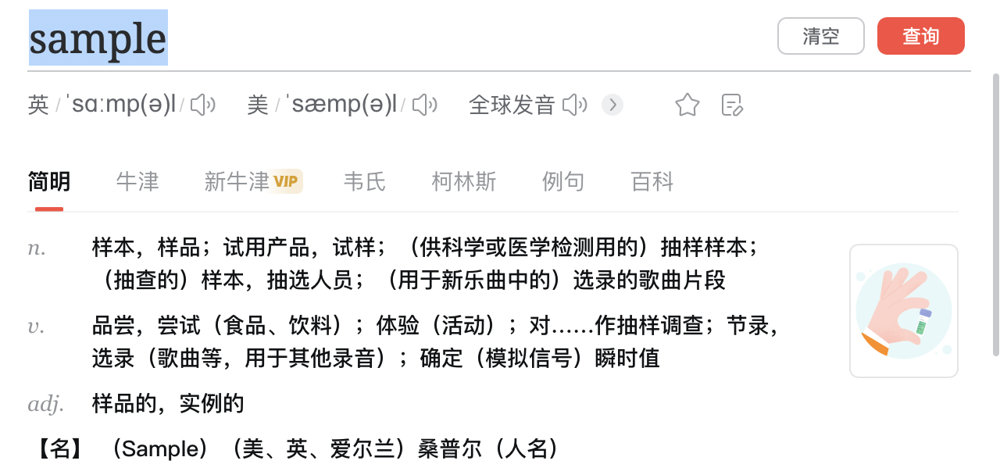
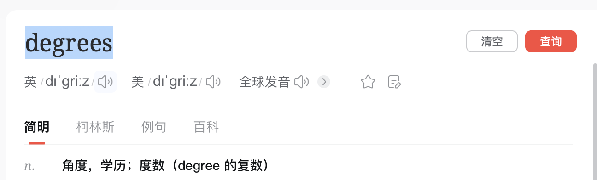

[TOC]


# 一 、Python简介

## 1.1 特性

​											完全面向对象

​											标准库丰富

​											三方接口丰富			

## 1.2 优点

​											开源 

​											面向对象

​											库多

​											可扩展

## 1.3 缺点 

​											运行速度慢


##  1.4  数据类型总结

| 数据类型 |                     优点                      |                缺点                 | 修改与否 |                使用场景                |
| :------: | :-------------------------------------------: | :---------------------------------: | :------: | :------------------------------------: |
|   str    |      文本处理功能强大，<br/>内置方法丰富      |   不可变性<br/>频繁拷贝，影响性能   | 不可修改 |      文本处理、格式化、字符匹配等      |
|   list   |    常用数据结构，可变，<br/>支持增删改操作    | 查找操作效率<br/>时间复杂度为 O(n)  |  可修改  |   存储有序元素、频繁修改的数据集合等   |
|  tuple   | 元素不可更改，<br/>适用于字典的键和集合的元素 | 需要修改时<br/>创建新元组，影响性能 | 不可修改 |   字典键、集合元素、函数返回多个值等   |
|   set    |    元素唯一性，<br/>自动去重，支持集合运算    |   无序，<br/>不能通过下标索引访问   |  可修改  | 去重数据、集合运算、判断元素是否存在等 |
|   dict   |    键值对存储，<br/>快速查找，支持增删改查    | 内存占用较大，<br/>查找速度可能较慢 |  可修改  |  存储键值对信息、数据映射、缓存数据等  |

| 数据类型 | 优点                                                         | 缺点                                                         | 修改 |                       使用场景                       |
| :------: | :----------------------------------------------------------- | :----------------------------------------------------------- | :--: | :--------------------------------------------------: |
|   int    | - 整数运算效率高，适用于整数的加减乘除等数值计算。<br>- 精度无限制，可表示任意大小的整数。<br/>- 内置函数丰富，支持各种进制表示。 | - 不能表示无理数和小数，只能表示整数。  - 在某些情况下可能会导致溢出。<br>- 不适用于需要高精度计算的场景。 |  是  |      用于表示整数值，<br/>如计数、索引等场景。       |
|  float   | - 可以表示小数和科学计数法，适用于实数的计算。<br>- 可以表示很大或很小的数值，支持无限大和无限小。 | - 浮点数运算有误差，可能出现精度问题。   - 不适用于要求高精度计算的场景。 |  是  |     用于表示实数值，<br>如浮点数运算、科学计算。     |
|   bool   | - 占用内存小，只有True和False两个值，节省存储空间。<br>- 支持逻辑运算，便于表达条件判断。<br>- 用于控制程序流程，进行条件判断。 | - 仅表示两种状态，<br/>  不适用于需要多个状态的场景<br/>- 不能直接进行数值计算。<br>- 只适用于表示逻辑值的场景。 |  否  | 用于表示布尔值，如判断条件是否成立、开关状态等场景。 |
| complex  | - 可以表示复数，方便进行复数运算。<br>- 支持复数的实部和虚部表示，用于数学和科学计算。 | - 复数运算涉及实部和虚部的计算，  <br/>  性能相对较低。<br>- 不适用于不涉及复数运算的场景。 |  是  |       表示复数值，<br/>如复数运算、信号处理。        |

## 1.5 Python 报错和异常

### 1.5.1 异常分类

当然，请见以下表格，它按照异常类型对常见的Python异常进行了总结：

|       异常类型        |              描述              |                             示例                             |
| :-------------------: | :----------------------------: | :----------------------------------------------------------: |
|  语法错误和命名错误   |                                |                                                              |
|     `SyntaxError`     |           语法错误。           |                     `print("Hello World`                     |
|  `IndentationError`   |           缩进错误。           |                `if True:\nprint("Indented")`                 |
|      `NameError`      |     未定义的变量或函数名。     |                     `x = undefined_var`                      |
|   类型错误和值错误    |                                |                                                              |
|      `TypeError`      |         对象类型错误。         |                          `len(123)`                          |
|     `ValueError`      |            值错误。            |                         `int("abc")`                         |
|     容器相关错误      |                                |                                                              |
|      `KeyError`       |       字典中的键不存在。       | `my_dict = {"key": "value"}\nvalue = my_dict["nonexistent_key"]` |
|     `IndexError`      |  列表或字符串的索引超出范围。  |          `my_list = [1, 2, 3]\nitem = my_list[10]`           |
|     文件和I/O错误     |                                |                                                              |
|  `FileNotFoundError`  |          文件不存在。          |          `with open("nonexistent.txt", "r") as f:`           |
|       `OSError`       |    涉及操作系统问题的错误。    |             `os.remove("nonexistent_file.txt")`              |
|   `PermissionError`   |    尝试执行没有权限的操作。    |        `with open("/etc/sensitive_file", "w") as f:`         |
|    数值和断言错误     |                                |                                                              |
|  `ZeroDivisionError`  |            除以零。            |                       `result = 1 / 0`                       |
|   `AssertionError`    |         断言条件失败。         |                  `assert len(my_list) > 10`                  |
|   异常层次结构基类    |                                |                                                              |
|      `Exception`      |      所有内置异常的基类。      |        `try:\n  # some code\nexcept Exception as e:`         |
|     其他错误类型      |                                |                                                              |
|     `SystemError`     |     Python解释器内部错误。     |                                                              |
|    `RuntimeError`     |        程序状态不正确。        |                                                              |
| `NotImplementedError` |      功能未在子类中实现。      |                                                              |
|    `StopIteration`    |     没有更多的元素可迭代。     |                                                              |
|    `UnicodeError`     | 与Unicode编码/解码相关的错误。 |                                                              |
| `DeprecationWarning`  |      功能已被弃用的警告。      |                                                              |
|     `UserWarning`     |        用户定义的警告。        |                                                              |
|   `ResourceWarning`   | 表示资源可能未正确关闭的警告。 |                                                              |

|         异常名称          |                         描述                         |
| :-----------------------: | :--------------------------------------------------: |
|                           |                                                      |
|       BaseException       |                    所有异常的基类                    |
|        SystemExit         |                    解释器请求退出                    |
|     KeyboardInterrupt     |              用户中断执行(通常是输入^C)              |
|         Exception         |                    常规错误的基类                    |
|       StopIteration       |                  迭代器没有更多的值                  |
|       GeneratorExit       |        生成器 (generator) 发生异常来通知退出         |
|       StandardError       |               所有的内建标准异常的基类               |
|      ArithmeticError      |                所有数值计算错误的基类                |
|    FloatingPointError     |                     浮点计算错误                     |
|       OverflowError       |                 数值运算超出最大限制                 |
|     ZeroDivisionError     |             除(或取模)零 (所有数据类型)              |
|      AssertionError       |                     断言语句失败                     |
|      AttributeError       |                   对象没有这个属性                   |
|         EOFError          |              没有内建输入,到达 EOF 标记              |
|     EnvironmentError      |                  操作系统错误的基类                  |
|          IOError          |                  输入/输出操作失败                   |
|          OSError          |                     操作系统错误                     |
|       WindowsError        |                     系统调用失败                     |
|        ImportError        |                  导入模块/对象失败                   |
|        LookupError        |                  无效数据查询的基类                  |
|        IndexError         |               序列中没有此索引(index)                |
|         KeyError          |                   映射中没有这个键                   |
|        MemoryError        |      内存溢出错误(对于 Python 解释器不是致命的)      |
|         NameError         |             未声明/初始化对象 (没有属性)             |
|     UnboundLocalError     |                访问未初始化的本地变量                |
|      ReferenceError       | 弱引用 (Weak reference) 试图访问已经垃圾回收了的对象 |
|       RuntimeError        |                   一般的运行时错误                   |
|    NotImplementedError    |                    尚未实现的方法                    |
|        SyntaxError        |                   Python 语法错误                    |
|     IndentationError      |                       缩进错误                       |
|         TabError          |                    Tab 和空格混用                    |
|        SystemError        |                 一般的解释器系统错误                 |
|         TypeError         |                   对类型无效的操作                   |
|        ValueError         |                    传入无效的参数                    |
|       UnicodeError        |                  Unicode 相关的错误                  |
|    UnicodeDecodeError     |                 Unicode 解码时的错误                 |
|    UnicodeEncodeError     |                  Unicode 编码时错误                  |
|   UnicodeTranslateError   |                  Unicode 转换时错误                  |
|          Warning          |                      警告的基类                      |
|    DeprecationWarning     |                关于被弃用的特征的警告                |
|       FutureWarning       |            关于构造将来语义会有改变的警告            |
|      OverflowWarning      |        旧的关于自动提升为长整型 (long) 的警告        |
| PendingDeprecationWarning |               关于特性将会被废弃的警告               |
|      RuntimeWarning       |      可疑的运行时行为 (runtime behavior) 的警告      |
|       SyntaxWarning       |                   可疑的语法的警告                   |
|        UserWarning        |                  用户代码生成的警告                  |

### 1.5.2 异常语法

`try`, `except`, `finally`, 和 `raise` 是 Python 中用于异常处理的关键字和语句。以下是它们的作用和用法：

- `try`：用于包裹可能引发异常的代码块。如果在 `try` 块中的代码引发了异常，程序会跳转到相应的 `except` 块。通常，您可以在 `try` 块中放置可能出现问题的代码。
- `except`：用于捕获异常并提供处理代码。可以根据需要提供一个或多个 `except` 块，每个块可以捕获不同类型的异常。当发生匹配的异常时，对应的 `except` 块中的代码将被执行。
- `finally`：用于指定无论是否发生异常都必须执行的代码块。无论是否发生异常，`finally` 块中的代码都会被执行。通常用于资源释放或清理。
- `raise`：用于手动引发异常。您可以使用 `raise` 语句来显式地引发特定类型的异常，也可以传递异常信息。这在某些情况下是有用的，比如在自定义函数中检查条件并引发异常。

​		Python中的异常处理语法使用`try`和`except`来捕获和处理异常。基本的语法结构如下：

```python
try:
    # 代码块，可能会出现异常的部分
    # ...
except SomeExceptionType:
    # 处理特定类型的异常
    # ...
except AnotherExceptionType:
    # 处理另一种类型的异常
    # ...
except:
    # 处理其他未指定的异常
    # ...
else:
    # 如果没有异常发生，则执行这里的代码
    # ...
finally:
    # 无论是否发生异常，最终都会执行这里的代码
    # ...
```

以下是对上述语法的解释：

- `try` 块：包含可能会引发异常的代码。如果在这个块中出现了异常，程序会跳转到相应的`except`块。
- `except` 块：用于捕获特定类型的异常。您可以根据需要提供一个或多个`except`块。当发生对应类型的异常时，这些块中的代码会被执行。
- `else` 块（可选）：如果在`try`块中的代码没有引发异常，那么`else`块中的代码将被执行。
- `finally` 块（可选）：无论是否发生异常，`finally`块中的代码都将被执行。通常用于释放资源或清理工作。

以下是一个简单的例子，演示了如何使用异常处理语法：

```python
try:
    num = int(input("请输入一个数字："))
    result = 10 / num
    print("结果是:", result)
except ZeroDivisionError:
    print("除以零错误！")
except ValueError:
    print("请输入一个有效的数字！")
except Exception as e:
    print("发生了一个未知的异常:", e)
else:
    print("没有发生异常。")
finally:
    print("无论如何都会执行这里的代码。")
```


以下是一个使用这些关键字和语句的简单示例：

```python
def divide(x, y):
    try:
        result = x / y
    except ZeroDivisionError:
        print("除以零错误")
    else:
        print("结果是:", result)
    finally:
        print("无论如何都会执行这里的代码")

divide(10, 2)
divide(10, 0)

try:
    age = int(input("请输入您的年龄："))
    if age < 0:
        raise ValueError("年龄不能为负数")
except ValueError as ve:
    print("发生了 ValueError:", ve)
```

在第一个示例中，我们定义了一个 `divide` 函数，它尝试计算两个数字的除法。如果除数为零，将引发 `ZeroDivisionError` 异常。无论如何，`finally` 块中的代码都会执行。

在第二个示例中，我们演示了如何使用 `raise` 语句手动引发异常，并提供异常信息。当输入的年龄为负数时，将引发一个 `ValueError` 异常并打印出异常信息。


**开发者检测用**


`assert` 是 Python 中的一个关键字，用于在代码中进行断言，以确保条件为真。它通常用于调试和测试阶段，用于检查代码中的假设是否满足。如果断言的条件为假，Python 会引发一个 `AssertionError` 异常。

`assert` 的语法如下：

```python
assert condition, message
```

其中：
- `condition` 是一个布尔表达式，表示需要检查的条件。
- `message` 是一个可选的参数，用于在断言失败时显示错误消息。

示例：

```python
def divide(a, b):
    assert b != 0, "除数不能为零"
    return a / b

result = divide(10, 2)  # 正常情况，没有断言异常
print(result)

result = divide(10, 0)  # 引发 AssertionError，除数为零
```

在第一个示例中，调用 `divide(10, 2)` 不会触发断言异常，因为除数不为零。而在第二个示例中，调用 `divide(10, 0)` 会触发断言异常，因为除数为零，与断言条件 `b != 0` 不符。

需要注意的是，一般情况下，`assert` 不应该用于处理预期可能出现的错误，而应该用于检查开发者认为是绝对正确的假设。在生产环境中，可以通过关闭断言来禁用它们。


### 1.5.3 异常自定义 `通过raise触发`


在Python中，您可以通过创建自定义的异常类来处理特定的错误情况。自定义异常类通常继承自内置的 `Exception` 类或其子类。通过自定义异常，您可以在程序中引发和捕获特定类型的错误，以便更好地组织和处理代码逻辑。

**以下是创建自定义异常的一般步骤**：

1. 创建一个继承自 `Exception` 或其子类的新类。
2. 可以为新类添加额外的属性和方法，以便在处理异常时提供更多的信息和功能。
3. 在适当的情况下，使用 `raise` 语句引发自定义异常。


当您使用 `try`, `except`, `finally`, 和 `raise` 时，您可以创建一个自定义的异常函数。下面是一个示例，演示了如何使用这些关键字来处理自定义异常：

```python
class CustomError(Exception):
    """自定义异常类"""
    def __init__(self, message):
        super().__init__(message)
        self.error_code = 1001

def custom_function(value):
    try:
        if value < 0:
            raise CustomError("值不能为负数")
        result = 10 / value
    except CustomError as e:
        print(f"捕获自定义异常：{e}")
        print(f"错误码：{e.error_code}")
    except ZeroDivisionError:
        print("除数不能为零")
    else:
        print("结果：", result)
    finally:
        print("无论如何都会执行的代码块")

# 测试自定义异常函数
custom_function(5)
custom_function(-2)
custom_function(0)
```

在这个示例中，我们定义了一个名为 `CustomError` 的自定义异常类，然后创建了一个 `custom_function` 函数来演示异常处理。在函数中，我们使用 `try` 来包裹可能引发异常的代码。如果值小于零，我们通过 `raise` 语句引发自定义异常；如果值为零，会引发内置的 `ZeroDivisionError` 异常。

在 `except` 块中，我们捕获自定义异常和零除异常，并根据情况进行处理。然后，在 `else` 块中，如果没有发生异常，我们打印出结果。无论异常是否发生，`finally` 块都会被执行，这里我们打印一条信息。

您可以通过运行上述代码来观察程序的执行情况，了解在不同情况下如何使用 `try`, `except`, `finally`, 和 `raise` 处理自定义异常。


## 1.6 python 异步


1.5 Python 报错和异常


# 二、中文编码


```python
# coding=utf-8              # 注意： “ = ”之间不能有空格
```


# 三、 历代版本


## 3.1 Python 2

### 3.1.1 2兼容3 

​			_ _ future_ _ 库保证 python2 的兼容性

### 3.1.2  2与3的区别

- print 函数	

```python
									1. print 1       # python 2 
  
                  2. from __future__ import print_function  # python2 兼容3 
                     print ( 1 )
    
  								3. print ( 1 )   # python 3 
                   
```

- unicode                  

```python
									# python 3 编码格式默认 为 utf-8
```

- 运算符  '/' '//'


- 运算符 不等式

​               不等于 只能使用    `！=`    表示

- 异常


- xrange 与 range


-  进制问题


- 去掉 `reper` 的表达式 `''`

- 去除数据类型 `long` 增加 `bytes`

- 打开文件


-  输入字符串


# 四 、 符号 （标识、运算、转义）

## 4.1 标识符


## 4.2 运算符


### 4.2.1 算术运算符 `+ ; - ;  * ;  / ; % ; ** ; //;`

| 运算符 | 描述                                            |                  实例                  |
| :----: | :---------------------------------------------- | :------------------------------------: |
|   +    | 加 - 两个对象相加                               |                 a + b                  |
|   -    | 减 - 得到负数或是一个数减去另一个数             |                 a - b                  |
|   *    | 乘 - 两个数相乘或是返回一个被重复若干次的字符串 |                 a * b                  |
|   /    | 除 - x 除以 y                                   |                 a / b                  |
|   %    | 取模 - 返回除法的余数                           |                3% 2 =1                 |
|   **   | 幂 - 返回 x 的 y 次幂                           |                 a ** b                 |
|   //   | 地板除，同floor( )   向下取整                   | 9//2 输出结果 4 , 9.0//2.0 输出结果4.0 |

### 4.2.2 比较（关系）运算符 `== ； ！=；> ;  < ; >= ;  <= ; ` 返回`bool`值

 a 为 10，变量 b 为 20

| 运算符 |                描述                 |         实例          |
| :----: | :---------------------------------: | :-------------------: |
|   ==   |      等于 -- 比较对象是否相等       | (a == b) 返回 False。 |
|   !=   |  不等于 -- 比较两个对象是否不相等   |  (a != b) 返回 True.  |
|   >    |      大于 -- 返回 x 是否大于 y      | (a > b) 返回 False。  |
|   <    |     小于 -- 返回 x 是否小于 y。     |  (a < b) 返回 True。  |
|   >=   | 大于等于 -- 返回 x 是否大于等于 y。 | (a >= b) 返回 False。 |
|   <=   | 小于等于 -- 返回 x 是否小于等于 y。 | (a <= b) 返回 True。  |

### 4.2.3 赋值运算符 `= ;+= ;-=;  *=; /=; %=; **=; //=;`

| 运算符 | 描述             | 实例                                  |
| :----- | :--------------- | :------------------------------------ |
| =      | 简单的赋值运算符 | c = a + b 将 a + b 的运算结果赋值为 c |
| +=     | 加法赋值运算符   | c += a 等效于 c = c + a               |
| -=     | 减法赋值运算符   | c -= a 等效于 c = c - a               |
| *=     | 乘法赋值运算符   | c *= a 等效于 c = c * a               |
| /=     | 除法赋值运算符   | c /= a 等效于 c = c / a               |
| %=     | 取模赋值运算符   | c %= a 等效于 c = c % a               |
| **=    | 幂赋值运算符     | c **= a 等效于 c = c ** a             |
| //=    | 取整除赋值运算符 | c //= a 等效于 c = c // a             |

```python
a = 1
b = 2
c = 3

# print("c值为", c)
# c = c + a
# print("c+=a，一次后c值", c)

c = c ** b  # 3的2次方
print(c) # 9

c = c // b
print(c) # 1
print(3//2) # 1
```

### 4.2.4 位运算符 与 或 异或 反 左移 右移 `& ; ｜ ; ^ ; ~ ; << ; >>`

|                     | 按位与运算（a&b） | 按位或运算(a\|b) | 按位异或（a^b） |
| :-----------------: | :---------------: | :--------------: | :-------------: |
| a（60）的二进制表示 |     0011 1100     |    0011 1100     |    0011 1100    |
| b（13）的二进制表示 |     0000 1101     |    0000 1101     |    0000 1101    |
|      运算结果       |     0000 1100     |    0011 1101     |    0011 0001    |
|  结果的十进制表示   |        12         |        61        |       49        |

|                      | 按位取反（~a） | 左移（a<<2） | 右移(a>>2) |
| :------------------: | :------------: | :----------: | :--------: |
| a（60）的二进制表示  |   0011 1100    |  0011 1100   | 0011 1100  |
|       运算结果       |   1100 0011    |  1111 0000   | 0000 1111  |
| 运算结果的十进制表示 |      -61       |     240      |     15     |

**要点补充**

- 原码，补码，反码

  - 原码

    假设机器字长为n，原码就是用一个**n位的二进制数**，

    其中最高位为符号位：正数是0，负数是1。剩下的表示概数的绝对值，位数如果不够就用0补全。

  - 补码

    在原码的基础上，**符号位不变**其他位取反。

    也就是就是0变1，1变0。

  - 反码

    在反码的基础上加1

- 总结

  - 与 &  **`全1为1，否则为0`**

    按位与运算符：参与运算的两个值,如果两个相应位都为 1,则该位的结果为 1,否则为 0

    

  - 或 ｜**`有1为1，全0为0`**

    按位或运算符：只要对应的二个二进位有一个为 1 时，结果位就为 1。

    

  - 异或 ^ **`不同为1，否则为0`**

    按位异或运算符：当两对应的二进位相异（不同）时，结果为 1

    

  - 取反 ～ **`0变成1，1变成0`**

    按位取反运算符：对数据的每个二进制位取反,即把 1 变为 0，把 0 变为 1

    

  - 左移 <<  **`高位取消，低位补0`**

    左移动运算符：运算数的各二进位全部左移若干位，由"<<"右边的数指定移动的位数，高位丢弃，低位补 0。

    

  - 右移 >> 地位 **`从低位开始取消`**

    右移动运算符：把">>"左边的运算数的各二进位全部右移若干位，">>"右边的数指定移动的位数

    

    ```python
    >>> a = 60 
    >>> bin(a)
    '0b111100'
    >>> c = a<<2
    >>> bin(c)
    '0b11110000'
    >>> d = a>>2
    >>> bin(d)
    '0b1111'
    >>> f = a>>3
    >>> bin(f)
    '0b111'
    >>> 
    
    ```

    

### 4.2.5 逻辑运算符 `and（bool 与）；or（bool 或）；not（bool 非）  `返回 bool值

| 运算符 | 逻辑表达式 | 描述                                                         | 实例                    |
| :----- | :--------- | :----------------------------------------------------------- | :---------------------- |
| and    | x and y    | 布尔"与" - 如果 x 为 False，x and y 返回 False，否则它返回 y 的计算值。 | (a and b) 返回 20。     |
| or     | x or y     | 布尔"或" - 如果 x 是 True，它返回 x的值，否则它返回 y 的计算值。 | (a or b) 返回 10。      |
| not    | not x      | 布尔"非" - 如果 x 为 True，返回 False 。如果 x 为 False，它返回 True。 | not(a and b) 返回 False |

**补充知识点**

- bool 值

  - 0的bool 值为false

    ```python
    >>> bool(0)
    False
    >>> bool(2)
    True
    >>> bool(-2)
    True
    >>> bool(0)
    False
    >>> bool(2.2424)
    True
    >>> bool(2+1j)
    True
    
    >>> import math
    >>> bool(math.e)
    True
    >>> bool(math.pi)
    True
    >>> math.pi
    3.141592653589793
    >>> 
    
    ```

    

- 逻辑规则总结

  - and    `( a and b )`          全为ture返回true 否则返回 false

  - or       `( a  or  b  )`      全为false 返回 false 否则 返回true

  - not     `not( a )`                Ture返回false ，false返沪true

    ```python
    >>> a = 10
    >>> b = 20
    >>> 
    >>> if ( a and b ):
    ...     print ("1 - 变量 a 和 b 都为 true")
    ... else:
    ...     print ("1 - 变量 a 和 b 有一个不为 true")
    ... 
    1 - 变量 a 和 b 都为 true
    >>> if ( a or b ):
    ...     print ("2 - 变量 a 和 b 都为 true，或其中一个变量为 true")
    ... else:
    ...     print ("2 - 变量 a 和 b 都不为 true")
    ... 
    2 - 变量 a 和 b 都为 true，或其中一个变量为 true
    
    
    # 修改变量 a 的值
    >>> a = 0
    >>> if ( a and b ):
    ...     print ("3 - 变量 a 和 b 都为 true")
    ... else:
    ...     print ("3 - 变量 a 和 b 有一个不为 true")
    ... 
    3 - 变量 a 和 b 有一个不为 true
    >>> if ( a or b ):
    ...     print ("4 - 变量 a 和 b 都为 true，或其中一个变量为 true")
    ... else:
    ...     print ("4 - 变量 a 和 b 都不为 true")
    ... 
    4 - 变量 a 和 b 都为 true，或其中一个变量为 true
    >>> if not( a and b ):
    ...     print ("5 - 变量 a 和 b 都为 false，或其中一个变量为 false")
    ... else:
    ...     print ("5 - 变量 a 和 b 都为 true")
    ... 
    5 - 变量 a 和 b 都为 false，或其中一个变量为 false
    ```

    

### 4.2.6 成员运算符  `in; not in` 

| 运算符 | 描述                                                    | 实例                                              |
| :----- | :------------------------------------------------------ | :------------------------------------------------ |
| in     | 如果在指定的序列中找到值返回 True，否则返回 False。     | x 在 y 序列中 , 如果 x 在 y 序列中返回 True。     |
| not in | 如果在指定的序列中没有找到值返回 True，否则返回 False。 | x 不在 y 序列中 , 如果 x 不在 y 序列中返回 True。 |


```python
>>> a = [2,'w',"我"]
>>> print(2 in a)
True


>>> print(3 not in a ) 
True
>>> print(2 not in a )
False
>>> print(3 not in a)
True
```


### 4.2.7 身份运算符 `is ； is not`

| 运算符 | 描述                                        | 实例                                                         |
| :----- | :------------------------------------------ | :----------------------------------------------------------- |
| is     | is 是判断两个标识符是不是引用自一个对象     | x is y, 如果 id(x) 等于 id(y) , **is** 返回结果 True         |
| is not | is not 是判断两个标识符是不是引用自不同对象 | x is not y, 如果 id(x) 不等于 id(y). **is not** 返回结果 True |

```python
>>> a = 1 
>>> b = 2; c =2
>>> print(a is b)
False
>>> print(a is not b)
True
>>> print (b is c)
True
>>> print (b is not  c)
False
>>> print (id(a) == id(b))
False
>>> print (id(a) != id(b))
True
>>> print (id(c) != id(b))
False
>>> print (id(c) == id(b))
True
>>> 
```


### 4.2.8 运算符优先级 `括号；取 调用 切片 引用 ；异步；四则；位运算；比较运算；逻辑运算；条件表达；lambda; 赋值`


| 运算符                                                       | 描述                               |
| :----------------------------------------------------------- | :--------------------------------- |
| `(expressions...)`,`[expressions...]`, `{key: value...}`, `{expressions...}` | 圆括号的表达式                     |
| `x[index]`, `x[index:index]`, `x(arguments...)`, `x.attribute` | 读取，切片，调用，属性引用         |
| await x                                                      | await 表达式                       |
| `**`                                                         | 乘方(指数)                         |
| `+x`, `-x`, `~x`                                             | 正，负，按位非 NOT                 |
| `*`, `@`, `/`, `//`, `%`                                     | 乘，矩阵乘，除，整除，取余         |
| `+`, `-`                                                     | 加和减                             |
| `<<`, `>>`                                                   | 移位                               |
| `&`                                                          | 按位与 AND                         |
| `^`                                                          | 按位异或 XOR                       |
| `|`                                                          | 按位或 OR                          |
| `in,not in, is,is not, <, <=, >, >=, !=, ==`                 | 比较运算，包括成员检测和标识号检测 |
| `not x`                                                      | 逻辑非 NOT                         |
| `and`                                                        | 逻辑与 AND                         |
| `or`                                                         | 逻辑或 OR                          |
| `if -- else`                                                 | 条件表达式                         |
| `lambda`                                                     | lambda 表达式                      |
| `:=`                                                         | 赋值表达式                         |


## 4.3 转义符

### 4.3.1 多行语句


### 4.3.2 单引号 和双引号的区别  `嵌套；转义；多行字符串；字符串插值`

在 Python 中，字符串可以使用双引号或单引号来定义，它们在**功能上是等价的**，但有一些细微的区别：

- 嵌套使用：

  - 如果字符串本身包含双引号，那么可以使用单引号来定义该字符串，以避免冲突。

  - 同样，如果字符串包含单引号，可以使用双引号来定义。
    - 例如：


```python
							str1 = "I'm a string with single quotes."
							str2 = 'He said, "Hello!"'
```

- 转义字符：

   ​    在使用双引号或单引号定义字符串时，可以通过反斜杠 `\` 来插入特殊字符，例如换行符 `\n` 或制表符 `\t`。

   ​	例如：
   ```python
   					str3 = "This is a string\nwith a new line."
   					str4 = 'This is a string\twith a tab.'
   ```

- 多行字符串：

   ​	双引号和单引号都允许定义多行字符串，但通常使用三重引号 `"""` 或 `'''` 来实现，这样更方便。

   ​	例如：
   ```python
   				str5 = """This is a 
   				multi-line string."""
   ```

- 字符串插值：

   ​     在 Python 3.6+ 中，可以使用 f-strings 来进行字符串插值，它使用花括号 `{}` 来插入变量值。在 f-strings 中，单引号和双引号没	 有区别。

   ​	 例如：
   ```python
   					name = "Alice"
   	        str6 = f"My name is {name}."
   ```

### 4.3.3 转义符 `'\'或者“\”`

|   转义字符   |                             描述                             |
| :----------: | :----------------------------------------------------------: |
| \\(在行尾时) |                            续行符                            |
|     \\\      |                          反斜杠符号                          |
|     \\'      |                            单引号                            |
|     \\"      |                            双引号                            |
|      \a      |                             响铃                             |
|      \b      |                       退格(Backspace)                        |
|     \000     |                              空                              |
|      \n      |                             换行                             |
|      \v      |                          纵向制表符                          |
|      \t      |                          横向制表符                          |
|      \r      | 回车，将 \r 后面的内容移到字符串开头，并逐一替换开头部分的字符，直至将 \r 后面的内容完全替换完成。 |
|      \f      |                             换页                             |
|     \yyy     |      八进制数，y 代表 0~7 的字符，例如：\012 代表换行。      |
|     \xyy     |  十六进制数，以 \x 开头，y 代表的字符，例如：\x0a 代表换行   |
|    \other    |                   其它的字符以普通格式输出                   |

```python
# 引号中的 \ 是续行符 对操作有帮助 对输出结果无影响
print("第一行\
第二行\
第三行")

# \\ 输出 \ , ' , ",

print('\\', '\'', '\"')

print('\000')

print('\f')

>>> print("Hello \v World!") 
Hello 
       World!
>>> 

>>> print("Hello \r World!") 
 World!
>>> print("Hello \t World!") 
Hello 	 World!

>>> print("Hello \f World!") 
Hello 
       World!
>>> 

```


			# 五、 模块和函数

## 5.1 Python 内置模块


## 5.2 python 内置函数

min（）

max()

sorted()

sum

reversed

enmurate

 


# 六、 变量类型 

## 七 数字；八 序列；九 字符串；


# 七、 Number 数字类型

## 7.1 数字类型分类

### 7.1.1 int 

**整型(Int)** 	-   通常被称为是整型或整数，**<u>是正或负整数，不带小数点</u>**。Python3 整型是没有限制大小的，可以当作 Long 类型使用，所						 以 Python3 没有 Python2 的 Long 类型。	

```python
>>> a = 1
>>> b = -1
>>> type (a)
<class 'int'>
>>> type (b)
<class 'int'>
```


### 7.1.2 float

**浮点型(float)** - 浮点型由，**<u>整数部分与小数部分组成</u>**，浮点型也可以使用科学计数法表示（2.5e2 = 2.5 x 10^2 = 250）

​						  `2.5e2 = 250 ,英文字母e后面的数字表示乘以10的多少次方`

```python
>>> a = 5.2
>>> b = 5.2e3
>>> print (a,b,type(a),type(b))
5.2 5200.0 <class 'float'> <class 'float'>
```


### 7.1.3 complex

**复数( (complex))** - 复数由实数部分和虚数部分构成，可以用a + bj,

​								 或者`complex(a,b)`表示， 复数的实部a和虚部b都是浮点型。

```python
>>> d = 1+2j
>>> type(d)
<class 'complex'>
>>> print(d)
(1+2j)


>>> a = complex(2,3)
>>> print("a = ",a,"a的类型是",type(a))
a =  (2+3j) a的类型是 <class 'complex'>
```


## 7.2 数字类型之间的转换

- **int(x)** 将x转换为一个整数。
- **float(x)** 将x转换到一个浮点数。
- **complex(x)** 将x转换到一个复数，实数部分为 x，虚数部分为 0。
- **complex(x, y)** 将 x 和 y 转换到一个复数，实数部分为 x，虚数部分为 y。x 和 y 是数字表达式。

```python
>>> a = 1
>>> float(a)
1.0
>>> int(a)
1
>>> complex(a)
(1+0j)
>>> complex(a,2)
(1+2j)
```


## 7.3 数字类型对应的函数


### 7.3.1  内置函数 `abs( ) ; round( ); pow()`

- ` abs( )  `		绝对值函数 **absolute value** 
- ` round ( ) `    四舍五入函数  （周围附近）    
- `max ( )`        取最大值
- `min ( )`        取最小值
- `pow ( )`        取幂值   `pow(2,3)` 同`2**3`


​			以下是` round()` 方法的语法:

```python
					round( x [, n]  )
					- x -- 数值表达式。
					- n -- 表示从小数点位数，其中 x 需要四舍五入，默认值为 0。
```

​		**4舍6入5凑偶**  			

​        对于位数很多的近似数，当有效位数确定后，其后面多余的数字应该舍去，只保留有效数字最末一位，这种修约（舍入）规则是“四舍六入五成双”，也即“4舍6入5凑偶”，

​		这里“四”是指≤4 时舍去，"六"是指≥6时进上，"五"指的是根据5后面的数字来定，当5后有数时，舍5入1；当5后无有效数字时，需要分两种情况来讲：
​		（1）5前为奇数，舍5入1；
​		（2）5前为偶数，舍5不进（0是偶数）。


```python
>>> a=-2
>>> abs(a)
2


>>> round(1.24) 
1
>>> round (1.24,1)        		# 保留小数点后一位
1.2
>>> round (1.245,2)           # 保留小数点后二位，5为最后位时，n为2 且小数点 n-1 位 是 2 为偶数 则 5进 1
1.25
>>> round (1.235,2)
1.24
>>> round (1.2335,3)
1.234
>>> round (1.2335,2)
1.23
>>> round(1.2335)
1
>>> round (1.335,2)          # 保留小数点后二位，5为最后位时，n为2 且小数点 n-1 位 是 3 为奇数 则舍5
1.33
>>> round (1.215,2)
1.22
>>> round (1.125,2)          # 保留小数点后二位，5为最后位时，n为2 且小数点 n-1 位 是 1 为奇数 则舍5
1.12


>>> x = {242,2535,5325}
>>> y = [13,2324,4255]
>>> type(x)
<class 'set'>
>>> type(y)
<class 'list'>
>>> max(y)
4255
>>> min(y)
13
>>> max(x)
5325
>>> min(x)
242

>>> print(2**3)
8
>>> pow(2,4.2)
18.37917367995256
>>> print(2**4.2)
18.37917367995256
>>> print(2.8**4.2)
75.52030437065308
>>> print(2.5**-24)
2.81474976710656e-10

```

### 7.3.2 math 模块 和 cmath 模块

- `Python math` 模块提供了许多对浮点数的数学运算函数。
- `Python cmath` 模块包含了一些用于复数运算的函数。

```python
>>> import math
>>> dir(math)
['__doc__', '__file__', '__loader__', '__name__', '__package__', '__spec__', 'acos', 'acosh', 'asin', 'asinh', 'atan', 'atan2', 'atanh', 'ceil', 'comb', 'copysign', 'cos', 'cosh', 'degrees', 'dist', 'e', 'erf', 'erfc', 'exp', 'expm1', 'fabs', 'factorial', 'floor', 'fmod', 'frexp', 'fsum', 'gamma', 'gcd', 'hypot', 'inf', 'isclose', 'isfinite', 'isinf', 'isnan', 'isqrt', 'lcm', 'ldexp', 'lgamma', 'log', 'log10', 'log1p', 'log2', 'modf', 'nan', 'nextafter', 'perm', 'pi', 'pow', 'prod', 'radians', 'remainder', 'sin', 'sinh', 'sqrt', 'tan', 'tanh', 'tau', 'trunc', 'ulp']
```

这些是Python中`math`模块提供的一些内置函数和常量。`math`模块是Python标准库中的一个数学模块，提供了许多数学运算和常数。以下是对这些函数和常量的简要解释：

- 三角函数：
   - `acos()`: 返回x的反余弦值，其中x是一个复数。
   - `acosh()`: 返回x的反双曲余弦值，其中x是一个复数。
   - `asin()`: 返回x的反正弦值，其中x是一个复数。
   - `asinh()`: 返回x的反双曲正弦值，其中x是一个复数。
   - `atan()`: 返回x的反正切值，其中x是一个复数。
   - `atanh()`: 返回x的反双曲正切值，其中x是一个复数。

- 指数和对数函数：
   - `exp()`: 返回e的x次幂，其中x是一个复数。
   - `log()`: 返回x的对数，其中x是一个复数，默认以e为底数。
   - `log10()`: 返回x的以10为底的对数，其中x是一个复数。

- 双曲函数：
   - `cosh()`: 返回x的双曲余弦值，其中x是一个复数。
   - `sinh()`: 返回x的双曲正弦值，其中x是一个复数。
   - `tanh()`: 返回x的双曲正切值，其中x是一个复数.

- 幂运算和开方：
   - `pow()`: 返回x的y次幂，其中x和y都是复数。
   - `sqrt()`: 返回x的平方根，其中x是一个复数。

- 常用数学常数：
   - `e`: 自然对数的底数（常数e，约等于2.71828），其中e是一个复数。
   - `pi`: 圆周率π，其中pi是一个复数。
   - `tau`: 圆周率的两倍，即2π，其中tau是一个复数。

- 其他数学函数：
   - `ceil()`: 返回不小于x的最小整数。
   - `copysign()`: 返回带有x的绝对值和y的符号的浮点数。
   - `degrees()`: 将x从弧度转换为度数。
   - `fabs()`: 返回x的绝对值。
   - `factorial()`: 返回x的阶乘。
   - `floor()`: 返回不大于x的最大整数。
   - `fmod()`: 返回x除以y的余数。
   - `frexp()`: 返回x的尾数和指数，用于浮点数表示。
   - `fsum()`: 返回一个迭代器的浮点数总和。
   - `gamma()`: 返回x的伽玛函数值。
   - `gcd()`: 返回x和y的最大公约数。
   - `hypot()`: 返回欧几里德范数sqrt(x*x + y*y)。
   - `isclose()`: 检查两个复数是否接近。
   - `isfinite()`: 检查复数是否是有限数。
   - `isinf()`: 检查复数是否是正无穷大或负无穷大。
   - `isnan()`: 检查复数是否是NaN（Not a Number）。
   - `isqrt()`: 返回x的平方根的整数部分。
   - `lcm()`: 返回x和y的最小公倍数。
   - `ldexp()`: 返回x * (2**i)。
   - `lgamma()`: 返回x的自然对数伽玛函数值。
   - `log1p()`: 返回1 + x的自然对数。
   - `log2()`: 返回x的以2为底的对数。
   - `modf()`: 返回x的小数部分和整数部分。
   - `nan`: 非数字，其中nan是一个复数。
   - `radians()`: 将x从度数转换为弧度。
   - `remainder()`: 返回x除以y的余数，与`fmod()`的区别在于处理负数的方式。
   - `sin()`: 返回x的正弦值，其中x是一个复数。
   - `tan()`: 返回x的正切值，其中x是一个复数。
   - `trunc()`: 返回x的截断整数部分。

- 近似和浮点数操作：
   - `erf()`: 返回x的误差函数值。
   - `erfc()`: 返回x的余补误差函数值。
   - `expm1()`: 返回e的x次幂减去1，其中x是一个复数。
   - `nextafter()`: 返回浮点数x和y之间的下一个浮点数。
   - `perm()`: 返回x的排列数。

- 累乘和累加：
   - `prod(iterable, start=1)`: 返回迭代器中所有元素的累积积。
   - `sum(iterable, start=0)`: 返回迭代器中所有元素的累积和。

- 浮点数常量：
   - `inf`: 正无穷大，其中inf是一个复数。
   - `infj`: 正无穷大的虚部，其中infj是一个复数。
   - `nanj`: 非数字的虚部，其中nanj是一个复数。

- 未分类常数：
     - `ulp()`: 返回x的最小单位。


这些函数和常数

提供了对复数进行各种数学运算和操作的功能，非常有用于科学计算和数学领域的复数处理。

```python
>>> import cmath
>>> dir(cmath)
['__doc__', '__file__', '__loader__', '__name__', '__package__', '__spec__', 'acos', 'acosh', 'asin', 'asinh', 'atan', 'atanh', 'cos', 'cosh', 'e', 'exp', 'inf', 'infj', 'isclose', 'isfinite', 'isinf', 'isnan', 'log', 'log10', 'nan', 'nanj', 'phase', 'pi', 'polar', 'rect', 'sin', 'sinh', 'sqrt', 'tan', 'tanh', 'tau']
>>> 
```

根据`cmath`模块提供的函数的功能，可以将它们分为以下几类：

- 反三角函数

​			`acos()`, `acosh()`, `asin()`, `asinh()`, `atan()`, `atanh()` 这些函数用于计算复数的反余弦、反双曲余弦、反正弦、

​			反双曲正弦、反正切和反双曲正切值。

- 三角函数

​			`cos()`, `cosh()`, `sin()`, `sinh()`, `tan()`, `tanh()` 这些函数用于计算复数的余弦、双曲余弦、正弦、双曲正弦、正切

​			和双曲正切值。

- 指数和对数函数

  ​	`e`, `exp()`, `log()`, `log10()` 这些函数用于计算复数的指数函数、自然对数、以及以10为底的对数。

- 特殊常数

​			`inf`, `infj`, `nan`, `nanj`, `pi`, `tau` 这些常数代表正无穷大、正无穷大的虚部、NaN（非数字）、NaN的虚部、圆周率π以

​			及圆周率的两倍τ。

- 判断函数

  ​	`isclose()`, `isfinite()`, `isinf()`, `isnan()` 这些函数用于判断复数是否接近、是否是有限数、是否是正无穷大或负无穷大、

  ​	是否是NaN。

- 复数运算

     `phase()`, `polar()`, `rect()`, `sqrt()` 这些函数用于计算复数的辐角（相位角）、极坐标表示、复数的乘方、平方根。

  

### 7.3.3  math 模块数字  取近似值 `ceil ( ) ; floor( ) ; fabs ( )；modf()  `

- `math.ceil( )`               向上取整

  

- `math.floor( )`   	      向下取整

- `math.fabs( )`               取绝对值   **float absolute value**

   **abs()和fabs()的主要区别在于**：

    

  - ```python
      abs()函数可以接受任何类型的数字作为输入参数，包括整数、浮点数和复数；
      fabs()函数只接受浮点数作为输入参数。 # 如果你试图传递复数作为输入参数，则会抛出TypeError异常。 整数会转成浮点数
    ```

  - ```python
      abs()函数是Python自带的内置函数，而fabs()函数在math模块中定义。
      在使用fabs()函数之前，我们需要使用import语句来引用math模块。
    ```

- `math.modf ( )`         分离浮点数的整数部分和小数部分

```python
>>> print(a,b,c,d,e)
1 5.56 5.4 {1, 2, 4} -6.3
>>> import math
>>> math.ceil(b)
6
>>> math.floor(b)
5
>>> math.fabs(e)
6.3
>>> abs(e)
6.3
>>> f = -5
>>> math.fabs(f)
5.0
>>> abs(f)
5
>>> math.fabs(-2)
2.0

>>> complex(2,4) 
(2+4j)
>>> math.fabs(complex(2,4))      # math.fabs() 不支持复数
Traceback (most recent call last):
  File "<stdin>", line 1, in <module>
TypeError: can't convert complex to float

>>> abs(complex(2,4))           # abs（） 支持复数
4.47213595499958

>>> math.modf(24.5353663)
(0.5353662999999997, 24.0)
>>> math.modf(2.44449)
(0.44449000000000005, 2.0)

```

### 7.3.4 math 模块  数字 对数、 指数、平方根 `log( ) ; log 10( ) ;  pow( ) ; sqrt ();hypot()`

- `math.log ( )`       

  - ```python
    math.log(x[, base])
    
    #log()是不能直接访问的，需要导入 math 模块，通过静态对象调用该方法。
    - x -- 数值表达式。
    - base -- 可选，底数，默认为 e。
    ```

- `math.log10( )`

  - ```python
    math.log10( x )
    #`log10()`是不能直接访问的，需要导入` math` 模块，通过静态对象调用该方法。
    
    ## 参数
    - x -- 数值表达式。
    ## 返回值
    返回以10为基数的x对数，x>0
    ```

- `math.pow( )`

  - ​	**描述**

    **`pow()`** 方法返回 xy（x的y次方） 的值。

    > 在python中，求x的y次方的方法有很多，例如内置函数`pow()`，math模块的`math.pow()`，以及`**`运算符，他们都需要接受两个参数，但他们各有区别：
    >
    > 1. `**`运算符,内置函数`pow()`或者`math.pow()`可以用来计算幂次方.
    > 2. 内置函数`pow()`和math模块的`math.pow()`功能是一样的，但在返回值上，`math.pow()`总是返回浮点型

  - ######    **语法**

    ```python
    math.pow(x,y)
    ## 参数
    
    - x -- 数值表达式。
    - y -- 数值表达式。
    
    ------
    
    ## 返回值
    
    返回 xy（x的y次方） 的值。
    ```

    ------

  - `math.sqrt( )`           开平方      **square root**
  - `math.hypot( )`         **hypot()** 返回欧几里德范数 sqrt(x*x + y*y)。

  

```python
>>> math.log(8)      # 默认以e为底
2.0794415416798357
>>> math.log2(8)      # 以2为底
3.0
>>> math.log10(100)    # 以10为底
2.0


>>> pow(2,3)
8
>>> print(2**3)
8
>>> math.pow(2,3)   # math.pow 返回值为float
8.0


>>> math.sqrt(100)
10.0
>>> math.sqrt(-100)
Traceback (most recent call last):
  File "<stdin>", line 1, in <module>
ValueError: math domain error
>>> math.sqrt(complex(100,10))
Traceback (most recent call last):
  File "<stdin>", line 1, in <module>
TypeError: can't convert complex to float


>>> import math
>>> math.hypot(3,4)
5.0
```


### 7.3.5  `random` 模块 产生随机数 `random( ); randrange( ); seed( ); uniform( ); choice( ); shuffle( ); sample()`

- 数字

  - `random.random( )`                   范围:  [0,1)                  

    

  - `random.randrange ( )`           范围:  random.randrange(start, end, step).    产生范围  [start,end)  步长 为step

    ​															    step 默认为1 ;  start 默认为0    生成的是 int

    

  - `random.seed( )`                       提前声明， 用于标记随机数。 random.seed( a )  a 为 int，用于区分不同种子

    

  - `random.uniform( )`                 范围:  random.uniform(a, b).    产生范围  [a,b]   生成的float

    ​															

- 序列

  - `random.choice( )`                    random.choice(seq)  范围：seq中的任意一元素， seq 可以是 list tuple  string

  - `random.shuffle( )`                  随机排序

    

  - `random.sample( )`                    random.sampel(seq,num)  从 seq 中随机选取 num 个元素

    

```python
## random（）
>>> random.random()
0.6332620517806788
>>> random.random(1,4)  # 不能给参数
Traceback (most recent call last):
  File "<stdin>", line 1, in <module>
TypeError: Random.random() takes no arguments (2 given)

## randrange()

>>> random.randrange(1,100)
15
>>> random.randrange(1,100)  # 1-99 步长1
52
>>> random.randrange(1,100)
47
>>> random.randrange(1,100)
13
>>> random.randrange(1,100,2) # 1-99 步长2
81
>>> random.randrange(1,100,2)
39


>>> random.randrange(100)   # 0-99 取消start采用默认0
28
>>> random.randrange(100,2)  # start不指定时， 不能添加步长
Traceback (most recent call last):
  File "<stdin>", line 1, in <module>
  File "/Users/xieshan/env/Python_env/anaconda3/lib/python3.9/random.py", line 316, in randrange
    raise ValueError("empty range for randrange() (%d, %d, %d)" % (istart, istop, width))
ValueError: empty range for randrange() (100, 2, -98)


## seed()

>>> random.random()  
0.030010436181082012     # 产生随机数
>>> random.random()
0.2983065543551682

>>> random.seed(10)     # 声明种子10号  生成随机数 0.5714025946899135
>>> random.random()
0.5714025946899135

>>> random.random()     # 不调用种子 无法生成指定随机数
0.4288890546751146

>>> random.seed(10)    # 调用种子  生成之前的制定随机数  0.5714025946899135
>>> random.random()
0.5714025946899135

>>> random.seed(9)
>>> random.random()
0.46300735781502145
>>> random.seed(9)
>>> random.random()
0.46300735781502145

>>> random.seed(99)         #同样适用于 给定 范围的随机数
>>> random.randrange(90)
51
>>> random.seed(99)
>>> random.randrange(90)
51

# random.uniform

>>> random.uniform(1,2)
1.8614921993193687
>>> random.uniform(1,2)
1.2125908594748118
>>> random.uniform(1,2)
1.4614832897526613
>>> random.seed(22)
>>> random.uniform(1,2)
1.9582093798172728
>>> random.seed(22)
>>> random.uniform(1,2)
1.9582093798172728


# random.choice()

>>> a = {'asd',"wo"}  # 不支持 set
>>> type(a)
<class 'set'>
>>> random.choice(a)
Traceback (most recent call last):
  File "<stdin>", line 1, in <module>
  File "/Users/xieshan/env/Python_env/anaconda3/lib/python3.9/random.py", line 346, in choice
    return seq[self._randbelow(len(seq))]
TypeError: 'set' object is not subscriptable


>>> a = ['asd',"wo"]  # 支持 list
>>> type(a)
<class 'list'>
>>> random.choice(a)
'asd'
>>> random.choice(range(10))   
0
>>> random.choice(range(10))
9


>>> b=tuple(b)   # 支持tuple
>>> type(b)
<class 'tuple'>
>>> b
('asd', 'wo')
>>> random.choice(b)
'wo'


>>> d=str(a)    # 支持string
>>> d
"['asd', 'wo']"
>>> type(d)
<class 'str'>
>>> random.choice(d)
'a'
>>> random.choice(d)
"'"


# random.shuffle()

>>> print (a,b,c,d)
['wo', 'asd'] ('asd', 'wo') {'woshiyige'} ['asd', 'wo']
>>> type(a)
<class 'list'>
>>> type(c)
<class 'set'>
>>> type(b)
<class 'tuple'>
>>> type(d)
<class 'str'>

>>> random.shuffle(a)
>>> a
['wo', 'asd']

>>> random.shuffle(b)    #不支持tuple  tuple一创建顺序固定 无法进行随机排序
Traceback (most recent call last):
  File "<stdin>", line 1, in <module>
  File "/Users/xieshan/env/Python_env/anaconda3/lib/python3.9/random.py", line 362, in shuffle
    x[i], x[j] = x[j], x[i]
TypeError: 'tuple' object does not support item assignment
>>> b
('asd', 'wo')
>>> random.shuffle(c)
>>> c
{'woshiyige'}

>>> random.shuffle(d)     # 不支持str random.shuffle不适用于字符串。
Traceback (most recent call last):
  File "<stdin>", line 1, in <module>
  File "/Users/xieshan/env/Python_env/anaconda3/lib/python3.9/random.py", line 362, in shuffle
    x[i], x[j] = x[j], x[i]
TypeError: 'str' object does not support item assignment

# sample()

>>> random.sample(a,2)
['wo', 'asd']
>>> random.sample(range(10),2)
[0, 9]
>>> random.sample(range(10),2)
[3, 2]
>>> random.sample(range(10),2)
[1, 8]
>>> random.sample(range(10),6)
[9, 0, 5, 4, 2, 7]
```


### 7.3.6 math模块 cmath模块 三角函数 `sin( );cos(); tan(); asin( ); acos(); atan();atan2(y,x);degrees( ); radians( )`

|    函数     |                       描述                        |
| :---------: | :-----------------------------------------------: |
|   acos(x)   |               返回x的反余弦弧度值。               |
|   asin(x)   |               返回x的反正弦弧度值。               |
|   atan(x)   |               返回x的反正切弧度值。               |
| atan2(y, x) |       返回给定的 X 及 Y 坐标值的反正切值。        |
|   cos(x)    |               返回x的弧度的余弦值。               |
|   sin(x)    |               返回的x弧度的正弦值。               |
|   tan(x)    |                返回x弧度的正切值。                |
| degrees(x)  | 将弧度转换为角度,如degrees(math.pi/2) ， 返回90.0 |
| radians(x)  |                 将角度转换为弧度                  |




```python
>>> math.sin(10)
-0.5440211108893699
>>> math.sin(10+2j)
Traceback (most recent call last):
  File "<stdin>", line 1, in <module>
TypeError: can't convert complex to float
>>> import cmath
>>> math.sin(10+2j)
Traceback (most recent call last):
  File "<stdin>", line 1, in <module>
TypeError: can't convert complex to float
>>> math.sin(10+2j)

```


### 7.3.7 math模块 常量数字 `e ; pi`

- e    数学常量 e，e即自然常数（自然常数）
- pi   数学常量 pi（圆周率，一般以π来表示）


```python
>>> math.e
2.718281828459045
>>> math.pi
3.141592653589793
```


# 八 、序列 

`str ‘ ’ or “ ”; list [ ] ; tuple ( ) ; range (num) ;  bytes b' ' or b '' '' ;  bytearray   bytearray(b' ') ; set  { }; frozenset  frozenset({ });` 

1. **字符串（str）**：由字符组成的序列，用单引号或双引号括起来。例如：`'hello'` 或 `"world"`。
2. **列表（list）**：由任意类型的元素组成的序列，用方括号括起来。列表是可变序列，可以通过索引修改元素。例如：`[1, 2, 3]` 或 `['apple', 'orange', 'banana']`。
3. **元组（tuple）**：与列表类似，但一旦创建，元素不可修改，用圆括号括起来。元组是不可变序列。例如：`(1, 2, 3)` 或 `('John', 25, 'Male')`。
4. **范围（range）**：表示一个数字范围的不可变序列，常用于循环和切片操作。例如：`range(5)` 代表从 0 到 4 的序列。
5. **字节串（bytes）**：类似于字符串，但是包含原始的字节值，用单引号或双引号括起来，前缀为 `b`。例如：`b'hello'` 或 `b"world"`。
6. **字节数组（bytearray）**：与字节串类似，但是可变的，用方括号括起来，前缀为 `bytearray`。例如：`bytearray(b'hello')`。
7. **集合（set）**：包含不重复元素的无序集合，用花括号括起来。例如：`{1, 2, 3}` 或 `{'apple', 'orange', 'banana'}`。
8. **冻结集合（frozenset）**：与集合类似，但是不可修改，用 `frozenset()` 函数创建。例如：`frozenset({1, 2, 3})`。

## 8.1 序列分类

- 是否可变
  - 可变
    - 列表（list）
    - 字节数组（bytearray）
  - 不可变
    - 元组（tuple）             但一旦创建，元素不可修改
    - 字符串（str）              
    - 范围（range）            表示一个数字范围 不可变
    - 字节串（bytes）          
- 是否有序
  - 有序
    - 字符串（str）
    - 列表（list）
    - 元组（tuple）
    - 范围（range）
    - 字节串（bytes）
  - 无序
    - 集合（set）
- 序列元素类型
  - 数字
    - 列表（list）
    - 元组（tuple）
    - 范围（range）
  - 字符
    - 字符串（str）
    - 字节串（bytes）

## 8.2 序列索引

- 正索引范围：从 0 到 n-1，例如 0 表示第一个元素，1 表示第二个元素，以此类推。

- 负索引范围：从 -1 到 -n，例如 -1 表示最后一个元素，-2 表示倒数第二个元素，以此类推。

  ```python
  my_list = [10, 20, 30, 40, 50]
  
  # 正索引
  print(my_list[0])    # 输出：10
  print(my_list[2])    # 输出：30
  print(my_list[4])    # 输出：50
  
  # 负索引
  print(my_list[-1])   # 输出：50
  print(my_list[-3])   # 输出：30
  print(my_list[-5])   # 输出：10
  ```

## 8.3 序列操作

### 8.3.1 相加

- 可操作数据类型
  - list
  - str
  - tuple
  - bytes
  - bytearray

```python
>>> stra='asffsaf'
>>> strb='fagghhh'
>>> print(stra+strb)
asffsaffagghhh
>>> type(stra+strb)
<class 'str'>


>>> lista=['ad',24,2555]
>>> listb=['fa',55,66,'sf']
>>> type(lista+listb)
<class 'list'>
>>> print(lista+listb)
['ad', 24, 2555, 'fa', 55, 66, 'sf']


>>> tuplea=('a',2,'fa')
>>> tupleb=('gg',2425,255)
>>> type(tuplea+tupleb)
<class 'tuple'>
>>> print(tuplea+tupleb)
('a', 2, 'fa', 'gg', 2425, 255)
>>> 

>>> bytesa=b'asd'
>>> bytesb=b'aasdgggd'
>>> print(bytesa+bytesb)
b'asdaasdgggd'
>>> type(bytesa+bytesb)
<class 'bytes'>
>>> 

>>> a = bytearray(b'afsfaf')
>>> print(type(a))
<class 'bytearray'>
>>> b = bytearray(b'afsasdfaf')
>>> print(a+b)
bytearray(b'afsfafafsasdfaf')
>>> type(a+b)
<class 'bytearray'>
```


- 不可操作数据类型
  - set
  - range
  - 不同数据类型之间

```python
>>> seta ={'2',24,'af'} 
>>> setb ={'22',"asfaf",'af'} 
>>> print(seta+setb)
Traceback (most recent call last):
  File "<stdin>", line 1, in <module>
TypeError: unsupported operand type(s) for +: 'set' and 'set'
>>> type(seta)
<class 'set'>

rangea = range(8)
rangeb = range(2)

print(rangea+rangeb)
TypeError: unsupported operand type(s) for +: 'range' and 'range'

>>> stra = 'afaf'
>>> print(a+stra)
Traceback (most recent call last):
  File "<stdin>", line 1, in <module>
TypeError: can't concat str to bytearray


```

### 8.3.2 切片

- `sname[start : end : step]`

​			其中，各个参数的含义分别是：

​				`sname`：表示序列的名称；

​				`start`：表示切片的开始索引位置（包括该位置），此参数也可以不指定，会默认为 0，也就是从序列的开头进行切片；

​				`end`：	表示切片的结束索引位置（不包括该位置），如果不指定，则默认为序列的长度；

​				`step`：  表示在切片过程中，隔几个存储位置（包含当前位置）取一次元素，也就是说，如果 step 的值大于 1，则在进行切片							   去序列元素时，会“跳跃式”的取元素。如果省略设置 step 的值，则最后一个冒号就可以省略。

​				例如，对字符串“W3Cschool”进行切片：

```python
						str="W3Cschool"
						#取索引区间为[0,2]之间（不包括索引2处的字符）的字符串
						print(str[:2])
						#隔 1 个字符取一个字符，区间是整个字符串
						print(str[::2])
						#取整个字符串，此时 [] 中只需一个冒号即可
						print(str[:])
```

- 可操作类型
  - str
  - list
  - tuple
  - bytes
  - bytearray
  - range
- 不可操作类型
  - set

```python
stra = 'woshi1个字符串a'
lista = ['wo', "是", 1, 'ge', "列表a"]
tuplea = ('wo', "是", 1, 'ge', "元组a")
bytesa = b'zijiea'
bytearraya = bytearray(b'zijiezuaa')
seta = {'wo', "是", 1, 'ge', "集合a"}
rangea = range(8)
strb = 'woshi1个字符串b'
listb = ['wo', "是", 1, 'ge', "列表b"]
tupleb = ('wo', "是", 1, 'ge', "元组b")
bytesb = b'zijieb'
bytearrayb = bytearray(b'zijiezub')
setb = {'wo', "是", 1, 'ge', "集合b"}


print(stra[:2])
print(lista[:2])
print(tuplea[:2])
print(bytesa[:2])
print(bytearraya[:2])
print(rangea)
print(rangea[:6])
print(seta[:2])    # set 不可切片

# 结果
wo
['wo', '是']
('wo', '是')
b'zi'
bytearray(b'zi')
range(0, 8)
range(0, 6)

Traceback (most recent call last):
  File "/Users/xieshan/PycharmProjects/pythonProject12/venv/test.py", line 38, in <module>
    print(seta[:2])
TypeError: 'set' object is not subscriptable

```

### 8.3.3 相乘 

- 可操作类型
  - str
  - list
  - tuple
  - bytes
  - bytearray
- 不可操作类型
  - set
  - range

```python
print(stra*3)
print(lista*3)
print(tuplea*3)
print(bytesa*3)
print(bytearraya*3)
print(seta*3)  #不支持
print(rangea*3)  #不支持
# 结果
woshi1个字符串awoshi1个字符串awoshi1个字符串a
['wo', '是', 1, 'ge', '列表a', 'wo', '是', 1, 'ge', '列表a', 'wo', '是', 1, 'ge', '列表a']
('wo', '是', 1, 'ge', '元组a', 'wo', '是', 1, 'ge', '元组a', 'wo', '是', 1, 'ge', '元组a')
b'zijieazijieazijiea'
bytearray(b'zijiezuaazijiezuaazijiezuaa')

TypeError: unsupported operand type(s) for *: 'set' and 'int'
TypeError: unsupported operand type(s) for *: 'range' and 'int'
```

### 8.3.4 查询  `print(value in seq)`


```python
			value in sequence
```

​				其中，value 表示要检查的元素，sequence 表示指定的序列。
​				例如，检查字符‘C’是否包含在字符串“W3Cschool”中，可以执行如下代码：

```python
			str="W3Cschool"
			print('C'in str)
```

可操作类型

- str
- list
- tuple
- bytes
- bytearray
- set
- range

```python
print('wo' in stra)
print('wo' in lista)
print('wo' in tuplea)
print(b'zi' in bytesa)
print(b'zi' in bytearraya)
print('wo' in seta)
print(2 in rangea)

# 结果

True
True
True
True
True
True
True
```

## 8.4 序列函数

### 8.4.1 数字函数 `min( ); max( );sorted( );sum( )`

​	`min( ) max( ) sorted( )` 			

   			 int 按照大小 计算				

​				str 按照ASCII值 计算

   `sum( )` 只支持纯数字

```python
stra = 'woshi1个字符串a'
lista = ['wo', "是", 1, 'ge', "列表a"]
tuplea = ('wo', "是", 1, 'ge', "元组a")
bytesa = b'zijiea'
bytearraya = bytearray(b'zijiezuaa')
seta = {'wo', "是", 1, 'ge', "集合a"}
rangea = range(8)

>>> min(stra)
'1'
>>> max(stra)
'符'
>>> ord('1')
49
>>> ord('符')
31526
>>> sorted(stra)
['1', 'a', 'h', 'i', 'o', 's', 'w', '个', '串', '字', '符']

>>> min(lista)
Traceback (most recent call last):
  File "<stdin>", line 1, in <module>
TypeError: '<' not supported between instances of 'int' and 'str'

```

### 8.4.2 反转操作 `reversed( )`

- 用法
  - ​	`list(reversed(seq))`
- 不支持 set

```python
stra = 'woshi1个字符串a'
lista = ['wo', "是", 1, 'ge', "列表a"]
tuplea = ('wo', "是", 1, 'ge', "元组a")
bytesa = b'zijiea'
bytearraya = bytearray(b'zijiezuaa')
seta = {'wo', "是", 1, 'ge', "集合a"}
rangea = range(8)


print(list(reversed(stra)))
print(list(reversed(lista)))
print(list(reversed(tuplea)))
print(list(reversed(bytesa)))
print(list(reversed(bytearraya)))
print(list(reversed(rangea)))
print(list(reversed(seta)))  # 不支持


# 结果

['a', '串', '符', '字', '个', '1', 'i', 'h', 's', 'o', 'w']
['列表a', 'ge', 1, '是', 'wo']
['元组a', 'ge', 1, '是', 'wo']
[97, 101, 105, 106, 105, 122]
[97, 97, 117, 122, 101, 105, 106, 105, 122]
[7, 6, 5, 4, 3, 2, 1, 0]
Traceback (most recent call last):
  File "/Users/xieshan/PycharmProjects/pythonProject12/venv/test.py", line 47, in <module>
    print(list(reversed(seta)))
TypeError: 'set' object is not reversible
```

### 8.4.3 枚举函数 `enumerate ( )`


​					`enumerate()` 是 Python 中的一个内置函数，它用于将一个可迭代对象（如列表、元组、字符串等）组合为一个索引序											 列，同时返回索引和对应的元素。

​					`enumerate()` 函数的语法如下:

```python
				enumerate(iterable, start=0)
```

​					参数说明：

- `iterable`：要进行枚举的可迭代对象，可以是列表、元组、字符串等。
- `start`：可选参数，表示索引的起始值，默认为 0。如果指定了 `start` 参数，索引将从该值开始，否则从 0 开始。

​	`enumerate()` 返回一个枚举对象，它是一个迭代器。枚举对象生成一系列的元组，每个元组包含两个值：索引和对应的元素。

```python
bytesa = b'zijiea'


for i, v in enumerate(bytesa):
    print("序号", i, "值", v)


# 结果

序号 0 值 122
序号 1 值 105
序号 2 值 106
序号 3 值 105
序号 4 值 101
序号 5 值 97
```

# 九、字符串

## 9.1 创建字符串        `str = '' 或者 str =" "`

**单引号 双引号 都可以创建字符串** 

```python
>>> str1 = "1"
>>> str2 = '2332'
>>> type(str1)
<class 'str'>
>>> type(str2)
<class 'str'>
```


## 9.2 字符串 索引方式   `0 和 -1`

-  0 索引 
  - 从左到右
  - 0 ~ len-1
- -1 索引
  - 从右到左
  - -1 ～ -len

```python
>>> zfc = 'woshiyigezifuchuan'
>>> zfc[0]
'w'
>>> zfc[2]
's'
>>> zfc[-2]
'a'
>>> zfc[-1]
'n'

```


## 9.3 字符串 运算符 

| 操     作符 |                             描述                             |
| :---------: | :----------------------------------------------------------: |
|      +      |                          字符串连接                          |
|      *      |                        重复输出字符串                        |
|     []      |                   通过索引获取字符串中字符                   |
|    [ : ]    | 截取字符串中的一部分（切片），遵循**左闭右开**原则，str[0:2] 是不包含第 3 个字符的（详见上上节内容）。 |
|     in      |       成员运算符 - 如果字符串中包含给定的字符返回 True       |
|   not in    |      成员运算符 - 如果字符串中不包含给定的字符返回 True      |
|     r/R     | 原始字符串 - 原始字符串：所有的字符串都是直接按照字面的意思来使用，没有转义特殊或不能打印的字符。 原始字符串除在字符串的第一个引号前加上字母 r（不区分大小写）以外，与普通字符串有着几乎完全相同的语法。 |
|  ‘’ ’‘ ’‘   |                          格式字符串                          |

~~~python
>>> a = '字符串a'
>>> b = '字符串b'
>>> print(a+b)
字符串a字符串b
>>> print(a*2)
字符串a字符串a
>>> print(a[2])
串
>>> print(a[2:4])
串a
>>> print(a in a)
True
>>> print(a not in b)
True

# 转义符 标记引号 会失效

>>> c = '我是一个带转义符“\”的字符串'
>>> print(c)
我是一个带转义符“\”的字符串
>>> d = r'我是一个带转义符“\”的字符串'
>>> print(d)

>>> c = '我是一个带\v转义符“\”的字符串'
>>> print(c)
我是一个带
          转义符“\”的字符串
>>> c =r'我是一个带\v转义符“\”的字符串'
>>> print(c)
我是一个带\v转义符“\”的字符串


在Python中，三个引号（单引号或双引号）被用于创建多行字符串。这种表示方式与使用三个双引号的方式类似，但它可以用于创建包含换行符的多行文本，而不需要显示输入换行符。

以下是使用三个引号（'''...''' 或 """..."""）创建多行字符串的示例：

使用三个单引号：
```python
multiline_string = '''
This is a multi-line string.
It can span across multiple lines.
You don't need to use escape characters like \n.
'''
print(multiline_string)
```

使用三个双引号：
```python
multiline_string = """
This is another multi-line string.
It can also span across multiple lines.
Again, you don't need to use escape characters like \n.
"""
print(multiline_string)
```

无论使用单引号还是双引号，三个引号创建的多行字符串在输出时将保留原始格式，包含其中的换行符。

需要注意的是，三个引号创建的多行字符串通常用于注释、文档字符串或其他情况，而不是用作普通的字符串常量。

~~~


## 9.4 字符串前缀和格式化

### 9.4.1 字符串前缀 `r b f u`

​		下面是一个将不同的字符串前缀以表格形式表示的示例：

| 字符串前缀           | 描述                                        | 示例                                          |
| -------------------- | ------------------------------------------- | --------------------------------------------- |
| 普通字符串           | 默认字符串类型，不需要前缀                  | `message = "Hello, world!"`                   |
| 原始字符串 (`r`)     | 不对转义字符进行解释，适用于正则表达式等    | `path = r"C:\Users\Username"`                 |
| 字节字符串 (`b`)     | 创建字节字符串，用于处理二进制数据          | `binary_data = b'\x48\x65\x6c\x6c\x6f'`       |
| 格式化字符串 (`f`)   | 插入变量值的格式化字符串                    | `name = "Alice"; greeting = f"Hello, {name}"` |
| Unicode 字符串 (`u`) | 创建 Unicode 字符串（在 Python 3 默认支持） | `unicode_str = u"こんにちは"`                 |

​		这个表格列出了不同的字符串前缀，描述了它们的特点和用途，并举了相应的示例。根据字符串的需求和处理方式，你可以选择适当的前缀来创建合适的字符串。


字符串格式化是指将变量的值插入到一个字符串中，以形成一个新的字符串。

### 9.4.2 % 格式化 操作 `%(seq1,seq2,...,)`

| `%c`  | 格式化字符及其ASCII码                |
| ----- | ------------------------------------ |
| ` %s` | 格式化字符串                         |
| `%d`  | 格式化整型                           |
| `%u`  | 格式化无符号整型                     |
| ` %o` | 格式化无符号八进制数                 |
| `%x`  | 格式化无符号十六进制数               |
| `%X`  | 格式化无符号十六进制数（大写）       |
| ` %f` | 格式化浮点数字，可指定小数点后的精度 |
| ` %e` | 用科学计数法格式化浮点数             |
| `%E`  | 作用同`%e`，用科学计数法格式化浮点数 |
| `%g`  | `%f`和`%e`的简写                     |
| `%G`  | `%f `和` %E` 的简写                  |
| `%p`  | 用十六进制数格式化变量的地址         |


```python
>>> name = "xiaoming"
>>> age = ‘12’

#>>> print('%s的年龄是%d',name,age) # 格式是 %（seq1,seq2）
#%s的年龄是%d xiaoming 12


#>>> print('%s的年龄是%d',%(name,age))   # 不能有 逗号
#  File "<stdin>", line 1
#    print('%s的年龄是%d',%(name,age))
                     ^
#SyntaxError: invalid syntax

#>>> name = 'xiaoming'            # 跟单 双引号 无关 不能有逗号
#>>> print('%s的年龄是%d',%(name,age))
#  File "<stdin>", line 1
#    print('%s的年龄是%d',%(name,age))
                     ^
SyntaxError: invalid syntax
>>> print('%s的年龄是%d'%(name,age))
xiaoming的年龄是12

```

格式化操作符辅助指令:

| 符号  |                             功能                             |
| :---: | :----------------------------------------------------------: |
|   *   |                    定义宽度或者小数点精度                    |
|   -   |                          用做左对齐                          |
|   +   |                   在正数前面显示加号( + )                    |
| <sp>  |                      在正数前面显示空格                      |
|   #   | 在八进制数前面显示零('0')，在十六进制前面显示'0x'或者'0X'(取决于用的是'x'还是'X') |
|   0   |            显示的数字前面填充'0'而不是默认的空格             |
|   %   |                    '%%'输出一个单一的'%'                     |
| (var) |                      映射变量(字典参数)                      |
| m.n.  |    m 是显示的最小总宽度,n 是小数点后的位数(如果可用的话)     |

### 9.4.3  str.format( ) 格式化

​			使用`str.format()`方法：
​			这是一种更灵活和推荐的字符串格式化方法，在 Python 2.6+ 和 Python 3.x 版本中都可以使用。它使用花括号 `{}` 作为占位符，并使用`str.format()`方法将变量的值插入到字符串中。

​			例如：
```python
		name = "Alice"
		age = 30
		formatted_str = "My name is {}, and I am {} years old.".format(name, age)
		print(formatted_str)
```

### 9.4.4 f-string 格式化

   		使用 f-strings（在 Python 3.6+ 版本中引入）：
   		  f-strings 是一种更简洁和直观的字符串格式化方法。它在字符串前面加上 `f` 或 `F`，然后在花括号 `{}` 中使用变量名。

​			例如：

```python
		name = "Alice"
		age = 30
		formatted_str = f"My name is {name}, and I am {age} years old."
		print(formatted_str)
```

## 9.5 Unicode 字符串

在Python2中，普通字符串是以8位ASCII码进行存储的，而Unicode字符串则存储为16位unicode字符串，这样能够表示更多的字符集。使用的语法是在字符串前面加上前缀 u。

在Python3中，所有的字符串都是Unicode字符串。


## 9.6 字符串 函数

### 9.6.1 字符串包

```python
>>> dir(str)
['__add__', '__class__', '__contains__', '__delattr__', '__dir__', '__doc__', '__eq__', '__format__', '__ge__', '__getattribute__', '__getitem__', '__getnewargs__', '__gt__', '__hash__', '__init__', '__init_subclass__', '__iter__', '__le__', '__len__', '__lt__', '__mod__', '__mul__', '__ne__', '__new__', '__reduce__', '__reduce_ex__', '__repr__', '__rmod__', '__rmul__', '__setattr__', '__sizeof__', '__str__', '__subclasshook__', 'capitalize', 'casefold', 'center', 'count', 'encode', 'endswith', 'expandtabs', 'find', 'format', 'format_map', 'index', 'isalnum', 'isalpha', 'isascii', 'isdecimal', 'isdigit', 'isidentifier', 'islower', 'isnumeric', 'isprintable', 'isspace', 'istitle', 'isupper', 'join', 'ljust', 'lower', 'lstrip', 'maketrans', 'partition', 'removeprefix', 'removesuffix', 'replace', 'rfind', 'rindex', 'rjust', 'rpartition', 'rsplit', 'rstrip', 'split', 'splitlines', 'startswith', 'strip', 'swapcase', 'title', 'translate', 'upper', 'zfill']

```

这些函数是Python字符串对象的内置方法，它们允许您在字符串上执行各种操作和转换。下面对这些函数进行简要解释：

1. `__add__`: 实现字符串的加法运算，用于连接两个字符串。

2. `__class__`: 返回对象所属的类。

3. `__contains__`: 检查字符串是否包含指定子串。

4. `__delattr__`: 删除对象的属性。

5. `__dir__`: 返回对象的属性列表。

6. `__doc__`: 返回对象的文档字符串。

7. `__eq__`: 实现字符串的相等比较运算。

8. `__format__`: 格式化字符串。

9. `__ge__`: 实现字符串的大于等于比较运算。

10. `__getattribute__`: 获取对象的属性。

11. `__getitem__`: 获取字符串的指定索引位置的字符。

12. `__getnewargs__`: 用于序列化字符串。

13. `__gt__`: 实现字符串的大于比较运算。

14. `__hash__`: 返回对象的哈希值。

15. `__init__`: 初始化对象。

16. `__init_subclass__`: 在子类初始化时调用。

17. `__iter__`: 返回字符串的迭代器。

18. `__le__`: 实现字符串的小于等于比较运算。

19. `__len__`: 返回字符串的长度。

20. `__lt__`: 实现字符串的小于比较运算。

21. `__mod__`: 实现字符串的格式化运算（%操作符）。

22. `__mul__`: 实现字符串的乘法运算，用于重复字符串。

23. `__ne__`: 实现字符串的不等比较运算。

24. `__new__`: 创建对象时调用的构造函数。

25. `__reduce__`: 用于序列化字符串。

26. `__reduce_ex__`: 用于序列化字符串。

27. `__repr__`: 返回对象的字符串表示形式。

28. `__rmod__`: 实现字符串的反向格式化运算。

29. `__rmul__`: 实现字符串的反向乘法运算。

30. `__setattr__`: 设置对象的属性。

31. `__sizeof__`: 返回对象的大小。

32. `__str__`: 返回对象的字符串表示形式。

33. `__subclasshook__`: 子类钩子函数。

34. `capitalize()`: 将字符串的首字母转换为大写。

35. `casefold()`: 将字符串进行大小写折叠，用于忽略大小写的比较。

36. `center(width, fillchar=' ')`: 将字符串居中并使用指定字符（`fillchar`）填充到指定宽度。

37. `count(sub, start, end)`: 统计子串在字符串中出现的次数。

38. `encode(encoding='utf-8', errors='strict')`: 将字符串编码为字节对象。

39. `endswith(suffix, start, end)`: 检查字符串是否以指定的后缀结尾。

40. `expandtabs(tabsize=8)`: 将字符串中的制表符（`\t`）替换为指定数量的空格。

41. `find(sub, start, end)`: 查找子串在字符串中的第一个出现位置。

42. `format(*args, **kwargs)`: 格式化字符串，用参数填充占位符。

43. `format_map(map)`: 格式化字符串，使用映射填充占位符。

44. `index(sub, start, end)`: 查找子串在字符串中的第一个出现位置，如果未找到则引发异常。

45. `isalnum()`: 检查字符串是否由字母和数字组成。

46. `isalpha()`: 检查字符串是否全由字母组成。

47. `isascii()`: 检查字符串是否全由ASCII字符组成。

48. `isdecimal()`: 检查字符串是否全由十进制数字字符组成。

49. `isdigit()`: 检查字符串是否全由数字字符组成。

50. `isidentifier()`: 检查字符串是否是一个合法的Python标识符。

51. `islower()`: 检查字符串中的所有字母是否都是小写。

52. `isnumeric()`: 检查字符串是否全由数字字符组成，包括阿拉伯数字和其他数字字符。

53. `isprintable()`: 检查字符串是否是可打印的，即不包含控制字符。

54. `isspace()`: 检查字符串是否全由空格字符组成。

55. `istitle()`: 检查字符串是否每个单词的首字母都大写。

56. `isupper()`: 检查字符串中的所有字母是否都是大写。

57. `join(iterable)`: 将可迭代对象中的字符串元素连接起来，用当前字符串作为连接符。

58. `ljust(width, fillchar=' ')`: 将字符串左对齐并使用指定字符（`fillchar`）填充到指定宽度。

59. `lower()`: 将字符串转换为小写。

60. `lstrip(chars=None)`: 去除字符串开头的指定字符（默认为空格）。

61. `maketrans(x, y, z)`: 创建一个字符映射转换表，用于`translate()`方法。

62. `partition(sep)`: 将字符串拆分成三部分，其中第一个匹配的`sep`作为分隔符。

63. `removeprefix(prefix)`: 去除字符串开头的指定前缀。

64. `removesuffix(suffix)`: 去除字符串结尾的指定后缀。

65. `replace(old, new, count)`: 将字符串中的旧子串替换为新子串，可指定替换次数。

66. `rfind(sub, start, end)`: 查找子串在字符串中的最后一个出现位置。

67. `rindex(sub, start, end)`: 查找子串在字符串中的最后一个出现位置，如果未找到则引发异常。

68. `rjust(width, fillchar=' ')`: 将字符串右对齐并使用指定字符（`fillchar`）填充到指定宽度。

69. `rpartition(sep)`: 将字符串从右侧开始拆分成三部分，其中最后一个匹配的`sep`作为分隔符。

70. `rsplit(sep, maxsplit)`: 从右侧开始使用指定的分隔符拆分字符串。

71. `rstrip(chars=None)`: 去除字符串结尾的指定字符（默认为空格）。

72. `split(sep, maxsplit)`: 使用指定的分隔符拆分字符串，可指定最大拆分次数。

73. `splitlines(keepends=False)`: 将字符串按行拆分成一个列表，如果`keepends=True`，则保留行尾换行符。

74. `startswith(prefix, start, end)`: 检查字符串是否以指定的前缀开头。

75. `strip(chars=None)`: 去除字符串开头和结尾的指定字符（默认为空格）。

76. `swapcase()`: 将字符串中的大写字母转换为小写，小写字母转换为大写。

77. `title()`: 将字符串中的每个单词的首字母转换为大写。

78. `translate(table)`: 使用指定的转换表进行字符替换。

79. `upper()`: 将字符串转换为大写。

80. `zfill(width)`: 在字符串的左侧填充零以达到指定宽度。


### 9.6.2 字符串操作

```python
#四则
```

- `__add__`: 实现字符串的加法运算，用于连接两个字符串。

- `__mul__`: 实现字符串的乘法运算，用于重复字符串。   `multiple`    英*/*ˈmʌltɪp(ə)l*/*    美*/*ˈmʌltɪp(ə)l*/*   

  ​																												*adj.*多个的，多种的；多人共有的；影响身体许多部位的

  ​																												*n.*倍数；<英>连锁商店；（电信）复联，复接


```python
#大小写
```

`capitalize()`: 将字符串的首字母转换为大写。   `无参数 ，返回首字母大写字符串，对字符串无修改`


- `casefold()`: 将所有字符转换为小写，并且将具有特殊变体的字符（例如德语中的"Ö"）转换为它们的常规形式，以便更准确地进行						字符串比较和匹配。 														 		 `无参数 ，对字符串无修改`
- `swapcase()`: 将字符串中的大写字母转换为小写，小写字母转换为大写。  `无参数 ，对字符串无修改`
- `title()`: 将字符串中的每个单词的首字母转换为大写。                               `无参数 ，对字符串无修改`

- `lower()`: 将字符串转换为小写。                                                                     `无参数 ，对字符串无修改`
- `upper()`: 将字符串转换为大写。                                                                     `无参数 ，对字符串无修改`
- `istitle()`: 检查字符串是否每个单词的首字母都大写。                              `无参数 ，对字符串无修改,返回bool值`
- `isupper()`: 检查字符串中的所有字母是否都是大写。                                  `无参数 ，对字符串无修改,返回bool值`
- `islower()`: 检查字符串中的所有字母是否都是小写                                      `无参数 ，对字符串无修改,返回bool值`


```python
	# 填充
```

- `center(width,'fillchar')`:     **中对齐 **   将字符串居中并使用指定字符填充到指定宽度。
- `ljust(width, 'fillchar')`:     **左对齐**    将字符串左对齐并使用指定字符填充到指定宽度。 
- `rjust(width, 'fillchar')`:     **右对齐**    将字符串右对齐并使用指定字符填充到指定宽度。
- `zfill(width)`:                             **左侧加0**  在字符串的左侧填充零以达到指定宽度。 zero fill
- `expandtabs(tabsize=8)`:                           将字符串中的制表符替换为指定数量的空格。 \t 制表符


- `join(iterable)`:    将可迭代对象中的字符串元素连接起来，用当前字符串作为连接符。


```python
	# 去除
```

- `lstrip(chars=None)`: 去除字符串开头的指定字符（默认为空格）。

- `rstrip(chars=None)`: 去除字符串结尾的指定字符（默认为空格）。

- `strip(chars=None)`: 去除字符串开头和结尾的指定字符（默认为空格）。

  

- `removeprefix(prefix)`: 去除字符串开头的指定前缀。

- `removesuffix(suffix)`: 去除字符串结尾的指定后缀。


```python
	# 替换
```

- `replace(old, new, count)`: 将字符串中的旧子串替换为新子串，可指定替换次数。
- `translate(table)`: 使用指定的转换表进行字符替换。

```python
	# 拆分
```

- `rpartition(sep)`: 将字符串从右侧开始拆分成三部分，其中最后一个匹配的`sep`作为分隔符。
- `rsplit(sep, maxsplit)`: 从右侧开始使用指定的分隔符拆分字符串。
- `split(sep, maxsplit)`: 使用指定的分隔符拆分字符串，可指定最大拆分次数。
- `splitlines(keepends=False)`: 将字符串按行拆分成一个列表，如果`keepends=True`，则保留行尾换行符。
  - str.splitlines()  									默认，按字符串拆分，不保留字符串
  - str.splitlines(keepends=true)          拆分时保留字符串

### 9.6.3 字符串查找和判断 

```python
# 比较   直接使用比较符号
```

- `__eq__`: 实现字符串的相等比较运算。         equal
- `__ge__`: 实现字符串的大于等于比较运算。   greater equal
- `__gt__`: 实现字符串的大于比较运算。           greater than
- `__le__`: 实现字符串的小于等于比较运算。   less equal
- `__lt__`: 实现字符串的小于比较运算。           less than
- `__ne__`: 实现字符串的不等比较运算。           not equal


```python
# 子串处理  
```

- `__contains__`: 检查字符串是否包含指定子串。   # 关键词 in

- `count(sub, start, end)`: 统计子串在字符串中出现的次数。
- `find(sub, start, end)`: 查找子串在字符串中的第一个出现位置。
- `index(sub, start, end)`: 查找子串在字符串中的第一个出现位置，如果未找到则引发异常。


```python
# 字符串构成
```

- `startswith(prefix, start, end)`: 检查字符串是否以指定的前缀开头。
- `endswith(suffix, start, end)`: 检查字符串是否以指定的后缀结尾。

- `isalnum()`: 检查字符串是否由字母和数字组成。
- `isalpha()`: 检查字符串是否全由字母组成。
- `isascii()`: 检查字符串是否全由ASCII字符组成。
- `isdecimal()`: 检查字符串是否全由十进制数字字符组成。
- `isdigit()`: 检查字符串是否全由数字字符组成。
- `isidentifier()`: 检查字符串是否是一个合法的Python标识符。
- `isnumeric()`: 检查字符串是否全由数字字符组成，包括阿拉伯数字和其他数字字符。
- `isprintable()`: 检查字符串是否是可打印的，即不包含控制字符。
- `isspace()`: 检查字符串是否全由空格字符组成。

### 9.6.4 字符串格式化和编码

- `__format__`: 格式化字符串。
- `encode(encoding='utf-8', errors='strict')`: 将字符串编码为字节对象。


~~~python
## 函数
strself.capitalize() 无参数 ，返回首字母大写字符串，对字符串无修改
>>>str1='a2Fsfaaa'
>>>print(str.capitalize()) 
A2fsfaaa
>>> str1
'a2Fsfaaa'

## 函数

strself.casefold()
>>> str2 = 'aaaAAAbbbBBB'
>>> str2.casefold()
'aaaaaabbbbbb'
>>> str3 = 'AAABBB'
>>> str3.casefold()
'aaabbb'
>>> str3
'AAABBB'

## 函数

strself.swapcase()

>>> str1.swapcase()
'A2fSFAAA'
>>> str1
'a2Fsfaaa'
>>> 

## 函数
strself.title()

>>> str1.title()
'A2Fsfaaa'
>>> str1
'a2Fsfaaa'

## 函数
strself.lower()
strself.upper()

>>> str1.lower()
'a2fsfaaa'
>>> str1
'a2Fsfaaa'
>>> str1.upper()
'A2FSFAAA'
>>> str1
'a2Fsfaaa'

## 函数
strself.istitle()
strself.isupper()

>>> str1.istitle()
False
>>> str.isupper()
>>> str1.isupper()
False

## 函数 center ljust rjust
strself.center(widith,'fillchar')
str.center(strself,widith,'fillchar')

str1 = 'AAddd2'
str2 = str.center(str1, 20, 'x')
print(str2)
print(str2.center(30, 'a'))

xxxxxxxAAddd2xxxxxxx
aaaaaxxxxxxxAAddd2xxxxxxxaaaaa

>>> str1.ljust(11,'x')
'a2Fsfaaaxxx'

>>> str1.rjust(11,'x')
'xxxa2Fsfaaa'

## 函数 
strself.expandtabs()

str3 = 'AAddd\t2'
str4 = str.expandtabs(str3, 16)
print(str4)

AAddd           2

## 函数 

strself.join(seq)
str.join(strself,seq)

tuple1 = ('t1', 't2', 't3')
tuple2 = ('T2', 'T2', 'T3')
str1 = '第一段'
endstr = str1.join(tuple1)
print(endstr)
endstr2 = str.join(str1, tuple2)
print(endstr2)

t1第一段t2第一段t3
T2第一段T2第一段T3

## 函数 lstrip rstrip strip

strself.lstrip('char')
str.lstrip(strself,'char')

>>> str1.lstrip('a')
'2Fsfaaa'
>>> str1.rstrip('a')
'a2Fsf'
>>> str1.strip('a')
'2Fsf'

## 函数 removeprefix removesuffix
strself.removeprefix('char')
str.removeprefix(strself,'char')

>>> str1.removeprefix('a')
'2Fsfaaa'
>>> str1.removesuffix('a')
'a2Fsfaa'

## 函数 replace 
strself.replace('oldchar','newchar')
str.replace(strself,'oldchar','newchar')

>>> str1 = 'a,asdfafs,aaa'
>>> str1.replace('a','b')
'b,bsdfbfs,bbb'

str2 = str.replace(str1, 'a', 'b')
print(str2)

b,bsdfbfs,bbb

## 函数 translate()

translatetable = str.maketrans('str1'，'str2')
strself.translate(transtable)

在 Python 中，实际上没有 `str.translate()` 函数。也就是说，字符串类（`str`）并没有直接提供 `translate()` 方法。
但是，Python 中的字符串类（`str`）提供了一个 `str.maketrans()` 静态方法，它用于创建一个字符映射表，然后可以与 `str.translate()` 方法一起使用来进行字符串的转换。这样的组合可用于执行字符替换、删除、映射等操作。

使用语法如下：
```python
str.maketrans(x[, y[, z]])
```
- `x`: 需要被替换的字符
- `y`: 替换的字符
- `z`: 要删除的字符

语法如下：
```python
str.translate(table)
```
- `table`: 由 `str.maketrans()` 方法创建的字符映射表


table = str.maketrans("aeiou", "12345")      # 创建字符映射表
text = "hello world"                         # 需要进行转换的字符串
translated_text = text.translate(table)      # 使用 translate 方法进行转换
print(translated_text)

输出：
h2ll4 w4rld

在上述示例中，我们首先使用 `str.maketrans()` 创建了一个字符映射表，该映射表将字母 "a" 转换为 "1"，"e" 转换为 "2"，"i" 转换为 "3"，"o" 转换为 "4"，"u" 转换为 "5"。然后，我们使用 `str.translate()` 方法根据这个映射表对字符串 "hello world" 进行转换，得到了转换后的结果 "h2ll4 w4rld"。注意没有在映射表中的字符（如空格）会保持不变。


## 函数 rpartition

strself.rpartition('char')  # char是字符串中的一个字符，结果是将 字符串 按照char最后一次出现的位置开始将 字符串分成3份，若															字符串长度不够，用 空格  补齐
str.rpartition(strself,'char')

str1 = 'a,asdfafs,aaa'
str2 = str.rpartition(str1, 's')
print(str2)

>>> str1 = 'a,asdfafs,aaa'
>>> str1.rpartition('a')
('a,asdfafs,aa', 'a', '')


## 函数 rsplit() split()

strself.rsplit('char','拆分次数')   # 右拆分，从右开始拆分，过程中 'char'会去掉，若'char'不足则会显示最大拆分结果
str.split(strself,'char','拆分次数')  #左拆分，从左开始拆分，过程中 'char'会去掉，若'char'不足则会显示最大拆分结果
>>> str1
'a,asdfafs,aaa'
>>> str1.rsplit('a',5)
['a,', 'sdf', 'fs,', '', '', '']
>>> str1.rsplit('a',8)
['', ',', 'sdf', 'fs,', '', '', '']
>>> str1.rsplit('a',10)
['', ',', 'sdf', 'fs,', '', '', '']
>>> str1.rsplit('a',4)
['a,asdf', 'fs,', '', '', '']
>>> str1.split('a',4)
['', ',', 'sdf', 'fs,', 'aa']
>>> 

str1 = 'a,asdfafs,aaa'
str2 = str.split(str1, 'a', 20)
print(str2)
['', ',', 'sdf', 'fs,', '', '', '']


# 函数  splitlines() 
>>> str2 ='这是一个换行符\n，一个指表格符\v，一个回车符\r'
>>> str2
'这是一个换行符\n，一个指表格符\x0b，一个回车符\r'
>>> str2.splitlines()
['这是一个换行符', '，一个指表格符', '，一个回车符']
>>> str2.splitlines(keepends=True)           # True T必须大写
['这是一个换行符\n', '，一个指表格符\x0b', '，一个回车符\r']


# 函数  count()  find()  index()

strself.count('char',startindex,endindex)
str.find(strself,'char',startindex,endindex)

>>> str1.count('a')
6
>>> str1.count('a',2,6)
1
>>> str1.find('a')
0
>>> str1.find('a',1,4)
2
>>> str1.index('a')
0
>>> str1.index('a',2,3)
2
>>> str1.index('a',3,4)   # 未找到索引报错
Traceback (most recent call last):
  File "<stdin>", line 1, in <module>
ValueError: substring not foun

# startswith() endswith()
strself.startswith('char',startindex,endindex)
str.endswith(strself,'char',startindex,endindex)

>>> str1.startswith('a')
True
>>> str1.startswith('a',3,4)
False
>>> str1.endswith('a',3,4)
False
>>> str1.endswith('a')
True
>>> str1
'a,asdfafs,aaa'

# isspace()
>>> str1.isspace()
False
~~~


# 十、列表

## 10.1 列表 CRDU

### 10.1.1 创建 [ ] ;`append();extend();insert()`

```python
>>> list1= [11,"da",2424,'ads']
>>> list1
[11, 'da', 2424, 'ads']
>>> type(list1)
<class 'list'>


>>> list1
['da', 2424, 'ads']
>>> list1.append('新加')
>>> list1
['da', 2424, 'ads', '新加']

>>> list1
[11, 'da']
>>> list1.extend(str1)
>>> list1
[11, 'da', 'a', ',', 'a', 's', 'd', 'f', 'a', 'f', 's', ',', 'a', 'a', 'a']
>>> str1
'a,asdfafs,aaa'

>>> list1
[[1], '我']
>>> list1.insert(1,'hao')
>>> list1
[[1], 'hao', '我']


```

### 10.1.2 索引 0 和 -1

- 0 索引 
  - 从左到右
  - 0 ~ len-1
- -1 索引
  - 从右到左
  - -1 ～ -len

```python
>>> list1= [11,"da",2424,'ads']
>>> list1[0]
11
>>> list1[-1]
>>> list1[0:2]  # 切片
[11, 'da']
```

### 10.1.3 删除 `del;clear();remove();pop()`

```python
>>> list1= [11,"da",2424,'ads']
>>> del list1[0]
>>> list1
['da', 2424, 'ads']

>>> list1.clear()
>>> list1
[]

>>> list1= [11,"da",2424,'ads']
>>> list1.remove(2424)
>>> list1
[11, 'da', 'ads']
>>> list1.pop(2)
'ads'
>>> list1
[11, 'da']

```


### 10.1.4 更新  `list1.[index]= value `


```python
>>> list1
[[1], 'hao', '我']
>>> list1[0]=1
>>> list1
[1, 'hao', '我']

```


### 10.1.5 复制 `copy();deepcopy` 反转`reversed()`排序`sort()`

```python
Olist = [1, 2, [3, 4]]
Clist = Olist.copy()
print(Olist)  # [1, 2, [3, 4]]
print(Clist)  # [1, 2, [3, 4]]
# 第二层
Olist[2][0] = 1
print(Olist)  # [1, 2, [1, 4]]
print(Clist)  # [1, 2, [1, 4]]

# 第一层
Olist[0] = 3
print(Olist) # [3, 2, [1, 4]]
print(Clist) # [1, 2, [1, 4]]


import copy

Olist = [1, 2, [3, 4]]
Clist = copy.deepcopy(Olist)
print(Olist) #[1, 2, [3, 4]]
print(Clist) #[1, 2, [3, 4]]
# 第二层
Olist[2][0] = 1
print(Olist) #[1, 2, [1, 4]]
print(Clist) #[1, 2, [3, 4]]

# 第一层
Olist[0] = 3
print(Olist) #[3, 2, [1, 4]]
print(Clist) #[1, 2, [3, 4]]


list1 = [13, 324, 42424, 4222, 24]
#第一种反转
list1.reverse()
print(list1) 										#[24, 4222, 42424, 324, 13]
# 第二种反转
print(list(reversed(list1)))  #[24, 4222, 42424, 324, 13]


>>> list1
[13, 324, 42424, 4222, 24]
>>> list1.sort()
>>> list1
[13, 24, 324, 4222, 42424]
>>> list1.sort(reverse= True)
>>> list1
[42424, 4222, 324, 24, 13]


```


## 10.2 列表操作

### 10.2.1  `len + *  in enumerate`

| Python 表达式                         | 结果                         | 描述                 |
| :------------------------------------ | :--------------------------- | :------------------- |
| len([1, 2, 3])                        | 3                            | 长度                 |
| [1, 2, 3] + [4, 5, 6]                 | [1, 2, 3, 4, 5, 6]           | 组合                 |
| ['Hi!'] * 4                           | ['Hi!', 'Hi!', 'Hi!', 'Hi!'] | 重复                 |
| 3 in [1, 2, 3]                        | True                         | 元素是否存在于列表中 |
| for x in [1, 2, 3]: print(x, end=" ") | 1 2 3                        | 迭代                 |

### 10.2.2  拼接  `+=`  和嵌套 [[],[],[[]]]

```python

## 拼接
>>> list1
['da', 2424, 'ads', '新加']
>>> list1 += ['1']
>>> list1
['da', 2424, 'ads', '新加', '1']

## 嵌套

>>> list1.append([123])
>>> list1
['da', 2424, 'ads', '新加', '1', [123]]
>>> list1.append('2')
>>> list1.append(1)
>>> list1.append([[1]])
>>> list1
['da', 2424, 'ads', '新加', '1', [123], '2', 1, [[1]]]

```


## 10.3  列表 函数

```python
>>> dir(list)
['__add__', '__class__', '__class_getitem__', '__contains__', '__delattr__', '__delitem__', '__dir__', '__doc__', '__eq__', '__format__', '__ge__', '__getattribute__', '__getitem__', '__gt__', '__hash__', '__iadd__', '__imul__', '__init__', '__init_subclass__', '__iter__', '__le__', '__len__', '__lt__', '__mul__', '__ne__', '__new__', '__reduce__', '__reduce_ex__', '__repr__', '__reversed__', '__rmul__', '__setattr__', '__setitem__', '__sizeof__', '__str__', '__subclasshook__', 'append', 'clear', 'copy', 'count', 'extend', 'index', 'insert', 'pop', 'remove', 'reverse', 'sort']
```

您列出的内容是 `list` 类的一些特殊方法（魔术方法）以及一些常用的方法。下面对这些方法进行简要解释：

1. 特殊方法（魔术方法）：
   - `__add__`: 实现列表的加法运算，例如 `list1 + list2`。
   - `__class__`: 获取对象所属的类。
   - `__class_getitem__`: 用于支持类的泛型（Generics）。
   - `__contains__`: 判断元素是否在列表中，例如 `item in list_obj`。
   - `__delattr__`: 实现删除对象的属性，例如 `del list_obj.attr`。
   - `__delitem__`: 实现删除列表中指定位置的元素，例如 `del list_obj[3]`。
   - `__dir__`: 获取对象的属性和方法列表。
   - `__doc__`: 获取类或函数的文档字符串（docstring）。
   - `__eq__`: 实现列表的相等性比较，例如 `list1 == list2`。
   - `__format__`: 格式化对象。
   - `__ge__`: 实现列表的大于等于比较，例如 `list1 >= list2`。
   - `__getattribute__`: 获取对象的属性。
   - `__getitem__`: 实现索引访问，例如 `list_obj[3]`。
   - `__gt__`: 实现列表的大于比较，例如 `list1 > list2`。
   - `__hash__`: 获取对象的哈希值。
   - `__iadd__`: 实现列表的就地加法运算，例如 `list1 += list2`。
   - `__imul__`: 实现列表的就地乘法运算，例如 `list1 *= 3`。
   - `__init__`: 初始化对象，在创建对象时调用。
   - `__init_subclass__`: 在定义子类时调用。
   - `__iter__`: 获取可迭代对象。
   - `__le__`: 实现列表的小于等于比较，例如 `list1 <= list2`。
   - `__len__`: 获取列表的长度，例如 `len(list_obj)`。
   - `__lt__`: 实现列表的小于比较，例如 `list1 < list2`。
   - `__mul__`: 实现列表的乘法运算，例如 `list_obj * 3`。
   - `__ne__`: 实现列表的不等比较，例如 `list1 != list2`。
   - `__new__`: 创建对象时调用，用于实例化对象。
   - `__reduce__`: 支持对象的序列化和反序列化。
   - `__reduce_ex__`: 支持对象的序列化和反序列化（带扩展参数）。
   - `__repr__`: 获取对象的字符串表示，用于 `repr(obj)`。
   - `__reversed__`: 获取列表的逆序迭代器，用于 `reversed(list_obj)`。
   - `__rmul__`: 实现列表的右乘法运算，例如 `3 * list_obj`。
   - `__setattr__`: 设置对象的属性。
   - `__setitem__`: 实现索引赋值，例如 `list_obj[3] = value`。
   - `__sizeof__`: 获取对象在内存中占用的字节数。
   - `__str__`: 获取对象的字符串表示，用于 `str(obj)`。
   - `__subclasshook__`: 支持类的继承。
2. 常用方法：
   - `append`: 将一个元素添加到列表末尾。
   - `clear`: 移除列表中的所有元素。
   - `copy`: 返回列表的浅拷贝（新的列表对象，但元素是原列表的引用）。
   - `count`: 返回指定元素在列表中出现的次数。
   - `extend`: 将一个可迭代对象的所有元素添加到列表末尾。
   - `index`: 返回指定元素第一次出现的位置。
   - `insert`: 在指定位置插入一个元素。
   - `pop`: 移除并返回列表中指定位置的元素。
   - `remove`: 移除列表中第一个出现的指定元素。
   - `reverse`: 对列表进行就地逆序（修改原列表）。
   - `sort`: 对列表进行就地排序（修改原列表）。

# 十一、元组

## 11.1 元组 CRUD

### 11.1.1 创建 `( )`

```python
>>> tuple1 = ('w',13,"他")
>>> tuple1
('w', 13, '他')
>>> type(tuple1)
<class 'tuple'>
```

### 11.1.2 查看 `0 -1 [startindex : endindex] [startindex : ]`

- 0 索引 
  - 从左到右
  - 0 ~ len-1
- -1 索引
  - 从右到左
  - -1 ～ -len

```python
>>> tuple1[0]
'w'
>>> tuple1[-1]
'他'
>>> tuple1[1:2]
(13,)
>>> tuple1[1:]
(13, '他')
```


### 11.1.3 更新 

**元组中的元素值是不允许修改的**，但我们可以对元组进行连接组合，如下实例:

```python
#!/usr/bin/python3

tup1 = (12, 34.56);
tup2 = ('abc', 'xyz')

# 以下修改元组元素操作是非法的。
# tup1[0] = 100

# 创建一个新的元组
tup3 = tup1 + tup2;
print (tup3)
```

**关于元组是不可变的**

所谓元组的不可变指的是元组所指向的内存中的内容不可变。


```python
>>> tup = ('W', '3', 'C', 's', 'c', 'h','o','o','l')
>>> tup[0] = 'w'     # 不支持修改元素
Traceback (most recent call last):
  File "<stdin>", line 1, in <module>
TypeError: 'tuple' object does not support item assignment
>>> id(tup)     # 查看内存地址
4440687904
>>> tup = (1,2,3)
>>> id(tup)
4441088800    # 内存地址不一样了
```

**从以上实例可以看出，重新赋值的元组 tup，绑定到新的对象了，不是修改了原来的对象。**


### 11.1.4 删除

  				删除元组

​				  元组中的元素值是不允许删除的，但我们可以使用del语句来删除整个元组，如下实例:

```python
#!/usr/bin/python3

tup = ('Google', 'W3CSchool', 1997, 2020)

print (tup)
del tup;
print ("删除后的元组 tup : ")
print (tup)
```

​				以上实例元组被删除后，输出变量会有异常信息，输出如下所示：

```python
删除后的元组 tup : 
Traceback (most recent call last):
  File "test.py", line 8, in <module>
    print (tup)
NameError: name 'tup' is not defined


>>> del tuple1
>>> tuple1
Traceback (most recent call last):
  File "<stdin>", line 1, in <module>
NameError: name 'tuple1' is not defined
```

## 11.2 元组 函数

```python
>>> dir(tuple)
['__add__', '__class__', '__class_getitem__', '__contains__', '__delattr__', '__dir__', '__doc__', '__eq__', '__format__', '__ge__', '__getattribute__', '__getitem__', '__getnewargs__', '__gt__', '__hash__', '__init__', '__init_subclass__', '__iter__', '__le__', '__len__', '__lt__', '__mul__', '__ne__', '__new__', '__reduce__', '__reduce_ex__', '__repr__', '__rmul__', '__setattr__', '__sizeof__', '__str__', '__subclasshook__', 'count', 'index']
```

`tuple` 是 Python 中的内置数据类型之一，它表示一个不可变（immutable）的有序序列，一旦创建后就无法修改。当使用 `dir(tuple)` 时，我们可以查看 `tuple` 类所拥有的特殊方法（魔术方法）和其他常用方法。

下面是 `tuple` 类的一些主要方法和属性：

1. 特殊方法（魔术方法）：
   - `__add__`: 实现元组的加法运算，例如 `tuple1 + tuple2`。
   - `__class__`: 获取对象所属的类。
   - `__class_getitem__`: 用于支持类的泛型（Generics）。
   - `__contains__`: 判断元素是否在元组中，例如 `item in tuple_obj`。
   - `__delattr__`: 实现删除对象的属性，例如 `del tuple_obj.attr`。
   - `__dir__`: 获取对象的属性和方法列表。
   - `__doc__`: 获取类或函数的文档字符串（docstring）。
   - `__eq__`: 实现元组的相等性比较，例如 `tuple1 == tuple2`。
   - `__format__`: 格式化对象。
   - `__ge__`: 实现元组的大于等于比较，例如 `tuple1 >= tuple2`。
   - `__getattribute__`: 获取对象的属性。
   - `__getitem__`: 实现索引访问，例如 `tuple_obj[3]`。
   - `__getnewargs__`: 用于支持对象的序列化和反序列化。
   - `__gt__`: 实现元组的大于比较，例如 `tuple1 > tuple2`。
   - `__hash__`: 获取对象的哈希值。
   - `__init__`: 初始化对象，在创建对象时调用。
   - `__init_subclass__`: 在定义子类时调用。
   - `__iter__`: 获取可迭代对象。
   - `__le__`: 实现元组的小于等于比较，例如 `tuple1 <= tuple2`。
   - `__len__`: 获取元组的长度，例如 `len(tuple_obj)`。
   - `__lt__`: 实现元组的小于比较，例如 `tuple1 < tuple2`。
   - `__mul__`: 实现元组的乘法运算，例如 `tuple_obj * 3`。
   - `__ne__`: 实现元组的不等比较，例如 `tuple1 != tuple2`。
   - `__new__`: 创建对象时调用，用于实例化对象。
   - `__reduce__`: 支持对象的序列化和反序列化。
   - `__reduce_ex__`: 支持对象的序列化和反序列化（带扩展参数）。
   - `__repr__`: 获取对象的字符串表示，用于 `repr(obj)`。
   - `__rmul__`: 实现元组的右乘法运算，例如 `3 * tuple_obj`。
   - `__setattr__`: 设置对象的属性。
   - `__sizeof__`: 获取对象在内存中占用的字节数。
   - `__str__`: 获取对象的字符串表示，用于 `str(obj)`。
   - `__subclasshook__`: 支持类的继承。

2. 常用方法：
   - `count`: 返回指定元素在元组中出现的次数。
   - `index`: 返回指定元素第一次出现的位置。

```python
>>> tuple1 = ('w',13,"他")
>>> tuple1.index('w')
0
>>> tuple1.count('w')
1

```

# 十二、 集合（无序、无索引）

## 12.1 集合 CRDU

### 12.1.1 创建 `{ }, set() ` 添加  `add()` 合并 `union()`set中无重复值 

```python
>>> set1 = {1,1,1,22,1}
>>> set1
{1, 22}
>>> type(set1)
<class 'set'>
>>> str1 = 'adsdd'
>>> set(str1)
{'a', 's', 'd'}
>>> set2=set()  # set()创建空集合，{} 创建空字典
>>> set2
set() 


>>> set1.add('a')   # 添加是无序的
>>> set1
{'a', 1, 22}
>>> set1.add('b')
>>> set1
{'a', 1, 'b', 22}

>>> set3 = set.union(set1,set2)
>>> set3
{'a', 1, 'b', 22}
>>> set2
set()
>>> set1
{'a', 1, 'b', 22}
>>> 

```


### 12.1.2 查看  `char in setself;isdisjoint();issubset();issuperset()`


```python
>>> print('a' in set1)
False
>>> print(1 in set1)
True
# isdisjoint() 是否存在交集 无 True 有 False 
#
>>> set1 = {1, 2, 3}
>>> set2 = {4, 5, 6}
>>> set3 = {3, 6, 9}
>>> set1.isdisjoint(set2)
True
>>> set1.isdisjoint(set3)
False
>>> print(set1.isdisjoint(set3))
False

# issubset 是否 子集 是True 否 False

>>> set1.issubset(set3)
False
>>> set1.issubset(set2)
False
>>> set4={1,2}
>>> set4.issubset(set1)
True

# issuperset 是否父集 是True 否 False
>>> set4={1,2}
>>> set1.issuperset(set4)
True
>>> set1.issuperset(set2)
False


```

### 12.1.3 删除 `clear();discard();pop();remove();`

```python
# clear()
>>> set1
{'a', 'b', 22}
>>> set1.clear()
>>> set1
set()

# discard() # 指定参数
>>> set1
{'a', 1, 'b', 22}
>>> set1.discard(1)
>>> set1
{'a', 'b', 22}
>>> set1.discard(9)  # 值不存在 不操作
>>> set1
{'a', 'b', 22}

# pop() # 无需指定
>>> set3
{'a', 1, 'b', 22}
>>> set3.pop()
'a'
>>> set3
{1, 'b', 22}
>>> set3.pop()
1
>>> set3
{'b', 22}

# remove() 指定
>>> set3
{'b', 22}
>>> set3.remove(22)
>>> set3
{'b'}
>>> set3.remove(7)  # 值不存在 报错
Traceback (most recent call last):
  File "<stdin>", line 1, in <module>
KeyError: 7
>>> set3
{'b'}

```


### 12.1.4 更新 `update();intersection();intersection_update();`

### `symmetric_difference();symmetric_difference_update();`

### `difference();difference_update();`

```python
# update()
>>> set1
{1, 2, 3}
>>> str1
'adsdd'
>>> set1.update(str1)
>>> set1
{1, 2, 3, 'a', 'd', 's'}


>>> set1
{1, 2, 3, 'a', 'd', 's'}
>>> set2
{4, 5, 6}
>>> set3
{9, 3, 6}
>>> set_new = set1.intersection(set2)  # 交集 n
>>> set_new
set()
>>> set2
{4, 5, 6}
>>> set_new2 = set1.intersection(set3) 
>>> set_new2
{3}


>>> set1.intersection_update(set3)
>>> set1   # set1 被更新
{3}
>>> set2
{4, 5, 6}
>>> set3
{9, 3, 6}


>>> set2
{'a', 4, 5, 6}
>>> set3
{9, 3, 6}
>>> set_new3 = set2.symmetric_difference(set3)  # 返回新set 合集去除交集  U - n
>>> set_new3
{3, 4, 5, 'a', 9}
>>> set2
{'a', 4, 5, 6}
>>> set3
{9, 3, 6}
>>> set2.symmetric_difference_update(set3)  #输出set2和set3各自独有 更新set2 
>>> set2
{3, 4, 5, 'a', 9}  
>>> set3
{9, 3, 6}


>>> set1
{3}
>>> set2
{3, 4, 5, 'a', 9}
>>> set3
{9, 3, 6}
>>> set_new_diff = set2.difference(set3)  # 差集
>>> set_new_diff
{'a', 4, 5}
>>> set2.difference(set3)  # 差集 不更新原集合
{'a', 4, 5}
>>> set2
{3, 4, 5, 'a', 9}
>>> set3
{9, 3, 6}


```


## 12.2 set 操作

```python
a = set('abracadabra')
b = set('alacazam')

print(a)
print(b)

print(a-b)

print(a|b)

print(a&b)

print(a^b)
```

尝试一下

运行结果：

```python
{'b', 'd', 'a', 'c', 'r'}
{'l', 'z', 'm', 'a', 'c'}
{'r', 'd', 'b'}
{'l', 'z', 'b', 'm', 'd', 'a', 'c', 'r'}
{'c', 'a'}
{'l', 'z', 'b', 'm', 'r', 'd'}
```

| a-b（a集合中b没有的元素）   | b    | d    | r    |      |      |      |      |      |
| --------------------------- | ---- | ---- | ---- | ---- | ---- | ---- | ---- | ---- |
| 集合a                       | b    | d    | r    | a    | c    |      |      |      |
| a\|b(并集）                 | b    | d    | r    | a    | c    | l    | z    | m    |
| 集合b                       |      |      |      | a    | c    | l    | z    | m    |
| a&b(交集)                   |      |      |      | a    | c    |      |      |      |
| a^b(不同时包含于a和b的元素) | b    | d    | r    |      |      | l    | z    | m    |

类似列表推导式，同样集合支持集合推导式(Set comprehension):

## 12.3 set函数

```python
>>> dir(set)
['__and__', '__class__', '__class_getitem__', '__contains__', '__delattr__', '__dir__', '__doc__', '__eq__', '__format__', '__ge__', '__getattribute__', '__gt__', '__hash__', '__iand__', '__init__', '__init_subclass__', '__ior__', '__isub__', '__iter__', '__ixor__', '__le__', '__len__', '__lt__', '__ne__', '__new__', '__or__', '__rand__', '__reduce__', '__reduce_ex__', '__repr__', '__ror__', '__rsub__', '__rxor__', '__setattr__', '__sizeof__', '__str__', '__sub__', '__subclasshook__', '__xor__', 'add', 'clear', 'copy', 'difference', 'difference_update', 'discard', 'intersection', 'intersection_update', 'isdisjoint', 'issubset', 'issuperset', 'pop', 'remove', 'symmetric_difference', 'symmetric_difference_update', 'union', 'update']
```

这里列出的方法是 Python 中 `set` 类的一些特殊方法（魔术方法）以及其他常用方法。`set` 是一种无序且不重复的集合数据类型，它拥有以下方法和功能：

1. 特殊方法（魔术方法）：
   - `__and__`: 实现两个集合的交集操作，例如 `set1 & set2`。
   - `__class__`: 获取对象所属的类。
   - `__class_getitem__`: 用于支持类的泛型（Generics）。
   - `__contains__`: 判断元素是否在集合中，例如 `item in set_obj`。
   - `__delattr__`: 实现删除对象的属性，例如 `del set_obj.attr`。
   - `__dir__`: 获取对象的属性和方法列表。
   - `__doc__`: 获取类或函数的文档字符串（docstring）。
   - `__eq__`: 实现集合的相等性比较，例如 `set1 == set2`。
   - `__format__`: 格式化对象。
   - `__ge__`: 实现集合的大于等于比较，例如 `set1 >= set2`。
   - `__getattribute__`: 获取对象的属性。
   - `__gt__`: 实现集合的大于比较，例如 `set1 > set2`。
   - `__hash__`: 获取对象的哈希值。
   - `__iand__`: 就地实现两个集合的交集操作，例如 `set1 &= set2`。
   - `__init__`: 初始化对象，在创建对象时调用。
   - `__init_subclass__`: 在定义子类时调用。
   - `__ior__`: 就地实现两个集合的并集操作，例如 `set1 |= set2`。
   - `__isub__`: 就地实现两个集合的差集操作，例如 `set1 -= set2`。
   - `__iter__`: 获取可迭代对象。
   - `__ixor__`: 就地实现两个集合的对称差集操作，例如 `set1 ^= set2`。
   - `__le__`: 实现集合的小于等于比较，例如 `set1 <= set2`。
   - `__len__`: 获取集合的元素数量，例如 `len(set_obj)`。
   - `__lt__`: 实现集合的小于比较，例如 `set1 < set2`。
   - `__ne__`: 实现集合的不等比较，例如 `set1 != set2`。
   - `__new__`: 创建对象时调用，用于实例化对象。
   - `__or__`: 实现两个集合的并集操作，例如 `set1 | set2`。
   - `__rand__`: 实现两个集合的交集操作（反向运算），例如 `set1.__rand__(set2)`。
   - `__reduce__`: 支持对象的序列化和反序列化。
   - `__reduce_ex__`: 支持对象的序列化和反序列化（带扩展参数）。
   - `__repr__`: 获取对象的字符串表示，用于 `repr(obj)`。
   - `__ror__`: 实现两个集合的并集操作（反向运算），例如 `set1.__ror__(set2)`。
   - `__rsub__`: 实现两个集合的差集操作（反向运算），例如 `set1.__rsub__(set2)`。
   - `__rxor__`: 实现两个集合的对称差集操作（反向运算），例如 `set1.__rxor__(set2)`。
   - `__setattr__`: 设置对象的属性。
   - `__sizeof__`: 获取对象在内存中占用的字节数。
   - `__str__`: 获取对象的字符串表示，用于 `str(obj)`。
   - `__subclasshook__`: 支持类的继承。

2. 常用方法：
   - `add`: 添加元素到集合中，如果元素已存在，则不进行任何操作。
   - `clear`: 清空集合中的所有元素。
   - `copy`: 创建一个集合的浅拷贝（新的集合对象，但元素是原集合的引用）。
   - `difference`: 返回一个新集合，包含在第一个集合中但不在第二个集合中的元素。
   - `difference_update`: 在第一个集合中移除在第二个集合中也存在的元素。
   - `discard`: 从集合中移除指定元素，如果元素不存在，则不进行任何操作。
     - 
   - `intersection`: 返回一个新集合，包含同时在两个集合中的元素。
     - 
   - `intersection_update`: 保留在两个集合中都存在的元素，更新原始集合。
   - `isdisjoint`: 判断两个集合是否没有交集，即是否没有共同的元素。
   - `issubset`: 判断一个集合是否是另一个集合的子集。
   - `issuperset`: 判断一个集合是否是另一个集合的超集。
   - `pop`: 随机移除并返回集合中的一个元素，如果集合为空则抛出 KeyError。
   - `remove`: 从集合中移除指定元素，如果元素不存在则抛出 KeyError。
   - `symmetric_difference`: 返回一个新集合，包含在两个集合中出现的非共同元素。
     - 
   - `symmetric_difference_update`: 对称差集，更新原始集合。
   - `union`: 返回一个新集合，包含两个集合中的所有元素，不包含重复元素。
   - `update`: 将一个可迭代对象的所有元素添加到集合中。
   
   

# 十三 、字典 （不是序列）

## 13.1 字典 CRUD

### 13.1.1 创建 `dict = {'key':'value';....}; dict = {};fromkeys();`

~~~python
>>> dict1 = {1:2,'key1':'value','关键词':‘值’}
>>> dict1 = {1:2,'key1':'value',"关键词":"值"}
>>> dict1
{1: 2, 'key1': 'value', '关键词': '值'}
>>> dict_empty = {}  # 空字典
>>> dict_empty
{}


`set.fromkeys(iterable, value=None)` 是 `set` 类的一个类方法，用于创建一个新的集合，并初始化该集合的元素为指定的可迭代对象 `iterable` 中的元素，或者初始化为指定的默认值 `value`。

```python
# 使用列表初始化集合
fruits = set.fromkeys(['apple', 'banana', 'orange'])
print(fruits)  # 输出：{'banana', 'orange', 'apple'}，集合中的元素来自于列表

# 使用元组初始化集合，并设置默认值为 0
scores = set.fromkeys(('Alice', 'Bob', 'Charlie'), 0)
print(scores)  # 输出：{'Bob', 'Charlie', 'Alice'}，集合中的元素来自于元组，并且默认值为 0

# 使用字符串初始化集合
letters = set.fromkeys('hello')
print(letters)  # 输出：{'e', 'l', 'h', 'o'}，集合中的元素来自于字符串

~~~


### 13.1.2 查看 `dictself[key] (注意 引号);get();items();keys();values;`

### `setdefault()`


```python
>>> dict1 = {1:2,'key1':'value',"关键词":"值"}
>>> dict1
{1: 2, 'key1': 'value', '关键词': '值'}
>>> dict1[1] # 无引号
2
>>> dict1['key1'] # 单引号
'value'
>>> dict1["关键词"] # 双引号
'值'

## get 键存在返回值 键不存在 无报错则返回指定的默认值
>>> dict1
{1: 2, 'key1': 'value', '关键词': '值'}
>>> dict1.get(1)
2
>>> dict1.get(2)
>>> 

# items() 
# dict.items(dictselt)
# dictself.items()

>>> dict.items(dict1)
dict_items([(1, 2), ('key1', 'value'), ('关键词', '值')])  # 元素类型 为 元组类型的
>>> dict1.items()
dict_items([(1, 2), ('key1', 'value'), ('关键词', '值')])


# keys() 
# dict.keys(dictselt)
# dictself.keys()

>>> dict1.keys()
dict_keys([1, 'key1', '关键词'])
>>> dict.keys(dict1)
dict_keys([1, 'key1', '关键词'])

# values() 
# dict.values(dictselt)
# dictself.values()

>>> dict1.values()
dict_values([2, 'value', '值'])
>>> dict.values(dict1)
dict_values([2, 'value', '值'])


# setdefalut  
dict.setdefalut(dictself,key,defalut_value)

list1 = [13, 324, 42424, 4222, 24]

dict1 = dict.fromkeys(list1, 0)
print(dict1)
result1 = dict.setdefault(dict1, 21, 'wrong') 
result2 = dict.setdefault(dict1, 13, 'wrong')
print(result1) # wrong
print(result2)  # 0


```


### 13.1.3 更新 `update();`

~~~python


# 使用另一个字典更新当前字典
person = {'name': 'Alice', 'age': 30}
person_updates = {'age': 31, 'city': 'New York'}

person.update(person_updates)

print(person)  # 输出：{'name': 'Alice', 'age': 31, 'city': 'New York'}


# 使用元组列表更新当前字典
person = {'name': 'Alice', 'age': 30}
updates = [('age', 31), ('city', 'New York')]

person.update(updates)

print(person)  # 输出：{'name': 'Alice', 'age': 31, 'city': 'New York'}
```

在这个例子中，我们首先创建了一个字典 `person`，然后使用 `update()` 方法分别使用另一个字典 `person_updates` 和元组列表 `updates` 来更新 `person` 字典的内容。更新后，`person` 字典中的键 `'age'` 的值被更新为 31，而键 `'city'` 被添加，并设置为 `'New York'`。

需要注意的是，如果在更新过程中，如果有相同的键在当前字典和更新的字典或可迭代对象中都存在，那么更新字典中的键值对将会覆盖当前字典中的键值对。如果在更新过程中，某个键在更新字典中不存在，则该键值对将会被添加到当前字典中。
~~~


### 13.1.4 删除 `clear() ;pop();popitem();`

```python
# clear()
>>> dict1
{1: 2, 'key1': 'value', '关键词': '值'}
>>> dict1.clear()
>>> dict1
{}

# pop()  # 指定删除 需要指定key

>>> dict1
{1: 2, 'key1': 'value', '关键词': '值'}
>>> dict1.pop()
Traceback (most recent call last):
  File "<stdin>", line 1, in <module>
TypeError: pop expected at least 1 argument, got 0
>>> dict1.pop(1)   
2
>>> dict1
{'key1': 'value', '关键词': '值'}

# popitem()  # 无需指定 随机删除
>>> dict1
{'key1': 'value', '关键词': '值'}
>>> dict1.popitem()
('关键词', '值')
>>> dict1
{'key1': 'value'}

```


## 13. 2 字典函数

```python
>>> dir(dict)
['__class__', '__class_getitem__', '__contains__', '__delattr__', '__delitem__', '__dir__', '__doc__', '__eq__', '__format__', '__ge__', '__getattribute__', '__getitem__', '__gt__', '__hash__', '__init__', '__init_subclass__', '__ior__', '__iter__', '__le__', '__len__', '__lt__', '__ne__', '__new__', '__or__', '__reduce__', '__reduce_ex__', '__repr__', '__reversed__', '__ror__', '__setattr__', '__setitem__', '__sizeof__', '__str__', '__subclasshook__', 'clear', 'copy', 'fromkeys', 'get', 'items', 'keys', 'pop', 'popitem', 'setdefault', 'update', 'values']
```

`dict` 是 Python 中的内置数据类型之一，表示字典（键-值对）数据结构。当使用 `dir(dict)` 时，我们可以查看 `dict` 类所拥有的特殊方法（魔术方法）和其他常用方法。

下面是 `dict` 类的一些主要方法和属性：

1. 特殊方法（魔术方法）：
   - `__class__`: 获取对象所属的类。
   - `__class_getitem__`: 用于支持类的泛型（Generics）。
   - `__contains__`: 判断字典中是否包含指定的键，例如 `key in dict_obj`。
   - `__delattr__`: 实现删除对象的属性，例如 `del dict_obj.attr`。
   - `__delitem__`: 实现删除字典中指定键对应的键值对，例如 `del dict_obj[key]`。
   - `__dir__`: 获取对象的属性和方法列表。
   - `__doc__`: 获取类或函数的文档字符串（docstring）。
   - `__eq__`: 实现字典的相等性比较，例如 `dict1 == dict2`。
   - `__format__`: 格式化对象。
   - `__ge__`: 实现字典的大于等于比较，例如 `dict1 >= dict2`。
   - `__getattribute__`: 获取对象的属性。
   - `__getitem__`: 实现通过键获取字典中的值，例如 `dict_obj[key]`。
   - `__gt__`: 实现字典的大于比较，例如 `dict1 > dict2`。
   - `__hash__`: 获取对象的哈希值。
   - `__init__`: 初始化对象，在创建对象时调用。
   - `__init_subclass__`: 在定义子类时调用。
   - `__ior__`: 就地实现字典的并集操作，例如 `dict1 |= dict2`。
   - `__iter__`: 获取可迭代对象。
   - `__le__`: 实现字典的小于等于比较，例如 `dict1 <= dict2`。
   - `__len__`: 获取字典的键值对数量，例如 `len(dict_obj)`。
   - `__lt__`: 实现字典的小于比较，例如 `dict1 < dict2`。
   - `__ne__`: 实现字典的不等比较，例如 `dict1 != dict2`。
   - `__new__`: 创建对象时调用，用于实例化对象。
   - `__or__`: 实现字典的并集操作，例如 `dict1 | dict2`。
   - `__reduce__`: 支持对象的序列化和反序列化。
   - `__reduce_ex__`: 支持对象的序列化和反序列化（带扩展参数）。
   - `__repr__`: 获取对象的字符串表示，用于 `repr(obj)`。
   - `__reversed__`: 获取字典键的反向迭代器。
   - `__ror__`: 实现字典的并集操作（反向运算），例如 `dict1.__ror__(dict2)`。
   - `__setattr__`: 设置对象的属性。
   - `__setitem__`: 实现通过键设置字典中的值，例如 `dict_obj[key] = value`。
   - `__sizeof__`: 获取对象在内存中占用的字节数。
   - `__str__`: 获取对象的字符串表示，用于 `str(obj)`。
   - `__subclasshook__`: 支持类的继承。

2. 常用方法：
   - `clear`: 清空字典中的所有键值对。
   - `copy`: 创建一个字典的浅拷贝（新的字典对象，但键值对是原字典的引用）。
   - `fromkeys`: 使用指定的键列表和默认值创建一个新的字典。
   - `get`: 获取指定键对应的值，如果键不存在，则返回指定的默认值。
   - `items`: 返回一个包含所有键值对元组的可迭代对象。
   - `keys`: 返回一个包含所有键的可迭代对象。
   - `pop`: 删除并返回指定键对应的值，如果键不存在，则返回指定的默认值或抛出 KeyError。
   - `popitem`: 随机删除并返回一个键值对，如果字典为空则抛出 KeyError。
   - `setdefault`: 获取指定键对应的值，如果键不存在，则设置默认值并返回。
   - `update`: 更新字典，添加指定的键值对或用另一个字典更新当前字典。
   - `values`: 返回一个包含所有值的可迭代对象。


## 十四 、控制语句

| 控制语句   | 优点                                          | 缺点                                       | 使用场景                                               |
| ---------- | --------------------------------------------- | ------------------------------------------ | ------------------------------------------------------ |
| for循环    | 简洁、直观                                    | 无法灵活控制步长，不适合复杂循环条件       | 遍历可迭代对象中的元素                                 |
| while循环  | 可以动态控制循环次数                          | 需要手动维护计数器和循环终止条件，代码较长 | 处理复杂的循环条件，未知循环次数的情况                 |
| break      | 提前终止循环，提高代码执行效率                | 过度使用可能导致代码逻辑混乱               | 在循环中找到目标后立即终止循环                         |
| continue   | 跳过本次循环的剩余代码，节省资源              | 过度使用可能导致代码逻辑混乱               | 在某些条件下，跳过本次循环，继续下一次循环             |
| else       | 在循环正常结束后执行一段代码块，灵活性高      | 不常用，容易被忽略                         | 在循环正常结束后执行特定的代码块，用于执行一次收尾操作 |
| match case | 多条件匹配，代码可读性高，替代多重if-else语句 | 仅Python 3.10及以上版本支持                | 处理多个条件情况，根据不同模式执行相应代码块           |
| pass       | 作为占位符，可以暂时不做任何操作              | 有可能会被忘记移除，导致不必要的执行       | 在需要暂时保留代码结构但不执行任何操作时使用           |

总体来说，

for循环和while循环在不同的情况下都有其优点和使用场景。

break和continue语句可以在特定情况下提高代码执行效率和可读性，但过度使用可能导致代码逻辑混乱。

else语句可以在循环结束后执行一段特定代码块，增加代码的灵活性。

而pass语句则作为占位符暂时不做任何操作。

别是在Python 3.10及以上版本，推荐使用match case语句来处理多条件匹配，以提高代码的可读性和维护性。

在编写代码时，根据实际需求和逻辑，选择合适的控制语句，使代码更加清晰、高效。


## 14.1  if else 条件

`if-else`是Python中的条件语句，用于根据给定条件执行不同的代码块。它的基本语法如下：

```python
if 条件1:
    # 条件1为真时执行的代码块
elif 条件2:
    # 条件2为真时执行的代码块
else:
    # 如果以上条件都不满足时执行的代码块
```

在这个语法中：

- `条件1`是一个表达式，如果它的值为`True`，则执行条件1下的代码块。
- `elif`是`else if`的缩写，用于在第一个条件不满足时检查另一个条件。你可以使用多个`elif`来添加更多的条件检查。
- `条件2`是第二个条件，如果它的值为`True`，则执行条件2下的代码块。
- `else`用于处理所有其他情况，当之前的所有条件都不满足时，执行`else`下的代码块。

下面是一个使用`if-else`的简单示例：

```python
score = 85

if score >= 90:
    grade = "A"
elif score >= 80:
    grade = "B"
elif score >= 70:
    grade = "C"
elif score >= 60:
    grade = "D"
else:
    grade = "F"

print(f"得分：{score}，等级：{grade}")
```

在这个例子中，根据不同的分数范围，我们给出了相应的等级。

`if-else`语句使得代码可以根据不同的条件进行不同的处理，是编程中常用的控制结构，能够帮助我们实现更复杂的逻辑和决策。

## 14.2  for while break continue pass 循环

1. `for`循环的例子：

```python
# 遍历列表中的元素
fruits = ['apple', 'banana', 'orange']
for fruit in fruits:
    print(fruit)

# 遍历字符串中的字符
word = 'Hello'
for char in word:
    print(char)
```


看起来你想讨论一个代码片段中的 `for _ in` 部分。在 Python 中，`for _ in` 通常用于迭代，但使用下划线 `_` 作为循环变量名是一种惯例，表示在循环中不需要使用该变量的值。

这种做法在你只关心循环执行次数，而不关心迭代的具体元素值时很有用。例如：

```python
for _ in range(5):
    print("Hello")

# 输出：
# Hello
# Hello
# Hello
# Hello
# Hello
```

在这个例子中，我们使用了 `for _ in range(5)`，其中下划线 `_` 作为循环变量。在循环体中，我们只是简单地打印了 "Hello" 五次，而没有使用循环变量 `_` 的值。

请注意，虽然这是一种常见的惯例，但你也可以选择给循环变量一个有意义的名字，尤其是当循环的目的更具可读性时。


2. `while`循环的例子：

```python
# 使用while循环计算1到5的累加和
total = 0
num = 1
while num <= 5:
    total += num
    num += 1
print(total)
```

3. `break`语句的例子：

```python
# 使用break语句在列表中找到目标元素后终止循环
numbers = [10, 20, 30, 40, 50]
target = 30
for num in numbers:
    if num == target:
        print("目标元素找到！")
        break
```

4. `continue`语句的例子：

```python
# 使用continue语句跳过奇数，打印偶数
numbers = [1, 2, 3, 4, 5, 6, 7, 8, 9]
for num in numbers:
    if num % 2 != 0:
        continue
    print(num)
```

5. `else`语句的例子：

```python
# 使用for循环查找列表中是否有负数
numbers = [1, 2, 3, -4, 5, 6]
for num in numbers:
    if num < 0:
        print("列表中有负数！")
        break
else:
    print("列表中没有负数。")
```

6. `pass`语句的例子：

```python
# 使用pass语句作为占位符，暂时不执行任何操作
def some_function():
    pass

# 使用pass语句定义一个空的类
class MyClass:
    pass
```

以上例子展示了这些关键字在不同场景下的应用。`for`循环用于遍历容器，`while`循环用于在满足条件时循环执行，`break`和`continue`用于控制循环流程，`else`用于在循环结束时执行特定代码块，而`pass`用于占位或创建空实体。

## 14.3  match case 

在Python 3.10中，通过PEP 634引入了`match`语句，它提供了一种更强大且更简洁的方式来处理模式匹配。它类似于其他编程语言中的`switch`或`case`语句，但增加了一些功能。

`match`语句的语法如下：

```python
match 表达式:
    模式1 => 执行动作1
    模式2 => 执行动作2
    ...
    模式n => 执行动作n
    _ => 默认动作
```

在这个语法中：

- `表达式`是你要进行匹配的值。
- `模式i`是要与`表达式`进行比较的模式。
- `执行动作i`是当`表达式`与`模式i`匹配时要执行的代码块。
- `_`是一个特殊的通配符模式，它匹配任何值。通常用作最后一个模式，用于作为默认情况，当没有其他模式匹配时执行。
- `默认动作`是当之前的所有模式都不匹配时要执行的代码块。

下面是一个简单的使用`match`的示例：

```python
def calculate(operation, x, y):
    match operation:
        case "+":
            return x + y
        case "-":
            return x - y
        case "*":
            return x * y
        case "/":
            return x / y
        case _:
            raise ValueError("无效的操作")

result = calculate("+", 5, 3)
print(result)  # 输出：8
```

可以看到，`match`语句使得代码在处理多个不同情况时更易读和简洁，比使用多个`if`和`elif`语句更优雅。

请注意，`match`语句从Python 3.10版本开始引入，因此你需要使用这个版本或更高版本才能使用这个特性。


# 十五、 迭代器和生成器

下面是关于迭代器和生成器的详细对比，整理成表格形式：

|     对比方面      |         迭代器         |         生成器          |
| :---------------: | :--------------------: | :---------------------: |
|       实现        |           类           |  函数（使用 `yield`）   |
| `__iter__()` 方法 |     返回迭代器自身     |         不适用          |
| `__next__()` 方法 |     返回下一个元素     | 通过 `yield` 逐个产生值 |
|     内存消耗      | 逐个产生元素，节省内存 |   惰性计算，节省内存    |
|  适用于大数据集   |           是           |           是            |
|  适用于无限序列   |           是           |           是            |
|  自定义迭代逻辑   |           是           |         不适用          |
|     惰性计算      |           否           |           是            |
|     反向遍历      |        难以实现        |        难以实现         |
|     可重复性      |   可重新创建实例遍历   |    一般只能遍历一次     |
|      简洁性       |       相对较繁琐       |      通常比较简洁       |

当处理序列数据时，迭代器和生成器都提供了一种逐个访问元素的方式，但它们在实现、用途和性能方面有显著的区别。下面是对迭代器和生成器的充分对比：

**1. 实现：**

**迭代器：**
- 迭代器是一个类，需要实现 `__iter__()` 和 `__next__()` 方法。
- `__iter__()` 方法返回迭代器自身。
- `__next__()` 方法返回序列中的下一个元素。

**生成器：**
- 生成器是一个函数，使用 `yield` 关键字来逐个产生值。
- 在生成器函数中，通过 `yield` 语句产生值，并在下一次调用时从上一次暂停的地方继续执行。

**2. 内存消耗：**

**迭代器：**
- 迭代器在每次迭代时逐个产生元素，不需要一次性加载整个序列到内存中。
- 适用于大型数据集，因为只有一个元素会被处理，而不是一次性加载整个集合。

**生成器：**
- 生成器采用惰性计算，只有在需要时才会计算和生成值，从而节省内存资源。
- 适用于大数据集或无限序列，可以逐个产生值，而不需要一次性存储全部。

**3. 适用性：**

**迭代器：**
- 适用于需要自定义的迭代逻辑的情况，可以控制迭代的行为。
- 难以实现惰性计算和反向遍历。

**生成器：**
- 适用于需要逐个产生值的情况，如解析大文件或处理流数据。
- 能够实现惰性计算，避免一次性计算和存储所有值。
- 适用于大数据集或无限序列，能够按需生成值。

**4. 反向遍历：**

**迭代器：**
- 一般情况下，难以实现反向遍历，需要额外的逻辑。

**生成器：**
- 同样难以实现反向遍历，只能从前向后逐个生成值。

**5. 可重复性：**

**迭代器：**
- 可以通过重新创建迭代器实例来重新遍历序列。

**生成器：**
- 生成器通常只能遍历一次，难以恢复到初始状态以再次遍历。

**6. 简洁性：**

**迭代器：**
- 自定义迭代器的实现相对较繁琐。

**生成器：**
- 生成器函数通常比自定义迭代器更简洁。

综上所述，迭代器和生成器都是处理序列数据的有力工具，但在实现、内存消耗、适用性和用途等方面有不同的优劣。选择哪种方法取决于你的具体需求，如自定义逻辑、惰性计算、内存效率和代码简洁性等。

## 15.1 迭代器			

迭代器是一种用于遍历集合（如列表、元组、字典等）中元素的方式，它允许你逐个访问集合的元素而不需要提前将整个集合加载到内存中。迭代器在Python中的实现是通过实现两个特殊方法：`__iter__()` 和 `__next__()`。

- **优点：**
  - **内存效率高：** 迭代器逐个提供元素，不需要一次性加载整个集合到内存中，适用于处理大数据集。
  - **懒加载：** 只在需要时才生成下一个元素，减少了计算和内存开销。

- **缺点：**
  - **不可逆向：** 一旦迭代器开始，它不能回到前面的元素。
  - **无法获取长度：** 由于元素是按需生成的，无法直接获取迭代器的长度。

- **使用场景：**
  - **大数据集处理：** 当处理数据集太大无法一次性加载到内存时，使用迭代器逐个获取元素。
  - **延迟计算：** 当只在需要时才计算值的情况下，使用生成器可以避免不必要的计算。
  - **无限序列：** 可以用迭代器来表示无限的数列，如斐波那契数列等。

以下是一个迭代器的简单示例：

```python
class MyIterator:
    def __init__(self, max_value):
        self.max_value = max_value
        self.current = 0

    def __iter__(self):
        return self

    def __next__(self):
        if self.current < self.max_value:
            value = self.current
            self.current += 1
            return value
        else:
            raise StopIteration

# 使用迭代器遍历值
my_iter = MyIterator(5)
for num in my_iter:
    print(num)
```

在上面的例子中，`MyIterator` 是一个简单的迭代器类，它可以生成从0到`max_value-1`的整数。当我们通过`for`循环遍历迭代器时，它会逐个返回元素，直到达到上限后抛出`StopIteration`异常。

迭代器是一种访问集合内元素的方式，它逐个提供元素而不需一次性加载整个集合。

​				生成器是一种特殊的迭代器，它通过函数调用生成值，并使用`yield`来保持函数状态，从而实现逐个生成元素。

​				生成器在处理大量数据或需要按需生成数据时特别有用。

## 15.2 生成器

生成器（Generators）是一种特殊类型的迭代器，它们使用函数来逐个产生值，而不是一次性生成整个序列。这种惰性计算的方式使得生成器在处理大量数据或需要逐个产生值的情况下非常有效。


**优点：**

1. **惰性计算：** 生成器在需要时才会计算和生成值，避免了一次性加载和计算大量数据带来的内存和性能压力。
2. **节省内存：** 由于只在需要时生成值，生成器的内存消耗通常较低。
3. **适用于大数据集：** 生成器适用于处理大型数据集合，无需一次性将所有数据加载到内存中。
4. **简洁性：** 生成器函数通常比自定义迭代器实现更简洁，不需要显式定义 `__next__` 方法。

**缺点：**

1. **单向遍历：** 生成器通常只能在一个方向上遍历，遍历完后无法回到初始状态再次遍历。
2. **不可重复遍历：** 一旦生成器遍历完毕，通常不能重新遍历，需要重新创建生成器实例。

**适用场景：**

1. **处理大数据集：** 当需要处理大型数据集或无限序列时，生成器能够按需生成值，避免内存占用过多。
2. **惰性计算：** 在需要逐个生成值、避免一次性计算的情况下，如解析大文件、处理流数据等。
3. **代码简洁性：** 生成器函数通常相对简洁，能够更轻松地实现自定义的迭代逻辑。

**示例代码：**

以下是一个简单的生成器函数示例，用于生成斐波那契数列：

```python
def fibonacci_generator(n):
    a, b = 0, 1
    for _ in range(n):
        yield a
        a, b = b, a + b

# 使用生成器遍历斐波那契数列
fib_gen = fibonacci_generator(5)
for num in fib_gen:
    print(num)
```

总之，生成器是一种强大的工具，能够以惰性计算的方式处理大数据集合和逐个生成值的情况，以提高效率并降低内存消耗。

## 15.3 生成器和普通函数对比

让我们通过一个具体示例，对比生成器代码和普通代码，来看看它们在处理数据时的区别。

假设我们需要生成一个包含一定数量斐波那契数列值的列表。

**普通代码（不使用生成器）：**

```python
def generate_fibonacci_list(n):
    fibonacci_list = []
    a, b = 0, 1
    for _ in range(n):
        fibonacci_list.append(a)
        a, b = b, a + b
    return fibonacci_list

fib_list = generate_fibonacci_list(5)
print(fib_list)
```

**生成器代码：**

```python
def fibonacci_generator(n):
    a, b = 0, 1
    for _ in range(n):
        yield a
        a, b = b, a + b

fib_gen = fibonacci_generator(5)
fib_list = list(fib_gen)
print(fib_list)
```

**对比分析：**

- 优点

  - **内存消耗：**
    - 在普通代码中，我们在内存中创建了一个列表来存储所有的斐波那契数列值，
    - 而在生成器代码中，只有在需要时逐个生成值，从而减少了内存消耗。


  - **性能：** 生成器代码在每次生成值后，不需要保存所有的值，因此性能更高，尤其在处理大量数据时。

  - **简洁性：** 生成器代码相对简洁，因为不需要显式地管理列表的操作。

  - **惰性计算：** 生成器代码只在需要值时进行计算，而普通代码在一开始就计算所有值。

- 缺点

  - **可重复性：** 

    - 生成器通常只能遍历一次，

    - 而普通代码可以通过重新调用函数来重新生成列表。

总的来说，生成器代码更加高效，能够减少内存消耗并提高性能，尤其在处理大量数据时。然而，普通代码更适合需要重复遍历或修改值的情况。根据具体需求选择合适的方法。


# 十六、 函数

## 16.1 函数概念

下面是使用表格表示的Python函数的重要概念：

|       概念       |                             描述                             |
| :--------------: | :----------------------------------------------------------: |
|     函数定义     |  使用 `def` 关键字定义函数，包括函数名、参数列表和函数体。   |
|   函数命名规则   |    函数名应遵循标识符规则，不能以数字开头，不使用关键字。    |
|  参数和参数传递  | 函数通过参数列表接收传递给它的输入值，可以是必需或可选的。(默认参数在函数中定义) |
|     函数调用     |       使用函数名和参数调用函数，执行函数体中的代码块。       |
|      返回值      | 函数可以使用 `return` 语句返回值给调用者，否则返回 `None`。  |
| 局部变量和作用域 |    在函数内部定义的变量是局部变量，函数外部的是全局变量。    |
|    文档字符串    | 函数可以使用文档字符串描述用途、参数和返回值，通过 `help()` 或 `.__doc__` 访问。 |


**1. 基本函数定义和调用：**

```python
def say_hello():
    print("Hello, world!")

say_hello()  # 调用函数
```

**2. 函数参数：**

```python
def greet(name):
    print(f"Hello, {name}!")

greet("Alice")  # 传递参数
```

**3. 函数返回值：**

```python
def add(a, b):
    return a + b

result = add(5, 3)
print("Sum:", result)
```

**4. 默认参数值：**

```python
def greet(name="Anonymous"):
    print(f"Hello, {name}!")

greet()          # 使用默认参数值
greet("Alice")   # 传递参数
```

**5. 不定数量的参数：**

```python
def print_numbers(*numbers):
    for num in numbers:
        print(num)

print_numbers(1, 2, 3)
```

**6. 匿名函数（Lambda函数）：**

```python
add = lambda x, y: x + y
result = add(3, 4)
print("Sum:", result)
```

**7. 全局变量和局部变量：**

```python
global_var = 10

def modify_global():
    global global_var
    global_var += 5
    local_var = 20
    print("Inside function:", global_var, local_var)

modify_global()
print("Outside function:", global_var)  # 全局变量已被修改
```

**8. 文档字符串：**

```python
def calculate_power(base, exponent):
    """Calculate the power of a number."""
    return base ** exponent

print(calculate_power(2, 3))
print(calculate_power.__doc__)  # 访问文档字符串
```

## 16.2  lambda 函数

`lambda` 函数，也称为匿名函数，是一种在Python中创建小型、一次性的函数的方式。它允许你创建一个函数，但不需要使用 `def` 关键字进行常规的函数定义。`lambda` 函数通常用于需要简单函数的地方，以便在一行代码中定义函数并使用。

以下是 `lambda` 函数的基本语法：

```python
lambda arguments: expression  # lambda 参数：表达式
```

在这里，`arguments` 是函数的参数，而 `expression` 是函数的返回值。`lambda` 函数仅包含一个表达式，该表达式的结果作为函数的返回值。

**示例：**

下面是一个简单的示例，演示如何使用 `lambda` 函数来定义并调用一个匿名函数，计算两个数字的和：

```python
add = lambda x, y: x + y
result = add(3, 4)
print("Sum:", result)  # 输出：Sum: 7
```

在这个示例中，`lambda x, y: x + y` 定义了一个接受两个参数 `x` 和 `y` 的 `lambda` 函数，它返回这两个参数的和。

**用途：**

`lambda` 函数通常在以下情况下使用：

- 作为短期的、一次性的函数定义，不需要使用 `def` 关键字创建函数。
- 在函数参数中需要一个函数作为参数，但只需要简单的操作。
- 在列表排序、映射（`map`）、过滤（`filter`）等需要函数作为参数的情况下使用。

**示例：**

```python
numbers = [1, 2, 3, 4, 5]
squared = map(lambda x: x ** 2, numbers)
print(list(squared))  # 输出：[1, 4, 9, 16, 25]
```

在这个示例中，`lambda` 函数被用于 `map` 函数，将每个数字平方。

尽管 `lambda` 函数在某些情况下非常有用，但对于复杂的函数逻辑，仍然建议使用常规的 `def` 函数来保持代码的可读性和可维护性。

# 十七、 模块

​		当涉及到在 Python 中进行代码组织、重用和模块化时，模块是一个非常重要的概念。一个模块可以包含一组相关的函数、类、变量和语句，它们被封装在一起，以便于代码的管理和维护。

**1. 创建模块：**

​		在 Python 中，每个 `.py` 文件都可以被看作是一个模块。你可以在文件中定义函数、类、变量等。以下是一个简单的示例，创建了一个名为 `math_operations.py` 的模块：

```python
# math_operations.py

def add(a, b):
    return a + b

def subtract(a, b):
    return a - b
```

**2. 导入模块：**

​		你可以使用 `import` 关键字来导入一个模块，从而在其他地方使用其中定义的内容。以下是导入示例：

```python
import math_operations

sum_result = math_operations.add(5, 3)
print("Sum:", sum_result)

diff_result = math_operations.subtract(10, 4)
print("Difference:", diff_result)
```


**3. 别名：**

​		你可以为导入的模块创建别名，以便于使用。这在模块名很长或容易与其他名字冲突时很有用。

```python
import math_operations as math_ops

sum_result = math_ops.add(5, 3)
print("Sum:", sum_result)
```

**4. 从模块中导入特定内容：**

​		你也可以选择性地导入模块中的特定函数、类或变量，而不是全部导入。

```python
from math_operations import add

sum_result = add(5, 3)
print("Sum:", sum_result)
```

**5. 模块的命名空间：**

​		导入模块后，你可以通过模块名来访问其中定义的内容，以避免命名冲突。例如：`math_operations.add()`。

**6. 模块搜索路径：**

​		Python 会在特定的目录中搜索模块。标准库模块位于 Python 安装路径下，而你自己创建的模块应该位于 Python 能够找到的路径中。你可以通过 `sys.path` 来查看和修改搜索路径。

​		

**7. 标准库模块：**

​		Python 标准库提供了丰富的模块和库，涵盖了各种领域，从文件操作到网络编程，从数学计算到数据处理，从日期时间处理到图形用户界面等。以下是一些常见的 Python 标准库模块及其功能的示例列表（这里列出的只是一部分，实际上标准库更加广泛）：

|         模块名          |                     功能描述                     |
| :---------------------: | :----------------------------------------------: |
|          `os`           |           操作系统接口、文件和目录操作           |
|          `sys`          |      Python解释器相关功能、命令行参数处理等      |
|         `math`          |                数学运算函数、常量                |
|        `random`         |                   生成伪随机数                   |
|       `datetime`        |                  处理日期和时间                  |
|         `json`          |              JSON 数据的解析和生成               |
|          `re`           |                  正则表达式操作                  |
|          `csv`          |                  处理 CSV 文件                   |
|        `urllib`         |                网络请求、处理 URL                |
|         `http`          |                HTTP 协议相关功能                 |
|        `sqlite3`        |                操作 SQLite 数据库                |
|        `pickle`         |               对象序列化和反序列化               |
|          `xml`          |                  处理 XML 数据                   |
|      `collections`      | 额外的数据结构，如 Counter、deque、namedtuple 等 |
|       `itertools`       |                  迭代器和组合器                  |
|        `os.path`        |                   处理文件路径                   |
|        `logging`        |                     日志记录                     |
|       `argparse`        |                  命令行参数解析                  |
|         `time`          |                     处理时间                     |
|         `gzip`          |                处理 gzip 压缩文件                |
|        `hashlib`        |                     哈希算法                     |
|        `socket`         |                     网络编程                     |
|       `threading`       |                    多线程编程                    |
|      `subprocess`       |                 创建和管理子进程                 |
|       `unittest`        |                   单元测试框架                   |
| `xml.etree.ElementTree` |               解析和操作 XML 文档                |
|        `pathlib`        |              面向对象的文件路径操作              |
|         `email`         |                   处理电子邮件                   |

|     `zipfile`     |                处理 ZIP 压缩文件                 |
| :---------------: | :----------------------------------------------: |
|       `io`        |                 处理流和文件 I/O                 |
|    `functools`    |                提供函数式编程工具                |
|     `shutil`      |                文件和目录操作工具                |
| `multiprocessing` |                    多进程编程                    |
|  `configparser`   |                   解析配置文件                   |
|     `tkinter`     |               Python 的标准 GUI 库               |
|     `asyncio`     |               异步 I/O 和事件循环                |
|       `pdb`       |                 Python 的调试器                  |
|     `timeit`      |                 测试代码执行时间                 |
|      `uuid`       |        生成和操作 UUID（通用唯一标识符）         |
|    `calendar`     |              生成日历和处理日期事件              |
|   `collections`   | 额外的数据结构，如 Counter、deque、namedtuple 等 |
|      `enum`       |                   创建枚举类型                   |

**8. 文档字符串（Docstrings）：**

​         模块可以包含文档字符串，用于描述模块的用途、功能和使用方法。可以通过 `模块名.__doc__` 访问文档字符串。

**9. 模块的导入顺序：**

​		Python 会按照一定的顺序查找并导入模块，

- 首先在内置模块中查找，
- 然后在搜索路径中查找。
- 如果存在同名模块，Python 会按照搜索路径中的顺序导入第一个找到的模块。

​		模块是代码组织、重用和模块化的关键工具，它可以使代码更易于管理、维护和扩展。通过合理地使用模块，你可以有效地组织代码，提高代码的可读性和可维护性。

# 十八 、I/O操作

## 18.1 输出

在 Python 中，你可以使用内置的 `print()` 函数来输出信息到标准输出（通常是控制台）。`print()` 函数接受一个或多个参数，并将它们显示在屏幕上。以下是一些常见的 Python 输出信息的示例：

- **输出字符串：**

```python
print("Hello, World!")
```

- **输出变量值：**

```python
name = "Alice"
print("My name is", name)
```

- **输出多个参数：**

```python
age = 25
print("Name:", name, "Age:", age)
```

- **使用格式化字符串：**

```python
print("Name: {}, Age: {}".format(name, age))
```

- **使用 f-字符串（Python 3.6+）：**

```python
print(f"Name: {name}, Age: {age}")
```

- **输出数字和计算结果：**

```python
x = 5
y = 10
print("Sum:", x + y)
```

- **输出列表、元组等数据结构：**

```python
fruits = ["apple", "banana", "cherry"]
print("Fruits:", fruits)
```

**设置分隔符和结束符：**
```python
print("Hello", "World", sep=", ", end="!\n")
```

- **使用转义字符：**

```python
print("This is a new line.\nAnd this is another line.")
```

- **将输出写入文件：**

```python
with open("output.txt", "w") as f:
    print("This will be written to the file.", file=f)
```


## 18.2 输入      （字符串类型）

在 Python 3.x 版本中，`input()` 是一个内置函数，用于从用户获取输入，并将用户输入的内容作为字符串返回。它等待用户在标准输入（通常是控制台）中输入一行文本，然后将用户输入的内容作为字符串返回。

以下是一些在 Python 3.x 版本中使用 `input()` 函数的示例：

**获取用户输入并存储到变量：**
```python
name = input("Please enter your name: ")
print("Hello, " + name + "!")
```

**获取用户输入并转换为数字：**

```python
age = int(input("Please enter your age: "))
print("You are {} years old.".format(age))
```

**获取多个输入项：**
```python
first_name = input("First Name: ")
last_name = input("Last Name: ")
print("Full Name:", first_name, last_name)
```

**注意事项：**
- `input()` 函数返回的内容始终是字符串类型。
  - 如果你需要将用户输入转换为其他类型，如整数或浮点数，
  - 你需要使用适当的类型转换函数（如 `int()` 或 `float()`）来进行转换。

- 当用户输入时，`input()` 函数会等待用户按下回车键。
- 用户输入的内容将被返回给程序。如果用户输入多个词（用空格分隔），这些词将被视为单个字符串。

总之，`input()` 函数是用于与用户进行交互、获取输入以及实现简单交互式程序的一个重要工具。

## 18.3 File 文件操作

### 18.3.1 open 函数

​		`open()` 函数是 Python 的内置函数之一，用于打开文件并返回一个文件对象，从而可以对文件进行读取或写入操作。

​		`open()` 函数的基本语法如下：

```python
open(file, mode='r', buffering=-1, encoding=None, errors=None, newline=None, closefd=True, opener=None)
```

​		参数说明：
- `file`: 要打开的文件路径（字符串类型）。
- `mode`: 打开文件的模式，默认为 `'r'`（只读）。

  - 其他常用模式有 `'w'`（写入）、`'a'`（追加）、`'rb'`（以二进制模式读取）、`'wb'`（以二进制模式写入）等。
  - 下表总结了 `open()` 函数的 `mode` 参数及其含义：

    | Mode | 含义                   | 文件操作                                       |
    | ---- | ---------------------- | ---------------------------------------------- |
    | 'r'  | 只读模式。             | 读取文件内容。                                 |
    | 'w'  | 写入模式。             | 写入文件内容，如果文件已存在则清空。           |
    | 'a'  | 追加模式。             | 在文件末尾追加内容，如果文件不存在则创建。     |
    | 'b'  | 二进制模式。           | 以二进制格式读写文件。                         |
    | 't'  | 文本模式（默认）。     | 以文本格式读写文件。                           |
    | 'x'  | 独占创建模式。         | 创建新文件，如果文件已存在则引发错误。         |
    | 'r+' | 读写模式（可读可写）。 | 既可以读取也可以写入文件。                     |
    | 'w+' | 读写模式（可读可写）。 | 既可以读取也可以写入文件，会清空文件内容。     |
    | 'a+' | 读写模式（可读可写）。 | 既可以读取也可以写入文件，从文件末尾追加内容。 |

    


**只读模式：**

```python
with open("example.txt", "r") as f:
    content = f.read()
```

**写入模式：**

```python
with open("output.txt", "w") as f:
    f.write("Hello, World!")
```

**追加模式：**
```python
with open("log.txt", "a") as f:
    f.write("New log entry\n")
```

**二进制读写模式：**
```python
with open("binary_data.bin", "rb") as f:
    data = f.read()
```

**文本读写模式：**
```python
with open("text_file.txt", "rt") as f:
    text = f.read()
```

请注意，`mode` 参数可以同时包含多个选项，例如 `'rb'` 或 `'w+'`，以适应不同的文件操作需求。在使用时，根据你的具体需求来选择合适的模式。

- `buffering`: 设置缓冲策略。如果为 0，表示无缓冲。如果为 1，表示行缓冲。如果为 -1 或更大的值，表示缓冲区大小（以字节为单位）。
- `encoding`: 指定文件的编码格式（仅在文本模式下使用）。
- `errors`: 指定编码错误处理策略。
- `newline`: 指定换行符的处理方式（仅在文本模式下使用）。
- `closefd`: 控制是否关闭底层的文件描述符。默认为 `True`。
- `opener`: 自定义打开文件的函数（用于高级用户）。

### 18.3.2 函数用法

以下是一些使用 `open()` 函数的示例：

**读取文件内容：**
```python
with open("example.txt", "r") as f: 
    content = f.read()
    print(content)
```

**写入文件内容：**
```python
with open("output.txt", "w") as f:
    f.write("Hello, World!")
```

**逐行读取文件内容：**
```python
with open("example.txt", "r") as f:
    for line in f:
        print(line)
```

```python
# 以读取模式打开文件
file = open('example.txt', 'r')
content = file.read()
print(content)
file.close()

# 以写入模式打开文件
file = open('output.txt', 'w')
file.write('Hello, world!')
file.close()

# 以追加模式打开文件
file = open('output.txt', 'a')
file.write('\nAppending more content!')
file.close()

with open('example.txt', 'r') as file:
    content = file.read()
    print(content)
# 文件在退出 with 代码块后会自动关闭

```

请注意，在使用 `open()` 函数操作文件时，通常使用 `with` 语句来确保文件在使用完毕后会被正确关闭。

这样可以避免资源泄漏问题。文件对象提供了许多其他方法，例如 `readlines()`、`writelines()` 等，用于不同的文件操作需求。

### 18.3.3 文件技巧

| 功能                 | 函数                                                         |
| :------------------- | :----------------------------------------------------------- |
| 使用with语句         | with open('file.txt', 'r') as file:<br/>    content = file.read() |
| 指定文件编码         | with open('file.txt', 'r', encoding='utf-8') as file:<br/>    content = file.read() |
| 读取大文件           | with open('large_file.txt', 'r') as file:<br/>    for line in file:<br/>process_line(line) |
| 读取二进制文件(音频) | with open('image.jpg', 'rb') as file:<br/>    image_data = file.read() |
| 写入二进制文件       | with open('output.bin', 'wb') as file:<br/>    file.write(binary_data) |
| 异常处理             | try:<br/>    with open('file.txt', 'r') as file:<br/>        content = file.read()<br/>except FileNotFoundError:<br/>    print("File not found.")<br/>except PermissionError:<br/>    print("Permission denied.") |
| 使用readlines( )     | with open('file.txt', 'r') as file:<br/>    lines = file.readlines() |
| 使用writelines( )    | lines = ['Line 1\n', 'Line 2\n', 'Line 3\n']<br/>with open('output.txt', 'w') as file:<br/>    file.writelines(lines) |
| 移动文件指针         | with open('file.txt', 'r') as file:<br/>    content = file.read(100)  # 读取前100个字符<br/>    position = file.tell()    # 获取当前指针位置<br/>    file.seek(0)              # 将指针移动到文件开头 |
| 缓冲区               | with open('file.txt', 'r', buffering=1) as file:<br/>    content = file.read()  # 行缓冲模式 |
| 内容覆盖             | with open('file.txt', 'r+') as file:<br/>    file.truncate(0)  # 清空文件内容<br/>    file.write('New content') |
| 文件路径             | import os<br/><br/>   file_path = 'path/to/file.txt'<br/>   file_name = os.path.basename(file_path)<br/>   is_exists = os.path.exists(file_path) |
| 删除文件             | import os<br/>os.remove('file.txt')                          |
| 移动和重命名         | import os<br/>   import shutil<br/><br/>   os.rename('old.txt', 'new.txt')<br/>   shutil.move('file.txt', 'new_location/') |
| 复制文件             | import shutil<br/><br/>   shutil.copy('file.txt', 'copy_of_file.txt') |
| 获取文件信息         | import os<br/><br/>   file_info = os.stat('file.txt')<br/>   print("Size:", file_info.st_size, "bytes") |
| 临时文件             | import tempfile<br/><br/>   with tempfile.TemporaryFile() as temp_file:<br/>       temp_file.write(b"Temporary data") |
|                      |                                                              |
|                      |                                                              |


当使用 Python 中的 `open()` 函数来操作文件时，还有一些辅助函数可以帮助您更方便地处理文件操作。以下是一些常见的辅助函数和技巧：

1. **使用 `with` 语句：** 如前所述，使用 `with` 语句可以确保文件在使用完毕后被正确关闭，无需手动调用 `close()` 方法。这是一个非常重要的技巧，可以避免资源泄漏问题。

   ```python
   with open('file.txt', 'r') as file:
       content = file.read()
   # 文件会在这里自动关闭，无需调用 close()
   ```

2. **指定文件编码：** 在使用 `open()` 函数时，可以指定文件的编码，特别是在处理包含非ASCII字符的文本文件时。

   ```python
   with open('file.txt', 'r', encoding='utf-8') as file:
       content = file.read()
   ```

3. **读取大文件：** 如果需要处理大文件，避免一次性读取整个文件内容，可以逐行读取，或者使用迭代器的方式。

   ```python
   with open('large_file.txt', 'r') as file:
       for line in file:
           process_line(line)
   ```

4. **使用 `readlines()`：** `readlines()` 方法可以将文件的每一行读取为一个字符串，并返回一个列表。通常在处理文件的每一行时使用。

   ```python
   with open('file.txt', 'r') as file:
       lines = file.readlines()
   ```

5. **使用 `writelines()`：** `writelines()` 方法可以将一个字符串列表写入文件，每个字符串作为一个行。需要注意手动添加换行符。

   ```python
   lines = ['Line 1\n', 'Line 2\n', 'Line 3\n']
   with open('output.txt', 'w') as file:
       file.writelines(lines)
   ```

6. **读取二进制文件：** 使用 `'rb'` 模式打开文件可以读取二进制文件，如图像、音频等。

   ```python
   with open('image.jpg', 'rb') as file:
       image_data = file.read()
   ```

7. **写入二进制文件：** 使用 `'wb'` 模式打开文件可以写入二进制文件。

   ```python
   with open('output.bin', 'wb') as file:
       file.write(binary_data)
   ```

8. **异常处理：** 在使用 `open()` 函数时，要考虑文件可能不存在、权限问题等情况，可以使用异常处理来捕获这些问题。

   ```python
   try:
       with open('file.txt', 'r') as file:
           content = file.read()
   except FileNotFoundError:
       print("File not found.")
   except PermissionError:
       print("Permission denied.")
   ```

9. **使用 `seek()` 和 `tell()`：** `seek(offset, whence)` 可以移动文件指针到指定位置，`tell()` 可以返回当前文件指针的位置。


   ```python
   with open('file.txt', 'r') as file:
       content = file.read(100)  # 读取前100个字符
       position = file.tell()    # 获取当前指针位置
       file.seek(0)              # 将指针移动到文件开头
   ```

11. **缓冲区控制：** 可以使用 `buffering` 参数来控制读取或写入的缓冲行为。默认情况下，文件使用默认的缓冲行为，但您可以通过设置 `buffering=0`（无缓冲）或 `buffering=1`（行缓冲）来调整。

   ```python
   with open('file.txt', 'r', buffering=1) as file:
       content = file.read()  # 行缓冲模式
   ```

12. **文件截断：** 在写入文件时，如果希望将文件内容截断（清空）然后再写入，可以使用 `truncate()` 方法。

   ```python
   with open('file.txt', 'r+') as file:
       file.truncate(0)  # 清空文件内容
       file.write('New content')
   ```

13. **使用 `os.path` 模块：** 如果需要操作文件路径，可以使用 `os.path` 模块来处理路径的操作，例如拼接路径、获取文件名、判断路径是否存在等。

   ```python
   import os

   file_path = 'path/to/file.txt'
   file_name = os.path.basename(file_path)
   is_exists = os.path.exists(file_path)
   ```

15. **使用 `io` 模块：** Python 还提供了 `io` 模块，该模块提供了更丰富的文件对象，可用于处理文本和二进制文件。

   ```python
   import io

   with io.open('file.txt', 'r', encoding='utf-8') as file:
       content = file.read()
   ```


29. **删除文件：** 使用`os.remove()`函数可以删除文件。

   ```python
   import os
   os.remove('file.txt')
   ```

32. **移动和重命名文件：** 使用`os.rename()`函数可以重命名文件，使用`shutil.move()`可以移动文件到另一个目录。

   ```python
   import os
   import shutil

   os.rename('old.txt', 'new.txt')
   shutil.move('file.txt', 'new_location/')
   ```

33. **复制文件：** 使用`shutil.copy()`可以复制文件到指定目录。

   ```python
   import shutil

   shutil.copy('file.txt', 'copy_of_file.txt')
   ```

34. **获取文件信息：** 使用`os.stat()`函数可以获取文件的详细信息，如大小、修改时间等。

   ```python
   import os

   file_info = os.stat('file.txt')
   print("Size:", file_info.st_size, "bytes")
   ```

35. **创建临时文件：** 使用`tempfile`模块可以创建临时文件，这些文件在使用后会被自动删除。

   ```python
   import tempfile

   with tempfile.TemporaryFile() as temp_file:
       temp_file.write(b"Temporary data"
   ```

# 十九 、时间和日历

## 19.1 时间

### 19.1.1 时间元组

时间元组（time tuple）是 Python 中用于表示时间的一种数据结构，通常使用一个包含年、月、日、时、分、秒等时间信息的元组来表示。时间元组是不可变的，其结构为：

```python
(time_year, time_month, time_day, time_hour, time_minute, time_second, time_weekday, time_yearday, time_isdst)
```

其中：

|     字段     |                 描述                 |         范围          |
| :----------: | :----------------------------------: | :-------------------: |
|  time_year   |                 年份                 |        4位数字        |
|  time_month  |                 月份                 |        1 到 12        |
|   time_day   |                  日                  |        1 到 31        |
|  time_hour   |                 小时                 |        0 到 23        |
| time_minute  |                 分钟                 |        0 到 59        |
| time_second  |                  秒                  |        0 到 59        |
| time_weekday |                星期几                | 0（周一）到 6（周日） |
| time_yearday |             年内的第几天             |       1 到 366        |
|  time_isdst  | 是否为夏令时（Daylight Saving Time） |      -1、0 或 1       |

您可以使用 Python 的 `time` 模块来获取当前时间的时间元组：

```python
import time

current_time_tuple = time.localtime()
print(current_time_tuple)
```

注意，时间元组的月份范围是 1 到 12，星期范围是 0 到 6，因此需要根据实际情况进行转换。此外，时间元组中的其他字段在某些情况下可能会是 -1 或其他特殊值。


### 19.1.2 时间函数


- **time模块**

  ```python
  >>> import time
  >>> dir(time)
  ['_STRUCT_TM_ITEMS', '__doc__', '__loader__', '__name__', '__package__', '__spec__', 'altzone', 'asctime', 'ctime', 'daylight', 'get_clock_info', 'gmtime', 'localtime', 'mktime', 'monotonic', 'monotonic_ns', 'perf_counter', 'perf_counter_ns', 'process_time', 'process_time_ns', 'sleep', 'strftime', 'strptime', 'struct_time', 'time', 'time_ns', 'timezone', 'tzname', 'tzset']
  ```

  - 下面是关于时间模块（`time` 模块）中的常用函数和属性的列表：

    | 名称             | 描述                                               |
    | :--------------- | :------------------------------------------------- |
    | _STRUCT_TM_ITEMS | 与 `struct_time` 相关的字段的索引                  |
    | altzone          | 当前地点的非夏令时时区的UTC偏移（单位为秒）        |
    | asctime          | 将 `struct_time` 对象转换为可读的字符串形式        |
    | ctime            | 将时间戳转换为可读的字符串形式                     |
    | daylight         | 是否启用夏令时，如果启用为非零，否则为0            |
    | get_clock_info   | 获取系统时钟的信息                                 |
    | gmtime           | 将时间戳转换为UTC时间的 `struct_time` 对象         |
    | localtime        | 将时间戳转换为本地时间的 `struct_time` 对象        |
    | mktime           | 将 `struct_time` 对象转换为时间戳                  |
    | monotonic        | 返回一个单调递增的时钟时间，用于测量时间间隔       |
    | monotonic_ns     | 类似于 `monotonic`，但以纳秒为单位                 |
    | perf_counter     | 返回一个性能计数器的值，用于测量短时间间隔         |
    | perf_counter_ns  | 类似于 `perf_counter`，但以纳秒为单位              |
    | process_time     | 返回进程运行时间（包括睡眠时间），用于性能分析     |
    | process_time_ns  | 类似于 `process_time`，但以纳秒为单位              |
    | sleep            | 使程序休眠指定的时间                               |
    | strftime         | 格式化 `struct_time` 对象为字符串                  |
    | strptime         | 解析字符串为 `struct_time` 对象                    |
    | struct_time      | 表示时间的元组结构                                 |
    | time             | 获取当前时间戳                                     |
    | time_ns          | 类似于 `time`，但以纳秒为单位                      |
    | timezone         | 当前地点的时区的UTC偏移（单位为秒）                |
    | tzname           | 当前地点的标准时区和夏令时时区的名称               |
    | tzset            | 根据操作系统环境设置 `tzname` 和 `timezone` 等属性 |

- **datetime 模块**

  - 下面是 `datetime` 模块的属性和类的表格总结：

    | 属性/类         | 描述                                                   |
    | --------------- | ------------------------------------------------------ |
    | `MAXYEAR`       | `datetime` 支持的最大年份常量。                        |
    | `MINYEAR`       | `datetime` 支持的最小年份常量。                        |
    | `__all__`       | 应该被导入的公共符号的名称列表。                       |
    | `__builtins__`  | 内置命名空间，包含内置函数、异常等。                   |
    | `__cached__`    | 缓存的模块文件的路径。                                 |
    | `__doc__`       | 模块的文档字符串。                                     |
    | `__file__`      | 模块文件的路径。                                       |
    | `__loader__`    | 加载器对象，用于加载模块。                             |
    | `__name__`      | 模块的名称。                                           |
    | `__package__`   | 模块的包名。                                           |
    | `__spec__`      | 模块的规范，包含有关模块的信息。                       |
    | `date`          | 日期对象类，表示年、月、日。                           |
    | `datetime`      | 日期时间对象类，表示日期和时间的组合。                 |
    | `time`          | 时间对象类，表示时、分、秒、微秒。                     |
    | `timedelta`     | 时间差对象类，表示两个日期或时间之间的差异。           |
    | `timezone`      | 时区对象类，表示时区的基本信息。                       |
    | `tzinfo`        | 时区信息对象类，提供有关特定时区的详细信息。           |
    | `datetime_CAPI` | C语言API的文档，通常不会在Python代码中使用。           |
    | `sys`           | Python 内置的 `sys` 模块，提供与系统交互的函数和属性。 |

  

  

  - 下面是 `datetime` 模块的属性和类按照功能分类的总结：

    **时间和日期类：**
    | 属性/类     | 描述                                         |
    | ----------- | -------------------------------------------- |
    | `date`      | 日期对象类，表示年、月、日。                 |
    | `datetime`  | 日期时间对象类，表示日期和时间的组合。       |
    | `time`      | 时间对象类，表示时、分、秒、微秒。           |
    | `timedelta` | 时间差对象类，表示两个日期或时间之间的差异。 |
    | `timezone`  | 时区对象类，表示时区的基本信息。             |
    | `tzinfo`    | 时区信息对象类，提供有关特定时区的详细信息。 |

    **常量和属性：**
    | 属性/类        | 描述                                 |
    | -------------- | ------------------------------------ |
    | `MAXYEAR`      | `datetime` 支持的最大年份常量。      |
    | `MINYEAR`      | `datetime` 支持的最小年份常量。      |
    | `__all__`      | 应该被导入的公共符号的名称列表。     |
    | `__builtins__` | 内置命名空间，包含内置函数、异常等。 |
    | `__cached__`   | 缓存的模块文件的路径。               |
    | `__doc__`      | 模块的文档字符串。                   |
    | `__file__`     | 模块文件的路径。                     |
    | `__loader__`   | 加载器对象，用于加载模块。           |
    | `__name__`     | 模块的名称。                         |
    | `__package__`  | 模块的包名。                         |
    | `__spec__`     | 模块的规范，包含有关模块的信息。     |

    **其他：**
    | 属性/类         | 描述                                                   |
    | --------------- | ------------------------------------------------------ |
    | `datetime_CAPI` | C语言API的文档，通常不会在Python代码中使用。           |
    | `sys`           | Python 内置的 `sys` 模块，提供与系统交互的函数和属性。 |


### 19.1.3 获取当前时间

- time()       获取当前时间戳（1970年1.1至今 以秒为单位）

  - ```python
    import time
    
    ct = time.time()
    print(ct)
    
    # 1691024836.86139
    ```

- ctime()     获取 **可读** 的当前时间

  - ```python
    import time
    
    ct = time.time()
    cr_ct = time.ctime(ct)
    print(cr_ct)
    
    # Thu Aug  3 09:10:00 2023
    ```

- localtime()  获取时间元组

  - ```python
    import time
    
    local_time = time.localtime()
    print("本地时间元组：", local_time)
    print('年', local_time.tm_year)
    print('月', local_time.tm_mon)
    print("日：", local_time.tm_mday)
    print("时：", local_time.tm_hour)
    print("分：", local_time.tm_min)
    print("秒：", local_time.tm_sec)
    
    
    本地时间元组： time.struct_time(tm_year=2023, tm_mon=8, tm_mday=3, tm_hour=9, tm_min=13, tm_sec=51, tm_wday=3, tm_yday=215, tm_isdst=0)
    年 2023
    月 8
    日： 3
    时： 9
    分： 13
    秒： 51
    
    ```

    

- asctime()  将时间元组 转化成字符串形式 

  - ```python
    import time
    
    local_time = time.localtime()
    a_t = time.asctime(local_time)
    print(a_t)
    
    #Thu Aug  3 09:23:06 2023
    ```

    

- datetime()   获取当前时间

  - ```python
    import datetime
    
    c_t = datetime.datetime.now()
    
    print(c_t)
    
    #2023-08-03 09:38:05.833396
    ```

- gmtime () utc 时间

  - ```python
    import time
    
    c_t = time.gmtime()
    cr_c_t = time.asctime(c_t)
    
    print(cr_c_t)
    
    #Thu Aug  3 01:43:52 2023
    ```

    

### 19.1.4 格式化时间

- 规则

  - | 占位符 | 含义              | 示例                     |
    | ------ | ----------------- | ------------------------ |
    | `%Y`   | 四位数的年份      | 2023                     |
    | `%y`   | 两位数的年份      | 23                       |
    | `%m`   | 月份（01 到 12）  | 08                       |
    | `%d`   | 日期（01 到 31）  | 02                       |
    | `%H`   | 小时（00 到 23）  | 10                       |
    | `%M`   | 分钟（00 到 59）  | 45                       |
    | `%S`   | 秒（00 到 59）    | 30                       |
    | `%A`   | 星期的完整名称    | Monday                   |
    | `%a`   | 星期的简写名称    | Mon                      |
    | `%B`   | 月份的完整名称    | January                  |
    | `%b`   | 月份的简写名称    | Jan                      |
    | `%c`   | 日期和时间的表示  | Tue Aug  2 10:45:30 2023 |
    | `%x`   | 仅日期的表示      | 08/02/23                 |
    | `%X`   | 仅时间的表示      | 10:45:30                 |
    | `%%`   | 表示一个 '%' 字符 | %                        |

- `strftime()`         字符串转换成时间     

  - ```python
    import time
    
    c_t = time.localtime()
    f_c_t = time.strftime('%Y-%m', c_t)
    print(f_c_t)
    
    # 2023-08
    ```

- `strptime()`         时间转成字符串

  

  - ```python
    import time
    
    Time_Str = '2020-11-1 12:10:30'
    Str_C_time = time.strptime(Time_Str, "%Y-%m-%d %H:%M:%S")
    print(Str_C_time)
    
    
    # time.struct_time(tm_year=2020, tm_mon=11, tm_mday=1, tm_hour=12, tm_min=10, tm_sec=30, tm_wday=6, tm_yday=306, tm_isdst=-1)
    ```

### 19.1.4 总结

| 函数                    | 生成类型       | 后续操作                                                     | 功能                     |
| ----------------------- | -------------- | ------------------------------------------------------------ | ------------------------ |
| time.time()             | 时间戳         | time.ctime(timeself) 转为可读                                | 获取当前时间戳           |
| time.localtime          | 时间元组       | time.asctime(timeself) 转化为可读<br>time.strftime('%Y-%m-%d-%H:%M:%S',timeself)            转化为可读 | 获取当前时间的时间元组   |
| datetime.datetime.now() | 可读格式化时间 |                                                              | 获取当前时间的格式化形式 |
| time.gmtime()           | 时间元组       | time.asctime(timeself) 转化为可读<br/>time.strftime('%Y-%m-%d-%H:%M:%S',timeself)            转化为可读 | 获取当前UTC时间          |


## 19.2 日历

```python
>>> import calendar

>>> dir(calendar)

['Calendar', 'EPOCH', 'FRIDAY', 'February', 'HTMLCalendar', 'IllegalMonthError', 'IllegalWeekdayError', 'January', 'LocaleHTMLCalendar', 'LocaleTextCalendar', 'MONDAY', 'SATURDAY', 'SUNDAY', 'THURSDAY', 'TUESDAY', 'TextCalendar', 'WEDNESDAY', '_EPOCH_ORD', '__all__', '__builtins__', '__cached__', '__doc__', '__file__', '__loader__', '__name__', '__package__', '__spec__', '_colwidth', '_locale', '_localized_day', '_localized_month', '_monthlen', '_nextmonth', '_prevmonth', '_spacing', 'c', 'calendar', 'datetime', 'day_abbr', 'day_name', 'different_locale', 'error', 'firstweekday', 'format', 'formatstring', 'isleap', 'leapdays', 'main', 'mdays', 'month', 'month_abbr', 'month_name', 'monthcalendar', 'monthrange', 'prcal', 'prmonth', 'prweek', 'repeat', 'setfirstweekday', 'sys', 'timegm', 'week', 'weekday', 'weekheader']
```


下面是对`calendar`模块中列出的各个属性、类和函数的详细解释：

- `Calendar`：基础的日历类，提供了生成日历的基本功能。

- `EPOCH`：一个元组，表示UNIX时间戳的起始时间。

- `FRIDAY`、`SATURDAY`、`SUNDAY`、`THURSDAY`、`TUESDAY`、`WEDNESDAY`：这些是表示星期几的常量。

- `February`、`January`：这些是表示月份的常量。

- `HTMLCalendar`：HTML格式的日历类，用于生成包含HTML标记的日历。

- `IllegalMonthError`、`IllegalWeekdayError`：自定义的异常类，用于处理不合法的月份和星期。

- `LocaleHTMLCalendar`、`LocaleTextCalendar`：本地化的HTML和文本日历类，可以生成基于不同地区设置的日历。

- `MONDAY`：表示星期一的常量。

- `TextCalendar`：文本格式的日历类，用于生成纯文本格式的日历。

- `_EPOCH_ORD`：UNIX时间戳的起始日期，表示为一年中的第几天。

- `__all__`：一个列表，包含了`calendar`模块中所有导出的对象的名称。

- `_colwidth`、`_locale`、`_localized_day`、`_localized_month`、`_monthlen`、`_nextmonth`、`_prevmonth`、`_spacing`：这些是模块内部使用的变量，用于控制日历的显示和布局。

- `c`：一个别名，用于创建`TextCalendar`对象。

- `calendar`：生成各种类型的日历的主要函数。

- `datetime`：处理日期和时间的模块。

- `day_abbr`、`day_name`：包含星期的缩写和全名。

- `different_locale`：内部函数，根据指定区域设置生成本地化的日历。

- `error`：自定义异常类，用于处理日历模块中的异常。

- `firstweekday`：表示一周的第一天是星期几的属性。

- `format`、`formatstring`：内部使用的格式化字符串。

- `isleap`：判断给定年份是否为闰年。

- `leapdays`：返回在两个年份之间的闰年的个数。

- `mdays`：包含每个月的天数的元组。

- `month`、`month_abbr`、`month_name`：返回一个多行字符串格式的月历。

- `monthcalendar`：返回一个表示给定年份和月份的月历的嵌套列表。

- `monthrange`：返回一个元组，表示给定年份和月份的第一天是星期几，以及该月的天数。

- `prcal`、`prmonth`、`prweek`：用于打印指定年份、月份、星期的日历。

- `repeat`：用于重复一个序列的迭代器。

- `setfirstweekday(weekday)`：设置一周的第一天是星期几。

- `sys`：与Python解释器和运行时环境交互的模块。

- `timegm`：类似于`time.gmtime()`，但返回UNIX时间戳。

- `week`：用于生成一个星期的日期。

- `weekday(year, month, day)`：返回指定日期的星期几。

- `weekheader(n)`：返回一个包含指定长度的星期头字符串。


下面是对`calendar`模块中列出的各个属性、类和函数的分类总结，并转换成表格：

| 分类     | 对象或函数                                                   | 描述                                                   |
| -------- | ------------------------------------------------------------ | ------------------------------------------------------ |
| 常量     | EPOCH, FRIDAY, SATURDAY, SUNDAY, THURSDAY, TUESDAY, WEDNESDAY, February, January, ... | 表示日期、星期、月份等的常量。                         |
| 异常     | IllegalMonthError, IllegalWeekdayError, error                | 自定义异常类，用于处理不合法的月份和星期。             |
| 类       | Calendar, TextCalendar, HTMLCalendar, LocaleTextCalendar, LocaleHTMLCalendar | 生成不同格式和本地化的日历类。                         |
| 函数     | calendar, setfirstweekday, timegm, isleap, leapdays, monthcalendar, monthrange, ... | 生成、操作和处理日历的函数。                           |
| 属性     | day_abbr, day_name, mdays, firstweekday                      | 包含星期缩写、星期全名、月份天数、一周的第一天等属性。 |
| 内部变量 | _colwidth, _locale, _localized_day, _localized_month, _monthlen, _nextmonth, _prevmonth, _spacing | 控制日历布局和显示的内部变量。                         |
| 时间处理 | datetime, datetime_CAPI                                      | 用于处理日期和时间的模块和内部函数。                   |
| 辅助函数 | different_locale, format, formatstring, repeat               | 内部使用的辅助函数，用于格式化和重复迭代。             |
| 打印函数 | prcal, prmonth, prweek                                       | 打印日历的函数，用于输出日历信息。                     |
| 系统交互 | sys, _EPOCH_ORD                                              | 与Python解释器和运行时环境交互的模块和变量。           |

请注意，以上表格只是对`calendar`模块中的一些重要对象、函数和属性进行了分类总结，并不包含所有内容。


在Python中，使用`calendar`模块可以进行日历相关的操作。下面是一些常见的日历操作示例：

```python
import calendar

# 获取指定年份的整个年历
year_calendar = calendar.calendar(2023)
print(year_calendar)

# 获取指定年份和月份的日历
month_calendar = calendar.month(2023, 8)
print(month_calendar)

# 获取指定年份和月份的日历，以嵌套列表形式
month_matrix = calendar.monthcalendar(2023, 8)
print(month_matrix)

# 获取指定年份和月份的第一天是星期几和该月的总天数
first_weekday, total_days = calendar.monthrange(2023, 8)
print("First weekday:", first_weekday)  # 2代表星期三
print("Total days:", total_days)

# 判断指定年份是否为闰年
is_leap = calendar.isleap(2023)
print("Is leap year:", is_leap)

# 获取在指定年份范围内的闰年数量
leap_years = calendar.leapdays(2000, 2023)
print("Leap years:", leap_years)

# 设置一周的第一天为周一
calendar.setfirstweekday(calendar.MONDAY)

# 获取指定日期的星期几
weekday = calendar.weekday(2023, 8, 2)  # 0代表周一
print("Weekday:", weekday)
```

这些示例展示了如何使用`calendar`模块来进行日历相关的操作，包括获取年历、月历、判断闰年、计算闰年数量、设置周的第一天和获取星期几等功能。

## 19.3 程序计时

- `time.sleep()`

  - 在Python中，`time`模块还提供了一个`sleep()`函数，可以用于让程序暂停执行一段时间，模拟等待或延时操作。`sleep()`函数接受一个参数，表示要暂停的时间（以秒为单位）。以下是一个示例：

    ```python
    import time
    
    print("Start")
    time.sleep(2)  # 暂停2秒
    print("End")
    ```

    在这个示例中，程序会打印"Start"，然后暂停2秒，最后再打印"End"。这就是使用`sleep()`函数来实现程序暂停执行的效果。这在一些需要控制程序流程，或者需要在某些情况下引入延时的场景中非常有用。需要注意的是，`sleep()`函数可能会引入阻塞，所以在某些情况下需要谨慎使用，以免影响程序的响应性。

- `perf_counter()`

  - Python 中的 `perf_counter` 函数。是位于 `time` 模块中的函数，用于性能测量和计时。`perf_counter` 返回一个高精度的时间戳，通常用于测量代码块的执行时间。

    下面是 `perf_counter` 的简单用法示例：

    ```python
    import time
    
    # 记录起始时间
    start_time = time.perf_counter()
    
    # 执行一些代码或操作
    for _ in range(1000000):
        _ = 2 * 2
    
    # 记录结束时间
    end_time = time.perf_counter()
    
    # 计算代码执行时间
    execution_time = end_time - start_time
    print("Execution time:", execution_time, "seconds")
    ```

    在这个例子中，`start_time` 和 `end_time` 分别记录了代码块的起始和结束时间，然后通过计算它们的差值得到了代码的执行时间。

    `perf_counter` 提供了高分辨率的时间计数，适用于测量短暂的时间间隔，例如性能测试和代码优化的时候。


# 二十 、面向对象

Python 是一种支持面向对象编程（OOP）范式的编程语言。在面向对象编程中，程序被组织成对象的集合，每个对象都具有数据和操作数据的方法。这有助于提高代码的可维护性、可重用性和可扩展性。

以下是 Python 中面向对象编程的基本概念和要素：

| 概念                                        | 解释                                                         |
| ------------------------------------------- | ------------------------------------------------------------ |
| 类（Class）                                 | 用于创建对象的蓝图，定义了对象的属性和方法。                 |
| 对象（Object）                              | 类的实例，具有特定数据和方法。                               |
| 属性（Attribute）                           | 类中的变量，用于存储对象的状态。                             |
| 方法（Method）                              | 类中的函数，用于操作对象的数据和实现对象的行为。             |
| 封装（Encapsulation）                       | 封装将数据和方法组合到一个单元中，隐藏了内部实现细节，只暴露必要的接口。 |
| 继承（Inheritance）                         | 子类可以从父类继承属性和方法，促进了代码重用和层次化的结构。 |
| 多态（Polymorphism）                        | 不同的类可以实现相同的方法名称，但具有不同的实现，允许以统一的方式处理不同类的对象。 |
| 构造函数（Constructor）                     | 初始化对象的特性和状态，通常在对象创建时调用。               |
| 成员变量（Instance Variable）               | 对象特有的变量，存储在类的实例中，每个对象有自己的副本。     |
| 类变量（Class Variable）                    | 类共享的变量，存储在类本身中，被所有实例共享。               |
| 调用父类方法（Calling Parent Class Method） | 子类中可以通过 super() 调用父类的方法。                      |

## 20.1 基本概念


- **类（Class）和对象（Object）示例：**

```python
class Car:
    def __init__(self, make, model):
        self.make = make
        self.model = model

car1 = Car("Toyota", "Camry")
car2 = Car("Honda", "Civic")
```

​		在这个示例中，`Car` 是一个类，`car1` 和 `car2` 是从 `Car` 类创建的两个不同的对象。每个对象都有一个 `make` 属性和一个 `model` 属性。


​		**属性（Attribute）和方法（Method）示例：**


```python
class Circle:
    def __init__(self, radius):
        self.radius = radius
    
    def area(self):
        return 3.14159 * self.radius ** 2

circle = Circle(5)
print(circle.radius)  # 输出 5
print(circle.area())  # 输出 78.53975
```

​			在这个示例中，`Circle` 类有一个 `radius` 属性和一个 `area` 方法。`area` 方法用于计算圆的面积，基于 `radius` 属性的值。


​			`self` 是面向对象编程中的一个非常重要的概念，它用于在类的方法内部引用当前对象的实例。理解 `self` 的作用对于正确使用类和对象以及实现面向对象编程的核心思想至关重要。

在 Python 中，当你调用一个对象的方法时，Python 会自动传递该对象的引用作为第一个参数给方法。这个参数通常被称为 `self`，但实际上你可以使用任何合法的变量名。


**以下是 `self` 的作用：**


1. **访问属性：** 通过 `self`，你可以在类的方法内部访问对象的属性。这允许你在方法中使用和修改对象的状态。

2. **调用其他方法：** 使用 `self`，你可以在类的方法内部调用其他方法。这样可以促进代码的模块化和重用。

3. **区分不同实例：** 在类的方法内部，`self` 代表当前实例。这使得不同的实例可以具有不同的属性值，并且可以在方法中执行特定于实例的操作。

4. **初始化属性：** 在类的构造函数 `__init__` 中，使用 `self` 可以初始化实例的属性。它帮助你将输入参数赋值给对象的属性。

5. **创建对象：** 在类中，通过 `self` 可以引用正在创建的对象。这使得你可以在初始化过程中设置对象的属性。

下面是一个更详细的示例来解释 `self` 的作用：

```python
class Person:
    def __init__(self, name, age):
        self.name = name
        self.age = age
    
    def introduce(self):
        return f"My name is {self.name} and I am {self.age} years old."

person1 = Person("Alice", 30)
person2 = Person("Bob", 25)

print(person1.introduce())  # 输出 "My name is Alice and I am 30 years old."
print(person2.introduce())  # 输出 "My name is Bob and I am 25 years old."
```

在这个示例中，`self` 在 `__init__` 构造函数和 `introduce` 方法中使用。在构造函数中，`self` 帮助我们初始化 `name` 和 `age` 属性。在 `introduce` 方法中，`self` 允许我们在返回介绍的字符串时引用对象的属性。

总之，`self` 是面向对象编程中用于引用当前对象实例的特殊参数。它允许你在类的方法内部操作和访问对象的属性，以及在方法之间建立联系。


**封装（Encapsulation）示例：**


```python
class BankAccount:
    def __init__(self):
        self.balance = 0
    
    def deposit(self, amount):
        if amount > 0:
            self.balance += amount
    
    def withdraw(self, amount):
        if 0 < amount <= self.balance:
            self.balance -= amount

account = BankAccount()
account.deposit(1000)
account.withdraw(500)
print(account.balance)  # 输出 500
```

​		在这个示例中，`BankAccount` 类封装了账户余额，`deposit` 和 `withdraw` 方法用于操作余额。这样可以确保只有合法操作可以改变账户的余额。


**继承（Inheritance）示例：**


```python
class Shape:
    def __init__(self, name):
        self.name = name
    
    def area(self):
        pass

class Circle(Shape):
    def __init__(self, name, radius):
        super().__init__(name)
        self.radius = radius
    
    def area(self):
        return 3.14159 * self.radius ** 2

circle = Circle("My Circle", 5)
print(circle.area())  # 输出 78.53975
```

​		

​		在这个示例中，`Circle` 类继承了 `Shape` 类，从而继承了 `name` 属性和 `area` 方法，

​		并根据自己的需要实现了自己的 `area` 方法。


我明白你想要一个更复杂的例子。让我们考虑一个虚拟的学校管理系统，其中有多个类以展示更多复杂的函数继承。

```python
class Person:
    def __init__(self, name, age):
        self.name = name
        self.age = age
    
    def display_info(self):
        return f"Name: {self.name}, Age: {self.age}"

class Student(Person):
    def __init__(self, name, age, student_id):
        super().__init__(name, age)
        self.student_id = student_id
    
    def display_info(self):
        return f"Student ID: {self.student_id}, {super().display_info()}"

class Teacher(Person):
    def __init__(self, name, age, employee_id):
        super().__init__(name, age)
        self.employee_id = employee_id
    
    def display_info(self):
        return f"Employee ID: {self.employee_id}, {super().display_info()}"

class Course:
    def __init__(self, course_name, teacher):
        self.course_name = course_name
        self.teacher = teacher
        self.students = []
    
    def add_student(self, student):
        self.students.append(student)
    
    def display_info(self):
        student_list = "\n".join([student.display_info() for student in self.students])
        return f"Course: {self.course_name}\nTeacher: {self.teacher.display_info()}\nStudents:\n{student_list}"

teacher = Teacher("John Smith", 35, "T123")
student1 = Student("Alice Johnson", 20, "S101")
student2 = Student("Bob Williams", 22, "S102")

math_course = Course("Mathematics", teacher)
math_course.add_student(student1)
math_course.add_student(student2)

print(math_course.display_info())
```

在这个示例中，我们有四个类：`Person`、`Student`、`Teacher` 和 `Course`。每个类都继承了父类的方法，并实现了自己的属性和行为。

1. `Person` 类是基类，表示一个人，包含姓名和年龄。
2. `Student` 类继承自 `Person`，表示学生，还有一个学生 ID。
3. `Teacher` 类继承自 `Person`，表示教师，还有一个员工 ID。
4. `Course` 类表示课程，包括课程名称、授课教师和学生列表。

在这个例子中，我们展示了如何使用函数继承来构建一个更复杂的系统，各个类之间通过继承建立关联，使得代码更有组织和可扩展性。


​		**多态（Polymorphism）示例：**

​	

```python
class Animal:
    def speak(self):
        pass

class Dog(Animal):
    def speak(self):
        return "Woof!"

class Cat(Animal):
    def speak(self):
        return "Meow!"

def animal_sound(animal):
    return animal.speak()

dog = Dog()
cat = Cat()

print(animal_sound(dog))  # 输出 "Woof!"
print(animal_sound(cat))  # 输出 "Meow!"
```

​		在这个示例中，`Animal` 类有一个 `speak` 方法，而 `Dog` 和 `Cat` 类都重写了 `speak` 方法。`animal_sound` 函数接受一个动物对象并调用它的 `speak` 方法，实现了多态性。


## 20.2  封装问题

### 20.2.1 封装

​		封装原则是面向对象编程中的一个重要概念，也是 SOLID 原则中的一部分。它指的是将对象的状态（属性）和行为（方法）包装在一个单元中，同时隐藏内部实现细节，只暴露必要的接口供外部访问。封装的目的是将对象的内部状态与外部世界隔离开，以提高代码的可维护性、安全性和可扩展性。

封装原则的核心思想包括：

* **隐藏实现细节：** 封装通过隐藏对象的内部实现细节，使外部代码不需要了解对象是如何实现的，只需要知道如何使用对象的公有接							口。
* **限制访问权限：** 通过访问修饰符（公有、保护、私有）来控制哪些成员可以在类外部访问，从而防止不受控制的外部访问和修改。
* **提供公有接口：** 封装通过提供公有方法来定义对象的操作接口，从而实现控制对内部状态的访问和修改。
* **隔离变化：** 封装使对象的内部实现细节与外部代码分离，当内部实现发生变化时，外部代码不受影响。

​		封装原则在面向对象编程中具有重要的意义，它有助于构建模块化、可维护和可扩展的代码。通过隐藏内部细节，封装可以减少意外的错误和代码的耦合度，同时提高了代码的安全性，因为外部代码无法直接操纵对象的状态。

​		总之，封装原则是面向对象编程的基石之一，它强调将数据和行为封装在一个单元中，通过明确定义的接口来控制对象的访问和操作。


### 20.2.2 私有属性、函数 继承

​		

​		在 Python 中，私有成员（包括属性和方法）是可以被继承的，但是在子类中仍然无法直接访问这些私有成员。这是因为 Python 使用名称重整（name mangling）来模拟私有性，使得私有成员的名称在编译时被改变，以防止在子类中意外覆盖父类的成员。

下面是一个示例，说明私有成员在继承中的行为：

```python
class Parent:
    def __init__(self):
        self.public_var = "I'm public"
        self.__private_var = "I'm private"
    
    def public_method(self):
        return "This is a public method"
    
    def __private_method(self):
        return "This is a private method"

class Child(Parent):
    def __init__(self):
        super().__init__()

child = Child()

print(child.public_var)          # 可以访问父类的公有属性
print(child.public_method())     # 可以调用父类的公有方法

# 以下代码会产生 AttributeError，因为子类不能直接访问父类的私有属性和方法
# print(child.__private_var)
# print(child.__private_method())
```

​		在这个示例中，`Parent` 类有一个公有属性 `public_var` 和一个私有属性 `__private_var`，以及一个公有方法 `public_method` 和一个私有方法 `__private_method`。子类 `Child` 继承了 `Parent` 类。

​		尝试直接访问 `child.__private_var` 或调用 `child.__private_method()` 会导致 AttributeError。这是因为私有成员在编译时被名称重整，变成了 `_Parent__private_var` 和 `_Parent__private_method`，所以在子类中的访问与父类中的定义不匹配。


* **继承公用函数调用私有类**


​		在Python中，子类无法直接访问父类的私有属性（包括私有属性和方法）。私有属性和方法在父类中经过名称重整，以在编译时防止子类直接访问。然而，你可以通过一些方式来间接地访问父类的私有成员，例如使用父类的公有方法来获取私有属性的值。

以下是一个示例，演示如何通过公有方法间接地访问父类的私有属性：

```python
class Parent:
    def __init__(self):
        self.__private_var = "Parent's private"
    
    def get_private_var(self):
        return self.__private_var

class Child(Parent):
    def __init__(self):
        super().__init__()

child = Child()

# 通过子类的公有方法间接访问父类的私有属性
private_var_value = child.get_private_var()
print(private_var_value)  # 输出 "Parent's private"
```

​		在这个示例中，`Parent` 类有一个私有属性 `__private_var`，并提供了一个公有方法 `get_private_var()` 来获取私有属性的值。子类 `Child` 继承了 `Parent` 类，并可以通过调用 `get_private_var()` 方法来间接访问父类的私有属性。

​		请注意，这种方式是通过公有接口访问私有成员，遵循了封装的原则。直接访问私有成员是不推荐的，因为它会破坏封装性和代码的安全性。


   * **私有函数** 
     * 在 Python 中，私有方法（以及属性）在名称前面加上两个下划线 `__`，这样的方法将被视为私有的，不能直接在类外部调用。然而，你可以通过一些技巧来间接地调用私有方法，尽管这样做不被推荐，因为它破坏了封装的原则。

​				下面是一种方式，可以通过类的实例来间接地调用私有方法：

```python
class MyClass:
    def __private_method(self):
        print("This is a private method")

    def call_private_method(self):
        self.__private_method()

obj = MyClass()
obj.call_private_method()  # 输出 "This is a private method"
```

​			在这个示例中，`MyClass` 类有一个私有方法 `__private_method`。为了在类外部调用它，我们创建了一个名为 `call_private_method` 的公有方法，内部调用了私有方法。通过调用公有方法，我们间接地调用了私有方法。

​			这种方式虽然可行，但并不推荐，因为它违反了封装的原则。私有方法被设计为仅在类的内部使用，直接或间接地在类外部调用都可能引起意外行为或错误。最好的做法是使用公有方法作为接口，以控制类的外部访问。

* 我理解你想要另一种方式来调用私有方法。在 Python 中，虽然不推荐直接调用私有方法，但你可以使用 `getattr()` 函数来实现间接调用

  * 以下是一个例子，演示如何使用 `getattr()` 来调用私有方法：

  ```python
  class MyClass:
      def __private_method(self):
          print("This is a private method")
  
  obj = MyClass()
  
  # 通过使用 getattr() 间接调用私有方法
  method_name = "_MyClass__private_method"
  method = getattr(obj, method_name)
  method()  # 输出 "This is a private method"
  ```

  在这个示例中，我们使用了 `getattr()` 函数来获取类实例的私有方法对象，然后通过调用这个对象来间接地调用私有方法。需要注意的是，这种方式依然违背了封装的原则，不推荐在实际代码中使用。

  请记住，私有方法是为了限制访问和防止外部直接调用，以确保类的内部实现细节不受破坏。最佳实践是在类中提供公有方法来进行操作，而不是绕过私有性。

 


### 20.2.3 保护属性

​			保护属性是一种访问修饰符，用于限制属性的访问范围。在Python中，通过在属性名前面加上一个下划线 `_` 来表示这个属性是受保护的。虽然Python并没有强制限制保护属性的访问，但这种约定告诉其他开发人员这些属性应该被视为类的内部实现细节，而不是公有接口。

​			保护属性具有以下特点：

* **命名约定：** 使用一个下划线 `_` 作为前缀，例如 `_protected_var`。
* **约定性访问：** 这种属性的命名约定告诉其他人这是一个受保护的属性，应该在类的内部使用。
* **限制性访问：** 在类的外部，保护属性可以被访问，但开发者应该尽量避免直接访问保护属性，而是使用公有方法进行操作。

​		下面是一个示例，展示了如何定义和使用保护属性：

```python
class MyClass:
    def __init__(self):
        self._protected_var = "This is a protected attribute"
    
    def display_protected(self):
        print(self._protected_var)

obj = MyClass()

# 在类的外部可以访问保护属性
print(obj._protected_var)  # 输出 "This is a protected attribute"

# 但最好使用类的公有方法来操作保护属性
obj.display_protected()    # 输出 "This is a protected attribute"
```

​		在这个示例中，`_protected_var` 是一个保护属性。尽管我们在类的外部可以访问它，但最好通过公有方法 `display_protected()` 来访问它，以保持封装性和安全性。

​		请注意，保护属性只是一种约定，而不是强制。**在Python中，没有真正的私有性或保护性，**因此开发者仍然可以在类的外部访问和修改保护属性。然而，遵循这种命名约定可以帮助保持代码的整洁性和可维护性。


# 二十一 、 正则表达式

## 21.1 正则

正则表达式（Regular Expression，简称正则或正规表达式）的主要目的是在文本中进行模式匹配、查找、替换和处理操作。它是一种强大的工具，用于在字符串中寻找满足特定模式的文本片段。正则表达式在文本处理、数据提取、验证和替换等任务中非常有用。

正则表达式的主要目的包括：

1. **模式匹配：** 正则表达式允许你定义一种模式，用于匹配文本中符合该模式的部分。例如，你可以使用正则表达式来匹配电子邮件地址、URL、日期等特定格式的文本。

2. **查找和提取：** 通过在文本中执行正则表达式搜索，你可以找到满足特定条件的子串。这对于从大量文本中提取特定信息非常有用，比如从日志中提取错误信息，从HTML中提取链接等。

3. **替换：** 正则表达式允许你在文本中查找满足特定模式的部分，并将其替换为其他内容。这对于批量修改文本、格式化数据等操作非常方便。

4. **验证和过滤：** 正则表达式可以用于验证输入是否符合特定的格式要求，如检查电话号码、邮政编码、密码等是否满足规定。

5. **分割：** 你可以使用正则表达式将文本分割成子串，比如将句子拆分成单词。

6. **清理和处理：** 正则表达式可以帮助你清理文本，去除不需要的空白、特殊字符等。

总之，正则表达式提供了一种强大的工具，用于处理各种文本处理任务。它可以在字符串中识别和操作模式，使得处理复杂的文本操作变得更加高效和便捷。无论是在编程中还是在文本编辑工具中，正则表达式都是一项非常有用的技能。


## 21.2 函数

```python
>>> import re

\>>> dir (re)

['A', 'ASCII', 'DEBUG', 'DOTALL', 'I', 'IGNORECASE', 'L', 'LOCALE', 'M', 'MULTILINE', 'Match', 'Pattern', 'RegexFlag', 'S', 'Scanner', 'T', 'TEMPLATE', 'U', 'UNICODE', 'VERBOSE', 'X', '_MAXCACHE', '__all__', '__builtins__', '__cached__', '__doc__', '__file__', '__loader__', '__name__', '__package__', '__spec__', '__version__', '_cache', '_compile', '_compile_repl', '_expand', '_locale', '_pickle', '_special_chars_map', '_subx', 'compile', 'copyreg', 'enum', 'error', 'escape', 'findall', 'finditer', 'fullmatch', 'functools', 'match', 'purge', 'search', 'split', 'sre_compile', 'sre_parse', 'sub', 'subn', 'template']
```

它们代表了 `re` 模块的各种功能和特性。以下是这些属性、类和函数的全部解释：

- `'A', 'ASCII'`: 正则表达式标志，用于匹配 ASCII 字符。

- `'DEBUG'`: 正则表达式标志，用于显示调试信息。

- `'DOTALL'`: 正则表达式标志，让 `.` 匹配任何字符，包括换行符。

- `'I', 'IGNORECASE'`: 正则表达式标志，用于在匹配时忽略大小写。

- `'L', 'LOCALE'`: 正则表达式标志，用于启用地区（locale）特定的行为。

- `'M', 'MULTILINE'`: 正则表达式标志，用于启用多行模式，影响 `^` 和 `$` 的行为。

- `'Match'`: `re` 模块中的一个类，表示匹配的结果。

- `'Pattern'`: `re` 模块中的一个类，表示编译的正则表达式模式。

- `'RegexFlag'`: `re` 模块中的一个类，表示正则表达式的标志。

- `'S', 'Scanner'`: 正则表达式标志，用于启用扫描模式。

- `'T', 'TEMPLATE'`: 正则表达式标志，用于启用模板匹配模式。

- `'U', 'UNICODE'`: 正则表达式标志，用于启用 Unicode 匹配。

- `'VERBOSE'`: 正则表达式标志，用于启用详细的正则表达式模式，允许包含空白和注释。

- `'X'`: 正则表达式标志，等同于 `VERBOSE`。

- `'_MAXCACHE'`: 内部缓存的大小。

- `'__all__'`: 模块中的公有属性列表。

- `'__builtins__'`: Python 内置命名空间。

- `'__cached__'`: 缓存的模块路径。

- `'__doc__'`: 模块的文档字符串。

- `'__file__'`: 模块的文件名。

- `'__loader__'`: 加载模块的加载器。

- `'__name__'`: 模块的名称。

- `'__package__'`: 包名。

- `'__spec__'`: 模块规范。

- `'__version__'`: `re` 模块的版本信息。

- `'_cache'`: 正则表达式缓存。

- `'_compile'`, `'_compile_repl'`, `'_expand'`, `'_locale'`, `'_pickle'`, `_special_chars_map`, `_subx`: 内部使用的辅助函数。

- `'compile'`: 函数，将正则表达式编译为模式对象。
  - 

- `'copyreg'`: Python 内部模块，用于支持对象的持久化存储。

- `'enum'`: 枚举类，用于表示正则表达式标志。

- `'error'`: 正则表达式模块的异常基类。

- `'escape'`: 函数，用于对字符串中的特殊字符进行转义。
  - 

- `'findall'`: 函数，查找字符串中所有匹配的子串，返回一个列表。

- `'finditer'`: 函数，返回一个迭代器，每次迭代返回一个匹配对象。

- `'fullmatch'`: 函数，尝试完全匹配整个字符串。

- `'functools'`: Python 内置模块，用于高阶函数和操作。

- `'match'`: 函数，尝试从字符串开头匹配正则表达式。

- `'purge'`: 函数，清除正则表达式缓存。
  - 

- `'search'`: 函数，用于在字符串中查找第一个匹配的子串。

- `'split'`: 函数，根据正则表达式将字符串分割成子串。

- `'sre_compile'`, `'sre_parse'`: 内部使用的正则表达式编译和解析函数。

- `'sub', 'subn'`: 函数，用于替换字符串中匹配的子串。

- `'template'`: 函数，用于创建模板正则表达式。
  - 


## 21.3 符号


下面是一个用表格表示常见的正则表达式符号和它们的含义：

| 符号     | 含义                                           |
| -------- | ---------------------------------------------- |
| `.`      | 匹配任意字符（除了换行符 `\n`）                |
| `*`      | 匹配前一个字符零次或多次                       |
| `+`      | 匹配前一个字符一次或多次                       |
| `?`      | 匹配前一个字符零次或一次                       |
| `[]`     | 定义字符集，匹配其中任意一个字符               |
| `()`     | 用于分组，可以对多个字符进行操作               |
| `|`      | 逻辑 OR，匹配其中一个表达式                    |
| `^`      | 匹配字符串的开头                               |
| `$`      | 匹配字符串的结尾                               |
| `\`      | 转义字符，用于匹配特殊字符本身                 |
| `\d`     | 匹配任意数字字符，等同于 `[0-9]`               |
| `\w`     | 匹配任意字母数字字符，等同于 `[a-zA-Z0-9_]`    |
| `\s`     | 匹配任意空白字符，包括空格、制表符、换行符等   |
| `\b`     | 匹配单词的边界                                 |
| `\D`     | 匹配任意非数字字符，等同于 `[^0-9]`            |
| `\W`     | 匹配任意非字母数字字符，等同于 `[^a-zA-Z0-9_]` |
| `\S`     | 匹配任意非空白字符                             |
| `\B`     | 匹配非单词边界                                 |
| `{n}`    | 匹配前一个字符恰好 n 次                        |
| `{n,}`   | 匹配前一个字符至少 n 次                        |
| `{n,m}`  | 匹配前一个字符至少 n 次，但不超过 m 次         |
| `[...]`  | 匹配方括号中的任意一个字符                     |
| `[^...]` | 匹配不在方括号中的任意字符                     |
| `(?i)`   | 在括号内启用忽略大小写的匹配                   |
| `(?m)`   | 在括号内启用多行模式                           |
| `(?s)`   | 在括号内启用 dot 匹配所有字符模式              |
| `(?x)`   | 在括号内启用详细模式，可以包含空格和注释       |


## 21.4 使用

- 模式匹配 comile  findall  

  - 正则模式匹配是指使用正则表达式来查找符合特定模式的文本片段。通过定义一个正则表达式，你可以指定要匹配的模式，然后在给定的文本中搜索匹配的内容。以下是正则模式匹配的基本步骤和示例：

    1. **定义正则表达式：** 首先，你需要定义一个正则表达式，这个表达式描述了你想要匹配的模式。正则表达式是由一系列字符和特殊符号组成的字符串，表示一种匹配规则。

    2. **编译正则表达式：** 在大多数编程语言中，你需要使用语言提供的正则表达式库来编译你的正则表达式。这将会把你的正则表达式编译成一个可供程序使用的内部数据结构。

    3. **执行匹配：** 一旦你编译了正则表达式，你可以使用它在给定的文本中进行匹配操作。根据你的需求，可以选择执行不同类型的匹配，如查找所有匹配、查找第一个匹配等。

    4. **获取匹配结果：** 匹配操作会返回一个或多个匹配对象，每个匹配对象包含了匹配到的文本片段以及关于匹配位置等信息。

    以下是一个示例，演示如何使用 Python 中的 `re` 模块进行正则模式匹配：

    ```python
    import re
    
    # 定义正则表达式模式
    pattern = r'\d{2}-\d{2}-\d{4}'  # 匹配 dd-mm-yyyy 格式的日期
    
    # 要匹配的文本
    text = 'Today is 31-07-2023 and tomorrow is 01-08-2023.'
    
    # 编译正则表达式
    regex = re.compile(pattern)
    
    # 执行匹配
    matches = regex.findall(text)
    
    # 输出匹配结果
    for match in matches:
        print("Match:", match)
    ```

    在这个示例中，我们定义了一个正则表达式模式，用于匹配 `dd-mm-yyyy` 格式的日期。然后，我们使用 `re.compile()` 编译了正则表达式，使用 `regex.findall()` 在给定的文本中执行匹配操作，并输出了匹配结果。

    正则模式匹配在文本处理和数据提取中非常有用，它允许你以灵活和强大的方式查找和操作文本中的信息。

- 查找和提取 findall match

  - 正则表达式在文本处理中常用于查找和提取符合特定模式的文本片段。查找操作用于寻找所有匹配的子串，而提取操作则是从匹配的子串中提取出特定的部分。以下是查找和提取操作的示例：

    **查找操作示例：**

    假设我们要从一段文本中查找所有的日期格式（yyyy-mm-dd）：

    ```python
    import re
    
    text = "Meeting is scheduled on 2023-08-10 and event is on 2023-08-15."
    
    pattern = r'\d{4}-\d{2}-\d{2}'
    matches = re.findall(pattern, text)
    
    print(matches)  # 输出 ['2023-08-10', '2023-08-15']
    ```

    **提取操作示例：**

    现在假设我们想要从这些日期中提取出年份部分：

    ```python
    import re
    
    text = "Meeting is scheduled on 2023-08-10 and event is on 2023-08-15."
    
    pattern = r'(\d{4})-\d{2}-\d{2}'
    matches = re.findall(pattern, text)
    
    years = [match for match in matches]
    
    print(years)  # 输出 ['2023', '2023']
    ```

    在上述示例中，`(\d{4})` 使用圆括号来定义一个捕获组，以便我们可以从匹配的日期中提取年份部分。

    正则表达式的查找和提取操作可以根据具体的需求进行调整和扩展。它们在从文本中提取信息、数据处理和转换等任务中非常有用。在实际应用中，你可能需要根据实际情况设计适合的正则表达式模式和提取方法。

- 替换  sub

  - 正则表达式在文本处理中经常用于替换操作，你可以使用正则表达式来查找匹配特定模式的文本片段，并将这些匹配项替换为其他内容。以下是替换操作的示例：

    假设我们要将文本中的所有手机号码替换为 `[PHONE]`：

    ```python
    import re
    
    text = "Contact me at 123-456-7890 or 987-654-3210 for more information."
    
    pattern = r'\d{3}-\d{3}-\d{4}'
    replacement = '[PHONE]'
    
    new_text = re.sub(pattern, replacement, text)
    
    print(new_text)
    # 输出 "Contact me at [PHONE] or [PHONE] for more information."
    ```

    在上述示例中，我们使用 `re.sub()` 函数来执行替换操作。`pattern` 是匹配手机号码的正则表达式模式，`replacement` 是要替换成的内容。

    通过修改正则表达式模式和替换内容，你可以根据不同的需求进行灵活的文本替换操作。正则表达式的替换功能在数据清理、文本格式转换等方面非常有用。需要注意的是，不同编程语言或工具中的正则表达式替换函数可能略有不同，具体用法可能会有些差异，需要查阅相应的文档。

- 验证和过滤  fullmatch  sub

  - 正则表达式在验证和过滤文本中非常有用。你可以使用正则表达式来验证一个字符串是否符合特定的模式，也可以将一个字符串中不符合特定模式的部分过滤掉。以下是验证和过滤操作的示例：

    **验证操作示例：**

    假设我们要验证一个字符串是否是有效的邮箱地址：

    ```python
    import re
    
    def validate_email(email):
        pattern = r'\w+@\w+\.\w+'
        return re.fullmatch(pattern, email) is not None
    
    email1 = "user@example.com"
    email2 = "invalid.email"
    
    print(validate_email(email1))  # 输出 True
    print(validate_email(email2))  # 输出 False
    ```

    **过滤操作示例：**

    现在假设我们要过滤掉一段文本中的所有非字母数字字符：

    ```python
    import re
    
    text = "Hello, 123! How are you? #GoodTimes"
    
    pattern = r'[^a-zA-Z0-9\s]'
    filtered_text = re.sub(pattern, '', text)
    
    print(filtered_text)  # 输出 "Hello 123 How are you GoodTimes"
    ```

    在上述示例中，我们使用 `re.fullmatch()` 函数来验证邮箱地址是否符合模式。对于过滤操作，我们使用 `re.sub()` 函数将非字母数字字符替换为空字符串。

    正则表达式在验证用户输入、过滤特定格式的数据、清理文本等方面非常有用。你可以根据实际需求设计不同的正则表达式模式来进行验证和过滤操作。需要注意的是，正则表达式的模式和用法可能因编程语言或工具而有所不同。

- 分割 split  字符串分割算法 split(seq,maxsplitnum)

  - 正则表达式在文本分割中也是非常有用的工具。你可以使用正则表达式来指定分割文本的模式，然后根据这个模式将文本分割成多个部分。以下是正则分割的示例：

    假设我们要根据逗号分隔符 `,` 将一串逗号分隔的数字分割成列表：

    ```python
    import re
    
    text = "1,2,3,4,5"
    
    pattern = r','
    result = re.split(pattern, text)
    
    print(result)  # 输出 ['1', '2', '3', '4', '5']
    ```

    在上述示例中，我们使用 `re.split()` 函数来进行分割操作。`pattern` 是用于匹配分隔符的正则表达式模式。

    正则分割在处理具有特定分隔符或模式的文本数据时非常有用。你可以根据不同的分割需求设计合适的正则表达式模式，以便将文本分割成适当的部分。需要注意的是，正则表达式的分割函数在不同的编程语言或工具中可能有一些差异，具体用法可能会有所不同。

- 清理和处理

  - 正则表达式在文本清除和处理方面非常有用。你可以使用正则表达式来查找和替换不需要的文本，进行数据清理、格式化等操作。以下是一些正则清除和处理的示例：

    **清除操作示例：**

    假设我们要清除一段文本中的所有非字母数字字符和空白字符：

    ```python
    import re
    
    text = "Hello, 123! How are you? #GoodTimes"
    
    pattern = r'[^a-zA-Z0-9\s]'
    cleaned_text = re.sub(pattern, '', text)
    
    print(cleaned_text)  # 输出 "Hello 123 How are you GoodTimes"
    ```

    **处理操作示例：**

    现在假设我们要将一段文本中的所有 URL 替换为 `[URL]`：

    ```python
    import re
    
    text = "Visit our website at https://www.example.com or http://example.net for more info."
    
    pattern = r'https?://\S+'
    replacement = '[URL]'
    
    processed_text = re.sub(pattern, replacement, text)
    
    print(processed_text)
    # 输出 "Visit our website at [URL] or [URL] for more info."
    ```

    在上述示例中，我们使用 `re.sub()` 函数进行文本清除和处理操作。`pattern` 是用于匹配不需要的文本的正则表达式模式，`replacement` 是用于替换成的内容。

    正则表达式的清除和处理操作可以根据实际需求来设计不同的模式和处理方式。它们在数据清理、文本格式转换等方面非常有用。需要注意的是，正则表达式的模式和用法可能因编程语言或工具而有所不同。

# 二十二、CGI 编程

## 22.1 CGI简介

​		在 Python 中，CGI（Common Gateway Interface）是一种用于在 Web 服务器和外部程序之间传递数据的标准接口。它允许开发人员编写脚本或程序，这些程序可以通过 Web 服务器来处理 HTTP 请求，并返回动态生成的内容作为响应。Python 提供了用于编写 CGI 脚本的库和模块，使开发人员能够创建与 Web 服务器交互的动态 Web 应用程序。


​		

## 22.2 CGI 创建步骤

```python
# 1. 环境
# 2. 倒入模块
# 3. http头部
# 4. 表单数据
# 5. 输出html
# 6. 页面逻辑处理
# 7. 输出内容
```

当在Python中创建一个简单的CGI程序时，你可以按照以下步骤进行：

1. 创建一个新文件，例如 `my_cgi_script.py`。

2. 在文件的开头添加指定Python解释器的Shebang（`#!/usr/bin/env python`）。

3. 导入CGI模块：`import cgi`

4. 输出HTTP头部：使用 `print()` 函数输出HTTP头部，指定内容类型为 `text/html`。

5. 获取表单数据：使用 `cgi.FieldStorage()` 来获取表单数据。

6. 输出HTML页面的其余部分，包括`<html>`、`<head>`和`<body>`。

7. 使用表单数据生成页面内容，或执行其他逻辑。

8. 输出生成的内容。

9. 保存文件，并确保文件在Web服务器的CGI目录中，并具有执行权限。

10. 通过浏览器访问CGI程序的URL，以查看输出。

以下是一个用Python编写的简单CGI程序示例：

```python
#!/usr/bin/env python

import cgi

# 输出HTTP头部
print("Content-type: text/html\n")

# 获取表单数据
form = cgi.FieldStorage()

# 输出HTML页面的其余部分
print("<html>")
print("<head><title>My CGI Script</title></head>")
print("<body>")
print("<h1>CGI Program in Python</h1>")

# 如果表单包含名为 "name" 的字段，则获取其值并输出
if "name" in form:
    name = form["name"].value
    print("<p>Hello, {}!</p>".format(name))
else:
    print("<p>Hello, CGI!</p>")

print("</body>")
print("</html>")
```

​		保存这个脚本，将其放置在支持CGI的Web服务器目录中，并确保文件有执行权限。然后，通过访问相应的URL（例如 `http://yourserver.com/cgi-bin/my_cgi_script.py`）在浏览器中查看输出。根据表单中是否存在名为 "name" 的字段，它将显示不同的问候消息。

### 22.2.1 http表头

在Python CGI 脚本中，HTTP 头部（HTTP Headers）是非常重要的，它们提供了关于请求和响应的元信息。以下是一些常见的 HTTP 头部信息，你可以在 CGI 脚本中使用 `print()` 函数来输出它们：

1. **Content-Type：** 指定响应主体的媒体类型。常见的类型有：
   - `text/html`：HTML 页面
   - `text/plain`：纯文本
   - `application/json`：JSON 数据
   - `application/xml`：XML 数据
   - 等等

   例如：
   ```python
   print("Content-type: text/html")
   ```

2. **Content-Length：** 指定响应主体的长度（字节数）。这在传输非文本数据时非常重要。
   ```python
   print("Content-Length: 12345")
   ```

3. **Location：** 用于重定向浏览器到另一个 URL。这在实现页面重定向时很有用。
   ```python
   print("Location: http://example.com/new_page.html")
   ```

4. **Cache-Control：** 控制缓存策略，指定是否缓存响应以及缓存的方式。
   ```python
   print("Cache-Control: no-cache, no-store, must-revalidate")
   ```

5. **Expires：** 指定响应的到期时间，用于缓存控制。
   ```python
   print("Expires: Tue, 01 Jan 2024 00:00:00 GMT")
   ```

6. **Set-Cookie：** 设置一个 HTTP Cookie。
   ```python
   print("Set-Cookie: username=john; Expires=Wed, 21 Jul 2023 00:00:00 GMT;")
   ```

7. **Content-Disposition：** 控制浏览器如何显示响应，常用于下载文件。
   ```python
   print("Content-Disposition: attachment; filename=myfile.txt")
   ```

8. **Access-Control-Allow-Origin：** 设置允许跨域请求的源。
   ```python
   print("Access-Control-Allow-Origin: *")
   ```

9. **HTTP 状态码：** 在响应的起始行中指定状态码和状态描述，如 200 OK、404 Not Found 等。
   ```python
   print("Status: 200 OK")
   ```

10. **其他自定义头部：** 你还可以定义自己的 HTTP 头部，用于传递自定义的元信息。
    ```python
    print("X-My-Header: Custom Value")
    ```


| 响应头           | 说明                           | 示例                                         |
| ---------------- | ------------------------------ | -------------------------------------------- |
| Content-Type     | 响应的内容类型                 | Content-Type: text/html                      |
| Content-Length   | 响应正文的字节数               | Content-Length: 12345                        |
| Content-Encoding | 响应内容的压缩方式             | Content-Encoding: gzip                       |
| Location         | 执行重定向操作时的目标位置     | Location: http://www.example.com/newpage     |
| Status           | 响应的状态码和状态消息         | Status: 200 OK                               |
| Cache-Control    | 缓存控制，指定如何缓存响应内容 | Cache-Control: no-cache, max-age=0           |
| Expires          | 响应内容的过期时间             | Expires: Wed, 21 Jul 2023 10:30:00 GMT       |
| Last-Modified    | 资源的上次修改时间             | Last-Modified: Mon, 15 Jun 2023 15:45:00 GMT |


## 22.3 CGI函数


