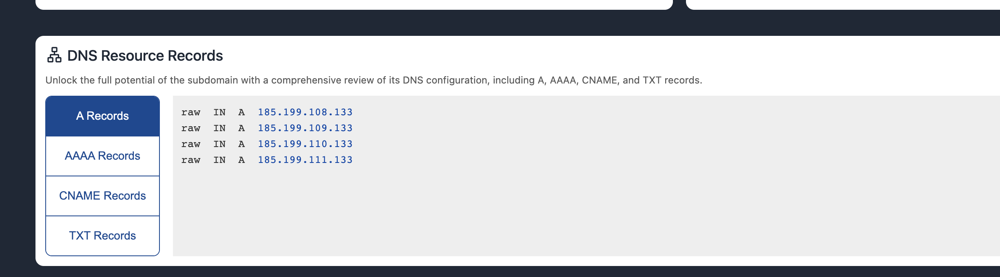
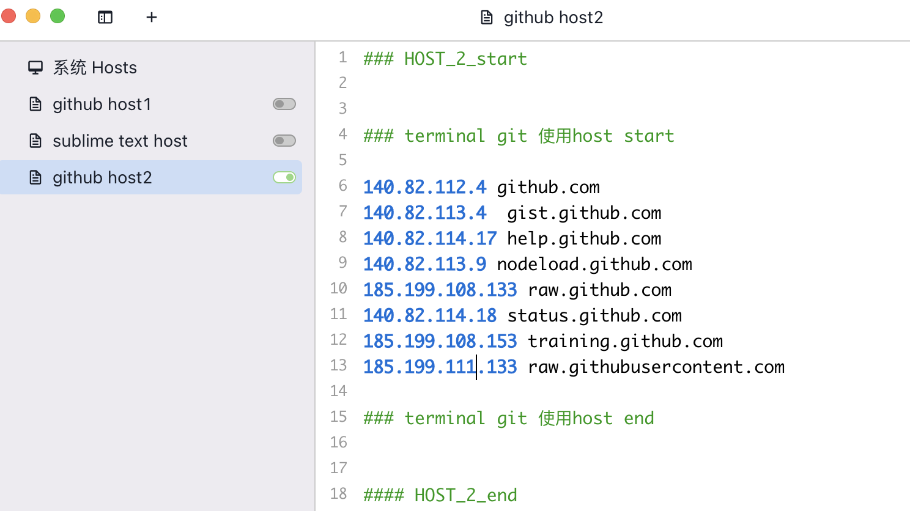

# 解决 Terminal 无法 访问 github及其他网站问题

## 1. host

## 1.1 shell

```shell
sudo /etc/hosts # 进入hosts 修改 网站地址映射
```

## 1.2 host 软件 SwitchHosts


## 2. 查看最新地址映射

## 2.1 查看网址

```bash
https://sites.ipaddress.com
```

## 2.2 输入查看网址


## 2.3 （8.14 23）  raw.github.com 最新ip





## 2.4 更新host

